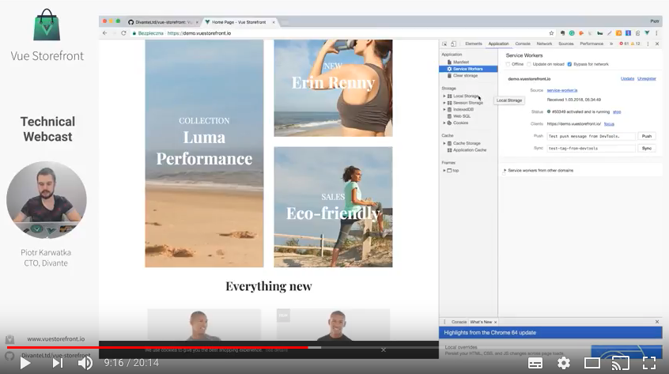
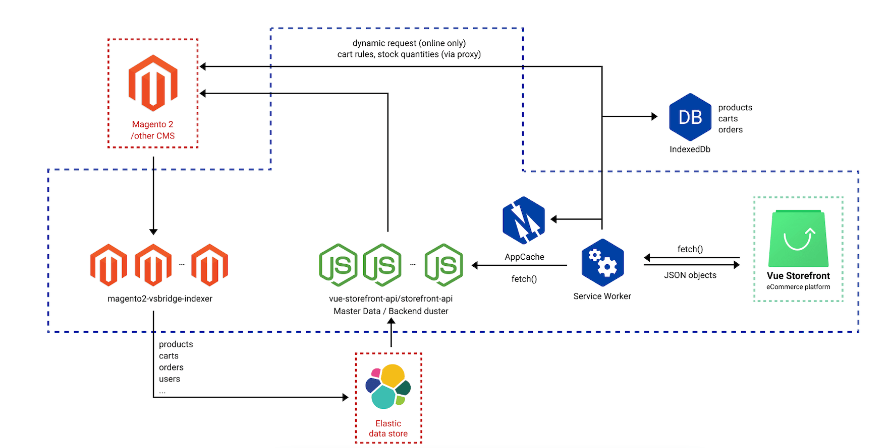

</img>

# Vue Storefront - headless PWA for any eCommerce

Vue Storefront is a standalone PWA storefront for your eCommerce, possible to connect with any eCommerce backend (eg. Magento, <a href="https://github.com/DivanteLtd/coreshop-vsbridge">Pimcore/CoreShop</a>, [BigCommerce](https://github.com/DivanteLtd/bigcommerce2vuestorefront), Prestashop or Shopware) through the API.

Vue Storefront is and always will be in the open source. Anyone can use and support the project, we want it to be a tool for the improvement of the shopping experience.
The project is in the **production ready** phase.

**Important note to developers:** From 1.0RC we started using [develop](https://github.com/DivanteLtd/vue-
storefront/tree/develop) branch for nightly builds (contains all new features) and [master](https://github.com/DivanteLtd/vue-storefront/tree/master) branch for stable. Please make sure you're working on right branch. Please take a look at [Contributing guidelines](https://github.com/DivanteLtd/vue-storefront/blob/master/CONTRIBUTING.md).

If you're new and need some guidance feel free to visit out [forum](https://forum.vuestorefront.io/) or reach anyone from the core team on our slack:
- `@Filip Rakowski` (frontend, architecture and best practices related stuff)
- `@pkarw` (integrations and backend related stuff)
- `@ptomczyk` (frontend related stuff)

Want to invest some time in building the future of eCommerce? we are looking for core team members willing to help us make VS even more awesome. Interested - contact `@Filip Rakowski` on slack

**We are looking for Contributors and Designer willing to help us in the solution development.**

See the ideas behind Vue Storefront [here](https://www.slideshare.net/FilipRakowski/vue-storefront-basics)

**Read [contribution rules](https://github.com/DivanteLtd/vue-storefront/blob/master/CONTRIBUTING.md) before making any pull request. Pull request that doesn't meet these requirements will not be merged**

PS: Check [StorefrontUI](https://github.com/DivanteLtd/storefront-ui/) - our UI library for eCommerce.

## See it in action

<table>
  <tbody>
    <tr>
      <td align="center" valign="middle">
        
      </td>
      <td align="left" valign="top">
        Try out our open demo and if you like it <strong>first give us some star on Github ★</strong> and then contact us on <a href="https://slack.vuestorefront.io">Slack</a> or via contributors@vuestorefront.io.    This demo site is connected to <a href="http://demo-magento2.vuestorefront.io">Magento 2.2</a> with shopping carts and users synchronization so You can make an order (which unfortunately won't be shipped ;P).   If You like to see Magento 1 integration demo please <a href="https://vuestorefront.io">do contact us</a>.
      </td>
    </tr>
  </tbody>
</table>

## Video demo

## Technical Webcast #1 - demo and the architecture

- [Read on how to integrate it with Magento2](https://medium.com/@piotrkarwatka/vue-storefront-how-to-install-and-integrate-with-magento2-227767dd65b2), [Read how to create Vue Storefront theme](https://medium.com/@frakowski/developing-themes-in-vue-storefront-backend-agnostic-ecommerce-pwa-frontend-part-1-72ea3c939593),
- [Read the interviews with authors of first production deployments](https://medium.com/@piotrkarwatka/vue-storefront-on-production-interview-with-gogetgold-com-developers-71e4b48ef996)

## Is it production ready?

Yes! There are more than 10 implementations happening right now and many live shops (check [awesome Vue Storefront list](https://github.com/frqnck/awesome-vue-storefront)).

## Join the community on Slack

If you have any questions or ideas feel free to join our slack: https://vuestorefront.slack.com via [invitation link](https://join.slack.com/t/vuestorefront/shared_invite/enQtMzA4MTM2NTE5NjM2LTI1M2RmOWIyOTk0MzFlMDU3YzJlYzcyYzNiNjUyZWJiMTZjZjc3MjRlYmE5ZWQ1YWRhNTQyM2ZjN2ZkMzZlNTg)

## Roadmap

[Here](https://github.com/DivanteLtd/vue-storefront/milestones) you can find the accepted roadmap for current milestone and what you can expect with next release.

#### Roadmap planning
[Here](https://github.com/DivanteLtd/vue-storefront/projects/3) you can vote for feature requests and see which ones were accepted. The most upvoted ones will be added to the next milestones. You can also join the slack channel `#roadmap-planning` where we discuss the next milestones.

The process of adding new features to the roadmap looks like this:
1. You create an issue and label it as `feature request`.
2. One of VS Core team verifies the feature request and if the explanation is clear, it is added to the `Roadmap` project so it's visible in the board.
3. Now people can vote for this feature to be added into next milestone with `thumb up` emoji.
4. Feature requests with the biggest popularity will be added into next milestones.

We are planning 1-2 milestones ahead. Our milestones are based on requirements from community, partners and production implementations.

Please note that bugfixes are treated separately and in most cases added to the milestones immediately.

[Check the feature list of 1.0](https://divanteltd.github.io/vue-storefront/guide/basics/feature-list.html).

If youd like to take part in roadmap planning feel free to join #roadmap-planning channel on our slack

## Documentation + table of contents

The documentation is always THE HARDEST PART of each open source project! But we're trying hard.

**Please find out what we've already managed to prepare:** [available on Github Pages](https://divanteltd.github.io/vue-storefront/). Please note that new docs are still Work In Progress and will be successfully updated. You can find them also under the `docs` folder.

You can find some tutorials and explanations on our [YouTube channel](https://www.youtube.com/channel/UCkm1F3Cglty3CE1QwKQUhhg)

### Installation

- [Installing on Linux/MacOS](https://divanteltd.github.io/vue-storefront/guide/installation/linux-mac.html)
- [Installing on Windows](https://divanteltd.github.io/vue-storefront/guide/installation/windows.html)
- [How to install and integrate with Magento2](https://divanteltd.github.io/vue-storefront/guide/installation/magento.html)
- [Production setup](https://divanteltd.github.io/vue-storefront/guide/installation/production-setup.html)

### Basics

- [Project structure](https://divanteltd.github.io/vue-storefront/guide/basics/project-structure.html) - good for introduction (outdated, we are working on interactive explorer :) )
- [Configuration file explained](https://divanteltd.github.io/vue-storefront/guide/basics/configuration.html)
- [Vue Storefront Modules](https://divanteltd.github.io/vue-storefront/guide/modules/introduction.html)
- [Contribution and issue reporting guideness](https://divanteltd.github.io/vue-storefront/guide/basics/contributing.html)
- [FAQ / Receipes](https://divanteltd.github.io/vue-storefront/guide/basics/recipes.html#problem-starting-docker-while-installing-the-vue-storefront)
- [Feature list](https://divanteltd.github.io/vue-storefront/guide/basics/feature-list.html)
- [TypeScript Action Plan](https://divanteltd.github.io/vue-storefront/guide/basics/typescript.html)
- [GraphQL Action Plan](https://divanteltd.github.io/vue-storefront/guide/basics/graphql.html)
- [SSR Cache](https://divanteltd.github.io/vue-storefront/guide/basics/ssr-cache.html)
- [Google Accelerated Mobile Pages](https://divanteltd.github.io/vue-storefront/guide/basics/amp.html)

### Vue Storefront core and themes

- [Working with themes](https://divanteltd.github.io/vue-storefront/guide/core-themes/themes.html)
- [Layouts and advanced output operations](https://divanteltd.github.io/vue-storefront/guide/core-themes/layouts.html)
- [Working with Vue Storefront core components](https://divanteltd.github.io/vue-storefront/guide/core-themes/core-components.html)
- [Working with UI Store (interface state)](https://divanteltd.github.io/vue-storefront/guide/core-themes/ui-store.html)
- [Working with translations](https://divanteltd.github.io/vue-storefront/guide/core-themes/translations.html)
- [Working with Service Workers](https://divanteltd.github.io/vue-storefront/guide/core-themes/service-workers.html)
- [Working with Webpack](https://divanteltd.github.io/vue-storefront/guide/core-themes/webpack.html)
- [Working with plugins](https://divanteltd.github.io/vue-storefront/guide/core-themes/plugins.html)

Tutorial series on creating themes for Vue Storefront:

- [Creating themes in Vue Storefront (part 1 — understanding Vue Storefront core)](https://medium.com/@frakowski/developing-themes-in-vue-storefront-backend-agnostic-ecommerce-pwa-frontend-part-1-72ea3c939593)

### Data in Vue Storefront

- [Working with data](https://divanteltd.github.io/vue-storefront/guide/data/data.html#local-data-store)
- [Working with Vuex](https://divanteltd.github.io/vue-storefront/guide/vuex/introduction.html)
- [ElasticSearch data formats](https://divanteltd.github.io/vue-storefront/guide/data/elasticsearch.html)
- [Data Migrations for ElasticSearch](https://divanteltd.github.io/vue-storefront/guide/data/data-migrations.html)
- [ElasticSearch Queries](https://divanteltd.github.io/vue-storefront/guide/data/elastic-queries.html)
- [Database tool](https://divanteltd.github.io/vue-storefront/guide/data/database-tool.html)
- [Adding Custom Entity Types](https://divanteltd.github.io/vue-storefront/guide/data/entity-types.html)

### Integrations

- [Vue Storefront + Magento](https://github.com/DivanteLtd/mage2vuestorefront)
- [Vue Storefront + Magento 1.9](https://github.com/DivanteLtd/magento1-vsbridge), [Magento 1.9 native indexer](https://github.com/DivanteLtd/magento1-vsbridge-indexer)
- [Vue Storefront + with Magento checkout](https://github.com/Vendic/magento2-external-checkout)
- [Vue Storefront + Shopware6](https://github.com/DivanteLtd/shopware2vuestorefront)
- [Vue Storefront + Epi Server](https://github.com/makingwaves/epi-commerce-to-vue-storefront)
- [Vue Storefront + Spree Commerce](https://github.com/spark-solutions/spree2vuestorefront)
- [Vue Storefront + Pimcore](https://github.com/DivanteLtd/coreshop-vsbridge)
- [Vue Storefront + Odoo ERP](https://github.com/cristian-g/vsf-odoo)
- [PoC: Vue Storefront + BigCommerce](https://github.com/DivanteLtd/bigcommerce2vuestorefront)
- [PoC: Vue Storefront + WooCommerce](https://github.com/DivanteLtd/woocommerce2vuestorefront)
- [Magento2 Product Reviews](https://divanteltd.github.io/vue-storefront/guide/integrations/reviews.html)
- [PayPal Payments integration](https://divanteltd.github.io/vue-storefront/guide/integrations/paypal-payments.html)
- [Direct prices sync with Magento](https://divanteltd.github.io/vue-storefront/guide/integrations/direct-prices-sync.html)
- [Tier prices sync with Magento](https://divanteltd.github.io/vue-storefront/guide/integrations/tier-prices-sync.html)
- [Shopping carts, totals and orders sync](https://divanteltd.github.io/vue-storefront/guide/integrations/totals-sync.html)
- [Vue Storefront 3rd party platforms integration boilerplate](https://github.com/DivanteLtd/vue-storefront-integration-boilerplate) - this is the API You should implement to integrate 3rd party platform
- [Magento2 MultiStore support](https://divanteltd.github.io/vue-storefront/guide/integrations/multistore.html)

### 'Default theme' contribution rules

- [Working with stylesheets (CSS)](https://divanteltd.github.io/vue-storefront/guide/core-themes/stylesheets.html)

## Awesome projects related to Vue Storefront

Check [Vue Storefront Awesome](https://github.com/frqnck/awesome-vue-storefront)

## The business challenges

Vue Storefront was created to solve a set of key business challenges from the world of the shopping experience. Our goal for the application is to provide the solution with:

- The ultrafast front-end for the store - with the PWA approach we can now render the catalog of products within milliseconds;
- The endurance for traffic overloads on the store;
- The off-line shopping capabilities;
- The smooth shopping experience close to the user experience from the native mobile applications;
- The all-in-one front-end for desktop and mobile screens with no necessity for maintaining 3 or more applications for different touchpoints (web browser, Android, iOS etc.).
- Rapid development without architecture limitations.

## The technology

Vue Storefront was built as an all-in-one front-end for eCommerce. For providing the best performance we decided to use Vue.js as a front-end library, Node.js + Express (and maybe GraphQL support) as a server-API, Elastic Search as a database of products and full PWA/off-line support.
Here you can read more about the proof of concept for [Vue Storefront connected with Magento2](https://www.linkedin.com/pulse/magento2-nosql-database-pwa-support-piotr-karwatka).

Besides a big improvement for the shopping experience, we also want to create a great code base for every developer who needs to work on a front-end application for the eCommerce.

## The architecture

## The design

The application is prepared to be fully customized in design through the theming system.
With the current version we work on raw, basic template of typical eCommerce for a fashion industry.
In the project we used [Material Icons](https://github.com/google/material-design-icons).

Here you can read more about the process of [designing PWA for eCommerce](https://www.linkedin.com/pulse/designing-pwa-ecommerce-karl-bzik/).

The design is available in open source in the Figma file format under the URL https://www.figma.com/file/VKyqbHFI55TKIKcQlFLiVpVF/Vue-Storefront-Open-Source.

## Other platforms
Vue Storefront is platform agnostic which means it can be connected to virtually any CMS. Please take a look at [Pimcore bridge](https://github.com/DivanteLtd/coreshop-vsbridge) to give you an idea of how other platforms can be connected. Any support for integrating Prestashop, Shopify ... - much appreciated.

## The license

Vue Storefront source code is completely free and released under the [MIT License](https://github.com/DivanteLtd/vue-storefront/blob/master/LICENSE).

## Contributing

If you like the idea behind Vue Storefront and want to become a contributor - do not hesitate and check our [list of the active issues](https://github.com/DivanteLtd/vue-storefront/issues) or contact us directly via contributors@vuestorefront.io.

If you have discovered a 🐜 or have a feature suggestion, feel free to create an issue on Github.

## Workshops

If you like our project and would like to learn more on how to create Progressive Web Apps you can ask us for a dedicated workshop at your office! Conducted by Vue Storefront core contributors! All the profits are used for supporting Vue Storefront development. [Learn more](https://products.divante.co/vuestorefront/)

## Support us!

**Vue Storefront is and always will be Open Source, released under MIT Licence.**

Most of the core team members, VS contributors and contributors in the ecosystem do this open source work in their free time. If you use Vue Storefront for a serious task, and you'd like us to invest more time on it, you can donate the project! You can support us in various ways:

- **Contribute** - this is how the Core Team is supporting the project!
- **Evangelize** - tweet about us, take some speaking slot at tech conference etc.
- **Sponsor** - if you're doing serious business on VS maybe You would like to donate the project and put your logo in here?

This is how we will use the donations:

- Allow the core team to work on VS
- Thank contributors if they invested a large amount of time in contributing
- Support projects in the ecosystem that are of great value for users
- Infrastructure cost
- Fees for money handling

**If you would like to support us please just let us know: contributors@vuestorefront.io**

## Partners

Vue Storefront is a Community effort brought to You by our great Core Team and supported by the following companies.

<table>
  <tbody>
    <tr>
      <td align="center" valign="middle">
        
      </td>
      <td align="center" valign="middle">
          
      </td>
      <td align="center" valign="middle">
     
      </td>
      <td align="center" valign="middle">
       
      </td>
    </tr>
    <tr>
      <td align="center" valign="middle">
        
      </td>
      <td align="center" valign="middle">
        
      </td>
      <td align="center" valign="middle">
          
      </td>
      <td align="center" valign="middle">
        
      </td>
      <td align="center" valign="middle">
   
      </td>
    </tr>
    <tr>
      <td align="center" valign="middle">
         
      </td>
       <td align="center" valign="middle">
    
      </td>
      <td align="center" valign="middle">
        
      </td>
      <td align="center" valign="middle">
        
      </td>
      <td align="center" valign="middle">
        
      </td>
    </tr>
    <tr>
        <td align="center" valign="middle">
        
      </td>
      <td align="center" valign="middle">
        
      </td>
      <td align="center" valign="middle">
        
      </td>
      <td align="center" valign="middle">
        
      </td>
      <td align="center" valign="middle">
        
      </td>
    </tr>
     <tr>
       <td align="center" valign="middle">
        
      </td>
         <td align="center" valign="middle">
        
      </td>
      <td align="center" valign="middle">
           
      </td>
  <td align="center" valign="middle">
        
      </td>
        <td align="center" valign="middle">
        
      </td>
    </tr>
     <tr>
       <td align="center" valign="middle">
        
      </td>
         <td align="center" valign="middle">
        
      </td>
        <td align="center" valign="middle">
        
      </td>
      <td align="center" valign="middle">
        
      </td>
      <td align="center" valign="middle">
       
      </td>
    </tr>
     <tr>
       <td align="center" valign="middle">
        
      </td>
   <td align="center" valign="middle">
        
      </td>
       <td align="center" valign="middle">
        
</td>
  <td align="center" valign="middle"> 

</td>
<td align="center" valign="middle">
</td>
    </tr>
         <tr>
     <td align="center" valign="middle"> 

</td>
  <td align="center" valign="middle"> 

</td>
     <td align="center" valign="middle"> 
  
</td>
  <td align="center" valign="middle"> 

</td>
  <td align="center" valign="middle"> 

</td>
    </tr>
<tr>
      <td align="center" valign="middle"> 

</td>
  <td align="center" valign="middle"> 

</td>
      <td align="center" valign="middle"> 

</td>
    <td align="center" valign="middle"> 

</td>
   <td align="center" valign="middle"> 

</td>
    </tr>
    <tr>
      <td align="center" valign="middle"> 
    
</td>
  <td align="center" valign="middle"> 

</td>
      <td align="center" valign="middle"> 

</td>
    <td align="center" valign="middle"> 

</td>
   <td align="center" valign="middle"> 

</td>
    </tr>
      <tr>
      <td align="center" valign="middle"> 

</td>
  <td align="center" valign="middle"> 

</td>
     <td align="center" valign="middle"> 

</td>
    <td align="center" valign="middle"> 

</td>
   <td align="center" valign="middle"> 

</td>
    </tr>
  </tbody>
</table> 

Partners are encouraged to support the project in various ways - mostly by contributing the source code, marketing activities, evangelizing and of course - implementing the production projects. We do support our partners by dedicated contact channels, workshops and by sharing the leads from merchants interested in implementations.

If you like to become our Partner just let us know via contributors@vuestorefront.io.

## The screenshots

