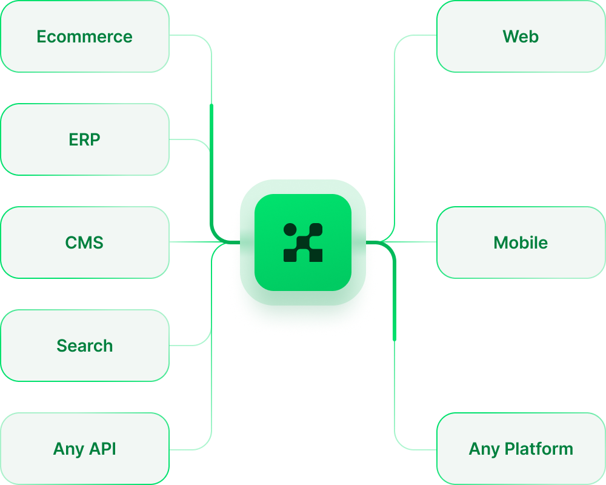
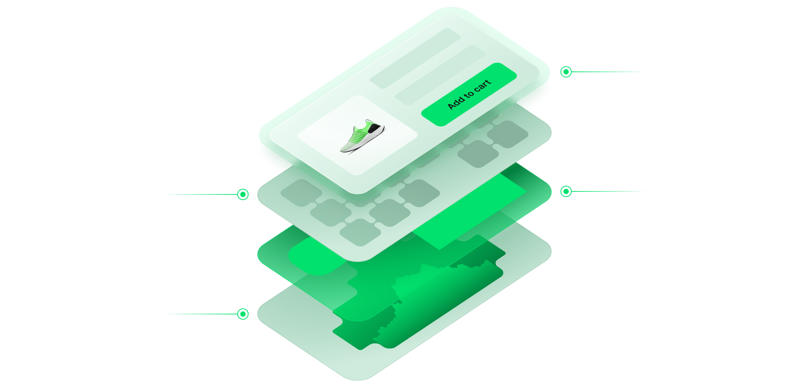

 

<h3 align="center">
  <strong>An ecosystem of developer tools that accelerate and simplify building eCommerce Storefronts</strong>
</h3>

    Fully customizable, backend-agnostic with     <a href="https://alokai.com/live-projects/?utm_source=github.com&utm_medium=referral&utm_campaign=readme">
          3500+ Live Stores!
    </a>

     <a href="https://docs.alokai.com/">
        Documentation
    </a>

  
    
    
    

    
    
    
    

Alokai is your guide to the composable commerce world that simplifies building, deploying, and monitoring ecommerce frontends.

- **Works with any backend**. Alokai is compatible with any backend that has an API. In addition its already integrated with many of them! [See the list of available integrations](https://docs.vuestorefront.io/v2/integrations/#ecommerce-platforms).

- **Working eCommerce Storefront** - Alokai delivers fully-working eCommerce storefront integrated with your favourite stack

- **Fully customizable**. Build your application with pre-installed [Storefront UI](https://github.com/vuestorefront/storefront-ui) - components library designed for eCommerce, or build your own theme from scratch.

## **What you get out-of-the-box** 📦

  

- **Nuxt.js** - the Vue.js framework used to build the application
- **Next.js** - the React.js framework used to build the application
- **Alokai Theme** - fully functional eCommerce theme based on the Storefront UI library
- **Storefront UI** - the Vue.js UI components library used to build the frontend application
- **Alokai Middleware** - the Express.js server used to connect the frontend application with the eCommerce platform and other Integrations

## **Our Tech Stack** 🛠

- [Vue.js](https://vuejs.org/)
- [Nuxt.js](https://nuxtjs.org/)
- [React.js](https://react.dev/)
- [Next.js](https://nextjs.org/)
- [TypeScript](https://www.typescriptlang.org/)
- [Storefront UI](https://storefrontui.io/)
- [Express.js](https://expressjs.com/)
- [GraphQL](https://graphql.org/)
- [Yarn](https://yarnpkg.com/)
- [Docker](https://www.docker.com/)
- [Jest](https://jestjs.io/)

## **Contribution** 🤝

Alokai is an Open Source project and we encourage everyone to help us making it better. If you are interested in contributing to the project, please read our [Contributing Guide](https://github.com/vuestorefront/.github/blob/main/CONTRIBUTING.md) and [Code of Conduct](https://github.com/vuestorefront/.github/blob/main//CODE_OF_CONDUCT.md).

If you have any questions about contributing, please join our [Discord server](https://discord.vuestorefront.io/) - we are happy to help you!

Discovered a 🐜 or have feature suggestion? Feel free to [create an issue](https://github.com/vuestorefront/vue-storefront/issues/new/choose) on Github.

### **Follow us on Social Media**

## **Careers** 👩‍💻👨‍💻

We are growing and we are looking for talented people to join our team. If you are interested in working with us, please check our [Careers page](https://vuestorefront.io/careers).

## **#StandWithUkraine** 🇺🇦

We at Alokai express our support for the people of Ukraine and their right to live in a free and democratic country. We stand with Ukraine and we will continue to support the Ukrainian community.

