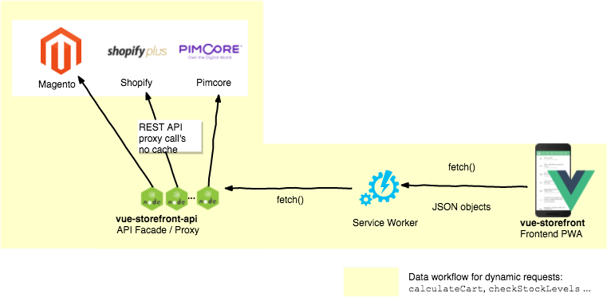
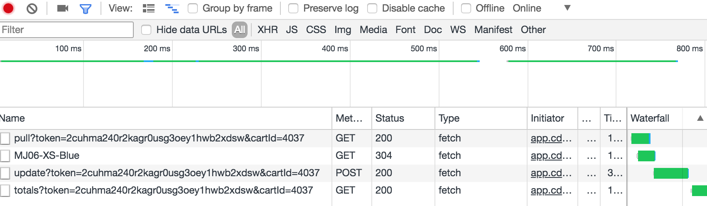

# Totals and cart sync with Magento

One of the key principles of the Vue Storefront architecture is full scalability. 
We've achieved very good performance results by not relying on the Magento2/CMS API performance. By implementing the "Divide and conquer" rule we created the middleware and external data store for the catalog using ElasticSearch.

That was our first goal, but the second was to provide the full data safety ad realibility to the business - so we never encounter situations like the stocks and prices are desynchronized or the discount rules haven't got applied. It can ruin the business, no matter the performance :)

## Cart and Totals sync

This is the reason that we've got the direct Shopping cart sync with Magento2. Whenever the user add something to the cart we're checking the stock and synchronize the local in-browser cart with CMS.



In the backward direction we're always getting the current Totals - after applied Magento shopping cart rules and discounts to display the proper data to the user. This synchronization is implemented to still keep the Vue Storefront platform agnostic - `vue-storefront-api` layer is in charge of translating the platform specific API formats to the Vue Storefront general data abstraction.



As you can see the synchronization works like a sequence of the network calls to the `vue-storefront-api`:
1. The `pull` method is executed to get the current user's Magento cart
2. On the client side the logic is checking which elements: are new on the client side, server side, removed
3. In our case one element didn't exists server side so we're calling an `update` method to add it to the server cart
4. Then we call `totals` to get the current row values and general totals for the cart.

## How to maket this feature work?

By default cart and totals sync is disbaled. To make it work You just need to follow the steps described bellow:

1. Please generate the Magento2 API accesses. In our first tutorial there is an [explaination on how to do this](https://medium.com/@piotrkarwatka/vue-storefront-how-to-install-and-integrate-with-magento2-227767dd65b2).

2. Use the oauth keys from the previous step to properly configure the `vue-storefront-api` data layer (it should've been installed locally on your computer / server). To do so you need to modify the `conf/local.json` and paste the authorization data to the `magento2.api` section:

```json
"magento2": {
		"url": "http://magento2.demo-1.xyz.com",
		"imgUrl": "http://localhost:8080/media/catalog/product",
		"magentoUserName": "",
		"magentoUserPassword": "",
		"httpUserName": "",
		"httpUserPassword": "",
		"api": {
			"url": "http://demo-magento2.vuestorefront.io/rest",
			"consumerKey": "byv3730rhoulpopcq64don8ukb8lf2gq",
			"consumerSecret": "u9q4fcobv7vfx9td80oupa6uhexc27rb",
			"accessToken": "040xx3qy7s0j28o3q0exrfop579cy20m",
			"accessTokenSecret": "7qunl3p505rubmr7u1ijt7odyialnih9"		
		}
	},
```

Please check the [`conf/default.json`](https://github.com/DivanteLtd/vue-storefront-api/blob/master/config/default.json) for the reference.

3. Then move to your `vue-storefront` installation catalog and modify the `config/local.json`. You need to change the `cart` section to switch the `synchronize` and `synchronize_totals` flags to true:

```json
   "cart": {
      "synchronize": false,
      "synchronize_totals": false,
      "create_endpoint": "http://localhost:8080/api/cart/create?token={{token}}",
      "updateitem_endpoint": "http://localhost:8080/api/cart/update?token={{token}}&cartId={{cartId}}",
      "deleteitem_endpoint": "http://localhost:8080/api/cart/delete?token={{token}}&cartId={{cartId}}",
      "pull_endpoint": "http://localhost:8080/api/cart/pull?token={{token}}&cartId={{cartId}}",
      "totals_endpoint": "http://localhost:8080/api/cart/totals?token={{token}}&cartId={{cartId}}"
    },
```

Please chceck the [`conf/default.json`](https://github.com/DivanteLtd/vue-storefront/blob/1302ed84561a514beb8c35e45ae1d0aa4dc9f74a/config/default.json#L8) for a reference.


## Prices sync

The last missing block is the catalog prices sync. This can be very easily enabled using the feature called Dynamic Prices. Please check [Dynamic Prices howto](https://github.com/DivanteLtd/vue-storefront/blob/master/doc/Direct%20Prices.md) to switch this feature on.
