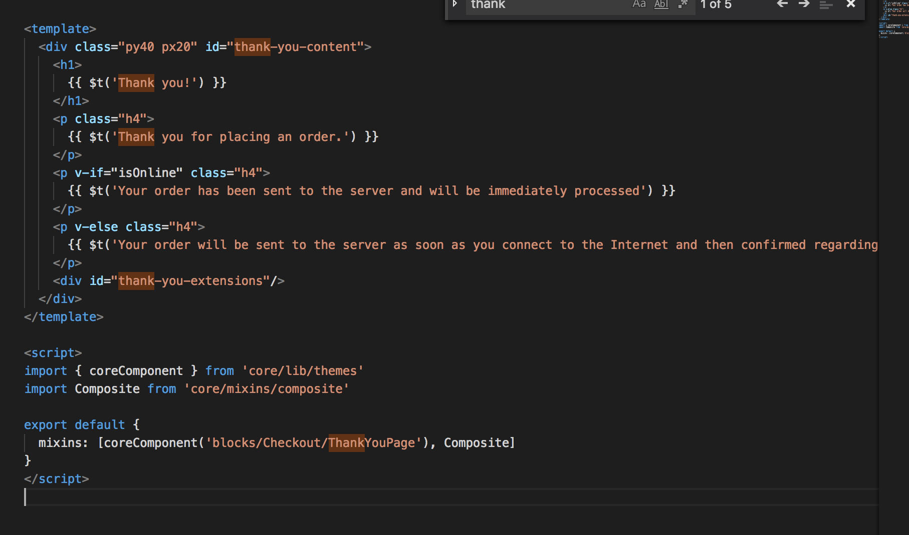
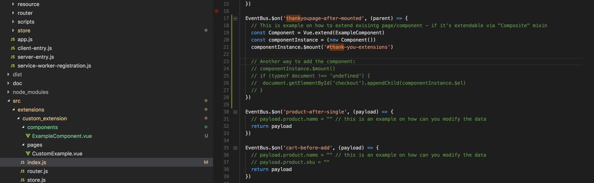
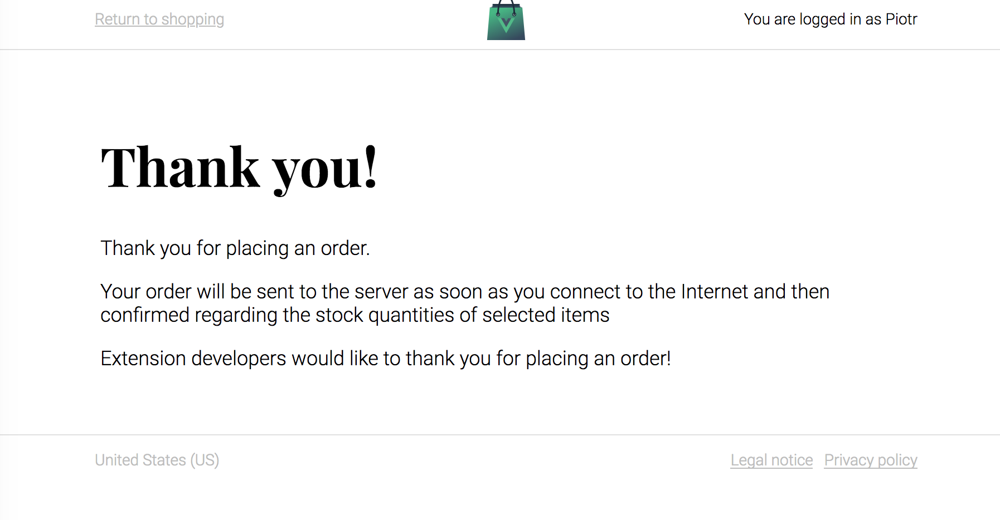

# Extending UI from extensions

Although the general rule is that all the UI modifications [shold be done with Themes](https://github.com/DivanteLtd/vue-storefront/blob/master/doc/themes/Working%20with%20themes.md) there are several use cases when the extensions developer need to modify the UI:

 * payment method extension is adding the "Paypal checkout" button to the Checkout,
 * google tracking code is injected into exsiting pages
 * ...

For such cases we provided the mechanism called "Composite". All the core components that have [Composite]() in the "mixins" can be extended via event hooks.

Let's take an example - [custom_extension](https://github.com/DivanteLtd/vue-storefront/blob/master/src/extensions/custom_extension/index.js) which is extending the "Thank you page"

First, the "Thank You page" component is marked as "Composite":


By this single mixin the "Thank You page" component starts emiting the component lifecycle related events.

Here is the list of available events to hook:
```js
import EventBus from 'core/plugins/event-bus'

export default {
  beforeCreated () {
    const eventName = this.$options.name.toLowerCase() + '-before-created'
    console.log(eventName)
    EventBus.$emit(eventName, this)
  },
  created () {
    const eventName = this.$options.name.toLowerCase() + '-after-created'
    console.log(eventName)
    EventBus.$emit(eventName, this)
  },
  beforeMount () {
    const eventName = this.$options.name.toLowerCase() + '-before-mount'
    console.log(eventName)
    EventBus.$emit(eventName, this)
  },
  mounted () {
    const eventName = this.$options.name.toLowerCase() + '-after-mounted'
    console.log(eventName)
    EventBus.$emit(eventName, this)
  }

}
```

Then, within [the custom_extension](https://github.com/DivanteLtd/vue-storefront/blob/fd00bd3aec77524413da67b3c4eeb419b7c05594/src/extensions/custom_extension/index.js#L17) we're hooking to the Thank you page related event:



... and the result is as expected:



**Important note:** As Composite extensions mechanism currently is powered by the Events, the changes to the DOM extension developers provide are applied asynchronously which means **it cannot be used on the SSR pages** to modify the DOM. Otherwise it may cause the DOM / Virtual DOM mismatch.