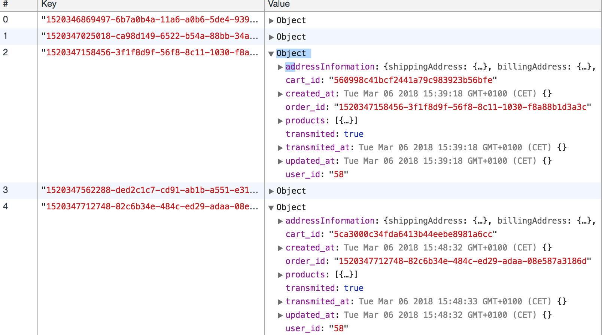

## How to get Magento2 order id after order sync

The [Magento2 integration regarding orders, totals and carts](https://github.com/DivanteLtd/vue-storefront/blob/master/doc/Totals%2C%20cart%2C%20orders%20sync%20with%20Magento.md) ensures that all the Vue Storefront data will be passed to Magento2 CMS.

But the process is async, the orders are queued and then in the background transfered to Magento2. So, the question is: is there a way to get the Magento2 Order Id back to the Vue Storefront?

Yes! You just need to call the `vue-storefront-api` endpoint for that:

```
curl -i http://localhost:8080/api/sync/order/1520347158456-3f1f8d9f-56f8-8c11-1030-f8a88b1d3a3c
```

The response format:
```
{ 
  "code":200,
   "result":
   {
      "platform_order_id":3,
      "transmited":true,
      "transmited_at":"2018-03-06T14:35:06.577Z"
   }
}
```

The `order/1520347158456-3f1f8d9f-56f8-8c11-1030-f8a88b1d3a3c` part is a `order_id` from the client's order stored in the `localForage` 


