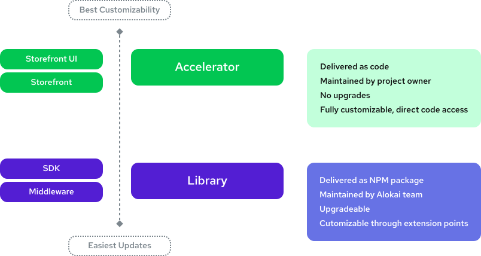
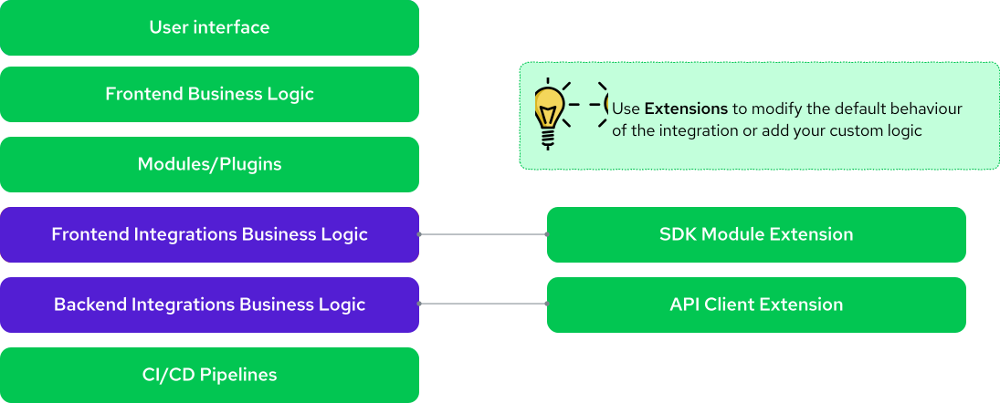

# Extensibility

::card{title="Learn extensibility in practice" icon="tabler:tool" }

#description
Learn how to customize Alokai Application in practical examples.

#cta
:::docs-button{to="/guides/customization-next-js"}
Go to customization guide
:::
::

We are in the eCommerce business more than we remember, and we know that different elements of eCommerce architecture need different levels of customization. To balance acceleration coming from simplification with the ability to build custom experiences, we grouped our products into two categories:

- <span class="text-primary-500 font-bold">White Box</span> - Accelerators that save you from generic and repetitive groundwork and provide direct access to the code. Once you set up the app, this becomes your own code.
- <span class="text-secondary-500 font-bold">Black Box</span> - libraries offering easy-to-use abstractions over previously complicated elements of headless architecture. They are customized through extension points that allow to alter default behaviour, add custom one or hook into application lifecycle.



Your Alokai project will be a mix of both. Let’s see how it translates to application layers:



The whole storefront layer is just a boilerplate. You have direct access to the source code. You can remove, edit and add components, hooks, pages, plugins, etc. There are no limitations because it's just code that you can access without any restrictions or abstractions.

Non-UI elements of third-party integrations are part of SDK and Middleware and do not expose their source code to the project. Most of their default behavior can be easily customized through extensions though.  

Let’s see how they work!

## Extending Integrations

Our integrations usually cover standard use cases in the most generic way, but it's very unlikely that the generic approach will fully match your business requirements. This is why we introdduced a flexible extensibility system that allows you to do things such as (but not limited to):
 
- Change/override out-of-the-box business logic
- Add completely new features
- Do something before or after specific method is called
- Modify the response and request parameters

You can safely assume that almost any part of the integration can be adjusted to your needs. Now, let's see how such extensibility look like on the high level. You can also jump to one of the deep dives:
::grid{:columns="2" class="mt-8"}
#section-1
:card{to="/sdk/advanced/extending-module" title="SDK Extensions" description="The SDK allows you to interact with the server middleware" icon="ri:terminal-box-fill"}
#section-2
:card{to="/middleware/guides/extensions" title="Middleware Extensions" description="This abstraction layer lets you connect different backends." icon="fa6-solid:layer-group"}
::

### Extending SDK

Each integration is represented on a client side as SDK Module. SDK Modules can be extended with Module Extensions. You declare it as a single object that you can later pass to the module object.

```jsx
// sapccExtension.js
export const sdkExtension = {
  // modify input params or a response
  interceptors: [],
  // add new methods not affected by interceptors
  utils: {},
  // add new methods affected by interceptors
  extend: {},
  // override existing methods
  override: {},
  // subscribe to methods
  subscribers: {}
};
```

```js
// sdk.js
import { initSDK, buildModule } from '@vue-storefront/sdk';
import { sapccModule, SAPCCModuleType } from '@vsf-enterprise/sapcc-sdk';
import { sdkExtension } from './sdkExtension';

const sdkConfig = {
  sapcc: buildModule(
      sapccModule, 
      { apiUrl: "http://localhost:8181/sapcc" }, 
      sdkExtension 
  ),
};

export const sdk = initSDK(sdkConfig);
```

### Extending Middleware

Same way as SDK Module is a client-side part of the integration, API Client is a server-side part of it. You can extend it in the same way.

```js
// middlewareExtension.js
export const middlewareExtension = {
  name: 'my-extension',
  // use separate anmespace for API methods, false by default
  isNamespaced: true,
  // add new or override existing methods
  extendApiMethods: {
    customMethod: (context, params) => { /* ... */ },
  },
  // extend Express instance
  extendApp: (app) => {  /* ... */
  },
  // hook into middleware lifecycle
  hooks: (req, res) => {
    return {
      beforeCreate: ({ configuration }) => configuration,
      afterCreate: ({ configuration }) => configuration,
      beforeCall: ({ configuration, callName, args }) => args,
      afterCall: ({ configuration, callName, args, response }) => response
    }
  }
}
```

```js
// middleware.config.js
import { middlewareExtension } from './middlewareExtension'

export const integrations = {
    sapcc: {
      // ...
      extensions: (extensions) => [ ...extensions, middlewareExtension]
    }
  }
}
```


<br />


