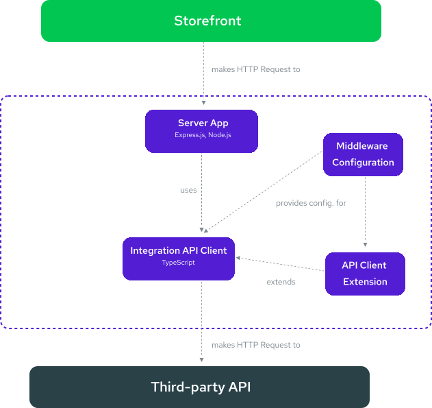

# Middleware

Alokai's **Server Middleware** is an Express.js application that provides a single place for you to connect to the multiple services that you need to run your storefront.

It acts as a layer between your frontend application and the various services that you need to connect to, such as a commerce backend, CMS, or payment gateway. 

Our different [integrations](/integrations) add onto the middleware to provide additional API Clients specific for a certain integration that you can interact with using the [SDK](/sdk).

## Features

::list{type="success"}
- Connect multiple services using different technologies and libraries
- Create and [extend](/middleware/guides/extensions) integrations to add new capabilities or modify their behavior
- Control of the requests sent to the integration platform and responses sent back to the Nuxt.js application
- Securely store credentials on the server without exposing them to the end-users of your application
- Improve site performance by moving logic to the server abd shipping less code to the browser
::

## Getting Started

If you're using our storefront, the middleware is set up for you. Our storefronts come with a middleware and frontend app already configured, so you can get started right away.

But if you're building your Alokai application from scratch, you'll need to set up the middleware to connect to your backend services.

::grid{:columns="2"}
#section-1
:card{to="/middleware/guides/extensions" title="See Available Storefronts" description="Get started with one of our ready-to-customize storefronts." icon="material-symbols:storefront"}
#section-2
:card{to="/middleware/guides/extensions" title="Start From Scratch" description="Set up your server middleware, configure it, and more." icon="gridicons:customize"}
::

## Architecture

The easiest way to explain the Server Middleware architecture is to base the explanation on the Alokai Integration context.

In the container, the server application uses the integration that can communicate with the external service provider (e.g. commerce backend). The integration can be extended by the integration extensions. Middleware config is provided for both integration and its extensions.

