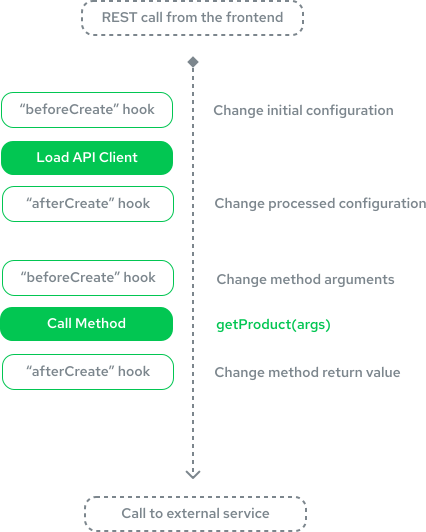

# Extending the Middleware

When developing your storefront, there will be times when you need to customize the way the middleware and integrations run. For example, you might want to add or edit a new API endpoint or even modify the Express.js application itself. Alokai's Server Middleware allows you to do this using extensions.

## Adding an extension

Extensions can be added to any integration in your `middleware.config.ts` file by creating an `extensions` function. This function receives an array of existing extensions as the only argument and has to return an updated array of extensions (with your extension added).

```js
export const integrations = {
  sapcc: {
    // ...
    extensions: (extensions) => [
      ...extensions, // don't forget to include existing extensions
      {
        name: 'extension-name',
        isNamespaced: `[true/false:default]`,
        extendApiMethods: { /* ... */ },
        extendApp: (app) => { /* ... */ },
        hooks: () => { /* ... */ }
      }
    ]
  }
}
```

## Creating an extension

You can define as many extensions as you want. Each extension has the following structure:

```js
const extension = {
  name: "extension-name",
  isNamespaced: `[true/false:default]`,
  extendApiMethods: {
    customMethod: (context, params) => {
      /* ... */
    },
  },
  extendApp: (app) => {
    /* ... */
  },
  hooks: (req, res) => {
    return {
      beforeCreate: ({ configuration }) => configuration,
      afterCreate: ({ configuration }) => configuration,
      beforeCall: ({ configuration, callName, args }) => args,
      afterCall: ({ configuration, callName, args, response }) => response,
    };
  },
};
```

- `name` - a unique name for your extension,
- `isNamespaced` - defines if the extension should be namespaced. Namespaced extensions are registered under `/{integration-name}/{extension-name}` extension of integration's namespace in opposition to non-namespaced extensions which are registered under `/{integration-name}` integration's namespace. Default value is `false`. Extensions without a namespace can potentially override existing endpoints, so it's recommended to use namespaced extensions whenever possible.
- `extendApiMethods` - overrides an integration's API Client to modify default behavior or add new API endpoints
- `extendApp` - gives you access to the Express.js app
- `hooks` - defines lifecycle hooks of API-client
  - `beforeCreate` - called before API-client creates a connection. It accepts an integration configuration as an argument and must return it as well. You can use it to modify the configuration or merge it with the default values,
  - `afterCreate` - similar to the previous function, but called after the connection has been created. It accepts an integration configuration as an argument and must return it as well. This hook is usually used for cleanup work after altering the configuration in `beforeCreate`,
  - `beforeCall` - called before each API-client function. Gives you access to the integration configuration, function name, and arguments. Can be used to modify the arguments based on the input parameters and must return them,
  - `afterCall` - called after each API-client function. Gives you access to the configuration, function name, arguments and response. Can be used to modify the response based on the input parameters and must return it.

## Lifecycle Hooks

Middleware extensions allow you to extend your Express.js server, register additional API endpoints, or hook into the
lifecycle of a request sent to a given Server Middleware integration from the application.



## Use Cases

### Adding an Endpoint

To register a new API endpoint, you can register a custom extension and use the `extendApiMethods` property. API
endpoints cannot be registered directly. Let's look at an example:

```ts
export const integrations = {
  sapcc: {
    // ...
    extensions: (extensions) => [
      ...extensions,
      {
        name: "example-extension",
        extendApiMethods: {
          baseSites: async (context) => {
            // Using integration's HTTP client to make a request to SAP Commerce Cloud backend
            // SAPCC integration is using `axios` as an HTTP client, so we want to retreive only the `data` property from the response.
            const { data } = await context.client.get("/basesites");
            return data;
          },
        },
      },
    ],
  },
};
```

All integrations can be extended, however, this example extends the SAP Commerce Cloud integration, to give more context about real-life usage. We registered `baseSites` in `extendApiMethods` which creates a new `/api/sapcc/baseSites` endpoint.

This method accepts two parameters:

- `context` - integration context which includes:
  - `config` - integration configuration
  - `client` - HTTP client used by the integration
  - `req` - HTTP request object
  - `res` - HTTP response object
  - `extensions` - extensions registered within an integration
  - `customQueries` - custom GraphQL queries registered within integration (used only with GraphQL)
  - `extendQuery` - helper function for handling custom queries (used only with GraphQL)
- `params` - parameters passed in the request's body

#### Using extension methods in the frontend

To call the extension endpoint, you should use the [middlewareModule](/sdk/getting-strated/middlewareModule).

First, you need to prepare the type definition for the extension methods. It will be necessary to pass this type to the `middlewareModule`. To do it, let's aggregate the extension methods in a single object:

```typescript [storefront-middleware/middleware.config.ts]
export const extensionMethods = {
  baseSites: async (context, params) => {
    const { data } = await context.client.get("/basesites");
    return data;
  },
};

export const integrations = {
  sapcc: {
    location: "@vsf-enterprise/sapcc-api/server",
    configuration: {
      // ...
    },
    extensions: (extensions) => [
      ...extensions,
      {
        name: "example-extension",
        extendApiMethods: {
          ...extensionMethods,
        },
      },
    ],
  },
};
```

Then, let's use the `WithoutContext` type helper to prepare the type of the endpoints created by the extension methods. As a good practice, it's recommended to use a separate file for the types used in the middleware configuration:

```typescript [storefront-middleware/types.ts]
import { type WithoutContext } from "@vue-storefront/middleware";
import { extensionMethods } from "./middleware.config";

export { type Endpoints as SapccEndpoints } from "@vsf-enterprise/sapcc-api";
export type ExtensionEndpoints = WithoutContext<typeof extensionMethods>;
```

Finally, pass the `ExtensionEndpoints` type the `middlewareModule` type parameter:

::code-group

```typescript[Next.js]
import { CreateSdkOptions, createSdk } from "@vue-storefront/next";
import { SapccEndpoints, ExtensionEndpoints } from "storefront-middleware/types";

const options: CreateSdkOptions = {
  middleware: {
    apiUrl: "http://localhost:4000",
  },
};

export const { getSdk } = createSdk(
  options,
  ({ buildModule, middlewareUrl, middlewareModule, getRequestHeaders }) => ({
    sapcc: buildModule(middlewareModule<SapccEndpoints & ExtensionEndpoints>, {
      apiUrl: middlewareUrl + "/sapcc",
      defaultRequestConfig: {
        headers: getRequestHeaders(),
      },
    }),
  })
);
```

```typescript[Nuxt.js]
import { SapccEndpoints, ExtensionEndpoints } from "storefront-middleware/types";

export default defineSdkConfig(
  ({ buildModule, middlewareUrl, middlewareModule getRequestHeaders }) => ({
    sapcc: buildModule(middlewareModule<SapccEndpoints & ExtensionEndpoints>, {
      apiUrl: middlewareUrl + "/sapcc",
      defaultRequestConfig: {
        headers: getRequestHeaders(),
      },
    }),
  })
);
```

```typescript[Other]
import { initSDK, buildModule, middlewareModule } from "@vue-storefront/sdk";
import { SapccEndpoints, ExtensionEndpoints } from "storefront-middleware/types";

const { sapcc } = initSDK({
  sapcc: buildModule(middlewareModule<SapccEndpoints & ExtensionEndpoints>, {
    apiUrl: "http://localhost:8181/sapcc",
  }),
});

export { sapcc };
```

::

Now, the SDK is aware of the extension methods, and you can call them as follows:

```typescript
const baseSites = await sdk.sapcc.baseSites();
```

### Creating a configurable extension

In more complex cases, you might want to create an extension that can be configured.

To avoid code duplication, you can prepare a closure that will create a new extension with a given configuration.

Using closures is a recommended way to create a configurable extension. It allows you to reuse the same logic in multiple integrations and keeps your code clean and maintainable.

```ts
const createCacheControlExtension = (config: Record<string, string>) => {
  return {
    name: "cache-control-extension",
    hooks(req, res) {
      return {
        afterCall({ response, callName }) {
          if (req.method !== "GET") {
            console.log("[CACHING] It's not a GET request, skipping caching");
            return response;
          }

          if (res.getHeader("set-cookie")) {
            console.log(
              "[CACHING] Response containing Set-Cookie header, skipping caching"
            );
            return response;
          }

          if (callName in config) {
            res.set("Cache-Control", config[callName]);
          }

          return response;
        },
      };
    },
  };
};
```

Then, you can use it in your `middleware.config.ts` file:

```ts
export const integrations = {
  sapcc: {
    // ...
    extensions: (extensions) => [
      ...extensions,
      createCacheControlExtension({
        searchProducts: "public, max-age=3600",
      }),
    ],
  },
  contentful: {
    // ...
    extensions: (extensions) => [
      ...extensions,
      createCacheControlExtension({
        getEntries: "public, max-age=3600",
      }),
    ],
  },
};
```
