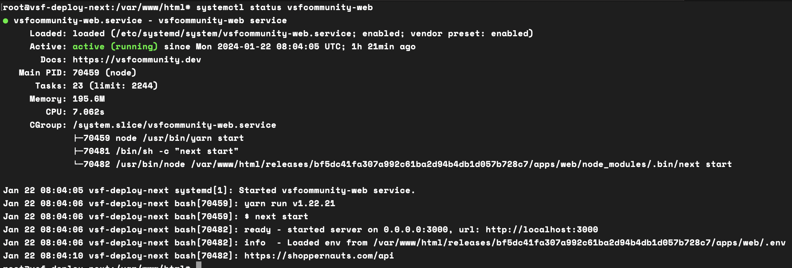
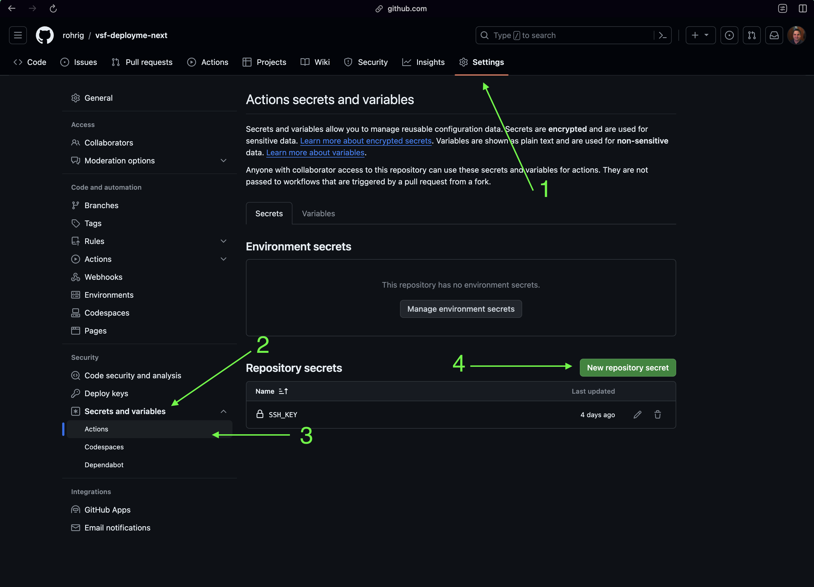
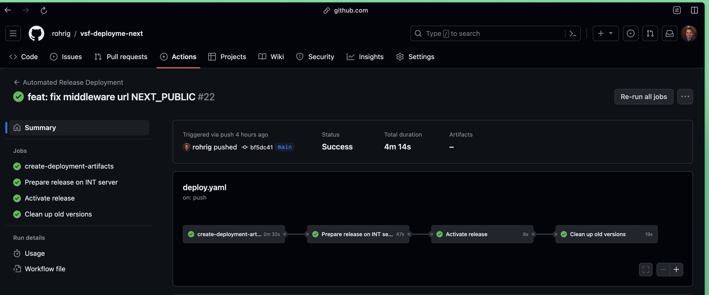

# OSS Deployment Guide

In this guide we'll show you how to deploy an Open Source Alokai application to a production server. 

::tip
This guide is for Open Source Applications. If you have Enterprise support, please refer to the [Cloud Deployment Guide](/cloud) or see the [Enterprise Onboarding Course](https://academy.alokai.com/courses/enterprise-onboarding-course).
::

## Prerequisites
::list{type="success"}
- A linux server with SSH Access
- A domain name and the ability to point it to your server's IP address
::

## References
::grid{:columns='3'}
#section-1
:card{to="https://github.com/rohrig/vsf-deployme-next" title="Reference Repo" description="See this guide live in action" icon="ri:book-2-fill"}

#section-2
:card{to="https://shoppernauts.com" title="Demo" description="A demo site deployed via this." icon="material-symbols:storefront"}
::

::tabs{:titles='["Prepare Server",  "Github Secrets and Variables","Deployment Script"]' class="mt-8"}

#tab-1
## Prepare Server

### Update Server
The command `apt-get update` is used to update the package index files on the system, which contain information about available packages and their versions.
```bash
apt-get update
```

### Install Node.js
```bash
curl -fsSL https://deb.nodesource.com/setup_18.x | bash - &&apt-get install -y nodejs
```
### ensure node is installed
```bash
node -v 
```
### Install yarn
```bash
npm install --global yarn
```
### ensure yarn is installed
```bash
yarn -v
```

### Install nginx
```bash
apt-get install nginx
```

### Install certbot:

- Install snapd:
```bash
apt-get install snapd
```
- Install certbot:
```bash
snap install --classic certbot
```
Link certbot to your path:
```bash
ln -s /snap/bin/certbot /usr/bin/certbot
```

## Setting up a reverse proxy

We're running two applications, one for the frontend and one for the backend. The frontend is running on port 3000 and the backend is running on port 4000. 
When someone visits our website, we want to serve the frontend application. When someone makes a request to our API, we want to serve the backend application. We'll use Nginx to proxy the requests to the correct application.

Configure Nginx
create an nginx config `/etc/nginx/sites-enable/vsfcommunity`
```nginx
  server {
      
      server_name     shoppernauts.com;    # setup your domain here
      
      gzip            on;
      gzip_types      text/plain application/xml text/css application/  javascript;
      gzip_min_length 1000;
  
      location / {
         # expires $expires;
  
          proxy_redirect                      off;
          proxy_set_header Host               $host;
          proxy_set_header X-Real-IP          $remote_addr;
          proxy_set_header X-Forwarded-For    $proxy_add_x_forwarded_for;
          proxy_set_header X-Forwarded-Proto  $scheme;
          proxy_read_timeout          1m;
          proxy_connect_timeout       1m;
          proxy_pass                          http://127.0.0.1:3000; # set the   address of the frontend instance here
      }
  
      location /api {
         # expires $expires;
          rewrite ^/api(.*)$ $1 break;  # Remove the '/api' prefix from the URI
  
          proxy_redirect                      off;
          proxy_set_header Host               $host;
          proxy_set_header X-Real-IP          $remote_addr;
          proxy_set_header X-Forwarded-For    $proxy_add_x_forwarded_for;
          proxy_set_header X-Forwarded-Proto  $scheme;
          proxy_read_timeout          1m;
          proxy_connect_timeout       1m;
          proxy_pass                          http://127.0.0.1:4000; # set the   address of the api instance here
      }
  
  }
```

As you may have noticed, there is no metion of SSL in the nginx config file. We'll configure SSL now using certbot. Of course, if you already have a method of obtaining SSL certificates, you can skip this step.

### Run certbot: 
[Certbot](https://certbot.eff.org/instructions?ws=nginx&os=ubuntufocal) is a free and open source tool that will help us get a free SSL certificate from Let's Encrypt. Not only is this certificate free, but it's also trusted by all major browsers. Cerbot will even automatically renew the certificate for us when it's about to expire.

Follow the prompts to configure certbot. I recommend selecting the option to redirect all HTTP traffic to HTTPS.

```bash
certbot --nginx
``` 

when certbot is done, your nginx config file will look something like this:
```nginx
   server {
       
       server_name     shoppernauts.com;    # setup your domain here
   
       gzip            on;
       gzip_types      text/plain application/xml text/css application/   javascript;
       gzip_min_length 1000;
   
       location / {
          # expires $expires;
   
           proxy_redirect                      off;
           proxy_set_header Host               $host;
           proxy_set_header X-Real-IP          $remote_addr;
           proxy_set_header X-Forwarded-For    $proxy_add_x_forwarded_for;
           proxy_set_header X-Forwarded-Proto  $scheme;
           proxy_read_timeout          1m;
           proxy_connect_timeout       1m;
           proxy_pass                          http://127.0.0.1:3000; # set the address of your frontend instance here
       }
   
       location /api {
          # expires $expires;
           rewrite ^/api(.*)$ $1 break;  # Remove the '/api' prefix from the URI
   
           proxy_redirect                      off;
           proxy_set_header Host               $host;
           proxy_set_header X-Real-IP          $remote_addr;
           proxy_set_header X-Forwarded-For    $proxy_add_x_forwarded_for;
           proxy_set_header X-Forwarded-Proto  $scheme;
           proxy_read_timeout          1m;
           proxy_connect_timeout       1m;
           proxy_pass                          http://127.0.0.1:4000; # set the address of api instance here
       }
   
   
   
   
       listen 443 ssl; # managed by Certbot
       ssl_certificate /etc/letsencrypt/live/shoppernauts.com/fullchain.pem; #    managed by Certbot
       ssl_certificate_key /etc/letsencrypt/live/shoppernauts.com/privkey.pem; #    managed by Certbot
       include /etc/letsencrypt/options-ssl-nginx.conf; # managed by Certbot
       ssl_dhparam /etc/letsencrypt/ssl-dhparams.pem; # managed by Certbot
   
   }
   server {
       if ($host = shoppernauts.com) {
           return 301 https://$host$request_uri;
       } # managed by Certbot
   
   
       listen                80;
       
       server_name     shoppernauts.com;
       return 404; # managed by Certbot
   
   
}
```

## Setting up Services
### Overview
`systemctl` is a command-line tool that allows for the management and monitoring of the `systemd` system and service manager. It is used to start, stop, and restart services, as well as to configure services to automatically start when the system boots. We'll use it to start our frontend and backend applications. To do this, we'll first create a service for each application.

### Create a service for the frontend
Create a file called vsfcommunity-web.service in `/etc/systemd/system/` and paste the following contents into it:
```bash[/etc/systemd/system/vsfcommunity-web.service]
[Unit]
Description=vsfcommunity-web service
Documentation=https://vsfcommunity.dev
After=network.target


[Service]
Restart=always
RestartSec=10
TimeoutSec=300
WorkingDirectory=/var/www/html/live/apps/web
ExecStart=/usr/bin/bash -c 'yarn start'

[Install]
WantedBy=multi-user.target

# /etc/systemd/system/vsfcommunity-web.service

```

### Create a service for the API
Create a file called vsfcommunity-server.service in `/etc/systemd/system/` and paste the following contents into it:
```bash[/etc/systemd/system/vsfcommunity-server.service]
[Unit]
Description=vsfcommunity-server service
Documentation=https://vsfcommunity.dev
After=network.target


[Service]
Restart=always
RestartSec=10
TimeoutSec=300
WorkingDirectory=/var/www/html/live/apps/server
ExecStart=/usr/bin/bash -c 'yarn start'

[Install]
WantedBy=multi-user.target

# /etc/systemd/system/vsfcommunity-server.service
```

If you're new to systemd, here's a quick overview of how to use it:

### To enable a service:
```bash
systemctl enable vsfcommunity-web
```

### To start a service:
```bash
systemctl start vsfcommunity-web
```

### To check the status of a service:
```bash
systemctl status vsfcommunity-web
```
Checking the status will give you information about the service, including whether it's running or not.


### To stop a service:
```bash
systemctl stop vsfcommunity-web
```
:hr

### Enable the services
In a subsequent step, we will create a deployment script that will automatically start the services. However, we'll need to enable the services before they be run. To do this, run the following commands:

```bash
systemctl enable vsfcommunity-web
```
```bash
systemctl enable vsfcommunity-server
``` 

#tab-2

### Add SSH Key to Github Secrets
We'll need to add an SSH key to our GitHub repository so that we can upload the tarball and run commands on our target server. Generate an SSH and make sure it's added to your server. Then, add the private key to your GitHub repository as a secret. To do this, go to your repository's settings page, click on "Secrets", and then click on "New repository secret". Name the secret "SSH_KEY" and paste the contents of your private key into the value field.

:::list{type="success"}
- Generate an SSH key
- Go to your project settings
- Go to "Secrets and Variables" (left menu)
- Go to "Actions"
- Click on "New repository secret" and add the secret `SSH_KEY`
:::
See the screenshot below for reference:


Github will automatically encrypt the secret for you. You can read more about Github secrets [here](https://docs.github.com/en/actions/reference/encrypted-secrets).

#tab-3

## Deployment Script

### Why use Github Actions?
We want to deploy our applications based on a preconfigured setup. This reduces the chance of human error and frees up our time to work on more important things.

To do this, we'll use Github Actions to build our application and deploy it to our server. Github Actions is a CI/CD tool that allows us to automate our development workflow. We'll use it to build our application, create a tarball of the application, upload the tarball to our server, extract the tarball on our server, and restart our services. For more information on Github Actions, check out the [official documentation](https://docs.github.com/en/actions).

### What does this script do?
::list{type="success"}
- Builds the application
- Creates a tarball of the application
- Uploads the tarball to the server
- Extracts the tarball on the server
- Creates a symlink to the new release
- Restarts the services
- Cleans up old releases
::

::warning
Notice we use an SSH_KEY secret in this deployment script. We'll need to add this to our Github repository. Check out the previous section for instructions on how to do this.
::

Let's go through the script step by step. At the end of this section, we'll provide the full script.

### When to run the script
We need to tell Github when to run our script. The `on` property in the script tells Github when to run the script. In this case, we want to run the script whenever we push to the main branch.
```yaml
on:
  push:
    branches:
      - main
```
You can change this to only run when, for example, you create a release tag. Check out the [GitHub Actions documentation](https://docs.github.com/en/actions) for more information.

### Create deployment artifacts
Now that we've told Github when to run our script, we need to tell it what to do. The `jobs` property in the script tells Github what to do. In this case, we want to create deployment artifacts.

```yaml
jobs:
```
Each job has a name. This is just a label that we can use to refer to the job later. In this case, we'll call the job `create-deployment-artifacts`.

```yaml
  create-deployment-artifacts:
```
Each job has a `runs-on` property. This tells Github what type of machine to run the job on. In this case, we want to run the job on an Ubuntu machine.

```yaml
    runs-on: ubuntu-latest
```
Each job has a `steps` property. This tells Github what steps to run. In this case, we want to run three steps.

```yaml
    steps:
```
The first step is to checkout our repository. This will allow us to access our code in the following steps.

```yaml
      - uses: actions/checkout@v3
```
The second step is to build our application. We'll use the `setup-node` action to install Node.js and Yarn. We'll also use the `cache` property to cache our Yarn packages. This will speed up our build process.

```yaml
      - name: Build App Artifacts
        uses: actions/setup-node@v3
        with:
          node-version: ${{env.NODE_VERSION}}
          cache: 'yarn'  
```
The third step is to create a tarball of our application. We'll use the `upload-artifact` action to upload the tarball to Github. We'll use the `GITHUB_SHA` environment variable to name the tarball. This will allow us to reference the tarball in later steps.

```yaml
      - run: |
          touch .env
          echo "NEXT_PUBLIC_API_URL=$NEXT_PUBLIC_API_URL" >> .env
          echo NEXT_PUBLIC_RELEASE_VERSION=${GITHUB_REF} >> .env
          echo NEXT_PUBLIC_GITHUB_SHA=${{ github.sha }} >> .env
          mv .env apps/web/.env
          yarn
          yarn build
          mkdir ../temp_dir
          cp -r ./* ../temp_dir/
          tar -czf "${GITHUB_SHA}".tar.gz -C ../temp_dir .
          rm -rf ../temp_dir
      - name: Store app-artifacts for distribution
        uses: actions/upload-artifact@v3
        with:
          name: app-artifacts
          path: ${{ github.sha }}.tar.gz
```
To summarize the steps of this job:
::list{type="success"}
 - Firstly, we create an .env files and add some environment variables to it. We'll use these environment variables to configure our application. 
 - We then move that .env file to our web application's directory. This is done before the build so that build process can use the environment variables. If you need to add more environment variables, you can add them here. You could also use Github Secrets to store your environment variables if they are sensitive.
 - We creat a temporary directory and copy all of the files from our project directory into it. 
 - We then build our application
 - We then create a tarball of the temporary directory.
 - We then store the tarball so we can later upload it to our server.
::
:hr
Now that we've created our deployment artifacts, we need to prepare our server to receive them. One addition to this job that we didn't have on the previous one is the `needs` property. This tells GitHub that `prepare-release-on-servers` depends on `create-deployment-artifacts`. This means that GitHub will run our job to create deployment artifacts before running this job.

### Prepare the release
```yaml
prepare-release-on-servers:
    needs: create-deployment-artifacts
    name: "Prepare release on INT server"
    runs-on: ubuntu-latest
    steps:
      - uses: actions/download-artifact@v3
        with:
          name: app-artifacts
      - name: Upload app-artifacts
        uses: appleboy/scp-action@master
        with:
          host: ${{env.IP_ADDRESS}}
          port: "22"
          username: "root"
          key: ${{ secrets.SSH_KEY }}
          source: ${{ github.sha }}.tar.gz
          target: /var/www/html/artifacts

      - name: Extract archive and create directories
        uses: appleboy/ssh-action@master
        env:
          GITHUB_SHA: ${{ github.sha }}
        with:
          host: ${{env.IP_ADDRESS}}
          username: "root"
          key: ${{ secrets.SSH_KEY }}
          port: "22"
          envs: GITHUB_SHA
          script: |
            mkdir -p "/var/www/html/releases/${GITHUB_SHA}"
            tar xzf /var/www/html/artifacts/${GITHUB_SHA}.tar.gz -C "/var/www/html/releases/${GITHUB_SHA}"
            rm -rf /var/www/html/artifacts/${GITHUB_SHA}.tar.gz
```
::list{type="success"}
 - We download the tarball that we created in the previous step.
 - We then upload the tarball to our server.
 - We then extract the tarball on our server.
 - We then remove the tarball from our server.
::
:hr
Now that we've prepared our server, we can activate the release. We'll do this by creating a symlink to the new release and restarting our services.

### Activate the release
```yaml
activate-release:
    name: "Activate release"
    runs-on: ubuntu-latest
    needs: prepare-release-on-servers
    steps:
      - name: Activate Release
        uses: appleboy/ssh-action@master
        env:
          RELEASE_PATH: /var/www/html/releases/${{ github.sha }}
          ACTIVE_RELEASE_PATH: /var/www/html/live
        with:
          host: ${{env.IP_ADDRESS}}
          username: "root"
          key: ${{ secrets.SSH_KEY }}
          port: "22"
          envs: RELEASE_PATH,ACTIVE_RELEASE_PATH
          script: |
            ln -s -n -f $RELEASE_PATH $ACTIVE_RELEASE_PATH
            systemctl restart vsfcommunity-server
            systemctl restart vsfcommunity-web
            chown -R www-data:www-data ${RELEASE_PATH}
```
::list{type="success"}
 - We create a symlink to the new release.
 - We restart our services.
 - We change the owner of the release directory to www-data. This is the user that our services run as.
::
:hr
If we were to deploy our application now, it would work. However, we would quickly run out of disk space on our server. This is because we're not cleaning up old releases. Let's add a step to clean up old releases.

### Clean up old releases
```yaml
clean-up:
    name: "Clean up old versions"
    runs-on: ubuntu-latest
    needs: activate-release
    steps:
      - name: clean up old releases
        uses: appleboy/ssh-action@master
        with:
          host: ${{env.IP_ADDRESS}}
          username: "root"
          key: ${{ secrets.SSH_KEY }}
          port: "22"
          script: |
            cd /var/www/html/releases && ls -t -1 | tail -n +4 | xargs rm -rf
            cd /var/www/html/artifacts && rm -rf *
      - uses: geekyeggo/delete-artifact@v1
        with:
          name: app-artifacts
``` 
:hr
### Full Script
In the root of your project directory, create a file called `.github/workflows/deploy.sh` and paste the following contents into it:

```yaml[.github/workflows/deploy.sh]
name: Automated Release Deployment

on:
  push:
    branches:
      - main

env:
  NODE_VERSION: 18.x
  IP_ADDRESS: "88.88.98.88" # set your server's IP address here
  NEXT_PUBLIC_API_URL: https://shoppernauts.com/api # set your API URL here

jobs:
  create-deployment-artifacts:
    runs-on: ubuntu-latest
    steps:
      - uses: actions/checkout@v3
      - name: Build App Artifacts
        uses: actions/setup-node@v3
        with:
          node-version: ${{env.NODE_VERSION}}
          cache: 'yarn'  
      - run: |
          touch .env
          echo "NEXT_PUBLIC_API_URL=$NEXT_PUBLIC_API_URL" >> .env
          echo NEXT_PUBLIC_RELEASE_VERSION=${GITHUB_REF} >> .env
          echo NEXT_PUBLIC_GITHUB_SHA=${{ github.sha }} >> .env
          mv .env apps/web/.env
          yarn
          yarn build
          mkdir ../temp_dir
          cp -r ./* ../temp_dir/
          tar -czf "${GITHUB_SHA}".tar.gz -C ../temp_dir .
          rm -rf ../temp_dir
      - name: Store app-artifacts for distribution
        uses: actions/upload-artifact@v3
        with:
          name: app-artifacts
          path: ${{ github.sha }}.tar.gz

  prepare-release-on-servers:
    needs: create-deployment-artifacts
    name: "Prepare release on INT server"
    runs-on: ubuntu-latest
    steps:
      - uses: actions/download-artifact@v3
        with:
          name: app-artifacts
      - name: Upload app-artifacts
        uses: appleboy/scp-action@master
        with:
          host: ${{env.IP_ADDRESS}}
          port: "22"
          username: "root"
          key: ${{ secrets.SSH_KEY }}
          source: ${{ github.sha }}.tar.gz
          target: /var/www/html/artifacts

      - name: Extract archive and create directories
        uses: appleboy/ssh-action@master
        env:
          GITHUB_SHA: ${{ github.sha }}
        with:
          host: ${{env.IP_ADDRESS}}
          username: "root"
          key: ${{ secrets.SSH_KEY }}
          port: "22"
          envs: GITHUB_SHA
          script: |
            mkdir -p "/var/www/html/releases/${GITHUB_SHA}"
            tar xzf /var/www/html/artifacts/${GITHUB_SHA}.tar.gz -C "/var/www/html/releases/${GITHUB_SHA}"
            rm -rf /var/www/html/artifacts/${GITHUB_SHA}.tar.gz

  activate-release:
    name: "Activate release"
    runs-on: ubuntu-latest
    needs: prepare-release-on-servers
    steps:
      - name: Activate Release
        uses: appleboy/ssh-action@master
        env:
          RELEASE_PATH: /var/www/html/releases/${{ github.sha }}
          ACTIVE_RELEASE_PATH: /var/www/html/live
        with:
          host: ${{env.IP_ADDRESS}}
          username: "root"
          key: ${{ secrets.SSH_KEY }}
          port: "22"
          envs: RELEASE_PATH,ACTIVE_RELEASE_PATH
          script: |
            ln -s -n -f $RELEASE_PATH $ACTIVE_RELEASE_PATH
            systemctl restart vsfcommunity-server
            systemctl restart vsfcommunity-web
            chown -R www-data:www-data ${RELEASE_PATH}

  clean-up:
    name: "Clean up old versions"
    runs-on: ubuntu-latest
    needs: activate-release
    steps:
      - name: clean up old releases
        uses: appleboy/ssh-action@master
        with:
          host: ${{env.IP_ADDRESS}}
          username: "root"
          key: ${{ secrets.SSH_KEY }}
          port: "22"
          script: |
            cd /var/www/html/releases && ls -t -1 | tail -n +4 | xargs rm -rf
            cd /var/www/html/artifacts && rm -rf *
      - uses: geekyeggo/delete-artifact@v1
        with:
          name: app-artifacts    

```

Now all that's left is to push our code to Github. When we push to the main branch, Github will run our script and deploy our application. You can view the status of the deployment by going to the "Actions" tab in your repository.




