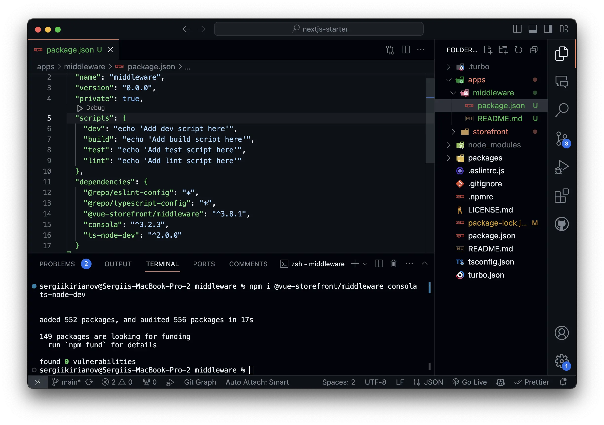
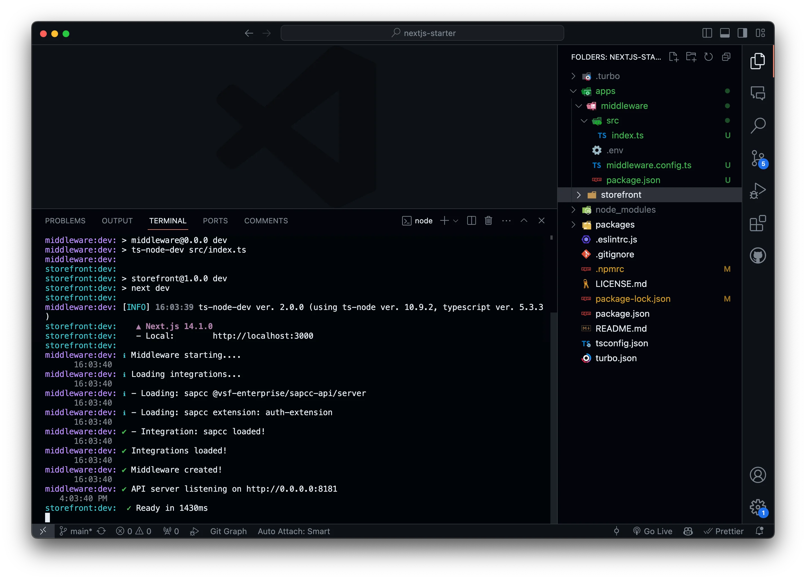

# Install and Configure Alokai Middleware

In the last section, we have installed the Next.js application and created a new Alokai project. In this section, we will install and configure the Alokai Middleware.

The Alokai Middleware is a Node.js application that acts as a bridge between the frontend application and the backend. It is responsible for handling all the API requests and responses, as well as managing the state of the application.

In this guide, we will install the Alokai Middleware and configure it to work with SAP Commerce Cloud.

## Install Alokai Middleware

Navigate to a newly generated `middleware` directory and install the project dependencies by running the following command:

```bash
cd apps/middleware
npm install @vue-storefront/middleware consola ts-node-dev
```

This will install all the necessary dependencies for the `middleware` application.



## Install Alokai SAP Commerce Cloud Integration

So far, we have installed the `middleware` application. But in order for it to run and communicate with SAP Commerce Cloud, we need to install the `@vsf-enterprise/sapcc-api` package. This package is a Alokai integration for SAP Commerce Cloud.

SAP Commerce Cloud integration is part of our Enterprise offering. To access this package, you will need to have Alokai license to access to our private npm registry.

:::info
If you don't have access to our private npm registry, please [contact our sales team](https://vuestorefront.io/contact/sales).
:::

In the root of your project, open `.npmrc` file and add the following line:

```bash
@vsf-enterprise:registry=https://registrynpm.storefrontcloud.io
auto-install-peers=true
```

Now you can install the `@vsf-enterprise/sapcc-api` package by running the following command from `apps/middleware` directory:

```bash
npm install @vsf-enterprise/sapcc-api
```
You can also install the types by running the following command:

```bash
npm install @vsf-enterprise/sapcc-types
```

## Configure Alokai Middleware

Now that you have installed the `middleware` application and the SAP Commerce Cloud integration, you need to configure the `middleware` application to work with SAP Commerce Cloud. 

To do this, you will need to create a new configuration file in the `apps/middleware` directory. Create a new file called `middleware.config.ts` and add the following code:

```typescript
require('dotenv').config();

export const integrations = {
  sapcc: {
    location: '@vsf-enterprise/sapcc-api/server',
    configuration: {
      OAuth: {
        uri: process.env.SAPCC_OAUTH_URI,
        clientId: process.env.SAPCC_OAUTH_CLIENT_ID,
        clientSecret: process.env.SAPCC_OAUTH_CLIENT_SECRET,
        tokenEndpoint: process.env.SAPCC_OAUTH_TOKEN_ENDPOINT,
        tokenRevokeEndpoint: process.env.SAPCC_OAUTH_TOKEN_REVOKE_ENDPOINT,
        cookieOptions: {
          'vsf-sap-token': { secure: process.env.NODE_ENV !== 'development' }
        }
      },
      api: {
        uri: process.env.SAPCC_API_URI,
        baseSiteId: process.env.DEFAULT_BASE_SITE_ID,
        catalogId: process.env.DEFAULT_CATALOG_ID,
        catalogVersion: process.env.DEFAULT_CATALOG_VERSION,
        defaultLanguage: process.env.DEFAULT_LANGUAGE,
        defaultCurrency: process.env.DEFAULT_CURRENCY
      }
    }
  }
};
```

This configuration file will be used to configure the `middleware` application to work with SAP Commerce Cloud. It includes all the necessary configuration options for the SAP Commerce Cloud integration. 

You will also need to create a new `.env` file in the `apps/middleware` directory and add the following environment variables:

```bash
SAPCC_OAUTH_URI=
SAPCC_OAUTH_CLIENT_ID=
SAPCC_OAUTH_CLIENT_SECRET=
SAPCC_OAUTH_TOKEN_ENDPOINT=
SAPCC_OAUTH_TOKEN_REVOKE_ENDPOINT=
SAPCC_API_URI=

DEFAULT_BASE_SITE_ID=
DEFAULT_CATALOG_ID=
DEFAULT_CATALOG_VERSION=
DEFAULT_LANGUAGE=
DEFAULT_CURRENCY=
```

Replace the environment variables with your SAP Commerce Cloud credentials.

This will install the `dotenv` package, which is used to load environment variables from a `.env` file into `process.env`.

## Run Alokai Middleware

Our `middleware` application is now fully configured and ready to run. To start the `middleware` application, we need to create an entry point file in the `apps/middleware` directory. Create a new file called `index.ts` in the `apps/middleware/src` directory:

```bash
mkdir src
touch src/index.ts
```

Add the following code to the `index.ts` file:

```typescript
import { createServer } from '@vue-storefront/middleware';
import { integrations } from '../middleware.config';
const consola = require('consola');
const cors = require('cors');

(async () => {
  const app = await createServer({ integrations });
  // By default it's running on the localhost.
  const host = process.argv[2] ?? 'localhost';
  // By default it's running on the port 8181.
  const port = process.argv[3] ?? 8181;
  const CORS_MIDDLEWARE_NAME = 'corsMiddleware';

  const corsMiddleware = app._router.stack.find(
    (middleware: { name: string }) => middleware.name === CORS_MIDDLEWARE_NAME
  );

  // You can overwrite the cors settings by defining allowed origins.
  corsMiddleware.handle = cors({
    origin: ['http://localhost:3000'],
    credentials: true
  });

  app.listen(port, host, () => {
    consola.success(`API server listening on http://${host}:${port}`);
  });
})();
```

This code will create a new server instance and start the `middleware` application. It will also configure the CORS settings to allow requests from `http://localhost:3000`.

The last step is to run the `middleware` application. In order to help you with that, we will use a `"dev"` script in the `package.json` file. Add the following script to the `package.json` file:

```json
"scripts": {
  "dev": "ts-node-dev src/index.ts",
}
```

Now you can run the `middleware` application by running the following command from the root directory. Go to the root directory and run the following command:

```bash
npm run dev
```

This will start both the Next.js application and the `middleware` application.



Let's start the app!

Open your terminal and run the following command:

```bash
npm run dev
```

To test if the `middleware` application is running correctly, open your terminal and run the following command:

```bash
curl http://localhost:8181/sapcc/searchProduct
```

This will send a request to the `middleware` application and return a response from SAP Commerce Cloud.

::info
You can find complete implementation in the [`install-middleware` branch](https://github.com/vuestorefront-community/nextjs-starter/tree/install-middleware)
::

## Summary

In this section, we have installed and configured the Alokai Middleware. We have installed all the necessary dependencies for the `middleware` application and configured it to work with SAP Commerce Cloud. We have also created a new configuration file and added all the necessary environment variables.

In the next section, we will install and configure the Alokai SDK in the Next.js application. 

::card{title="Next: Install and Configure Alokai SDK" icon="tabler:number-3-small" }

#description
Let's install and configure the Alokai SDK in the Next.js application and learn how to use the Alokai products.

#cta
:::docs-button{to="/guides/alokai-essentials/alokai-next-js/install-sdk"}
Next
:::
::
