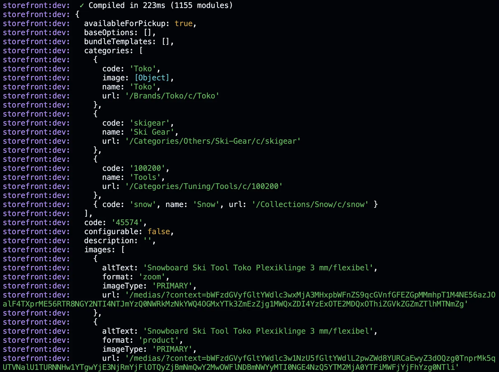
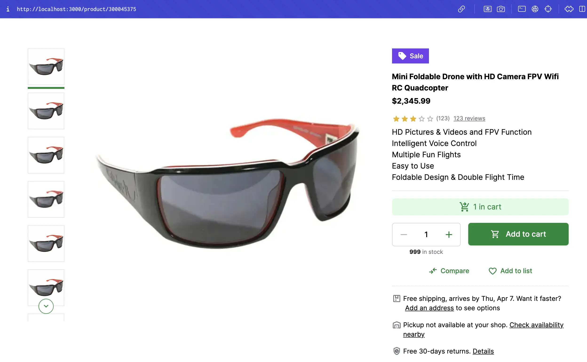
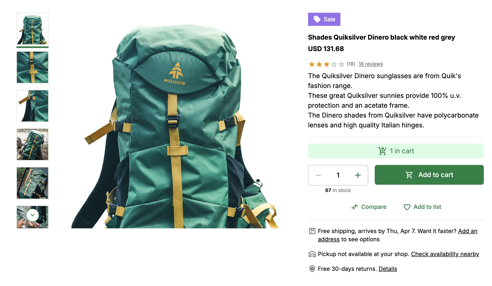

# Connecting Product Details Page with SAP Commerce Cloud

In the previous step, we have created a new product details page using Storefront UI. Now, we will connect it with the SAP Commerce Cloud backend to display the product details.

## Creating a new Next.js page

First, we need to create a new dynamic page in the `app` directory. We will use the `code` of the product to create a dynamic route for the product details page.

Create a new file `app/product/[code]/page.tsx` and add the following code:

```tsx
import ProductGallery from "../../../components/ProductGallery";
import ProductDetails from "../../../components/ProductDetails";
import ProductSlider from "../../../components/ProductSlider";

export default function Page() {
  return (
    <div
      className="flex flex-col gap-8 md:gap-12 lg:gap-16 max-w-screen-xl m-auto px-4 md:px-8 lg:px-12 xl:px-16 py-8 md:py-12 lg:py-16 xl:py-20"
    >
      <section
        className="flex flex-col items-start gap-8 md:flex-row md:gap-4 xl:gap-6"
      >
        <ProductGallery />
        <ProductDetails />
      </section>
      <ProductSlider />
    </div>
  )
}
``` 

In the above code, we have created a new dynamic page for the product details. We have used the `ProductGallery`, `ProductDetails`, and `ProductSlider` components to display the product details. We removed the `"use client"` directive from the top of the file. 

Make sure that you added `"use client"` on top of every `Product...` component file as follows:
  
```tsx
// ProductGallery.tsx
"use client";

// ... rest of the code
```

Now, our Product Details page is dynamic and ready to display the product details based on the `slug` of the product.

## Fetching Products from SAP Commerce Cloud

We want to simulate a "real world" store, so let's fetch a list of products from the SAP Commerce Cloud backend to display links to products on the homepage.

In the `app/page.tsx` let's make some changes to fetch the products from the backend. Replace the content of the `app/page.tsx` with the following code:

```tsx
import Link from "next/link";
import { getSdk } from "../sdk/sdk.config"

export default async function Page() {
  const sdk = getSdk()

  const { products } = await sdk.sapcc.searchProduct({});

  return (
    <div className="flex flex-col gap-3">
      {products?.map((product) => (
        <Link href={`/product/${product.code}`} key={product.code} className="text-blue-500 underline">
          - {product.name}
        </Link>
      ))}
    </div>
  )
}
```

In the above code, we have used the `getSdk` function to create a new instance of the Alokai SDK. We have used the `searchProduct` method to fetch the list of products from the backend. We have used the `Link` component from Next.js to create links to the product details page.

Now, when you run the application, you will see a list of products on the homepage. When you click on a product, you will be redirected to the product details page.

## Fetching Product Details from SAP Commerce Cloud

Now, we need to fetch the product details from the SAP Commerce Cloud backend to display the product details on the product details page.

In the `app/product/[code]/page.tsx` file, let's make some changes to fetch the product details from the backend. The final code of the `app/product/[code]/page.tsx` file should look like this:

```tsx
import ProductGallery from "../../../components/ProductGallery";
import ProductDetails from "../../../components/ProductDetails";
import ProductSlider from "../../../components/ProductSlider";
import { getSdk } from "../../../sdk/sdk.config";

export default async function Page({ params }: { params: { code: string } }) {
  const sdk = getSdk();

  const product = await sdk.sapcc.getProduct({
    id: params.code,
  });

  console.log(product);

  return (
    <div
      className="flex flex-col gap-8 md:gap-12 lg:gap-16 max-w-screen-xl m-auto px-4 md:px-8 lg:px-12 xl:px-16 py-8 md:py-12 lg:py-16 xl:py-20"
    >
      <section
        className="flex flex-col items-start gap-8 md:flex-row md:gap-4 xl:gap-6"
      >
        <ProductGallery />
        <ProductDetails />
      </section>
      <ProductSlider />
    </div>
  )
}
```

In the above code, we have used the `getSdk` function to create a new instance of the Alokai SDK. We have used the `getProduct` method to fetch the product details from the backend. We have used the `params` object to get the `code` of the product from the URL. We have used the `console.log` function to log the product details to the console. Once you visit the product details page, you will see the product details logged to the console as shown below:



Now, we have successfully connected the product details page with the SAP Commerce Cloud backend. In the next step, we will display the product details on the product details page.

## Displaying Product Details

Storefront UI Blocks are designed to be used with any backend and it does not follow any specific data structure. We need to map the data from the SAP Commerce Cloud backend to the Storefront UI Blocks to display the product details.

Let's start by creating props for the `ProductGallery` and `ProductDetails` Blocks for now. 

### ProductGallery Block

Open the `app/components/ProductGallery.tsx` file. First, we will create a TypeScript interface for the props of the `ProductGallery` Block. 

In order to simplify the type definition, we will install the `@vsf-enterprise/sap-commerce-webservices-sdk` type definitions package. This package contains all SAP Commerce Cloud native types. Run the following command in the root of your project to install the package:

```bash
npm install @vsf-enterprise/sap-commerce-webservices-sdk
```

Now, open the `app/components/ProductGallery.tsx` file and add the following code:

```tsx
// ... rest of the code
import { Product } from '@vsf-enterprise/sap-commerce-webservices-sdk';

interface ProductGalleryProps {
  images: Product['images'];
}
// ... rest of the code
```

In the above code, we have created a TypeScript interface `ProductGalleryProps` for the props of the `ProductGallery` Block. We have used the `Product` type from the `@vsf-enterprise/sap-commerce-webservices-sdk` package to define the type of the `images` prop.

Now, we will use the `ProductGalleryProps` interface to define the type of the `props` of the `ProductGallery` component. Replace the content of the `app/components/ProductGallery.tsx` file with the following code:

```diff
- export default function GalleryVertical() {
+ export default function GalleryVertical({ images }: ProductGalleryProps) {
```

We can also remove the `images` constant and `withBase` function from the `ProductGallery` component as we are now passing the `images` prop from the parent component.

Now, let's pass the `images` prop to the `ProductGallery` component in the `app/product/[code]/page.tsx` file. Replace the content of the `app/product/[code]/page.tsx` file with the following code:

```diff
- <ProductGallery />
+ <ProductGallery images={product.images} />
```

We also need to make some changes in the `ProductGallery` Block to conform to the new type definition. Open the `app/components/ProductGallery.tsx` file, find and replace all instance of:

- `imageThumbSrc` with `url`
- `alt` with `altText`
- `imageSrc` with `url`

And, one more thing, we need to make sure that the `ProductGallery` component is using Next.js `Image` component to display the images. Open the `app/components/ProductGallery.tsx` file and replace the `img` tag with the `Image` component as follows:

```tsx
"use client";
import { useRef, useState } from 'react';
import { useIntersection } from 'react-use';
import {
  SfScrollable,
  SfButton,
  SfIconChevronLeft,
  SfIconChevronRight,
  type SfScrollableOnDragEndData,
} from '@storefront-ui/react';

import classNames from 'classnames';
import { Product } from '@vsf-enterprise/sap-commerce-webservices-sdk';
import Image from 'next/image';

interface ProductGalleryProps {
  images: Product['images'];
}

export default function GalleryVertical({ images }: ProductGalleryProps) {
  const lastThumbRef = useRef<HTMLButtonElement>(null);
  const thumbsRef = useRef<HTMLDivElement>(null);
  const firstThumbRef = useRef<HTMLButtonElement>(null);
  const [activeIndex, setActiveIndex] = useState(0);

  const firstThumbVisible = useIntersection(firstThumbRef, {
    root: thumbsRef.current,
    rootMargin: '0px',
    threshold: 1,
  });

  const lastThumbVisible = useIntersection(lastThumbRef, {
    root: thumbsRef.current,
    rootMargin: '0px',
    threshold: 1,
  });

  const onDragged = (event: SfScrollableOnDragEndData) => {
    if (event.swipeRight && activeIndex > 0) {
      setActiveIndex((currentActiveIndex) => currentActiveIndex - 1);
    } else if (event.swipeLeft && images && activeIndex < images.length - 1) {
      setActiveIndex((currentActiveIndex) => currentActiveIndex + 1);
    }
  };

  return (
    <div className="relative flex w-full max-h-[600px] aspect-[4/3]">
      <SfScrollable
        ref={thumbsRef}
        className="items-center w-full [&::-webkit-scrollbar]:hidden [-ms-overflow-style:none] [scrollbar-width:none]"
        direction="vertical"
        activeIndex={activeIndex}
        prevDisabled={activeIndex === 0}
        nextDisabled={images && activeIndex === images.length - 1}
        slotPreviousButton={
          <SfButton
            className={classNames('absolute !rounded-full z-10 top-4 rotate-90 bg-white', {
              hidden: firstThumbVisible?.isIntersecting,
            })}
            variant="secondary"
            size="sm"
            square
            slotPrefix={<SfIconChevronLeft size="sm" />}
          />
        }
        slotNextButton={
          <SfButton
            className={classNames('absolute !rounded-full z-10 bottom-4 rotate-90 bg-white', {
              hidden: lastThumbVisible?.isIntersecting,
            })}
            variant="secondary"
            size="sm"
            square
            slotPrefix={<SfIconChevronRight size="sm" />}
          />
        }
      >
        {images?.map(({ url, altText }, index, thumbsArray) => (
          <button
            // eslint-disable-next-line no-nested-ternary
            ref={index === thumbsArray.length - 1 ? lastThumbRef : index === 0 ? firstThumbRef : null}
            type="button"
            aria-label={altText}
            aria-current={activeIndex === index}
            key={`${altText}-${index}-thumbnail`}
            className={classNames(
              'md:w-[78px] md:h-auto relative shrink-0 pb-1 mx-4 -mb-2 border-b-4 snap-center cursor-pointer focus-visible:outline focus-visible:outline-offset transition-colors flex-grow md:flex-grow-0',
              {
                'border-primary-700': activeIndex === index,
                'border-transparent': activeIndex !== index,
              },
            )}
            onMouseOver={() => setActiveIndex(index)}
            onFocus={() => setActiveIndex(index)}
          >
            <Image alt={altText!} className="border border-neutral-200" width="78" height="78" src={url!} />
          </button>
        ))}
      </SfScrollable>
      <SfScrollable
        className="w-full h-full snap-x snap-mandatory [&::-webkit-scrollbar]:hidden [-ms-overflow-style:none] [scrollbar-width:none]"
        activeIndex={activeIndex}
        direction="vertical"
        wrapperClassName="h-full m-auto"
        buttonsPlacement="none"
        isActiveIndexCentered
        drag={{ containerWidth: true }}
        onDragEnd={onDragged}
      >
        {images?.map(({ url, altText }, index) => (
          <div key={`${altText}-${index}`} className="flex justify-center h-full basis-full shrink-0 grow snap-center">
            <Image
              aria-label={altText}
              aria-hidden={activeIndex !== index}
              className="object-contain w-auto h-full"
              alt={altText!}
              src={url!}
            />
          </div>
        ))}
      </SfScrollable>
    </div>
  );
}
```

Let's save the changes and run the application. Now, when you visit the product details page, you will see ~~the product images~~ an error in the console. This is because SAP Commerce Cloud does not provide the images in the expected format. In order for them to display correctly, we must transform images URL to contain the full path to the image.

#### Transforming Images URL

SAP Commerce Cloud provides the images URL not including the base URL. We need to transform the images URL to contain the full path to the image. As part of the [Install Alokai Middleware](./2.install-middleware.md) guide, we have used environment variables to define the base URL of the SAP Commerce Cloud backend. But these are used in the Middleware and are not available in the Next.js app. 

So, in order to use the SAPCC Base URL in the Next.js app, we need to create a new environment variable in the Next.js app. Create a new `.env.local` file in the root of the Next.js app and add the following code:

```env
NEXT_PUBLIC_SAPCC_BASE_URL=[YOUR SAPCC BASE URL]
```

In the above code, we have created a new environment variable `NEXT_PUBLIC_SAPCC_BASE_URL` and set it to the base URL of the SAP Commerce Cloud backend. Now, we can use this environment variable to transform the images URL in the `ProductGallery` Block.

Open the `app/components/ProductGallery.tsx` file and add the following code at the top of the file:

```tsx
const transformImageUrl = (url: string) => {
  return new URL(url, process.env.NEXT_PUBLIC_SAPCC_BASE_URL).toString();
}
```

Next, find and replace all instances of `url!` with `transformImageUrl(url!)` in the `app/components/ProductGallery.tsx` file.

Now, save the changes and run the application. Now, when you visit the product details page, you will see ~~the product images displayed correctly~~ another error in the console!

Don't panic! This is because the Next.js uses Image Optimization to automatically handle the images. We need to add hostname to the `next.config.js` file to allow the images to be displayed correctly.

Open the `next.config.js` file and add the following code:

```js
module.exports = {
  transpilePackages: ["@repo/ui"],
  // add the following code
  images: {
    remotePatterns: [
      {
        protocol: 'https',
        // add the hostname of YOUR the SAP Commerce Cloud backend
        hostname: 'api.c1jvi8hu9a-vsfspzooa1-d1-public.model-t.cc.commerce.ondemand.com',
        port: '',
      },
    ],
  }
};
```

As well, the Next.js Image component requires the `width` and `height` props to be defined. We need to add the `width` and `height` props to the `Image` component in the `app/components/ProductGallery.tsx` file as follows:

```tsx
<Image
  aria-label={altText}
  aria-hidden={activeIndex !== index}
  className="object-contain w-auto h-full"
  alt={altText!}
  width="200" height="200"
  src={transformImageUrl(url!)}
/>
```

Now, save the changes and run the application. Now, when you visit the product details page, you will see the product images displayed correctly.



This was a big one! SAP Commerce Cloud provides the images URL not including the base URL. We have transformed the images URL to contain the full path to the image using the `NEXT_PUBLIC_SAPCC_BASE_URL` environment variable. We have also added the hostname to the `next.config.js` file to allow the images to be displayed correctly.

### ProductDetails Block

This will be a quicker step, since we won't need to deal with a lot of images. Let's start by creating a TypeScript interface for the props of the `ProductDetails` Block.

Open the `app/components/ProductDetails.tsx` file and add the following code at the top of the file:

```tsx
import { Product } from '@vsf-enterprise/sap-commerce-webservices-sdk';

interface ProductDetailsProps {
  product: Product;
}
```

Now, we will use the `ProductDetailsProps` interface to define the type of the `props` of the `ProductDetails` component. Replace the content of the `app/components/ProductDetails.tsx` file with the following code:

```diff
- export default function ProductDetails() {
+ export default function ProductDetails({ product }: ProductDetailsProps) {
```

Now, let's pass the `product` prop to the `ProductDetails` component in the `app/product/[code]/page.tsx` file. Replace the content of the `app/product/[code]/page.tsx` file with the following code:

```diff
- <ProductDetails />
+ <ProductDetails product={product} />
```

We also need to make some changes in the `ProductDetails` Block to conform to the new type definition. Let's replace all hardcoded values with the values from the `product` prop. Open the `app/components/ProductDetails.tsx` file and replace the content of `ProductDetails` function with the following code:

```diff
- const max = 999;
+  const max = product.stock?.stockLevel ?? 1;

-  Mini Foldable Drone with HD Camera FPV Wifi RC Quadcopter
+ {product.name}

-  <strong className="block font-bold typography-headline-3">$2,345.99</strong>
+  <strong className="block font-bold typography-headline-3">{product.price?.currencyIso} {product.price?.value}</strong>

-  123
+  {product.numberOfReviews}

-  123 reviews
+  {product.numberOfReviews} reviews

-  <ul className="mb-4 font-normal typography-text-sm">
-    <li>HD Pictures & Videos and FPV Function</li>
-    <li>Intelligent Voice Control</li>
-    <li>Multiple Fun Flights</li>
-    <li>Easy to Use</li>
-    <li>Foldable Design & Double Flight Time</li>
-  </ul>

+  <p className="mb-4 font-normal typography-text-sm"
+     dangerouslySetInnerHTML={{ __html: product.summary ?? '' }} 
+  />
```

Now, save the changes and run the application. Now, when you visit the product details page, you will see the product details displayed correctly.



Congratulations! You have successfully connected the product details page with the SAP Commerce Cloud backend and displayed the product details on the product details page.

I'll leave the `ProductSlider` Block for you to implement. I would recommend you to start with looking at the `product.productReferences` property in the product details response. This property contains the list of related products. You can use this property to display the related products in the `ProductSlider` Block.

::info
You can find the complete implementation in the [`connecting-pdp` branch](https://github.com/vuestorefront-community/nextjs-starter/tree/connecting-pdp)
::

## Summary

In this section, we have created a new product details page using Storefront UI. We have connected it with the SAP Commerce Cloud backend to display the product details. We have fetched the list of products from the backend and displayed links to products on the homepage. We have also fetched the product details from the backend and displayed the product details on the product details page. We have transformed the images URL to contain the full path to the image and displayed the product images on the product details page. We have also displayed the product details on the product details page.

So far we have learned how to get the data, transform it and display it in the Storefront UI Blocks. In the next step, we will learn how to add the product to the cart and display the cart details.

::card{title="Next: Add product to Cart" icon="tabler:number-7-small" }

#description
Learn how to use Alokai Connect to add product to cart

#cta
:::docs-button{to="/guides/alokai-essentials/alokai-next-js/add-to-cart"}
Next
:::
