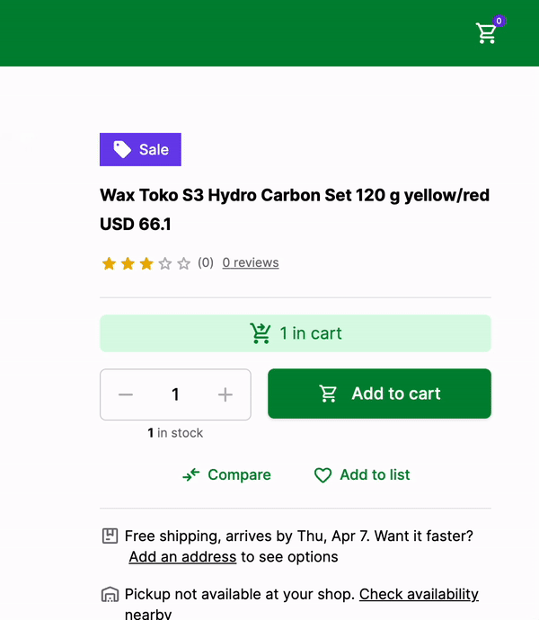

# Add Product to Cart

Just getting the data from the API is not enough. Ecommerce websites are feature rich and one of the most important features is the ability to add products to the cart. In this guide, we will learn how to add products to the cart in Alokai Next.js application.

## Add to Cart

First, let's understand the process of adding a product to the cart. When a user clicks on the "Add to Cart" button, the product is added to the cart by it's `cartId`. The cart is a collection of products that the user wants to buy. The cart is stored in the backend and the frontend communicates with the backend to add products to the cart.

In order to achieve this, we will use Alokai SDK method `addToCart`. It will then send a request to Alokai Middleware and the middleware will add the product to the cart.

But that's not all. Since we are building a real-world application, we need to have a cart in a global state. So, let's first do some preparation.

## Preparation

We will create a new `CartContextProvider` component that will provide the cart to the entire application. We will also create a new `useCart` hook that will be used to access the cart from any component.

First, let's create a new `CartContextProvider` component. Create a new file inside `storefront/providers/CartContextProvider.tsx` and add the following code.

```tsx
"use client";

import { Cart } from "@vsf-enterprise/sap-commerce-webservices-sdk";
import { createContext, useEffect, useState } from "react";
import { useSdk } from "../sdk/sdk";

export const CartContext = createContext<{
  cart: Cart;
  updateCart: (cart: Cart) => void;
}>({
  cart: {} as Cart,
  updateCart: () => { },
});

export default function CartContextProvider({ children }: { children: React.ReactNode }) {
  const [cart, setCart] = useState<Cart>({} as Cart);
  const sdk = useSdk();

  useEffect(() => {
    async function getCart() {
      let cart = JSON.parse(localStorage.getItem("cart") as string);

      if (!cart) {
        cart = await sdk.sapcc.createCart();

        localStorage.setItem("cart", JSON.stringify(cart));
      }
      setCart(cart);
    }

    getCart();
  }, []);

  function updateCart(updatedCart: Cart) {
    setCart(updatedCart);
    localStorage.setItem("cart", JSON.stringify(updatedCart));
  }

  return <CartContext.Provider value={{ cart, updateCart }} > {children} </CartContext.Provider>;
}
```

Provider has to be a client component, so we can use `useState` and `useEffect` hooks. We are using `localStorage` to store the cart to simplify the development, ideally we would store it in the cookies.

Now, let's create a new `useCart` hook. Create a new file inside `storefront/hooks/useCart.ts` and add the following code.

```tsx
import { useContext } from "react";
import { CartContext } from "../providers/CartContextProvider";
import { useSdk } from "../sdk/sdk";
import { Product } from "@vsf-enterprise/sap-commerce-webservices-sdk";

export default function useCart() {
  const { cart, updateCart } = useContext(CartContext);
  const sdk = useSdk();

  async function addToCart(product: Product, quantity: number = 1) {
    try {
      await sdk.sapcc.addCartEntry({
        cartId: cart.guid as string,
        entry: {
          quantity: quantity,
          product: {
            code: product.code as string,
          },
        }
      })

      const updatedCart = await sdk.sapcc.getCart({
        cartId: cart.guid as string
      });

      updateCart(updatedCart)
    } catch (error) {
      console.error('Error adding to cart', error);
    }
  }

  return {
    cart,
    addToCart
  }
}
```

This hook will be used to access the cart and add products to the cart. We are using the `useContext` hook to access the cart from the `CartContextProvider` component and keeping the cart updated in the global state.

Now, let's add our new `CartContextProvider` to the `provider.tsx` file to wrap the entire application with the cart context.

```diff
+import CartContextProvider from "../providers/CartContextProvider";

export function Providers({ children }: { children: ReactNode }) {
  return (
    <SdkProvider sdk={getSdk()}>
+     <CartContextProvider>
        {children}
+     </CartContextProvider>
    </SdkProvider>
  );
}
```

We need to keep `CartContextProvider` inside `SdkProvider` because we are using the `useSdk` hook inside the `CartContextProvider`.

Now, we can use the `useCart` hook to access the cart and add products to the cart from any component.

## Add to Cart Button

Since `ProductDetails` component already has the product data and `SfButton` component that is responsible for adding the product to the cart, we can add the `useCart` hook to the `ProductDetails` component and use it to add the product to the cart.

```tsx
// ... rest of the code

export default function ProductDetails({ product }: ProductDetailsProps) {
  const inputId = useId();
  const { addToCart } = useCart(); // Add this line
  const min = 1;
  const max = product.stock?.stockLevel ?? 1;
  const [value, { inc, dec, set }] = useCounter(min);

// ... rest of the code
```

Now, we can use the `addToCart` function to add the product to the cart when the user clicks on the "Add to Cart" button.

```tsx
// ... rest of the code

<SfButton onClick={async () => await addToCart(product, 1)} size="lg" className="w-full xs:ml-4" slotPrefix={<SfIconShoppingCart size="sm" />}>
  Add to cart
</SfButton>

// ... rest of the code
```

Now, when the user clicks on the "Add to Cart" button, the product will be added to the cart and the cart will be updated in the global state.

Let's test it! 

## Test it

Let's create a simple NavBar component with a Cart icon that will display the number of products in the cart. Create a new file inside `storefront/components/NavBar.tsx` and add the following code.

```tsx
"use client"
import { SfBadge, SfButton, SfIconShoppingCart } from "@storefront-ui/react";
import Link from "next/link";
import useCart from "../hooks/useCart";

export default function NavBar() {
  const { cart } = useCart();

  return (
    <div className="flex items-center justify-between px-8 py-3 bg-primary-700">
      <nav className="flex gap-4 items-center">
        <Link href="/" className="text-white">Home</Link>
        <Link href="/cart" className="text-white">Cart</Link>
      </nav>

      <SfButton className="relative" square variant="tertiary">
        <SfIconShoppingCart className="text-white" />
        <SfBadge content={cart.totalUnitCount} />
      </SfButton>
    </div>
  )
}
```

Now, let's add the `NavBar` component to the `layout.tsx` file.

```diff
// ... rest of the code
+ import NavBar from "../components/NavBar";

// ... rest of the code

<Providers>
+ <NavBar />
  {children}
</Providers>

// ... rest of the code
```

Now, when the user adds a product to the cart, the number of products in the cart will be displayed in the `NavBar` component. The cart will be updated in the global state and the user will be able to see the number of products in the cart from any page.

Here's how it looks like:



That's it! We have successfully added the product to the cart and displayed the number of products in the cart in the `NavBar` component.

Congratulations! You have successfully added products to the cart in Alokai Next.js application. 🎉

::info
You can find a complete code for this guide in the [add-to-cart branch](https://github.com/vuestorefront-community/nextjs-starter/tree/add-to-cart) of the Alokai Next.js Starter.
::

## Summary

In this guide, we learned how to add products to the cart in Alokai Next.js application. We created a new `CartContextProvider` component that provides the cart to the entire application and a new `useCart` hook that is used to access the cart from any component. We also added the `NavBar` component that displays the number of products in the cart.

::info
If you followed along with this guide, you might have noticed that we added `Cart` route to the `NavBar` component. You already know how to create a new page and display the products in the cart. If you want to challenge yourself, try to create a new page that displays the products in the cart and allows the user to remove products from the cart. I recommend using [Product Card Horizontal](https://docs.storefrontui.io/v2/react/blocks/ProductCard.html#productcard-horizontal) Storefront UI component to display the products in the cart.
::

We are done with the basics of Alokai Next.js application.

You can now move on to the next guide to learn more advanced concepts and features of Alokai or start building your own Alokai Next.js application and come back later to learn more advanced concepts. 

::card{title="Next: Unified Data Layer" icon="tabler:hexagon-8-filled" }

#description
Learn how to install, configure and use Unified Data Layer

#cta
:::docs-button{to="/guides/alokai-essentials/alokai-next-js/udl"}
Next
:::


