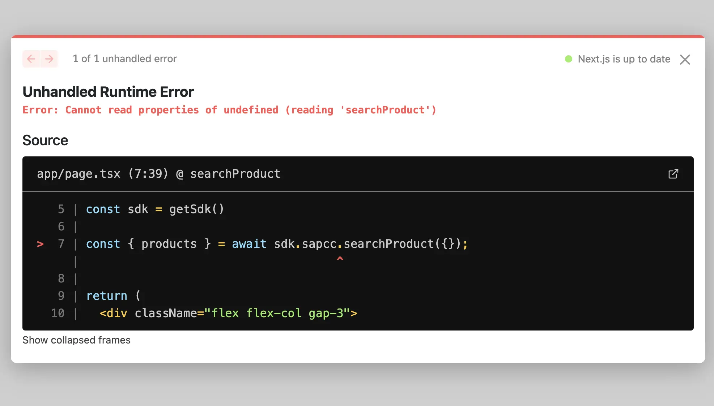
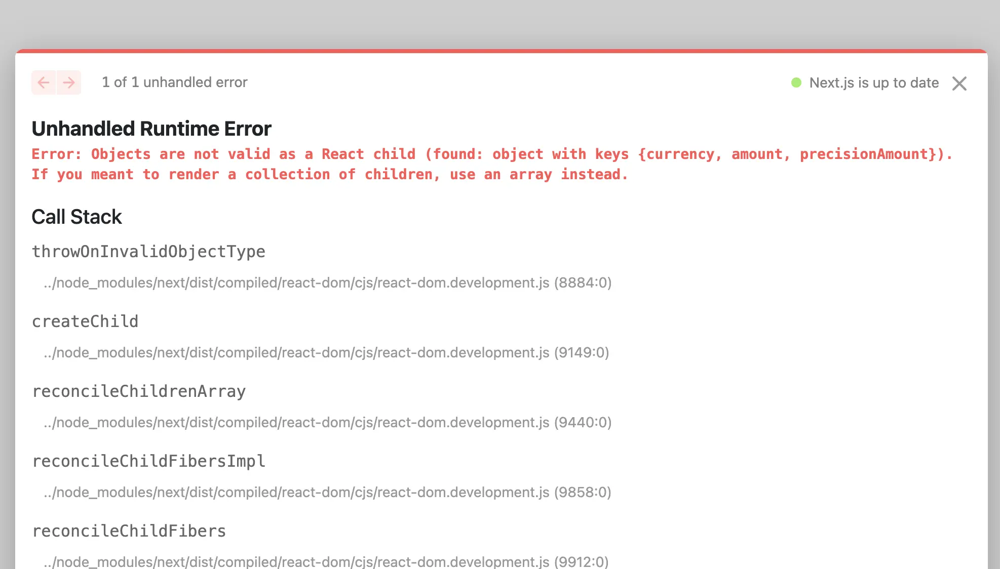
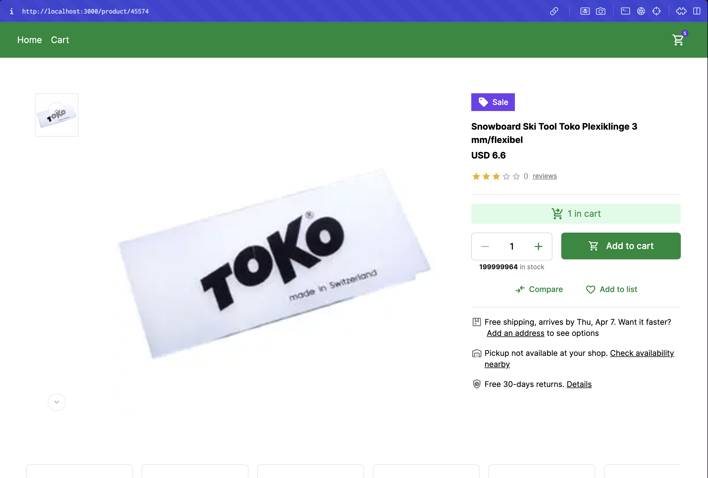

# Unified Data Layer
::info
The Unified Data Layer is an enterprise-only feature which means you need to have Alokai Enterprise License in order to be able to use it.
::
The Unified Data Layer (UDL) is a new concept introduced by Alokai. This is a layer in the Alokai Middleware and Storefront that allows for unification of data from different sources. The UDL provides a standardized way to interact with data, regardless of the eCommerce platform you're using. The UDL provides a structured way to manage this data, ensuring that regardless of the platform — be it Commercetools, SAPCC, or BigCommerce — the data is consistently represented. 

## Prerequisites

Before we proceed, please take your time and learn more about the UDL in the [Unified Data Layer](https://docs.vuestorefront.io/storefront/unified-data-layer) section of Storefront documentation.

## UDL in Alokai Next.js Application

In order to help you understand Unified Data Layer better, let's add it to our Alokai Next.js application. This will allow us to connect our application to different eCommerce platforms preserving the same data structure and UI components.

::info
If you don't have any other ecommerce platform installed - no worries, you can just follow this guide to have a better understanding of how UDL works.
::

## Installation and Configuration

In order to install Unified Data Model, we need to install `@vsf-enterprise/unified-api-sapcc` package. This package is a set of Unified API Extensions for SAP Commerce Cloud. 

### Configuring Alokai Middleware

Go to `apps/middleware` directory and install the `@vsf-enterprise/unified-api-sapcc` package by running the following command:

```bash
npm install @vsf-enterprise/unified-api-sapcc
```

Next, we need to extend Middleware to include Unified API Extension. First, let's create `unifiedApiExtension` extension object in the `middleware.config.ts` file:

```typescript
import { createUnifiedExtension } from "@vsf-enterprise/unified-api-sapcc";
import { ApiClientExtension } from "@vue-storefront/middleware";

export const unifiedApiExtension: ApiClientExtension = createUnifiedExtension(
  {
    normalizers: {
        addCustomFields: [{}]
    },
    methods: {},
    config: {
        
    }
  }
);
``` 

The `unifiedApiExtension` object is the result of calling `createUnifiedExtension` function. The `createUnifiedExtension` function is a factory function that accepts `normalizers`, `methods`, and `config` as arguments.

- `noralizers` property allows you to control the normalization process - mapping eCommerce-specific data types to the Unified Data Model.
- `methods` property allows you to override the default methods - functions that fetch data from eCommerce and pass it through the normalizers. [Read more about it in the documentation](/storefront/integration-and-setup/overriding-api-methods)
- `config` contains additional configuration required by the given integration. We cover them below.

#### transformImageUrl

In the [Connecting Product Details Page with SAP Commerce Cloud](./7.connecting-pdp.md) guide, we used `transformImageUrl` method to transform the image URL. It's not recommended to do this in the `ProductDetails` component. Instead, we can pass the `transformImageUrl` method to the `unifiedApiExtension` object as config, so that this transformation will happen in the Middleware.

```diff
export const unifiedApiExtension: ApiClientExtension = createUnifiedExtension({
  normalizers: {
    addCustomFields: [{}],
  },
  methods: {},
  config: {
+    transformImageUrl: (url: string) => {
+      return new URL(url, process.env.SAPCC_BASE_URL).toString();
    },
  },
});
```

Since this transformation takes place in the Middleware, we can get rid of the `transformImageUrl` method from the `ProductDetails` component, as well, we can move the environment variable from the `.env.local` inside Next.js project to the `.env` file inside the Middleware project.

In the `.env` file, add the following environment variable:

```env
SAPCC_BASE_URL=[your SAP Commerce Cloud base URL]
```


#### defaultCurrency

Nearly all calls to SAP OCC API require the currency parameter. Thus we need to specify with what currency the application should start.

```diff
export const unifiedApiExtension: ApiClientExtension = createUnifiedExtension({
  normalizers: {
    addCustomFields: [{}],
  },
  methods: {},
  config: {
    transformImageUrl: (url: string) => {
      return new URL(url, process.env.SAPCC_BASE_URL).toString();
    },
+    defaultCurrency: "USD",
  },
});
```

### Adding the unified extension to the integration

Now, we need to add the `unifiedApiExtension` to the `extensions` array in the `middleware.config.ts` file:

```diff
export const integrations = {
- sapcc: {
+ commerce: {
    location: '@vsf-enterprise/sapcc-api/server',
    configuration: {
      // ...
      },
      api: {
        // ...
      }
    },
+   extensions: (extensions: ApiClientExtension[]) => [...extensions, unifiedApiExtension]
  }
};
```

The final `middleware.config.ts` file should look like this:

```ts
require("dotenv").config();

import { createUnifiedExtension } from "@vsf-enterprise/unified-api-sapcc";
import { ApiClientExtension } from "@vue-storefront/middleware";

export const unifiedApiExtension: ApiClientExtension = createUnifiedExtension({
  normalizers: {
    addCustomFields: [{}],
  },
  methods: {},
  config: {
    transformImageUrl: (url: string) => {
      return new URL(url, process.env.SAPCC_BASE_URL).toString();
    },
    defaultCurrency: "USD",
  },
});

export const integrations = {
  commerce: {
    location: "@vsf-enterprise/sapcc-api/server",
    configuration: {
      OAuth: {
        uri: process.env.SAPCC_OAUTH_URI,
        clientId: process.env.SAPCC_OAUTH_CLIENT_ID,
        clientSecret: process.env.SAPCC_OAUTH_CLIENT_SECRET,
        tokenEndpoint: process.env.SAPCC_OAUTH_TOKEN_ENDPOINT,
        tokenRevokeEndpoint: process.env.SAPCC_OAUTH_TOKEN_REVOKE_ENDPOINT,
        cookieOptions: {
          "vsf-sap-token": { secure: process.env.NODE_ENV !== "development" },
        },
      },
      api: {
        uri: process.env.SAPCC_API_URI,
        baseSiteId: process.env.DEFAULT_BASE_SITE_ID,
        catalogId: process.env.DEFAULT_CATALOG_ID,
        catalogVersion: process.env.DEFAULT_CATALOG_VERSION,
        defaultLanguage: process.env.DEFAULT_LANGUAGE,
        defaultCurrency: process.env.DEFAULT_CURRENCY,
      },
    },
    extensions: (extensions: ApiClientExtension[]) => [
      ...extensions,
      unifiedApiExtension,
    ],
  },
};
```

Next, let's prepare the Unified API Extension for the Alokai SDK. Create a new file inside `middleware` directory called `types.ts` and add the following code:

```ts
export type { Endpoints as UnifiedEndpoints } from "@vsf-enterprise/unified-api-sapcc";
export * from "@vsf-enterprise/unified-api-sapcc/udl"
```

`Endpoints` type is needed for SDK to automatically generate type-safe methods based on the available endpoints.
The second line exports the Unified Data Layer so that the storefront uses the same data model version.

Great! Now we have successfully installed and configured the Unified Data Layer in our Alokai Middleware. Next, we need to configure Alokai SDK to use the Unified Data Layer.

### Configuring Alokai SDK

To configure Alokai SDK with the Unified Data Layer, we need to change the SDK configuration. Open `storefront/sdk/sdk.config.ts` file and add the following code:

```diff
- import { Endpoints } from "@vsf-enterprise/sapcc-api";
import { CreateSdkOptions, createSdk } from "@vue-storefront/next";
+import type { UnifiedEndpoints } from 'middleware/types';

export const { getSdk } = createSdk(
  options,
  ({ buildModule, config, middlewareModule, getRequestHeaders }) => ({
-    sapcc: buildModule(sapccModule, {
+    unified: buildModule(middlewareModule<UnifiedEndpoints>, {
-     apiUrl: config.middlewareUrl + "/sapcc",
+     apiUrl: config.middlewareUrl + "/commerce",
      defaultRequestConfig: {
        headers: getRequestHeaders(),
      },
    }),
  }),
);

export type Sdk = ReturnType<typeof getSdk>;
```

This code imports the `UnifiedEndpoints` type from the `middleware/types` file and uses it to create the `unified` module in the SDK configuration. The `unified` module uses the `middlewareModule` method to create a module based on the `UnifiedEndpoints` type.

## Using Unified Data Layer in Alokai Next.js Application

Unified Data Layer brings a lot of benefits to the Alokai Next.js application. It allows us to use the same data structure and UI components across different eCommerce platforms. To use it though, your UI has to conform Unified Data Model structure.

Let's replace the types across the application with the Unified Data Model types. For example, in the `ProductDetails` component, we can replace the `Product` type with the `SfProduct` type from the Unified Data Model:

```diff
- import { Product } from '@vsf-enterprise/sap-commerce-webservices-sdk';
+ import { SfProduct } from "middleware/types";

interface ProductDetailsProps {
- product: Product;
+ product: SfProduct;
}
```

This change will allow us to use the same `ProductDetails` component across different eCommerce platforms.

But, it also breaks the application. Let's go and fix the errors.

### Fixing types across the application

First, we need to change how we are fetching data. Since we replaced `sapcc` module with `unified` module, we need to change the method names across the application. For example, in the `product/[code]/page.tsx` file, we need to replace the `getProduct` method with the `getProductDetails` method from the `unified` module:

```diff
- const product = await sdk.sapcc.getProduct({
-   id: params.code,
- });

+ const { product } = await sdk.unified.getProductDetails({
+   id: params.code,
+ });
```

You will see that the `product.images` property is now missing. This is because we are using the `SfProduct` type from the Unified Data Model, which doesn't have the `images` property. Instead, we need to use `product.gallery` property from the Unified Data Model. Let's replace the `product.images` property with the `product.gallery` property:

```diff
- <ProductGallery images={product.images} />
+ <ProductGallery images={product.gallery} />
```

::info
Use the approach we learned above to fix the types in the `ProductGallery` component. This will allow us to use the same `ProductGallery` component across different eCommerce platforms. Notice that we don't need the `transformImageUrl` in the front end anymore.
::

### One last fix

We have successfully replaced the types across the application with the Unified Data Model types. However, if you try to run the application, you will see that we have an issue with the `app/page.tsx` file. 



Probably you already know what the issue is. We are trying to use `sdk.sapcc` method, which doesn't exist anymore. Instead, we need to use `sdk.unified` method. Let's replace the `sdk.sapcc` method with the `sdk.unified` method:

```diff
- const { products } = await sdk.sapcc.searchProducts({});
+ const { products } = await sdk.unified.searchProducts({});
```

And, fix the `Link` component `href` prop to conform to the Unified Data Model:

```diff
- <Link href={`/product/${product.code}`} key={product.code} className="text-blue-500 underline">
+ <Link href={`/product/${product.id}`} key={product.id} className="text-blue-500 underline">
```

Now, if you run the application, you will see that the home page is working as expected. However, if you try to navigate to the product details page, you will see that we have an issue with the `ProductDetails` component.



Your IDE will also show you a bunch of errors. We will not go through all of them in detail, so here's the final version of the `ProductDetails` component:

```tsx
"use client";

import {
  SfButton,
  SfCounter,
  SfIconAdd,
  SfIconCompareArrows,
  SfIconFavorite,
  SfIconPackage,
  SfIconRemove,
  SfIconSafetyCheck,
  SfIconSell,
  SfIconShoppingCart,
  SfIconShoppingCartCheckout,
  SfIconWarehouse,
  SfLink,
  SfRating,
} from "@storefront-ui/react";
import { clamp } from "@storefront-ui/shared";
import { ChangeEvent, useId } from "react";
import { useCounter } from "react-use";

import { SfProduct } from "middleware/types";
import useCart from "../hooks/useCart";

interface ProductDetailsProps {
  product: SfProduct;
}

export default function ProductDetails({ product }: ProductDetailsProps) {
  const inputId = useId();
  const { addToCart } = useCart();
  const min = 1;
  const max = product.quantityLimit ?? 1;
  const [value, { inc, dec, set }] = useCounter(min);
  function handleOnChange(event: ChangeEvent<HTMLInputElement>) {
    const { value: currentValue } = event.target;
    const nextValue = parseFloat(currentValue);
    set(Number(clamp(nextValue, min, max)));
  }
  return (
    <section className="md:max-w-[640px]">
      <div className="inline-flex items-center justify-center text-sm font-medium text-white bg-secondary-600 py-1.5 px-3 mb-4">
        <SfIconSell size="sm" className="mr-1.5" />
        Sale
      </div>
      <h1 className="mb-1 font-bold typography-headline-4">{product.name}</h1>
      <strong className="block font-bold typography-headline-3">
        <strong className="block font-bold typography-headline-3">
          {product.price?.regularPrice.currency}{" "}
          {product.price?.regularPrice.amount}
        </strong>
      </strong>
      <div className="inline-flex items-center mt-4 mb-2">
        <SfRating size="xs" value={product.rating?.average} max={5} />
        <SfCounter className="ml-1" size="xs">
          {product.rating?.count}
        </SfCounter>
        <SfLink
          href="#"
          variant="secondary"
          className="ml-2 text-xs text-neutral-500"
        >
          {product.rating?.count} reviews
        </SfLink>
      </div>
      <p
        className="mb-4 font-normal typography-text-sm"
        dangerouslySetInnerHTML={{ __html: product.description ?? "" }}
      />
      <div className="py-4 mb-4 border-gray-200 border-y">
        <div className="bg-primary-100 text-primary-700 flex justify-center gap-1.5 py-1.5 typography-text-sm items-center mb-4 rounded-md">
          <SfIconShoppingCartCheckout />1 in cart
        </div>
        <div className="items-start xs:flex">
          <div className="flex flex-col items-stretch xs:items-center xs:inline-flex">
            <div className="flex border border-neutral-300 rounded-md">
              <SfButton
                variant="tertiary"
                square
                className="rounded-r-none p-3"
                disabled={value <= min}
                aria-controls={inputId}
                aria-label="Decrease value"
                onClick={() => dec()}
              >
                <SfIconRemove />
              </SfButton>
              <input
                id={inputId}
                type="number"
                role="spinbutton"
                className="grow appearance-none mx-2 w-8 text-center bg-transparent font-medium [&::-webkit-inner-spin-button]:appearance-none [&::-webkit-inner-spin-button]:display-none [&::-webkit-inner-spin-button]:m-0 [&::-webkit-outer-spin-button]:display-none [&::-webkit-outer-spin-button]:m-0 [-moz-appearance:textfield] [&::-webkit-outer-spin-button]:appearance-none disabled:placeholder-disabled-900 focus-visible:outline focus-visible:outline-offset focus-visible:rounded-sm"
                min={min}
                max={max}
                value={value}
                onChange={handleOnChange}
              />
              <SfButton
                variant="tertiary"
                square
                className="rounded-l-none p-3"
                disabled={value >= max}
                aria-controls={inputId}
                aria-label="Increase value"
                onClick={() => inc()}
              >
                <SfIconAdd />
              </SfButton>
            </div>
            <p className="self-center mt-1 mb-4 text-xs text-neutral-500 xs:mb-0">
              <strong className="text-neutral-900">{max}</strong> in stock
            </p>
          </div>
          <SfButton
            onClick={async () => await addToCart(product, 1)}
            size="lg"
            className="w-full xs:ml-4"
            slotPrefix={<SfIconShoppingCart size="sm" />}
          >
            Add to cart
          </SfButton>
        </div>
        <div className="flex justify-center mt-4 gap-x-4">
          <SfButton
            size="sm"
            variant="tertiary"
            slotPrefix={<SfIconCompareArrows size="sm" />}
          >
            Compare
          </SfButton>
          <SfButton
            size="sm"
            variant="tertiary"
            slotPrefix={<SfIconFavorite size="sm" />}
          >
            Add to list
          </SfButton>
        </div>
      </div>
      <div className="flex first:mt-4">
        <SfIconPackage
          size="sm"
          className="flex-shrink-0 mr-1 text-neutral-500"
        />
        <p className="text-sm">
          Free shipping, arrives by Thu, Apr 7. Want it faster?
          <SfLink href="#" variant="secondary" className="mx-1">
            Add an address
          </SfLink>
          to see options
        </p>
      </div>
      <div className="flex mt-4">
        <SfIconWarehouse
          size="sm"
          className="flex-shrink-0 mr-1 text-neutral-500"
        />
        <p className="text-sm">
          Pickup not available at your shop.
          <SfLink href="#" variant="secondary" className="ml-1">
            Check availability nearby
          </SfLink>
        </p>
      </div>
      <div className="flex mt-4">
        <SfIconSafetyCheck
          size="sm"
          className="flex-shrink-0 mr-1 text-neutral-500"
        />
        <p className="text-sm">
          Free 30-days returns.
          <SfLink href="#" variant="secondary" className="ml-1">
            Details
          </SfLink>
        </p>
      </div>
    </section>
  );
}

```

Finally, if you run the application, you will see that both home page and product details page are working as expected. Except for one thing. If you try to add a product to the cart, you will see that we have an issue with the `useCart` hook - nothing happens when you click the "Add to cart" button.

I will leave this as an exercise for you to fix. You can use the approach we learned above to fix the `useCart` hook. Only, I will give you a small hint - you need to replace the `addToCart` method from the `sapcc` module with the `addToCart` method from the `unified` module and as well, you need to replace the `Cart` type with the `SfCart` type from the Unified Data Model.

You can find more information about different Unified Api Methods in the [Unified Cart Methods](https://docs.vuestorefront.io/storefront/unified-data-layer/unified-methods/cart) section of Storefront documentation.



## Conclusion

In this guide, we have learned how to add the Unified Data Layer to our Alokai Next.js application. We have successfully installed and configured Unified Data Layer in our Alokai Middleware and SDK. We have replaced the types across the application with the Unified Data Model types, and as well, we have fixed the errors across the application. We have learned how to use the same data structure and UI components across different eCommerce platforms.

::info
As usual, you can find the final version of the application in the [udl branch](https://github.com/vuestorefront-community/nextjs-starter/tree/udl) of the Next.js Starter repository.
::

In the next guide, we will learn how to extend Alokai application. How to override the existing methods, add new methods, and as well, how to create a new extension.

::grid{:columns="3"}
#section-1
:card{to="//guides/customization-next-js" title="Extending Alokai" description="Learn how to extend Alokai Application" icon="tabler:hexagon-2-filled"}
::
