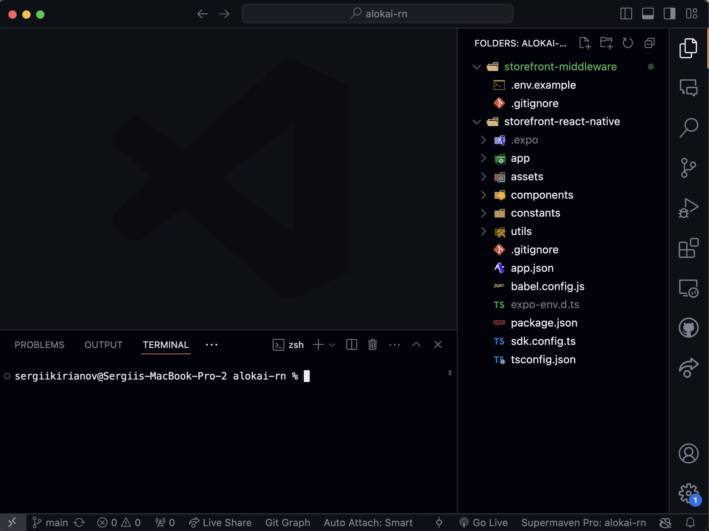
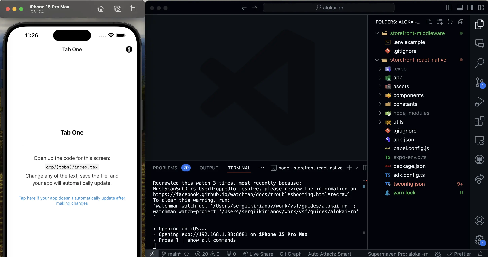

# Create new Alokai React Native Project

For the base of our project, we will use the Alokai React Native project created specifically for this guide.  It includes everything you need to get started, including a basic project structure, configuration files, and a set of pre-configured tools.

You can find the Alokai React Native guide project on GitHub.

**React Native Project** - [https://github.com/vuestorefront-community/alokai-rn-guide](https://github.com/vuestorefront-community/alokai-rn-guide)

This is a bare minimum setup containing folder for React Native (Expo) application and a placeholder for the Alokai Middleware. During this guide, we will use the `alokai-rn-guide` project to create a new Alokai project.

## Prerequisites

For this guide we will use SAP Commerce Cloud as the backend, but you can use any backend of your choice. Make sure you have your SAP Commerce Cloud instance up, running and accessible via REST API. 

## Get the Alokai React Native Guide Project

To create a new Alokai project with React Native, you will need to clone the `alokai-rn-guide` project from GitHub. You can do this by running the following command in your terminal:

```bash
git clone git@github.com:vuestorefront-community/alokai-rn-guide.git
```



Once you have cloned the `alokai-rn-guide` project, navigate to the project directory and install the project dependencies. Since the root project folder contains two projects and not a monorepo, you will need to install the dependencies for both the `storefront-react-native` and `storefront-middleware` projects. It is recommended to keep 2 temrinal windows open, one for each project.

```bash
# React Native project terminal 
cd alokai-rn-guide/storefront-react-native
yarn
```

```bash 
# Middleware project terminal 
cd alokai-rn-guide/storefront-middleware
yarn
```

This will install all the necessary dependencies for the project.

## Test the React Native Application

To test the React Native application, you can run the following command in the `storefront-react-native` project terminal:

```bash
npx expo start
```

This will start the Expo development server and open the simulator. You can also use the Expo Go app on your mobile device to test the application. 



:::tip
If you are not familiar with React Native or Expo, you can refer to the official documentation for more information:
- React Native - https://reactnative.dev/
- Expo - https://expo.dev/
:::

## Summary

In this section, we have learned how to create a new Alokai project with React Native. We have cloned the `alokai-rn-guide` project from GitHub and installed all the necessary dependencies.

In the next section, we will configure the `storefront-middleware` application and run it alongside the React Native application.

::card{title="Next: Install and Configure Alokai Middleware" icon="tabler:number-2-small" }

#description
Learn what the Alokai Middleware is and how to install and configure it in your Alokai project.

#cta
:::docs-button{to="/guides/alokai-essentials/alokai-react-native/install-middleware"}
Next
:::
::