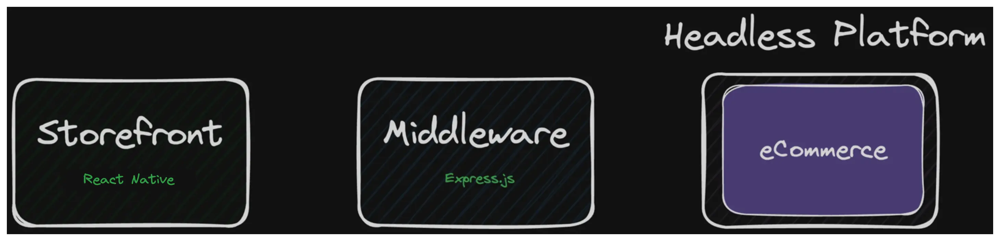
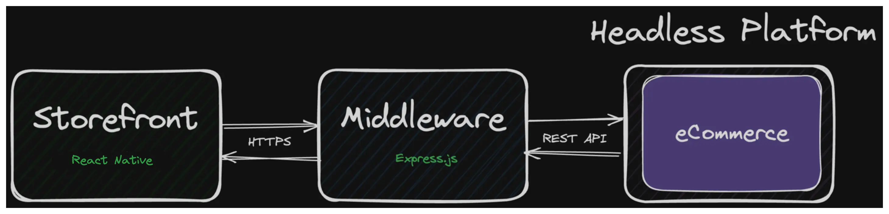
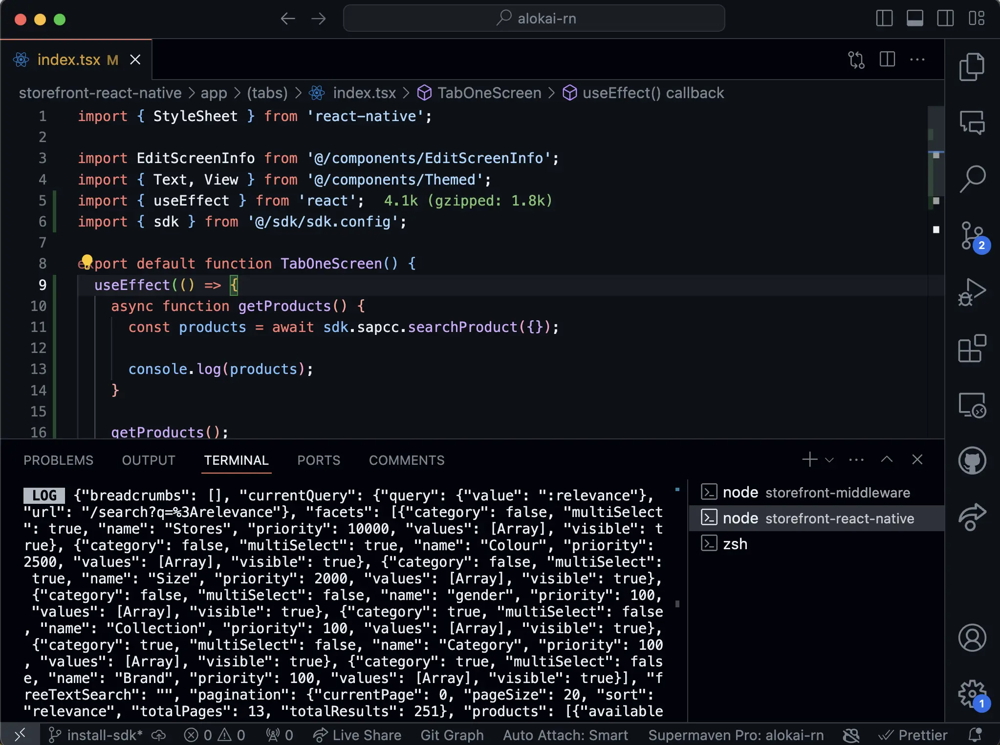

# First request with Alokai Connect

In the previous sections, we have successfully installed and configured Alokai Connect. Now, it is time to learn how the data is flowing in the application. For a deep dive in the Alokai architecture, please refer to the [Architecure Overview](/general/basics/architecture). In this guide, we will focus on a high-level overview of the data flow in the Alokai Connect.

## Data flow

Right now, we can visualize our application as shown in the diagram below:



The Storefront is a React Native application located in `storefront-react-native`. It is responsible for rendering the UI and handling the user interactions. The Storefront is using the Alokai SDK to communicate with Alokai Middleware. The Alokai Middleware is an Express.js application located in `storefront-middleware`. It is responsible for handling the requests from the Storefront and communicating with the SAP Commerce Cloud. 

The data flow is as follows:

1. The Storefront uses SDK methods to request data from the Alokai Middleware.
2. The Alokai Middleware handles the request and communicates with the SAP Commerce Cloud.
3. The SAP Commerce Cloud returns the requested data to the Alokai Middleware.
4. The Alokai Middleware returns the data to the Storefront.

Look at the diagram below to visualize the data flow:



Having a high-level overview of the data flow, we can now proceed to the next section to make our first request to the SAP Commerce Cloud.

## First request

To create your first request, let's use existing `storefront-react-native/app/(tabs)/index.tsx` file. We will use `searchProduct` SDK method to get the list of products from the SAP Commerce Cloud. For this example, we will simply use React's `useEffect` hook to make the request and log the product names in the console.

```tsx
// ...other imports
import { useEffect } from 'react';
import { sdk } from '@/sdk/sdk.config';

export default function TabOneScreen() {
  useEffect(() => {
    async function getProducts() {
      const products = await sdk.sapcc.searchProduct({});

      console.log(products);
    }

    getProducts();
  }, []);

  return (
    // no changes here
  );
}

// ...rest of the code
```

In the code above, we are using Alokai SDK's `searchProduct` method to send a request to the Alokai Middleware on `/searchProduct` endpoint. Middleware then sends a necessary request to SAP Commerce Cloud and returns response back to Storefront.

To run the application, execute the following commands from `storefront-react-native` directory:

```bash
npx expo start
```

As well, don't forget to run the Alokai Middleware from the `storefront-middleware` directory:

```bash
yarn dev
```

Open the application in the simulator or on a device. You should see the list of product names in the console.



::info
You can find complete implementation in the [`first-request` branch](https://github.com/vuestorefront-community/alokai-rn-guide/tree/first-request)
::

## Summary

In this guide we have successfully utilized Alokai Connect to create our first request to get data from SAP Commerce Cloud in React Native application. We also got a better understanding of data flow and how to use SDK and Middleware to fetch data. 

In the next section, we will learn how to build a Product Listing Page and Product Details page with Alokai.

::card{title="Next: Build PLP and PDP with Alokai" icon="tabler:number-5-small" }

#description
Learn how to build UIs with Alokai and React Native.

#cta
:::docs-button{to="/guides/alokai-essentials/alokai-react-native/product-page"}
Next
:::
::