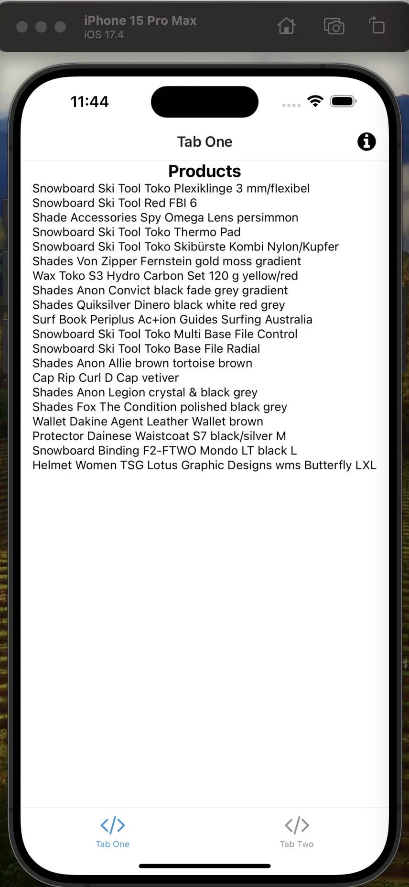
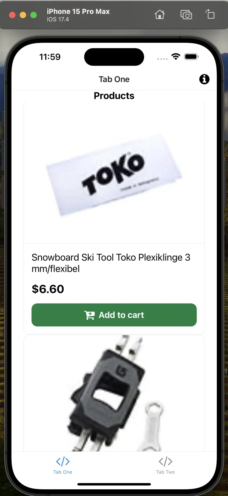
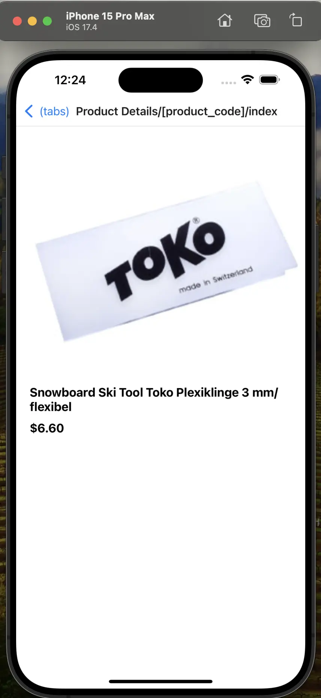

# Build Product Listing Page and Product Details Page with Alokai

In the previous step, we have made our first request. But without the UI, it's useless. So, in this step, we will learn how to build a Product Listing Page (PLP) and Product Details Page (PDP) with Alokai.

## Creating a Product Listing Page

First, we need to change our `app/(tabs)/index.tsx` file to display the list of products. Let's add a state to store the products and display them in the UI. Open the `app/(tabs)/index.tsx` file and add the following code:

```diff
export default function TabOneScreen() {
+ const [products, setProducts] = useState<Product[] | undefined>(undefined);
  
  useEffect(() => {
// ... rest of the code
```

You will notice that the `Product` type is not defined. In order to access SAPCC package types, we need to install the `@vsf-enterprise/sap-commerce-webservices-sdk` package. Run the following command in the root of your project to install the package:

```bash
yarn add @vsf-enterprise/sap-commerce-webservices-sdk
```

Now, we can import the `Product` type from the `@vsf-enterprise/sap-commerce-webservices-sdk` package. Add the following code at the top of the `app/(tabs)/index.tsx` file:

```tsx
import { Product } from '@vsf-enterprise/sap-commerce-webservices-sdk';
```

Next, let's fetch the list of products from the SAP Commerce Cloud backend and store them in the state. Replace the `getProducts` code with the following code:

```tsx
async function getProducts() {
  const { products } = await sdk.sapcc.searchProduct({});

  setProducts(products);
}
```

Now, let's display the list of products in the UI. Replace the `TabOneScreen` function with the following code:

```tsx
export default function ProductListingPage() {
  const [products, setProducts] = useState<Product[] | undefined>(undefined);

  useEffect(() => {
    async function getProducts() {
      const { products } = await sdk.sapcc.searchProduct({});

      setProducts(products);
    }

    getProducts();
  }, []);

  return (
    <View style={styles.container}>
      <Text style={styles.title}>Products</Text>
      <FlatList
        data={products}
        keyExtractor={(item) => item.code as string}
        renderItem={({ item }) => (
          <Text>{item.name}</Text>
        )}
      />
    </View>
  );
}
```

This is how your simulator should look like:



We have successfully fetched the list of products from the SAP Commerce Cloud backend and displayed them in the UI. But, the UI is not looking good. Let's use pre-built UI component `ProductCard` from `components` folder to display the product details.

### Using ProductCard Component

We will use the `ProductCard` component to display the product details. Open the `components/ProductCard.tsx` file. As you can see, right now it doesn't accept any props. Let's add the props to the `ProductCard` component.

Replace `ProductCard` in `components/ProductCard.tsx` with:

```tsx
import { Product } from "@vsf-enterprise/sap-commerce-webservices-sdk";
import { transformImageUrl } from "@/utils/transformImage";

export default function ProductCard({
  product,
}: {
  product: Product;
}) {
  return (
    <Link href={{
      pathname: "Product Details/[product_code]",
      params: { product_code: product.code },
    }}>
      <View style={styles.container}>
        <View style={styles.imageContainer}>
          <Image source={{ uri: transformImageUrl(product.firstVariantImage!) }} style={styles.image} />
        </View>
        <View style={styles.detailsContainer}>
          <Text style={styles.title}>{product.name}</Text>
          <Text style={styles.price}>{product.price?.formattedValue}</Text>
          <Pressable style={styles.addToCartButton}>
            <FontAwesome name="cart-plus" size={24} color="#fff" />
            <Text style={styles.addToCartButtonText}>Add to cart</Text>
          </Pressable>
        </View>
      </View>
    </Link>
  );
}
```

In the above code, we have added the `product` prop to the `ProductCard` component. And used various UI components like `View`, `Image`, `Text`, `Pressable`, and `FontAwesome` to display the product details.

Now, let's use the `ProductCard` component to display the product details in the `ProductListingPage`. Replace the `Text` component with the `ProductCard` component in the `FlatList` component in the `app/(tabs)/index.tsx` file:

```diff
- renderItem={({ item }) => (
-   <Text>{item.name}</Text>
- )}
+ renderItem={({ item }) => (
+   <ProductCard product={item} />
+ )}
```

Now, save the changes and run the application. Now, when you visit the product listing page, you will see the list of products displayed using the `ProductCard` component.



It's up to you to style the `ProductCard` component as you like, as well as to add more details to it and style the `ProductListingPage` as you like.

Next, let's create a Product Details Page to display the product details.

## Creating a Product Details Page

To create a Product Details Page, we need to create a new dynamic route for the product details page. Create a new directory `app/Product Details/[product_code]` in the `app` directory. Inside the `app/Product Details/[product_code]` directory, create a new file `index.tsx` and add the following code:

```tsx
import { Text, View } from "@/components/Themed";
import { sdk } from "@/sdk/sdk.config";
import { Product } from "@vsf-enterprise/sap-commerce-webservices-sdk";
import { useLocalSearchParams } from "expo-router";
import { useEffect, useState } from "react";

export default function ProductDetails() {
  const { product_code } = useLocalSearchParams();
  const [product, setProduct] = useState<Product | undefined>(undefined);

  useEffect(() => {
    async function getProduct() {
      const product = await sdk.sapcc.getProduct({
        id: product_code as string,
      });

      setProduct(product);
    }

    getProduct();
  }, [])

  return (
    <View>
      <Text>Product Details</Text>
      <Text>{product?.name}</Text>
    </View>
  )
}
```

This code fetches the product details from the SAP Commerce Cloud backend and displays the product name on the Product Details Page. Let's add more details to the Product Details Page and use other third-party UI components to display the product details.


Let's complete the Product Details Page by adding the following code:

:::info 
For the sake of this guide, all the necessary third-party libraries are already installed. You are free to use any other third-party libraries to display the product images. 
:::

To simplify the guide, we already prepared the `ProductDetails` page. You can find the complete code for the `ProductDetails` page below:

```tsx
import { Text, View } from "@/components/Themed";
import { sdk } from "@/sdk/sdk.config";
import { transformImageUrl } from "@/utils/transformImage";
import { Product } from "@vsf-enterprise/sap-commerce-webservices-sdk";
import { useLocalSearchParams } from "expo-router"
import { useEffect, useState } from "react";
import { Dimensions, Image, ScrollView, StyleSheet } from "react-native";
import Carousel from "react-native-reanimated-carousel";

export default function ProductScreen() {
  const { product_code } = useLocalSearchParams();
  const [product, setProduct] = useState<Product | null>(null);
  const width = Dimensions.get("window").width;

  useEffect(() => {
    async function fetchProduct() {
      const data = await sdk.sapcc.getProduct({ id: product_code as string });

      setProduct(data);
    }

    fetchProduct();
  }, []);

  if (!product) {
    return <Text>Loading...</Text>;
  }

  const galleryImages = product?.images?.filter((image) => image.imageType === "GALLERY" && image.format === "product")
    .map((image) => transformImageUrl(image.url as string)) as [] | string[];

  return (
    <ScrollView style={styles.page}>
      <View style={{
        ...styles.container,
      }}>
        <View>
          <Carousel
            loop
            pagingEnabled
            snapEnabled
            style={styles.imageContainer}
            width={width * 0.95}
            height={width * 0.8}
            data={galleryImages}
            renderItem={({ item }) => (
              <Image
                source={{ uri: item }}
                style={{ width: width * 0.95, height: width * 0.8 }}
              />
            )}
          />
        </View>
        <View style={styles.textContainer}>
          <Text style={styles.textBold}>{product.name}</Text>
          <Text style={styles.textBold}>{product.price?.formattedValue}</Text>
        </View>
        <View style={styles.summaryContainer}>
          <Text style={styles.summaryText}>{product?.summary}</Text>
        </View>
      </View>
    </ScrollView>
  )
}

const styles = StyleSheet.create({
  page: {
    backgroundColor: "#fff",
    flex: 1,
    padding: 20,
  },
  container: {
    flex: 1,
  },
  imageContainer: {
    flex: 1,
    justifyContent: "center",
    alignItems: "center",
  },
  textContainer: {
    flex: 1,
    flexDirection: "column",
    gap: 10,
    marginTop: 20,
  },
  textBold: {
    fontWeight: "bold",
    fontSize: 18,
  },
  summaryContainer: {
    marginTop: 16,
  },
  summaryText: {
    fontSize: 16,
    lineHeight: 20,
    color: "#666",
  },
})
```

The main logic in the above code remains the same. We use Alokai SDK to fetch the product details from the SAP Commerce Cloud backend. We use the `transformImageUrl` function to transform the image URL. We use the `Carousel` component from the `react-native-reanimated-carousel` package to display the product images. And we display the product name, price, and summary on the Product Details Page.



::info
You can find complete implementation in the [`product-page` branch](https://github.com/vuestorefront-community/alokai-rn-guide/tree/product-page)
::


## Summary

In this section, we have successfully built a Product Listing Page and Product Details Page with Alokai. We have fetched the list of products from the SAP Commerce Cloud backend and displayed them in the UI using the `ProductCard` component. We have also created a dynamic route for the Product Details Page and displayed the product details on the Product Details Page.

In the next section, we will learn how to work with the cart and add products to the cart.

::card{title="Next: Add product to Cart" icon="tabler:number-6-small" }

#description
Learn how to use Alokai Connect to add product to cart

#cta
:::docs-button{to="/guides/alokai-essentials/alokai-react-native/add-to-cart"}
Next
:::
