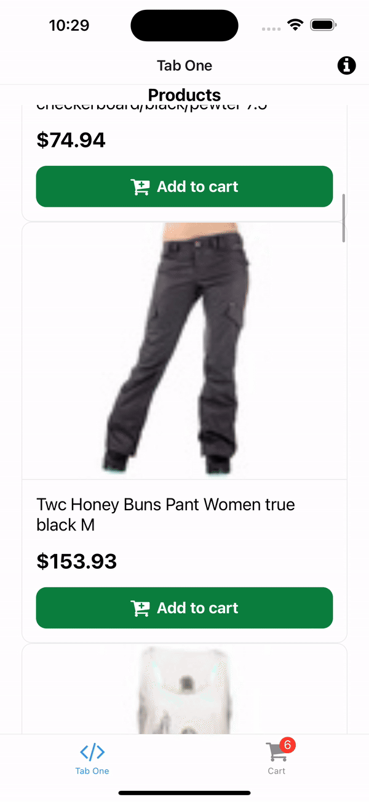

# Add Product to Cart

Just getting the data from the API is not enough. Ecommerce websites are feature rich and one of the most important features is the ability to add products to the cart. In this guide, we will learn how to add products to the cart in Alokai React Native application.

## Add to Cart

First, let's understand the process of adding a product to the cart. When a user clicks on the "Add to Cart" button, the product is added to the cart by it's `cartId`. The cart is a collection of products that the user wants to buy. The cart is stored in the backend and the frontend communicates with the backend to add products to the cart.

In order to achieve this, we will use Alokai SDK method `addToCart`. It will then send a request to Alokai Middleware and the middleware will add the product to the cart.

But that's not all. Since we are building a real-world application, we need to have a cart in a global state. So, let's first do some preparation.

## Preparation

We will create a new `CartContextProvider` component that will provide the cart to the entire application. We will also create a new `useCart` hook that will be used to access the cart from any component.

First, let's create a new `CartContextProvider` component. Create a new file inside `storefront-react-native/providers/CartContextProvider.tsx` and add the following code.

```tsx
import AsyncStorage from "@react-native-async-storage/async-storage";
import { Cart } from "@vsf-enterprise/sap-commerce-webservices-sdk";
import { createContext, useEffect, useState } from "react";
import { sdk } from "@/sdk/sdk.config";

export const CartContext = createContext<{
  cart: Cart;
  updateCart: (cart: Cart) => void;
}>({
  cart: {} as Cart,
  updateCart: () => { },
});

export default function CartContextProvider({ children }: { children: React.ReactNode }) {
  const [cart, setCart] = useState<Cart>({} as Cart);

  useEffect(() => {
    async function getCart() {
      let cart = JSON.parse(await AsyncStorage.getItem("cart") as string);

      if (!cart) {
        cart = await sdk.sapcc.createCart();
      }
      try {
        cart = await sdk.sapcc.getCart({
          cartId: cart.guid,
        });
      } catch {
        cart = await sdk.sapcc.createCart();
      } finally {
        await AsyncStorage.setItem("cart", JSON.stringify(cart));
      }
      setCart(cart);
    }

    getCart();
  }, []);

  async function updateCart(updatedCart: Cart) {
    setCart(updatedCart);
    await AsyncStorage.setItem("cart", JSON.stringify(updatedCart));
  }

  return <CartContext.Provider value={{ cart, updateCart }}>{children}</CartContext.Provider>;
}
```

The provider above is used to keep the cart in the global state and provide the cart to the entire application. We are using `AsyncStorage` to store the cart in the local storage and keep the cart updated in the global state. If cart is not available in the local storage, we are creating a new cart using the `createCart` method from the SDK.

Next, let's add our new `CartContextProvider` to the `app/_layout.tsx` file so that it is available to the entire application.

```diff
+import CartContextProvider from '@/providers/CartContextProvider';

function RootLayoutNav() {
  const colorScheme = useColorScheme();
  return (
    <ThemeProvider value={colorScheme === 'dark' ? DarkTheme : DefaultTheme}>
+      <CartContextProvider>
        <Stack>
          <Stack.Screen name="(tabs)" options={{ headerShown: false }} />
        </Stack>
+      </CartContextProvider>
    </ThemeProvider>
  );
}
```

Now, let's create a new `useCart` hook. Create a new file inside `storefront-react-native/hooks/useCart.ts` and add the following code.

```tsx
import { useContext } from "react";
import { CartContext } from "../providers/CartContextProvider";
import { Product } from "@vsf-enterprise/sap-commerce-webservices-sdk";
import { sdk } from "@/sdk/sdk.config";

export default function useCart() {
  const { cart, updateCart } = useContext(CartContext);

  async function addToCart(product: Product, quantity: number = 1) {
    try {
      await sdk.sapcc.addCartEntry({
        cartId: cart.guid as string,
        entry: {
          quantity: quantity,
          product: {
            code: product.code as string,
          },
        }
      })

      const updatedCart = await sdk.sapcc.getCart({
        cartId: cart.guid as string
      });

      updateCart(updatedCart)
    } catch (error) {
      console.error('Error adding to cart', error);
    }
  }

  return {
    cart,
    addToCart
  }
}

```

This hook will be used to access the cart and add products to the cart. We are using the `useContext` hook to access the cart from the `CartContextProvider` component and keeping the cart updated in the global state.

Now, we can use the `useCart` hook to access the cart and add products to the cart from any component.

## Add to Cart Button

Since `ProductDetails` page already has the product data and we can add the "Add to Cart" button to the component and call the `addToCart` function. Open the `Product Details/[product_code]/index.tsx` file and add the following code.

```tsx
// ... imports
import useCart from "@/hooks/useCart";

export default function ProductScreen() {
  // ... rest of the code
  const [loading, setLoading] = useState(false);
  const { addToCart } = useCart();

  const addToCartFunction = async () => {
    setLoading(true);
    await addToCart(product);
    setLoading(false);
    Alert.alert("Product added to cart");
  }

  return (
    // ... rest of the code
    <Pressable style={{
          ...styles.addToCartButton,
          backgroundColor: loading ? '#a5a5a5' : '#0d7f3f',
        }} onPress={addToCartFunction}>
          {loading ? <FontAwesome name="spinner" size={24} color="#fff" /> : <FontAwesome name="cart-plus" size={24} color="#fff" />}
          <Text style={styles.addToCartButtonText}>{loading ? 'Adding to cart...' : 'Add to cart'}</Text>
    </Pressable>
    // ... rest of the code
  )
}

const styles = StyleSheet.create({
  // ... rest of the code
  addToCartButton: {
    marginTop: 16,
    display: 'flex',
    flexDirection: 'row',
    alignItems: 'center',
    justifyContent: 'center',
    gap: 8,
    backgroundColor: '#0d7f3f',
    padding: 12,
    borderRadius: 12,
  },
  addToCartButtonText: {
    color: '#fff',
    fontSize: 18,
    fontWeight: 'bold',
    textAlign: 'center',
  },
})
```

Now, when the user clicks on the "Add to Cart" button, the product will be added to the cart and the cart will be updated in the global state.

Let's test it! 

## Test it

Let's modify our second tab to create a simplified Cart page. Open `app/(tabs)/two.tsx` and replace the content with the following code.

```tsx
import { StyleSheet } from 'react-native';
import { Text, View } from '@/components/Themed';
import useCart from '@/hooks/useCart';

export default function CartPage() {
  const { cart } = useCart();

  if (cart.entries && cart.entries.length === 0) {
    return <Text>No items in cart</Text>;
  }

  return (
    <View style={styles.container}>
      <Text style={styles.heading}>Total {cart.totalItems} items</Text>
      {cart.entries && cart.entries.map((entry) => (
        <View key={entry.product?.code} style={styles.itemContainer}>
          <Text>- {entry.quantity} x {entry.product?.name}</Text>
          <Text>Total: {entry.totalPrice?.formattedValue}</Text>
        </View>
      ))}
      <Text style={styles.heading}>Grand Total: {cart.totalPrice?.formattedValue}</Text>
    </View>
  );
}

const styles = StyleSheet.create({
  container: {
    flex: 1,
    padding: 20,
  },
  heading: {
    fontSize: 24,
    fontWeight: 'bold',
    marginBottom: 16,
  },
  itemContainer: {
    display: 'flex',
    flexDirection: 'column',
    gap: 4,
    marginBottom: 16,
  }
});
```

Let's also change the `(tabs)/_layouts.tsx` file to add a better icon for the Cart tab.

```diff
export default function TabLayout() {
  const colorScheme = useColorScheme();
+  const { cart } = useCart();

  return (
    <Tabs
      screenOptions={{
        tabBarActiveTintColor: Colors[colorScheme ?? 'light'].tint,
        // Disable the static render of the header on web
        // to prevent a hydration error in React Navigation v6.
        headerShown: useClientOnlyValue(false, true),
      }}>
      // ... rest of the code
      <Tabs.Screen
        name="two"
        options={{
          title: 'Tab Two',
-          tabBarIcon: ({ color }) => <TabBarIcon name="code" color={color} />,
+          tabBarIcon: ({ color }) => <TabBarIcon name="shopping-cart" color={color} />,
+          tabBarBadge: cart.totalItems,
        }}
      />
    </Tabs>
  );
}
```

Now, when the user adds a product to the cart, the number of products in the cart will be displayed in the tab. The cart will be updated in the global state and the user will be able to see the number of products in the cart from any page.

Here's how it looks like:



That's it! We have successfully added the product to the cart and displayed the number of products in the cart in tab icon.

Congratulations! You have successfully added products to the cart in Alokai React Native application. 🎉

::info
You can find a complete code for this guide in the [add-to-cart branch](https://github.com/vuestorefront-community/alokai-rn-guide/tree/add-to-cart).
::

## Summary

In this guide, we learned how to add products to the cart in Alokai React Native application. We created a new `CartContextProvider` component that provides the cart to the entire application and a new `useCart` hook that is used to access the cart from any component. We also added the `Cart` page that displays the number of products in the cart.

We are done with the basics of Alokai React Native application.

You can now move on to the next guide to learn more advanced concepts and features of Alokai or start building your own Alokai React Native application and come back later to learn more advanced concepts. 

::card{title="Next: Unified Data Layer" icon="tabler:hexagon-7-filled" }

#description
Learn how to install, configure and use Unified Data Layer

#cta
:::docs-button{to="/guides/alokai-essentials/alokai-react-native/udl"}
Next
:::


