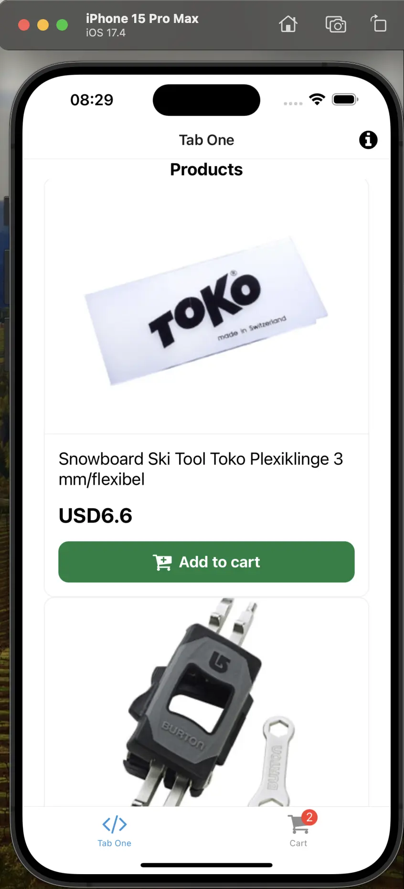

# Unified Data Layer
::info
The Unified Data Layer is an enterprise-only feature which means you need to have Alokai Enterprise License in order to be able to use it.
::
The Unified Data Layer (UDL) is a new concept introduced by Alokai. This is a layer in the Alokai Middleware and Storefront that allows for unification of data from different sources. The UDL provides a standardized way to interact with data, regardless of the eCommerce platform you're using. The UDL provides a structured way to manage this data, ensuring that regardless of the platform — be it Commercetools, SAPCC, or BigCommerce — the data is consistently represented. 

## Prerequisites

Before we proceed, please take your time and learn more about the UDL in the [Unified Data Layer](https://docs.vuestorefront.io/storefront/unified-data-layer) section of Storefront documentation.

## UDL in Alokai React Native Application

In order to help you understand Unified Data Layer better, let's add it to our Alokai React Native application. This will allow us to connect our application to different eCommerce platforms preserving the same data structure and UI components.

::info
If you don't have any other ecommerce platform installed - no worries, you can just follow this guide to have a better understanding of how UDL works.
::

## Installation and Configuration

In order to install Unified Data Model, we need to install `@vsf-enterprise/unified-api-sapcc` package. This package is a set of Unified API Extensions for SAP Commerce Cloud. 

### Preparations

When working with Alokai Unified Data Layer, we are following a specific project structure for Middleware. Let's implement the same structure in our Alokai React Native application.

First, let's create a new directory inside `storefront-middleware` called integrations:
  
```bash
mkdir storefront-middleware/integrations
```

Next, let's create a new `sapcc` directory inside `integrations` directory:

```bash
mkdir storefront-middleware/integrations/sapcc
```

Inside, we will store the configuration for the SAP Commerce Cloud API. Create a new file called `config.ts` and add the following code:

```ts
require('dotenv').config();
import type { MiddlewareConfig } from '@vsf-enterprise/sapcc-api';
import type { Integration } from '@vue-storefront/middleware';

const {
  SAPCC_OAUTH_URI,
  SAPCC_OAUTH_CLIENT_ID,
  SAPCC_OAUTH_CLIENT_SECRET,
  SAPCC_OAUTH_TOKEN_ENDPOINT,
  SAPCC_OAUTH_TOKEN_REVOKE_ENDPOINT,
  SAPCC_API_URI,
  NODE_ENV
} = process.env;

if (!SAPCC_OAUTH_URI)
  throw new Error('Missing env var: SAPCC_OAUTH_URI');

if (!SAPCC_OAUTH_CLIENT_ID)
  throw new Error('Missing env var: SAPCC_OAUTH_CLIENT_ID');

if (!SAPCC_OAUTH_CLIENT_SECRET)
  throw new Error('Missing env var: SAPCC_OAUTH_CLIENT_SECRET');

if (!SAPCC_OAUTH_TOKEN_ENDPOINT)
  throw new Error('Missing env var: SAPCC_OAUTH_TOKEN_ENDPOINT');

if (!SAPCC_OAUTH_TOKEN_REVOKE_ENDPOINT)
  throw new Error('Missing env var: SAPCC_OAUTH_TOKEN_REVOKE_ENDPOINT');

if (!SAPCC_API_URI)
  throw new Error('Missing env var: SAPCC_API_URI');

export const config = {
  location: '@vsf-enterprise/sapcc-api/server',

  configuration: {
    OAuth: {
      uri: SAPCC_OAUTH_URI,
      clientId: SAPCC_OAUTH_CLIENT_ID,
      clientSecret: SAPCC_OAUTH_CLIENT_SECRET,
      tokenEndpoint: SAPCC_OAUTH_TOKEN_ENDPOINT,
      tokenRevokeEndpoint: SAPCC_OAUTH_TOKEN_REVOKE_ENDPOINT,

      cookieOptions: {
        'vsf-sap-token': {
          secure: NODE_ENV !== 'development'
        }
      }
    },

    api: {
      uri: SAPCC_API_URI,
      baseSiteId: 'apparel-uk',
      catalogId: 'apparelProductCatalog',
      catalogVersion: 'Online',
      defaultLanguage: 'en',
      defaultCurrency: 'USD'
    }
  },
} satisfies Integration<MiddlewareConfig>;
``` 

This file exports a `config` object that contains the configuration for the SAP Commerce Cloud API. It is used to configure Middleware to work with the SAP Commerce Cloud API.

Next, let's modify out `middleware.config.ts` file to include the SAP Commerce Cloud API configuration. Replace the content of the `middleware.config.ts` file with the following code:

```ts
import { config as commerceConfig } from "./integrations/sapcc/config";

export const config = {
  integrations: {
    commerce: commerceConfig,
  },
};
```

You can see that we have renamed the `sapcc` object to `commerce` object. This is because we are going to use the Unified Data Layer, which is a generic layer that can be used with different eCommerce platforms.

Now, let's install and configure the Unified Data Layer in our Alokai React Native application. Inside the `storefront-middleware` directory, install the `@vsf-enterprise/unified-api-sapcc` package:

```bash
yarn add @vsf-enterprise/unified-api-sapcc
``` 

Create a new directory inside `storefront-middleware/integrations/sapcc` called `extensions` and add a new file called `unified.ts`:

```ts
import { createUnifiedExtension } from "@vsf-enterprise/unified-api-sapcc";

const { SAPCC_MEDIA_HOST } = process.env;

export const unifiedApiExtension = createUnifiedExtension({
  normalizers: {
    addCustomFields: [{}],
  },
  config: {
    transformImageUrl: (url) => {
      if (SAPCC_MEDIA_HOST) {
        return new URL(url, SAPCC_MEDIA_HOST).toString();
      }

      const [imagePathWithoutParams, searchParams = ""] = url.split("?");
      const segmentsParameter = imagePathWithoutParams.split("/").filter(Boolean);
      const sapContextSearchParameter = new URLSearchParams(searchParams).get("context");

      return `sap/${segmentsParameter}/context/${sapContextSearchParameter}`;
    },
    currencies: ["USD", "EUR", "GBP"],
    defaultCurrency: "USD",
    getFacetType: (facet) => {
      if (facet.name === "Colour" || facet.name === "Farbe") {
        return "COLOR";
      }
      if (facet.name === "Size" || facet.name === "Größe") {
        return "SIZE";
      }
      if (facet.name === "Category" || facet.name === "Kategorie") {
        return "CATEGORY";
      }
      return facet.multiSelect ? "MULTI_SELECT" : "SINGLE_SELECT";
    },
  },
});
``` 

This file exports the `unifiedApiExtension` object, which is used to configure the Unified Data Layer. The `unifiedApiExtension` object is the result of calling `createUnifiedExtension` function with `normalizers` and `config` as arguments.

Instead of doing the image URL transformation in the React Native application, we are doing it in the Middleware.

Next, let's add the `unifiedApiExtension` to the `extensions` array in the `sapcc/config.ts` file:

```diff
+import type { ApiClientExtension, Integration } from '@vue-storefront/middleware';
+import { unifiedApiExtension } from './extensions/unified';

// ... rest of the code

export const config = {
  location: '@vsf-enterprise/sapcc-api/server',

  configuration: {
    // ... rest of the configuration
  },
+  extensions: (extensions: ApiClientExtension[]) => [
+    ...extensions,
+    unifiedApiExtension
+  ]
} satisfies Integration<MiddlewareConfig>;
```

Last, let's replace the `src/index.ts` with the following code:

```ts
import { type CreateServerOptions, createServer } from "@vue-storefront/middleware";
import { config } from "../middleware.config";

const developmentCorsConfig: CreateServerOptions["cors"] = {
  origin: true,
  credentials: true,
};
const port = Number(process.env.API_PORT) || 4000;

runApp();

async function runApp() {
  const app = await createServer(config, {
    cors: process.env.NODE_ENV === "development" ? developmentCorsConfig : undefined,
  });

  app.listen(port, "", () => {
    console.log(`API server listening on port ${port}`);

    if (process.env.IS_MULTISTORE_ENABLED === "false") {
      console.log("Multistore is not enabled");
      return;
    }
  });
}
```

Essentially, it does the same thing as the previous version of the file, but it uses the `config` object from the `middleware.config.ts` file. This way, we can easily update the configuration without having to modify the entire file.

### Configuring Alokai SDK

Since `storefront-middleware` and `storefront-react-native` are basically two independent applications, we need to install the `@vsf-enterprise/unified-api-sapcc` package in the `storefront-react-native` application as well. 

```bash
yarn add @vsf-enterprise/unified-api-sapcc
```

Then, let's configure the Alokai SDK to work with the Unified Data Layer. Open `storefront-react-native/sdk/sdk.config.ts` file and replace the `sapcc` module with the `unified` module:

```diff
import { initSDK, buildModule, middlewareModule } from "@vue-storefront/sdk";
-import { Endpoints as SapccEndpoints } from "@vsf-enterprise/sapcc-api";
+import { Endpoints as UnifiedEndpoints } from "@vsf-enterprise/unified-api-sapcc";

const sdkConfig = {
-  sapcc: buildModule(middlewareModule<SapccEndpoints>, {
+  commerce: buildModule(middlewareModule<UnifiedEndpoints>, {
-    apiUrl: "http://localhost:8181/sapcc",
+    apiUrl: "http://localhost:4000/commerce",
    cdnCacheBustingId: "",
  }),
};

export const sdk = initSDK(sdkConfig);
```

This code imports the `UnifiedEndpoints` type from the `@vsf-enterprise/unified-api-sapcc` package and uses it to create the `unified` module in the SDK configuration. The `unified` module uses the `middlewareModule` method to create a module based on the `UnifiedEndpoints` type.

### The missing pieces 

We have successfully installed and configured Unified Data Layer in our Alokai React Native application. However, we are still missing the Unified Data Model types. Storefront with Unified Data Model is made to have SDK methods to automatically generate type safe methods based on Unified `apiMethods` object. In order to achieve this, we need to create types for the Unified Data Model.

Create a new file inside `sdk` directory called `types.ts` and add the following code:

```ts
import { Endpoints as UnifiedEndpoints } from "@vsf-enterprise/unified-api-sapcc";

export type InferSdk<TName extends keyof UnifiedEndpoints> = Awaited<ReturnType<UnifiedEndpoints[TName]>>;

export type InferSdkArgs<TName extends keyof UnifiedEndpoints> = Parameters<UnifiedEndpoints[TName]>[0];
```

This file exports a generic type `InferSdk` that takes a method name as an argument and returns the return type of that method. It also exports a generic type `InferSdkArgs` that takes a method name as an argument and returns the argument type of that method.

Next, let's create product types for the Unified Data Model. Create a new directory in the root of the `storefront-react-native` project called `types` and add a new file called `product.ts`:

```ts
import { InferSdk } from '../sdk/types';

export type SfProductCatalogItem = InferSdk<'searchProducts'>['products'][number];
export type SfProduct = InferSdk<'getProductDetails'>['product'];
```

For now, we have created two types: `SfProductCatalogItem` and `SfProduct`. These types are used to represent the product data from the Unified Data Model. The `SfProductCatalogItem` type represents the product data from the `searchProducts` method, while the `SfProduct` type represents the product data from the `getProductDetails` method.


## Using Unified Data Layer in React Native Application

Unified Data Layer brings a lot of benefits to the Alokai React Native application. It allows us to use the same data structure and UI components across different eCommerce platforms. In order to use it though, your UI has to conform Unified Data Model structure. 

Let's replace the types across the application with the Unified Data Model types. For example, in the `ProductDetails` component, we can replace the `Product` type with the `SfProduct` type from the Unified Data Model:

```diff
- import { Product } from '@vsf-enterprise/sap-commerce-webservices-sdk';
+import { SfProduct } from "@/types/product";
```

This change will allow us to use the same `ProductDetails` component across different eCommerce platforms. 

But, it also breaks the application. Let's go and fix the errors.

::info
Ideally, the UDL allows us to infer types when we are making any changes to the unified API methods or create custom methods. In cases like this, where Middleware and React Native are two separate applications, it's recommended to create a shared package that contains the types and share it between the two applications.
::

### Fixing types across the application

First, we need to change how we are fetching data. Since we replaced `sapcc` module with `commerce` module, we need to change the method names across the application. For example, in the `Product Details/[product_code]/index.tsx` file, we need to replace the `getProduct` method with the `getProductDetails` method from the `unified` module:

```diff
- const data = await sdk.sapcc.getProduct({ id: product_code as string });
- setProduct(data);

+ const { product } = await sdk.commerce.getProductDetails({ id: product_code as string });
+ setProduct(product);
```

You will see that the `product.images` property is now missing. This is because we are using the `SfProduct` type from the Unified Data Model, which doesn't have the `images` property. Instead, we need to use `product.gallery` property from the Unified Data Model. Let's replace the `product.images` property with the `product.gallery` property:

```diff
- const galleryImages = product?.images?.filter((image) => image.imageType === "GALLERY" && image.format === "product").map((image) => transformImageUrl(image.url as string)) as [] | string[];

// ... rest of the code

<Carousel
  // ...rest of the code
-  data={galleryImages}
+  data={product.gallery}
  renderItem={({ item }) => (
    <Image
-     source={{ uri: item }}
+     source={{ uri: item.url }}
      style={{ width: width * 0.95, height: width * 0.8 }}
    />
  )}
/>
```

::info
Use the approach we learned above to fix the types in the rest of the application.
::

Below you can find the final version of the `ProductDetails` component:

```tsx
import { Text, View } from "@/components/Themed";
import useCart from "@/hooks/useCart";
import { sdk } from "@/sdk/sdk.config";
import { SfProduct } from "@/types/product";
import { FontAwesome } from "@expo/vector-icons";
import { useLocalSearchParams } from "expo-router"
import { useEffect, useState } from "react";
import { Alert, Dimensions, Image, Pressable, ScrollView, StyleSheet } from "react-native";
import Carousel from "react-native-reanimated-carousel";

export default function ProductScreen() {
  const { product_code } = useLocalSearchParams();
  const [product, setProduct] = useState<SfProduct | null>(null);
  const [loading, setLoading] = useState(false);
  const width = Dimensions.get("window").width;
  const { addToCart } = useCart();

  useEffect(() => {
    async function fetchProduct() {
      const { product } = await sdk.commerce.getProductDetails({ id: product_code as string });

      setProduct(product);
    }

    fetchProduct();
  }, []);

  if (!product) {
    return <Text>Loading...</Text>;
  }

  const addToCartFunction = async () => {
    setLoading(true);
    await addToCart(product);
    setLoading(false);
    Alert.alert("Product added to cart");
  }

  return (
    <ScrollView style={styles.page}>
      <View style={{
        ...styles.container,
        backgroundColor: loading ? '#e5e5e5' : '#fff',
      }}>
        <View>
          <Carousel
            loop
            pagingEnabled
            snapEnabled
            style={styles.imageContainer}
            width={width * 0.95}
            height={width * 0.8}
            data={product.gallery}
            renderItem={({ item }) => (
              <Image
                source={{ uri: item.url }}
                style={{ width: width * 0.95, height: width * 0.8 }}
              />
            )}
          />
        </View>
        <View style={styles.textContainer}>
          <Text style={styles.textBold}>{product.name}</Text>
          <Text style={styles.textBold}>{product.price?.value.amount}</Text>
        </View>
        <View style={styles.summaryContainer}>
          <Text style={styles.summaryText}>{product?.description}</Text>
        </View>
        <Pressable style={{
          ...styles.addToCartButton,
          backgroundColor: loading ? '#a5a5a5' : '#0d7f3f',
        }} onPress={addToCartFunction}>
          {loading ? <FontAwesome name="spinner" size={24} color="#fff" /> : <FontAwesome name="cart-plus" size={24} color="#fff" />}
          <Text style={styles.addToCartButtonText}>{loading ? 'Adding to cart...' : 'Add to cart'}</Text>
        </Pressable>
      </View>
    </ScrollView>
  )
}

const styles = StyleSheet.create({
  page: {
    backgroundColor: "#fff",
    flex: 1,
    padding: 20,
  },
  container: {
    flex: 1,
  },
  imageContainer: {
    flex: 1,
    justifyContent: "center",
    alignItems: "center",
  },
  textContainer: {
    flex: 1,
    flexDirection: "column",
    gap: 10,
    marginTop: 20,
  },
  textBold: {
    fontWeight: "bold",
    fontSize: 18,
  },
  summaryContainer: {
    marginTop: 16,
  },
  summaryText: {
    fontSize: 16,
    lineHeight: 20,
    color: "#666",
  },
  addToCartButton: {
    marginTop: 16,
    display: 'flex',
    flexDirection: 'row',
    alignItems: 'center',
    justifyContent: 'center',
    gap: 8,
    backgroundColor: '#0d7f3f',
    padding: 12,
    borderRadius: 12,
  },
  addToCartButtonText: {
    color: '#fff',
    fontSize: 18,
    fontWeight: 'bold',
    textAlign: 'center',
  },
})
```

We have applied the fixes across the application and now, let's run the app and see the results.

Everything seems to run fine, but our images are not working anymore. If you take a look at `storefront-middleware/integrations/sapcc/extensions/unified.ts` file, you will see that we are transforming the image URL, but we are missing the `SAPCC_MEDIA_HOST` environment variable. Let's add it to the `.env` file:

```env
SAPCC_MEDIA_HOST=
```

This will be the base URL for the images, almost identical to `SAPCC_API_URI` but without `occ/v2/` part. Restart the `middleware` and `storefront` applications and you should see the images.



## Conclusion

In this guide, we have learned how to add Unified Data Layer to our Alokai React Native application. We have successfully installed and configured Unified Data Layer in our Alokai Middleware and SDK. We have replaced the types across the application with the Unified Data Model types, and as well, we have fixed the errors across the application. We have learned how to use the same data structure and UI components across different eCommerce platforms.

::info
As usual, you can find the final version of the application in the [udl branch](https://github.com/vuestorefront-community/alokai-rn-guide/tree/udl) of the React Native Guide repository.
::
