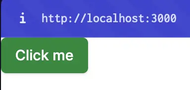
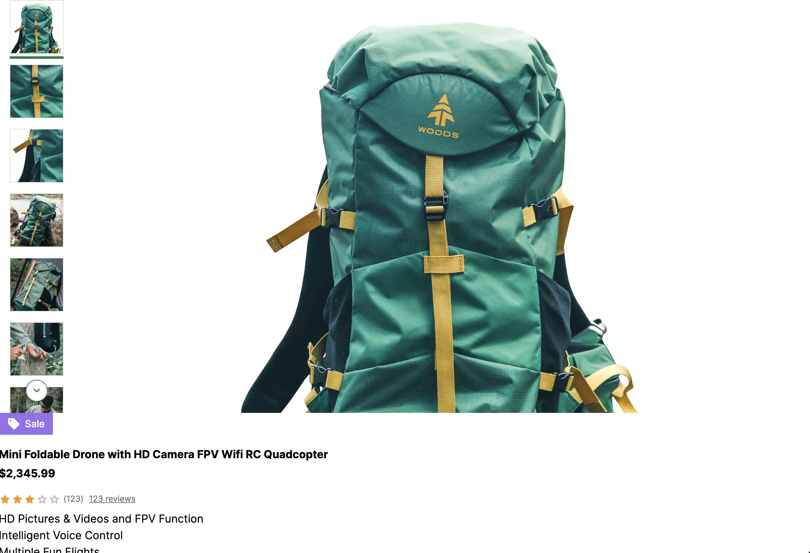
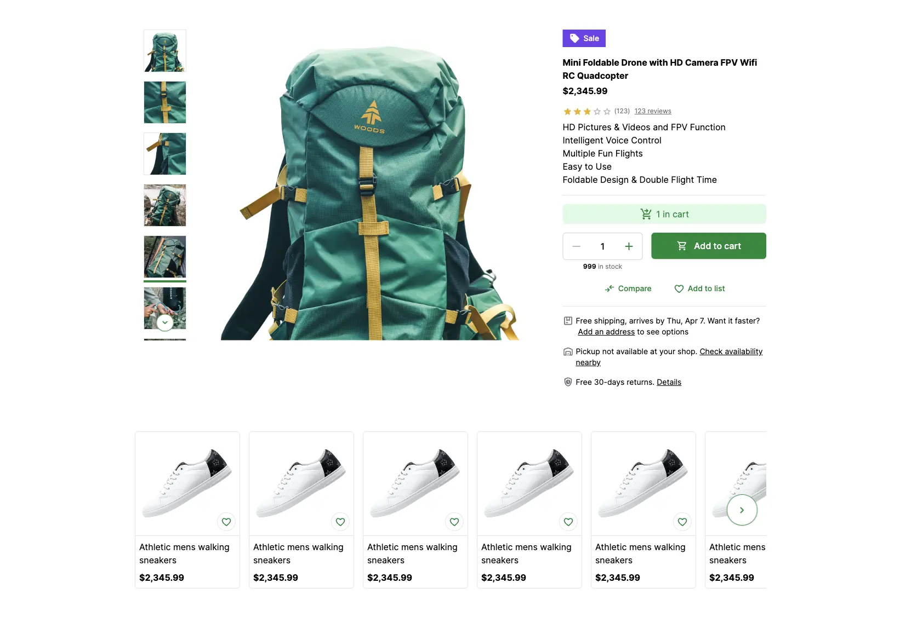

# Build Product Details Page with Storefront UI

Every eCommerce application needs appealing, fast and responsive UI to attract and retain customers. With Storefront UI building one is easy and fast! In this guide, let's learn how to build a Product Details page. We will learn how to use Storefront UI components, blocks and of course how to customise them.

::info
Already familiar with **Storefront UI**? You can skip this section and jump to [Connecting Product Details Page with SAP Commerce Cloud](./6.connecting-pdp). You can find the code for this guide in the [nuxt-starter/product-page branch](https://github.com/vuestorefront-community/nuxt-starter/tree/product-page)
::

## Installing Storefront UI 

First, in order to use Storefront UI we need to install and configure it. Luckily, it's very easy to do.

### Install Storefront UI

In the `storefront` directory, install Storefront UI by running the following command:

```bash
npm i -D @storefront-ui/nuxt
```

Add the Nuxt Tailwind module to your `nuxt.config.ts`:

```diff[nuxt.config.ts]
export default defineNuxtConfig({
-  modules: ["@vue-storefront/nuxt"]
+  modules: ["@vue-storefront/nuxt", "@storefront-ui/nuxt"],
})
```

Next, initialize Tailwind CSS by running the following command:

```bash
npx tailwindcss init
```

All set! Now, let's configure Storefront UI.

### Configure Storefront UI

In the `storefront` directory, rename the `tailwind.config.js` file to `tailwind.config.ts` and update the file with the following content:

```typescript
import type { Config } from "tailwindcss";

export default <Config>{
  content: [
    "./**/*.vue",
    "../../node_modules/@storefront-ui/vue/**/*.{js,mjs}",
  ],
};
```

This will configure Tailwind CSS to work with Nuxt file structure and Storefront UI.

### First Storefront UI Component

Now, let's use the first Storefront UI component in the `apps/storefront/pages/index.vue` file. Add the following code to the file:

```diff
<template>
  <div>
+    <SfButton> Hello </SfButton>
    <h1>Product List:</h1>
    <ul>
      <li v-for="product in data.products">{{ product.name }}</li>
    </ul>
  </div>
</template>

<script setup lang="ts">
const sdk = useSdk();

const { data } = await sdk.sapcc.getProducts({});
</script>

```

Here's how the result should look like:



Great! Now, let's build the Product Details page with Storefront UI.

## Building Product Details Page

Storefront UI is a very versatile library that provides a lot of components and blocks to build a modern eCommerce application. In this guide, we will build a Product Details page using Storefront UI components and blocks.

First, let's visit Storefront UI documentation to see what components and blocks are available. You can find the [SFUI Documentation here](https://docs.storefrontui.io/v2/components).

Storefront UI provides two type of components: Base Components and Blocks. Base Components are the basic building blocks of the UI and Blocks are the pre-built components that can be used to build a page. Blocks are made up of Base Components. Blocks are very useful to build a page quickly and easily without writing a lot of code. This is exactly what we need to build a Product Details page.

### Product Details Page Blocks

To build the Product Details we will use the following Storefront UI Blocks:

- [Product Details](https://docs.storefrontui.io/v2/vue/blocks/productcard)
- [Product Gallery with Vertical Thumbnails](https://docs.storefrontui.io/v2/vue/blocks/gallery)
- [Product Slider](https://docs.storefrontui.io/v2/vue/blocks/productslider)

Let's start building the page!

### Product Details Page

Storefront UI is not like most traditional UI libraries. Blocks are too complex to be used directly imported from the library. It would be very difficult and time consuming to customize them. So, instead, Storefront UI provides Blocks that can be copied and pasted into the project and then customized. Since all of the source code is available directly to you, including any styles - you have full control to change the styling.

First, let's create new files for the Product Details page. In the `storefront` directory, create a new directory called `components` and inside it create a new file called `ProductDetails.vue`. Add the code from the [Product Details](https://docs.storefrontui.io/v2/vue/blocks/ProductCard.html#details) `Code` tab to the file:

```vue
<template>
  <section class="md:max-w-[640px]">
    <div
      class="inline-flex items-center justify-center text-sm font-medium text-white bg-secondary-600 py-1.5 px-3 mb-4"
    >
      <SfIconSell size="sm" class="mr-1.5" />
      Sale
    </div>
    <h1 class="mb-1 font-bold typography-headline-4">Mini Foldable Drone with HD Camera FPV Wifi RC Quadcopter</h1>
    <strong class="block font-bold typography-headline-3">$2,345.99</strong>
    <div class="inline-flex items-center mt-4 mb-2">
      <SfRating size="xs" :value="3" :max="5" />
      <SfCounter class="ml-1" size="xs">123</SfCounter>
      <SfLink href="#" variant="secondary" class="ml-2 text-xs text-neutral-500"> 123 reviews </SfLink>
    </div>
    <ul class="mb-4 font-normal typography-text-sm">
      <li>HD Pictures & Videos and FPV Function</li>
      <li>Intelligent Voice Control</li>
      <li>Multiple Fun Flights</li>
      <li>Easy to Use</li>
      <li>Foldable Design & Double Flight Time</li>
    </ul>
    <div class="py-4 mb-4 border-gray-200 border-y">
      <div
        class="bg-primary-100 text-primary-700 flex justify-center gap-1.5 py-1.5 typography-text-sm items-center mb-4 rounded-md"
      >
        <SfIconShoppingCartCheckout />
        1 in cart
      </div>
      <div class="items-start xs:flex">
        <div class="flex flex-col items-stretch xs:items-center xs:inline-flex">
          <div class="flex border border-neutral-300 rounded-md">
            <SfButton
              variant="tertiary"
              :disabled="count <= min"
              square
              class="rounded-r-none p-3"
              :aria-controls="inputId"
              aria-label="Decrease value"
              @click="dec()"
            >
              <SfIconRemove />
            </SfButton>
            <input
              :id="inputId"
              v-model="count"
              type="number"
              class="grow appearance-none mx-2 w-8 text-center bg-transparent font-medium [&::-webkit-inner-spin-button]:appearance-none [&::-webkit-inner-spin-button]:display-none [&::-webkit-inner-spin-button]:m-0 [&::-webkit-outer-spin-button]:display-none [&::-webkit-outer-spin-button]:m-0 [-moz-appearance:textfield] [&::-webkit-outer-spin-button]:appearance-none disabled:placeholder-disabled-900 focus-visible:outline focus-visible:outline-offset focus-visible:rounded-sm"
              :min="min"
              :max="max"
              @input="handleOnChange"
            />
            <SfButton
              variant="tertiary"
              :disabled="count >= max"
              square
              class="rounded-l-none p-3"
              :aria-controls="inputId"
              aria-label="Increase value"
              @click="inc()"
            >
              <SfIconAdd />
            </SfButton>
          </div>
          <p class="self-center mt-1 mb-4 text-xs text-neutral-500 xs:mb-0">
            <strong class="text-neutral-900">{{ max }}</strong> in stock
          </p>
        </div>
        <SfButton size="lg" class="w-full xs:ml-4">
          <template #prefix>
            <SfIconShoppingCart size="sm" />
          </template>
          Add to cart
        </SfButton>
      </div>
      <div class="flex justify-center mt-4 gap-x-4">
        <SfButton size="sm" variant="tertiary">
          <template #prefix>
            <SfIconCompareArrows size="sm" />
          </template>
          Compare
        </SfButton>
        <SfButton size="sm" variant="tertiary">
          <SfIconFavorite size="sm" />
          Add to list
        </SfButton>
      </div>
    </div>
    <div class="flex first:mt-4">
      <SfIconPackage size="sm" class="flex-shrink-0 mr-1 text-neutral-500" />
      <p class="text-sm">
        Free shipping, arrives by Thu, Apr 7. Want it faster?
        <SfLink href="#" variant="secondary" class="mx-1"> Add an address </SfLink>
        to see options
      </p>
    </div>
    <div class="flex mt-4">
      <SfIconWarehouse size="sm" class="flex-shrink-0 mr-1 text-neutral-500" />
      <p class="text-sm">
        Pickup not available at your shop.
        <SfLink href="#" variant="secondary" class="ml-1"> Check availability nearby </SfLink>
      </p>
    </div>
    <div class="flex mt-4">
      <SfIconSafetyCheck size="sm" class="flex-shrink-0 mr-1 text-neutral-500" />
      <p class="text-sm">
        Free 30-days returns.
        <SfLink href="#" variant="secondary" class="ml-1"> Details </SfLink>
      </p>
    </div>
  </section>
</template>

<script lang="ts" setup>
import { ref } from 'vue';
import {
  SfButton,
  SfCounter,
  SfLink,
  SfRating,
  SfIconSafetyCheck,
  SfIconCompareArrows,
  SfIconWarehouse,
  SfIconPackage,
  SfIconFavorite,
  SfIconSell,
  SfIconShoppingCart,
  SfIconAdd,
  SfIconRemove,
  useId,
  SfIconShoppingCartCheckout,
} from '@storefront-ui/vue';
import { clamp } from '@storefront-ui/shared';
import { useCounter } from '@vueuse/core';

const inputId = useId();
const min = ref(1);
const max = ref(999);
const { count, inc, dec, set } = useCounter(1, { min: min.value, max: max.value });
function handleOnChange(event: Event) {
  const currentValue = (event.target as HTMLInputElement)?.value;
  const nextValue = parseFloat(currentValue);
  set(clamp(nextValue, min.value, max.value));
}
</script>
```

Next, repeat the same process for the [Product Gallery with Vertical Thumbnails](https://docs.storefrontui.io/v2/vue/blocks/Gallery.html#product-gallery-with-vertical-thumbnails) and [Product Slider](https://docs.storefrontui.io/v2/vue/blocks/ProductSlider.html) blocks. Create new files called `ProductGallery.vue` and `ProductSlider.vue` and add the code from the `Code` tab to the files.

In order to keep the guide short, we will not include the code for all the blocks here. You can find the code in the documentation and in the [nuxt-starter/product-page branch](https://github.com/vuestorefront-community/nuxt-starter/tree/product-page).

Now, let's finally use the Storefront UI Blocks to build a page.

Create `pages/product/[id].vue` file with the following code:

```vue
<template>
  <ProductGallery />
  <ProductDetails />
  <ProductSlider />
</template>
```

Open http://localhost:3000/product/123 Here's how the result should look like:



It's ugly, right? That's because we haven't added any styles to the page. Since Storefront UI uses Tailwind CSS under the hood, we will be using it to add styles to the page. You can find the [Tailwind CSS documentation here](https://tailwindcss.com/docs).

Let's add some styles to the page! In the `pages/product/[id].vue` file, add the following code:

```vue
<template>
  <div
    className="flex flex-col gap-8 md:gap-12 lg:gap-16 max-w-screen-xl m-auto px-4 md:px-8 lg:px-12 xl:px-16 py-8 md:py-12 lg:py-16 xl:py-20"
  >
    <section
      className="flex flex-col items-start gap-8 md:flex-row md:gap-4 xl:gap-6"
    >
      <ProductGallery />
      <ProductDetails />
    </section>
    <ProductSlider />
  </div>
</template>
```

This will add some basic styles to the page. Here's how the result should look like:



This looks much better!

Our Product Details page is ready! With only a few simple steps and a bit of styling, we have built a modern and responsive Product Details page. In the next section, we will learn how to connect the Product Details page with the SAP Commerce Cloud.

::info
You can find the complete implementation in the [`product-page` branch](https://github.com/vuestorefront-community/nuxt-starter/tree/product-page)
::

## Summary

In this guide, we have successfully installed and configured Storefront UI and built a Product Details page using Storefront UI components and blocks. We have also added some basic styles to the page to make it look more appealing and responsive.

In the next section, we will learn how to connect the Product Details page with the SAP Commerce Cloud.

::card{title="Next: Connecting Product Details Page with SAP Commerce Cloud" icon="tabler:number-6-small" }

#description
Learn how to use real data from SAP Commerce Cloud with Storefront UI

#cta
:::docs-button{to="/guides/alokai-essentials/alokai-nuxt/connecting-pdp"}
Next
:::
