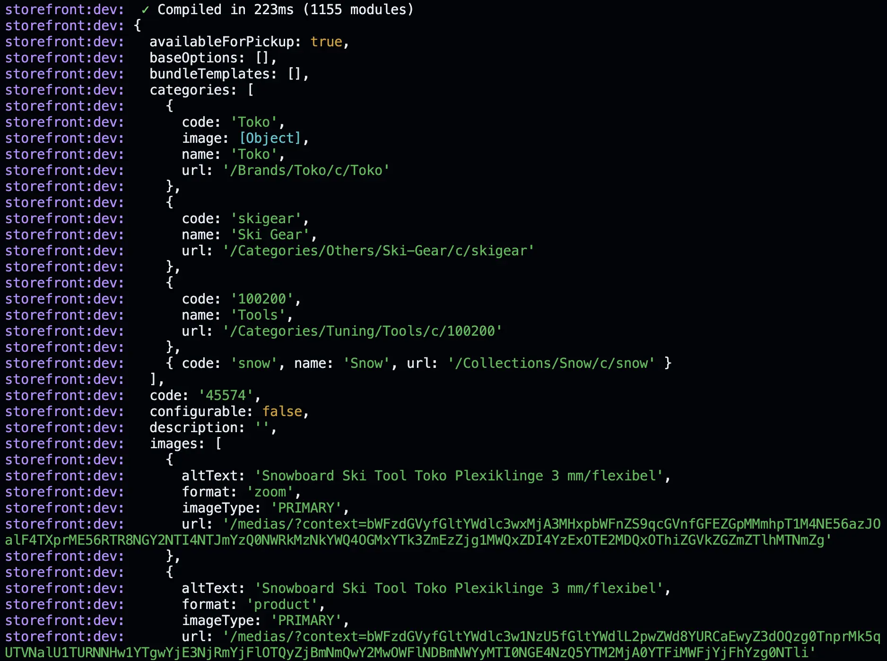
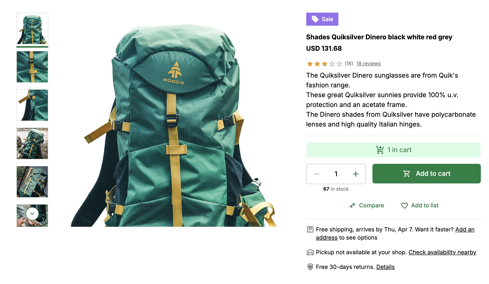

# Connecting Product Details Page with SAP Commerce Cloud

In the previous step, we have created a template for the a product details page using Storefront UI. Now, we will connect it with the SAP Commerce Cloud backend to display the product details.

## Fetching Products from SAP Commerce Cloud

In chapter 4 ([First Request](/guides/alokai-essentials/alokai-nuxt/first-request)) we displayed a list of products
from SAP CC on homepage. Now let's make that list link to product details pages

Replace the content of the `pages/index.vue` with the following code:

```vue
<template>
  <div className="mx-auto px-6 py-4">
    <h1>Product List:</h1>
    <ul>
      <li class="my-1" v-for="product in data.products">
        <NuxtLink
          class="text-blue-500 underline"
          :to="`product/${product.code}`"
          >{{ product.name }}</NuxtLink
        >
      </li>
    </ul>
  </div>
</template>

<script setup lang="ts">
const sdk = useSdk();

const { data } = await sdk.sapcc.getProducts({});
</script>

```

Now, when you click on a product, you will be redirected to the product details page.

## Fetching Product Details from SAP Commerce Cloud

Now, we need to fetch the product details from the SAP Commerce Cloud backend to display the product details on the product details page.

In the `/pages/product/[id].vue` file, let's make some changes to fetch the product details from the backend. The final code of the `apps/storefront/pages/product/[id].vue` file should look like this:

```vue
<template>
  <div
    className="flex flex-col gap-8 md:gap-12 lg:gap-16 max-w-screen-xl m-auto px-4 md:px-8 lg:px-12 xl:px-16 py-8 md:py-12 lg:py-16 xl:py-20"
  >
    <section
      className="flex flex-col items-start gap-8 md:flex-row md:gap-4 xl:gap-6"
    >
      <ProductGallery />
      <ProductDetails />
    </section>
    <ProductSlider />
  </div>
</template>

<script setup lang="ts">
const route = useRoute();
const sdk = useSdk();
const { data } = await sdk.sapcc.getProduct({
  productCode: route.params.id as string,
});
console.log(data);
</script>
```

In the above code, we have used the `useSdk` function to obtain an instance of the Alokai SDK. We have used the `getProduct` method to fetch the product details from the backend. We have used the `useRoute` composable to get the `id` of the product from the URL. We have used the `console.log` function to log the product details to the console. Once you visit the product details page, you will see the product details logged to the console as shown below:



Now, we have successfully connected the product details page with the SAP Commerce Cloud backend. In the next step, we will display the product details on the product details page.

## Displaying Product Details

Storefront UI Blocks are designed to be used with any backend and it does not follow any specific data structure. We need to map the data from the SAP Commerce Cloud backend to the Storefront UI Blocks to display the product details.

### ProductDetails Block

Let's start by creating a TypeScript interface for the props of the `ProductDetails` Block.

In order to simplify the type definition, we will install the `@vsf-enterprise/sap-commerce-webservices-sdk` type definitions package. This package contains all SAP Commerce Cloud native types. Run the following command in the root of your project to install the package:

```bash
npm install @vsf-enterprise/sap-commerce-webservices-sdk
```

Open the `apps/storefront/components/ProductDetails.vue` file and add the following code to the component script:

```ts
import type { Product } from "@vsf-enterprise/sap-commerce-webservices-sdk";

interface ProductDetailsProps {
  product: Product;
}

const props = defineProps<ProductDetailsProps>();
```

Now, let's pass the `product` prop to the `ProductDetails` component in the `apps/storefront/pages/product/[id].vue` file. Replace the content of the file with the following code:

```diff
- <ProductDetails />
+ <ProductDetails :product="data" />
```

We also need to make some changes in the `ProductDetails` Block to conform to the new type definition. Let's replace all hardcoded values with the values from the `product` prop. Open the `apps/storefront/components/ProductDetails.vue` file and replace the content of `ProductDetails` function with the following code:

```diff
- const max = ref(999);
+ const max = ref(props.product.stock?.stockLevel ?? 1);

-  Mini Foldable Drone with HD Camera FPV Wifi RC Quadcopter
+ {{ product.name }}

-  <strong className="block font-bold typography-headline-3">$2,345.99</strong>
+  <strong className="block font-bold typography-headline-3">{{ product.price?.currencyIso }} {{ product.price?.value }}</strong>

-  <SfCounter class="ml-1" size="xs">123</SfCounter>
+  <SfCounter class="ml-1" size="xs">{{ product.numberOfReviews }}</SfCounter>

-  123 reviews
+  {{ product.numberOfReviews }} reviews

-  <ul className="mb-4 font-normal typography-text-sm">
-    <li>HD Pictures & Videos and FPV Function</li>
-    <li>Intelligent Voice Control</li>
-    <li>Multiple Fun Flights</li>
-    <li>Easy to Use</li>
-    <li>Foldable Design & Double Flight Time</li>
-  </ul>

+      <p
+      className="mb-4 font-normal typography-text-sm"
+      v-html="product.summary"
+    ></p>  
```

Now, save the changes and run the application. Now, when you visit the product details page, you will see the product details displayed correctly.
Image gallery is still hardcoded though. SAP Commerce Cloud returns images in a bit complex format so we'll leave it as it is for now. We'll
leverage Unified Data Layer in the last chapter to solve this problem.



I'll leave the `ProductSlider` Block for you to implement. I would recommend you to start with looking at the `product.productReferences` property in the product details response. This property contains the list of related products. You can use this property to display the related products in the `ProductSlider` Block.

::info
You can find the complete implementation in the [`connecting-pdp` branch](https://github.com/vuestorefront-community/nuxt-starter/tree/connecting-pdp)
::

## Summary

In this section, we have created a new product details page using Storefront UI. We have connected it with the SAP Commerce Cloud backend to display the product details. We have fetched the list of products from the backend and displayed links to products on the homepage. We have also fetched the product details from the backend and displayed the product details on the product details page.

So far we have learned how to get the data and display it in the Storefront UI Blocks. In the next step, we will learn how to add the product to the cart and display the cart details.

::card{title="Next: Add product to Cart" icon="tabler:number-7-small" }

#description
Learn how to use Alokai Connect to add product to cart

#cta
:::docs-button{to="/guides/alokai-essentials/alokai-nuxt/add-to-cart"}
Next
:::
