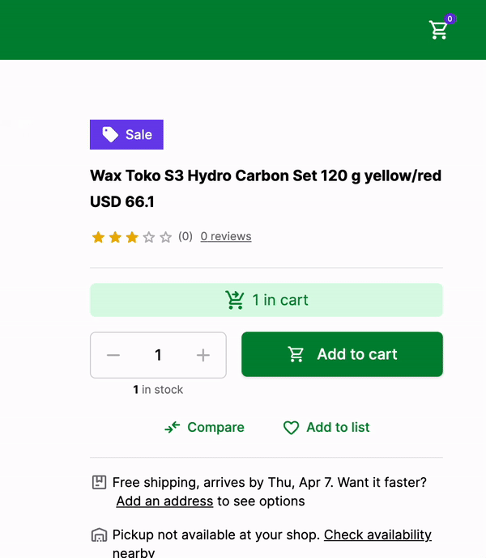

# Add Product to Cart

Just getting the data from the API is not enough. Ecommerce websites are feature rich and one of the most important features is the ability to add products to the cart. In this guide, we will learn how to add products to the cart in Alokai Next.js application.

## Create useCart composable

Create `useCart` composable in `apps/storefront/composables/useCart.ts`:

```ts
import type {
  Cart,
  Product,
} from "@vsf-enterprise/sap-commerce-webservices-sdk";
import { onMounted } from "vue";
import { useLocalStorage } from "@vueuse/core";

export function useCart() {
  const cart = useState<Cart | null>();
  const cartId = useLocalStorage<string | null>("cartId", null);
  const sdk = useSdk();

  const fetchCart = async () => {
    if (!cartId.value) {
      const { data } = await sdk.sapcc.createCart({});
      cart.value = data;
    } else {
      try {
        const { data } = await sdk.sapcc.getCart({ cartId: cartId.value });
        cart.value = data;
      } catch {
        const { data } = await sdk.sapcc.createCart({});
        cart.value = data;
      }
    }
    cartId.value = cart.value.guid;
  };

  const addToCart = async (product: Product, quantity: number = 1) => {
    try {
      await sdk.sapcc.createCartEntry({
        cartId: cart?.value?.guid as string,
        orderEntry: {
          quantity: quantity,
          product: {
            code: product.code as string,
          },
        },
      });

      const { data } = await sdk.sapcc.getCart({
        cartId: cart?.value?.guid as string,
      });

      cart.value = data;
    } catch (error) {
      console.error("Error adding to cart", error);
    }
  };

  onMounted(() => {
    fetchCart();
  });

  return {
    cart,
    addToCart,
    fetchCart,
  };
}
```

This composable initializes cart state, fetches or creates new cart and saves cartId in localStorage so that it's persistent.
`addToCart` function adds product to cart and re-fetches the cart afterwards.

## Add to Cart Button

Since `ProductDetails` component already has the product data and `SfButton` component that is responsible for adding the product to the cart, we can add the `useCart` composable to the `ProductDetails` component and use it to add the product to the cart.

```diff
<template>
<!-- ... rest of the code -->
-        <SfButton size="lg" class="w-full xs:ml-4">
+        <SfButton size="lg" class="w-full xs:ml-4" @click="addToCart(product)">
          <template #prefix>
            <SfIconShoppingCart size="sm" />
          </template>
          Add to cart
        </SfButton>
<!-- ... rest of the code -->
</template>

<script lang="ts" setup>
// ... rest of the code
+ import { useCart } from "~/composables/useCart";
+ const { addToCart } = useCart();
// ... rest of the code
</script>
```

Now, when the user clicks on the "Add to Cart" button, the product will be added to the cart and the cart will be updated in the global state.

Let's test it!

## Test it

Let's create a simple NavBar component with a cart icon that will display the number of products in the cart. Create a new file inside `storefront/components/NavBar.vue` and add the following code.

```vue
<template>
  <div class="flex items-center justify-between px-8 py-3 bg-primary-700">
    <nav class="flex gap-4 items-center">
      <NuxtLink href="/" class="text-white">Home</NuxtLink
      ><NuxtLink href="/cart" class="text-white">Cart</NuxtLink>
    </nav>

    <SfButton variant="tertiary" class="relative" :square="true"
      ><SfIconShoppingCart class="text-white"></SfIconShoppingCart
      ><SfBadge :content="cart?.totalUnitCount"></SfBadge
    ></SfButton>
  </div>
</template>

<script lang="ts" setup>
const { cart } = useCart();
</script>
```

Now, let's create new layout add `NavBar` there. Create `apps/storefront/layouts/default.vue` file with the following content:

```vue
<template>
  <NavBar />
  <main>
    <slot />
  </main>
</template>
```

Wrap both homepage and PDP with that layout:

`apps/storefront/pages/index.vue`:
```diff
<template>
+  <NuxtLayout name="default">
    <div className="mx-auto px-6 py-4">
      <h1>Product List:</h1>
      <ul>
        <li class="my-1" v-for="product in data.products">
          <NuxtLink
            class="text-blue-500 underline"
            :to="`product/${product.code}`"
            >{{ product.name }}</NuxtLink
          >
        </li>
      </ul>
    </div>
+ </NuxtLayout>
</template>
```

`apps/storefront/pages/product/[id].vue`
```diff
<template>
+  <NuxtLayout name="default">
    <div
      className="flex flex-col gap-8 md:gap-12 lg:gap-16 max-w-screen-xl m-auto px-4 md:px-8 lg:px-12 xl:px-16 py-8 md:py-12 lg:py-16 xl:py-20"
    >
      <section
        className="flex flex-col items-start gap-8 md:flex-row md:gap-4 xl:gap-6"
      >
        <ProductGallery />
        <ProductDetails :product="data" />
      </section>
      <ProductSlider />
    </div>
+  </NuxtLayout>
</template>
```

Now, when the user adds a product to the cart, the number of products in the cart will be displayed in the `NavBar` component. The cart will be updated in the global state and the user will be able to see the number of products in the cart from any page.

Here's how it looks like:



That's it! We have successfully added the product to the cart and displayed the number of products in the cart in the `NavBar` component.

Congratulations! You have successfully added products to the cart in Alokai Next.js application. 🎉

::info
You can find a complete code for this guide in the [add-to-cart branch](https://github.com/vuestorefront-community/nuxt-starter/tree/add-to-cart) of the Alokai Nuxt Starter.
::

## Summary

In this guide, we learned how to add products to the cart in Alokai Nuxt application. We created a `useCart` composable that is used to access the cart from any component. We also added the `NavBar` component that displays the number of products in the cart.

::info
If you followed along with this guide, you might have noticed that we added `Cart` route to the `NavBar` component. You already know how to create a new page and display the products in the cart. If you want to challenge yourself, try to create a new page that displays the products in the cart and allows the user to remove products from the cart. I recommend using [Product Card Horizontal](https://docs.storefrontui.io/v2/vue/blocks/ProductCard.html#productcard-horizontal) Storefront UI component to display the products in the cart.
::

We are done with the basics of Alokai Nuxt application.

You can now move on to the next guide to learn more advanced concepts and features of Alokai or start building your own Alokai Nuxt application and come back later to learn more advanced concepts. 

::card{title="Next: Unified Data Layer" icon="tabler:hexagon-8-filled" }

#description
Learn how to install, configure and use Unified Data Layer

#cta
:::docs-button{to="/guides/alokai-essentials/alokai-nuxt/udl"}
Next
:::


