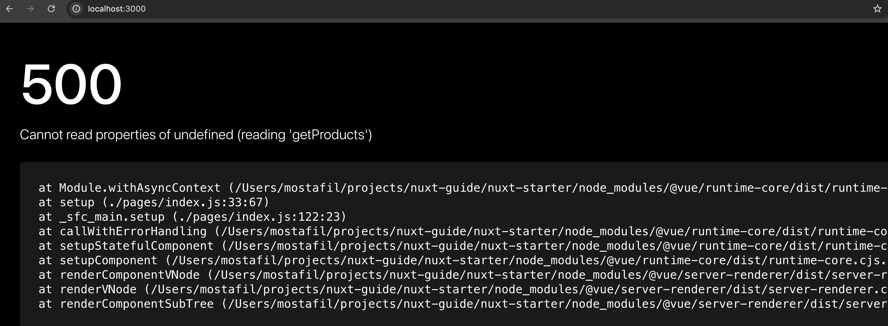
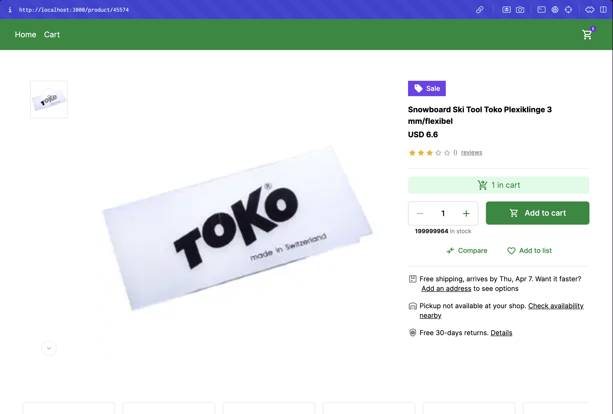

# Unified Data Layer
::info
The Unified Data Layer is an enterprise-only feature which means you need to have Alokai Enterprise License in order to be able to use it.
::
The Unified Data Layer (UDL) is a new concept introduced by Alokai. This is a layer in the Alokai Middleware and Storefront that allows for unification of data from different sources. The UDL provides a standardized way to interact with data, regardless of the eCommerce platform you're using. The UDL provides a structured way to manage this data, ensuring that regardless of the platform — be it Commercetools, SAPCC, or BigCommerce — the data is consistently represented. 

## Prerequisites

Before we proceed, please take your time and learn more about the UDL in the [Unified Data Layer](https://docs.alokai.com/unified-data-layer/) section of Storefront documentation.

## UDL in Alokai Nuxt Application

In order to help you understand Unified Data Layer better, let's add it to our Alokai Nuxt application. This will allow us to connect our application to different eCommerce platforms preserving the same data structure and UI components.

::info
If you don't have any other ecommerce platform installed - no worries, you can just follow this guide to have a better understanding of how UDL works.
::

## Installation and Configuration

In order to install Unified Data Model, we need to install `@vsf-enterprise/unified-api-sapcc` package. This package is a set of Unified API Extensions for SAP Commerce Cloud. 

### Configuring Alokai Middleware

Go to `apps/middleware` directory and install the `@vsf-enterprise/unified-api-sapcc` package by running the following command:

```bash
npm install @vsf-enterprise/unified-api-sapcc
```

Next, we need to extend Middleware to include Unified API Extension. First, let's create `unifiedApiExtension` extension object in the `middleware.config.ts` file:

```typescript
import { createUnifiedExtension } from "@vsf-enterprise/unified-api-sapcc";
import { ApiClientExtension } from "@vue-storefront/middleware";

export const unifiedApiExtension: ApiClientExtension = createUnifiedExtension(
  {
    normalizers: {
        addCustomFields: [{}]
    },
    methods: {},
    config: {
        
    }
  }
);
``` 

The `unifiedApiExtension` object is the result of calling `createUnifiedExtension` function. The `createUnifiedExtension` function is a factory function that accepts `normalizers`, `methods`, and `config` as arguments.

- `noralizers` property allows you to control the normalization process - mapping eCommerce-specific data types to the Unified Data Model.
- `methods` property allows you to override the default methods - functions that fetch data from eCommerce and pass it through the normalizers. [Read more about it in the documentation](/storefront/integration-and-setup/overriding-api-methods)
- `config` contains additional configuration required by the given integration. We cover them below.

#### transformImageUrl

SAP Commerce Cloud stores image urls as relative paths but the storefront needs absolute paths to display images. `transformImageUrl` function is responsible for providing correct image url.

Add this `transformImageUrl` configuration in `middleware.config.ts`:

```diff
export const unifiedApiExtension: ApiClientExtension = createUnifiedExtension({
  normalizers: {
    addCustomFields: [{}],
  },
  methods: {},
  config: {
+    transformImageUrl: (url: string) => {
+      return new URL(url, process.env.SAPCC_BASE_URL).toString();
    },
  },
});
```

This function adds base path to the image url. Base path comes from the environment variables.

In the `.env` file, add the following environment variable:

```env
SAPCC_BASE_URL=[your SAP Commerce Cloud base URL]
```


#### defaultCurrency

Nearly all calls to SAP OCC API require the currency parameter. Thus we need to specify with what currency the application should start.

```diff
export const unifiedApiExtension: ApiClientExtension = createUnifiedExtension({
  normalizers: {
    addCustomFields: [{}],
  },
  methods: {},
  config: {
    transformImageUrl: (url: string) => {
      return new URL(url, process.env.SAPCC_BASE_URL).toString();
    },
+    defaultCurrency: "USD",
  },
});
```

### Adding the unified extension to the integration

Now, we need to add the `unifiedApiExtension` to the `extensions` array in the `middleware.config.ts` file:

```diff
export const integrations = {
- sapcc: {
+ commerce: {
    location: '@vsf-enterprise/sapcc-api/server',
    configuration: {
      // ...
      },
      api: {
        // ...
      }
    },
+   extensions: (extensions: ApiClientExtension[]) => [...extensions, unifiedApiExtension]
  }
};
```

The final `middleware.config.ts` file should look like this:

```ts
require("dotenv").config();

import { createUnifiedExtension } from "@vsf-enterprise/unified-api-sapcc";
import { ApiClientExtension } from "@vue-storefront/middleware";

export const unifiedApiExtension: ApiClientExtension = createUnifiedExtension({
  normalizers: {
    addCustomFields: [{}],
  },
  methods: {},
  config: {
    transformImageUrl: (url: string) => {
      return new URL(url, process.env.SAPCC_BASE_URL).toString();
    },
    defaultCurrency: "USD",
  },
});

export const integrations = {
  commerce: {
    location: "@vsf-enterprise/sapcc-api/server",
    configuration: {
      OAuth: {
        uri: process.env.SAPCC_OAUTH_URI,
        clientId: process.env.SAPCC_OAUTH_CLIENT_ID,
        clientSecret: process.env.SAPCC_OAUTH_CLIENT_SECRET,
        tokenEndpoint: process.env.SAPCC_OAUTH_TOKEN_ENDPOINT,
        tokenRevokeEndpoint: process.env.SAPCC_OAUTH_TOKEN_REVOKE_ENDPOINT,
        cookieOptions: {
          "vsf-sap-token": { secure: process.env.NODE_ENV !== "development" },
        },
      },
      api: {
        uri: process.env.SAPCC_API_URI,
        baseSiteId: process.env.DEFAULT_BASE_SITE_ID,
        catalogId: process.env.DEFAULT_CATALOG_ID,
        catalogVersion: process.env.DEFAULT_CATALOG_VERSION,
        defaultLanguage: process.env.DEFAULT_LANGUAGE,
        defaultCurrency: process.env.DEFAULT_CURRENCY,
      },
    },
    extensions: (extensions: ApiClientExtension[]) => [
      ...extensions,
      unifiedApiExtension,
    ],
  },
};
```

Next, let's prepare the Unified API Extension for the Alokai SDK. Create a new file inside `middleware` directory called `types.ts` and add the following code:

```ts
export type { Endpoints as UnifiedEndpoints } from "@vsf-enterprise/unified-api-sapcc";
export * from "@vsf-enterprise/unified-api-sapcc/udl"
```

`Endpoints` type is needed for SDK to automatically generate type-safe methods based on the available endpoints.
The second line exports the Unified Data Layer so that the storefront uses the same data model version.

Great! Now we have successfully installed and configured the Unified Data Layer in our Alokai Middleware. Next, we need to configure Alokai SDK to use the Unified Data Layer.

### Configuring Alokai SDK

To configure Alokai SDK with the Unified Data Layer, we need to change the SDK configuration. In `apps/storefront/sdk.config.ts`, add the following code that uses the `UnifiedEndpoints`:

```diff
- import type { Endpoints } from "@vsf-enterprise/sapcc-api";
+ import type { UnifiedEndpoints } from "middleware/types";

export default defineSdkConfig(
  ({ buildModule, middlewareModule, getRequestHeaders, config }) => ({
-    sapcc: buildModule(middlewareModule<Endpoints>, {
+    commerce: buildModule(middlewareModule<UnifiedEndpoints>, {
-      apiUrl: config.middlewareUrl + "/sapcc",
+      apiUrl: config.middlewareUrl + "/commerce",
      defaultRequestConfig: {
        headers: getRequestHeaders(),
      },
    }),
  })
);


```

This code imports the `UnifiedEndpoints` type from the `middleware/types` file and uses it to create the `unified` module in the SDK configuration. The `unified` module uses the `middlewareModule` method to create a module based on the `UnifiedEndpoints` type.

## Using Unified Data Layer in Alokai Nuxt Application

Unified Data Layer brings a lot of benefits to the Alokai Nuxt application. It allows us to use the same data structure and UI components across different eCommerce platforms. To use it though, your UI has to conform Unified Data Model structure.

If you try to run the application, you will see that we have an issue with the `app/page.tsx` file.



We are trying to use `sdk.sapcc` method, which doesn't exist anymore. Instead, we need to use `sdk.unified` method. Let's replace the `sdk.sapcc` method with the `sdk.unified` method in `apps/storefront/pages/index.vue`:

```diff
<template>
  <NuxtLayout name="default">
    <div className="mx-auto px-6 py-4">
      <h1>Product List:</h1>
      <ul>
-        <li class="my-1" v-for="product in data.products">
+        <li class="my-1" v-for="product in products">
          <NuxtLink
            class="text-blue-500 underline"
-            :to="`product/${product.code}`"
+            :to="`product/${product.id}`"
            >{{ product.name }}</NuxtLink
          >
        </li>
      </ul>
    </div>
  </NuxtLayout>
</template>

<script setup lang="ts">
const sdk = useSdk();

- const { data } = await sdk.sapcc.getProducts({});
+ const { products } = await sdk.commerce.searchProducts({});
</script>

```

Now, if you run the application, you will see that the home page is working as expected. However, if you try to navigate to the product details page, you will see that we have an issue.

## Using Unified Data Layer in Product Details Page

Let's replace the types on the PDP with the Unified Data Model types. To do so, in the `ProductDetails` component, we replace the `Product` type with the `SfProduct` type from the Unified Data Model:

```diff
- import { Product } from '@vsf-enterprise/sap-commerce-webservices-sdk';
+ import { SfProduct } from "middleware/types";

interface ProductDetailsProps {
- product: Product;
+ product: SfProduct;
}
```

This change will allow us to use the same `ProductDetails` component across different eCommerce platforms.

Your IDE should show you a bunch of type errors in the `ProductDetails` component. Try figuring out how to fix the code yourself, it will help you get familiar with Unified Data Layer.
But if you're in hurry here's the final code for `apps/storefront/components/ProductDetails.vue`:

```vue
<template>
  <section class="md:max-w-[640px]">
    <div
      class="inline-flex items-center justify-center text-sm font-medium text-white bg-secondary-600 py-1.5 px-3 mb-4"
    >
      <SfIconSell size="sm" class="mr-1.5" />
      Sale
    </div>
    <h1 class="mb-1 font-bold typography-headline-4">
      {{ product.name }}
    </h1>
    <strong class="block font-bold typography-headline-3"
      >{{ product.price?.value.currency }}
      {{ product.price?.value.amount }}</strong
    >
    <div class="inline-flex items-center mt-4 mb-2">
      <SfRating size="xs" :value="3" :max="5" />
      <SfCounter class="ml-1" size="xs">{{ product.rating?.count }}</SfCounter>
      <SfLink
        href="#"
        variant="secondary"
        class="ml-2 text-xs text-neutral-500"
      >
        {{ product.rating?.count }} reviews
      </SfLink>
    </div>
    <p
      className="mb-4 font-normal typography-text-sm"
      v-html="product.description"
    ></p>
    <div class="py-4 mb-4 border-gray-200 border-y">
      <div
        class="bg-primary-100 text-primary-700 flex justify-center gap-1.5 py-1.5 typography-text-sm items-center mb-4 rounded-md"
      >
        <SfIconShoppingCartCheckout />
        1 in cart
      </div>
      <div class="items-start xs:flex">
        <div class="flex flex-col items-stretch xs:items-center xs:inline-flex">
          <div class="flex border border-neutral-300 rounded-md">
            <SfButton
              variant="tertiary"
              :disabled="count <= min"
              square
              class="rounded-r-none p-3"
              :aria-controls="inputId"
              aria-label="Decrease value"
              @click="dec()"
            >
              <SfIconRemove />
            </SfButton>
            <input
              :id="inputId"
              v-model="count"
              type="number"
              class="grow appearance-none mx-2 w-8 text-center bg-transparent font-medium [&::-webkit-inner-spin-button]:appearance-none [&::-webkit-inner-spin-button]:display-none [&::-webkit-inner-spin-button]:m-0 [&::-webkit-outer-spin-button]:display-none [&::-webkit-outer-spin-button]:m-0 [-moz-appearance:textfield] [&::-webkit-outer-spin-button]:appearance-none disabled:placeholder-disabled-900 focus-visible:outline focus-visible:outline-offset focus-visible:rounded-sm"
              :min="min"
              :max="max"
              @input="handleOnChange"
            />
            <SfButton
              variant="tertiary"
              :disabled="count >= max"
              square
              class="rounded-l-none p-3"
              :aria-controls="inputId"
              aria-label="Increase value"
              @click="inc()"
            >
              <SfIconAdd />
            </SfButton>
          </div>
          <p class="self-center mt-1 mb-4 text-xs text-neutral-500 xs:mb-0">
            <strong class="text-neutral-900">{{ max }}</strong> in stock
          </p>
        </div>
        <SfButton size="lg" class="w-full xs:ml-4" @click="addToCart(product)">
          <template #prefix>
            <SfIconShoppingCart size="sm" />
          </template>
          Add to cart
        </SfButton>
      </div>
      <div class="flex justify-center mt-4 gap-x-4">
        <SfButton size="sm" variant="tertiary">
          <template #prefix>
            <SfIconCompareArrows size="sm" />
          </template>
          Compare
        </SfButton>
        <SfButton size="sm" variant="tertiary">
          <SfIconFavorite size="sm" />
          Add to list
        </SfButton>
      </div>
    </div>
    <div class="flex first:mt-4">
      <SfIconPackage size="sm" class="flex-shrink-0 mr-1 text-neutral-500" />
      <p class="text-sm">
        Free shipping, arrives by Thu, Apr 7. Want it faster?
        <SfLink href="#" variant="secondary" class="mx-1">
          Add an address
        </SfLink>
        to see options
      </p>
    </div>
    <div class="flex mt-4">
      <SfIconWarehouse size="sm" class="flex-shrink-0 mr-1 text-neutral-500" />
      <p class="text-sm">
        Pickup not available at your shop.
        <SfLink href="#" variant="secondary" class="ml-1">
          Check availability nearby
        </SfLink>
      </p>
    </div>
    <div class="flex mt-4">
      <SfIconSafetyCheck
        size="sm"
        class="flex-shrink-0 mr-1 text-neutral-500"
      />
      <p class="text-sm">
        Free 30-days returns.
        <SfLink href="#" variant="secondary" class="ml-1"> Details </SfLink>
      </p>
    </div>
  </section>
</template>

<script lang="ts" setup>
import { ref } from "vue";
import {
  SfButton,
  SfCounter,
  SfLink,
  SfRating,
  SfIconSafetyCheck,
  SfIconCompareArrows,
  SfIconWarehouse,
  SfIconPackage,
  SfIconFavorite,
  SfIconSell,
  SfIconShoppingCart,
  SfIconAdd,
  SfIconRemove,
  useId,
  SfIconShoppingCartCheckout,
} from "@storefront-ui/vue";
import { clamp } from "@storefront-ui/shared";
import { useCounter } from "@vueuse/core";
import { useCart } from "~/composables/useCart";
import type { SfProduct } from "middleware/types";
const { addToCart } = useCart();

interface ProductDetailsProps {
  product: SfProduct;
}

const props = defineProps<ProductDetailsProps>();

const inputId = useId();
const min = ref(1);
const max = ref(props.product.quantityLimit ?? 1);
const { count, inc, dec, set } = useCounter(1, {
  min: min.value,
  max: max.value,
});
function handleOnChange(event: Event) {
  const currentValue = (event.target as HTMLInputElement)?.value;
  const nextValue = parseFloat(currentValue);
  set(clamp(nextValue, min.value, max.value));
}
</script>
```

Now, we need to pass the proper data to `ProductDetails` component. Apply the following changes to `apps/storefront/pages/product/[id].vue` file:

```diff
<template>
  <NuxtLayout name="default">
    <div
      className="flex flex-col gap-8 md:gap-12 lg:gap-16 max-w-screen-xl m-auto px-4 md:px-8 lg:px-12 xl:px-16 py-8 md:py-12 lg:py-16 xl:py-20"
    >
      <section
        className="flex flex-col items-start gap-8 md:flex-row md:gap-4 xl:gap-6"
      >
        <ProductGallery />
-        <ProductDetails :product="data" />
+        <ProductDetails :product="product" />
      </section>
      <ProductSlider />
    </div>
  </NuxtLayout>
</template>

<script setup lang="ts">
const route = useRoute();
const sdk = useSdk();
- const { data } = await sdk.sapcc.getProduct({
-   productCode: route.params.id as string,
- });
+ const { product } = await sdk.commerce.getProductDetails({
+   id: route.params.id as string,
+ });

</script>
```

Finally, if you run the application, you will see that both home page and product details page are working as expected. Except for one thing. If you try to add a product to the cart, you will see that we have an issue with the `useCart` composable - nothing happens when you click the "Add to cart" button.

As an additional exercise, you can use the approach we learned above to fix the `useCart` composable. As a starting point, you'll need to replace the `addToCart` method from the `sapcc` module with the `addToCart` method from the `unified` module and as well, you need to replace the `Cart` type with the `SfCart` type from the Unified Data Model. You can also find the solution here [udl branch](https://github.com/vuestorefront-community/nuxt-starter/tree/udl).

You can find more information about different Unified Api Methods in the [Unified Cart Methods](https://docs.alokai.com/unified-data-layer/unified-methods/cart) section of Storefront documentation.

## Displaying Images

So far, we've been displaying hardcoded images. But with the Unified Data Layer, we can easily access images from the e-commerce platform.

Open the `storefront/components/ProductGallery.vue` file and add the following code:

```ts
// ... rest of the code

import type { SfProduct } from "middleware/types";

interface ProductGalleryProps {
  images: SfProduct['gallery'];
}

const { images } = defineProps<ProductGalleryProps>();

// ... rest of the code
```

In the above code, we have created a TypeScript interface `ProductGalleryProps` for the props of the `ProductGallery` Block. We have used the `SfProduct` type from the UDL.

We can also remove the `images` constant and `withBase` function from the `ProductGallery` component as we are now passing the `images` prop from the parent component.

Now, Replace all the occurrences of `imageThumbSrc` and `imageSrc` with `url`. The final shape of the `ProductGallery` component can be found in the [udl branch](https://github.com/vuestorefront-community/nuxt-starter/tree/udl).

Lastly, let's pass the `images` prop to the `ProductGallery` component in the `apps/storefront/pages/product/[id].vue` file:

```diff
- <ProductGallery />
+ <ProductGallery :images="product.gallery" />
```



## Conclusion

In this guide, we have learned how to add the Unified Data Layer to our Alokai Nuxt application. We have successfully installed and configured Unified Data Layer in our Alokai Middleware and SDK. We have replaced the types across the application with the Unified Data Model types, and as well, we have fixed the errors across the application. We have learned how to use the same data structure and UI components across different eCommerce platforms. We also displayed product images.

::info
As usual, you can find the final version of the application in the [udl branch](https://github.com/vuestorefront-community/nuxt-starter/tree/udl) of the Nuxt Starter repository.
::

In the next guide, we will learn how to extend Alokai application. How to override the existing methods, add new methods, and as well, how to create a new extension.

<!-- ::grid{:columns="3"}
#section-1
:card{to="//guides/customization-nuxt" title="Extending Alokai" description="Learn how to extend Alokai Application" icon="tabler:hexagon-2-filled"}
:: -->
