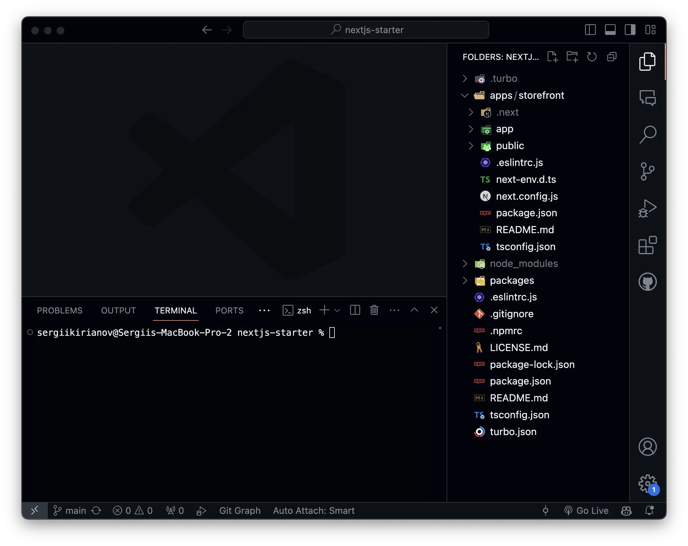
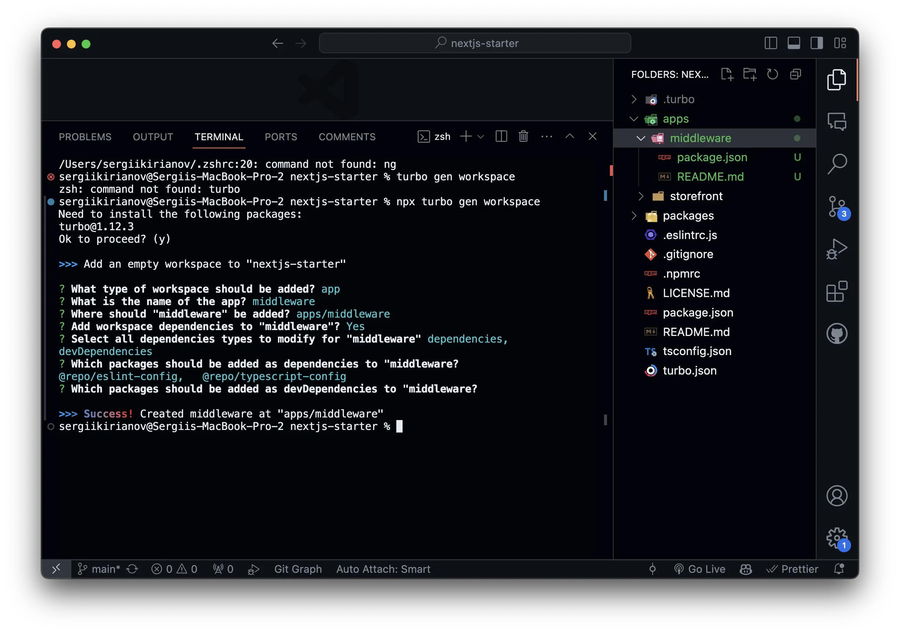

# Create a Vue Storefront Next.js Project

For the base of our project, we will use the Vue Storefront Next.js starter project. This project is a great starting point for building a Vue Storefront application with Next.js. It includes everything you need to get started, including a basic project structure, configuration files, and a set of pre-configured tools.

You can find the Vue Storefront Next.js starter project on GitHub.

**Next.js Starter Project** - [https://github.com/vuestorefront-community/nextjs-starter](https://github.com/vuestorefront-community/nextjs-starter)

This is a bare minimum monorepo setup created with [Turbo](https://turbo.build/repo). During this guide, we will use the `nextjs-starter` project to create a new Vue Storefront project. We will install all the necessary dependencies and configure the project to work with Vue Storefront.

## Prerequisites

For this guide we will use SAP Commerce Cloud as the backend, but you can use any backend of your choice. Make sure you have your SAP Commerce Cloud instance up, running and accessible via REST API. 

## Get the Vue Storefront Next.js Starter Project

To create a new Vue Storefront project with Next.js, you will need to clone the `nextjs-starter` project from GitHub. You can do this by running the following command in your terminal:

```bash
git clone git@github.com:vuestorefront-community/nextjs-starter.git
```



Once you have cloned the `nextjs-starter` project, navigate to the project directory and install the project dependencies by running the following command:

```bash
cd nextjs-starter
npm install
```

This will install all the necessary dependencies for the project.

## Prepare the Project

Now that you have the `nextjs-starter` project set up, you need to prepare the project to allow for both the Next.js application and the Vue Storefront Middleware to run in the monorepo.

Let's first configure the `middleware` application. Run the following Turbo command to install the `middleware` application:

```bash
npx turbo gen workspace
```

It will prompt you to give a name to your workspace, as well as the name of the application. We will use `middleware` as the name of the application.



Once the workspace is generated, you will see a new `middleware` directory in the `apps` directory.

Great, our workspace is ready. Now we can move on to the next step and configure the `middleware` application.

## Summary

In this section, we have learned how to create a new Vue Storefront project with Next.js. We have cloned the `nextjs-starter` project from GitHub and installed all the necessary dependencies. We have also prepared the project to allow for both the Next.js application and the Vue Storefront Middleware to run in the monorepo.

In the next section, we will configure the `middleware` application and run it alongside the Next.js application.


::grid{:columns="3"}
#section-1
:card{to="/guides/understanding-vue-storefront/vue-storefront-next-js/basics/install-middleware" title="Install and Configure Vue Storefront Middleware" description="Let's install and configure Vue Storefront Middleware" icon="tabler:number-2-small"}
::

