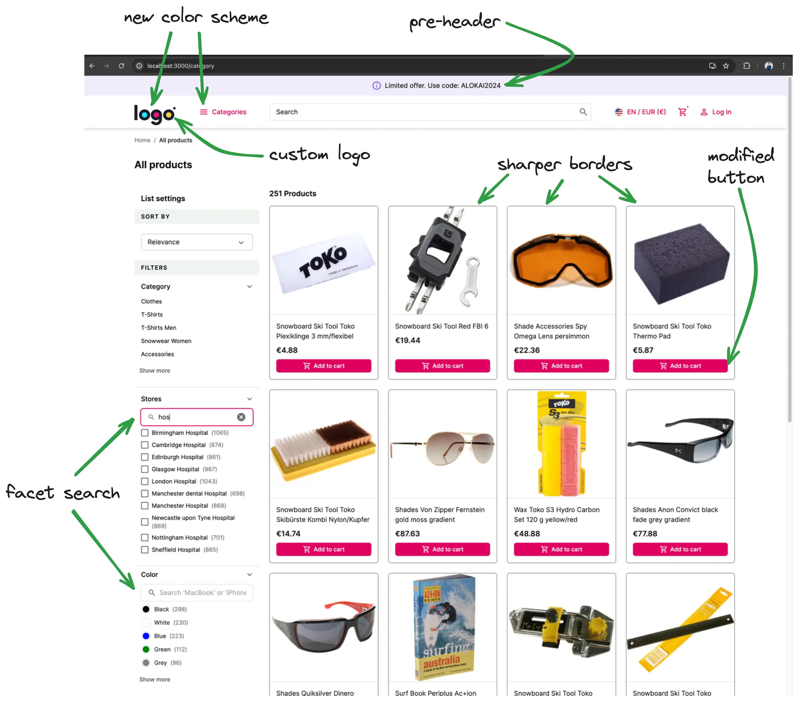
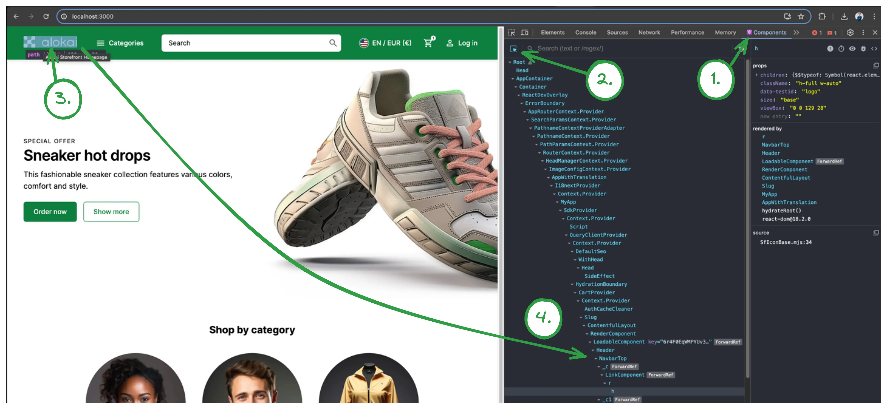

# UI customizations

In this chapter you will:

* change the default logo to your custom one
* adjust the theme colors to suit the new logo
* add a pre-header
* customize the look of product card on product listing page
* add facet/filter search feature

In the end your application will look something like this:



## Changing the logo

This is a very simple task but should help you get familiar with Alokai storefront structure.
We need to find and modify the component that contains the logo. You can either:

1. Drill through Next.js application starting from `storefront-unified-nextjs/pages/[[...slug]].tsx`, which represents
the homepage (actually all CMS pages), and find out that the logo is placed in the `NavbarTop` component.
2. Or you can use [React Developer Tools](https://react.dev/learn/react-developer-tools) to localize the component visually:


Anyway, the logo located in `storefront-unified-nextjs/components/ui/NavbarTop/NavbarTop.tsx` component.

🛠️ Open it and replace `SfIconAlokaiFull` with your custom image. I used [LogoIpsum](https://logoipsum.com/) to find some sample logo.

<!-- Related code: https://github.com/mateuszo/extensibility-demo/blob/45d5bfbad440fc90c3cfc99a8ec61add272b2652/apps/storefront-unified-nextjs/components/ui/NavbarTop/NavbarTop.tsx#L55 -->
```diff
- <SfIconAlokaiFull data-testid="logo" className="h-full w-auto" />
+ <Image src="/images/logoipsum-332.svg" width={100} height={50} unoptimized alt="logo" />
```
