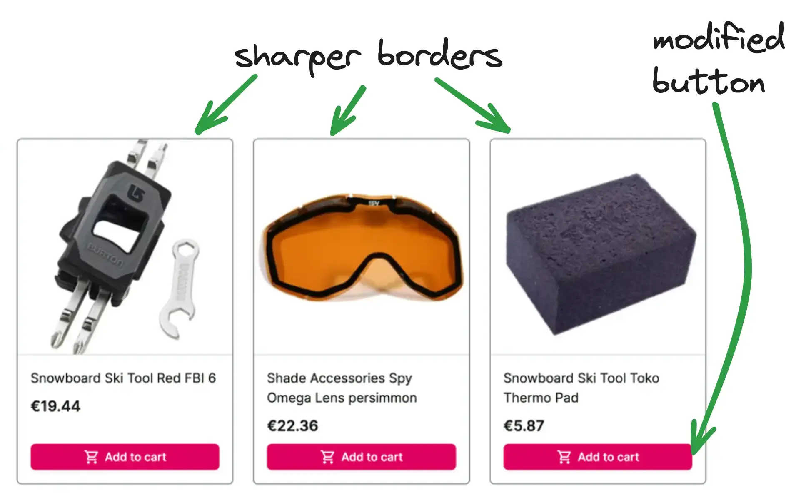

# UI customizations

In this chapter you will:

* change the default logo to your custom one
* adjust the theme colors to suit the new logo
* add a pre-header with i18n
* customize the look of product card on product listing page
* add facet/filter search feature

In the end your application will look something like this:


## Changing the logo

This is a very simple task but should help you get familiar with Alokai storefront structure.
We need to find and modify the component that contains the logo. You can either:

1. Drill through Next.js application starting from `storefront-unified-nextjs/pages/[[...slug]].tsx`, which represents
the homepage (actually all CMS pages), and find out that the logo is placed in the `NavbarTop` component.
2. Or you can use [React Developer Tools](https://react.dev/learn/react-developer-tools) to localize the component visually:


Anyway, the logo located in `storefront-unified-nextjs/components/ui/NavbarTop/NavbarTop.tsx` component.

🛠️ Open it and replace `SfIconAlokaiFull` with your custom image. I used [LogoIpsum](https://logoipsum.com/) to find some sample logo.

<!-- Related code: https://github.com/mateuszo/extensibility-demo/blob/main/apps/storefront-unified-nextjs/components/ui/NavbarTop/NavbarTop.tsx#L55 -->
```diff
- <SfIconAlokaiFull data-testid="logo" className="h-full w-auto" />
+ <Image src="/images/logoipsum-332.svg" width={100} height={50} unoptimized alt="logo" />
```

Result should look like this:


This logo doesn't look good on the green background. Let's fix that.

🛠️ Locate where `NavbarTop` component is used and remove `filled` property. This will make the navbar transparent.

<!-- Related code: https://github.com/mateuszo/extensibility-demo/blob/main/apps/storefront-unified-nextjs/layouts/DefaultLayout.tsx#L64  -->
```diff
- <NavbarTop filled>
+ <NavbarTop>
```

Logo should look better now. However, buttons in the navbar have become invisible. That's because they are white.
Here's a challenge for you:

🚀 Within `NavbarTop` component, find which tailwind class is responsible for making the buttons white and remove it.

## Adjusting theme colors

The primary green color does not play well with the colors in the logo. To fix this we will adjust our theme colors.

1. Go to <https://uicolors.app/> and generate a tailwind color palette based on a color you like. Click export and copy
the tailwind code.
2. Open `apps/storefront-unified-nextjs/tailwind.config.js`, paste your colors under `theme.extend`, rename the color to "primary"

<!-- Related code: https://github.com/mateuszo/extensibility-demo/blob/main/apps/storefront-unified-nextjs/tailwind.config.js#L39 -->
```ts
  // ...
  theme: {
    extend: {
      colors: {
        primary: {
          50: '#fff0f9',
          100: '#ffe3f5',
          200: '#ffc6eb',
          300: '#ff98d9',
          400: '#ff58bd',
          500: '#ff27a1',
          600: '#ff0c81',
          700: '#df005f',
          800: '#b8004f',
          900: '#980345',
          950: '#5f0025',
        },
      },
  // ...
```

You can read more about theming in [the StorefrontUI docs](https://docs.storefrontui.io/v2/customization/theming).

## Adding a pre-header

It's not uncommon to add a pre-header with some promo codes to a storefront. You might already have an idea how to do it
so I encourage you to try doing it yourself and checking back here when your done.

### Solution

1. Create a new `PreHeader.tsx` file in `storefront-unified-nextjs/components/ui/NavbarTop` with the following content:

<!-- Related code: https://github.com/mateuszo/extensibility-demo/blob/main/apps/storefront-unified-nextjs/components/ui/NavbarTop/PreHeader.tsx -->
```ts
import { SfIconInfo } from '@storefront-ui/react';

export function PreHeader() {
  return (
    <div
      role="alert"
      className="flex items-center w-full justify-center shadow-md bg-secondary-100 pr-2 pl-4 ring-1 ring-secondary-200 typography-text-sm md:typography-text-base py-1 rounded-md"
    >
      <SfIconInfo className="mr-2 text-secondary-700 shrink-0" />
      Limited offer. Use code: ALOKAI2024
    </div>
  );
}
```

1. Add `PreHeader` component to `NavbarTop`:

<!-- Related code: https://github.com/mateuszo/extensibility-demo/blob/main/apps/storefront-unified-nextjs/components/ui/NavbarTop/NavbarTop.tsx#L29 -->
```ts
export function NavbarTop({ className, children, filled }: NavbarTopProps) {
  const { t } = useTranslation();

  return (
    <>
      <PreHeader />
      <header
        className={classNames(
          'h-14 md:h-20 flex z-40 sticky top-0 md:-top-5 md:pt-2.5 md:shadow-md',
          filled ? 'bg-primary-700 md:shadow-md text-white' : 'bg-white text-[#02C652] border-b border-neutral-200',
          className,
        )}
        data-testid="navbar-top"
      >
        <div className="flex gap-[clamp(1rem,3vw,3rem)] items-center w-full md:h-[60px] max-w-screen-3-extra-large py-6 px-4 md:px-6 lg:px-10 mx-auto sticky top-0">
          <Link
            data-testid="logo-link"
            href={appRoutes.index.compile()}
            title={t('alokaiHomepage')}
            className="h-6 md:h-7 -mt-1.5"
          >
            <Image src="/images/logoipsum-332.svg" width={100} height={50} unoptimized alt="logo" />
          </Link>
          {children}
        </div>
        <Notifications />
      </header>
    </>
  );
}
```

## Pre-header internationalization (i18n)

Ok, but that's too simple, let's make this example more interesting by making the pre-header localized. We will use
[i18-next](https://react.i18next.com/) package that is already installed and widely used in our storefront.

1. First we need to add translations. Translation files are located under `/storefront-unified-nextjs/public/locales` folder.
There's a separate subfolder for each language (e.g. `en`, `de`). All languages have the same set of files. 
Open both `en/common.json` and `de/common.json` files and add a new translation there:

<!-- Related code: https://github.com/mateuszo/extensibility-demo/blob/main/apps/storefront-unified-nextjs/public/locales/en/common.json#L42 -->
```diff [en/common.json]
   "logout": "Logout",
+  "preHeader": {
+    "promoText": "Limited offer. Use code: ALOKAI2024"
+  }
}
```

<!-- Related code: https://github.com/mateuszo/extensibility-demo/blob/main/apps/storefront-unified-nextjs/public/locales/de/common.json#L43 -->
```diff [de/common.json]
   "logout": "Logout",
+  "preHeader": {
+    "promoText": "Begrenztes Angebot. Verwenden Sie den Code: ALOKAI2024"
+  }
}
```

1. Now we can use the translations in our `PreHeader` component. We'll utilize the `Trans` from `next-i18next` package.
Your `PreHeader.tsx` should look like this now:

<!-- Related code: https://github.com/mateuszo/extensibility-demo/blob/main/apps/storefront-unified-nextjs/components/ui/NavbarTop/PreHeader.tsx -->
```tsx
import { SfIconInfo } from '@storefront-ui/react';
import { Trans } from 'next-i18next';

export function PreHeader() {
  return (
    <div
      role="alert"
      className="flex items-center w-full justify-center shadow-md bg-secondary-100 pr-2 pl-4 ring-1 ring-secondary-200 typography-text-sm md:typography-text-base py-1 rounded-md"
    >
      <SfIconInfo className="mr-2 text-secondary-700 shrink-0" />

      <Trans ns="common" i18nKey="preHeader.promoText">
        Limited offer. Use code: ALOKAI2024
      </Trans>
    </div>
  );
}
```

## Modifying product card on PLP

At this point you should be able to do it on your own. Follow the designs and modify `ProductCardVertical` component
accordingly.



You can find the [solution here](https://github.com/mateuszo/extensibility-demo/blob/9b80e00c5e930c063d5f25940b5ff003455c2ea4/apps/storefront-unified-nextjs/components/ui/ProductCard/ProductCardVertical.tsx).

