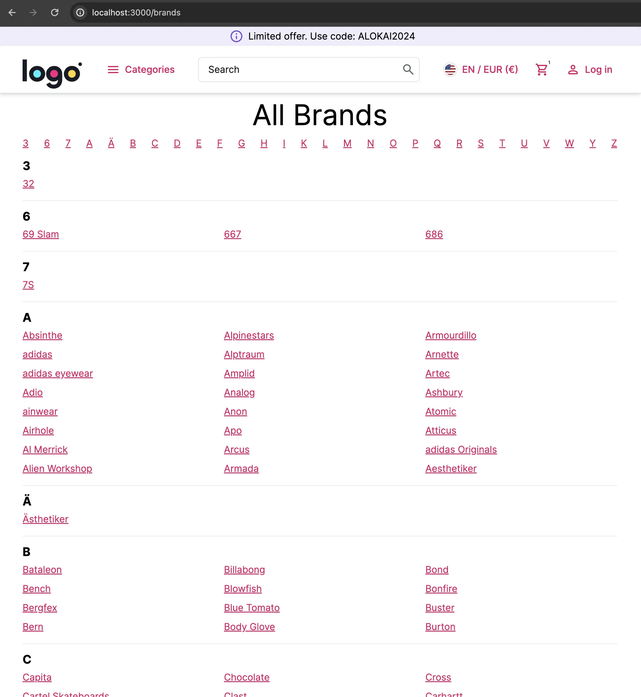
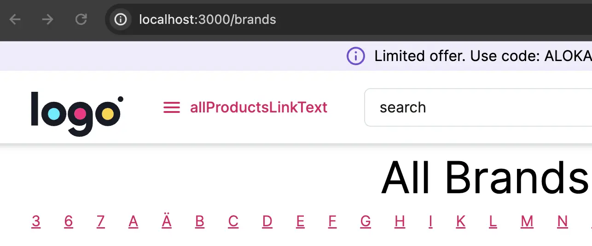

# Adding a New Page

In this chapter, we will create a new custom page. It will be a page listing all the brands that will look like this:



The process of creating a new page with Alokai is no different than creating one with [Next.js](https://nextjs.org/docs/pages/building-your-application/routing/pages-and-layouts). However, when building your page, Alokai offers a few useful features that you'll want to take advantage of.


1. Create `storefront-unified-nextjs/pages/brands.tsx` file with the following content:

<!-- Related code: https://github.com/vsf-customer/extensibility-demo/blob/main/apps/storefront-unified-nextjs/pages/brands.tsx -->
```tsx [storefront-unified-nextjs/pages/brands.tsx]
import { SfLink } from '@storefront-ui/react';
import { SfCategory } from 'storefront-middleware/types';
import { NarrowContainer } from '~/components';
import { appRoutes } from '~/config';
import { useCategories } from '~/hooks';
import { DefaultLayout } from '~/layouts';
import { Maybe } from '~/types';

type BrandsAlphabetically = Record<string, SfCategory[]>;

// utility function to transform data into a structure that is friendlier for rendering
function categoriesToBrands(categories: Maybe<SfCategory[]> | undefined): BrandsAlphabetically {
  const result: BrandsAlphabetically = {};

  categories?.forEach((category) => {
    const firstLetter = category.name.at(0)?.toLocaleUpperCase() ?? '';
    if (result[firstLetter]) {
      result[firstLetter]?.push(category);
    } else {
      result[firstLetter] = [category];
    }
  });

  return result;
}

export default function Brands() {
  const categories = useCategories({ ids: ['brands'] });
  const brands = categoriesToBrands(categories?.data?.[0]?.subcategories);
  const letters = Object.keys(brands);

  return (
    <DefaultLayout>
      <NarrowContainer>
        <h1 className="text-5xl text-center py-3">All Brands</h1>
        <div className="flex justify-between">
          {letters.map((letter) => (
            <SfLink key={`link-${letter}`} href={`#${letter}`}>
              {letter}
            </SfLink>
          ))}
        </div>
        <div className="divide-y">
          {letters.map((letter) => (
            <div key={letter} className="py-3 border-b-black" id={letter}>
              <h2 className="text-xl font-bold">{letter}</h2>
              <div className="columns-2 md:columns-3">
                {brands[letter].map((brand) => (
                  <div key={brand.id} className="py-1">
                    <SfLink href={appRoutes.category.slug.compile({ slug: brand.slug })}>{brand.name}</SfLink>
                  </div>
                ))}
              </div>
            </div>
          ))}
        </div>
      </NarrowContainer>
    </DefaultLayout>
  );
}
```

This code uses a predefined `useCategories` hook to fetch the 'brands' category. The subcategories represent different brands.

Your backend might not have such a special category so you need to figure out yourself where to fetch the list of brands from.

`categoriesToBrands` transforms the category data into a structure that is easier to render in the way we want. For better performance, this transformation shouldn't be a part of the front-end application, but we'll tackle this problem later.

`appRoutes.category.slug.compile({ slug: brand.slug })` is a helper function that generates a category page link instead of hardcoding it. This way, if you need to change all of the links, you can do it in one place.


2. Open `http://localhost:3000/brands`. The page should look more or less like the screenshot. However, there are a couple of issues:

- We are doing client-side fetching for static data which impairs performance and SEO.
- Some translations are missing. e.g. "allProductsLinkText"




3. Let's fix these issues by adding `getServerSideProps` to fetch the data during SSR.

<!-- Related code: https://github.com/vsf-customer/extensibility-demo/blob/main/apps/storefront-unified-nextjs/pages/brands.tsx -->
```tsx
import { InferGetServerSidePropsType } from 'next';
import { SfLink } from '@storefront-ui/react';
import { SfCategory } from 'storefront-middleware/types';
import { NarrowContainer } from '~/components';
import { appRoutes } from '~/config';
import { createGetServerSideProps } from '~/helpers/ssr';
import { DefaultLayout } from '~/layouts';
import { Maybe } from '~/types';

type BrandsAlphabetically = Record<string, SfCategory[]>;

function categoriesToBrands(categories: Maybe<SfCategory[]> | undefined): BrandsAlphabetically {
  const result: BrandsAlphabetically = {};

  categories?.forEach((category) => {
    const firstLetter = category.name.at(0)?.toLocaleUpperCase() ?? '';
    if (result[firstLetter]) {
      result[firstLetter]?.push(category);
    } else {
      result[firstLetter] = [category];
    }
  });

  return result;
}

export const getServerSideProps = createGetServerSideProps({ i18nNamespaces: [] }, async (context) => {
  const categories = await context.sdk.unified.getCategories({ ids: ['brands'] });
  const brands = categoriesToBrands(categories?.[0]?.subcategories);

  return {
    props: {
      brands,
    },
  };
});

export default function Brands({ brands }: InferGetServerSidePropsType<typeof getServerSideProps>) {
  const letters = Object.keys(brands);

  return (
    <DefaultLayout>
      <NarrowContainer>
        <h1 className="text-5xl text-center py-3">All Brands</h1>
        <div className="flex justify-between">
          {letters.map((letter) => (
            <SfLink key={`link-${letter}`} href={`#${letter}`}>
              {letter}
            </SfLink>
          ))}
        </div>
        <div className="divide-y">
          {letters.map((letter) => (
            <div key={letter} className="py-3 border-b-black" id={letter}>
              <h2 className="text-xl font-bold">{letter}</h2>
              <div className="columns-2 md:columns-3">
                {brands[letter].map((brand) => (
                  <div key={brand.id} className="py-1">
                    <SfLink href={appRoutes.category.slug.compile({ slug: brand.slug })}>{brand.name}</SfLink>
                  </div>
                ))}
              </div>
            </div>
          ))}
        </div>
      </NarrowContainer>
    </DefaultLayout>
  );
}
```

`createGetServerSideProps` is an Alokai-specific function that wraps the `getServerSideProps` function to:

- ensure that the required i18nNamespaces (for example "common", "footer", "message") are loaded
- ensure that a new SDK instance is returned with the correct request headers

4. Lastly, we would like to add some custom translations to our page. We will translate the "All Brands" heading.

We could do this as by adding a new translation key to the "common" namespace. But for this example, we'll learn how to add a custom i18n namespace.

Create `brands.json` file in `storefront-unified-nextjs/public/locales/en` and `storefront-unified-nextjs/public/locales/de`.

```json [en/brands.json]
{
    "allBrands": "All Brands"
}
```

```json [de/brands.json]
{
    "allBrands": "Alle Marken"
}
```

Next, we need to load the new translation namespace for our brands page. We do it by specifying it in `createGetServerSideProps`:

<!-- Related code: https://github.com/vsf-customer/extensibility-demo/blob/main/apps/storefront-unified-nextjs/pages/brands.tsx -->
```diff
- export const getServerSideProps = createGetServerSideProps({ i18nNamespaces: [] }, async (context) => {
+ export const getServerSideProps = createGetServerSideProps({ i18nNamespaces: ['brands'] }, async (context) => {
```

::info
"common", "footer", "message" namespaces are loaded by default by `createGetServerSideProps` function.
::

Finally, we can use the translation:

```diff
+ import { Trans } from 'next-i18next';

// ...

    <h1 className="text-5xl text-center py-3">
+      <Trans ns="brands" i18nKey="allBrands">
        All Brands
+      </Trans>
    </h1>
```

::warning
Import the `Trans` component from `next-i18next` rather than `react-i18next` as this might lead to SSR issues.
::

::info
You can find a complete project example in this repository: <https://github.com/vsf-customer/extensibility-demo>
If you want to get access to it, contact our [sales team](https://docs.alokai.com/enterprise).
::


<br />


::card{title="Next: Customizing Unified Data Model" icon="tabler:number-3-small" }

#description
Learn how to add custom fields to the Unified Data Model

#cta
:::docs-button{to="/guides/customization-next-js/add-custom-field"}
Customize UDL
:::
::