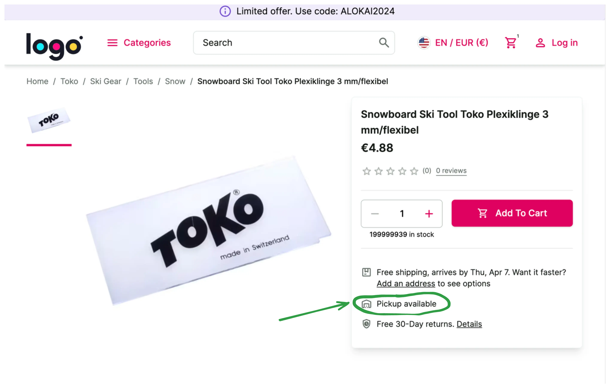

# Adding custom fields to the Unified Data Model / Implementing "Available for pickup" feature

It's a common case to enrich the default data models with custom fields.

In this chapter, you will learn:

::list{type="success"}
- how to add a custom field to the unified product data model in the middleware
- how to utilize that field in the storefront
::

By adding a "pickup availability" feature.



1. Open `apps/storefront-middleware/integrations/sapcc/extensions/unified.ts` file and modify the code accordingly:

<!-- Related code: https://github.com/vsf-customer/extensibility-demo/blob/main/apps/storefront-middleware/integrations/sapcc/extensions/unified.ts#L8 -->
```diff [apps/storefront-middleware/integrations/sapcc/extensions/unified.ts]
export const unifiedApiExtension = createUnifiedExtension({
  normalizers: {
    addCustomFields: [
+      {
+        normalizeProduct(context, input) {
+          return {
+            availableForPickup: input.availableForPickup,
+          };
+        },
+      },
    ],
  },
```

Within `addCustomFields`, we extend the normalizer functions. We take the raw input (coming from eCommerce) and have to
return a set of custom fields.


::info
Read more about normalizers and custom fields here: https://docs.alokai.com/storefront/unified-data-layer/normalizers
::

2. Now, `availableForPickup` field should be available in the front end, so let's use it. Replace the hardcoded placeholder
in the `PurchaseCard` component:

<!-- Related code: https://github.com/vsf-customer/extensibility-demo/blob/main/apps/storefront-unified-nextjs/components/PurchaseCard/PurchaseCard.tsx#L126 -->
```diff [storefront-unified-nextjs/components/PurchaseCard/PurchaseCard.tsx]
-  <Trans ns="product" i18nKey="additionalInfo.pickup">
-    Pickup not available at Super center.&nbsp;
-    <SfLink href="#" variant="secondary">
-      Check availability nearby
-    </SfLink>
-  </Trans>
+  <p>Pickup {product.$custom?.availableForPickup ? '' : 'not'} available</p>
```

And that's it. You can find a complete project example in this repository: <https://github.com/vsf-customer/extensibility-demo>
If you want to get access to it, contact our [sales team](https://docs.alokai.com/enterprise).


::card{title="Next: Change product slug" icon="tabler:number-4-small" }

#description
Learn how to override normalizers.

#cta
:::docs-button{to="/guides/customization-next-js/changing-product-slug"}
Next
:::
::

