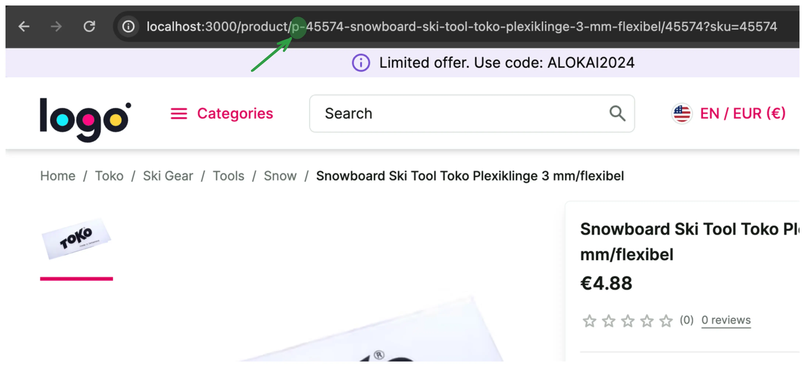

# Overriding Normalizer / Changing Product Slug 

Sometimes, instead of adding new attributes to the data model we need to modify the existing ones. We can do this by overriding normalizers (functions that transform raw data into the unified data model). In this guide, we will modify the product slug, to control the PDP URL (e.g. for the sake of SEO requirements).

Here's how the result will look like:


## Overriding the normalizer

Open `apps/storefront-middleware/integrations/sapcc/extensions/unified.ts` file and modify the code accordingly:

<!-- Related code: https://github.com/vsf-customer/extensibility-demo/blob/main/apps/storefront-middleware/integrations/sapcc/extensions/unified.ts#L21 -->
```diff [apps/storefront-middleware/integrations/sapcc/extensions/unified.ts]
+ import { createUnifiedExtension, normalizers as defaultNormalizers } from "@vsf-enterprise/unified-api-sapcc";

// ...

 export const unifiedApiExtension = createUnifiedExtension({
   normalizers: {
     addCustomFields: [
       {
         normalizeProduct(context, input) {
           return {
             availableForPickup: input.availableForPickup,
           };
         },
       },
     ],
+    override: {
+      normalizeProductCatalogItem(context, input) {
+        const product = defaultNormalizers.normalizeProductCatalogItem(context, input);
+        const newSlug = "p-" + product.slug;
+        return {
+          ...product,
+          slug: newSlug,
+        };
+      },
+    },
```

Here's what happens in that code:

* We override the product catalog item normalizer - a function that normalizes each item of the product list.
* We use the default normalizer to normalize the product data because we want only to modify one field - not the whole object.
* We add a prefix to the current product slug but you can implement any kind of logic you want here.
* In the end, we return the normalized product and overwrite the slug field.


## Scaling it up

As you might have noticed, adding normalization logic directly to a single file is not a good idea because it would
quickly become unmanageably large. Fortunately, there's a utility that helps split that code into multiple files.

1. Create `/storefront-middleware/integrations/sapcc/extensions/normalizers/` folder and `productCatalogItemNormalizer.ts`
file in it. Copy and paste this code into it:

<!-- Related code: https://github.com/vsf-customer/extensibility-demo/blob/main/apps/storefront-middleware/integrations/sapcc/extensions/normalizers/productCatalogItemNormalizer.ts -->
```ts [apps/storefront-middleware/integrations/sapcc/extensions/normalizers/productCatalogItemNormalizer.ts]
import {
  normalizers as defaultNormalizers,
  defineNormalizer,
} from "@vsf-enterprise/unified-api-sapcc";

export const productCatalogItemNormalizer = defineNormalizer.normalizeProductCatalogItem(
  (context, input) => {
    const product = defaultNormalizers.normalizeProductCatalogItem(context, input);
    const newSlug = "p-" + product.slug;
    return {
      ...product,
      slug: newSlug,
    };
  },
);
```

Create a barrel import file `/storefront-middleware/integrations/sapcc/extensions/normalizers/index.ts`

<!-- Related code: https://github.com/vsf-customer/extensibility-demo/blob/main/apps/storefront-middleware/integrations/sapcc/extensions/normalizers/index.ts -->
```ts [/storefront-middleware/integrations/sapcc/extensions/normalizers/index.ts]
export * from "./productCatalogItemNormalizer";
```

2. Modify `/storefront-middleware/integrations/sapcc/extensions/unified.ts` accordingly:

<!-- Related code: https://github.com/vsf-customer/extensibility-demo/blob/main/apps/storefront-middleware/integrations/sapcc/extensions/unified.ts#L30 -->
```diff [/storefront-middleware/integrations/sapcc/extensions/unified.ts]
    override: {
-      normalizeProductCatalogItem(context, input) {
-        const product = defaultNormalizers.normalizeProductCatalogItem(context, input);
-        const newSlug = "p-" + product.slug;
-        return {
-          ...product,
-          slug: newSlug,
-        };
-      },
+      normalizeProductCatalogItem: productCatalogItemNormalizer,
    },
```

You can find a complete project example in this repository: <https://github.com/vsf-customer/extensibility-demo>
If you want to get access to it, contact our [sales team](https://docs.alokai.com/enterprise).

::info
Read more about normalizers here: https://docs.alokai.com/storefront/unified-data-layer/normalizers
::

<br />


::card{title="Next: Calling custom endpoint" icon="tabler:number-5-small" }

#description
Learn how to call a 3rd party back-end service and replace OOTB API method.

#cta
:::docs-button{to="/guides/customization-next-js/method-overriding"}
Next
:::
::