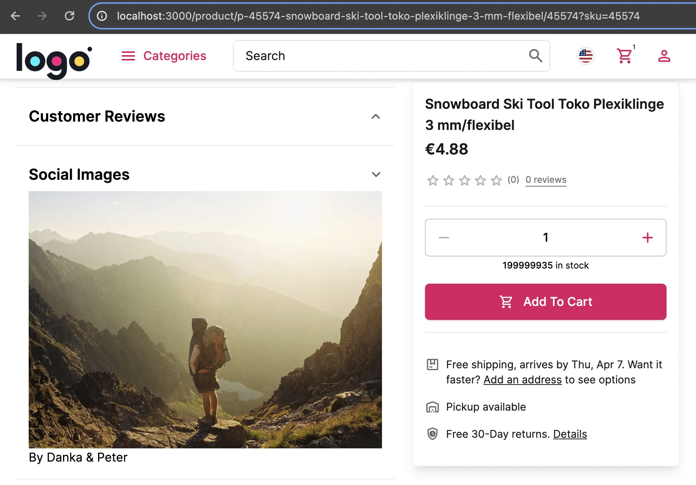

# Adding New API Methods

The Unified Data Model contains the most commonly used data for eCommerce backends, but there will be times when you need additional information, combine data from multiple sources, or create a new data structure. 

In such cases, we can either:

1. [add a new extension to our integration](https://docs.alokai.com/storefront/integration-and-setup/creating-new-api-methods)
2. or implement a [custom integration](https://docs.alokai.com/integrations/custom/quick-start).

We will focus on the first option. The second one is more suitable for scenarios when we want to cover all API endpoints that a service offers.

In this guide, we will implement a mock of "social product images" feature - a feature where we display product images posted on social media. For the sake of simplicity we won't reach a real social network, we will use [Lorem Picsum](https://picsum.photos/) API to mock it. The result will look like this:



1. Create a new API method in the `/api/socialImagesExtension` directory.

First, define the arguments and response types in the `/api/socialImagesExtension/types.ts` file.

<!-- Related code: https://github.com/vsf-customer/extensibility-demo/blob/main/apps/storefront-middleware/api/socialImagesExtension/types.ts -->
```ts [/api/socialImagesExtension/types.ts]
export interface SocialImagesArgs {
  seed: string;
}

export interface SocialImagesResponse {
  id: string;
  author: string;
  width: number;
  height: number;
  url: string;
  download_url: string;
}
```

Then, implement an API method in the `/api/socialImagesExtension/getImages.ts` file.

<!-- Related code: https://github.com/vsf-customer/extensibility-demo/blob/main/apps/storefront-middleware/api/socialImagesExtension/getImages.ts#L4 -->
```ts
import { SapccIntegrationContext } from "@vsf-enterprise/sapcc-api";
import { SocialImagesArgs, SocialImagesResponse } from "./types";

export async function getSocialImages(
  context: SapccIntegrationContext,
  args: SocialImagesArgs,
): Promise<SocialImagesResponse> {
  const image: SocialImagesResponse = await (
    await fetch(`https://picsum.photos/seed/${args.seed}/info`)
  ).json();
  return image;
}
```

And export the method in the `/api/socialImagesExtension/index.ts` file.

<!-- Related code: https://github.com/vsf-customer/extensibility-demo/blob/main/apps/storefront-middleware/api/socialImagesExtension/index.ts -->
```ts [/api/myExtension/index.ts]
export * from "./getImages";
```

2. Create a new Middleware extension in the `apps/storefront-middleware/integrations/sapcc/extensions` directory and register custom API method.

<!-- Related code: https://github.com/vsf-customer/extensibility-demo/blob/main/apps/storefront-middleware/integrations/sapcc/extensions/socialImagesExtension.ts -->
```ts [apps/storefront-middleware/integrations/sapcc/extensions/socialImagesExtension.ts]
import type { ApiClientExtension } from "@vue-storefront/middleware";
import { getSocialImages } from "../../../api/socialImagesExtension";

export const socialImagesExtension = {
  name: "socialImagesExtension",
  extendApiMethods: {
    getSocialImages,
  },
} satisfies ApiClientExtension;
```

And export the extension in the `/integrations/sapcc/extensions/index.ts` file.

<!-- Related code: https://github.com/vsf-customer/extensibility-demo/blob/main/apps/storefront-middleware/integrations/sapcc/extensions/index.ts -->
```diff [/integrations/sapcc/extensions/index.ts]
  export * from "./unified";
  export * from "./multistore";
+ export * from "./socialImagesExtension";
```

3. Export the type of the endpoints, to use them later in the SDK configuration.

<!-- Related code: https://github.com/vsf-customer/extensibility-demo/blob/main/apps/storefront-middleware/integrations/sapcc/types.ts -->
```diff [apps/storefront-middleware/integrations/sapcc/types.ts]
+import { WithoutContext } from "@vue-storefront/middleware";
+import { socialImagesExtension } from "./extensions";

 export type { Endpoints as UnifiedEndpoints } from "@vsf-enterprise/unified-api-sapcc";

+export type SocialImagesExtension = typeof socialImagesExtension;
+export type SocialImagesExtensionEndpoints = WithoutContext<SocialImagesExtension["extendApiMethods"]>;
```

4. Register the extension in the integration config file.

<!-- Related code: https://github.com/vsf-customer/extensibility-demo/blob/main/apps/storefront-middleware/integrations/sapcc/config.ts#L52 -->
```diff [apps/storefront-middleware/integrations/sapcc/config.ts]
+ import { socialImagesExtension } from "./extensions";

export const config = {
  // ...
  extensions: (extensions: ApiClientExtension[]) => [
    ...extensions,
    unifiedApiExtension,
    ...(IS_MULTISTORE_ENABLED ? [multistoreExtension] : []),
+   socialImagesExtension,
  ],
} satisfies Integration<MiddlewareConfig>;
```

5. Export `SocialImagesExtensionEndpoints` type from the `apps/storefront-middleware` app.

<!-- Related code: https://github.com/vsf-customer/extensibility-demo/blob/main/apps/storefront-middleware/integrations/sapcc/types.ts -->
```diff [apps/storefront-middleware/types.ts]
  export {
+   type SocialImagesExtensionEndpoints,
    type UnifiedEndpoints,
  } from "./integrations/sapcc/types";

  export * from "@vsf-enterprise/unified-api-sapcc/udl";
+ export * from "./api/socialImagesExtension/types";
```

6. Finally, register a new SDK module with the `SocialImagesExtensionEndpoints` type under a custom namespace in the SDK
configuration. Go to `apps/storefront-unified-nextjs/sdk/sdk.config.ts` file.

<!-- Related code: https://github.com/vsf-customer/extensibility-demo/blob/main/apps/storefront-unified-nextjs/sdk/sdk.config.ts#L30 -->
```diff [apps/storefront-unified-nextjs/sdk/sdk.config.ts]
-import type { UnifiedEndpoints } from 'storefront-middleware/types';
+import type { UnifiedEndpoints, SocialImagesExtensionEndpoints } from 'storefront-middleware/types';

export const { getSdk } = createSdk(options, ({ buildModule, middlewareModule, middlewareUrl, getRequestHeaders }) => ({
  unified: buildModule(middlewareModule<UnifiedEndpoints>, {
    apiUrl: `${middlewareUrl}/commerce`,
    defaultRequestConfig: {
      headers: getRequestHeaders(),
    },
  }),
+  socialImagesExtension: buildModule(middlewareModule<SocialImagesExtensionEndpoints>, {
+    apiUrl: `${middlewareUrl}/commerce`,
+    defaultRequestConfig: {
+      headers: getRequestHeaders(),
+    },
+  }),
```

Now, thanks to the SDK synchronization, the `getSocialImages` method will be available and typed under `socialImagesExtension`
namespace when you use the SDK in your Storefront.

```ts
// Storefront project
const { data } = sdk.socialImagesExtension.getSocialImages({/* args */});
```

7. Now let's implement the UI for this feature. Create a new `useSocialImages` hook under `apps/storefront-unified-nextjs/hooks/useSocialImages/useSocialImages.ts` with the following code:

<!-- Related code: https://github.com/vsf-customer/extensibility-demo/blob/main/apps/storefront-unified-nextjs/hooks/useSocialImages/useSocialImages.ts -->
```ts [apps/storefront-unified-nextjs/hooks/useSocialImages/useSocialImages.ts]
import { useQuery } from '@tanstack/react-query';
import { useSdk } from '~/sdk';
import { SocialImagesArgs } from '~/types';

export function useSocialImages(params: SocialImagesArgs) {
  const sdk = useSdk();

  return useQuery({
    queryKey: ['social-image', params.seed],
    queryFn: () => sdk.socialImagesExtension.getSocialImages(params),
    refetchOnMount: false,
    refetchOnWindowFocus: false,
  });
}
```

Create `SocialImages` component under `/storefront-unified-nextjs/components/SocialImages/SocialImages.tsx`

<!-- Related code: https://github.com/vsf-customer/extensibility-demo/blob/main/apps/storefront-unified-nextjs/components/SocialImages/SocialImages.tsx -->
```ts [/storefront-unified-nextjs/components/SocialImages/SocialImages.tsx]
import Image from 'next/image';
import { useSocialImages } from '~/hooks/useSocialImages';

export function SocialImages({ productId }: { productId: string }) {
  const socialImage = useSocialImages({ seed: productId });

  return (
    <div className="px-4">
      <Image
        alt="social image"
        src={socialImage.data?.download_url ?? ''}
        width={socialImage.data?.width}
        height={socialImage.data?.width}
        unoptimized
      />
      <p>By {socialImage.data?.author}</p>
    </div>
  );
}
```

Add this component in `ProductAccordion` component (`/storefront-unified-nextjs/components/ProductAccordion/ProductAccordion.tsx`)

<!-- Related code: https://github.com/vsf-customer/extensibility-demo/blob/main/apps/storefront-unified-nextjs/components/ProductAccordion/ProductAccordion.tsx#L69 -->
```diff [/storefront-unified-nextjs/components/ProductAccordion/ProductAccordion.tsx]
             <div className="text-neutral-900 px-4" data-testid="customer-reviews">
               <ProductReviews productId={productId} />
             </div>
           </Suspense>
         )}
       </AccordionItem>
+      <Divider className="my-4" />
+      <AccordionItem
+        label={<h2 className="font-semibold md:typography-headline-3 typography-headline-4">Social Images</h2>}
+        open={isOpened('socialImages')}
+        onToggle={() => toggleItem('socialImages')}
+      >
+        <SocialImages productId={productId} />
+      </AccordionItem>
    </>
  );
}
```

Finally, we have implemented a completely custom feature. You can find a complete project example in this repository:
<https://github.com/vsf-customer/extensibility-demo>
If you want to get access to it, contact our [sales team](https://docs.alokai.com/enterprise).


::info
Read more about adding new API methods here: https://docs.alokai.com/storefront/integration-and-setup/creating-new-api-methods
::
