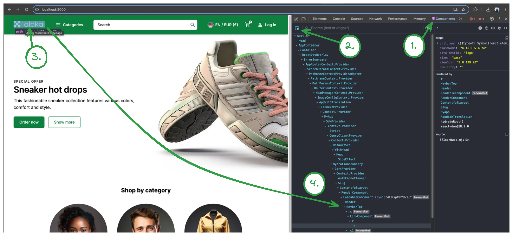
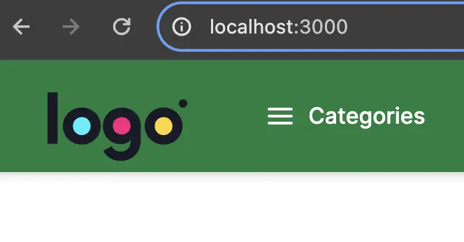
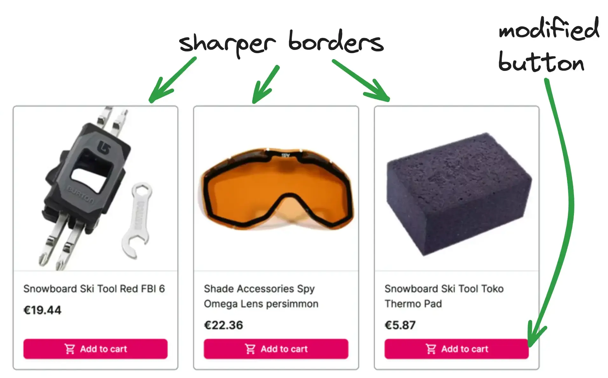

# UI customizations

Out of the box, an Alokai application ships with default design system built on top of [Storefront UI](https://docs.storefrontui.io). While this helps ensure that your application looks good instantly, it's likely one of the first things you'll want to customize. 

Since you have control over the storefront's code in either the Next.js or Nuxt application, you have access to all the code that can modify the look and feel of the application. This guide will walk you through some of the most common customization scenarios and will hopefully help you get familiar with the structure of the codebase.

In this chapter, you will:

::list{type="success"}
- change the default logo to your custom one
- adjust the theme colors to suit the new logo
- add a pre-header with i18n
- customize the look of product cards on the product listing page
- add facet/filter search feature
::

In the end, your application will look something like this:


## Changing the logo

The first step to making any changes is to identify what component is actually responsible for certain elements.

In this example, we need to find and modify the component that contains the logo. You can either:

1. Drill through the Next.js application starting from `storefront-unified-nextjs/pages/[[...slug]].tsx`, which represents
the homepage (actually all CMS pages), and find out that the logo is placed in the `NavbarTop` component.
2. Or you can use [React Developer Tools](https://react.dev/learn/react-developer-tools) to localize the component visually:


Doing one of these, you'll find that the logo is located in `storefront-unified-nextjs/components/ui/NavbarTop/NavbarTop.tsx` component.

Now, we have to change that component and replace `SfIconAlokaiFull` with your custom image. For this example, let's use [LogoIpsum](https://logoipsum.com/) to generate a sample logo.

<!-- Related code: https://github.com/vsf-customer/extensibility-demo/blob/main/apps/storefront-unified-nextjs/components/ui/NavbarTop/NavbarTop.tsx#L55 -->
```html
<!-- [!code --:2]-->
<SfIconAlokaiFull data-testid="logo" className="h-full w-auto" />
<!-- [!code ++:2]-->
<Image src="/images/logoipsum-332.svg" width={100} height={50} unoptimized alt="logo" />
```

The result should look like this:



However, this logo doesn't look good on the storefront's default green background. We can change that by adjusting the `NavbarTop` component and remove the `filled` property. This will make the navbar transparent.

<!-- Related code: https://github.com/vsf-customer/extensibility-demo/blob/main/apps/storefront-unified-nextjs/layouts/DefaultLayout.tsx#L64  -->
```diff
- <NavbarTop filled>
+ <NavbarTop>
```

The logo should look better now. However, buttons in the navbar have become invisible. That's because they are white.

::tip 
#title
An Extra Challenge
#default
Within the `NavbarTop` component, find which tailwind class is responsible for making the buttons white and remove it.
::

## Adjusting theme colors

The primary green color does not play well with the colors in the logo. To fix this we will adjust our theme colors.

The Storefront uses custom Tailwind CSS colors throughout the application, so you can make large UI changes by adjusting the colors in the `tailwind.config.js` file. If you don't have a color pallete already, you can use [Tailwind Colors](https://tailwindcss.com/docs/customizing-colors) to generate one.

Then, edit `apps/storefront-unified-nextjs/tailwind.config.js` and paste your colors under `theme.extend`, rename the color to "primary"

<!-- Related code: https://github.com/vsf-customer/extensibility-demo/blob/main/apps/storefront-unified-nextjs/tailwind.config.js#L39 -->
```ts
  // ...
  theme: {
    extend: {
      colors: {
        primary: {
          50: '#fff0f9',
          100: '#ffe3f5',
          200: '#ffc6eb',
          300: '#ff98d9',
          400: '#ff58bd',
          500: '#ff27a1',
          600: '#ff0c81',
          700: '#df005f',
          800: '#b8004f',
          900: '#980345',
          950: '#5f0025',
        },
      },
  // ...
```

You can read more about theming in [the Storefront UI docs](https://docs.storefrontui.io/v2/customization/theming).

## Adding a pre-header

A common use case is to add a pre-header to the top of each page with something like promotional codes or a call to action. If you feel confident that you can do this, try it out before reading on.

### Solution

1. Create a new `PreHeader.tsx` file in `storefront-unified-nextjs/components/ui/NavbarTop` with the following content:

<!-- Related code: https://github.com/vsf-customer/extensibility-demo/blob/main/apps/storefront-unified-nextjs/components/ui/NavbarTop/PreHeader.tsx -->
```ts
import { SfIconInfo } from '@storefront-ui/react';

export function PreHeader() {
  return (
    <div
      role="alert"
      className="flex items-center w-full justify-center shadow-md bg-secondary-100 pr-2 pl-4 ring-1 ring-secondary-200 typography-text-sm md:typography-text-base py-1 rounded-md"
    >
      <SfIconInfo className="mr-2 text-secondary-700 shrink-0" />
      Limited offer. Use code: ALOKAI2024
    </div>
  );
}
```

2. Add `PreHeader` component to `NavbarTop`:

<!-- Related code: https://github.com/vsf-customer/extensibility-demo/blob/main/apps/storefront-unified-nextjs/components/ui/NavbarTop/NavbarTop.tsx#L29 -->
```ts
export function NavbarTop({ className, children, filled }: NavbarTopProps) {
  const { t } = useTranslation();

  return (
    <>
      <PreHeader />
      <header
        className={classNames(
          'h-14 md:h-20 flex z-40 sticky top-0 md:-top-5 md:pt-2.5 md:shadow-md',
          filled ? 'bg-primary-700 md:shadow-md text-white' : 'bg-white text-[#02C652] border-b border-neutral-200',
          className,
        )}
        data-testid="navbar-top"
      >
        <div className="flex gap-[clamp(1rem,3vw,3rem)] items-center w-full md:h-[60px] max-w-screen-3-extra-large py-6 px-4 md:px-6 lg:px-10 mx-auto sticky top-0">
          <Link
            data-testid="logo-link"
            href={appRoutes.index.compile()}
            title={t('alokaiHomepage')}
            className="h-6 md:h-7 -mt-1.5"
          >
            <Image src="/images/logoipsum-332.svg" width={100} height={50} unoptimized alt="logo" />
          </Link>
          {children}
        </div>
        <Notifications />
      </header>
    </>
  );
}
```

## Pre-header internationalization (i18n)

Let's make this example more interesting by making the pre-header localized. 
[i18-next](https://react.i18next.com/) package comes installed in your storefront and is our recommended solution for internationalization.

1. First, we need to add translations. Translation files are located under `/storefront-unified-nextjs/public/locales` folder.
There's a separate subfolder for each language (e.g. `en`, `de`). All languages have the same set of files.
Open both `en/common.json` and `de/common.json` files and add a new translation there:

<!-- Related code: https://github.com/vsf-customer/extensibility-demo/blob/main/apps/storefront-unified-nextjs/public/locales/en/common.json#L42 -->
```diff [en/common.json]
   "logout": "Logout",
+  "preHeader": {
+    "promoText": "Limited offer. Use code: ALOKAI2024"
+  }
}
```

<!-- Related code: https://github.com/vsf-customer/extensibility-demo/blob/main/apps/storefront-unified-nextjs/public/locales/de/common.json#L43 -->
```diff [de/common.json]
   "logout": "Logout",
+  "preHeader": {
+    "promoText": "Begrenztes Angebot. Verwenden Sie den Code: ALOKAI2024"
+  }
}
```

2. Now, we can use the translations in our `PreHeader` component. We'll utilize the `Trans` from `next-i18next` package.
Your `PreHeader.tsx` should look like this now:

<!-- Related code: https://github.com/vsf-customer/extensibility-demo/blob/main/apps/storefront-unified-nextjs/components/ui/NavbarTop/PreHeader.tsx -->
```tsx
import { SfIconInfo } from '@storefront-ui/react';
import { Trans } from 'next-i18next';

export function PreHeader() {
  return (
    <div
      role="alert"
      className="flex items-center w-full justify-center shadow-md bg-secondary-100 pr-2 pl-4 ring-1 ring-secondary-200 typography-text-sm md:typography-text-base py-1 rounded-md"
    >
      <SfIconInfo className="mr-2 text-secondary-700 shrink-0" />

      <Trans ns="common" i18nKey="preHeader.promoText">
        Limited offer. Use code: ALOKAI2024
      </Trans>
    </div>
  );
}
```

## Modifying the product card on PLP

As a challenge, try to implement these design changes on your own by making the changes to the `ProductCardVertical` component. 



To check your solution, you can look at [our implementation](https://github.com/vsf-customer/extensibility-demo/blob/main/apps/storefront-unified-nextjs/components/ui/ProductCard/ProductCardVertical.tsx).

## Facet search on PLP

Now let's try something more ambitious - we'll extend facet's (aka filters) behavior. We want to be able to filter/search through the facets.

Before jumping to the solution I encourage you to think about how would you do this yourself. Investigate the application and which parts you need to modify.

### Solution

1. Under `storefront-unified-nextjs/components/CategoryFilters/Filters` create a new `FilterSearch` component that would be our searchbox. As a starting point, you can use [Storefront UI's Search Block](https://docs.storefrontui.io/v2/react/blocks/search).

<!-- Related code: https://github.com/vsf-customer/extensibility-demo/blob/main/apps/storefront-unified-nextjs/components/CategoryFilters/Filters/FilterSearch.tsx -->
```ts [storefront-unified-nextjs/components/CategoryFilters/Filters/FilterSearch.tsx]
import { useRef, useState, type ChangeEvent, type FormEvent, type KeyboardEvent } from 'react';
import { SfIconCancel, SfIconSearch, SfInput } from '@storefront-ui/react';
import { FilterSearchProps } from '../types';

export default function FilterSearch({ onSearch }: FilterSearchProps) {
  const inputRef = useRef<HTMLInputElement>(null);
  const [searchValue, setSearchValue] = useState('');

  const isResetButton = Boolean(searchValue);
  const handleSubmit = (event: FormEvent) => {
    event.preventDefault();
  };

  const handleFocusInput = () => {
    inputRef.current?.focus();
  };

  const handleReset = () => {
    setSearchValue('');
    onSearch('');
    handleFocusInput();
  };

  const handleChange = (event: ChangeEvent<HTMLInputElement>) => {
    const ph = event.target.value;
    setSearchValue(ph);
    onSearch(ph);
  };

  const handleInputKeyDown = (event: KeyboardEvent<HTMLDivElement>) => {
    if (event.key === 'Escape') handleReset();
  };

  return (
    <form role="search" onSubmit={handleSubmit} className="relative px-4 py-1">
      <SfInput
        ref={inputRef}
        value={searchValue}
        onChange={handleChange}
        aria-label="Search"
        placeholder="Search 'MacBook' or 'iPhone'..."
        onKeyDown={handleInputKeyDown}
        slotPrefix={<SfIconSearch />}
        slotSuffix={
          isResetButton && (
            <button
              type="reset"
              onClick={handleReset}
              aria-label="Reset search"
              className="flex rounded-md focus-visible:outline focus-visible:outline-offset"
            >
              <SfIconCancel />
            </button>
          )
        }
      />
    </form>
  );
}
```

2. Add `FilterSearchProps` type in `storefront-unified-nextjs/components/CategoryFilters/types.ts`:

<!-- Related code: https://github.com/vsf-customer/extensibility-demo/blob/main/apps/storefront-unified-nextjs/components/CategoryFilters/types.ts#L36 -->
```diff [storefront-unified-nextjs/components/CategoryFilters/types.ts]
+ export type FilterSearchProps = {
+   onSearch: (value: string) => void;
+ };
```

3. Add `FilterSearch` component to `FilterBase` component:

<!-- Related code: https://github.com/vsf-customer/extensibility-demo/blob/main/apps/storefront-unified-nextjs/components/CategoryFilters/Filters/FilterBase.tsx -->
```ts
import { useEffect, useState } from 'react';
import { SfButton, useDisclosure } from '@storefront-ui/react';
import { useTranslation } from 'next-i18next';
import { AccordionItem } from '~/components/AccordionItem';
import { useFacet } from '~/hooks';
import { FilterBaseProps } from '../types';
import FilterSearch from './FilterSearch';

export function FilterBase({ facet, max = 5, children, multiSelect }: FilterBaseProps) {
  const { t } = useTranslation('category');
  const { onSelect, selectedValues } = useFacet(facet, multiSelect);
  const { isOpen: showMore, toggle: toggleShowMore } = useDisclosure({ initialValue: false });
  const { isOpen, toggle: toggleOpen } = useDisclosure({ initialValue: true });
  const { values, label } = facet;
  const [isButtonVisible, setButtonVisible] = useState(max < facet.values.length);
  const [itemsToRender, setItemsToRender] = useState(values);
  const [searchPhrase, setSearchPhrase] = useState('');

  useEffect(() => {
    if (searchPhrase === '') {
      const maxItems = showMore ? values.length : max;
      setItemsToRender(values.slice(0, maxItems));
      setButtonVisible(true);
    } else {
      setItemsToRender(
        values.filter((item) => item.label.toLocaleLowerCase().includes(searchPhrase.toLocaleLowerCase())),
      );
      setButtonVisible(false);
    }
  }, [max, showMore, values, searchPhrase]);

  if (!values) {
    return null;
  }

  return (
    <AccordionItem
      label={
        <span
          data-testid={`filter-${label.replace(/\s+/g, '-').toLowerCase()}-heading`}
          className="font-medium text-base capitalize"
        >
          {label}
        </span>
      }
      open={isOpen}
      onToggle={toggleOpen}
      summaryClassName=""
      className="border-b border-neutral-200"
    >
      <FilterSearch onSearch={setSearchPhrase} />
      <div className="pb-6">
        {children({
          itemsToRender,
          onItemClick: onSelect,
          selected: selectedValues,
        })}
        {isButtonVisible && (
          <SfButton
            className="mt-2 md:h-8 md:text-sm md:px-3 grayscale"
            onClick={toggleShowMore}
            variant="tertiary"
            data-testid={
              showMore ? `show-less-${label.toLowerCase()}-button` : `show-more-${label.toLowerCase()}-button`
            }
          >
            {showMore ? t('showLess') : t('showMore')}
          </SfButton>
        )}
      </div>
    </AccordionItem>
  );
}
```

::info
You can find a complete project example in this repository: <https://github.com/vsf-customer/extensibility-demo>. 
If you want to get access to it, contact our [sales team](https://docs.alokai.com/enterprise).
::


<br />


::card{title="Next: Adding new page" icon="tabler:number-2-small" }

#description
Learn how to create a custom Alokai page.

#cta
:::docs-button{to="/guides/customization-next-js/brands-page"}
Create a new page
:::
::