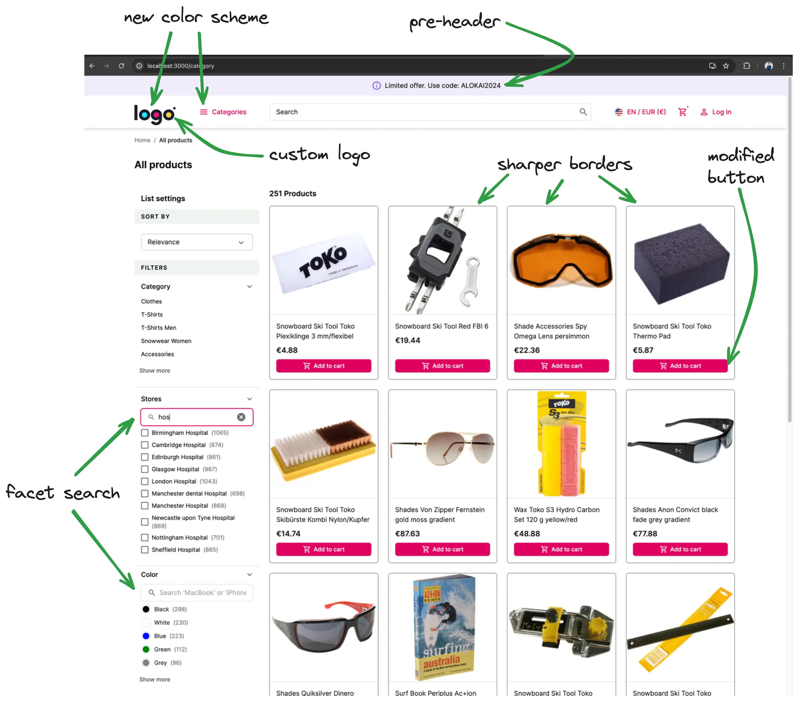

# UI customizations

Out of the box, an Alokai application ships with a default design system built on top of [Storefront UI](https://docs.storefrontui.io). While this helps ensure that your application looks good instantly, it's likely one of the first things you'll want to customize. 

Since you have control over the storefront's code in either the Next.js or Nuxt application, you have access to all the code that can modify the look and feel of the application. This guide will walk you through some of the most common customization scenarios and will hopefully help you get familiar with the structure of the codebase.

In this chapter, you will:

::list{type="success"}
- change the default logo to your custom one
- adjust the theme colors to suit the new logo
- add a pre-header with i18n
- customize the look of product cards on the product listing page
- add facet/filter search feature
::

In the end, your application will look something like this:



## Changing the logo

The first step to making any changes is to identify what component is actually responsible for certain elements.

In this example, we need to find and modify the component that contains the logo. You can either:

1. Drill through the Next.js application starting from `apps/storefront-unified-nextjs/app/[locale]/(cms)/[[...slug]]/page.tsx`, which represents
the homepage (actually all CMS pages). The layout for this page is located in `apps/storefront-unified-nextjs/app/[locale]/(cms)/layout.tsx`, which re-exports
`BaseDefaultLayout`. In that layout you can find that `Navbar` component is responsible for rendering the navbar. Within that component we have `NavbarTop` component
which renders the logo.
2. Or you can use [React Developer Tools](https://react.dev/learn/react-developer-tools) to localize the component visually:


Doing one of these, you'll find that the logo is located in `apps/storefront-unified-nextjs/components/navigations/navbar-top.tsx` component.

Now, we have to change that component and replace `SfIconAlokaiFull` with your custom image. For this example, let's use [LogoIpsum](https://logoipsum.com/) to generate a sample logo. Download a sample logo and place it in `apps/storefront-unified-nextjs/public/images` folder.

```html
<!-- [!code --:2]-->
<SfIconAlokaiFull data-testid="logo" className="h-full w-auto" />
<!-- [!code ++:2]-->
<Image src="/images/<logo-file-name>" width={100} height={50} unoptimized alt="logo" />
```

The result should look like this:


However, this logo doesn't look good on the storefront's default green background. We can change that by removing the `filled` property from `NavbarTop` component in `Navbar` component. This will make the navbar transparent.

```diff[apps/storefront-unified-nextjs/app/[locale]/(default)/components/navbar.tsx]
- <NavbarTop filled>
+ <NavbarTop>
```

The logo should look better now. However, buttons in the navbar have become invisible. That's because they are white.

::tip 
#title
An Extra Challenge
#default
Within the `NavbarTop` component, find which tailwind class is responsible for making the buttons white and remove it.
::

## Adjusting theme colors

The primary green color does not play well with the colors in the logo. To fix this we will adjust our theme colors.

The Storefront uses custom Tailwind CSS colors throughout the application, so you can make large UI changes by adjusting the colors in the `tailwind.config.ts` file. If you don't have a color palette already, you can use [Tailwind Colors](https://tailwindcss.com/docs/customizing-colors) to generate one.

Then, edit `apps/storefront-unified-nextjs/tailwind.config.ts` and paste your colors under `theme.extend`, rename the color to "primary"


```ts
  // ...
  theme: {
    extend: {
      colors: {
        primary: {
          50: '#fff0f9',
          100: '#ffe3f5',
          200: '#ffc6eb',
          300: '#ff98d9',
          400: '#ff58bd',
          500: '#ff27a1',
          600: '#ff0c81',
          700: '#df005f',
          800: '#b8004f',
          900: '#980345',
          950: '#5f0025',
        },
      },
  // ...
```

You can read more about theming in [the Storefront UI docs](https://docs.storefrontui.io/v2/customization/theming).

## Adding a pre-header

A common use case is to add a pre-header to the top of each page with something like promotional codes or a call to action. If you feel confident that you can do this, try it out before reading on.

### Solution

1. Create a new `pre-header.tsx` file in `apps/storefront-unified-nextjs/components/navigations` folder with the following content:

```tsx
import { SfIconInfo } from '@storefront-ui/react';

export function PreHeader() {
  return (
    <div
      role="alert"
      className="flex items-center w-full justify-center shadow-md bg-secondary-100 pr-2 pl-4 ring-1 ring-secondary-200 typography-text-sm md:typography-text-base py-1 rounded-md"
    >
      <SfIconInfo className="mr-2 text-secondary-700 shrink-0" />
      Limited offer. Use code: ALOKAI2024
    </div>
  );
}
```

2. Add `PreHeader` component to `NavbarTop`:

```tsx
export default function NavbarTop({ children, className, filled }: NavbarTopProps) {
  const t = useTranslations('NavbarTop');
  const messages = useMessages();

  return (
    <> /* [!code ++] */
      <PreHeader /> /* [!code ++] */
      <header
        className={classNames(
          'sticky top-0 z-40 flex h-14 md:-top-5 md:h-20 md:pt-2.5',
          filled ? 'bg-primary-700 md:shadow-md' : 'border-b border-neutral-200 bg-white text-neutral-900',
          className,
        )}
        data-testid="navbar-top"
      >
        <div className="sticky top-0 mx-auto flex w-full max-w-screen-3-extra-large items-center gap-[clamp(1rem,3vw,3rem)] px-4 py-6 md:h-[60px] md:px-6 lg:px-10">
          <Link className="-mt-1.5 h-6 md:h-7" data-testid="logo-link" href="/" title={t('homepage')}>
            <Image src="/images/logoipsum-332.svg" width={100} height={50} unoptimized alt="logo" />
          </Link>
          {children}
          <NextIntlClientProvider messages={pick(messages, 'Notifications')}>
            <Notifications />
          </NextIntlClientProvider>
        </div>
      </header>
    </> /* [!code ++] */
  );
}
```

## Pre-header internationalization (i18n)

Let's make this example more interesting by making the pre-header localized. 
[next-intl](https://next-intl-docs.vercel.app/) package comes installed in your storefront and is our recommended solution for internationalization.

1. First, we need to add translations. Translation files are located under `apps/storefront-unified-nextjs/lang` folder.
There's a separate subfolder for each language (e.g. `en`, `de`).
Open both `en/base.json` and `de/base.json` files and add a new translation there:

```diff [en/base.json]
},
+  "PreHeader": {
+    "promoText": "Limited offer. Use code: ALOKAI2024"
+  },
  "Navbar": {
```

```diff [de/base.json]
  },
+  "PreHeader": {
+    "promoText": "Begrenztes Angebot. Verwenden Sie den Code: ALOKAI2024"
  },
  "Navbar": {
```

2. Now, we can use the translations in our `PreHeader` component. We'll utilize the `useTranslations` from `next-intl` package.
Your `pre-header.tsx` should look like this now:

```tsx [apps/storefront-unified-nextjs/components/navigations/pre-header.tsx]
import { SfIconInfo } from '@storefront-ui/react';
import { useTranslations } from 'next-intl';

export function PreHeader() {
  const t = useTranslations('PreHeader');
  return (
    <div
      role="alert"
      className="flex w-full items-center justify-center rounded-md bg-secondary-100 py-1 pl-4 pr-2 shadow-md ring-1 ring-secondary-200 typography-text-sm md:typography-text-base"
    >
      <SfIconInfo className="mr-2 shrink-0 text-secondary-700" />
      {t('promoText')}
    </div>
  );
}

```

## Modifying the product card on PLP

As a challenge, try to implement these design changes on your own by making the changes to the `ProductCardVertical` component. 


To check your solution, you can look at [our implementation](https://github.com/vsf-customer/extensibility-demo-v2/blob/main/apps/storefront-unified-nextjs/components/product-card-vertical.tsx).

## Facet search on PLP

Now let's try something more ambitious - we'll extend facet's (aka filters) behavior. We want to be able to filter/search through the facets.

Before jumping to the solution, think about how would you do this yourself. Investigate the application and which parts you need to modify.

### Solution

1. Under `apps/storefront-unified-nextjs/components/products-listing` create a new `FilterSearch` component that would be our searchbox. As a starting point, you can use [Storefront UI's Search Block](https://docs.storefrontui.io/v2/react/blocks/search).

    ```tsx [apps/storefront-unified-nextjs/components/products-listing/filter-search.tsx]
    import { SfIconCancel, SfIconSearch, SfInput } from '@storefront-ui/react';
    import { useRef, useState, type ChangeEvent, type FormEvent, type KeyboardEvent } from 'react';

    export type FilterSearchProps = {
      onSearch: (value: string) => void;
    };

    export default function FilterSearch({ onSearch }: FilterSearchProps) {
      const inputRef = useRef<HTMLInputElement>(null);
      const [searchValue, setSearchValue] = useState('');

      const isResetButton = Boolean(searchValue);
      const handleSubmit = (event: FormEvent) => {
        event.preventDefault();
      };

      const handleFocusInput = () => {
        inputRef.current?.focus();
      };

      const handleReset = () => {
        setSearchValue('');
        onSearch('');
        handleFocusInput();
      };

      const handleChange = (event: ChangeEvent<HTMLInputElement>) => {
        const ph = event.target.value;
        setSearchValue(ph);
        onSearch(ph);
      };

      const handleInputKeyDown = (event: KeyboardEvent<HTMLDivElement>) => {
        if (event.key === 'Escape') handleReset();
      };

      return (
        <form role="search" onSubmit={handleSubmit} className="relative px-4 py-1">
          <SfInput
            ref={inputRef}
            value={searchValue}
            onChange={handleChange}
            aria-label="Search"
            placeholder="Search 'MacBook' or 'iPhone'..."
            onKeyDown={handleInputKeyDown}
            slotPrefix={<SfIconSearch />}
            slotSuffix={
              isResetButton && (
                <button
                  type="reset"
                  onClick={handleReset}
                  aria-label="Reset search"
                  className="flex rounded-md focus-visible:outline focus-visible:outline-offset"
                >
                  <SfIconCancel />
                </button>
              )
            }
          />
        </form>
      );
    }
    ```

2. Modify `Facet` component in `apps/storefront-unified-nextjs/components/products-listing/facets.tsx` by adding `FilterSearch` component and implementing filtering logic:

    ```tsx [apps/storefront-unified-nextjs/components/products-listing/facets.tsx]
    function Facet({
      containerClassName,
      expandableListProps,
      facet,
      itemRenderer: FacetItem,
      multiSelect = false,
    }: FacetProps) {
      const [searchPhrase, setSearchPhrase] = useState(''); /* [!code ++] */
      const [values, setValues] = useState(facet.values); /* [!code ++] */

      /* [!code ++:9] */
      useEffect(() => {
        if (searchPhrase === '') {
          setValues(facet.values);
        } else {
          setValues(
            facet.values.filter((item) => item.label.toLocaleLowerCase().includes(searchPhrase.toLocaleLowerCase())),
          );
        }
      }, [facet, searchPhrase]);

      const [selected, setSelected] = useQueryState(
        `${FACET_QUERY_PREFIX}${facet.name}`,
        parseAsArrayOf(parseAsString).withDefault([]).withOptions({ shallow: false }),
      );
      function toggleFacet(value: string) {
        if (selected.includes(value)) {
          const updated = selected.filter((v) => v !== value);
          return setSelected(updated.length ? updated : null);
        }

        return setSelected(multiSelect ? [...selected, value] : [value]);
      }

      return (
        <AccordionItem
          className="border-b border-neutral-200 pb-6"
          id={facet.name}
          key={facet.name}
          summary={
            <span
              className="text-base font-medium capitalize"
              data-testid={`filter-${facet.label.replace(/\s+/g, '-').toLowerCase()}-heading`}
            >
              {facet.label}
            </span>
          }
          summaryClassName="pt-4"
        >
          <FilterSearch onSearch={setSearchPhrase}></FilterSearch> /* [!code ++] */
          <div className={containerClassName}>
            <ExpandableList {...expandableListProps}>
              {facet.values.map((item) => (/* [!code --] */
              {values.map((item) => ( /* [!code ++] */
                <FacetItem
                  key={item.value}
                  {...item}
                  onItemClick={() => toggleFacet(item.value)}
                  selected={selected.includes(item.value)}
                />
              ))}
            </ExpandableList>
          </div>
        </AccordionItem>
      );
    }
    ```

::info
You can find a complete project example in this repository: <https://github.com/vsf-customer/extensibility-demo-v2>.
If you want to get access to it, contact our [sales team](https://docs.alokai.com/enterprise).
::

<br />


::card{title="Next: Adding new page" icon="tabler:number-2-small" }

#description
Learn how to create a custom Alokai page.

#cta
:::docs-button{to="/guides/customization/app-router/brands-page"}
Create a new page
:::
::