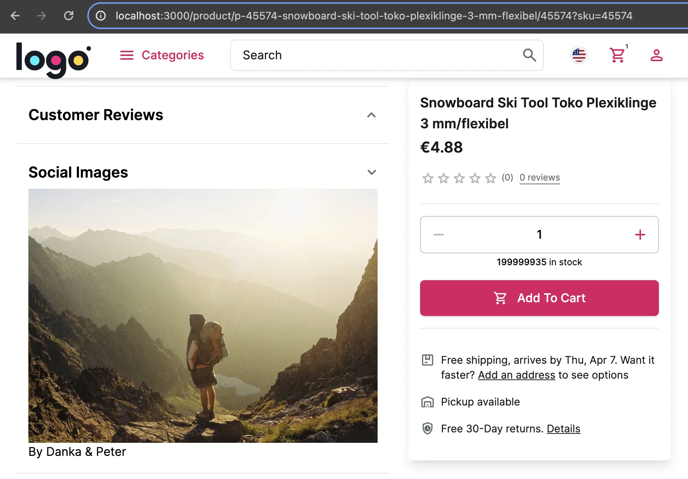

# Adding New API Methods

The Unified Data Model contains the most commonly used data for eCommerce backends, but there will be times when you need additional information, combine data from multiple sources, or create a new data structure.

In this guide, we will implement a mock of "social product images" feature - a feature where we display product images posted on social media. For the sake of simplicity we won't reach a real social network, we will use [Lorem Picsum](https://picsum.photos/) API to mock it. The result will look like this:



This guide is based on this documentation -> [Creating New API Methods](/unified-data-layer/integration-and-setup/creating-new-api-methods)

1. First, we need to create a custom method in the middleware.

Define input and output types of your method in `apps/storefront-middleware/api/custom-methods/types.ts`:


```ts [apps/storefront-middleware/api/custom-methods/types.ts]
export interface SocialImagesArgs {
  seed: string;
}

export interface SocialImagesResponse {
  id: string;
  author: string;
  width: number;
  height: number;
  url: string;
  download_url: string;
}
```

Then, define a method by creating `apps/storefront-middleware/api/custom-methods/getSocialImages` file with the following content:

```ts
import { type IntegrationContext } from "../../types";
import { SocialImagesArgs, SocialImagesResponse } from "./types";

export async function getSocialImages(
  context: IntegrationContext,
  args: SocialImagesArgs,
): Promise<SocialImagesResponse> {
  const image: SocialImagesResponse = await (
    await fetch(`https://picsum.photos/seed/${args.seed}/info`)
  ).json();
  return image;
}
```

And export the method in the `/api/socialImagesExtension/index.ts` file.

```ts [/api/myExtension/index.ts]
export * from "./getSocialImages";
```

Now, thanks to the SDK synchronization, the `getSocialImages` method will be available and typed under `custom`
namespace when you use the SDK in your Storefront.

```ts
// Storefront project
const { data } = sdk.custom.getSocialImages({/* args */});
```

2. Now let's implement the UI for this feature.

Create `SocialImages` component under `apps/storefront-unified-nextjs/components/social-images.tsx`

```ts [apps/storefront-unified-nextjs/components/social-images.tsx]
import Image from 'next/image';

import { getSdk } from '@/sdk';

export async function SocialImages({ productId }: { productId: string }) {
  const sdk = getSdk();
  const socialImage = await sdk.custom.getSocialImages({ seed: productId });

  return (
    <div className="px-4">
      <Image
        alt="social image"
        height={socialImage.height}
        src={socialImage.download_url ?? ''}
        unoptimized
        width={socialImage.width}
      />
      <p>By {socialImage.author}</p>
    </div>
  );
}
```

Add this component to Product Details Page. Open `apps/storefront-unified-nextjs/app/[locale]/(default)/product/[slug]/[id]/page.tsx` and use
`AccordionItem` component to add `SocialImages` component.

```tsx [apps/storefront-unified-nextjs/app/[locale]/(default)/product/[slug]/[id]/page.tsx]
              </ProductReviewsAccordion>
              /* [!code ++:9] */
              <Divider className="my-4" />
              <AccordionItem
                id="socialImages"
                summary={
                  <h2 className="font-semibold typography-headline-5 md:typography-headline-2">Social Images</h2>
                }
              >
                <SocialImages productId={product.id} />
              </AccordionItem>
            </AccordionProvider>
```

Finally, we have implemented a completely custom feature. You can find a complete project example in this repository:
<https://github.com/vsf-customer/extensibility-demo-v2>
If you want to get access to it, contact our [sales team](https://docs.alokai.com/enterprise).


::info
Read more about adding new API methods here: https://docs.alokai.com/storefront/integration-and-setup/creating-new-api-methods
::
