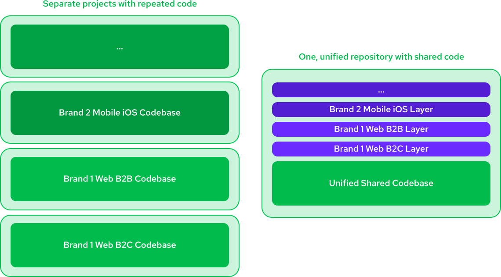
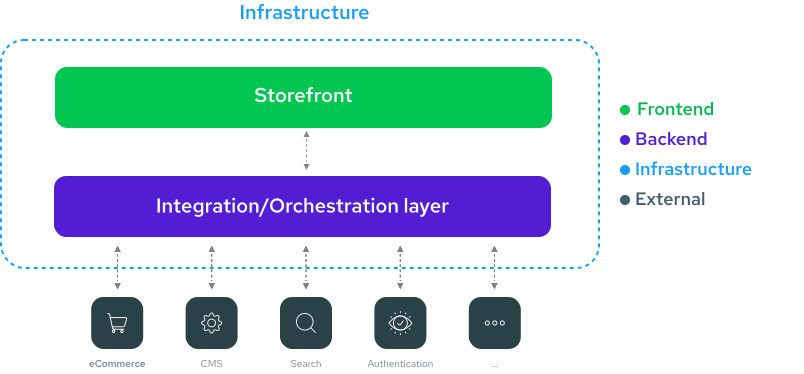

# The Multistore Problem - challenges of scaling Setups

**Scaling an eCommerce business across multiple brands, geographies, and touchpoints sounds like a natural next step. But the reality? It’s a logistical and technical minefield. As companies expand, agility often takes a hit—slowing down innovation, increasing overhead, and complicating operations.**

Businesses often start with a single eCommerce platform, designed for a specific market and use case. Growth then happens through expansion into new touchpoints (mobile apps, marketplaces, social commerce), new geographies, or acquiring brands with their own tech stacks. Over time, what was once a streamlined setup becomes fragmented, introducing complexity that makes agility and scalability difficult.

How do you maintain speed and adaptability while managing multiple storefronts, integrating new acquisitions, and expanding into new markets? Let’s break down the key challenges and why solving them isn’t as straightforward as it seems.

## How Alokai solves Multistore problem?

**Most eCommerce of the applications share 60-80% of their functionality, regardless of geography, touchpoint, or brand. The foudnation for every eCommerce store is always the same - product catalog, cart, checkout, user profile. Alokai provides an efficient setup that takes reuse of common components, and ease of maintainability as its key principle**

At Alokai, we've been building universal eCommerce application that has to cover different use cases around B2B and B2C around 2017. We've put all of our knowledge about reusability and configurability of eCommerce storefronts into our Multistore solution so you can leverage it without years of discovering solutions to different problems and their edge cases.

We guarantee that it is the most optimal way to run complex eCommerce setups.

As a rule of thumb, **the more complex your setup is, the more value we can bring to your business.**. Multiple vendors, technologies, geographies, touchponts, brands, catalogs.... - the more complexity you struggle with now, the more you can gain!

Let's see how, on a high-level Alokai addresses different components of the Multistore problem.

### End-to-end solution for end-to-end problem

Multistore is a complex problem that spreads across all the application layers - UI, frotnend logic, data, vendors and infrastructure. It's not easy to find a solution that works for every use case. It's hard to combine them to fulfill the ones you want to cover, and it's almost impossible to pick ones that will work for multiple projects, often with different goals.

For that, you need an end-to-end solution. A Platform that covers all the layers and is specifically build to solve end-to-end problems rather than one from specific domain. This is where Alokai comes in.

We provide end-to-end solution that goes through all the layers of an eCommerce project from the design to the deployment. You can read more about Alokai product and stacks [here](general#our-products)

### Inheritance as universal principle of reusability

The key pattern behind Alokai's Miltistore solution is a file inheritance mechanism. Think of it like CSS cascading - each layer can override any file from your source code or previous layers, while keeping the rest intact. This includes pages, components, layouts, styles, public assets, and any other project files.
This approach ensures maximum reusability of common parts while leaving full freedom to customize it per store.

### Unified Data Layer

Last, but not least important peice of Alokai's solution is Unified Data Layer. 

::card{title="Next: How Alokai Solves It" icon="tabler:number-2-small" to="/guides/multistore/how-alokai-solves-it"}    

#description
TODO

#cta
:::docs-button{to="/guides/multistore/how-alokai-solves-it"}
Next
:::
::
