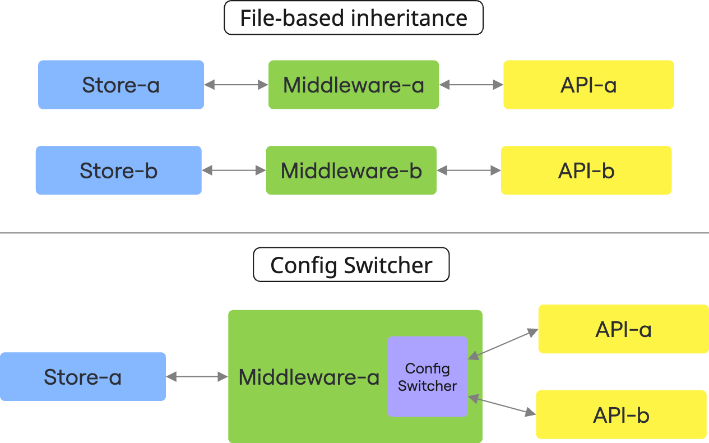

# How to make sub-path routing on Middleware

## Understanding Sub-Path Routing Architecture

Sub-path routing in Alokai consists of two essential components: the storefront (frontend) and the middleware (backend). This architectural pattern allows you to serve different content or product catalogs through distinct URL paths within the same application. **This guide focuses exclusively on implementing the middleware aspect of sub-path routing** using the `ConfigSwitcher` extension, which dynamically changes integration configurations based on URL paths. For comprehensive information about implementing sub-path routing in storefront applications ([Next.js](./1.subpath-next.md) and [Nuxt](./2.subpath-nuxt.md)), please refer to the dedicated documentation for those frameworks.

The `ConfigSwitcher` extension in middleware enables dynamic configuration changes per request, allowing you to adapt your integrations like eCommerce or CMS settings based on specific URL paths. This powerful feature lets you serve different product catalogs or content collections through the same store instance but on different URL paths.

## Why Use Sub-Path Routing?

Sub-path routing allows you to create a more dynamic and flexible application that can adapt to different contexts based on the URL path. This approach can simplify your architecture by consolidating multiple configurations within a single store instance.

### Common Use Cases

1. **Multi-catalog stores**: Show different product catalogs based on URL paths
2. **Regional content variations**: Serve different content based on region-specific paths
3. **Brand-specific experiences**: Configure different brand experiences within the same store

**What You'll Learn**

::list{type="success"}
- Understanding how `ConfigSwitcher` extension works within the middleware
- Setting up multiple configurations within a single store
- Implementing integration-specific configurations
::

## Core Concepts

### How ConfigSwitcher Works

The `ConfigSwitcher` dynamically changes your middleware integration configuration based on the current request configuration ID sent with the `x-alokai-middleware-config-id` header. This means:

1. **Path-Based Configuration**
    - Different configuration ID set by different paths allow to fetch data from different sources
    - Example: `/clothes` path shows apparel products, while `/electronics` shows electronics products

2. **Configuration ID vs Store ID**
    - Each configuration has its own distinct ID
    - This is different from the store ID (`storeId`)
    - Multiple configurations can exist within a single store

3. **Same-Store Operation**
    - `ConfigSwitcher` works within a single store instance
    - It extracts the configuration ID from the request
    - It executes queries using the appropriate configuration

::tip
The `ConfigSwitcher` only affects middleware configuration. The frontend remains the same, but it receives data from different sources based on the URL path.
::

### Key Distinctions To File-Based Inheritance

`ConfigSwitcher` operates differently from file-based inheritance:

| **File-Based Inheritance**              | **ConfigSwitcher**                            |
|-----------------------------------------|-----------------------------------------------|
| Works **between different stores**      | Works **within a single store**               |
| Creates separate deployable instances   | Uses a single deployable instance             |
| Full codebase customization             | Only middleware configuration changes         |
| Requires separate builds for each store | Single build supports multiple configurations |

Take a look at the diagram to see the difference:



## Configurable Elements

The `ConfigSwitcher` extension allows you to change only the `configuration` object of the specific integration config.

A typical configuration file looks like this:
```ts
// /apps/storefront-middleware/integrations/<your-integration>/config.ts

import type { ApiClientExtension, Integration } from '@alokai/connect/middleware';
import type { MiddlewareConfig } from '@vsf-enterprise/<your-integrarion>';

export const config = {
   configuration: {
      // configuration options
   },
   location: '@vsf-enterprise/<your-integration>/server',
   extensions: (extensions: ApiClientExtension[]) => [
      // extensions for the integration
   ],
} satisfies Integration<MiddlewareConfig>;
```

Let's use SAPCC eCommerce integration as an example, by default the configuration file is located at: `/apps/storefront-middleware/integrations/sapcc/config.ts`

::warning
If you've overridden this file for a specific store (e.g., `store-c`), your configuration would be at: 

`apps/stores/store-c/storefront-middleware/integrations/sapcc/config.ts`
::

A SAPCC specific configuration file looks like this:

```ts
// /apps/storefront-middleware/integrations/sapcc/config.ts

import type { ApiClientExtension, Integration } from '@alokai/connect/middleware';
import type { MiddlewareConfig } from '@vsf-enterprise/sapcc-api';

export const config = {
  configuration: {
    api: {
      baseSiteId: 'default',
      catalogId: 'defaultProductCatalog',
      catalogVersion: 'Online',
      defaultCurrency: 'USD',
      defaultLanguage: 'en',
      uri: 'https://<your-sap-api>',
    },
    OAuth: {
      clientId: '<your-client-id>',
      clientSecret: '<your-client-secret>',
      tokenEndpoint: '/oauth/token',
      tokenRevokeEndpoint: '/oauth/revoke',
      uri: 'https://<your-sap-api>/authorizationserver/',
    }
  },

  extensions: (extensions: ApiClientExtension[]) => [
    ...extensions
  ],

  location: '@vsf-enterprise/sapcc-api/server',
} satisfies Integration<Config>;

export type Config = MiddlewareConfig;
```

By looking at this config file you can see that you can modify anything inside of the `api` or `OAuth` objects.
Other objects outside of the `configuration` object like the `extensions` and `location` cannot be modified using this tool. 

## Implementation Guide

### Step 1: Create a configuration file

The first step is to create a dedicated configuration file for your integration, in which all possible configurations will be defined.

To keep things organized, you should create this file in the same directory as your integration's configuration file. The recommended name for this file is `switcher.config.ts`.

For the above SAPCC example, this file path would look like this: `/apps/storefront-middleware/integrations/sapcc/`.

::tip
If you've overridden the configuration file for some store, perform this step in its directory. If, for example, the store is `store-c`, the correct file path becomes:

`/apps/stores/store-c/storefront-middleware/integrations/sapcc/switcher.config.ts`
::

### Step 2: Create a configuration object

Important: the keys of the `config` object will correspond to the configuration IDs that will be sent from the frontend. They must be consistent.

Example config object:

```ts
// /apps/storefront-middleware/integrations/sapcc/switcher.config.ts

export const config = {
  default: {},
  electronics: {}
}
```

Note that two keys have been placed here: `default` and `electronics`. Config object **must contain all** configuration keys that are used by a given store, even those you won't be changing. If you don't want to override some configuration, leave an empty object. Only make the changes you need, everything else will be inherited from the main configuration.

### Step 3: Apply overrides

Let's assume you want to change the product catalog for the configuration with ID `electronics`. To do it extend the given example with this change:


```ts
// /apps/storefront-middleware/integrations/sapcc/switcher.config.ts

export const config = {
  default: {},
  electronics: {},  // [!code --]
  // [!code ++:7]
  electronics: {
    api: {
      baseSiteId: 'electronics',
      catalogId: 'electronicsProductCatalog',
    },
  },
};
```

Note that the overrides are made here within the `api` object. This is important because configurations are merged with the main configuration, so their structure must be the same. In the base configuration, these keys are also nested inside of the `api` object.

### Step 4: Create `ConfigSwitcher` extension

Now let's create a `ConfigSwitcher` extension file.
Create a new file and name it `configSwitcher.ts`. Place it where the other extensions for the given integration are located. Continuing example with SAPCC, place it in the directory `/apps/storefront-middleware/integrations/sapcc/extensions`. 

Fill the newly created file with the content from the snippet below:

```ts
// /apps/storefront-middleware/integrations/sapcc/extensions/configSwitcher.ts

import { createConfigSwitcherExtension } from '@alokai/connect/config-switcher';
import type { MiddlewareConfig } from '@vsf-enterprise/sapcc-api';

export const configSwitcherExtension = createConfigSwitcherExtension<MiddlewareConfig>({
  configuration: {},
});
```

Now you need to supply the configuration for the `ConfigSwitcher` extension with the configuration file you created in the previous step. Import it from the file and use it inside the extension:


```ts
// /apps/storefront-middleware/integrations/sapcc/extensions/configSwitcher.ts

import { createConfigSwitcherExtension } from '@alokai/connect/config-switcher';
import type { MiddlewareConfig } from '@vsf-enterprise/sapcc-api';

import { config } from '../switcher.config'; // [!code ++]

export const configSwitcherExtension = createConfigSwitcherExtension<MiddlewareConfig>({
  configuration: {}, // [!code --]
  configuration: config, // [!code ++]
});
```

### Step 5: Register the new extension

The final step is to add the `ConfigSwitcher` extension to the main configuration of the given integration.

```ts
// /apps/storefront-middleware/integrations/sapcc/config.ts

import type { ApiClientExtension, Integration } from '@alokai/connect/middleware';
import type { MiddlewareConfig } from '@vsf-enterprise/sapcc-api';

import { configSwitcherExtension } from './extensions/configSwitcher'; // [!code ++]

export const config = {
  configuration: {
    api: {
      baseSiteId: 'default',
      catalogId: 'defaultProductCatalog',
      catalogVersion: 'Online',
      defaultCurrency: 'USD',
      defaultLanguage: 'en',
      uri: 'https://<your-sap-api>',
    },
    OAuth: {
      clientId: '<your-client-id>',
      clientSecret: '<your-client-secret>',
      tokenEndpoint: '/oauth/token',
      tokenRevokeEndpoint: '/oauth/revoke',
      uri: 'https://<your-sap-api>/authorizationserver/',
    }
  },

  extensions: (extensions: ApiClientExtension[]) => [
    ...extensions,
    configSwitcherExtension, // [!code ++]
  ],

  location: '@vsf-enterprise/sapcc-api/server',
} satisfies Integration<Config>;

export type Config = MiddlewareConfig;
```

## Multiple Integrations

Each integration requires its own `ConfigSwitcher` setup. If your project uses multiple integrations (e.g., SAPCC for eCommerce and Contentful for CMS), you'll need to configure the `ConfigSwitcher` separately for each one.

Every `ConfigSwitcher` extensions must use the same configuration IDs, which means that you cannot use different configuration IDs in different extensions.

## Typescript

To enable proper typing, create a new type that will define the configuration of the `ConfigSwitcher` extension. For this purpose, use the `Config` type from the base configuration of the integration whose configuration you're changing.


```ts
// /apps/storefront-middleware/integrations/<your-integration>/switcher.config.ts 

import type { Config } from './config';
```

Since each configuration option can be overridden, and the type may have some keys marked as required that you won't be overriding, you must override the type so that none of the keys are required. Use the `Partial` type for this. If you want to override only selected values for the `api` key in the configuration, you can do it in the way shown below:

```ts
// /apps/storefront-middleware/integrations/sapcc/config.switcher.ts

// [!code ++:10]
import type { Config } from './config';

type ConfigSwitcherItem = {
  api?: Partial<Config['api']>;
};

export type ConfigSwitcher = {
  [key: string]: Partial<ConfigSwitcherItem>;
};

export const config = { // [!code --]
export const config: ConfigSwitcher = { // [!code ++]
  default: {},
  electronics: {
    api: {
      baseSiteId: 'electronics',
      catalogId: 'electronicsProductCatalog',
    },
  },
};
```

This way, you can override only selected parts of the configuration, and TypeScript won't require you to provide all keys that are marked as required.

---

With sub-path routing properly configured, your Alokai application can now dynamically adapt to different contexts while maintaining a single codebase and deployment. This approach simplifies management while providing the flexibility needed for complex multi-catalog or multi-region scenarios.


