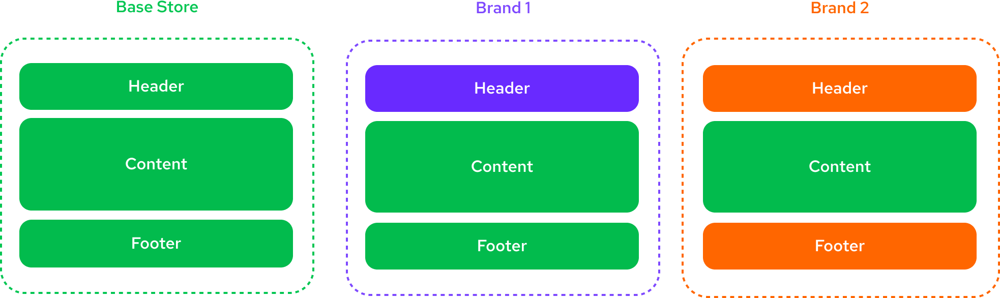
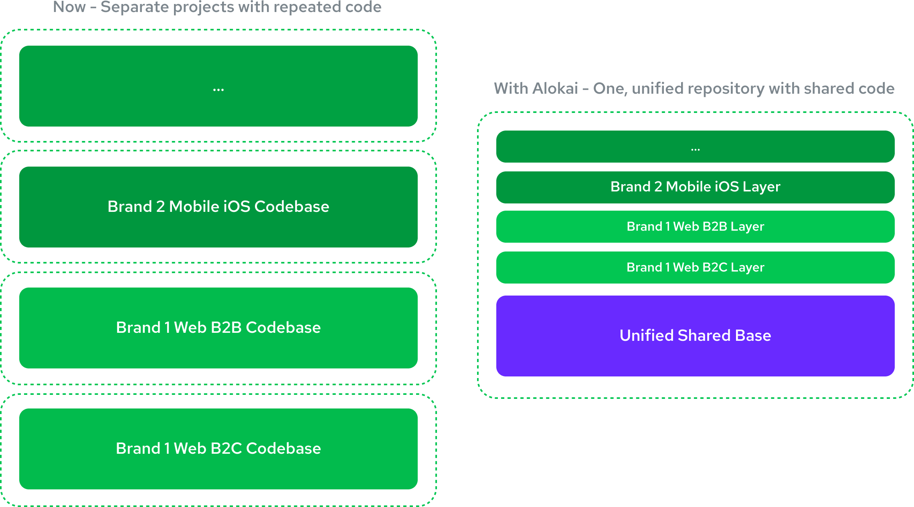
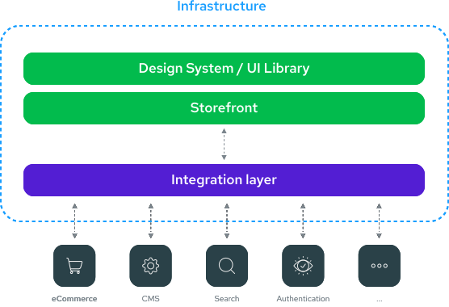

# The Multistore Problem and Alokai's Solution

## TL;DR
Multistore commerce brings a huge maintenance burden for merchants. Alokai solves this problem by allowing you to reuse the common parts between stores. You only need to write and maintain the distinct parts of the stores. This is achieved by the file inheritance mechanism. It works similar to CSS cascading, each layer can override any file from your source code or previous layers while keeping the rest intact.

Read on to learn more about the multistore problem and Alokai solution or [jump straight to the practical part](/guides/multistore/tooling-and-concepts).

## Challenges of Scaling eCommerce Setups

**Expanding an eCommerce business across multiple brands, geographies, and touchpoints is a logistical and technical minefield. As companies grow, agility often takes a hit—slowing down innovation, increasing overhead, and complicating operations.**

Businesses often start with a single eCommerce platform, designed for a specific market and use case. Growth then happens through expansion into new touchpoints (mobile apps, marketplaces, social commerce), new geographies, or acquiring brands with their own tech stacks. **Over time, what was once a streamlined setup becomes fragmented, introducing complexity that makes agility and scalability difficult.**

How do you maintain speed and adaptability while managing multiple storefronts, integrating new acquisitions, and expanding into new markets?

## How Alokai Solves the Multistore Problem

**Most eCommerce applications share 60-80% of their functionality, regardless of geography, touchpoint, or brand.** The foundation for every eCommerce store is always the same - product catalog, cart, checkout, user profile. Alokai provides an efficient setup that prioritizes reuse of common components and ease of maintainability.

At Alokai, we've been building universal eCommerce applications that cover different use cases around B2B and B2C since 2017. We've put all of our knowledge about reusability and configurability of eCommerce storefronts into our Multistore product so you can leverage it without years of discovering solutions to different problems and their edge cases.

We guarantee that it is the most optimal way to run complex eCommerce setups.

As a rule of thumb, **the more complex your setup is, the more value we can bring to your business**. Multiple vendors, technologies, geographies, touchpoints, brands, catalogs... - the more complexity you struggle with now, the more you can gain!

Let's see how, on a high level, Alokai addresses different components of the Multistore problem.

### End-to-End Solution for an End-to-End Problem

**Multistore is not a single problem to solve.** It is a set of challenges that must be solved individually, and making those solutions work well together is another problem to solve. There is a lot of complexity in it that spreads across all the application layers - UI, frontend logic, data, vendors, and infrastructure. It's not easy to find a solution that works for every use case. It's hard to combine them to fulfill the ones you want to cover, and it's almost impossible to pick ones that will work for multiple projects, often with different goals.

For that, you need an end-to-end solution. A platform that covers all the layers and is specifically built to solve end-to-end problems rather than one from a specific domain. This is where Alokai comes in.

We provide an end-to-end solution that goes through all the layers of an eCommerce project from design to deployment. You can read more about Alokai products and stacks [here](/general#our-products).

### Inheritance Ensures Maximum Reusability Without Limiting Customization

The key pattern behind Alokai's Multistore solution is the file inheritance mechanism. Think of it like CSS cascading - each layer can override any file from your source code or previous layers while keeping the rest intact. This includes pages, components, layouts, styles, public assets, and any other project files.

This approach ensures maximum reusability of common parts while leaving full freedom to customize per store.

### Unified Data Layer

The [Unified Data Layer](/unified-data-layer) allows you to keep the same data model used across all stores even if the underlying technologies are different. This way, you don't need to build alternative versions of the UI and business logic for each vendor. Even if your API stack is not consistent across brands or regions, you can still have a single, unified core UI and logic shared across all of them.

### Freedom in How You Build and Deploy

The solution is flexible and allows you to optimize the ways you want to develop and deploy the application separately.

This means that you can deploy completely separate storefronts or a single store with multiple variations from the same repository. One does not influence the other, so you can optimize the workflow and deployment to fit your needs without tradeoffs.

::card{title="Next: Use Cases" to="/guides/multistore/use-cases"}    

#description
Learn the most common use cases that Alokai Multistore was built for.

#cta
:::docs-arrow-link{to="/guides/multistore/use-cases"}
Next
:::
::
