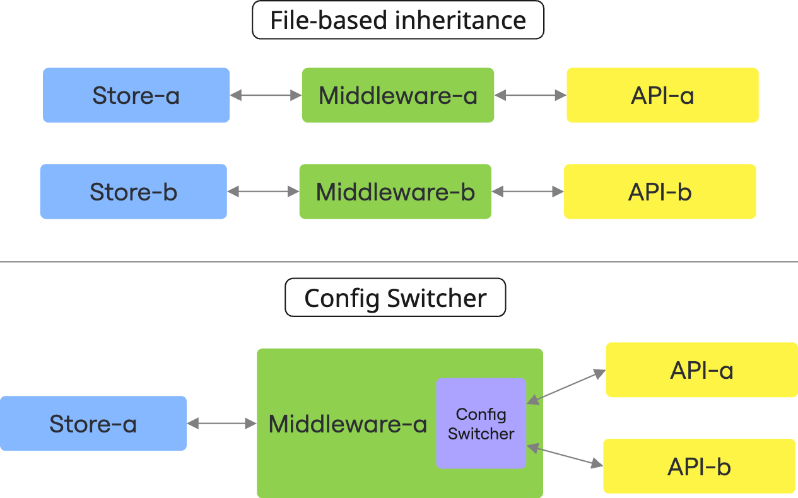

# How to Make Sub-path Routing


Sub-path routing allows you to serve different store configurations from the same Alokai deployment using URL paths. This approach is useful if the multibrand per-domain does not address your requirements.

::info
This guide focuses on implementing multi-store functionality through URL paths (like `/electronics`, `/apparel`). If domain-based separation is sufficient for your use case (like `electronics.example.com`, `apparel.example.com`), the [multibrand feature](https://docs.alokai.com/guides/multistore/tooling-and-concepts) is the preferred approach.
::

## Overview

Sub-path routing in Alokai uses the [Config Switcher extension](https://docs.alokai.com/middleware/guides/config-switcher) with the header strategy. This allows your Middleware to dynamically select the appropriate configuration based on which store the user is browsing.

For example, with this setup you could have:
- `/en/electronics` - Electronics store with its specific configuration
- `/en/apparel` - Apparel store with different products, styling, and configuration

All of this is served from a single Frontend deployment.

### How Config Switcher Works

The Config Switcher dynamically changes your middleware integration configuration based on the current request configuration ID sent with the `x-alokai-middleware-config-id` header. This means:

1. **Path-Based Configuration**
    - Different configuration ID set by different paths allow to fetch data from different sources
    - Example: `/apparel` path shows apparel products, while `/electronics` shows electronics products

2. **Configuration ID vs Store ID**
    - Each configuration has its own distinct ID
    - This is different from the store ID (`storeId`)
    - Multiple configurations can exist within a single store

3. **Same-Store Operation**
    - Config Switcher works within a single store instance
    - It extracts the configuration ID from the request
    - It executes requests using the appropriate configuration

::tip Config Switcher Documentation
This section provides a brief overview of setting up Config Switcher. For complete documentation, refer to the [Config Switcher guide](https://docs.alokai.com/middleware/guides/config-switcher).
::

### Key Distinctions To File-Based Inheritance

`ConfigSwitcher` operates differently from file-based inheritance:

| **File-Based Inheritance**                                           | **Config Switcher**                                          |
| -------------------------------------------------------------------- | ------------------------------------------------------------ |
| Creates separate deployable instances                                | Uses a single deployable instance                            |
| Provides inheritance mechanism to make managing multiple stores easy | You have to manage codebase reuse between stores on your own |
| Requires separate builds for each store                              | Single build supports multiple configurations                |

Take a look at the diagram to see the difference:



## Setting Up the Middleware

The first step is to configure your Middleware to support different configurations using the Config Switcher extension.

Create a Config Switcher extension for your integration:

```ts
// apps/storefront-middleware/integrations/<integration-name>/extensions/configSwitcher.ts
import { createConfigSwitcherExtension } from '@alokai/connect/config-switcher';
import type { MiddlewareConfig } from '@vsf-enterprise/<integration>-api';

export const configSwitcherExtension = createConfigSwitcherExtension<MiddlewareConfig>({
  // Config switcher options - specify only what's different for each store
  configuration: {
    apparel: {
      api: {
        baseSiteId: 'apparel-uk',
        catalogId: 'apparelProductCatalog',
      },
    },
    electronics: {
      api: {
        baseSiteId: 'electronics',
        catalogId: 'electronicsProductCatalog',
      },
    },
  },
});
```

Then add this extension to your integration configuration:

```ts
// apps/storefront-middleware/integrations/<integration-name>/config.ts
import { configSwitcherExtension } from './extensions/configSwitcher';

export const config = {
  configuration: {},
  extensions: (extensions: ApiClientExtension[]) => [
    ...extensions,
  ],
  location: '@vsf-enterprise/<integration-name>/server',
} satisfies Integration<Config>;
```

## Setting Up the Storefront

Now you need to configure your Storefront to send the appropriate config ID to the Middleware based on the current URL path.

::tabs{:titles='["Next.js", "Nuxt"]'}

#tab-1
In your Next.js SDK utils, implement the `getConfigSwitcherHeader` function:

```ts
// apps/storefront-unified-nextjs/sdk/modules/utils.ts
import { defineGetConfigSwitcherHeader } from '@vue-storefront/next';

export const defaultConfigId = 'apparel';
export const configIds = ['apparel', 'electronics'];

export const getConfigSwitcherHeader = defineGetConfigSwitcherHeader(
  ({ pathname }) => configIds.find((configId) => pathname.startsWith(`/${configId}`)) ?? defaultConfigId,
);
```

#tab-2
In your Nuxt SDK configuration, define a reusable `getConfigSwitcherHeader` function:

```ts
// apps/storefront-unified-nuxt/sdk-modules/utils.ts
export const defaultConfigId = 'apparel';
export const configIds = ['apparel', 'electronics'];

export const getConfigSwitcherHeader = defineGetConfigSwitcherHeader(
  ({ pathname }) => configIds.find((configId) => pathname.startsWith(`/${configId}`)) ?? defaultConfigId,
);
```
::

## Updating the Routing Strategy

To enable path-based routing, you need to restructure your application. Now URL path should include a dynamic `[configId]` parameter in the route. Usually you want to decide on one of two strategies:

- having `[configId]` as first parameter - for instance `/electronics/de/category`,
- having `[configId]` as second parameter - for instance `/de/electronics/category`,

where `electronics` is the `configId`.

### `[configId]` as First Path Parameter

This approach is not recommended, as it impacts the `i18n` packages and requires additional configuration changes to maintain proper internationalization. Consider using the second path parameter approach unless you have specific requirements that necessitate this structure.

::tabs{:titles='["Next.js", "Nuxt"]'}

#tab-1
For Next.js apps using the App Router, update your file structure:

```bash
apps/storefront-unified-nextjs/app/
├── [configId]/               # Store identifier parameter
│   ├── [locale]/             # Language parameter
│   │   ├── (default)/        # Routes for all stores
│   │   │   ├── page.tsx      # Home page
│   │   │   ├── cart/         # Cart pages
│   │   │   ├── checkout/     # Checkout pages
│   │   │   └── products/     # Product pages
│   │   ├── (electronics)/    # Electronics-specific routes
│   │   │   └── some-page/    # Page name
│   │   ├── (apparel)/        # Apparel-specific routes
│   │   │   └── another-page/ # Apparel-specific home
│   │   └── layout.tsx        # Apply store-specific class
│   ├── favicon.ico
```

You can do it by running

```bash
mkdir app/\[configId\]/
mv app/\[locale\] app/\[configId\]/
```

Then update import paths: in your IDE search for `@/app/[locale]` and replace it by `@/app/[configId]`.

Next update `middleware.ts` to support `configId` as a first parameter.

```ts
// ...remaining code

// Helper function to extract configId and clean pathname from URL
function getPathnamePartsWithoutConfigIdAndLocale(pathname: string): { cleanPathname: string; configId: string } {
  const segments = pathname.split('/').filter(Boolean);
  let configId: string = defaultConfigId;

  if (segments.length > 0) {
    const firstSegment = segments[0];
    const knownNonConfigSegments = [...locales, 'api', '_next', 'images', 'icons', 'favicon.ico'];

    if (!knownNonConfigSegments.includes(firstSegment) && configIds.includes(firstSegment)) {
      configId = firstSegment;
      segments.shift();
    }
  }

  // Remove locale segment if present
  if (segments.length > 0 && locales.includes(segments[0])) {
    segments.shift();
  }

  return {
    cleanPathname: `/${segments.join('/')}`,
    configId,
  };
}

export default createAlokaiMiddleware(async (request: NextRequest) => {
  const { hash, origin, pathname, search } = request.nextUrl;

  // 1. Initial redirect - Ensures users always start with a valid store configuration
  if (pathname === '/') {
    return NextResponse.redirect(new URL(`/${defaultConfigId}${search}${hash}`, origin));
  }
  const rootLocalePathRegex = new RegExp(`^\/(${locales.join('|')})\/?$`);
  const rootLocaleMatch = pathname.match(rootLocalePathRegex);
  if (rootLocaleMatch) {
    const detectedLocaleSegment = rootLocaleMatch[1];
    return NextResponse.redirect(
      new URL(`/${defaultConfigId}/${detectedLocaleSegment}${search}${hash}`.replace(/\/\/+/g, '/'), origin),
    );
  }

  // 2. Extract configId and clean pathname - Separates store and locale information from the URL
  const { cleanPathname, configId } = getPathnamePartsWithoutConfigIdAndLocale(pathname);
  const pathForI18nProcessing = cleanPathname;

  // 3. i18n preparation - Prepares the request for internationalization handling
  const i18nProcessedUrl = new URL(pathForI18nProcessing, origin);
  i18nProcessedUrl.search = search;
  i18nProcessedUrl.hash = hash;
  const requestForI18n = new NextRequest(i18nProcessedUrl.toString(), request);

  // 4. i18n processing - Handles language-specific routing logic
  let i18nResponse = i18nMiddleware(requestForI18n);
  const detectedLocaleForResponse =
    i18nResponse.headers.get('x-middleware-request-x-next-intl-locale') || defaultLocale;

  let finalPathname: string;
  let responseToProcess: NextResponse;

  if (i18nResponse.headers.has('location')) {
    // 5a. i18n redirect handling - Manages language-based redirects while preserving store context
    const i18nRedirectLocation = new URL(i18nResponse.headers.get('location')!, origin);
    finalPathname = i18nRedirectLocation.pathname;
    // Prepend configId if it was extracted
    if (configId) {
      finalPathname = `/${configId}${finalPathname}`.replace(/\/\/+/g, '/');
    }
    const finalRedirectUrl = new URL(finalPathname, origin);
    finalRedirectUrl.search = i18nRedirectLocation.search;
    finalRedirectUrl.hash = i18nRedirectLocation.hash;
    responseToProcess = NextResponse.redirect(finalRedirectUrl.toString(), i18nResponse.status);
  } else {
    // 5b. Standard request handling - Processes normal page requests
    finalPathname = pathForI18nProcessing;

    // Construct the full path for internal rewrite including configId and locale
    let rewritePath = `/${detectedLocaleForResponse}${finalPathname.startsWith('/' + detectedLocaleForResponse) ? finalPathname.substring(detectedLocaleForResponse.length + 1) : finalPathname}`;
    if (configId) {
      rewritePath = `/${configId}${rewritePath}`.replace(/\/\/+/g, '/');
    }
    rewritePath = rewritePath.replace(/\/\/+/g, '/');
    const internalRewriteUrl = new URL(rewritePath, origin);
    internalRewriteUrl.search = search;
    internalRewriteUrl.hash = hash;
    responseToProcess = NextResponse.rewrite(internalRewriteUrl, { headers: i18nResponse.headers });
  }

  // 6. Authentication handling - Ensures auth redirects maintain store and language context
  const authRedirectTarget = await getAuthRedirectPath(request, { locale: detectedLocaleForResponse });
  if (authRedirectTarget) {
    let finalAuthRedirectPath = `/${detectedLocaleForResponse}${authRedirectTarget}`.replace(/\/\/+/g, '/');
    if (configId) {
      // Ensure configId is part of auth redirects too
      finalAuthRedirectPath = `/${configId}${finalAuthRedirectPath}`.replace(/\/\/+/g, '/');
    }
    responseToProcess = NextResponse.redirect(new URL(finalAuthRedirectPath, request.nextUrl.origin));
  }

  // 7. Cache control - Applies appropriate caching headers to the response
  const defaultCacheControl = env('NEXT_DEFAULT_HTML_CACHE_CONTROL');
  responseToProcess = cacheControlMiddleware(request, responseToProcess, defaultCacheControl);

  return responseToProcess;
});
```

Then rename `apps/storefront-unified-nextjs/config/navigation.ts` -> `apps/storefront-unified-nextjs/config/navigation.tsx`

And update its content. We need to update implementation of the components exported from `next-intl/navigation` as we no longer use the `locale` as a first path parameter:

```tsx
'use client';

// eslint-disable-next-line no-restricted-imports
import NextLink from 'next/link';
import { useLocale } from 'next-intl';
import { createLocalizedPathnamesNavigation } from 'next-intl/navigation';
import type { Pathnames } from 'next-intl/routing';
import type { ComponentProps } from 'react';

import { defaultLocale, localePrefix, locales } from '@/i18n';
import { configIds, defaultConfigId, getConfigSwitcherHeader } from '@/sdk/modules/utils';

export const pathnames = {
  '/': '/',
  '/cart': '/cart',
  '/category': '/category',
  '/category/[[...slugs]]': '/category/[[...slugs]]',
  '/login': '/login',
  '/my-account': '/my-account',
  '/my-account/my-orders': '/my-account/my-orders',
  '/my-account/my-orders/[id]': '/my-account/my-orders/[id]',
  '/my-account/personal-data': '/my-account/personal-data',
  '/my-account/returns': '/my-account/returns',
  '/my-account/shipping-details': '/my-account/shipping-details',
  '/order/failed': '/order/failed',
  '/order/success': '/order/success',
  '/product/[slug]/[id]': '/product/[slug]/[id]',
  '/register': '/register',
  '/search': '/search',
} satisfies Pathnames<typeof locales>;

export const {
  Link: LocalizedLink,
  redirect: localizedRedirect,
  usePathname,
  useRouter: useLocalizedRouter,
} = createLocalizedPathnamesNavigation({
  localePrefix,
  locales,
  pathnames: pathnames as Record<{} & string, string> & typeof pathnames,
});

export type LinkHref = ComponentProps<typeof LocalizedLink>['href'];

// eslint-disable-next-line react/function-component-definition
export const Link: typeof LocalizedLink = (props) => {
  const { href, ...rest } = props;
  const locale = useLocale();
  const pathname = usePathname() as string;
  const configId = getConfigSwitcherHeader({ headers: {}, pathname, searchParams: {} });

  return <NextLink href={resolveHref(href, { configId: configId as string, locale })} {...rest} />;
};

interface ResolveHrefContext {
  configId: string;
  locale: string;
}

function resolveHref(href: LinkHref, context: ResolveHrefContext): string {
  let resolvedPathname: string;

  if (typeof href === 'string') {
    resolvedPathname = href;
  } else {
    const { params, pathname, query } = href as {
      params: Record<string, string>;
      pathname: string;
      query: Record<string, string>;
    };

    // Replace dynamic segments with actual values
    resolvedPathname = pathname
      .replace(/\[\[?\.{3}(\w+)\]?\]/g, (_, key) => {
        // Handle catch-all routes
        return Array.isArray(params[key]) ? params[key].join('/') : params[key] || '';
      })
      .replace(/\[(\w+)\]/g, (_, key) => {
        // Handle regular dynamic segments
        return params[key] || '';
      });

    // Add query parameters if they exist
    const queryString = Object.entries(query || {})
      .map(([key, value]) => `${key}=${value}`)
      .join('&');

    if (queryString) {
      resolvedPathname += `?${queryString}`;
    }
  }

  const configIdPart = context.configId === defaultConfigId ? '' : `/${context.configId}`;
  const localePart = context.locale === defaultLocale ? '' : `/${context.locale}`;

  return [configIdPart, localePart, getPathnameWithoutConfigIdAndLocale(resolvedPathname)].join('');
}

function getPathnameWithoutConfigIdAndLocale(pathname: string) {
  const resultSegments = pathname.split('/').filter(Boolean);
  if (configIds.includes(resultSegments[0])) {
    resultSegments.shift();
  }
  if (locales.includes(resultSegments[0])) {
    resultSegments.shift();
  }
  return `/${resultSegments.join('/')}`;
}

export const useRouter: typeof useLocalizedRouter = (...args) => {
  const router = useLocalizedRouter(...args);
  const pathname = usePathname() as string;
  const configId = getConfigSwitcherHeader({ headers: {}, pathname, searchParams: {} });

  return {
    ...router,
    push: (href, { locale, ...options } = {}) => {
      const resolvedHref = resolveHref(href, {
        configId: configId as string,
        locale: locale ?? defaultLocale,
      });
      router.push(resolvedHref, options);
    },
    replace: (href, { locale, ...options } = {}) => {
      const resolvedHref = resolveHref(href, {
        configId: configId as string,
        locale: locale ?? defaultLocale,
      });
      router.replace(resolvedHref, options);
    },
  };
};
```

#tab-2
First you need to create a `apps/storefront-unified-nuxt/app/router.options.ts` file to [modify generated routes](https://nuxt.com/docs/guide/recipes/custom-routing#router-options):

```ts
import type { RouterConfig } from '@nuxt/schema';
import type { RouteRecordRaw } from 'vue-router';

export default <RouterConfig>{
  routes: (_routes) => {
    const finalRoutes: RouteRecordRaw[] = [];
    _routes.forEach((route) => {
      finalRoutes.push(route);
      finalRoutes.push({
        ...route,
        name: `configId-${String(route.name)}`,
        path: `/:configId${route.path}`,
      });
    });

    return finalRoutes;
  },
};
```
Then you need to update the link component to support the `configId` parameter. Create a `apps/storefront-unified-nuxt/components/BaseLink/BaseLink.vue` file:

```vue
<template>
  <NuxtLink :to="localizedPath">
    <slot />
  </NuxtLink>
</template>

<script setup lang="ts">
import { useRoute } from '#app';
import { computed } from 'vue';
import { useI18n } from 'vue-i18n';
import { defaultConfigId } from '~/sdk-modules/utils';

const props = defineProps<{
  to: string;
  configId?: string;
}>();

const route = useRoute();
const i18n = useI18n();

const currentConfigId = computed(() => (route.params.configId as string) || defaultConfigId);

const localizedPath = computed(() => {
  const targetConfigId = props.configId || currentConfigId.value;
  const path = props.to.startsWith('/') ? props.to : `/${props.to}`;

  // If we're using default configId and default locale, return the path as is
  if (targetConfigId === defaultConfigId && i18n.locale.value === i18n.defaultLocale) {
    return path;
  }

  // If we're using default configId but non-default locale
  if (targetConfigId === defaultConfigId && i18n.locale.value !== i18n.defaultLocale) {
    return `/${i18n.locale.value}${path}`;
  }

  // If we're using non-default configId but default locale
  if (targetConfigId !== defaultConfigId && i18n.locale.value === i18n.defaultLocale) {
    return `/${targetConfigId}${path}`;
  }

  // If we're using both non-default configId and non-default locale
  return `/${targetConfigId}/${i18n.locale.value}${path}`;
});
</script>
```

To use a new link component. Search for all occurences of `NuxtLinkLocale` and replace it with `BaseLink`.

::

### `[configId]` as Second Path Parameter (Recommended)

::tabs{:titles='["Next.js", "Nuxt"]'}

#tab-1
For Next.js apps using the App Router, update your file structure:

```bash
apps/storefront-unified-nextjs/app/
├── [locale]/                 # Locale parameter
│   ├── [configId]/           # Store identifier parameter
│   │   ├── (default)/        # Routes for all stores
│   │   │   ├── page.tsx      # Home page
│   │   │   ├── cart/         # Cart pages
│   │   │   ├── checkout/     # Checkout pages
│   │   │   └── products/     # Product pages
│   │   ├── (electronics)/    # Electronics-specific routes
│   │   │   └── some-page/    # Page name
│   │   ├── (apparel)/        # Apparel-specific routes
│   │   │   └── another-page/ # Apparel-specific home
│   │   └── layout.tsx        # Apply store-specific class
│   ├── favicon.ico
```

#tab-2
For Nuxt apps, update your file structure:

```bash
apps/storefront-unified-nuxt/pages/
├── [configId]/              # Store identifier parameter
│   ├── index.vue            # Home page
│   ├── cart/                # Cart pages
│   │   └── index.vue
│   ├── checkout/            # Checkout pages
│   │   └── index.vue
│   ├── products/            # Product pages
│   │   ├── index.vue
│   │   └── [id].vue
│   ├── some-electronics-page.vue # Electronics-specific page
│   └── some-apparel-page.vue     # Apparel-specific page
```
::

This structure enables routes like:
- `/en/electronics` - Electronics store home
- `/en/apparel` - Apparel store home
- `/en/electronics/category` - PLP in the electronics store
- `/en/apparel/category` - PLP in the apparel store

### Updating Internal Links

::warning Update Internal Links
After setting up the path routing structure, you must update all internal links in your application to include the appropriate configId parameter. This is crucial to maintain proper navigation within each store and prevent users from accidentally switching between stores when clicking links.
::

Make sure that all your internal links and navigation components preserve the store context by including the current configId in the URLs. This applies to:

- Navigation menus
- Product links
- Category links
- Cart and checkout flows
- Footer links
- Breadcrumbs
- Any other internal navigation elements

Without this, users might unexpectedly switch between stores while browsing your site.

## Store-Specific Styling

There are two key steps to implement store-specific styling:

### 1. Applying Store Identifier Class

First, you need to apply the store identifier as a CSS class to enable different styles for each store. The class should be applied to an HTML element that is as high as possible in the document hierarchy (like `html`, `body`, or the root layout element). This is crucial because it allows us to style any nested elements using the store-specific variants.

::tabs{:titles='["Next.js", "Nuxt"]'}

#tab-1
In your Next.js layout, apply the configId as a class to the root layout element:

```tsx
// apps/storefront-unified-nextjs/app/[locale]/[configId]/layout.tsx
import { PropsWithChildren } from 'react';

interface LayoutProps extends PropsWithChildren {
  params: {
    configId: string;
  };
}

export default function Layout({ children, params: { configId } }: LayoutProps) {
  return (
    <div className={configId}>
      {children}
    </div>
  );
}
```

#tab-2
In your Nuxt app.vue, apply the configId as a class to the `Body` component:

```vue
// apps/storefront-unified-nuxt/app.vue
<template>
  <Body :class="['font-body', route.params.configId]" />
  <NuxtLayout>
    <NuxtPage />
  </NuxtLayout>
</template>

<script setup lang="ts">
const route = useRoute();
</script>
```
::

### 2. Defining Store-Specific CSS Variables

Once the store identifier class is applied, you can define CSS variables that change based on the store:

::tabs{:titles='["Next.js", "Nuxt"]'}

#tab-1
In your Next.js app, add custom CSS variables in your global styles:

```scss
// apps/storefront-unified-nextjs/app/[locale]/globals.scss
@tailwind base;
@tailwind components;
@tailwind utilities;

// Base styles...

// Electronics store theme
.electronics {
  --colors-primary-50: 45 249 255;
  --colors-primary-100: 233 243 255;
  --colors-primary-200: 200 224 255;
  --colors-primary-300: 166 204 255;
  --colors-primary-400: 110 161 255;
  --colors-primary-500: 51 117 255;
  --colors-primary-600: 46 106 230;
  --colors-primary-700: 38 78 191;
  --colors-primary-800: 29 63 153;
  --colors-primary-900: 176 196 244;
}

// Apparel store theme (different color scheme)
.apparel {
  --colors-primary-50: 243 254 249;
  --colors-primary-100: 224 247 235;
  --colors-primary-200: 187 235 210;
  --colors-primary-300: 135 216 177;
  --colors-primary-400: 77 192 140;
  --colors-primary-500: 45 165 116;
  --colors-primary-600: 34 134 95;
  --colors-primary-700: 31 110 80;
  --colors-primary-800: 30 86 65;
  --colors-primary-900: 23 64 49;
}
```

#tab-2
In your Nuxt app, add custom CSS variables in your `style.scss`:

```scss
// apps/storefront-unified-nuxt/assets/style.scss
@tailwind base;
@tailwind components;
@tailwind utilities;

// Base styles...

// Electronics store theme
.electronics {
  --colors-primary-50: 45 249 255;
  --colors-primary-100: 233 243 255;
  --colors-primary-200: 200 224 255;
  --colors-primary-300: 166 204 255;
  --colors-primary-400: 110 161 255;
  --colors-primary-500: 51 117 255;
  --colors-primary-600: 46 106 230;
  --colors-primary-700: 38 78 191;
  --colors-primary-800: 29 63 153;
  --colors-primary-900: 176 196 244;
}

// Apparel store theme (different color scheme)
.apparel {
  --colors-primary-50: 243 254 249;
  --colors-primary-100: 224 247 235;
  --colors-primary-200: 187 235 210;
  --colors-primary-300: 135 216 177;
  --colors-primary-400: 77 192 140;
  --colors-primary-500: 45 165 116;
  --colors-primary-600: 34 134 95;
  --colors-primary-700: 31 110 80;
  --colors-primary-800: 30 86 65;
  --colors-primary-900: 23 64 49;
}
```
::

### 3. Using Store-Specific Styles

Now you can use these variables in your components through Tailwind's configuration:

::tabs{:titles='["Next.js", "Nuxt"]'}

#tab-1
First, update your Tailwind config:

```ts
// packages-end-user/tailwind-config/src/nextjs.ts
import { tailwindConfig } from "@storefront-ui/react/tailwind-config";
import type { Config } from "tailwindcss";
import plugin from "tailwindcss/plugin";

const config: Config = {
  // ...
  plugins: [
    // ...
    plugin(({ addVariant }) => {
      // Add variant for electronics store
      addVariant("electronics", ".electronics &");
      // Add variant for apparel store
      addVariant("apparel", ".apparel &");
    }),
  ],
  // ...
};
export default config;
```

Then use these variants (`electronics:`, `apparel:`, etc.) in your components:

```tsx
// apps/storefront-unified-nextjs/components/ui/navbar-top.tsx
export default function NavbarTop({ children, className }: NavbarTopProps) {
  return (
    <header
      className={classNames(
        'sticky top-0 z-40 flex h-14 bg-primary-800',
        'electronics:!bg-primary-600',
        'apparel:!bg-primary-400',
        'md:-top-5 md:h-20 md:pt-2.5',
        className
      )}
    >
      {children}
    </header>
  );
}
```

#tab-2
First, update your Tailwind config:

```ts
// packages-end-user/tailwind-config/src/nuxt.ts
import type { Config } from "tailwindcss";
import plugin from "tailwindcss/plugin";

export default {
  // ...
  plugins: [
    // ...
    plugin(({ addVariant }) => {
      // Add variant for electronics store
      addVariant("electronics", ".electronics &");
      // Add variant for apparel store
      addVariant("apparel", ".apparel &");
    }),
  ],
  // ...
} as Config;
```

Then use these variants (`electronics:`, `apparel:`, etc.) in your components:

```vue
// apps/storefront-unified-nuxt/components/ui/NavbarTop.vue
<template>
  <header
    :class="[
      'sticky top-0 z-40 flex h-14',
      'bg-primary-800',
      'electronics:!bg-primary-600',
      'apparel:!bg-primary-400',
      'md:-top-5 md:h-20 md:pt-2.5',
    ]"
  >
    <slot />
  </header>
</template>
```
::

::tip Using CSS Variables with Tailwind
The CSS variables we defined can be used with Tailwind's color system. For example, `bg-primary-500` will use the store-specific primary color defined in the CSS variables. For more information, see the [Tailwind CSS documentation](https://v3.tailwindcss.com/docs/customizing-colors#using-css-variables).
::

::tip Understanding Generated CSS
When using store-specific variants like `electronics:!bg-primary-600`, Tailwind generates scoped CSS rules. For example:

```css
.electronics .electronics\:\!bg-primary-600 {
    --tw-bg-opacity: 1 !important;
    background-color: rgb(46 106 230 / 1 !important) !important;
}
```

This ensures the styles only apply when two conditions are met: the parent element must have the `.electronics` class and the target element must have the `electronics:!bg-primary-600` class.
::

## Conditional Components

There are two main approaches to handling store-specific components:

### Approach 1: Different Versions of the Same Component

This approach is useful when you need different variations of a component based on the store, such as announcement bars or featured sections with store-specific content.

::tabs{:titles='["Next.js", "Nuxt"]'}

#tab-1
```tsx
// apps/storefront-unified-nextjs/components/announcement-bar.tsx
import { ApparelAnnouncementBar } from '@/components/store-apparel/announcement-bar';
import { ElectronicsAnnouncementBar } from '@/components/store-electronics/announcement-bar';

interface AnnouncementBarProps {
  configId: string;
}

function AnnouncementBar({ configId }: AnnouncementBarProps) {
  const StoreComponent = {
    apparel: ApparelAnnouncementBar,
    electronics: ElectronicsAnnouncementBar,
  }[configId];

  return StoreComponent ? <StoreComponent /> : null;
}

// Usage in a page or layout:
export default function Layout({ children, params: { configId } }: LayoutProps) {
  return (
    <div className={configId}>
      <AnnouncementBar configId={configId} />
      {children}
    </div>
  );
}
```

#tab-2
```vue
<!-- apps/storefront-unified-nuxt/components/AnnouncementBar.vue -->
<template>
  <component :is="StoreComponent" v-if="StoreComponent" />
</template>

<script setup lang="ts">
const props = defineProps<{
  configId: string;
}>();

const AnnouncementBarElectronics = resolveComponent('StoreElectronicsAnnouncementBar');
const AnnouncementBarApparel = resolveComponent('StoreApparelAnnouncementBar');
const AnnouncementBar = computed(
  () =>
    ({
      electronics: AnnouncementBarElectronics,
      apparel: AnnouncementBarApparel,
    })[configId.value],
);
</script>

<!-- Usage in a page or layout: -->
<template>
  <div>
    <AnnouncementBar :config-id="configId" />
    <slot />
  </div>
</template>
```
::

### Approach 2: Conditional Rendering Based on Store

This approach is useful when certain components should only appear in specific stores, such as store-specific features or promotional sections.

::tabs{:titles='["Next.js", "Nuxt"]'}

#tab-1
```tsx
// apps/storefront-unified-nextjs/app/[locale]/[configId]/(default)/page.tsx
import { ElectronicsPromo } from '@/components/store-electronics/promo';
import { ApparelSeasonalBanner } from '@/components/store-apparel/seasonal-banner';

interface HomePageProps {
  params: {
    configId: string;
  };
}

export default function HomePage({ params: { configId } }: HomePageProps) {
  return (
    <div>
      <h1>Welcome to our store</h1>
      
      {/* Show component only for specific store */}
      {configId === 'electronics' && (
        <ElectronicsPromo />
      )}
      
      {/* Common content for all stores */}
      <div>
        {/* ... */}
      </div>
    </div>
  );
}
```

#tab-2
```vue
<!-- apps/storefront-unified-nuxt/pages/[configId]/index.vue -->
<template>
  <div>
    <h1>Welcome to our store</h1>
    
    <!-- Show component only for specific store -->
    <StoreElectronicsPromo v-if="configId === 'electronics'" />
    
    <!-- Common content for all stores -->
    <div>
      <!-- ... -->
    </div>
  </div>
</template>

<script setup lang="ts">
const route = useRoute();
const configId = computed(() => route.params.configId as string);
</script>
```
::

Choose the appropriate approach based on your needs:
::list{type="success"}
- Use Approach 1 (Different Versions) when components serve the same purpose but need store-specific implementations
- Use Approach 2 (Conditional Rendering) when components are unique to specific stores
- For components that are mostly the same but have minor differences, consider using props or slots instead of creating separate components
::

## Creating Store-Specific Pages

Some pages might only exist for specific stores. Here's how to implement this for each framework:

::tabs{:titles='["Next.js", "Nuxt"]'}

#tab-1
For Next.js, use route groups with the store name, and check the configId parameter:

```tsx
// apps/storefront-unified-nextjs/app/[locale]/[configId]/(electronics)/layout.tsx
import { notFound } from 'next/navigation';
import { PropsWithChildren } from 'react';

interface ElectronicsLayoutProps extends PropsWithChildren {
  params: {
    configId: string;
  };
}

export default function ElectronicsLayout({ children, params }: ElectronicsLayoutProps) {
  // Only render for electronics store
  if (params.configId !== 'electronics') {
    notFound();
  }

  return <div>{children}</div>;
}
```

This ensures that pages within the (electronics) [route group](https://nextjs.org/docs/app/building-your-application/routing/route-groups) are only accessible when the configId is `electronics`.

#tab-2
For Nuxt, use middleware in the store-specific page:

```vue
// apps/storefront-unified-nuxt/pages/[configId]/some-electronics-page.vue
<template>
  <div>
    <NuxtLayout name="default">
      <div>Hello from electronics page</div>
    </NuxtLayout>
  </div>
</template>

<script setup lang="ts">
definePageMeta({
  layout: false,
  middleware: (route) => {
    if (route.params.configId !== 'electronics') {
      return navigateTo('/');
    }
  },
});
</script>
```

This redirects users to the home page if they try to access the electronics-specific page from a different store.
::

## Summary

Sub-path routing in Alokai enables you to:

1. Serve multiple stores from a single codebase and deployment
2. Customize each store's appearance through CSS variables
3. Apply store-specific styles using Tailwind variants
4. Conditionally render components based on the store
5. Create store-specific pages

This approach is particularly useful when you need different store configurations that share the same core functionality but need to be accessed via different URL paths rather than domains.

::warning Consider Your Requirements
The path routing approach described in this guide deploys a single Frontend codebase that serves all stores. All files are shared between stores, which can be efficient but may increase complexity as you customize more aspects of each store. If path-based routing isn't a business requirement, consider using the [multibrand feature](https://docs.alokai.com/guides/multistore/tooling-and-concepts) instead, which provides more robust separation between stores.
::
