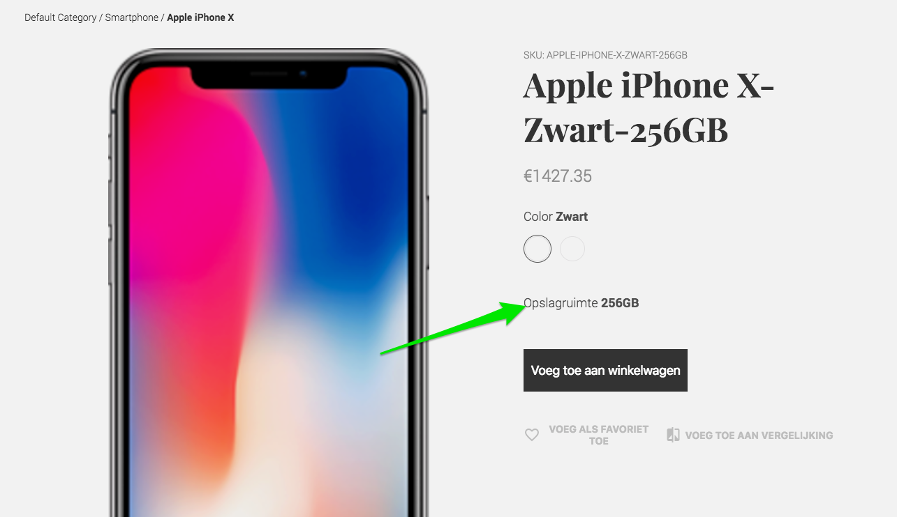

# FAQ and Recipes

Below, you can find solutions for the most common problems and advice for typical config changes required by Vue Storefront. If you solved any new issues by yourself, please let us know on [Slack](http://vuestorefront.slack.com) and we will add them to the list so others don't need to reinvent the wheel.

## Problem starting Docker while installing vue-storefront

In case you get the following error:

```
┌────────────────────────────────────────────────────────────────────────────┐
│ ERROR                                                                      │
│                                                                            │
│ Can't start Docker in background.                                          │
│                                                                            │
│ Please check log file for details: /tmp/vue-storefront/var/log/install.log │
└────────────────────────────────────────────────────────────────────────────┘
```

Please check:

- if there is `docker-compose` command available. If not, please install it;
- please check the output of running `docker-compose up -d` manually inside the `vue-storefront-api` instance. On some production environments, Docker is limited for superusers, in many cases it's just a matter of `/var/run/docker.sock` permissions to be changed (for example to 755)

## Product not displayed (illegal_argument_exception)

In a case of

```json
{
  "root_cause": [
    {
      "type": "illegal_argument_exception",
      "reason": "Fielddata is disabled on text fields by default. Set fielddata=true on [created_at] in order to load fielddata in memory by uninverting the inverted index. Note that this can however use significant memory. Alternatively use a keyword field instead."
    }
  ],
  "type": "search_phase_execution_exception",
  "reason": "all shards failed",
  "phase": "query",
  "grouped": true,
  "failed_shards": [
    {
      "shard": 0,
      "index": "vue_storefront_catalog_1521776807",
      "node": "xIOeZW2lTwaprGXh6YLyCA",
      "reason": {
        "type": "illegal_argument_exception",
        "reason": "Fielddata is disabled on text fields by default. Set fielddata=true on [created_at] in order to load fielddata in memory by uninverting the inverted index. Note that this can however use significant memory. Alternatively use a keyword field instead."
      }
    }
  ]
}
```

See the discussion in [#137](https://github.com/vuestorefront/vue-storefront/issues/137).
Please also check the [Database tool](https://github.com/vuestorefront/vue-storefront/blob/master/docs/guide/data/database-tool.md)

## HTTP 400 / CORS errors when trying to retrieve detailed product information from API

If all the other requests work without any issues then it's highly possible that your products have too many attributes. All of them are included in ElasticSearch query sent via GET request which might become too long. Try to limit amount of attributes that are indexed and later used for this product view.

This answer is valid until [this issue is resolved](https://github.com/vuestorefront/vue-storefront/issues/2167).

## What's the recommended way to use git on custom development

One of the options is to do kind of a fork, or just get the whole repo to your git service. Then, if you want to do some VS updates, you probably need to just pull the changes from our origins. Another option will be available as soon as we manage to separate the core as an npm module.

## How to add custom configurable attributes to the Product page

Where can we add filters and extra configurable options for the products? I've just added an iPhone X as an example, and I want to add the storage as an option.



To do so, you need to modify the theme, changing the following snippet:

```html
<div class="row top-xs m0 pt15 pb40 variants-wrapper">
  <div v-if="option.label == 'Color'">
    <color-button
      v-for="(c, i) in options.color"
      :key="i"
      :id="c.id"
      :label="c.label"
      context="product"
      code="color"
      :class="{ active: c.id == configuration.color.id }"
    />
  </div>
  <div class="sizes" v-if="option.label == 'Size'">
    <size-button
      v-for="(s, i) in options.size"
      :key="i"
      :id="s.id"
      :label="s.label"
      context="product"
      code="size"
      class="mr10 mb10"
      :class="{ active: s.id == configuration.size.id }"
      v-focus-clean
    />
  </div>
```

You must add UI controls for additional configurable attributes.

## Product name changed to SKU when adding to cart / on the product page

By default, when the user selects any specific product variant on the `Product.vue` page for `configurable` products, the title, picture, price, and other attributes are changed to corresponding `simple` one (within `product.configurable_children`).  If, in the Magento panel, the product names of the variants are set to SKU or anything else, the correct behavior is that the product name changes to it when variant is selected.

To correct this behavior you can:

- Modify the [core](https://github.com/vuestorefront/vue-storefront/blob/6a5a569a7e96703b865f841dabbe3c6a1020b3ab/core/store/modules/product/actions.js#L311) - to filter out the `name` attribute from `Object.assign`, which is responsible for copying the attributes from variant -> current product.

- Modify `mage2vuestorefront` importer to correct the `configurable_children` [product names](https://github.com/vuestorefront/mage2vuestorefront/blob/ca0c4723530b148cfdfb99784168af529e39d599/src/adapters/magento/product.js#L167).

- Use bound to the `EventBus.$emitFilter('product-after-single', { key: key, options: options, product: products[0] })` event and modify the `product.configurable_children` properties:

```js
  if (product.configurable_children) {
    for (let configurableChild of product.configurable_children) {
        configurableChild.name = product.name
      }
    }
  }
```

## How to get dynamic prices to work (catalog rules)

After following the Tutorial on [how to connect to Magento2](../installation/magento.md) the prices are updated just after manually running [mage2vuestorefront cli command](https://github.com/vuestorefront/mage2vuestorefront).

However, there is an option to get the prices dynamically. To do so you must change the config inside `conf/local.json` from the default (`conf/default.json`):

```json
  "products": {
    "preventConfigurableChildrenDirectAccess": true,
    "alwaysSyncPlatformPricesOver": false,
    "clearPricesBeforePlatformSync": false,
    "waitForPlatformSync": false,
    "endpoint": "http://localhost:8080/api/product"
  },
```

to:

```json
  "products": {
    "preventConfigurableChildrenDirectAccess": true,
    "alwaysSyncPlatformPricesOver": true,
    "clearPricesBeforePlatformSync": true,
    "waitForPlatformSync": false,
    "endpoint": "http://localhost:8080/api/product"
  },
```

To make it work, you need have Magento 2 Oauth keys configured in your `vue-storefront-api` - `conf/local.json`.
his change means that each time the product list will be displayed, VS will get fresh prices directly from Magento without the need to re-index Elasticsearch.

## No products found! after node --harmony cli.js fullreindex

Take a look at the discussion at [#644](https://github.com/vuestorefront/vue-storefront/issues/644)
Long story short, you need to run the following command within the `mage2nosql` project:

```bash
node cli.js products --partitions=1
```

## How to sync the products cart with Magento to get the Cart Promo Rules up and running

To display the proper prices and totals after Magento calculates all the discounts and taxes, you need to modify the `conf/local.json` config (for reference, take a look at `conf/default.json`) by putting there an additional section:

```json
  "cart": {
    "synchronize": true,
    "synchronize_totals": true,
    "create_endpoint": "http://localhost:8080/api/cart/create?token={{token}}",
    "updateitem_endpoint": "http://localhost:8080/api/cart/update?token={{token}}&cartId={{cartId}}",
    "deleteitem_endpoint": "http://localhost:8080/api/cart/delete?token={{token}}&cartId={{cartId}}",
    "pull_endpoint": "http://localhost:8080/api/cart/pull?token={{token}}&cartId={{cartId}}",
    "totals_endpoint": "http://localhost:8080/api/cart/totals?token={{token}}&cartId={{cartId}}"
  },
```

To make it work, you need have Magento 2 OAuth keys configured in your `vue-storefront-api` - `conf/local.json`.

After this change, you need to restart the `yarn dev` command to take the config changes into consideration by the VS. All the cart actions (add to cart, remove from cart, modify the quantity) are now synchronized directly with Magento 2 for both guest and logged-in clients.


## How to integrate 3rd party platform? Do you think it could be used with a legacy bespoke PHP eCommerce?

Yes, I believe it could. You should expose the API accordingly to our [spec](../extensions/extending-api.md) and the second step is to [create a data bridge](https://medium.com/@piotrkarwatka/how-to-connect-3rd-party-platform-to-vue-storefront-df9cb30779f6) to fill out the ElasticSearch with the current catalog data.

## Is there any documentation on integrating payment gateways?

We're working on kind of a boilerplate for payment modules. Right now, please just take a look at a [live example](https://github.com/develodesign/vue-storefront-stripe) and try to follow the design patterns from there. The task where boilerplate and docs will show up is [https://github.com/vuestorefront/vue-storefront/issues/923](https://github.com/vuestorefront/vue-storefront/issues/923).

## Is there any internationalization support?

Yes, we already have seven languages supported by default (EN, FR, ES, RU, JP, NL, DE) and the [documentation for translations](../core-themes/translations.md).

The currency is set in the `local.json` configuration file and it's (along with the language) set per instance, so if you have a few languages and countries supported, you need to run (as for now) a few separate instances.

## If 10k products are on the site, will it create a high bandwidth download when you navigate the site for the first time on a mobile device?

Not necessarily. Vue Storefront is caching products from the categories browsed. This is the default solution, which can be changed by modifying `core/store/lib/search.js`

## How to add/remove/change field types in the Elasticsearch schema

It's done via Database Tool schema changes. Please follow the instructions from the [Database Tool Manual](../data/database-tool.md#chaning-the-index-structure--adding-new-fields--chaning-the-types).

## How to integrate 3rd party Magento extensions

Unfortunately, Magento extensions are not compliant with any PWA available solution yet. So if you would like to integrate some existing extensions, the simplest way is to:

- Expose the data via some Magento 2 REST API endpoints.
- Consume the endpoints in the VS using Vuex stores; [read more](../vuex/introduction.md) about Vuex in Vue Storefront.
- Implement the UI in VS.

If the extensions are not playing with the User Interface, they will likely work with VS out of the box, as we're using the standard Magento 2 API calls for the integration part.

## How to support Multistore / Multi website setup

Please check the [Multistore setup](../integrations/multistore.md) guide for details

## How to deal with Category filters based on configurable_children

If you would like to have a Category filter working with configurable products, you need to expand the `product.configurable_children.attrName` to `product.attrName_options` array. This is automatically done by [mage2vuestorefront](https://github.com/vuestorefront/mage2vuestorefront) for all attributes set as `product.configurable_options` (by default: color, size). If you want to add additional fields like `manufacturer` to the filters, you need to expand `product.manufacturer_options` field. The easiest way to do so is to set `config.product.expandConfigurableFilters` to `['manufacturer']` and re-run the `mage2vuestorefront` indexer.

## How to redirect original Magento2 URLs to Vue Storefront

There is an SEO redirects generator for NGINX -> `https://serverfault.com/a/441517` available within the [vue-storefront-api](https://github.com/vuestorefront/vue-storefront-api/commit/2c7e10b4c4294f222f7a1aae96627d6a0e23f30e). Now you can generate an SEO map redirecting users from the original Magento URLs to Vue Storefront URLs by running:

```bash
yarn seo redirects — —oldFormat=true | false
```

Please make sure that `vue-storefront/config/local.json` setting of `useMagentoUrlKeys` is set to `true` and you have ElasticSearch synchronized with the Magento2 instance using the current version of [mage2vuestorefront](https://github.com/vuestorefront/mage2vuestorefront).

**Please note:** As `url_key` field must be unique across categories collection. Therefore, we're by default generating its value based on name and category ID. Please [switch this option off](https://github.com/vuestorefront/mage2vuestorefront/#initial-vue-storefront-import) if you'd like to keep the `url_key` as they come from Magento2.

## You need to choose options for your item message when hit API for add to cart a configurable product

This is because the demo data dump works on the `demo-magento2.vuestorefront.io` instance attribute ids. Please re-import all product data using [mage2vuestorefront](https://github.com/vuestorefront/mage2vuestorefront)

## Adding custom category filters

You need to add the attributes you want to have displayed to the `config/local.json` field name is: `products.defaultFilters`:

```json
"defaultFilters": ["color", "size", "price", "erin_recommends"],
```

And then you can use proper controls for each individual filter [here](https://github.com/vuestorefront/vue-storefront/blob/49dc8a2dc9326e9e83d663cc27f8bb0688525f13/src/themes/default/components/core/blocks/Category/Sidebar.vue).

## Collecting all VSF i18n phrases into a CSV

It might be very time-consuming to translate the whole project into a foreign language. A good start is to properly collect all i18n phrases into a CSV file. The following line of bash code would get the job done (a pipe-separated CSV file named i18n.csv would be created, adjust accordingly to your needs).

Execute the following line on your project's root folder:

```grep --include \*.js --include \*.vue -nrw  ./ -e 'i18n.t(' -e '$t(' -h | grep -o -P "(?<=t\(\').*(?=\'\))" | awk -F"'" -v OFS='|' '{ print $1,$1 }' > i18n.csv```

The code basically looks into all project files for all ```i18n.t('some string')``` and ```$t('some string') ``` occurrences, parses and extracts the quoted text of each occurrence, and saves it into a pipe-separated CSV file, which might help you get your missing translations.

## Running vue-storefront-api on a different machine than magento / images not working
When you separate vue-storefront-api and magento2 by putting them on different servers, it is necessary to link the vue-storefront-api machine with magento media folder via network folder. `sshsfs` is suggested for this.
Once the network connection is established, the correct folder needs to be pointed in the vue-storefront-api config
```
"assetPath": "/../var/magento2-sample-data/pub/media", 
```
It is necessary for the correct product image creation by the vue-storefront-api. If this is not set corectly, images will just be placeholders regardless the fact the rest of the setup works and you can see products and categories correctly synced.

## Syncing magento and vue-storefront-api servers / Fix for "An error occurred validating the nonce"
There might be an issue with JWT token validation if one of the servers is more than 600 seconds behind the other. The 600 seconds limit is defined on Magento side by its `\Magento\Integration\Model\Oauth\Nonce\Generator::TIME_DEVIATION`. To fix this issue you need to make sure both severs `date` command show the same datetime  (or both at least below 10 minute difference). This can be done by utilizing `tzdata` package (sudo dpkg-reconfigure tzdata) or setting it directly with `date` package (e.g: `sudo date --set "23 Mar 2019 12:00:00"`, but providing the current datetime).
