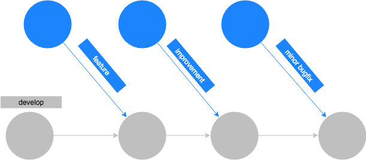
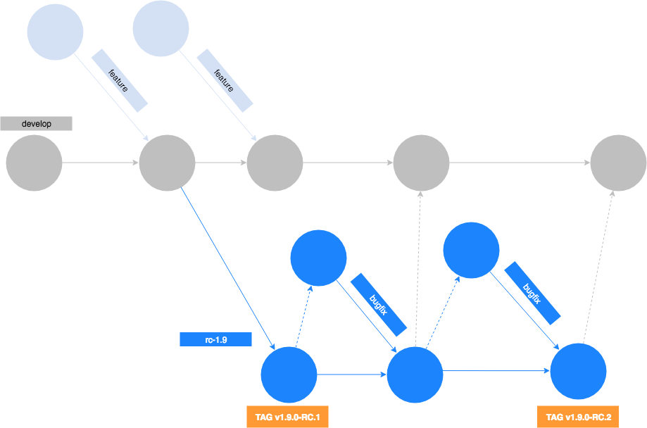
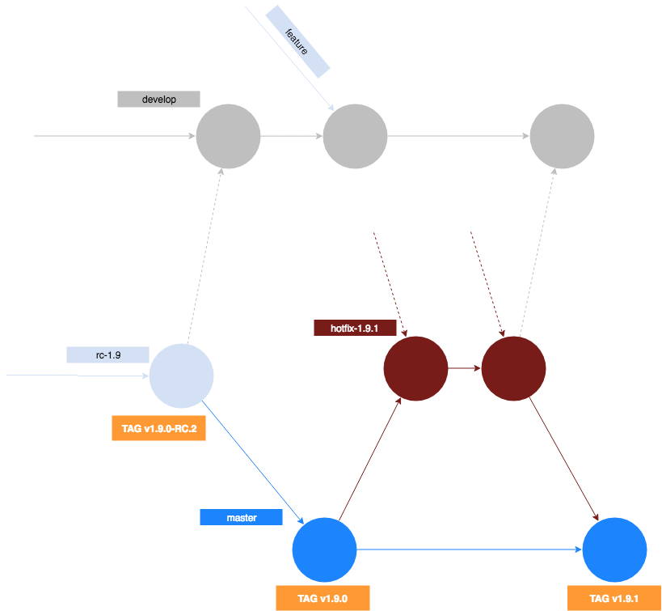

# Release Cycle

This document describes how Vue Storefront code versions are released. You'll learn what the release process looks like, the acceptance criteria, what our git flow looks like, and which branch to use as a stable one.

## How Vue Storefront versions are released

From version 1.9, we release each of the VSF versions in two phases:
- **Release Candidate phase (RC)**, also called "feature version." This version contains all the new features, improvements, and additions to the API, along with minor bug fixes. New features and additions are merged and released only during this phase. The API of features introduced during this phase may slightly change.
- **Stabilization phase**  is the one that ends up with a production-ready version. During this phase, we only do stabilization and bug fixing for previously introduced features. No new features and API additions are merged. PRs from the RC version are tested and their API is simplified and/or adjusted according to feedback.

Assuming the next version is 1.x, the two-month cycle will look like the following:
- v1.x-RC.y—unstable version with cutting-edge features ready to test and feedback.
- v1.x.y—stable version of the software **ready for production use**.

## How new features are merged

During the RC phase, features Pull Request with new features after feedback and acceptance are normally merged to the `develop` branch. 
After entering the stabilization phase, we are tagging the current develop branch, creating a `release/x` (where `x` is the number of the current version) branch from it and working on stabilization there. During the stabilization phase, new features are merged to develop branch and will be merged in the next `RC` phase.

## Release cycle flow

### 1. Development phase

In the first phase of the cycle, we're mostly focusing on features and improvements. Branches in this phase should be created from the actual `develop`, also PRs should be pointed to this branch. Changes merged to `develop` are available to test on https://test.storefrontcloud.io

### 2. Release Candidate phase

At some point, when milestone for next minor versions is completed, we're creating new branch from `develop` called `release/vx.y` (example: `release/v1.9`).
After that new branch is tagged as first RC for version (example `v1.10.0-rc.1`). Then it's ready for testing by community.
During tests, feedback and stabilization there could be multiple Release Candidate versions on this branch. When improvement is made on this phase, then branch should be created from actual `release/vx.y` and should not contain features at this point - only improvements for current release.
After merging a set of bugfixes and improvements into `release/*` branch, it needs to be tagged as the next RC version and merged into the `develop` branch, to update it.

### 3. Release phase

When RC version is stable, then release branch is merged into `master` and tagged as next stable version (example `v1.9.0`).  After that, the currently merged release branch is deleted and starts a new development phase. If some critical bug is discovered on the current stable version, then a new hotfix (for example `hotfix/v1.9.1`, following [Semantic Versioning rules](https://semver.org/)) branch should be created from actual `master`. After merging and testing hotfixes, this branch (like release branch before) is merged into `master` and tagged following [Semantic Versioning rules](https://semver.org/).

### Summary

An important thing to note is that this releasing cycle ensures stable and reliable Storefront releases. Phases are also not blocking new features—you can develop new features on any phase, but it should be merged only to the `develop` branch and go through whole cycle.
