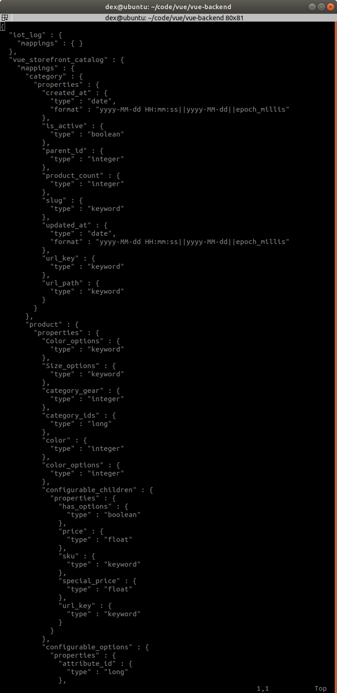
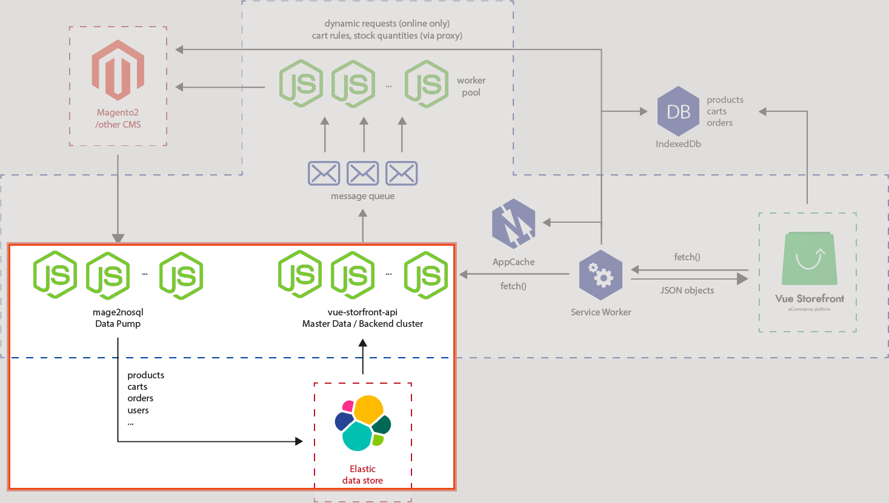
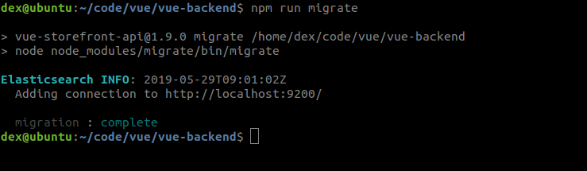
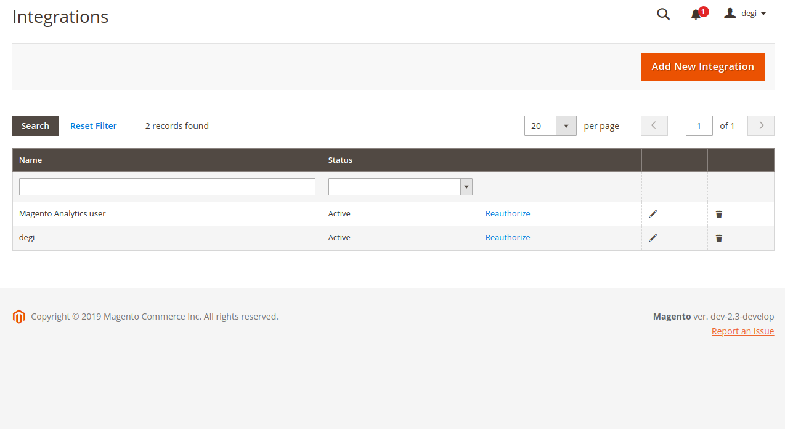
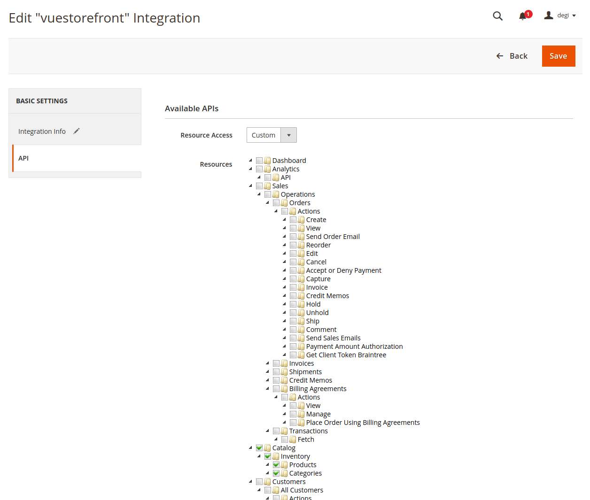
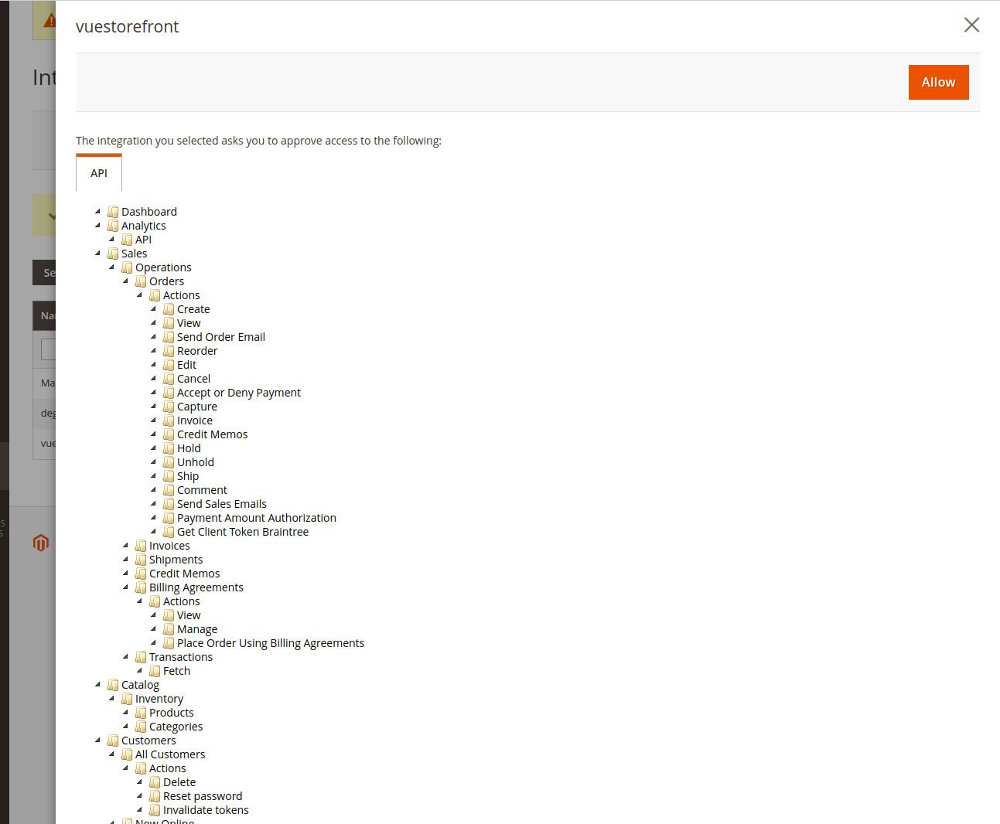
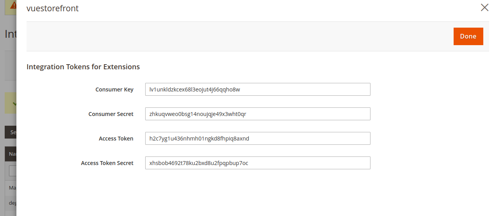
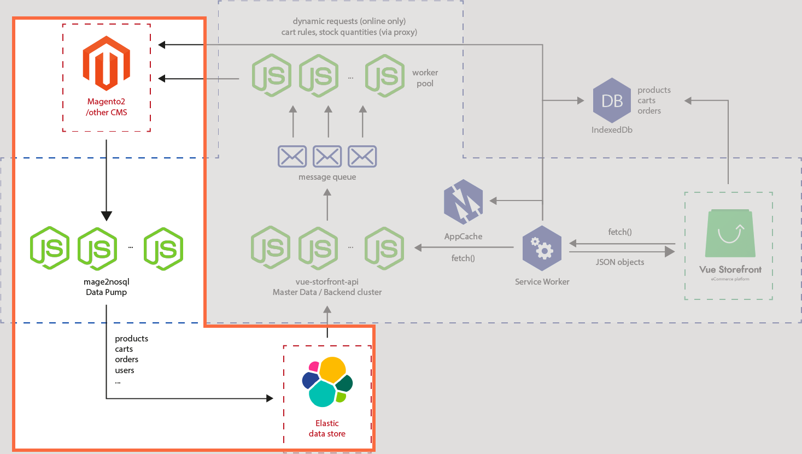
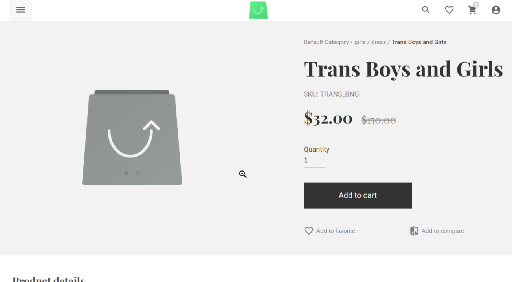
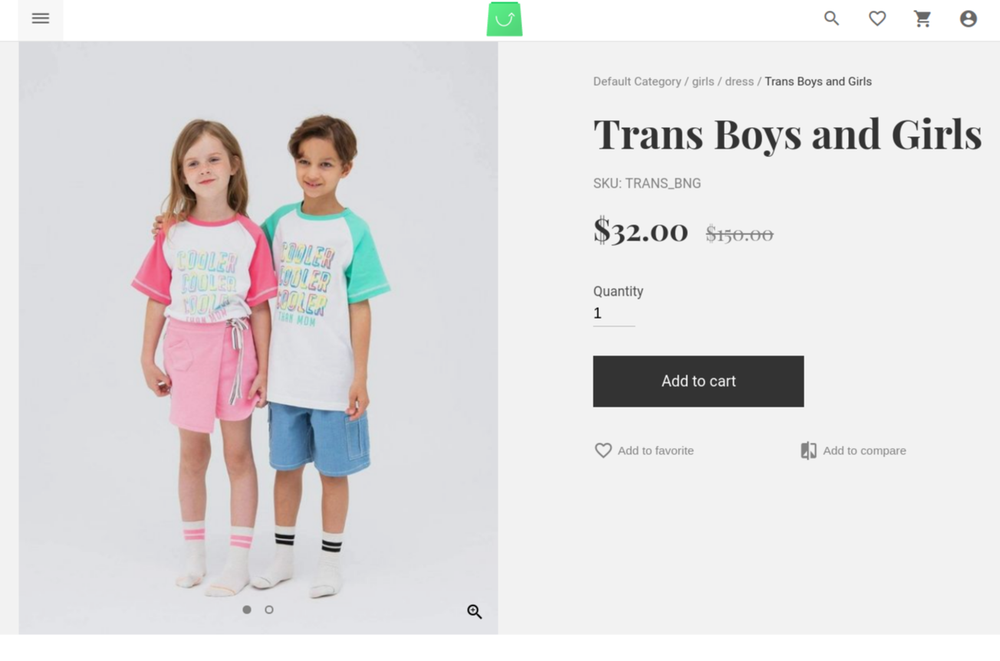

# Ch 1. Data Imports 

In this chapter, we will cover : 
[[toc]]

## 0. Introduction
When you decide to migrate your web store to Vue Storefront, the first thing you need to do is filling the store (Elasticsearch) with data. This chapter deals with all the hassles related to data migration for Vue Storefront. 
<br />
<br />

## 1. Data Mapping Migration for Elasticsearch

Vue Storefront uses Elasticsearch as a primary data store. Additionally Vue Storefront uses Redis for a cache layer and Kue for queue processing. 
Although all these data stores are basically schema-free, some mappings and meta data should be imported for setting Elasticsearch indices and so forth. 

Vue Storefront uses a data-migration mechanism based on [node-migrate](https://github.com/tj/node-migrate). 

### 1. Preparation
- You need a [Vue Storefront API](https://github.com/DivanteLtd/vue-storefront-api) instance [installed](setup.html#_1-install-with-docker) on your machine to run the migration. <br />
- You need an Elasticsearch instance  [running](setup.html#_1-install-with-docker) into which the data will be migrated.

### 2. Recipe
1. Run a node script from **Vue Storefront API root path** which is configured out of the box.
```bash
yarn migrate
```
which runs the migrations in `migrations` folder. 

2. Successful result as follows : 
```bash
> vue-storefront-api@1.9.0 migrate /home/dex/code/vue/vue-backend
> node node_modules/migrate/bin/migrate

Elasticsearch INFO: 2019-05-29T09:41:04Z
  Adding connection to http://localhost:9200/

  up : 1513602693128-create_new_index.js
Elasticsearch DEBUG: 2019-05-29T09:41:04Z
  starting request {
    "method": "DELETE",
    "path": "/*/_alias/vue_storefront_catalog",
    "query": {}
  }
  

Elasticsearch DEBUG: 2019-05-29T09:41:04Z
  Request complete

Public index alias does not exists [aliases_not_found_exception] aliases [vue_storefront_catalog] missing, with { resource.type="aliases" & resource.id="vue_storefront_catalog" }
Elasticsearch DEBUG: 2019-05-29T09:41:04Z
  starting request {
    "method": "DELETE",
    "path": "/vue_storefront_catalog",
    "query": {}
  }
  
  ... # abridged 

Elasticsearch DEBUG: 2019-05-29T09:41:08Z
  Request complete

{ acknowledged: true }
  up : 1530101328854-local_es_config_fix.js
Searching for deprecated parameters in file '/home/dex/code/vue/vue-backend/config/custom-environment-variables.json'...
File '/home/dex/code/vue/vue-backend/config/custom-environment-variables.json' updated.
Searching for deprecated parameters in file '/home/dex/code/vue/vue-backend/config/local.json'...
File '/home/dex/code/vue/vue-backend/config/local.json' updated.

  migration : complete
  
```
:vhs: You may also watch it in [bash playback :movie_camera:](https://asciinema.org/a/C9z7daIJAog0xPhNlzwoHhBl4)

3. In order to verify whether mapping is successfully done or not, you may send a `curl` request against Elasticsearch API as follows : 
```bash
curl -XGET 'http://localhost:9200/_mapping?pretty=true'
``` 
:::tip Note
Please replace `http://localhost:9200` with your Elasticsearch endpoint if you configured it manually.
:::
4. Result will be as follows if it was successfully imported (abridged) : 

<!---->
```bash
{
  "vue_storefront_catalog" : {
    "mappings" : {
      "category" : {
        "properties" : {
          "created_at" : {
            "type" : "date",
            "format" : "yyyy-MM-dd HH:mm:ss||yyyy-MM-dd||epoch_millis"
          },
          "is_active" : {
            "type" : "boolean"
          },
          "parent_id" : {
            "type" : "integer"
          },
          "product_count" : {
            "type" : "integer"
          },
          "slug" : {
            "type" : "keyword"
          },
          "updated_at" : {
            "type" : "date",
            "format" : "yyyy-MM-dd HH:mm:ss||yyyy-MM-dd||epoch_millis"
          },
          "url_key" : {
            "type" : "keyword"
          },
          "url_path" : {
            "type" : "keyword"
          }
        }
      },
      "product" : {
        "properties" : {
          "Color_options" : {
            "type" : "keyword"
          },
          "Size_options" : {
            "type" : "keyword"
          },
          "category_gear" : {
            "type" : "integer"
          },
          "category_ids" : {
            "type" : "long"
          },
          "color" : {
            "type" : "integer"
          },
          "color_options" : {
            "type" : "integer"
          },
          "configurable_children" : {
            "properties" : {
              "has_options" : {
                "type" : "boolean"
              },
              "price" : {
                "type" : "float"
              },
              "sku" : {
                "type" : "keyword"
              },
              "special_price" : {
                "type" : "float"
              },
              "url_key" : {
                "type" : "keyword"
              }
            }
          },
          "configurable_options" : {
            "properties" : {
              "attribute_id" : {
                "type" : "long"
              },
              "default_label" : {
                "type" : "text"
              },
              "frontend_label" : {
                "type" : "text"
              },
              "label" : {
                "type" : "text"
              },
              "store_label" : {
                "type" : "text"
              },
              "values" : {
                "properties" : {
                  "default_label" : {
                    "type" : "text"
                  },
                  "frontend_label" : {
                    "type" : "text"
                  },
                  "label" : {
                    "type" : "text"
                  },
                  "store_label" : {
                    "type" : "text"
                  },
                  "value_index" : {
                    "type" : "keyword"
                  }
                }
              }
            }
          },
          "created_at" : {
            "type" : "date",
            "format" : "yyyy-MM-dd HH:mm:ss||yyyy-MM-dd||epoch_millis"
          },
          "description" : {
            "type" : "text"
          },
          "eco_collection" : {
            "type" : "integer"
          },
          "eco_collection_options" : {
            "type" : "integer"
          },
          "erin_recommends" : {
            "type" : "integer"
          },
          "gender" : {
            "type" : "integer"
          },
          "has_options" : {
            "type" : "integer"
          },
          "id" : {
            "type" : "long"
          },
          "material" : {
            "type" : "integer"
          },
          "name" : {
            "type" : "text"
          },
          "news_from_date" : {
            "type" : "date",
            "format" : "yyyy-MM-dd HH:mm:ss||yyyy-MM-dd||epoch_millis"
          },
          "news_to_date" : {
            "type" : "date",
            "format" : "yyyy-MM-dd HH:mm:ss||yyyy-MM-dd||epoch_millis"
          },
          "pattern" : {
            "type" : "text"
          },
          "position" : {
            "type" : "integer"
          },
          "price" : {
            "type" : "float"
          },
          "required_options" : {
            "type" : "integer"
          },
          "size" : {
            "type" : "integer"
          },
          "size_options" : {
            "type" : "integer"
          },
          "sku" : {
            "type" : "keyword"
          },
          "slug" : {
            "type" : "keyword"
          },
          "special_from_date" : {
            "type" : "date",
            "format" : "yyyy-MM-dd HH:mm:ss||yyyy-MM-dd||epoch_millis"
          },
          "special_price" : {
            "type" : "float"
          },
          "special_to_date" : {
            "type" : "date",
            "format" : "yyyy-MM-dd HH:mm:ss||yyyy-MM-dd||epoch_millis"
          },
          "status" : {
            "type" : "integer"
          },
          "tax_class_id" : {
            "type" : "integer"
          },
          "updated_at" : {
            "type" : "date",
            "format" : "yyyy-MM-dd HH:mm:ss||yyyy-MM-dd||epoch_millis"
          },
          "url_key" : {
            "type" : "keyword"
          },
          "url_path" : {
            "type" : "keyword"
          },
          "visibility" : {
            "type" : "integer"
          },
          "weight" : {
            "type" : "integer"
          }
        }
      },
      "cms_block" : {
        "properties" : {
          "creation_time" : {
            "type" : "date",
            "format" : "yyyy-MM-dd HH:mm:ss||yyyy-MM-dd||epoch_millis"
          },
          "id" : {
            "type" : "long"
          },
          "identifier" : {
            "type" : "keyword"
          },
          "update_time" : {
            "type" : "date",
            "format" : "yyyy-MM-dd HH:mm:ss||yyyy-MM-dd||epoch_millis"
          }
        }
      },
      "attribute" : {
        "properties" : {
          "attribute_id" : {
            "type" : "long"
          },
          "id" : {
            "type" : "long"
          },
          "options" : {
            "properties" : {
              "value" : {
                "type" : "text"
              }
            }
          }
        }
      },
      "taxrule" : {
        "properties" : {
          "id" : {
            "type" : "long"
          },
          "rates" : {
            "properties" : {
              "rate" : {
                "type" : "float"
              }
            }
          }
        }
      },
      "cms_page" : {
        "properties" : {
          "creation_time" : {
            "type" : "date",
            "format" : "yyyy-MM-dd HH:mm:ss||yyyy-MM-dd||epoch_millis"
          },
          "id" : {
            "type" : "long"
          },
          "identifier" : {
            "type" : "keyword"
          },
          "update_time" : {
            "type" : "date",
            "format" : "yyyy-MM-dd HH:mm:ss||yyyy-MM-dd||epoch_millis"
          }
        }
      }
    }
  }
}

```


### 3. Peep into the kitchen (what happens internally) 

We worked in the red rectangle part of the architecture as a preparation for data import. 

What we did in a simple term, we taught Elasticsearch types and sorts of data(mapping, also known as schema) we will use for Vue Storefront API later on. 

Upon running `yarn migrate`, it runs the pre-configured [migration scripts](https://github.com/DivanteLtd/vue-storefront-api/tree/master/migrations) using [node-migrate](https://github.com/tj/node-migrate). If you take a closer look into the migration scripts, you will notice the ultimate js file which is located at [`./src/lib/elastic.js`](https://github.com/DivanteLtd/vue-storefront-api/blob/master/src/lib/elastic.js) that does the actual labor for migration.
 If you take one more closer look in the `elastic.js` file, you will also find all the schema files are located under [`./config`](https://github.com/DivanteLtd/vue-storefront-api/tree/master/config) folder.
 What those scripts do can be divided into steps as per the file name.
 It first creates index from index schema, then import schema from `elastic.schema.[types].json` files. It will then reindex them, and delete temporary index. Finally it will work a few workarounds to deal with deprecated process. 

  Now, you are all set to proceed to pump your data into the store. 
  
### 4. Chef's secret (protip)
#### Secret 1. Deal with `index not found exception` 
If you encountered with the exception as follows during the migration script :


It means you don't have the temporary index `vue_storefront_catalog_temp` which is required. 
Solution is :
```bash
yarn restore
```
This will create the necessary temporary index, then the necessary temp index will be deleted by the steps mentioned [above](#_3-peep-into-the-kitchen-what-happens-internally) when the migration is finished

#### Secret 2. Add a new migration script
You might need to write your own migration script. In that case, you can do so by adding a file under the `./migrations` directory though this is not a recommended way. `node-migrate` provides you with the cli command for the purpose as follows : 
```bash
yarn migrate create name-of-migration
``` 
This wil create a migration script template under `./migration` folder with the standard naming convention.
 [more info](https://github.com/tj/node-migrate#creating-migrations)

:::tip Example
The example migration shows how to manipulate product mappings as follows : 
:::
```js
// Migration scripts use: https://github.com/tj/node-migrate
'use strict';

let config = require('config');
let common = require('./.common');

module.exports.up = function(next) {
  // example of adding a field to the schema
  // other examples: https://stackoverflow.com/questions/22325708/elasticsearch-create-index-with-mappings-using-javascript,
  common.db.indices
    .putMapping({
      index: config.elasticsearch.indices[0],
      type: 'product',
      body: {
        properties: {
          slug: { type: 'string' }, // add slug field
          suggest: {
            type: 'completion',
            analyzer: 'simple',
            search_analyzer: 'simple',
          },
        },
      },
    })
    .then(res => {
      console.dir(res, { depth: null, colors: true });
      next();
    });
};

module.exports.down = function(next) {
  next();
};
```

#### Secret 3. Execute migration multiple times
If you run a migration multiple times using `yarn migrate`, it will only run the migration once and subsequent execution will be ignored and only repeat the result as follows :



This happens because `node-migrate` knows it was already executed before by checking with `./migrate` file so that you won't need it repeating. Should you, however, need to run it more than once, you can do it by deleting `./migrate` file. 

<br />
<br />
<br />


## 2. Data Pump
A retail business can't start without stocking products in the shop in the first place. Likewise, starting an online shop business requires products in stock online (data store) too. 

Starting Vue Storefront is not an exception. We need to pump your data (products, categories, tax rules and so on) into the primary data store for Vue Storefront which is Elasticsearch. We also use Redis cache in between for enhancing performance.  

By using Elasticsearch as a data store in the architecture, we could make the platform backend-agnostic along with many other advantages such as performance and scalability.  

In this recipe we will walk you with **Magento 2** example. 

### 1. Preparation
- You need a [Vue Storefront API](https://github.com/DivanteLtd/vue-storefront-api) instance [installed](setup.html#_1-install-with-docker) for backend.
<br />
- You need an Elasticsearch instance [running](setup.html#_1-install-with-docker) with mapping is done as in [*Recipe 1 Data Mapping Migration for Elasticsearch*](#_1-data-mapping-migration-for-elasticsearch)
<br />
- You need [mage2vuestorefront](https://github.com/DivanteLtd/mage2vuestorefront) downloaded for data bridge. This instance is backend-dependant (in this case, Magento 2), you may replace it with other data bridges such as [coreshop-vsbridge](https://github.com/DivanteLtd/coreshop-vsbridge), [shopware2vuestorefront](https://github.com/DivanteLtd/shopware2vuestorefront) to your advantage. 
<br />
- Finally, you need a Magento 2 instance as a data source to pump your data from. (For [Recipe B](#_2-2-recipe-b-using-on-premise) only)

We are going to import entities as follows : 
- Products
- Categories
- Taxrules
- Attributes
- Product-to-categories
- Reviews (require custom module [Divante/ReviewApi](https://github.com/DivanteLtd/magento2-review-api))
- Cms Blocks & Pages (require custom module [SnowdogApps/magento2-cms-api](https://github.com/SnowdogApps/magento2-cms-api))

### 2-1. Recipe A (Using Demo)
Going with Demo data you can quickly experience the whole itinerary. If you want to work with your original data right away, look to [Recipe B](#_2-2-recipe-b-using-on-premise)
1. Start with npm install from **mage2vuestorefront root path** which installs dependencies for the project. 
```bash
npm install
```

2. Set required options by setting config values or ENV variables. 
```bash
export TIME_TO_EXIT=2000
export MAGENTO_CONSUMER_KEY=byv3730rhoulpopcq64don8ukb8lf2gq
export MAGENTO_CONSUMER_SECRET=u9q4fcobv7vfx9td80oupa6uhexc27rb
export MAGENTO_ACCESS_TOKEN=040xx3qy7s0j28o3q0exrfop579cy20m
export MAGENTO_ACCESS_TOKEN_SECRET=7qunl3p505rubmr7u1ijt7odyialnih9

export MAGENTO_URL=http://demo-magento2.vuestorefront.io/rest
export INDEX_NAME=vue_storefront_catalog
```
What this means is explained in more detail at the same step of [Recipe B](#_2-2-recipe-b-using-on-premise).

3. Run the following command to import categories from demo store at `mage2vuestorefront/src`:
```bash
node --harmony cli.js categories --removeNonExistent=true
```
:vhs: You may watch the result in [bash playback :movie_camera:](https://asciinema.org/a/75MTwaet3IO3vOCdDyCVOAgqL)

Run the following commands to finish the pumping : 

```bash
node --harmony cli.js productcategories
node --harmony cli.js attributes --removeNonExistent=true
node --harmony cli.js taxrule --removeNonExistent=true
node --harmony cli.js products --removeNonExistent=true --partitions=1
node --harmony cli.js reviews
node --harmony cli.js blocks
node --harmony cli.js pages
```
### 2-2. Recipe B (Using On-premise)
1. Start with npm install from **mage2vuestorefront root path** which installs dependencies for the project. 
```bash
npm install
```
<style>
img[alt*="data_pump"] {
   border: 1px #000 solid;
}
</style>
2. Get a Magento Integration credentials by following these steps :

- Login to your data pump source **Admin** and go to **Extensions** > **Integrations** as follows :


- Click **Add New Integration** button in as follows : 



- Populate fields as you need it in the following :
 


- Click **API** tab in the left sidebar. This screen lets you pick which API endpoint you will allow for this integration :  



- If you are not sure, select *All* in **Resource Access** as follows :


- Click **Save** from previous screen will get you following screen :


- In the previous screen, we successfully created an integration credentials, yet another step needs to be done in there, which is **Activate** button to click that will take you to the following screen :
 


- This screen asks you to confirm endpoints that you want to grant for the integration. If you are OK with it, you are good to click **Allow**.



- Then the application will prompt you with newly created tokens for your integration. Copy them, we will use them next step.

3. Set required options by setting config values or ENV variables using the credentials acquired during the previous step.
```bash
export TIME_TO_EXIT=2000
export MAGENTO_CONSUMER_KEY=lv1unkldzkcex68l3eojut4j66qqho8w
export MAGENTO_CONSUMER_SECRET=zhkuqvweo0bsg14noujqje49x3wht0qr
export MAGENTO_ACCESS_TOKEN=z6ftgc5005212bc6lnszxa7d7ocl8hgc
export MAGENTO_ACCESS_TOKEN_SECRET=h8tikjq9sz7tqm6hyhdfgs96krb6qzyk

export MAGENTO_URL=http://local.magento/rest # Replace the url with your Magento 2 URL
export INDEX_NAME=vue_storefront_catalog # This will be the name of the index we use
```
:::tip Note
- **Access Token** and **Access Token Secret** may change over time since they are created by a request made with **Consumer Key** and **Consumer Secret**. 
- Replace *http://local.magento/*  with the URL on which your Magento 2 is running. 
:::

4. Now is the time for data import. Run the following command at **`mage2vuestorefront/src`** :

```bash
node --harmony cli.js categories --removeNonExistent=true
```

Successful result shows as follows : 
```bash
2019-06-09T05:43:23.330Z - debug: Elasticsearch module initialized!
info: Winston logging library initialized.
2019-06-09T05:43:23.402Z - info: Connected correctly to server
2019-06-09T05:43:23.402Z - info: TRANSACTION KEY = 1560059003367
debug: Calling API endpoint: GET http://local.magento/rest/V1/categories
debug: Response received.
Dest. cat path =  default-category-2
debug: Calling API endpoint: GET http://local.magento/rest/V1/categories/2
debug: Response received.
Dest. cat path =  default-category-2
2019-06-09T05:43:24.042Z - debug: Storing extended category data to cache under: vue_storefront_catalog_cat_2
debug: Calling API endpoint: GET http://local.magento/rest/V1/categories/44
debug: Calling API endpoint: GET http://local.magento/rest/V1/categories/29
debug: Calling API endpoint: GET http://local.magento/rest/V1/categories/30
debug: Calling API endpoint: GET http://local.magento/rest/V1/categories/31
debug: Calling API endpoint: GET http://local.magento/rest/V1/categories/32

... # abridged

debug: Response received.
Dest. cat path =  women/bottoms-women/shorts-women/shorts-34
2019-06-09T05:44:32.360Z - debug: Storing extended category data to cache under: vue_storefront_catalog_cat_34
2019-06-09T05:44:32.360Z - info: Importing 1 of 2 - [(34) Shorts] with tsk = 1560059042304
2019-06-09T05:44:32.360Z - info: Tasks count = 0
2019-06-09T05:44:32.361Z - info: No tasks to process. All records processed!
2019-06-09T05:44:32.361Z - info: Cleaning up with tsk = 1560059042304
2019-06-09T05:44:32.363Z - info: Task done! Exiting in 30s...
2019-06-09T05:44:32.380Z - info:  
{ took: 10,
  timed_out: false,
  total: 13,
  deleted: 0,
  batches: 1,
  version_conflicts: 13,
  noops: 0,
  retries: { bulk: 0, search: 0 },
  throttled_millis: 0,
  requests_per_second: -1,
  throttled_until_millis: 0,
  failures: [] }
```

:vhs: You may also watch it in [bash playback :movie_camera:](https://asciinema.org/a/BnDQONQSs3WSVvh0SUjHRJeNo)

:::tip Note
- `--removeNonExistent` option means all records that were found in the index but currently don't exist in the API feed will be removed. Please use this option **ONLY** for the full reindex!
- `--harmony` flag means we are enabling of cutting-edge ECMAScript 6, staged features because we need it. [more info](https://nodejs.org/en/docs/es6/)

:::


5. In order to verify it was imported as planned, please run the command as follows :

```bash
curl -XGET "http://localhost:9200/vue_storefront_catalog/_search?pretty=true" -H 'Content-Type: application/json' -d'
{
  "query": {
    "terms": {
      "_type": [ "category" ] 
    }
  }
}'
```

:::tip Note
The index name we set in ENV variables above at the step 3 is used in the command as : `http://localhost:9200/`**vue_storefront_catalog**`/_search?pretty=true` 
:::

A successful result will be something like this :
```bash
{
  "took" : 1,
  "timed_out" : false,
  "_shards" : {
    "total" : 5,
    "successful" : 5,
    "skipped" : 0,
    "failed" : 0
  },
  "hits" : {
    "total" : 39,
    "max_score" : 1.0,
    "hits" : [
      {
        "_index" : "vue_storefront_catalog_1559623128",
        "_type" : "category",
        "_id" : "44",
        "_score" : 1.0,
        "_source" : {
          "id" : 44,
          "parent_id" : 2,
          "name" : "What's New",
          "is_active" : true,
          "position" : 1,
          "level" : 2,
          "product_count" : 0,
          "children_data" : [ ],
          "children" : "",
          "created_at" : "2019-05-21 09:04:41",
          "updated_at" : "2019-05-21 09:04:41",
          "path" : "1/2/44",
          "available_sort_by" : [ ],
          "include_in_menu" : true,
          "display_mode" : "PAGE",
          "is_anchor" : "0",
          "children_count" : "0",
          "url_key" : "whats-new-44",
          "url_path" : "what-is-new/whats-new-44",
          "slug" : "whats-new-44",
          "tsk" : 1560059042304
        }
      },

    ... # abridged
```
Now import other remaining entities in the same fashion : 

```bash
node --harmony cli.js productcategories
node --harmony cli.js attributes --removeNonExistent=true
node --harmony cli.js taxrule --removeNonExistent=true
node --harmony cli.js products --removeNonExistent=true --partitions=1
```

:::tip Note
`--partitions=1` flag denotes parallel mode. Value set here will become the process count. Thus, *1* means single process mode. 
:::

6. In order to import `reviews` and `cms`, we need to install additional Magento 2 modules, so that we can expose required API. 

Download and install [Review API module](https://github.com/DivanteLtd/magento2-review-api) and run the following : 
```bash
node --harmony cli.js reviews
```
Download and install [CMS API module](https://github.com/SnowdogApps/magento2-cms-api) and run the following : 
```bash
node --harmony cli.js blocks
node --harmony cli.js pages
```

7. Finally, reindex the Elasticsearch making sure up-to-date with data source in **Vue Storefront API** root path. 
```bash
yarn db rebuild
```
 
### 3. Peep into the kitchen (what happens internally) 

We worked in the red rectangle part of the architecture as pumping the data.

During the recipe we imported the source data from Magento 2 into Elasticsearch as a data store  which could make the platform backend-agnostic along with many other advantages such as performance, scalability, and more than anything, PWA. 

We started with demo data pump. [Divante Ltd.](https://vuestorefront.io/) prepared demo store for demonstration purpose so that we could quickly learn the process of data pump. 

Recipe B started creating an integration entry in Magento 2 Admin in order to grant a permission for data pump. Magento 2 asks you basic information with respect to the integration including ACL(access control list) that deals with permissions by each endpoint. Once you are done, Magento 2 will present you with credentials and tokens. 

Providing those credentials in config file, or in this case we set ENV variables, allows the [`src/cli.js`](https://github.com/DivanteLtd/mage2vuestorefront/blob/master/src/cli.js) script file to run the pumping. In a deeper look into [`src/cli.js`](https://github.com/DivanteLtd/mage2vuestorefront/blob/master/src/cli.js), you will notice functions that handle each entity. Inside the function, there is a [`factory`](https://github.com/DivanteLtd/mage2vuestorefront/blob/master/src/adapters/factory.js) method that takes an `adapter` injected as a parameter - in this recipe, it was `magento` - which represents a backend type of data source, and the other parameter is `driver` which represents entity type you are importing, say, `products`. There is another `adapter` whose name is `nosql` which is Elasticsearch. The ultimate pump logic locates [`abstract`](https://github.com/DivanteLtd/mage2vuestorefront/blob/master/src/adapters/abstract.js) that loads `nosql` as `db` at `constructor` and executes `run` method with individual logic inherited within. You may find individual `drivers` for `magento adapter` in [`magento`](https://github.com/DivanteLtd/mage2vuestorefront/tree/master/src/adapters/magento) folder.

Now, you are ready to serve your **Vue Storefront** instance with your original products! 

### 4. Chef's secret (protip)
#### Secret 1. Product image is not synced
When your products are successfully imported, there is another important thing to consider, that is product images. However, you should whitelist your source domain in order to fetch the images asynchronously. Otherwise, you will see a sad screen like this :



Go to **Vue Storefront API** root and find `local.json` under `config` folder. 
:::tip Info
`local.json` is the file created during the installation. It contains all the configuration for your Vue Storefront API instance. If you don't have it, you should copy the template from [`default.json`](https://github.com/DivanteLtd/vue-storefront-api/blob/master/config/default.json) from the same directory and populate fields as you need it. 
::: 
 
Find `imageable` node and add your source domain under `whitelist/allowedHosts` as follows : 
```json
  "imageable": {
    "namespace": "",
    "maxListeners": 512,
    "imageSizeLimit": 1024,
    "whitelist": {
      "allowedHosts": [
        ".*divante.pl",
        ".*vuestorefront.io",
        "localhost",
        // add a source domain here 
        "degi.magento"
      ]
    },

```
Now, restart **Vue Storefront API** instance, reload the page and *Presto!* 



#### Secret 2. Taking advantage of Delta Indexer
:::tip Quote
*There are only two hard things in Computer Science: <strong>cache invalidation</strong> and <strong>naming things.</strong>*
 
*-- Phil Karlton*
::: 

In every corner of computer science, engineers should take care of resource economics. Likewise, **Vue Storefront** devised a method to deal with optimization as well. With that said, it'd be redundant and inefficient to run full reindex every time a product is added to data source (e.g. Magento 2). We have the solution for that problem : *Delta Indexer* 

 A greek letter *Delta* normally means *`quantity changed`* in a plain math, which sounds plausible for the job it does. 
   
Now, run the following command at **mage2vuestorefront/src** :
```bash
node --harmony cli.js productsdelta
```   

Successful result would be something like this : 
```bash
# ... abridged

2019-06-16T10:55:34.354Z - info: Product sub-stage 6: Getting product categories for dress_girl
2019-06-16T10:55:34.354Z - info: Using category_ids binding for dress_girl: 2,6,7
Dest. product path =  default-category-2/dress-girl-1.html
2019-06-16T10:55:34.355Z - info: Product sub-stages done for dress_girl
2019-06-16T10:55:34.356Z - info: Importing 0 of 3 - [(1 - dress_girl) Dress Girl ] with tsk = 1560682531040
2019-06-16T10:55:34.356Z - info: Tasks count = 2
debug: Response received.
2019-06-16T10:55:34.404Z - info: Product sub-stage 6: Getting product categories for trans_bng
2019-06-16T10:55:34.404Z - info: Using category_ids binding for trans_bng: 2,3,6,4,7
Dest. product path =  default-category-2/trans-boys-and-girls-2.html
2019-06-16T10:55:34.405Z - info: Product sub-stages done for trans_bng
2019-06-16T10:55:34.405Z - info: Importing 1 of 3 - [(2 - trans_bng) Trans Boys and Girls] with tsk = 1560682531040
2019-06-16T10:55:34.405Z - info: Tasks count = 1
debug: Response received.
2019-06-16T10:55:34.480Z - info: Product sub-stage 6: Getting product categories for romantic_t
2019-06-16T10:55:34.480Z - info: Using category_ids binding for romantic_t: 6,7,8
Dest. product path =  girls/girls-6/romantic-t-3.html
2019-06-16T10:55:34.481Z - info: Product sub-stages done for romantic_t
2019-06-16T10:55:34.481Z - info: Importing 2 of 3 - [(3 - romantic_t) Romantic T] with tsk = 1560682531040
2019-06-16T10:55:34.481Z - info: Tasks count = 0
2019-06-16T10:55:34.482Z - debug: --L:0 Level done! Current page: 1 of 1
2019-06-16T10:55:34.482Z - info: All pages processed!
2019-06-16T10:55:34.482Z - info: Task done! Exiting in 30s...

```

:vhs: You may also watch it in [bash playback :movie_camera:](https://asciinema.org/a/DWaasVJ5RXhSn7Aoc7PqDLG3F)

Now, newly added products are also present in Elasticsearch, hence synced with Vue Storefront. 

:::warning Caution !
You need to have cache entry for categories or it will be aborted as follows : 
:::


**Solution** is : run the categories import first, then delta import 
```bash
node --harmony cli.js categories
node --harmony cli.js productsdelta
```


#### Secret 3. When you have imported multiple data source
As Magento is famous for having a powerful multi stores feature, **Vue Storefront** is also ready to take on the feature smoothly. 
You can have multiple indexes by specifying index name when you import data with [mage2vuestorefront](https://github.com/DivanteLtd/mage2vuestorefront). 

Setting the ENV variable for `INDEX_NAME` differently for each store will create corresponding index in Elasticsearch. 
You may as well need to provide different API base endpoint as per the store name. 

```bash
# ... abridged
export MAGENTO_ACCESS_TOKEN_SECRET=7qunl3p505rubmr7u1ijt7odyialnih9

export MAGENTO_URL=http://demo-magento2.vuestorefront.io/rest
# Change REST API base endpoint 
export INDEX_NAME=vue_storefront_catalog 
# Change INDEX_NAME variable to be distinguishable from each store
```

You also need to inform **Vue Storefront** and **Vue Storefront API** of the multi stores information.
[further instruction](guide/integrations/multistore.html#vue-storefront-and-vue-storefront-api-configuration)
 
#### Secret 4. Dealing with `version_conflict_engine_exception` 
`version_conflict_engine_exception` basically means there was a race condition while executing your Elasticsearch command. Elasticsearch is parallel and asynchronous so it is possible an older version might overwrite a newer version by accident. 

So it has means to protect a newer version of documents making it sure immutable from an older version of it, and `version_conflict_engine_exception` is one of them. 

Repeating the same request would simply resolve the conflict. But if it doesn't, sending a flag `conflicts=proceed` should ignore the conflict, however, you should take responsibility for consequences of those force updates. [more info](https://www.elastic.co/guide/en/elasticsearch/guide/current/optimistic-concurrency-control.html)
 
<!-- `cleanup` method will run the delete query with `conflicts=proceed` for you. 
```bash
node cli.js cleanup --transactionKey=$(date +%s)
```-->


#### Secret 5. Options available for `cli.js`
`cli.js` takes care of all the commands for imports; it's the entrance to **mage2vuestorefront**. It not only accepts all the commands but also accepts options along with them. While majority of commands accepts similar sorts of options, but a few options only apply to a certain commands.
:::tip Note
Values in the example show default values hereunder
:::

```bash
cli.js attributes \ 
  --adapter=magento \
  --removeNonExistent=false
```
`adapter` option denotes which adapter you will use for data source. Basically you wouldn't need to change the default value which is `magento`

`removeNonExistent` option removes entries that exist in index but don't exist in data source. 
<!-- #### Tip 6. How to switch data source -->

```bash
cli.js categories \ 
  --adapter=magento \
  --removeNonExistent=false \
  --extendedCategories=true \
  --generateUniqueUrlKeys=true
```
`extendedCategories` option enables to import extended information about a category; such as `created_at`, `path`, `included_in_menu` and so on.  

`generateUniqueUrlKeys` option enables to generate url key during the import using `slugfied name` + `-` + `id`.

```bash
cli.js cleanup \
  --adapter=magento \
  --cleanupType=product \
  --transactionKey=0
```
`cleanup` command is used to remove entries inserted before the current insert. Any entry with timestamp earlier than the current import will be removed by this command. This is what executes when `--removeNonExistent` option is `true`. 
:::warning Caution !
`cleanup` command is not intended to be used from commandline. It's **INTERNAL USE ONLY**. If you use it alone from command line, it will purge the index with designated index type whose transaction key is different from the current transaction key, which means all the entries for the type stored so far will be gone. please use it with care.
:::

`cleanupType` option denotes index type that you want to purge.

`transactionKey` option means timestamp of the execution which will distinguish your transaction from others.

```bash
cli.js fullreindex \
  --adapter=magento \
  --partitions=1 \
  --partitionSize=50 \
  --initQueue=true \
  --skus= \
  --extendedCategories=true \
  --generateUniqueUrlKeys=true 
```
`fullreindex` is one command that will run all the other imports command in sequence.

`partitions` option flag denotes parallel mode. Value set here will become the process count. Thus, 1 means single process mode.

`partitionSize` option denotes so called `pageSize` that configures returned collection size by each request.

`initQueue` option enables queue mode so that process runs in parallel.

`skus` option fetch a query result by only a set of skus. 

```bash
cli.js productcategories \
  --adapter=magento
```
`productcategories` is a command to fetch the data of `magento`'s `catalog_category_product` table. The table stores the information of index with respect to which category contains which products along with product position in that category. 

```bash
cli.js products \
  --adapter=magento \
  --partitions=1 \
  --partitionSize=50 \
  --initQueue=true \
  --skus= \
  --removeNonExistent=false \
  --updatedAfter= \
  --page=
```
`updatedAfter` option confines a product query by only ones updated after this value. 

`page` option means so-called `setCurPage` in Magento. It helps you fetch data from a certain page, whose page size is defined by `partitionsSize`. 

```bash
cli.js productsdelta \
  --adapter=magento \
  --partitions=1 \
  --partitionSize=50 \
  --initQueue=true \ 
  --skus= \
  --removeNonExistent=false
```

```bash
cli.js productsworker \ 
  --adapter=magento \
  --partitions=1
```
`productsworker` is a command to run a process that was stacked in a queue scheduled to import products.

```bash
cli.js reviews \
  --adapter=magento \
  --removeNonExistent=false
```

```bash
cli.js taxrule \
  --adapter=magento \
  --removeNonExistent=false
```

```bash
cli.js blocks \ 
  --adapter=magento \
  --removeNonExistent=false
```

```bash
cli.js pages \
  --adapter=magento \
  --removeNonExistent=false
```
<br />
<br />
<br />

## 3. Native Indexer in case of Magento 2


### 1. Preparation
### 2. Recipe
### 3. Peep into the kitchen (what happens internally)
### 4. Chef's secret (protip)
<br />
<br />