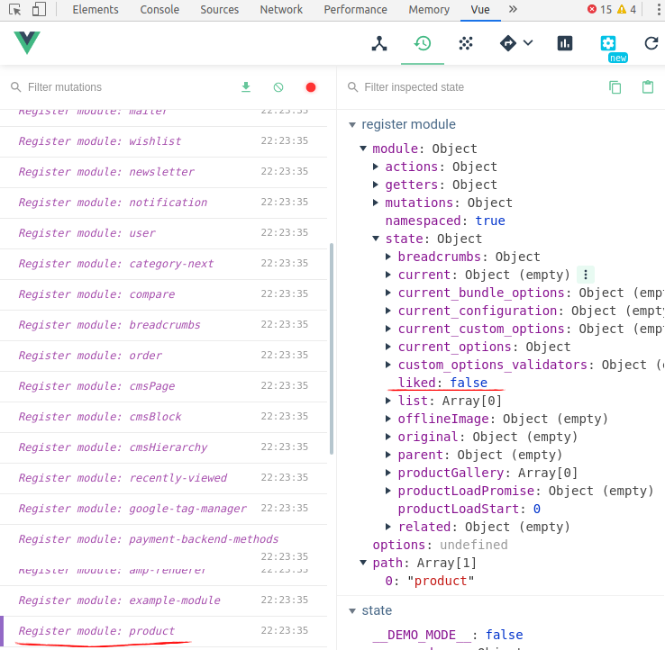

# Ch 5. Building a _Module_ from scratch 
<style>
    img[alt*="borderline"] {
        border: 1px #000 solid;
    }
</style>

In this chapter, we are going to cover : 
[[toc]]

## 0. Introduction
Modular approach to a system is often considered an implementation of the traditional engineering concept [*High cohesion with low coupling*](https://stackoverflow.com/questions/14000762/what-does-low-in-coupling-and-high-in-cohesion-mean). By this we mean, one may ***extend*** a logic of others without breaking a flow of the original. **Vue Storefront** also employs the concept in order to secure 3rd party developers' happiness. This chapter opens up the belly of new **Vue Storefront** module structure for you as of *1.11* release. 
<br />
<br />

## 1. How to bootstrap a module
If the open source authors are serious about their offspring, one must admit it's impossible to take care of all the details to all the use cases out in the wild. So the creator should expose joint point of core parts so that 3rd party developers may inject their wild logics into the working machine when they need it. Now lo and behold, jungles conquered. 

When you want to tweak any open source for whatever reason needed to make it more fantastic, first thing you need to look for is *modules* within the code base. You may name *API*, *hooks* or *observers* for the same matter, but *module* basically represents all of them in one place in design.  

In this recipe, we are going to cover how we bootstrap a module in its bare minimum in order to inject our logic into the machine. We will explore two different methods, one for manual install, the other for [`CLI`](setup.html#_4-storefront-cli-at-your-service) module generation with the boilerplate. *Tarzans, follow!*

:::tip TIP
If you want to know the detailed difference of _Manual_ method and _CLI_ method, please go to [Recipe 5. Packaging a module](#_5-packaging-a-module)
:::

### 1. Preparation
- You need [**Vue Storefront**](https://github.com/DivanteLtd/vue-storefront) instance [installed along with other infrastructure ](setup.html#_1-install-with-docker) on your machine to build a new module and test it working. 
- You need a development editor of your choice for your own convenience.
- You need _Vue Storefront_ [`CLI`](https://www.npmjs.com/package/@vue-storefront/cli) [installed](setup.html#_4-storefront-cli-at-your-service) on your machine for [Recipe B](#_2-2-recipe-b-cli-bootstrapping) installing with `CLI`. 

### 2-1. Recipe A (Manual bootstrapping)

1. Create a folder under `./src/modules/example-module` from your **Vue Storefront** root path. 
```bash
cd src/modules
mkdir example-module && cd example-module
```

2. Create `index.ts` file in the directory 
```bash
touch index.ts
```

3. Open that file and write down the minimum signature of a module 
```bash
import { StorefrontModule } from '@vue-storefront/core/lib/modules';

export const ExampleModule: StorefrontModule = function ({app, store, router, moduleConfig, appConfig}) {

}
```
We export _ExampleModule_ here implementing _StorefrontModule_ interface.

:::tip LOOK INSIDE
From `./core/lib/modules.ts`, you can check out _StorefrontModule_ signature as follows : 
```bash
export interface StorefrontModule { (
  app: any, # app instance (Vue instance)
  store: Store<any>, # Vuex store instance
  router: VueRouter, # router instance
  moduleConfig: any, # module config during registration
  appConfig: any): void # VSF config
}
```
Judging by this signature, you can access `store`, `router`, `config`s from your module. 
:::

4. _(Optional)_ Add a comment in order to figure out when it's registered later :
```bash
import { StorefrontModule } from '@vue-storefront/core/lib/modules';

export const ExampleModule: StorefrontModule = function ({app, store, router, moduleConfig, appConfig}) {
	console.log('Hello World and VSF!'); # Any punch line allowed!
}
```

5. Go to parent directory (`./src/modules`) and open `index.ts` file as follows :
```bash
cd ..
vi index.ts # here you can use another editor for sure instead of vi
```
This file is where you can register any module you create. Now here insert registration for the module we just created as follows : 
```ts{5,20}
/* ... abridged */

import { PaymentCashOnDeliveryModule } from './payment-cash-on-delivery';
import { InstantCheckoutModule } from './instant-checkout'
import { ExampleModule } from './example-module' /* Import Example module we just created */

import { registerModule } from '@vue-storefront/core/lib/modules'

export function registerNewModules () {
  registerModule(UrlModule)
  registerModule(CatalogModule)
  registerModule(CheckoutModule) 

/* ... abridged ... */

  registerModule(PaymentCashOnDeliveryModule) 
  registerModule(AmpRendererModule)
  registerModule(InstantCheckoutModule) 
  
  registerModule(ExampleModule) // Register Example module we just created
}
```

:::tip TIP 
Modules can be _lazy-loaded_ naturally. The _lazy loading_ generally has a few advantages such as performance, low overhead during initialization and may allow code separation in more structured way. One advice is, if your module is required across the entire app, it's better to stay with the regular place that is `./src/modules/index.ts` as demonstrated above. On the contrary, if your module is confined and bound to a certain route or bundle, then it might be wiser to register it inside them and load the bundle lazily. 

 _Lazy loading_, however, also has a downside that you may not be able to access some hooks such as `afterAppInit` because they are not lazy. (meaning only fired during app initialization)
:::

6. Run the command at **Vue Storefront** root path to bootstrap **Vue Storefront** app
```bash 
docker-compose up 
```
or without `docker`
```bash 
yarn dev
```

Once the app is up and running, it will spit out tons of logs indicating the jobs done. Open your eyes wide and if you are lucky, you will pick lines similar to as follows from super fast scrolling : 
```bash{4}
# ... abridged 

app_1  | [GTM] Google Tag Manager extensions is not working. Ensure Google Tag Manager container ID is defined in config null
app_1  | Hello World and VSF! # YAY! now we know it's successfully registered
app_1  | [module] VS Modules registration finished. { succesfulyRegistered: '0 / 0', registrationOrder: [] }
app_1  | Entity cache is enabled for productList null

# abridged ...
```

### 2-2. Recipe B (CLI bootstrapping)

1. Go to your project folder _or_ any prestine folder for your new `module` development. 
```bash
mkdir example-folder
cd example-folder
```

2. Run the `vsf` CLI command as follows : 
```bash
vsf init:module example-folder
```
The command required for module initialization here is `vsf init:module` and your new module name is `example-folder` in this case. 

You will see the following result : 
```bash
Module vsf-example-folder has been succesfully created!
 cd vsf-example-folder
```

:::tip NOTE
You might have noticed `vsf` put a prefix _`vsf`_ by default to your newly created module name. This helps your module get compiled automatically during _[INSERT UPDATE REQUIRED]_
:::

3. As the result dictates, change your directory to :
```bash
cd vsf-example-folder
```

4. List the files inside as follows :
```bash
ls *
```
You will see the following structure :
```bash
package.json  README.md  tsconfig.json

src:
index.ts  store.ts
```
Congratulation, you are good to go now. 

Further scenarios of this can be found at [Recipe 5. Packaging a module](#_5-packaging-a-module)

### 3. Peep into the kitchen (what happens internally)
We have created a module with only a few simple steps and registered it  successfully. Even though it's doing nothing practically, it was enough to grab the concept in design, and helped you transform into a module developer which is great. 

We built our `module` house in the territory of `./src/modules`. We created the door named `index.ts` where all the module parts are assembled and exported, although we skipped building module parts for the sake of brevity, which we will look inside more in detail later. Instead what we created in `index.ts` was bare minimum skeleton required to build a module and declare it's a module. 

Here `index.ts` uncovers a module is basically a function with access to certain parts of Vue app instance and allows to interact with it. Additionally achieved is a better versatility thanks to `helpers` and `hooks` along with it. 

If you take a look a little deeper, you will arrive at `./core/lib/modules.ts` where module signature and `registerModule` function take up seats. `registerModule` is the hard worker who works in `src/modules/index.ts` to register modules pushing individuals into `registeredModules`. (Beware the small difference in those names as in `registerModule`, `registeredModules`, `registerModules` and so on, might be confusing if you skim it, but they are correct and appropriate in its own role with matching names) 

With this approach our module development experience is much straight-forward and *Vue native API* friendly so that code becomes simpler, cleaner and maintainable. 

Now you are officially a **Vue Storefront module developer**. Congratulation!

### 4. Chef's secret (protip)
#### Secret 1. Lazy loading in practical examples

#### Secret 2. How a module can be leveraged to build extensions or integrations with. 

#### Secret 3. On the border of modularity

<br />
<br />

## 2. Best practices for tweaking a module
Once you got the hang of building a skeleton for modules, now it's time for working a real deal with modules. There are tons of opportunities here with freedom of building new modules powered by variety of methods available being mainly in a sense with working, extending and hooking to Vue's main parts. 

In this recipe, we walk through steps to building a simple module for _Like button in product page_. This recipe browses a brief concept of each topic for the demonstration purpose. The full details for building the module continues at [Recipe 7. Building a module from A to Z](#_7-building-a-module-from-a-to-z-in-an-iteration)
### 1. Preparation
- You need a new module to play with. You would already have had one if you finished [_Recipe 1. How to bootstrap a module_](#_1-how-to-bootstrap-a-module)

### 2-1. Recipe A (Extend Vuex store from inside a module)
_Vue Storefront_ takes advantage of _Vuex_'s `module` feature. You can encapsulate your module's data from global scope so that control over your data is secured easily within your grasp. 

1. Open the `index.ts` file of `example-module` at `./src/modules/example-module`

```bash
cd src/modules/example-module
vi index.ts # of course you can open it with other editors!
```

2. Prepare a store for the module as follows : 
```ts{3-8}
import { StorefrontModule } from '@vue-storefront/core/lib/modules';

const exampleModuleStore = {
  namespaced: true,
  state: {
    key: null
  }
}

export const ExampleModule: StorefrontModule = function ({app, store, router, moduleConfig, appConfig}) {
// abridged ...
```
`namespaced` with `true` value means this `store` is encapsulated inside a module and not registered to global store.

`state` contains data object you want to track. 

3. Register this `store` to app's `store` with `registerModule` :
```ts{11}
import { StorefrontModule } from '@vue-storefront/core/lib/modules';

const exampleModuleStore = {
  namespaced: true,
  state: {
    key: null
  }
}

export const ExampleModule: StorefrontModule = function ({app, store, router, moduleConfig, appConfig}) {
  store.registerModule('example-module', exampleModuleStore);
}

```
`registerModule` method is a Vue native API to dynamically register a store for each module. _Vue Storefront Module_ uses this method for data store so that module data is encapsulated from global scope. [more info](https://vuex.vuejs.org/guide/modules.html#dynamic-module-registration)

Consider the `store` as a _Model_ in plain MVC model.

4. You can add Vuex `plugins` to your store. 
```ts{3-9,16}
import { StorefrontModule } from '@vue-storefront/core/lib/modules';

const examplePlugin = store => {
  store.subscribe((mutation, state) => {
    if (mutation.type === 'PRESSED_LIKE') {
      console.log('Customer pressed LIKE button on the product');
    }
  })
}

const exampleModuleStore = {
  namespaced: true,
  state: {
    key: null
  },
  plugins: ['examplePlugin']
}

export const ExampleModule: StorefrontModule = function ({app, store, router, moduleConfig, appConfig}) {
  store.registerModule('example-module', exampleModuleStore);
}
```
`plugins` are handy when you want to _plug in_ an event to `mutation` of `state`. 

`mutation` is an object that contains `type` and `payload`. By checking `mutation` type, you can listen to the certain type of state changes. [more info](https://vuex.vuejs.org/guide/plugins.html)

You can also listen not only to `mutations` but also to `actions` as follows : 
```js
store.subscribeAction((action, state) => {
  console.log(action.type)
  console.log(action.payload)
})
```
It also provides `before` and `after` decorator to when the `plugin` should be fired of the event. (available since `3.1.0`) [more info](https://vuex.vuejs.org/api/#subscribeaction)


### 2-2. Recipe B (Override Vuex store with `extendStore`)
_Vue Storefront_ people came up with the idea to ___help___ module developers easily extend the module store already registered with the same name. 

1. Open the `index.ts` file of `example-module` again at `./src/modules/example-module`
```bash
cd src/modules/example-module
vi index.ts # of course you can open it with other editors!
```

2. Import `helpers` of core as follows : 
```ts{1}
import { extendStore, isServer } from '@vue-storefront/core/helpers';
import { StorefrontModule } from '@vue-storefront/core/lib/modules';

const examplePlugin = store => {
// abridged ...
```

3. Add an additional `product` store :
```ts{5-9}
// ... abridged
  plugins: ['examplePlugin']
}

const newProductModule = {
  state: {
    liked: false
  }
}

export const ExampleModule: StorefrontModule = function ({app, store, router, moduleConfig, appConfig}) {
// abridged ...
```

4. Run `extendStore` helper method to override or add to existing store `product` as follows : 
```ts{4}
export const ExampleModule: StorefrontModule = function ({app, store, router, moduleConfig, appConfig}) {
  store.registerModule('example-module', exampleModuleStore);

  extendStore('product', newProductModule);
}
```

5. In order to confirm it's successfully extended, we will use [Chrome vue-devtools extension](https://chrome.google.com/webstore/detail/vuejs-devtools/nhdogjmejiglipccpnnnanhbledajbpd?hl=en) which really comes in handy when you develop _Vue.js_ application. 

Open _Chrome DevTools_ and go to _Vue_ tab, and click _Vuex_ tab or click `ctrl` + `2`. Finally click _Register module : product_, then you will see a screen like as follows confirming `product` store has been extended successfully : 



:::tip TIP
You may use _vue-devtools_ for _Firefox_ if you use _Firefox_. 
Install [Firefox vue-devtools](https://addons.mozilla.org/en-US/firefox/addon/vue-js-devtools/)

:::


### 2-3. Recipe C (Extend router instance)
You can also dynamically add routes for your module using Vue native API. 

1. Create a dummy Vue component `Liked.vue` just to test `route` at `components` directory from `./src/modules/example-module` directory.
```bash
cd src/modules/example-module
mkdir components && cd components && vi Liked.vue
```

2. Fill the file with dummy template code as follows : 
```vue
<template>
  <p>{{ greeting }} World and you {{liked}}! </p>
</template>

<script>
module.exports = {
  data: function () {
    return {
      greeting: 'Hello',
      liked: 'Liked it'
    }
  }
}
</script>

<style scoped>
p {
  font-size: 2em;
  text-align: center;
}
</style>
```

3. Go back to parent directory, open `index.ts` file and work on the module router as follows : 
```ts{3,14,21-22}
import { extendStore, isServer } from '@vue-storefront/core/helpers';
import { StorefrontModule } from '@vue-storefront/core/lib/modules';
import Liked from './components/Liked.vue'; // Import the component

const examplePlugin = store => {

// abridged ...

  state: {
    liked: false
  }
}

const exampleRoutes = [{ name: 'liked', path: '/liked', component: Liked, alias: '/liked.html' }]; // compose the router we will use

export const ExampleModule: StorefrontModule = function ({app, store, router, moduleConfig, appConfig}) {
  store.registerModule('example-module', exampleModuleStore);

  extendStore('product', newProductModule);

  router.addRoutes(exampleRoutes) // adding routes here
  router.beforeEach((to, from, next) => { next() }) // navigation guards here
}

```
Routes to be added must be _Array_ type even if it only has one element as you can see it with `exampleRoutes` above. Each route object has `name`, `path`, `component` and `alias` property and it's pretty straightforward about what they are.

`addRoutes` is Vue native API to add routes dynamically to the router. 

`beforeEach` is the navigation guard Vue API provides. [more info](https://router.vuejs.org/guide/advanced/navigation-guards.html)

4. Open your browser and visit the route `/liked` we just created then you will see a screen like this :


### 2-4. Recipe D (Use hooks)
One of the most intuitive way to build a module is using hooks. Open source creators more than often intentionally leave hooks as many as possible to everywhere they think extendable for 3rd party developers to inject logic into the flow of program. Here we will look into how _Vue Storefront_ did it its way.

1. Open the `index.ts` file of `example-module` again at `./src/modules/example-module`
```bash
cd src/modules/example-module
vi index.ts # of course you can open it with other editors!
```

2. Import `coreHooks` from `core` :
```ts{4}
import { extendStore, isServer } from '@vue-storefront/core/helpers';
import { StorefrontModule } from '@vue-storefront/core/lib/modules';
import Liked from './components/Liked.vue';
import { coreHooks  } from '@vue-storefront/core/hooks'; // Import hooks from core

const examplePlugin = store => {
// abridged ...
```

3. Call any hook you want to use as follows : 
```ts{11-13}
// ...abridged

export const ExampleModule: StorefrontModule = function ({app, store, router, moduleConfig, appConfig}) {
  store.registerModule('example-module', exampleModuleStore);

  extendStore('product', newProductModule);

  router.addRoutes(exampleRoutes)
  router.beforeEach((to, from, next) => { next() })

  coreHooks.afterAppInit(() => { // 
    console.log('App has just been initialized')
  })
}

```

4. Confirm it's hooked, run the command at **Vue Storefront** root path to bootstrap **Vue Storefront** app
```bash 
docker-compose up 
```
or without `docker`
```bash 
yarn dev
```

Once again the app is up and running, it will spit out tons of logs indicating the jobs done including  : 
```bash{2}
app_1  | [module] VS Modules registration finished. { succesfulyRegistered: '0 / 0', registrationOrder: [] }
app_1  | App has just been initialized # Successfully Hooked !
app_1  | Result from ES for 3e9eb2ab7b4d96276c016ae9d5aa18116483667603e7e84ad2346627 (category),  ms=613 null
app_1  | whole request [/liked]: 1323ms
```
You can read [more in depth](#_3-hooking-into-hooks)

### 2-5. Recipe E (Manage module-level `config`)
Sometimes you may need to pass values to populate fields in your module configuration. We give you the ability to pass a `config` object to `registerModule` function, giving you options to choose when you register the `module`. 

Suppose you need to use a 3rd party service integrated to your storefront. Most of the time you need to provide an API credentials encapsulated in a request to the 3rd party so that they will know _you are you_ and process a service and return a result that belongs to you. This recipe tells you how to do it with using 3rd party account during module registration. 


1. Open the `index.ts` file of `example-module` again at `./src/modules/example-module`
```bash
cd src/modules/example-module
vi index.ts # of course you can open it with other editors!
```

2. Prepare the module to accept dynamic `moduleConfig` option where you want to allow to override values as follows : 
```ts{8-12,17}
// ...abridged

export const ExampleModule: StorefrontModule = function ({app, store, router, moduleConfig, appConfig}) {
  store.registerModule('example-module', exampleModuleStore);
  // ... abridged ...

  // Prepare apiKey for a request to a 3rd party to integrate with it, example as follows : 
  if (moduleConfig.apiKey) {
    const apiKey = moduleConfig.apiKey
  } else {
    // raise an error related to failure for sign-in to 3rd party service due to lack of apiKey
  }

  // Continue to send a request to the 3rd party as the context demands 
  // ... abridged for the sake of brevity ...

  console.log(apiKey); // This line helps you confirm apiKey value is overridden as intended
}
```
This indicates `moduleConfig` object has `apiKey` option for providing a choice for `module` user when registering it. 

3. Go to parent directory, open `index.ts` which is `./src/modules/index.ts` and fix the code as follows :  
```ts{6-10}
// ... abridged 

  registerModule(AmpRendererModule)
  registerModule(InstantCheckoutModule) 
  
  registerModule(ExampleModule, {
    apiKey: "YOUR_VALUABLE_API_KEY_ON_THE_FLY"
  }) // Here you pass config object as you want it
}

// abridged ...
```

4. In order to confirm `moduleConfig` option passed as planned, run the command at **Vue Storefront** root path to bootstrap **Vue Storefront** app
```bash 
docker-compose up 
```
or without `docker`
```bash 
yarn dev
```

Once again the app is up and running, now look for the part we injected : 
```bash{2}
app_1  | [module] VS Modules registration finished. { succesfulyRegistered: '0 / 0', registrationOrder: [] }
app_1  | YOUR_VALUABLE_API_KEY_ON_THE_FLY # moduleConfig injected successfully !
app_1  | Calling asyncData in Home (theme) null
```
You can read [more in depth](#_4-on-configuration)

### 2-6. Recipe F (Access app-level `config`)
When you work on building a _module_ in _Vue Storefront_, you can also access app's `config`. `config` is compiled version of `./config` folder which is normally a copy of `local.json`. When you need to access `config`, you can do it inside a `module`.

1. Open the `index.ts` file of `example-module` again at `./src/modules/example-module`
```bash
cd src/modules/example-module
vi index.ts # of course you can open it with other editors!
```

2. Call a node of `config` inside a `module` as follows :
```ts{4}
// ... abridged 

export const ExampleModule: StorefrontModule = function ({app, store, router, moduleConfig, appConfig}) {
  console.log(appConfig.products.defaultFilters); //  "products": {"defaultFilters": ["color", "size", "price", "erin_recommends"]}

// abridged ...
```

3. You can see the log as follows if you bootstrap your _Vue Storefront_ app : 
```bash{2}
app_1  | [GTM] Google Tag Manager extensions is not working. Ensure Google Tag Manager container ID is defined in config null
app_1  | [ 'color', 'size', 'price', 'erin_recommends' ] # here we go! successfully fetched global app config
app_1  | [module] VS Modules registration finished. { succesfulyRegistered: '0 / 0', registrationOrder: [] }
app_1  | This is one way to use moduleConfig
```

### 3. Peep into the kitchen (what happens internally)

### 4. Chef's secret (protip)
<br />
<br />

## 3. Hooking into hooks
Hooks are common development method written by core developers to allow 3rd party developers or module developers to inject their own logic at predefined spots of the program. With this approach, the software can be flexible in design, so that it helps handle issues which were unknown at the time it was designed initially. 

Core developers usually strive to optimize where to put hooks. In _Vue Storefront_, hooks generally fall under either of two groups. One of each is `listener`; it allows us to do something at certain moment of application lifecycle. The other of each is `mutator`; it allows us to modify internal objects before app performs some actions.

In this recipe, we look into where they are and how this can be applied to your _module_ development.

### 1. Preparation
 - You need a new module to play with. You would already have had one if you finished [_Recipe 1. How to bootstrap a module_](#_1-how-to-bootstrap-a-module)
 - You need [multistores set up](/guide/cookbook/multistores) (We assume you have set another store up whose `storeCode` is `de`)

:::warning NOTICE
 This recipe deals with hooks as of [_1.10_](/guide/upgrade-notes/#_1-9-1-10). If you work with other versions of _Vue Storefront_, please bear in mind they might be different in detail. 
:::

### 2. Recipe
:::tip OBJECTIVE
We build a module that applies a discount to certain `storeviews` only.
:::

1. Make up a list of requirements for the module as follows : 
 - Need _configurations_ as to which `storeviews` may apply to the discount and how much it should be. 
 - Need to apply discount to the price of products in `category`, `product` pages. 
 - Need a list of points where the discount should be verified.

2. Now start with the first item, create a _configuration_ for the module to consume. 
```json
  discountStore: {
      "enableDiscountPerStoreViews": true,
      "storeViewsToApplyTo": ["de"],
      "globalDiscountInPercentage": 25,
      "allowLocalOverride": true
  }
```
 - `discountStore` contains nodes of configuration for our module.
   - `enableDiscountPerStoreViews` : This value determines whether to set this module enabled or not. 
   - `storeViewsToApplyTo` : This array contains the `storeviews` code.
   - `globalDiscountInPercentage` : This value is how much discount should be applied to target `storeviews`.
   - `allowLocalOverride` : This value allows to override discount dynamically.

3. Create a module whose name is _hookExample_ (change to your liking)


### 3. Peep into the kitchen (what happens internally)

### 4. Chef's secret (protip)

#### Secret 1. The list of hooks 

1. `cart` 
  - `beforeSync` : 
  - `afterSync` :
  - `beforeAddToCart` :
  - `afterAddToCart` : 
  - `beforeRemoveFromCart` : 
  - `afterRemoveFromCart` : 

2. `order`
  - `beforePlaceOrder` : 
  - `afterPlaceOrder` :

3. `user` 
  - `afterUserAuthorize` :
  - `afterUserUnauthorize` :

4. `app` _global level_
  - `beforeStoreViewChange` :
  - `afterStoreViewChange` :
  - `afterAppInit` :

:::warning NOTICE
The list is of course subject to change, it grows for each core module to handle all use cases. 
:::
#### Secret 2. The core hooks design 

#### Secret 3. Rewriting the module again without the hooks

<br />
<br />

## 4. On Module configuration
_Configuration_ is a basic template for options designed by developers that users may change to their own liking. Those changes made and saved will change the course of software during its lifecycle based on values of configuration.  

_Configuration_ tends to have default values which entails default behaviors of the program so that users don't have to bother if they are OK with default behaviors. Best user experience with flexibility can be achieved with carefully designed _configuration_ with default values. 


### 1. Preparation
### 2. Recipe
### 3. Peep into the kitchen (what happens internally)
### 4. Chef's secret (protip)
<br />
<br />

## 5. Packaging a module
It's hands down no-brainer to bootstrap a module _manually_ because the skeleton required for minimum signature is dead simple and straightforward. Compared to the _`CLI`_ method, however, the _manual_ method is usually prefered for _local_ development, in other words, a project-specific module is structured with [the manual method](#_2-1-recipe-a-manual-bootstrapping) for better legibility. In contrast, _`CLI`_ method can help you build your module easily as a `npm` package  by providing you with the boilerplate. 

### 1. Preparation
### 2. Recipe
### 3. Peep into the kitchen (what happens internally)
### 4. Chef's secret (protip)
<br />
<br />

## 6. Anti-patterns & Common pitfalls

### 1. Preparation
### 2. Recipe
### 3. Peep into the kitchen (what happens internally)
### 4. Chef's secret (protip)
<br />
<br />


## Sidedish - Ideation

When you have an idea to build a great module, it means you have a brilliant idea in the first place to start with. How does it come anyway? Is it a spontaneous process or can we work elaborately on it to train ideation from its conception to delivery? I want to say _Yes_ to both, please follow me to see what I have to offer in this _sidedish_ talk session. 

_[INSERT VIDEO HERE]_
<br />
<br />

## 7. Building a module from A to Z in an iteration


### 1. Preparation
### 2. Recipe
### 3. Peep into the kitchen (what happens internally)
### 4. Chef's secret (protip)
<br />
<br />

## 8. Deprecated legacy of Modules
In this recipe, we will take a review of how to deal with modules in an old fashioned way , just in case you really need it. 

### 1. Preparation
### 2. Recipe
### 3. Peep into the kitchen (what happens internally)
### 4. Chef's secret (protip)
<br />
<br />


## 9. Converting old modules to new modules 
There are useful modules out there already developed in the old way.

### 1. Preparation
### 2. Recipe
### 3. Peep into the kitchen (what happens internally)
### 4. Chef's secret (protip)
<br />
<br />
