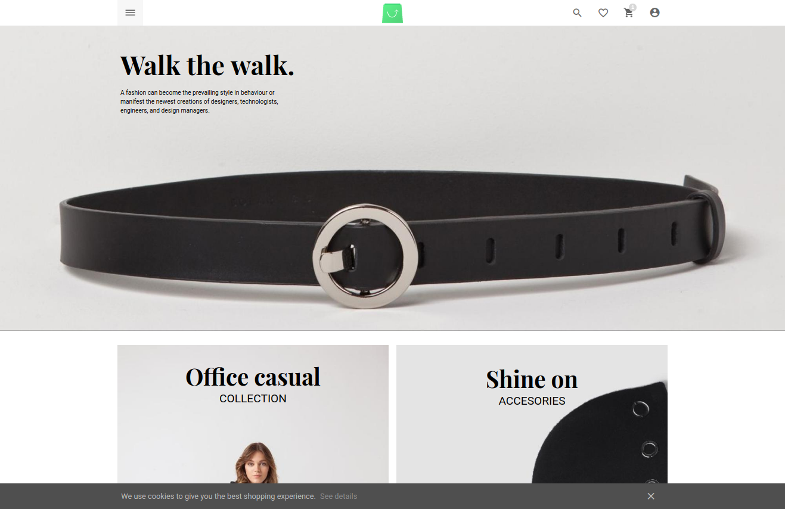

# Ch 3. Starter pack for new comers (Install)
<style>
    img[alt*="borderline"] {
        border: 1px #000 solid;
    }
</style>

In this chapter, we will cover : 

[[toc]]


## 0. Introduction
Now you are definitely interested in **Vue Storefront**. That's why you are here. You've come across the line. You made a choice. You will have something in return, which is great. Be it developers, entrepreneurs or even marketing managers that they may want to try something new for better products in hopes of enhancing their clients or customers' experience. You chose the right path. We will explore anything you need to get you started at all with [**Vue Storefront** infrastructure](https://github.com/DivanteLtd).

## 1. Install with Docker
Docker has been arguably the most sought-after, brought to the market which took the community by storm ever since its introduction. Although it's yet controversial whether it's the best choice among its peers, I have never seen such an unanimous enthusiasm over one tech product throughout the whole developers community. 

Then, why so? In modern computer engineering, products are so complex with an endless list of dependencies intertwined with each other. Building such dependencies in place for every occasion where it's required is one hell of a job, not to mention glitches from all the version variation. That's where Docker steps in to make you achieve **infrastructure automation**. This concept was conceived to help you focus on your business logic rather than having you stuck with hassles of lower level tinkering. 

Luckily, we already have been through all this for you, got our hands dirty. All you need is run a set of docker commands to get you up and running from scratch. Without further ado, let's get started!

### 1. Preparation
- You need [`docker`](https://www.digitalocean.com/community/tutorials/how-to-install-and-use-docker-on-ubuntu-18-04) and [`docker-compose`](https://www.digitalocean.com/community/tutorials/how-to-install-docker-compose-on-ubuntu-18-04) installed. 

- You need [`git`](https://www.digitalocean.com/community/tutorials/how-to-install-git-on-ubuntu-18-04) installed.

:::tip NOTE
We will walk you with docker on *Linux*. (Specifically *Ubuntu 18.04* if needed)

There is only one bias for Docker before using it; *Run it on Linux*. Docker is native Linux, was created using a Linux technology; LXC (linux container) in the first place. Even though there were many attempts made to make it available to other platforms as it does on Linux, and it has definitely been on a progress, however, using Docker on Linux is the solidest way to deal with the technology. 

That being sad, there are tips for using other platforms for docker at [Chef's Secrets](#_4-chef-s-secret-protip) as well. 
:::

### 2. Recipe
1. First, start with backend, download [**Vue Storefront API**](https://github.com/DivanteLtd/vue-storefront-api) from github.
```bash
git clone https://github.com/DivanteLtd/vue-storefront-api.git vue-storefront-api
cd vue-storefront-api
```

2. Copy `./config/default.json` to `./config/local.json`
```bash
cp config/default.json config/local.json
```
Then edit `local.json` to your need. 
We will look into this in greater detail at [Chef's secret](#_4-chef-s-secret-protip)
:::tip TIP
This step can be skipped if you are OK with values of `default.json` since it follows the [files load order](https://github.com/lorenwest/node-config/wiki/Configuration-Files#file-load-order) of [node-config](https://github.com/lorenwest/node-config)

:::

3. Run the following Docker command : 
```bash
docker-compose -f docker-compose.yml -f docker-compose.nodejs.yml up -d
```

Then the result would look something like this : 
```bash
Building app
Step 1/8 : FROM node:10-alpine
 ---> 9dfa73010b19
Step 2/8 : ENV VS_ENV prod
 ---> Using cache
 ---> 4d0a83421665
Step 3/8 : WORKDIR /var/www
 ---> Using cache
 ---> e3871c8db7f3
Step 4/8 : RUN apk add --no-cache curl git
 ---> Using cache
 ---> 49e996f0f6cb
Step 5/8 : COPY package.json ./
 ---> 14ed18d76efc
Step 6/8 : RUN apk add --no-cache --virtual .build-deps ca-certificates wget &&     yarn install --no-cache &&     apk del .build-deps
 ---> Running in 3d6f91acc2fe
fetch http://dl-cdn.alpinelinux.org/alpine/v3.9/main/x86_64/APKINDEX.tar.gz
fetch http://dl-cdn.alpinelinux.org/alpine/v3.9/community/x86_64/APKINDEX.tar.gz
(1/2) Installing wget (1.20.3-r0)
(2/2) Installing .build-deps (0)
Executing busybox-1.29.3-r10.trigger
OK: 22 MiB in 26 packages
yarn install v1.16.0
info No lockfile found.
[1/4] Resolving packages...
warning @babel/node > @babel/polyfill@7.4.4: 🚨 As of Babel 7.4.0, this
package has been deprecated in favor of directly
including core-js/stable (to polyfill ECMAScript
features) and regenerator-runtime/runtime
(needed to use transpiled generator functions):

  > import "core-js/stable";
  > import "regenerator-runtime/runtime";
warning eslint > file-entry-cache > flat-cache > circular-json@0.3.3: CircularJSON is in maintenance only, flatted is its successor.
[2/4] Fetching packages...

# ... abridged


```
:vhs: You may also watch it in [bash playback :movie_camera:](https://asciinema.org/a/7XT5CWP4ynrPItattiP3on6wS)

:::tip TIP
`-f` flag allows you to use the following docker-compose file. Without this flag, it will use the default file that is `docker-compose.yml`

`-d` flag allows you to run the command in `detach mode` which means *running background*.
:::
3. In order to verify, run `docker ps` to show which containers are up
```bash
docker ps 
```

Then, 
```bash
CONTAINER ID        IMAGE                     COMMAND                  CREATED             STATUS              PORTS                                            NAMES
53a47d5a6440        vuestorefrontapi_kibana   "/bin/bash /usr/loca…"   31 seconds ago      Up 29 seconds       0.0.0.0:5601->5601/tcp                           vuestorefrontapi_kibana_1
7d8f6328601b        vuestorefrontapi_app      "docker-entrypoint.s…"   31 seconds ago      Up 27 seconds       0.0.0.0:8080->8080/tcp                           vuestorefrontapi_app_1
165ae945dbe5        vuestorefrontapi_es1      "/bin/bash bin/es-do…"   8 days ago          Up 30 seconds       0.0.0.0:9200->9200/tcp, 0.0.0.0:9300->9300/tcp   elasticsearch
8dd144746cef        redis:4-alpine            "docker-entrypoint.s…"   11 days ago         Up 31 seconds       0.0.0.0:6379->6379/tcp                           vuestorefrontapi_redis_1
```
The ports number will be used later in the frontend configuration. In fact, they are already set in as default values. 

You will see 4 containers are running, which is :
| Container              |          Port       |
|------------------------|---------------------|
| Vue Storefront API app | :8080               |
| Elasticsearch          | :9200               |
| Kibana                 | :5601               |
| Redis                  | :6379               |


4. Now that backend part is done, let's work on frontend part, that is download [**Vue Storefront**](https://github.com/DivanteLtd/vue-storefront)

```bash
git clone https://github.com/DivanteLtd/vue-storefront.git vue-storefront
cd vue-storefront
```

5. Prepare the config file at `./config/local.json`. There is `default.json` file in the same folder which is a default set of configuration. Copy it as follows :
```bash
cp config/default.json config/local.json
```
Then fix the value as you need it in the `local.json` file.
In `local.json`, you may change values for information of backend family. But if you followed this recipe verbatim, you don't have to, because it's already there with the default value. Should you study the contents, please see to [Chef's secret](#secret-1-study-in-local-json) 

6. Finally run the following Docker command : 
```bash
docker-compose up -d 
```
The result should be something like this : 
```bash
Building app
Step 1/8 : FROM node:10-alpine
 ---> 9dfa73010b19
Step 2/8 : ENV VS_ENV prod
 ---> Using cache
 ---> 4d0a83421665
Step 3/8 : WORKDIR /var/www
 ---> Using cache
 ---> e3871c8db7f3
Step 4/8 : COPY package.json ./
 ---> 0eab68a8f13a
Step 5/8 : COPY yarn.lock ./
 ---> ac1f5e4a1831
Step 6/8 : RUN apk add --no-cache --virtual .build-deps ca-certificates wget git   && yarn install --no-cache   && apk del .build-deps
 ---> Running in 1ca7bc7782e3
fetch http://dl-cdn.alpinelinux.org/alpine/v3.9/main/x86_64/APKINDEX.tar.gz
fetch http://dl-cdn.alpinelinux.org/alpine/v3.9/community/x86_64/APKINDEX.tar.gz
(1/9) Installing ca-certificates (20190108-r0)
(2/9) Installing wget (1.20.3-r0)
(3/9) Installing nghttp2-libs (1.35.1-r0)
(4/9) Installing libssh2 (1.8.2-r0)
(5/9) Installing libcurl (7.64.0-r2)
(6/9) Installing expat (2.2.6-r0)
(7/9) Installing pcre2 (10.32-r1)
(8/9) Installing git (2.20.1-r0)
(9/9) Installing .build-deps (0)
Executing busybox-1.29.3-r10.trigger
Executing ca-certificates-20190108-r0.trigger
OK: 22 MiB in 25 packages
yarn install v1.16.0
[1/5] Validating package.json...
[2/5] Resolving packages...
[3/5] Fetching packages...
info fsevents@1.2.4: The platform "linux" is incompatible with this module.

# ... abridged

```

:vhs: You may also watch it in [bash playback :movie_camera:](https://asciinema.org/a/JZYI9ZE6DHeC7N2keBNoFUWjQ)

7. In order to verify, run `docker ps`, there should be another container added to the list.
```bash
CONTAINER ID        IMAGE                     COMMAND                  CREATED             STATUS              PORTS                                            NAMES
88d758bc24d0        vuestorefront_app         "docker-entrypoint.s…"   2 minutes ago       Up 2 minutes        0.0.0.0:3000->3000/tcp                           vuestorefront_app_1
de560221fdaf        vuestorefrontapi_kibana   "/bin/bash /usr/loca…"   8 hours ago         Up 23 minutes       0.0.0.0:5601->5601/tcp                           vuestorefrontapi_kibana_1
5576cd9963a1        vuestorefrontapi_app      "docker-entrypoint.s…"   8 hours ago         Up 23 minutes       0.0.0.0:8080->8080/tcp                           vuestorefrontapi_app_1
88f5db9486da        vuestorefrontapi_es1      "/bin/bash bin/es-do…"   8 hours ago         Up 24 minutes       0.0.0.0:9200->9200/tcp, 0.0.0.0:9300->9300/tcp   elasticsearch
d46c1e0a22af        redis:4-alpine            "docker-entrypoint.s…"   8 hours ago         Up 24 minutes       0.0.0.0:6379->6379/tcp                           vuestorefrontapi_redis_1

```
8. Open your browser and visit [http://localhost:3000/](http://localhost:3000/) 

After compiling, *Voila!*



### 3. Peep into the kitchen (what happens internally) 
We used `docker-compose` for setting up the entire environment of Vue Storefront. It was more than enough to launch the machines behind for running the shop.

It was possible because `docker` encapsulated the whole bunch of infrastructure into a linear set of declarative definition for the desired state. 

We had 2 steps of `docker-compose` one of which is for backend **Vue Storefront API**, the other for frontend **Vue Storefront**.

The first `docker-compose` had two `yml` files for input. The first input file `docker-compose.yml` describe its base requirement all but **Vue Storefront API** itself; that is, **Elasticsearch** as data store, **Redis** for cache and **Kibana** for helping you grab your data visually (a pair of Elasticsearch).
```yaml
# docker-compose.yml 
version: '3.0'
services:
  es1:
    container_name: elasticsearch
    build: docker/elasticsearch/
    volumes:
      - ./docker/elasticsearch/config/elasticsearch.yml:/usr/share/elasticsearch/config/elasticsearch.yml:ro
      - ./docker/elasticsearch/data:/usr/share/elasticsearch/data
    ports:
      - '9200:9200'
      - '9300:9300'
    environment:
      ES_JAVA_OPTS: "-Xmx512m -Xms512m"

  kibana:
    build: docker/kibana/
    volumes:
      - ./docker/kibana/config/:/usr/share/kibana/config:ro
    ports:
      - '5601:5601'
    depends_on:
      - es1

  redis:
    image: 'redis:4-alpine'
    ports:
      - '6379:6379'

volumes:
  esdat1:
```
:::tip NOTE 
Once a term explained, it will be ignored thereafter for consecutive occurrence.
:::
`version` denotes which version of `docker-compose` this file uses.  

`services` describe containers. It codifies how they should run. In other words, it codifies option flags used with `docker run ...`

`es1` contains information of data store *Elasticsearch* container.
- `build` denotes build path of container.
- `volumes` contains the mount path of volumes shared between host and container as *host:container*
- `ports` connect ports between host and container as in *host:container*
- `environment` allows you to add environment variables. `Xmx512m` means JVM will take up to maximum 512MB memory. `Xms512m` means minimum memory. Combining them, there will be no memory resize, it will just stick to 512MB from start to end throughout its life cycle. 

`kibana` contains information of *Kibana* application container.
- `depends_on` creates dependency for a container of other containers. So, this container is dependent on `es1` that's just described above. 
- `volumes` mean volumes shared, `:ro` creates the volume in `read-only` mode for the container. 

`redis` contains information of *Redis* cache application container. 

- `image` node contains the name of image this container is based on. 

`volumes` in top level can be used as a reference to be used across multiple services(containers). 
<br />
<br />

The second input file `docker-compose.nodejs.yml` deals with **Vue Storefront API** node application. 
```yaml
version: '3.0'
services:
  app:
    # image: divante/vue-storefront-api:latest
    build:
      context: .
      dockerfile: docker/vue-storefront-api/Dockerfile
    depends_on:
      - es1
      - redis
    env_file: docker/vue-storefront-api/default.env
    environment:
      VS_ENV: dev
    volumes:
      - './config:/var/www/config'
      - './ecosystem.json:/var/www/ecosystem.json'
      - './migrations:/var/www/migrations'
      - './package.json:/var/www/package.json'
      - './babel.config.js:/var/www/babel.config.js'
      - './scripts:/var/www/scripts'
      - './src:/var/www/src'
      - './var:/var/www/var'
    tmpfs:
      - /var/www/dist
    ports:
      - '8080:8080'
```
`app` contains information of *Vue Storefront API* application. 
- `build` is path for build information. If the value is string, it's a plain path. When it's object, you may have a few options to add. `context` is relative path or git repo url where `Dockerfile` is located. `dockerfile` node may change the path/name of `Dockerfile`. [more info](https://docs.docker.com/compose/compose-file/#build)
- `depends_on` tells us this container is based on `es1` and `redis` containers we created above. 
- `env_file` helps you add environment values from files. It's relative path from the `docker-compose` file that is in the process, in this case, it's `docker-compose.nodejs.yml`  
- `environment` is to set `VS_ENV` as `dev` so that environment will be setup for developer mode. 
- `tmpfs` denotes temporary volumes that are only available to host memory. Unlike `volumes`, this `tmpfs` will be gone once the container stops. This option is only available to *Linux*.

<br />
<br />

The second `docker-compose` step handles **Vue Storefront** frontend.  
``` yaml
version: '2.0'
services:
  app:
    # image: divante/vue-storefront:latest
    build:
      context: .
      dockerfile: docker/vue-storefront/Dockerfile
    env_file: docker/vue-storefront/default.env
    environment:
      VS_ENV: dev
    network_mode: host
    volumes:
      - './babel.config.js:/var/www/babel.config.js'
      - './config:/var/www/config'
      - './core:/var/www/core'
      - './ecosystem.json:/var/www/ecosystem.json'
      - './.eslintignore:/var/www/.eslintignore'
      - './.eslintrc.js:/var/www/.eslintrc.js'
      - './lerna.json:/var/www/lerna.json'
      - './tsconfig.json:/var/www/tsconfig.json'
      - './tsconfig-build.json:/var/www/tsconfig-build.json'
      - './shims.d.ts:/var/www/shims.d.ts'
      - './package.json:/var/www/package.json'
      - './src:/var/www/src'
      - './var:/var/www/var'
    tmpfs:
      - /var/www/dist
    ports:
      - '3000:3000'
```
This looks like by and large the same with *Vue Storefront API* with a few changes. 

`app` service describes options for *Vue Storefront* frontend application.
- `network_mode` allows you to modify values for `--network` option of docker client. `host` option allows your designated container to open to host network. For example, if you bind your container in host's `80` port, then the container will be accessible at host's `<IP address>:80` from the internet. In other words, the container is not isolated. [more info](https://docs.docker.com/network/host/)

If you take a closer look inside `Dockerfile`s, you will notice they install all the dependencies of the project from `package.json` not to mention required OS features including `git`, `wget` and certificates. You don't have to worry what to do because we made it do for you. 

Next, you might want to import your goods data. Please jump to [Data imports](./data-import.md) if you don't want to stop. 

### 4. Chef's secret (protip)
#### Secret 1. Study in `local.json` for *Vue Storefront API*
Starting point of customization is `default.json` or its copy `local.json` where the platform seeks configuration values. 
:::tip NOTE
If you want to modify `default.json`, don't edit it directly but copy the whole file into `local.json` and start editing it in that file. Why it should be done that way is explained later at [Secret 3. Why use node-config?](#secret-3-why-use-node-config)
:::
We have 2 `local.json` files, one of which is for backend here, and we will look at [Secret 2](#secret-2-study-in-local-json-for-vue-storefront), the other for frontend . 

At [`vue-storefront-api/config/default.json`](https://github.com/DivanteLtd/vue-storefront-api/blob/master/config/default.json) for **backend** : 
```json
  "server": {
    "host": "localhost",
    "port": 8080,
    "searchEngine": "elasticsearch"
  },  
```
- This is where your API backend is defined. The server will listen `server.host`:`server.port` unless it's defined otherwise in environment variables. 

- `server.searchEngine` is used in the integration with `graphql` so please don't change it. [jump to code](https://github.com/DivanteLtd/vue-storefront-api/blob/master/src/graphql/resolvers.js#L6)
```json
  "orders": {
    "useServerQueue": false
  },
  "catalog": {
    "excludeDisabledProducts": false
  },
```
- `orders.useServerQueue` allows you to use queue process when `order` API is used to create an order. [jump to code](https://github.com/DivanteLtd/vue-storefront-api/blob/master/src/api/order.js#L65)

- `catalog.excludeDisabledProducts` allows you to skip disabled products when importing products using `mage2vs`. 
[jump to code](https://github.com/DivanteLtd/mage2vuestorefront/blob/master/src/adapters/magento/product.js#L166)

```json
  "elasticsearch": {
    "host": "localhost",
    "port": 9200,
    "protocol": "http",
    "user": "elastic",
    "password": "changeme",
    "min_score": 0.01,
    "indices": [
      "vue_storefront_catalog",
      "vue_storefront_catalog_de",
      "vue_storefront_catalog_it"
    ],
    "indexTypes": [
      "product",
      "category",
      "cms",
      "attribute",
      "taxrule",
      "review"
    ],
    "apiVersion": "5.6"
  },
```
- `elasticsearch` element is used widely across the whole platform. Considering `elasticsearch` works as a data store (database), it's natural. 

  - `host`, `port`, `protocol` defines `elasticsearch` connect information. 
- `user`, `password` is default credentials of `elasticsearch`. If you changed the credentials of `elasticsearch`, please change this accordingly. [more info](https://www.elastic.co/guide/en/x-pack/current/security-getting-started.html)
  - `min_score` sets a `min_score` when building a query for `elasticsearch`. [jump to code](https://github.com/DivanteLtd/vue-storefront-api/blob/master/src/graphql/elasticsearch/queryBuilder.js#L172)
    :::tip TIP
    `min_score` helps you exclude documents with `_score` less than `min_score` value. 
    :::
  - `indices` may contain one or multiple indexes. Each index acts as a data store for a storefront. You may add entries to the array with arbitrary names or remove entries from it. 
    :::warning CAUTION !
     However, the index name should match the one you will use for [data pump](data-import.md#_2-2-recipe-b-using-on-premise). 
     :::
  The default values for `indices` assume you have 2 additional stores(`de`, `it`) plus the default store.  
  - `indexTypes` contains values for mapping. You can consider it as `table` if you take `indices` as database.
  - `apiVersion` defines the `elasticsearch` version it uses. 

```json
  "redis": {
    "host": "localhost",
    "port": 6379,
    "db": 0
  },
  "kue": {},
```
- `redis` contains `redis` server connect information.
- `kue` contains `kue` application options. [jump to code for options](https://github.com/Automattic/kue/blob/master/lib/kue.js#L88)

```json
  "availableStores": [
    "de",
    "it"
  ],
```
- `availableStores` contains additional stores code name. If this value is an empty array, it means you only have one default store. 

```json
"storeViews": {
    "multistore": true,
    "mapStoreUrlsFor": [
      "de",
      "it"
    ],
    "de": {
      "storeCode": "de",
      "storeId": 3,
      "name": "German Store",
      "url": "/de",
      "elasticsearch": {
        "host": "localhost:8080/api/catalog",
        "index": "vue_storefront_catalog_de"
      },
      "tax": {
        "defaultCountry": "DE",
        "defaultRegion": "",
        "calculateServerSide": true,
		"sourcePriceIncludesTax": false
      },
      "i18n": {
        "fullCountryName": "Germany",
        "fullLanguageName": "German",
        "defaultLanguage": "DE",
        "defaultCountry": "DE",
        "defaultLocale": "de-DE",
        "currencyCode": "EUR",
        "currencySign": "EUR",
        "dateFormat": "HH:mm D-M-YYYY"
      }
    },
    "it": {
      "storeCode": "it",
      "storeId": 4,
      "name": "Italian Store",
      "url": "/it",
      "elasticsearch": {
        "host": "localhost:8080/api/catalog",
        "index": "vue_storefront_catalog_it"
      },
      "tax": {
        "defaultCountry": "IT",
        "defaultRegion": "",
        "calculateServerSide": true,
        "sourcePriceIncludesTax": false
      },
      "i18n": {
        "fullCountryName": "Italy",
        "fullLanguageName": "Italian",
        "defaultCountry": "IT",
        "defaultLanguage": "IT",
        "defaultLocale": "it-IT",
        "currencyCode": "EUR",
        "currencySign": "EUR",
        "dateFormat": "HH:mm D-M-YYYY"
      }
    }
  },

```
- `storeViews` element contains the whole information of ***additional*** stores. The default store information doesn't exist here, it exists on top level.
- `multistore` is supposed to tell the platform if it has multiple stores to consider. For example, it is used to configure `tax` values of additional store. [jump to code](https://github.com/DivanteLtd/vue-storefront-api/blob/master/src/platform/magento2/tax.js#L14) 
- `mapStoreUrlsFor` is used for building url routes in frontend. [jump to code](https://github.com/DivanteLtd/vue-storefront/blob/master/core/lib/multistore.ts#L85)
- `de` element contains detailed information of `de` store. You need to have this kind of element for all the additional stores you added to `availableStores` with `storeCode` as the key. `de` and `it` in the `default.json` exhibits an example you can copy & paste for other stores you need to add. 
  - `storeCode` denotes store code for the store. 
  - `storeId` denotes store ID of the store.
  - `name` denotes the store name.
  - `url` denotes URL for the store.
  - `elasticsearch` contains information for the store. This information may override the default one defined above. 
    - `host` is where your *Elasticsearch* listens on.
    - `index` is the name of the index for the store.
  - `tax` contains tax information of the store.
    - `defaultCountry` is the code name of the country on which tax is calculated for the store. 
    - `defaultRegion` is default region.
    - `calculateServerSide` determines if price is fetched with(`true`)/without(`false`) tax calculated. [jump to code](https://github.com/DivanteLtd/vue-storefront-api/blob/master/src/api/product.js#L48)
    - `sourcePriceIncludesTax` determines whether price is stored with tax applied (`true`) or tax calculated on runtime (`false`).  [jump to code](https://github.com/DivanteLtd/vue-storefront-api/blob/master/src/platform/magento2/tax.js#L12)
  - `i18n` connotes *internationalization*. [more info](https://en.wikipedia.org/wiki/Internationalization_and_localization)   
    - `fullCountryName` is the full name of the country this `i18n` is applied to.
    - `fullLanguageName` is the full name of the language this `i18n` is applied to.
    - `defaultCountry` is the abbreviated name of the country this `i18n` is applied to by default.
    - `defaultLanguage` is the abbreviated name of the language this `i18n` is applied to by default.
    - `defaultLocale` is the default locale this `i18n` uses. 
    - `currencyCode` is the currency code this store uses. 
    - `currencySign` is the currency sign this store uses. 
    - `dateFormat` is the date format this store uses. 
    
    
 ```json
  "authHashSecret": "__SECRET_CHANGE_ME__",
  "objHashSecret": "__SECRET_CHANGE_ME__",
 ```
- `authHashSecret` is used to encode & decode JWT for API use. 
- `objHashSecret` is 1) fallback secret hash for `authHashSecret`, 2) used for hashing in tax calculation. 

```json
  "cart": {
    "setConfigurableProductOptions": false
  },
  "tax": {
    "defaultCountry": "PL",
    "defaultRegion": "",
    "calculateServerSide": true,
    "alwaysSyncPlatformPricesOver": false,
    "usePlatformTotals": true,
    "setConfigurableProductOptions": true,
    "sourcePriceIncludesTax": false
  },
```
- `cart` 
  - `setConfigurableProductOptions` flag determines to show either the parent item or the child item (aka selected option item) in the cart context. `true` shows parent item instead of the option item selected.  [jump to code](https://github.com/DivanteLtd/vue-storefront-api/blob/master/src/platform/magento2/o2m.js#L94)
- `tax`
  - `alwaysSyncPlatformPricesOver`  [jump to code](https://github.com/DivanteLtd/vue-storefront-api/blob/master/src/api/order.js#L49)
  - `usePlatformTotals` 
  These two options are used to determine whether to fetch prices from data source on the fly or not. If you set `alwaysSyncPlatformPricesOver` true, then it skips checking the checksum for cart items based on price.  
  
```json
  "bodyLimit": "100kb",
  "corsHeaders": [
    "Link"
  ],
```
- `bodyLimit` limits how big a request can be for your application. 
- `corsHeaders` allows you to add entries to `Access-Control-Expose-Headers`

```json
  "platform": "magento2",
```
- `platform` defines which e-commerce platform is used as a source. [jump to code](https://github.com/DivanteLtd/vue-storefront-api/blob/master/src/api/order.js#L13)

```json
  "registeredExtensions": [
    "mailchimp-subscribe",
    "example-magento-api",
    "cms-data",
    "mail-service"
  ],
  "extensions": {
    "mailchimp": {
      "listId": "e06875a7e1",
      "apiKey": "a9a3318ea7d30f5c5596bd4a78ae0985-us3",
      "apiUrl": "https://us3.api.mailchimp.com/3.0"
    },
    "mailService": {
      "transport": {
        "host": "smtp.gmail.com",
        "port": 465,
        "secure": true,
        "user": "vuestorefront",
        "pass": "vuestorefront.io"
      },
      "targetAddressWhitelist": ["contributors@vuestorefront.io"],
      "secretString": "__THIS_IS_SO_SECRET__"
    }
  },
```
- `registeredExtensions` element contains the list of supported extensions, it bootstraps entry points for those extensions [jump to code](https://github.com/DivanteLtd/vue-storefront-api/blob/master/src/api/index.js#L45)

- `extensions` contains additional configuration for extensions. [jump to code](https://github.com/DivanteLtd/vue-storefront-api/tree/master/src/api/extensions)
  - `mailchimp` provides `POST`, `DELETE` APIs for *Mailchimp* `subscribe` method.
    - `listId` is the ID of list you are publishing.
    - `apiKey` is API key you are assigned.
    - `apiUrl` is API base url for *Mailchimp* service. 
  - `mailService`  is used to send emails from Vue Storefront via *Gmail*.
    - `transport` contains basic information for *Gmail* service.
      - `host` is where your mail is sent en route.
      - `port` is the port number used for the service.
      - `secure` determines to use SSL connection. 
      - `user` is `username` for the service.
      - `pass` is `password` for the service.
    - `targetAddressWhitelist` checks if an user confirmed his/her email address *and* source email is white-listed. 
    - `secretString` is used for hashing. 

```json
  "magento2": {
    "url": "http://demo-magento2.vuestorefront.io/", 
    "imgUrl": "http://demo-magento2.vuestorefront.io/media/catalog/product", 
    "assetPath": "/../var/magento2-sample-data/pub/media", 
    "magentoUserName": "", 
    "magentoUserPassword": "", 
    "httpUserName": "", 
    "httpUserPassword": "", 
    "api": {
      "url": "http://demo-magento2.vuestorefront.io/rest",
      "consumerKey": "byv3730rhoulpopcq64don8ukb8lf2gq",
      "consumerSecret": "u9q4fcobv7vfx9td80oupa6uhexc27rb",
      "accessToken": "040xx3qy7s0j28o3q0exrfop579cy20m",
      "accessTokenSecret": "7qunl3p505rubmr7u1ijt7odyialnih9"
    }
  },
  "magento1": {
    "url": "http://magento-demo.local",
    "imgUrl": "http://magento-demo.local/media/catalog/product",
    "magentoUserName": "",
    "magentoUserPassword": "",
    "httpUserName": "",
    "httpUserPassword": "",
    "api": {
      "url": "http://magento-demo.local/vsbridge",
      "consumerKey": "",
      "consumerSecret": "",
      "accessToken": "",
      "accessTokenSecret": ""
    }
  },
```
- `magento2`  is used to integrate with Magento 2 as a data source. 
  
  - `imgUrl` is base image url. [jump to code](https://github.com/kkdg/vue-storefront-api/blob/master/src/api/img.js#L38)
    
  - `assetPath` is used for the `media` path. [jump to code](https://github.com/kkdg/vue-storefront-api/blob/master/src/index.js#L22)
  
  - `api` contains API credentials for integration.
  
    - `url` is base url for Magento 2 instance.
    - `consumerKey` See **TIP**
    - `consumerSecret`
    - `accessToken`
    - `accessTokenSecret`
  
    
  
    :::tip TIP
  
    These 4 nodes above is the required credentials for integration with Magento 2. [how to get them](data-import.html#_2-2-recipe-b-using-on-premise)
  
    :::

`magento1` has just the same structure with `magento2`.


```json
  "imageable": {
    "namespace": "", 
    "maxListeners": 512,
    "imageSizeLimit": 1024,
    "whitelist": {
      "allowedHosts": [
        ".*divante.pl",
        ".*vuestorefront.io"
      ]
    },
    "cache": {
      "memory": 50,
      "files": 20,
      "items": 100
    },
    "concurrency": 0,
    "counters": {
      "queue": 2,
      "process": 4
    },
    "simd": true,
    "keepDownloads": true 
  },
```
- `imageable` deals with everything you need to configure when it comes to your storefront images, especially product images. 
  
  - `maxListeners` limits maximum listeners to request's socket. [jump to code](https://github.com/DivanteLtd/vue-storefront-api/blob/master/src/api/img.js#L21)
  - `imageSizeLimit`  limits maximum image size. [jump to code](https://github.com/DivanteLtd/vue-storefront-api/blob/master/src/api/img.js#L56)
  - `whitelist` contains a white-list of image source domains
    
    - `allowedHosts` contains the array of white-list
    
    :::warning DON'T FORGET
    
    You should include your source domain in `allowedHosts` or your request for product images will fail. [more info](data-import.html#secret-1-product-image-is-not-synced)
    
    :::
    
    :::tip NOTE
    
    From `cache` to `simd` they are used to configure [Sharp](https://github.com/lovell/sharp) library. *Sharp* is a popular library for image processing in *Node.js*. [jump to option docs](https://sharp.dimens.io/en/stable/api-utility/#cache) 
    
    :::
    
  - `cache` limits `libvips` operation cache from *Sharp*. Values hereunder are default values. [jump to code](https://github.com/DivanteLtd/vue-storefront-api/blob/master/src/lib/image.js#L5) 
  
    - `memory` is the maximum memory in MB to use for the cache. 
    - `files` is the maximum number of files to hold open. 
    - `items` is the maximum number of operations to cache. 
  
  - `concurrency`  is the number of threads for processing each image. 
  
  - `counters` provides access to internal task counters. 
  
    - `queue` is the number of tasks in queue for *libuv* to provide a worker thread. 
    - `process` limits the number of resize tasks concurrently processed. 
  
  - `simd` to use SIMD vector unit of the CPU in order to enhance the performance.  
  


```json
 "entities": {
    "category": {
        "includeFields": [ "children_data", "id", "children_count", "sku", "name", "is_active", "parent_id", "level", "url_key" ]
    },
    "attribute": {
      "includeFields": [ "attribute_code", "id", "entity_type_id", "options", "default_value", "is_user_defined", "frontend_label", "attribute_id", "default_frontend_label", "is_visible_on_front", "is_visible", "is_comparable" ]
    },
    "productList": {
      "sort": "",
      "includeFields": [ "type_id", "sku", "product_links", "tax_class_id", "special_price", "special_to_date", "special_from_date", "name", "price", "priceInclTax", "originalPriceInclTax", "originalPrice", "specialPriceInclTax", "id", "image", "sale", "new", "url_key" ],
      "excludeFields": [ "configurable_children", "description", "configurable_options", "sgn" ]
    },
    "productListWithChildren": {
      "includeFields": [ "type_id", "sku", "name", "tax_class_id", "special_price", "special_to_date", "special_from_date", "price", "priceInclTax", "originalPriceInclTax", "originalPrice", "specialPriceInclTax", "id", "image", "sale", "new", "configurable_children.image", "configurable_children.sku", "configurable_children.price", "configurable_children.special_price", "configurable_children.priceInclTax", "configurable_children.specialPriceInclTax", "configurable_children.originalPrice", "configurable_children.originalPriceInclTax", "configurable_children.color", "configurable_children.size", "product_links", "url_key"],
      "excludeFields": [ "description", "sgn"]
    },
    "product": {
      "excludeFields": [ "updated_at", "created_at", "attribute_set_id", "status", "visibility", "tier_prices", "options_container", "msrp_display_actual_price_type", "has_options", "stock.manage_stock", "stock.use_config_min_qty", "stock.use_config_notify_stock_qty", "stock.stock_id",  "stock.use_config_backorders", "stock.use_config_enable_qty_inc", "stock.enable_qty_increments", "stock.use_config_manage_stock", "stock.use_config_min_sale_qty", "stock.notify_stock_qty", "stock.use_config_max_sale_qty", "stock.use_config_max_sale_qty", "stock.qty_increments", "small_image"],
      "includeFields": null,
      "filterFieldMapping": {
        "category.name": "category.name.keyword"
      }
    }
  },
```
- `entities` is used to integrate with *GraphQL* in **Vue Storefront API**.  
  - `category`
    - `includeFields` contains an array of fields to be added as `sourceInclude` [jump to code](https://github.com/DivanteLtd/vue-storefront-api/blob/master/src/graphql/elasticsearch/category/resolver.js#L10)
  - `product`
    - `filterFieldMapping` adds a field mapping to apply a filter in a query [jump to code](https://github.com/DivanteLtd/vue-storefront-api/blob/master/src/graphql/elasticsearch/mapping.js#L19)
      - `category.name` 
      
```json
  "usePriceTiers": false,
  "boost": {
    "name": 3,
    "category.name": 1,
    "short_description": 1,
    "description": 1,
    "sku": 1,
    "configurable_children.sku": 1
  }
```
- `usePriceTiers` determines whether to use price tiers for customers in groups
- `boost` is used to give weighted values to fields for a query to *Elasticsearch*, the bigger, the heavier. 
  - `name` field has the value *3* so that matching query with the `name` has the highest priority.
  - `category.name` ,`short_description`, `description`, `sku`, `configurable_children.sku ` the rest of fields have the default value; 1. 
  

<br />
<br />

#### Secret 2. Study in `local.json` for *Vue Storefront*

At [`vue-storefront/config/default.json`](https://github.com/DivanteLtd/vue-storefront/blob/master/config/default.json) for **frontend** : 

```json
"server": {
  "host": "localhost",
  "port": 3000,
  "protocol": "http",
  "api": "api",
  "devServiceWorker": false,
  "useOutputCacheTagging": false,
  "useOutputCache": false,
  "outputCacheDefaultTtl": 86400,
  "availableCacheTags": ["product", "category", "home", "checkout", "page-not-found", "compare", "my-account", "P", "C", "error"],
  "invalidateCacheKey": "aeSu7aip",
  "dynamicConfigReload": false,
  "dynamicConfigContinueOnError": false,
  "dynamicConfigExclude": ["ssr", "storeViews", "entities", "localForage", "shipping", "boost", "query"],
  "dynamicConfigInclude": [],
  "elasticCacheQuota": 4096
},
```

- `server` contains information of various features related to *frontend* server.
  
  - `host` is the host address in which your *Vue Storefront* instance starts at. 
  
  - `port`  is the port number in which your *Vue Storefront* instance listens to.  
  
  - `protocol`  is used for *GraphQL* integration. [jump to code](https://github.com/DivanteLtd/vue-storefront/blob/master/core/lib/search/adapter/graphql/searchAdapter.ts#L48)
  
  - `api`  determines API mode between  `api`  and `graphql`. [jump to code](https://github.com/DivanteLtd/vue-storefront/blob/master/core/scripts/resolvers/resolveGraphQL.js#L7)
  
    :::tip TIP
  
    You may take a look at [*GraphQL Action Plan*](/guide/basics/graphql.html) guide to help yourself make a decision which mode you should take. 
    :::
  
  - `devServiceWorker` enables *service worker* in `develop` mode. The *service worker* is normally enabled by default for `production` mode, but not for `develop` mode. Setting this flag *true* forces to use *service worker* in `develop` mode too. [jump to code](https://github.com/DivanteLtd/vue-storefront/blob/master/core/service-worker/registration.js#L5)
    :::tip TIP
  
    You may take a look at [Working with Service Workers](/guide/core-themes/service-workers.html) for better understanding. 
    ::: 
  
  - `useOutputCacheTagging` determines to allow *Output Cache Tags*. [jump to code](https://github.com/DivanteLtd/vue-storefront/blob/master/core/scripts/server.js#L168)
  
  - `useOutputCache` determines to allow *Output Cache*. [jump to code](https://github.com/DivanteLtd/vue-storefront/blob/master/core/scripts/server.js#L64)
  
  - `outputCacheDefaultTtl`  defines the default timeout for *Redis Tag Cache*. [jump to code](https://github.com/DivanteLtd/vue-storefront/blob/master/core/scripts/utils/cache-instance.js#L16)
  
  - `availableCacheTags`  contains a list of available cache tags. [jump to code](https://github.com/DivanteLtd/vue-storefront/blob/master/core/scripts/cache.js#L7)
  
  - `invalidateCacheKey`  is the key used for checking validity of invalidation. [jump to code](https://github.com/DivanteLtd/vue-storefront/blob/master/core/scripts/server.js#L66)
    :::tip TIP
  
    You may take a look at [SSR Cache](/guide/basics/ssr-cache.html) in order to grab the idea of *Output Cache* in *Vue Storefront*
    :::
  
  - `dynamicConfigReload` enables to reload `config.json` on the fly with each server request.  [jump to code](https://github.com/DivanteLtd/vue-storefront/blob/master/core/scripts/server.js#L232)
  - `dynamicConfigContinueOnError` allows to skip errors during configuration merge on the fly. [jump to code](https://github.com/DivanteLtd/vue-storefront/blob/master/core/scripts/server.js#L240)
  - `dynamicConfigExclude` 
  - `dynamicConfigInclude`
  - `elasticCacheQuota`


```json
"seo": {
  "useUrlDispatcher": true
},    
"console": {
  "showErrorOnProduction" : true,
  "verbosityLevel": "display-everything"
},
"redis": {
  "host": "localhost",
  "port": 6379,
  "db": 0
},
"graphql":{
  "host": "localhost",
  "port": 8080
},
"api": {
  "url": "http://localhost:8080"
},
```

- `seo`
- `console`
- `redis`
- `graphql`
- `api`

```json
"elasticsearch": {
  "httpAuth": "",
  "host": "/api/catalog",
  "index": "vue_storefront_catalog",
  "min_score": 0.02,
  "csrTimeout": 5000,
  "ssrTimeout": 1000,
  "queryMethod": "GET",
  "disableLocalStorageQueriesCache": true,
  "searchScoring": {
    "attributes": {
      "attribute_code": {
        "scoreValues": { "attribute_value": { "weight": 1 } }
      }
    },
    "fuzziness": 2,
    "cutoff_frequency":  0.01,
    "max_expansions": 3,
    "minimum_should_match": "75%",
    "prefix_length": 2, 
    "boost_mode": "multiply",
    "score_mode": "multiply", 
    "max_boost": 100,
    "function_min_score": 1
  },
  "searchableAttributes": {
    "name": {
      "boost": 4
    },
    "sku": {
      "boost": 2
    },
    "category.name": {
      "boost": 1
    }
  }
},
```
`elasticsearch` ...

```json
"ssr": {
  "templates": {
    "default": "dist/index.html",
    "minimal": "dist/index.minimal.html",
    "basic": "dist/index.basic.html",
    "amp": "dist/index.amp.html"
  },
  "executeMixedinAsyncData": true,
  "initialStateFilter": ["__DEMO_MODE__", "version", "storeView"],
  "useInitialStateFilter": true
},
```
- `ssr` 
  - `templates`
    - `default`

```json
"defaultStoreCode": "",
"storeViews": {
  "multistore": false,
  "commonCache": false,
  "mapStoreUrlsFor": ["de", "it"],
  "de": {
    "storeCode": "de",
    "storeId": 3,
    "name": "German Store",
    "url": "/de",
    "elasticsearch": {
      "host": "/api/catalog",
      "index": "vue_storefront_catalog_de"
    },
    "tax": {
      "sourcePriceIncludesTax": false,
      "defaultCountry": "DE",
      "defaultRegion": "",
      "calculateServerSide": true
    },
    "i18n": {
      "fullCountryName": "Germany",
      "fullLanguageName": "German",
      "defaultLanguage": "DE",
      "defaultCountry": "DE",
      "defaultLocale": "de-DE",
      "currencyCode": "EUR",
      "currencySign": "EUR",
      "dateFormat": "HH:mm D-M-YYYY"
    }
  },
  "it": {
    "storeCode": "it",
    "storeId": 4,
    "name": "Italian Store",
    "url": "/it",
    "elasticsearch": {
      "host": "/api/catalog",
      "index": "vue_storefront_catalog_it"
    },
    "tax": {
      "sourcePriceIncludesTax": false,
      "defaultCountry": "IT",
      "defaultRegion": "",
      "calculateServerSide": true
    },
    "i18n": {
      "fullCountryName": "Italy",
      "fullLanguageName": "Italian",
      "defaultCountry": "IT",
      "defaultLanguage": "IT",
      "defaultLocale": "it-IT",
      "currencyCode": "EUR",
      "currencySign": "EUR",
      "dateFormat": "HH:mm D-M-YYYY"
    }
  }
},
```
- `defaultStoreCode`

```json
"entities": {
  "optimize": true,
  "twoStageCaching": true,
  "optimizeShoppingCart": true,
  "category": {
    "includeFields": [ "id", "*.children_data.id", "*.id", "children_count", "sku", "name", "is_active", "parent_id", "level", "url_key", "url_path", "product_count", "path"],
    "excludeFields": [ "sgn" ],
    "categoriesRootCategorylId": 2,
    "categoriesDynamicPrefetchLevel": 2,
    "categoriesDynamicPrefetch": true
  },
  "attribute": {
    "includeFields": [ "attribute_code", "id", "entity_type_id", "options", "default_value", "is_user_defined", "frontend_label", "attribute_id", "default_frontend_label", "is_visible_on_front", "is_visible", "is_comparable", "tier_prices", "frontend_input" ]
  },
  "productList": {
    "sort": "",
    "includeFields": [ "type_id", "sku", "product_links", "tax_class_id", "special_price", "special_to_date", "special_from_date", "name", "price", "priceInclTax", "originalPriceInclTax", "originalPrice", "specialPriceInclTax", "id", "image", "sale", "new", "url_path", "url_key", "status", "tier_prices", "configurable_children.sku", "configurable_children.price", "configurable_children.special_price", "configurable_children.priceInclTax", "configurable_children.specialPriceInclTax", "configurable_children.originalPrice", "configurable_children.originalPriceInclTax" ],
    "excludeFields": [ "description", "configurable_options", "sgn", "*.sgn", "msrp_display_actual_price_type", "*.msrp_display_actual_price_type", "required_options" ]
  },
  "productListWithChildren": {
    "includeFields": [ "type_id", "sku", "name", "tax_class_id", "special_price", "special_to_date", "special_from_date", "price", "priceInclTax", "originalPriceInclTax", "originalPrice", "specialPriceInclTax", "id", "image", "sale", "new", "configurable_children.image", "configurable_children.sku", "configurable_children.price", "configurable_children.special_price", "configurable_children.priceInclTax", "configurable_children.specialPriceInclTax", "configurable_children.originalPrice", "configurable_children.originalPriceInclTax", "configurable_children.color", "configurable_children.size", "configurable_children.id", "configurable_children.tier_prices", "product_links", "url_path", "url_key", "status", "tier_prices"],
    "excludeFields": [ "description", "sgn", "*.sgn", "msrp_display_actual_price_type", "*.msrp_display_actual_price_type", "required_options"]
  },
  "review": {
    "excludeFields": ["review_entity", "review_status"]
  },
  "product": {
    "excludeFields": [ "*.msrp_display_actual_price_type", "required_options", "updated_at", "created_at", "attribute_set_id", "options_container", "msrp_display_actual_price_type", "has_options", "stock.manage_stock", "stock.use_config_min_qty", "stock.use_config_notify_stock_qty", "stock.stock_id",  "stock.use_config_backorders", "stock.use_config_enable_qty_inc", "stock.enable_qty_increments", "stock.use_config_manage_stock", "stock.use_config_min_sale_qty", "stock.notify_stock_qty", "stock.use_config_max_sale_qty", "stock.use_config_max_sale_qty", "stock.qty_increments", "small_image", "sgn", "*.sgn"],
    "includeFields": null,
    "useDynamicAttributeLoader": true,
    "standardSystemFields": [
      "description",
      "configurable_options",
      "tsk",
      "custom_attributes",
      "size_options",
      "regular_price",
      "final_price",
      "price",
      "color_options",
      "id",
      "links",
      "gift_message_available",
      "category_ids",
      "sku",
      "stock",
      "image",
      "thumbnail",
      "visibility",
      "type_id",
      "tax_class_id",
      "media_gallery",
      "url_key",
      "url_path",
      "max_price",
      "minimal_regular_price",
      "special_price",
      "minimal_price",
      "name",
      "configurable_children",
      "max_regular_price",
      "category",
      "status",
      "priceTax",
      "priceInclTax",
      "specialPriceTax",
      "specialPriceInclTax",
      "_score",
      "slug",
      "errors",
      "info",
      "erin_recommends",
      "special_from_date",
      "news_from_date",
      "custom_design_from",
      "originalPrice",
      "originalPriceInclTax",
      "parentSku",
      "options",
      "product_option",
      "qty",
      "is_configured"
    ]
  }
},
"cart": {
  "serverMergeByDefault": true,
  "serverSyncCanRemoveLocalItems": false,
  "serverSyncCanModifyLocalItems": false,
  "synchronize": true,
  "synchronize_totals": true,
  "setCustomProductOptions": true,
  "setConfigurableProductOptions": true,
  "askBeforeRemoveProduct": true,
  "displayItemDiscounts": true,
  "minicartCountType": "quantities",
  "create_endpoint": "http://localhost:8080/api/cart/create?token={{token}}",
  "updateitem_endpoint": "http://localhost:8080/api/cart/update?token={{token}}&cartId={{cartId}}",
  "deleteitem_endpoint": "http://localhost:8080/api/cart/delete?token={{token}}&cartId={{cartId}}",
  "pull_endpoint": "http://localhost:8080/api/cart/pull?token={{token}}&cartId={{cartId}}",
  "totals_endpoint": "http://localhost:8080/api/cart/totals?token={{token}}&cartId={{cartId}}",
  "paymentmethods_endpoint": "http://localhost:8080/api/cart/payment-methods?token={{token}}&cartId={{cartId}}",
  "shippingmethods_endpoint": "http://localhost:8080/api/cart/shipping-methods?token={{token}}&cartId={{cartId}}",
  "shippinginfo_endpoint": "http://localhost:8080/api/cart/shipping-information?token={{token}}&cartId={{cartId}}",
  "collecttotals_endpoint": "http://localhost:8080/api/cart/collect-totals?token={{token}}&cartId={{cartId}}",
  "deletecoupon_endpoint": "http://localhost:8080/api/cart/delete-coupon?token={{token}}&cartId={{cartId}}",
  "applycoupon_endpoint": "http://localhost:8080/api/cart/apply-coupon?token={{token}}&cartId={{cartId}}&coupon={{coupon}}"
},
"products": {
  "useShortCatalogUrls": false,
  "useMagentoUrlKeys": true,
  "setFirstVarianAsDefaultInURL": false,
  "configurableChildrenStockPrefetchStatic": false,
  "configurableChildrenStockPrefetchDynamic": false,
  "configurableChildrenStockPrefetchStaticPrefetchCount": 8,
  "filterUnavailableVariants": false,
  "listOutOfStockProducts": true,
  "preventConfigurableChildrenDirectAccess": true,
  "alwaysSyncPlatformPricesOver": false,
  "clearPricesBeforePlatformSync": false,
  "waitForPlatformSync": false,
  "setupVariantByAttributeCode": true,
  "endpoint": "http://localhost:8080/api/product",
  "defaultFilters": ["color", "size", "price", "erin_recommends"],
  "systemFilterNames": ["sort"],
  "filterFieldMapping": {
    "category.name": "category.name.keyword"
  },
  "colorMappings": {
    "Melange graphite": "#eeeeee"
  },
  "sortByAttributes": {
    "Latest": "updated_at",
    "Price: Low to high":"final_price",
    "Price: High to low":"final_price:desc"
  },
  "gallery": {
    "variantsGroupAttribute": "color",
    "mergeConfigurableChildren": true,
    "imageAttributes": ["image","thumbnail","small_image"],
    "width": 600,
    "height": 744
  },
  "filterAggregationSize": {
    "default": 10,
    "size": 10,
    "color": 10
  }
},
"orders": {
  "directBackendSync": true,
  "endpoint": "http://localhost:8080/api/order",
  "payment_methods_mapping": {
  },
  "offline_orders": {
    "automatic_transmission_enabled": false,
    "notification" : {
      "enabled": true,
      "title" : "Order waiting!",
      "message": "Click here to confirm the order that you made offline.",
      "icon": "/assets/logo.png"
    }
  }
},
"localForage": {
  "defaultDrivers": {
    "user": "LOCALSTORAGE",
    "cmspage": "LOCALSTORAGE",
    "cmsblock": "LOCALSTORAGE",
    "carts": "LOCALSTORAGE",
    "orders": "LOCALSTORAGE",
    "wishlist": "LOCALSTORAGE",
    "categories": "LOCALSTORAGE",
    "attributes": "LOCALSTORAGE",
    "products": "INDEXEDDB",
    "elasticCache": "LOCALSTORAGE",
    "claims": "LOCALSTORAGE",
    "syncTasks": "LOCALSTORAGE",
    "ordersHistory": "LOCALSTORAGE",
    "checkoutFieldValues": "LOCALSTORAGE"
  }
},
"reviews": {
  "create_endpoint": "http://localhost:8080/api/review/create"
},
"users": {
  "autoRefreshTokens": true,
  "endpoint": "http://localhost:8080/api/user",
  "history_endpoint": "http://localhost:8080/api/user/order-history?token={{token}}",
  "resetPassword_endpoint": "http://localhost:8080/api/user/reset-password",
  "changePassword_endpoint": "http://localhost:8080/api/user/change-password?token={{token}}",
  "login_endpoint": "http://localhost:8080/api/user/login",
  "create_endpoint": "http://localhost:8080/api/user/create",
  "me_endpoint": "http://localhost:8080/api/user/me?token={{token}}",
  "refresh_endpoint": "http://localhost:8080/api/user/refresh"
},
"stock": {
  "synchronize": true,
  "allowOutOfStockInCart": true,
  "endpoint": "http://localhost:8080/api/stock"
},
"images": {
  "useExactUrlsNoProxy": false,
  "baseUrl": "https://demo.vuestorefront.io/img/",
  "productPlaceholder": "/assets/placeholder.jpg"
},
"install": {
  "is_local_backend": true,
  "backend_dir": "../vue-storefront-api"
},
"demomode": false,
"tax": {
  "defaultCountry": "US",
  "defaultRegion": "",
  "sourcePriceIncludesTax": false,
  "calculateServerSide": true,
  "userGroupId": null,
  "useOnlyDefaultUserGroupId": false,
  "deprecatedPriceFieldsSupport": true,
  "finalPriceIncludesTax": false
},
```
  - `tax`: ...
    - `defaultCountry` is the code name of the country on which tax is calculated for the store. 
    - `defaultRegion` is default region.
    - `sourcePriceIncludesTax` determines whether price is stored with tax applied (`true`) or tax calculated on runtime (`false`).  [jump to code](https://github.com/DivanteLtd/vue-storefront-api/blob/master/src/platform/magento2/tax.js#L12)
    - `calculateServerSide` determines if price is fetched with(`true`)/without(`false`) tax calculated. [jump to code](https://github.com/DivanteLtd/vue-storefront-api/blob/master/src/api/product.js#L48)
    - `userGroupId`: null,
    - `useOnlyDefaultUserGroupId`: false,
    - `deprecatedPriceFieldsSupport`: true,
    - `finalPriceIncludesTax`: false
```json
"shipping": {
  "methods": [
    {
      "method_title": "DPD Courier",
      "method_code": "flatrate",
      "carrier_code": "flatrate",
      "amount": 4,
      "price_incl_tax": 5,
      "default": true,
      "offline": true
    }
  ]
},
"i18n": {
  "defaultCountry": "US",
  "defaultLanguage": "EN",
  "availableLocale": ["en-US","de-DE","fr-FR","es-ES","nl-NL", "ja-JP", "ru-RU", "it-IT", "pt-BR", "pl-PL", "cs-CZ"],
  "defaultLocale": "en-US",
  "currencyCode": "USD",
  "currencySign": "$",
  "priceFormat": "{sign}{amount}",
  "dateFormat": "HH:mm D/M/YYYY",
  "fullCountryName": "United States",
  "fullLanguageName": "English",
  "bundleAllStoreviewLanguages": true
},
"mailchimp": {
  "endpoint": "http://localhost:8080/api/ext/mailchimp-subscribe/subscribe"
},
"mailer": {
  "endpoint": {
    "send": "http://localhost:8080/api/ext/mail-service/send-email",
    "token": "http://localhost:8080/api/ext/mail-service/get-token"
  },
  "contactAddress": "contributors@vuestorefront.io",
  "sendConfirmation": true
},
"theme": "@vue-storefront/theme-default",
"analytics": {
  "id": false
},
"hotjar": {
  "id": false
},
"cms": {
  "endpoint": "http://localhost:8080/api/ext/cms-data/cms{{type}}/{{cmsId}}",
  "endpointIdentifier": "http://localhost:8080/api/ext/cms-data/cms{{type}}Identifier/{{cmsIdentifier}}/storeId/{{storeId}}"
},
"cms_block": {
  "max_count": 500
},
"cms_page": {
  "max_count": 500
},
"usePriceTiers": false,
"useZeroPriceProduct": true,
"query": {
  "inspirations": {
    "filter": [
      {
        "key": "category.name",
        "value" : { "eq": "Performance Fabrics" }
      }
    ]
  },
  "newProducts": {
    "filter": [
      {
        "key": "category.name",
        "value" : { "eq": "Tees" }
      }
    ]
  },
  "bestSellers": {
    "filter": [
      {
        "key": "category.name",
        "value" : { "eq": "Tees" }
      }
    ]
  }
}

```

#### Secret 3. How to launch multiple instances
#### Secret 4. Why use `node-config`?
#### Secret 5. Using Docker on Mac
#### Secret 6. Using Docker on Windows

<br />
<br />
<br />


## 2. Using Installer
We made it one step further where you just need to answer a series of questions to set up the whole bunch of architecture.
### 1. Preparation
### 2. Recipe
### 3. Peep into the kitchen (what happens internally)
### 4. Chef's secret (protip)

<br />
<br />
<br />


## 3. Manual Installation
Sometimes we need to know the inside of the perfect machine so that we can prepare for the fails of imperfection within.
### 1. Preparation
### 2. Recipe
### 3. Peep into the kitchen (what happens internally)
### 4. Chef's secret (protip)

<br />
<br />
<br />

## 4. Storefront CLI at your service 
Upon the release of 1.10, we also present a new way of setup and all its sorts from `CLI` which is the all-time most favorite tool of developers worldwide if I must say. There are lots of benefits when `CLI` methods are available such as automation in scripts in cooperation with other automation tools out there. 

We will continuously add new features to [`CLI`](https://www.npmjs.com/package/@vue-storefront/cli) as the version goes up. 

### 1. Preparation
- You need to have installed [`npm`](https://docs.npmjs.com/downloading-and-installing-node-js-and-npm) on your machine and [`yarn`](https://yarnpkg.com/lang/en/docs/install/#debian-stable).

### 2. Recipe
1. Install _Vue Storefront CLI_ package on your machine with `-g` flag as follows : 
```bash
npm install -g  @vue-storefront/cli@0.0.15
```
:vhs: You may also watch it in [bash playback :movie_camera:](https://asciinema.org/a/ZK0BVF7cQ8OaHHRcsaZgcOCfN)

2. Now go to any random folder you want to install a _Vue Storefront_ app under, and run the following : 
```bash
vsf init
```

3. You will encounter a series of questions to install the app, first of which is as follows : 
```bash
  ✔ Check avalilable versions
? Which version of Vue Storefront you'd like to install? 
❯ Stable versions (recommended for production) 
  Release Candidates 
  In development branches (could be unstable!)
```
Select an option based on which you are to install.

4. Next question is about specific version to be installed as follows : 
```bash
? Select specific version 
  v1.8.0 
❯ v1.10.0 
  v1.9.2 
  v1.9.1 
  v1.9.0 
  v1.8.5 
  v1.8.4 
```
Choose a version of your target.

5. Next question is about how you install it between `installer`/`manual` like below : 
```bash
? Would you like to use friendly installer or install Vue Storefront manually? 
❯ Installer (MacOS/Linux only) 
  Manual installation
```
Let's pick the `Installer` option for now. 

Then you will see the machine start working on installation : 
```bash
? Would you like to use friendly installer or install Vue Storefront manually? Installer (MacOS/Linux only)
  ✔ Copying Vue Storefront files
  ⠸ Installing dependencies
    Running installer
```

6. Once the preparation is finished then another series of questions pops up as `installer` is associated with as follows : 
```bash
yarn run v1.17.3
$ node ./core/scripts/installer
┌─────────────────────────────────────────────────┐
│ Hi, welcome to the vue-storefront installation. │
│ Let's configure it together :)                  │
└─────────────────────────────────────────────────┘

? Would you like to use https://demo.vuestorefront.io as the backend? (Y/n)
```

From this on, the questions would be the same as installation through `installer`. 
You can follow it further at [Install using installer](#_2-using-installer)

7. Once the questions have been answered then the remaining process is taken to action. You will see a screen as follows when they finished :
```bash
? Please provide path for images endpoint https://demo.vuestorefront.io/img/

 Trying to create log files... 

 Creating storefront config 'config/local.json'... 

 Build storefront npm... 

 Starting storefront server... 

┌────────────────────────────────────────────────────┐
│ Congratulations!                                   │
│                                                    │
│ You've just successfully installed vue-storefront. │
│ All required servers are running in background     │
│                                                    │
│ Storefront: http://localhost:3000                  │
│ Backend: https://demo.vuestorefront.io             │
│                                                    │
│ Logs: /home/dex/code/cli/vue-storefront/var/log/   │
│                                                    │
│ Good Luck!                                         │
  ✔ Copying Vue Storefront files
  ✔ Installing dependencies
  ✔ Running installer
```

8. Now visit the address on your browser as printed in the screen, then Voila! :


Congratulation! 

### 3. Peep into the kitchen (what happens internally)
_Vue Storefront_ people prepared the `CLI` way of installing the whole infrastructure for your _Vue Storefront_ app provided as an `npm` package. It's now as easy as to install an `npm` package on any machine. Installed then run a command with a few options would be more than enough for the app to be up and running. Believe me your next _Vue Storefront_ app will be with you instantly with a breeze as long as `CLI` is accessible. 

### 4. Chef's secret (protip)
#### Secret 1. Install with _manual_ path

#### Secret 2. Install a _module_ skeleton

#### Secret 3. Build your own command for `vsf-cli`

<br />
<br />
<br />

## 5. How to debug *Anything*
When it comes to developing a software, there is one thing you really need to know. Knowing the blocker. Fixing a problem means you already know what's going on before what went wrong, and most of the time your pains are from yourself failing at that, which is, you don't know the problem and that is the problem. 
### 1. Preparation
### 2. Recipe
### 3. Peep into the kitchen (what happens internally)
### 4. Chef's secret (protip)

<br />
<br />
<br />

## 6. Install Tool Chains
**Vue Storefront** family is huge, and it's only ever growing. From helpers to bridges, we are going to take a github tour of the entire tool chains.
### 1. Preparation
### 2. Recipe
### 3. Peep into the kitchen (what happens internally)
### 4. Chef's secret (protip)

