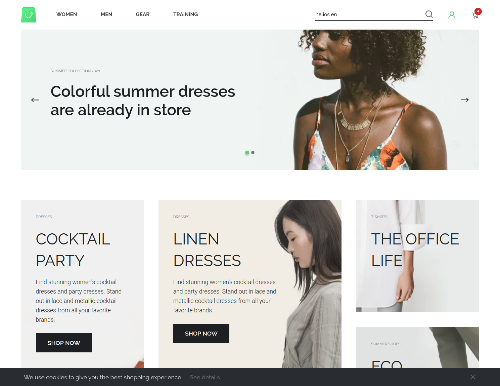
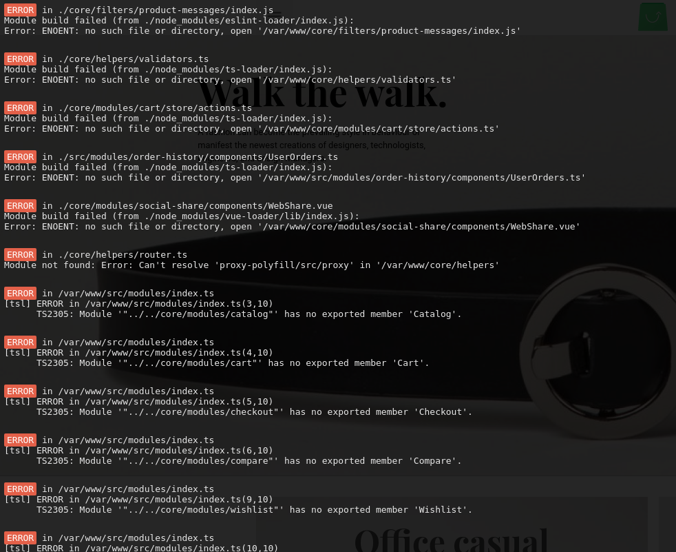
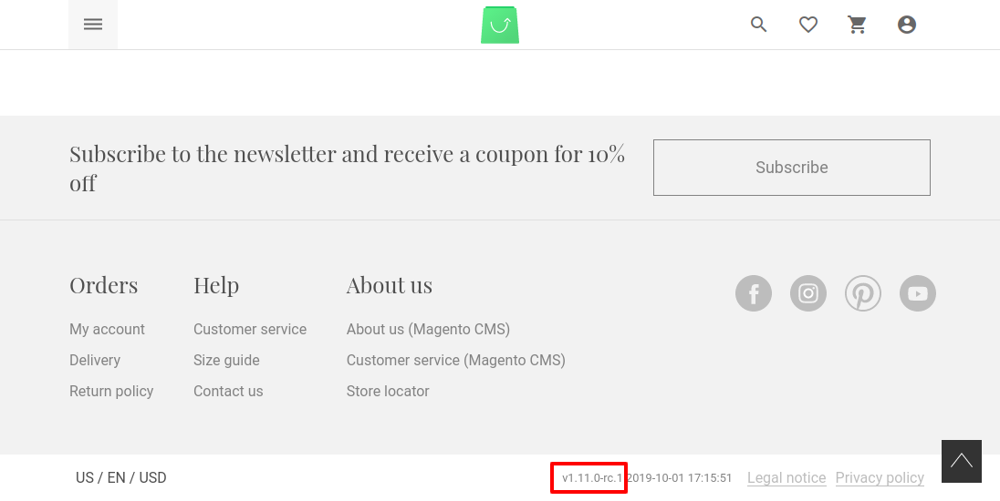
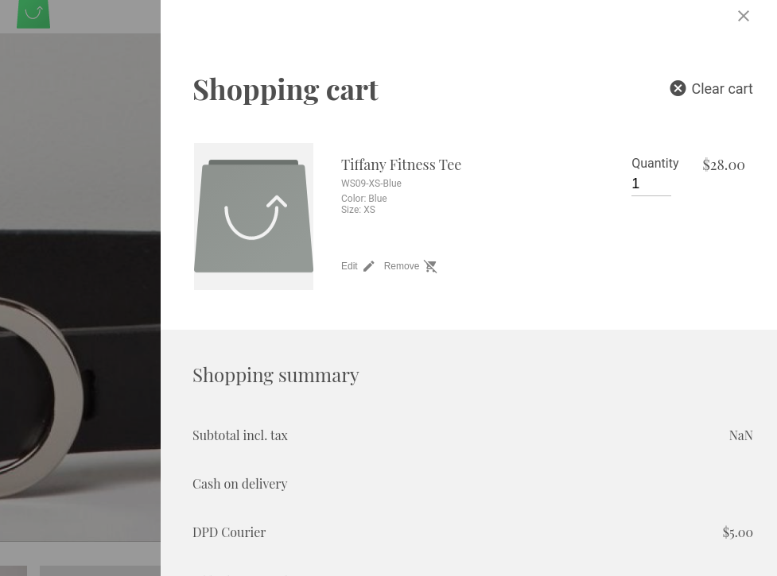

# Ch 6. Theming in depth
<style>
    h4 {
      font-weight: 400;
    }
    /*
 *
 * Diff to HTML (diff2html.css)
 * Author: rtfpessoa
 *
 */

.d2h-wrapper {
  text-align: left;
}

.d2h-file-header {
  height: 35px;
  padding: 5px 10px;
  border-bottom: 1px solid #d8d8d8;
  background-color: #f7f7f7;
}

.d2h-file-stats {
  display: flex;
  margin-left: auto;
  font-size: 14px;
}

.d2h-lines-added {
  text-align: right;
  border: 1px solid #b4e2b4;
  border-radius: 5px 0 0 5px;
  color: #399839;
  padding: 2px;
  vertical-align: middle;
}

.d2h-lines-deleted {
  text-align: left;
  border: 1px solid #e9aeae;
  border-radius: 0 5px 5px 0;
  color: #c33;
  padding: 2px;
  vertical-align: middle;
  margin-left: 1px;
}

.d2h-file-name-wrapper {
  display: flex;
  align-items: center;
  width: 100%;
  font-family: "Source Sans Pro", "Helvetica Neue", Helvetica, Arial, sans-serif;
  font-size: 15px;
}

.d2h-file-name {
  white-space: nowrap;
  text-overflow: ellipsis;
  overflow-x: hidden;
}

.d2h-file-wrapper {
  border: 1px solid #ddd;
  border-radius: 3px;
  margin-bottom: 1em;
}

.d2h-diff-table {
  width: 100%;
  border-collapse: collapse;
  font-family: "Menlo", "Consolas", monospace;
  font-size: 13px;
}

.d2h-files-diff {
  display: block;
  width: 100%;
  height: 100%;
}

.d2h-file-diff {
  overflow-y: hidden;
}

.d2h-file-side-diff {
  display: inline-block;
  overflow-x: scroll;
  overflow-y: hidden;
  width: 50%;
  margin-right: -4px;
  margin-bottom: -8px;
}

.d2h-code-line {
  display: inline-block;
  white-space: nowrap;
  /* Compensate for the absolute positioning of the line numbers */
  padding: 0 8em;
}

.d2h-code-side-line {
  display: inline-block;
  white-space: nowrap;
  /* Compensate for the absolute positioning of the line numbers */
  padding: 0 4.5em;
}

.d2h-code-line del,
.d2h-code-side-line del {
  display: inline-block;
  margin-top: -1px;
  text-decoration: none;
  background-color: #ffb6ba;
  border-radius: 0.2em;
}

.d2h-code-line ins,
.d2h-code-side-line ins {
  display: inline-block;
  margin-top: -1px;
  text-decoration: none;
  background-color: #97f295;
  border-radius: 0.2em;
  text-align: left;
}

.d2h-code-line-prefix {
  display: inline;
  background: none;
  padding: 0;
  word-wrap: normal;
  white-space: pre;
}

.d2h-code-line-ctn {
  display: inline;
  background: none;
  padding: 0;
  word-wrap: normal;
  white-space: pre;
}

.line-num1 {
  box-sizing: border-box;
  float: left;
  width: 3.5em;
  overflow: hidden;
  text-overflow: ellipsis;
  padding: 0 0.5em 0 0.5em;
  margin:0 -11px;
}

.line-num2 {
  box-sizing: border-box;
  float: right;
  width: 3.5em;
  overflow: hidden;
  text-overflow: ellipsis;
  padding: 0 0.5em 0 0.5em;
  margin:0 -11px;
}

.d2h-code-linenumber {
  box-sizing: border-box;
  width: 7.5em;
  /* Keep the numbers fixed on line contents scroll */
  position: absolute;
  display: inline-block;
  background-color: #fff;
  color: rgba(0, 0, 0, 0.3);
  text-align: right;
  border: solid #eeeeee;
  border-width: 0 1px 0 1px;
  cursor: pointer;
}

.d2h-code-linenumber:after {
  content: '\200b';
}

.d2h-code-side-linenumber {
  /* Keep the numbers fixed on line contents scroll */
  position: absolute;
  display: inline-block;
  box-sizing: border-box;
  width: 4em;
  background-color: #fff;
  color: rgba(0, 0, 0, 0.3);
  text-align: right;
  border: solid #eeeeee;
  border-width: 0 1px 0 1px;
  cursor: pointer;
  overflow: hidden;
  text-overflow: ellipsis;
}

.d2h-code-side-linenumber:after {
  content: '\200b';
}

.d2h-code-side-emptyplaceholder,
.d2h-emptyplaceholder {
  background-color: #f1f1f1;
  border-color: #e1e1e1;
}

/*
 * Changes Highlight
 */

.d2h-del {
  background-color: #fee8e9;
  border-color: #e9aeae;
}

.d2h-ins {
  background-color: #dfd;
  border-color: #b4e2b4;
}

.d2h-info {
  background-color: #f8fafd;
  color: rgba(0, 0, 0, 0.3);
  border-color: #d5e4f2;
}

.d2h-file-diff .d2h-del.d2h-change {
  background-color: #fdf2d0;
}

.d2h-file-diff .d2h-ins.d2h-change {
  background-color: #ded;
}

/*
 * File Summary List
 */

.d2h-file-list-wrapper {
  margin-bottom: 10px;
}

.d2h-file-list-wrapper a {
  text-decoration: none;
  color: #3572b0;
}

.d2h-file-list-wrapper a:visited {
  color: #3572b0;
}

.d2h-file-list-header {
  text-align: left;
}

.d2h-file-list-title {
  font-weight: bold;
}

.d2h-file-list-line {
  display: flex;
  text-align: left;
}

.d2h-file-list {
  display: block;
  list-style: none;
  padding: 0;
  margin: 0;
}

.d2h-file-list > li {
  border-bottom: #ddd solid 1px;
  padding: 5px 10px;
  margin: 0;
}

.d2h-file-list > li:last-child {
  border-bottom: none;
}

.d2h-file-switch {
  display: none;
  font-size: 10px;
  cursor: pointer;
}

.d2h-icon {
  vertical-align: middle;
  margin-right: 10px;
  fill: currentColor;
}

.d2h-deleted {
  color: #c33;
}

.d2h-added {
  color: #399839;
}

.d2h-changed {
  color: #d0b44c;
}

.d2h-moved {
  color: #3572b0;
}

.d2h-tag {
  display: flex;
  font-size: 10px;
  margin-left: 5px;
  padding: 0 2px;
  background-color: #fff;
}

.d2h-deleted-tag {
  border: #c33 1px solid;
}

.d2h-added-tag {
  border: #399839 1px solid;
}

.d2h-changed-tag {
  border: #d0b44c 1px solid;
}

.d2h-moved-tag {
  border: #3572b0 1px solid;
}

/*
 * Selection util.
 */

.selecting-left .d2h-code-line,
.selecting-left .d2h-code-line *,
.selecting-right td.d2h-code-linenumber,
.selecting-right td.d2h-code-linenumber *,
.selecting-left .d2h-code-side-line,
.selecting-left .d2h-code-side-line *,
.selecting-right td.d2h-code-side-linenumber,
.selecting-right td.d2h-code-side-linenumber * {
  -webkit-touch-callout: none;
  -webkit-user-select: none;
  -moz-user-select: none;
  -ms-user-select: none;
  user-select: none;
}

.selecting-left .d2h-code-line::-moz-selection,
.selecting-left .d2h-code-line *::-moz-selection,
.selecting-right td.d2h-code-linenumber::-moz-selection,
.selecting-left .d2h-code-side-line::-moz-selection,
.selecting-left .d2h-code-side-line *::-moz-selection,
.selecting-right td.d2h-code-side-linenumber::-moz-selection,
.selecting-right td.d2h-code-side-linenumber *::-moz-selection {
  background: transparent;
}

.selecting-left .d2h-code-line::selection,
.selecting-left .d2h-code-line *::selection,
.selecting-right td.d2h-code-linenumber::selection,
.selecting-left .d2h-code-side-line::selection,
.selecting-left .d2h-code-side-line *::selection,
.selecting-right td.d2h-code-side-linenumber::selection,
.selecting-right td.d2h-code-side-linenumber *::selection {
  background: transparent;
}

    img[alt*="borderline"] {
        border: 1px #000 solid;
    }


</style>
In this chapter, we are going to cover : 
[[toc]]


## 0. Introduction
Theme is what customers get first impression from your shop. You will be majorly discouraged if your customers underestimate your shop by looks and feels of the first impression due to poorly designed theme when you had pearls and golds in value for your customers on your shop. Great products, meticulously calibrated technology backing your store, are abysmally depreciated which impact your sales in result. We are here to help you get away with such disasters by guiding you in wrapping your head around how to deal with `theme` in _Vue Storefront_ context. Are you ready? a _Picaso_?

<!-- 
## 1. Start building your own theme
You've seen a lot of examples here and there of exquisite online shops with aesthetics. Now you want to transform your shops just the same way with much more splendor of luxuries fully filled with higher taste. But how? Ask _Vue Storefront_ core team how to do it because they did it many times before with tons of hours of reflection. What if they are busy? they certainly are. OK, then shortcut. You can inherit the base `capybara` theme and override the parts only where you want it. 

This recipe talks about how to do it.

### 1. Preparation
 - You have a [_Vue Storefront_ `1.12` App installed](/guide/cookbook/setup.html#_1-install-with-docker) on your machine.


### 2. Recipe

### 3. Peep into the kitchen (what happens internally)
### 4. Chef's secret (protip)
<br />
<br />
<br />
 -->

## 2. How to upgrade theme from 1.11 to 1.12
Here comes again! We've got a lot of stuff packed in one package full of gift to you. This time, however, is different from the past in that we came up with the whole new approach to _Vue Storefront_ by building it up from scratch and gave it a new name [_Capybara_](https://github.com/DivanteLtd/vsf-capybara). _Capybara_ is built on [Storefront UI Design System](https://www.storefrontui.io/) which employs modular approach to its smallest chunks. How versatile is that! Now that the former _default_ theme is no more default but the _Capybara_ replaces it taking the role of base theme. 

In this recipe, we will take a look at how to upgrade from `1.11` to `1.12` seamlessly with respect to themes. Changes made to your theme on `1.11` will not be taken into consideration since we will not use `default` theme but `capybara` for this recipe.

### 1. Preparation
 - You have a [_Vue Storefront_ `1.11` App installed](#_3-how-to-upgrade-theme-from-1-10-to-1-11) on your machine.
 - You have pulled `1.12` commmits from the [_Vue Storefront_ git repository](https://github.com/DivanteLtd/vue-storefront).

### 2. Recipe
1. Pull `v1.12.0` tag to the `1.11` VSF app as follows : 
```bash
git fetch 
git checkout tags/v1.12.0 -b recipe # this checkouts to v1.12.0 tag and create a [recipe] branch for this tutorial.
```


2. Change directory to `src/themes` as follows : 
```bash
cd src
mkdir themes && cd themes
```


3. Add `git` `submodule` into `themes` folder as follows : 
```bash
git submodule add https://github.com/DivanteLtd/vsf-capybara capybara
```

Now files are ready.

:::tip
If you go to root `./config` folder and open `local.json`, then you will notice `theme` node is set to `capybara` by default as follows : 
```json
  "theme": "@vue-storefront/theme-capybara",
```
:::

4. Run the app then you will see the screen as below : 
```bash
docker-compose up -d 
```




### 3. Peep into the kitchen (what happens internally)
In this recipe, we have checked out to `v1.12.0` and install `vsf-capybara` theme as a submodule to `themes` folder. And that's all it takes, it's that simple to adapt your application to new theme eco-system.

_Capybara_ theme is based on [_Storefront UI_](https://www.storefrontui.io/) and it's completely different approach from other plain themes since it's kinda an eCommerce version of _Bootstrap_ in CSS framework. All the frequently used components have been divided into their chunks in the smallest meaningful size so that users can compose those components whatever way they want it to please their purposes. Easier, Organized, Planned, all the brighter sides of modular system have been implemented into it. You can follow the best practices made by core teams by looking at how _Capybara_ is structured. 

That said, you had to say good-bye to your old `1.11` theme. [_Start building your own theme_ recipe](#_1-start-building-your-own-theme) may help you achieve complete migration of theme's customized parts in that _say good-bye_.

### 4. Chef's secret (protip)
<br />
<br />
<br />


## 3. How to upgrade theme from 1.10 to 1.11
:::warning REMINDER
This recipe assumes you will use [`default` theme](https://github.com/DivanteLtd/vsf-default) for your store which is natural because `1.11` has only one _default_ theme whose name is `default`. 

From `1.12` on, however, `default` theme becomes optional while `capybara` is _default_. 
:::

When you are already running your _Vue Storefront_ shop on production, chances are that you have made at least a few changes for your _theme_ even if you don't have developers resource. Hope you have made such changes to your child theme based on `default` theme so that normal upgrade won't make a huge impact in negative way for your shop. 

Sometimes, however, an upgrade so huge that you can't make a smooth conversion from one to another may take place. Helping you in such a case keep headaches at bay, we will show you the example where `1.10` to `1.11` upgrade affects how a theme works and fix broken pieces. 

This recipe helps you resolve errors you encounter after the upgrade as short a route as possible. There would be more warnings and small leftovers within your theme. To make a complete overhaul, look for [Migration from 1.10 to 11](/guide/cookbook/migration.html#_1-upgrade-from-1-10-to-1-11) 

### 1. Preparation
 - You have a [Vue Storefront App running](/guide/cookbook/setup.html#_0-introduction) by `docker` or `yarn dev` and watch it in your browser.
 - You have a child theme [running](/guide/cookbook/theme.html#_1-start-building-your-own-theme) on top of _Vue Storefront_ app. 
 - In this recipe, we start with _degi_ child theme based on `1.10` version (git hash : [___1b53bd2a___](https://github.com/DivanteLtd/vue-storefront/commit/1b53bd2a829f7cab571dbd3c2a4021ea46857da7)) of `default` theme. This _degi_ theme is an example you might have created for your own. Which means, you can change it to whatever you like. 
 - In other words, suppose you have a _Vue Storefront_ shop running on a child theme `degi` that was branched off from _Vue Storefront_ `default` theme version `1.10` and want to upgrade to `1.11`. 


### 1-1. Contents
There are many features added/removed/enhanced with `1.11`. This recipe deals with all of them. They are, however, too many to skim in a glance. That's why you might need this _contents_ for them. 


- Pages
  - [Home](#_3-now-we-start-hunting-down-the-culprits-one-by-one)
  - [Category](#_11-the-next-big-chunk-to-take-care-of-is-category-from-pages)
  - [Checkout](#_12-now-look-into-checkout-from-pages)
  - [Compare](#_13-next-is-compare-in-pages)
  - [MyAccount](#_14-here-comes-myaccount-in-pages)
  - [PageNotFound](#_15-another-page-pagenotfound-in-pages)
  - [Product](#_16-another-big-update-for-product-in-pages)
  - [Static](#_17-now-static-in-pages)

- Core components
  - Blocks
    - [Microcart](#_6-now-you-are-ok-with-home-page-but-there-are-still-subtle-changes-made-to-each-corner-of-the-app-let-s-find-them-out)
    - [Auth](#_18-time-to-work-on-auth-part)
      - ForgotPass
      - Login
      - Register
    - Category
      - [Sidebar](#_19-next-block-to-fix-is-category-sidebar)
    - [Checkout](#_20-next-block-to-fix-is-checkout)
      - OrderConfirmation
      - OrderReview
      - Payment
      - Product
      - Shipping
      - ThankYouPage
    - CMS
      - [Block](#_21-move-on-to-cms-block)
    - Compare
      - [AddToCompare](#_22-copy-addtocompare)
    - [Footer](#_23-time-for-footer-block)
      - Footer
      - MinimalFooter
      - NewsLetter
    - Form
      - [BaseInputNumber](#_24-baseinputnumber-needs-update)
    - [Header](#_25-header-needs-fix-too)
      - CompareIcon
      - Header
      - MicroCartIcon
      - MinimalHeader
      - WishListIcon
    - [MyAccount](#_26-myaccount-turn-is-now)
      - MyNewsLetter
      - MyOrder
      - MyOrders
      - MyProfile
      - MyShippingDetails
    - Product
      - [Related](#_27-product-related-is-ready-to-transform)
    - Reviews
      - [Reviews](#_28-reviews-is-fixed-too)
    - SearchPanel 
      - [SearchPanel](#_29-searchpanel-has-parts-to-update)
    - [SidebarMenu](#_30-sidebarmenu-wants-to-update-too)
      - SidebarMenu
      - SubCategory
    - Switcher
      - [Language](#_31-it-s-switcher-language-turn)
    - [Wishlist](#_32-let-s-look-into-wishlist-and-make-a-wish)
      - AddToWishlist
      - Product

  - [Breadcrumb](#_10-next-target-is-breadcrumb-now-breadcrumb-supports-the-multistore-feature)
  - [AddToCart](#_33-start-with-addtocart) 
  - [ColorSelector](#_34-next-is-colorselector)
  - [CookieNotification](#_35-update-cookienotification)
  - [GenericSelector](#_36-time-for-fixing-genericselector)
  - [Logo](#_37-now-it-s-logo-turn)
  - [Modal](#_38-let-s-fix-modal)
  - [NewsletterPopup](#_39-let-s-fix-newsletterpopup)
  - [OfflineBadge](#_40-offlinebadge-to-be-tackled)
  - [Overlay](#_41-overlay-needs-fix)
  - [PriceSelector](#_42-priceselector-needs-fix)
  - [ProductBundleOptions](#_43-productbundleoptions-ready-to-update)
  - [ProductCustomOptions](#_44-productcustomoptions-ready-to-update)
  - [ProductGalleryCarousel](#_45-productgallerycarousel-ready-to-update)
  - [ProductGalleryZoomCarousel](#_46-productgalleryzoomcarousel-ready-to-update)
  - [ProductImage](#_47-productimage-waits-in-line)
  - [ProductLinks](#_48-productlinks-waits-in-line)
  - [ProductQuantity](#_49-productquantity)
  - [ProductTile](#_50-producttile)
  - [SizeSelector](#_51-sizeselector)
  - [SortBy](#_52-sortby)
  - [Spinner](#_53-spinner)
  
- Theme components
  - [ButtonFull](#_54-buttonfull-in-theme)
  - [ButtonOutline](#_55-buttonoutline-in-theme)
  - [WebShare](#_56-webshare-in-theme)
  - Blocks
    - AsyncSidebar
      - [AsyncSidebar](#_57-asyncsidebar-in-theme-blocks)
    - Home
      - [Onboard](#_58-onboard-in-theme-blocks)
    - Inspirations
      - [InspirationTile](#_59-inspirationtile-in-theme-blocks)
    - Reviews
      - [ReviewsList](#_60-reviewslist-in-theme-blocks)

- [Store](#_4-add-new-files-introduced-from-1-11-as-following-path-from-the-default-theme)
  
- Other Important Files
  - [helpers/index.ts](#_61-helpers)
  - [index.js](#_61-index-js)
  - [mixins/filterMixin.ts](#_62-mixins-filtermixin-ts)
  - [package.json]
  - [router/index.js](#_63-router-index-js)
  - Resource
    - [i18n](#_64-resource-i18n)


### 2. Recipe


#### 1. Go to your _Vue Storefront_ app root directory and `git checkout` to following hash `e4959550` :

```bash
git fetch
git checkout e4959550 # origin/release/v1.11
```

:::warning NOTICE
`origin/release/v1.11` is still evolving. It might be different with the latest hash at the time of your reading. This `docs` gets updated periodically, anyway you get the idea. 
:::

#### 2. Resulting screen in your browser would somewhat look like this as sad as can be : 



#### 3. Now we start hunting down the culprits one by one. 

:::tip TIP
By the way, you can also compare the changes made between `1.10` to `1.11` in [github link](https://github.com/DivanteLtd/vue-storefront/commit/a42d480aea56d90f7ab65c5caf6ce3f49b00dfec) with a glance too.
:::

 - First target is located at `./src/themes/degi/components/core/blocks/MyAccount/MyOrders.vue`. Replace it as follows :
:::warning NOTICE
Line numbers denote the number in the file and they might not match since it assumes no modification. Think of it as an approximation reference.
:::

<div id="d-my-orders">

</div>
<script>
var myOrders = Diff2Html.getPrettyHtml('--- a/src/themes/degi/components/core/blocks/MyAccount/MyOrders.vue\n+++ b/src/themes/degi/components/core/blocks/MyAccount/MyOrders.vue\n@@ -80,7 +80,7 @@\n </template>\n \n <script>\n-import UserOrder from \'src/modules/order-history/components/UserOrders\'\n+import UserOrder from \'@vue-storefront/core/modules/order/components/UserOrdersHistory\'\n \n export default {\n   mixins: [UserOrder]\n',
  {inputFormat: 'diff', showFiles: false, matching: 'none', outputFormat: 'line-by-line'});
document.getElementById('d-my-orders').innerHTML = myOrders;
</script>


As you can see `UserOrdersHistory` has been moved to `core/modules` package. 

 - Next, go to `./src/themes/degi/pages/Home.vue` and fix it as follows : 

<div id="d-home">

</div>
<script>
var dHome = Diff2Html.getPrettyHtml(
  '--- a/src/themes/degi/pages/Home.vue\n+++ b/src/themes/degi/pages/Home.vue\n@@ -4,7 +4,7 @@\n \n     <promoted-offers />\n \n-    <section class=\"new-collection container px15\" v-if=\"everythingNewCollection && everythingNewCollection.length\">\n+    <section class=\"new-collection container px15\">\n       <div>\n         <header class=\"col-md-12\">\n',
  {inputFormat: 'diff', showFiles: false, matching: 'none', outputFormat: 'line-by-line'}
);
document.getElementById('d-home').innerHTML = dHome;
</script>

<div id="d-home-2">

</div>
<script>
var dHome2 = Diff2Html.getPrettyHtml(
  '--- a/src/themes/degi/pages/Home.vue\n+++ b/src/themes/degi/pages/Home.vue\n@@ -13,13 +13,16 @@\n         </header>\n       </div>\n       <div class=\"row center-xs\">\n-        <product-listing columns=\"4\" :products=\"everythingNewCollection\" />\n+        <lazy-hydrate :trigger-hydration=\"!loading\" v-if=\"isLazyHydrateEnabled\">\n+          <product-listing columns=\"4\" :products=\"getEverythingNewCollection\" />\n+        </lazy-hydrate>\n+        <product-listing v-else columns=\"4\" :products=\"getEverythingNewCollection\" />\n       </div>\n     </section>\n \n     <section v-if=\"isOnline\" class=\"container pb60 px15\">\n       <div class=\"row center-xs\">\n-        <header class=\"col-md-12\" :class=\"{ pt40: everythingNewCollection && everythingNewCollection.length }\">\n+        <header class=\"col-md-12\" :class=\"{ pt40: getEverythingNewCollection && getEverythingNewCollection.length }\">\n           \n',
  {inputFormat: 'diff', showFiles: false, matching: 'none', outputFormat: 'line-by-line'}
);
document.getElementById('d-home-2').innerHTML = dHome2;
</script>


There you can see `lazy-hydrate` is implemented for the better UX.


- Now, replace `36` we don't use any more with another because we now use lazy-hydrate feature :

<div id="d-home-3">

</div>
<script>
var dHome3 = Diff2Html.getPrettyHtml(
  '--- a/src/themes/degi/pages/Home.vue\n+++ b/src/themes/degi/pages/Home.vue\n@@ -33,51 +36,56 @@\n \n <script>\n // query constructor\n-import { prepareQuery } from \'@vue-storefront/core/modules/catalog/queries/common\'\n import { isServer, onlineHelper } from \'@vue-storefront/core/helpers\'\n+import LazyHydrate from \'vue-lazy-hydration\'\n \n // Core pages\n import Home from \'@vue-storefront/core/pages/Home\'\n-\n // Theme core components\n import ProductListing from \'theme/components/core/ProductListing\'\n import HeadImage from \'theme/components/core/blocks/MainSlider/HeadImage\'\n-\n // Theme local components\n import Onboard from \'theme/components/theme/blocks/Home/Onboard\'\n import PromotedOffers from \'theme/components/theme/blocks/PromotedOffers/PromotedOffers\'\n import TileLinks from \'theme/components/theme/blocks/TileLinks/TileLinks\'\n-import { Logger } from \'@vue-storefront/core/lib/logger\'\n-import { mapGetters } from \'vuex\'\n+import {Logger} from \'@vue-storefront/core/lib/logger\'\n+import {mapGetters} from \'vuex\'\n import config from \'config\'\n+import {registerModule} from \'@vue-storefront/core/lib/modules\'\n+import {RecentlyViewedModule} from \'@vue-storefront/core/modules/recently-viewed\'\n \n export default {\n+  data () {\n+    return {\n+      loading: true\n+    }\n+  },\n   mixins: [Home],\n   components: {\n     HeadImage,\n     Onboard,\n     ProductListing,\n     PromotedOffers,\n-    TileLinks\n+    TileLinks,\n+    LazyHydrate\n   },\n   computed: {\n     ...mapGetters(\'user\', [\'isLoggedIn\']),\n+    ...mapGetters(\'homepage\', [\'getEverythingNewCollection\']),\n     categories () {\n       return this.getCategories\n     },\n-    everythingNewCollection () {\n-      return this.$store.state.homepage.new_collection\n-    },\n-    coolBagsCollection () {\n-      return this.$store.state.homepage.coolbags_collection\n-    },\n     isOnline () {\n       return onlineHelper.isOnline\n+    },\n+    isLazyHydrateEnabled () {\n+      return config.ssr.lazyHydrateFor.some(\n+        field => [\'homepage\', \'homepage.new_collection\'].includes(field)\n+      )\n     }\n   },\n-  created () {\n-    // Load personal and shipping details for Checkout page from IndexedDB\n-    this.$store.dispatch(\'checkout/load\')\n+  beforeCreate () {\n+    registerModule(RecentlyViewedModule)\n   },\n   async beforeMount () {\n     if (this.$store.state.__DEMO_MODE__) {\n',
  {inputFormat: 'diff', showFiles: false, matching: 'none', outputFormat: 'line-by-line'}
);
document.getElementById('d-home-3').innerHTML = dHome3;
</script>

Because we now use `lazy-hydrate` feature. 

Additionally `recently-viewed` module is added to `Home.vue` template from `1.11`.

`loading` is required to determine if `lazy-hydrate` needs triggered

From `1.11`, _collections_ comes from `vuex` `store` using `mapGetters` helper.


- Various `actions` in separate files under `./src/themes/degi/store` replaced in-page `actions`.

We will add those files in the next step.

<div id="d-home-4">

</div>
<script>
var dHome4 = Diff2Html.getPrettyHtml(
  '--- a/src/themes/degi/pages/Home.vue\n+++ b/src/themes/degi/pages/Home.vue\n@@ -101,41 +109,19 @@ export default {\n   async asyncData ({ store, route }) { // this is for SSR purposes to prefetch data\n     Logger.info(\'Calling asyncData in Home (theme)\')()\n \n-    let newProductsQuery = prepareQuery({ queryConfig: \'newProducts\' })\n-    let coolBagsQuery = prepareQuery({ queryConfig: \'coolBags\' })\n-\n-    const newProductsResult = await store.dispatch(\'product/list\', {\n-      query: newProductsQuery,\n-      size: 8,\n-      sort: \'created_at:desc\'\n-    })\n-    if (newProductsResult) {\n-      store.state.homepage.new_collection = newProductsResult.items\n-    }\n-\n-    const coolBagsResult = await store.dispatch(\'product/list\', {\n-      query: coolBagsQuery,\n-      size: 4,\n-      sort: \'created_at:desc\',\n-      includeFields: config.entities.optimize ? (config.products.setFirstVarianAsDefaultInURL ? config.entities.productListWithChildren.includeFields : config.entities.productList.includeFields) : []\n-    })\n-    if (coolBagsResult) {\n-      store.state.homepage.coolbags_collection = coolBagsResult.items\n-    }\n-\n-    await store.dispatch(\'promoted/updateHeadImage\')\n-    await store.dispatch(\'promoted/updatePromotedOffers\')\n+    await Promise.all([\n+      store.dispatch(\'homepage/fetchNewCollection\'),\n+      store.dispatch(\'promoted/updateHeadImage\'),\n+      store.dispatch(\'promoted/updatePromotedOffers\')\n+    ])\n   },\n   beforeRouteEnter (to, from, next) {\n     if (!isServer && !from.name) { // Loading products to cache on SSR render\n-      next(vm => {\n-        let newProductsQuery = prepareQuery({ queryConfig: \'newProducts\' })\n-        vm.$store.dispatch(\'product/list\', {\n-          query: newProductsQuery,\n-          size: 8,\n-          sort: \'created_at:desc\'\n+      next(vm =>\n+        vm.$store.dispatch(\'homepage/fetchNewCollection\').then(res => {\n+          vm.loading = false\n         })\n-      })\n+      )\n     } else {\n       next()\n     }\n',
  {inputFormat: 'diff', showFiles: false, matching: 'none', outputFormat: 'line-by-line'}
);
document.getElementById('d-home-4').innerHTML = dHome4;
</script>

Again, new `actions` are used here instead of the old way. 

#### 4. Add new files introduced from `1.11` as following path from the `default` theme : 
```bash
# Assuming you are at the root directory
cd src
cp -r themes/default/store themes/degi/

# Now replace index.js to import new features and abandon deprecated ones.
cp themes/default/index.js themes/degi/index.js
```

#### 5. Open your browser once again, then your errors now be gone as follows :



#### 6. Now you are OK with _Home_ page, but there are still subtle changes made to each corner of the app. Let's find them out. 
Click the _Microcart_ icon then you will see the page like below : 


Multiple spots need attention to be fixed. We upgraded _Microcart_ to enable _Edit Mode_ on the fly. Let's fix it. 

#### 7. Copy newly added files from the `default` theme to `degi` theme :
```bash
# you are at the root directory
cd src
cp themes/default/components/core/blocks/Microcart/EditButton.vue themes/degi/components/core/blocks/Microcart/
cp themes/default/components/core/blocks/Microcart/EditMode.vue themes/degi/components/core/blocks/Microcart/
```

#### 8. Then fix files that you might have modified before upgrade. 

 - Go to `./src/themes/degi/components/core/blocks/Microcart/Microcart.vue` and fix it as follows at `3` : 

<div id="d-micro">

</div>
<script>
var dMicro = Diff2Html.getPrettyHtml(
  '--- a/src/themes/degi/components/core/blocks/Microcart/Microcart.vue\n+++ b/src/themes/degi/components/core/blocks/Microcart/Microcart.vue\n@@ -1,9 +1,12 @@\n <template>\n   <div\n-    class=\"microcart cl-accent\"\n+    class=\"microcart cl-accent relative\"\n     :class=\"[productsInCart.length ? \'bg-cl-secondary\' : \'bg-cl-primary\']\"\n     data-testid=\"microcart\"\n   >\n+    <transition name=\"fade\">\n+      <div v-if=\"isEditMode\" class=\"overlay\" @click=\"closeEditMode\" />\n+    </transition>\n     <div class=\"row bg-cl-primary px40 actions\">\n       <div class=\"col-xs end-xs\">\n         <button\n',
  {inputFormat: 'diff', showFiles: false, matching: 'none', outputFormat: 'line-by-line'}
);
document.getElementById('d-micro').innerHTML = dMicro;
</script>

This transition allows _EditMode_ overlay and also works as a toggle button. 

 - Replace `48` with below : 

<div id="d-micro-2">

</div>
<script>
var dMicro2 = Diff2Html.getPrettyHtml(
  '--- a/src/themes/degi/components/core/blocks/Microcart/Microcart.vue\n+++ b/src/themes/degi/components/core/blocks/Microcart/Microcart.vue\n@@ -46,7 +49,7 @@\n     </div>\n     <ul v-if=\"productsInCart.length\" class=\"bg-cl-primary m0 px40 pb40 products\">\n-      <product v-for=\"product in productsInCart\" :key=\"product.sku\" :product=\"product\" />\n+      <product v-for=\"product in productsInCart\" :key=\"product.checksum || product.sku\" :product=\"product\" />\n     </ul>\n     <div v-if=\"productsInCart.length\" class=\"summary px40 cl-accent serif\">\n       <h3 class=\"m0 pt40 mb30 weight-400 summary-heading\">',
  {inputFormat: 'diff', showFiles: false, matching: 'none', outputFormat: 'line-by-line'}
);
document.getElementById('d-micro-2').innerHTML = dMicro2;
</script> 

Now, `product.checksum` can be used as a key

 - Fix it at `125` :

<div id="d-micro-3">

</div>
<script>
var dMicro3 = Diff2Html.getPrettyHtml(
  '--- a/src/themes/degi/components/core/blocks/Microcart/Microcart.vue\n+++ b/src/themes/degi/components/core/blocks/Microcart/Microcart.vue\n@@ -121,19 +124,22 @@\n </template>\n \n <script>\n+import { mapGetters, mapActions } from \'vuex\'\n import i18n from \'@vue-storefront/i18n\'\n-import { isModuleRegistered } from \'@vue-storefront/core/lib/module\'\n+import { isModuleRegistered } from \'@vue-storefront/core/lib/modules\'\n \n-import Microcart from \'@vue-storefront/core/compatibility/components/blocks/Microcart/Microcart\'\n import VueOfflineMixin from \'vue-offline/mixin\'\n import onEscapePress from \'@vue-storefront/core/mixins/onEscapePress\'\n import InstantCheckout from \'src/modules/instant-checkout/components/InstantCheckout.vue\'\n+import { registerModule } from \'@vue-storefront/core/lib/modules\'\n \n import BaseInput from \'theme/components/core/blocks/Form/BaseInput\'\n import ClearCartButton from \'theme/components/core/blocks/Microcart/ClearCartButton\'\n import ButtonFull from \'theme/components/theme/ButtonFull\'\n import ButtonOutline from \'theme/components/theme/ButtonOutline\'\n import Product from \'theme/components/core/blocks/Microcart/Product\'\n+import EditMode from \'./EditMode\'\n+import { InstantCheckoutModule } from \'src/modules/instant-checkout\'\n \n export default {\n   components: {\n',
  {inputFormat: 'diff', showFiles: false, matching: 'none', outputFormat: 'line-by-line'}
);
document.getElementById('d-micro-3').innerHTML = dMicro3;
</script> 


Importing new features while removing deprecated ones.

 - Change `mixins` at `148` : 

<div id="d-micro-4">

</div>
<script>
var dMicro4 = Diff2Html.getPrettyHtml(
  '--- a/src/themes/degi/components/core/blocks/Microcart/Microcart.vue\n+++ b/src/themes/degi/components/core/blocks/Microcart/Microcart.vue\n@@ -145,8 +151,8 @@ export default {\n     InstantCheckout\n   },\n   mixins: [\n-    Microcart,\n     VueOfflineMixin,\n+    EditMode,\n     onEscapePress\n   ],\n   data () {\n@@ -154,7 +160,7 @@ export default {\n       addCouponPressed: false,\n       couponCode: \'\',\n       componentLoaded: false,\n-      isInstantCheckoutRegistered: isModuleRegistered(\'instant-checkout\')\n+      isInstantCheckoutRegistered: isModuleRegistered(\'InstantCheckoutModule\')\n     }\n   },\n   props: {\n',
  {inputFormat: 'diff', showFiles: false, matching: 'none', outputFormat: 'line-by-line'}
);
document.getElementById('d-micro-4').innerHTML = dMicro4;
</script> 

 - Add _functions_ and fix _methods_ at around `166` :

<div id="d-micro-5">

</div>
<script>
var dMicro5 = Diff2Html.getPrettyHtml(
  '--- a/src/themes/degi/components/core/blocks/Microcart/Microcart.vue\n+++ b/src/themes/degi/components/core/blocks/Microcart/Microcart.vue\n@@ -164,19 +170,36 @@ export default {\n       default: () => false\n     }\n   },\n+  beforeCreate () {\n+    registerModule(InstantCheckoutModule)\n+  },\n   mounted () {\n     this.$nextTick(() => {\n       this.componentLoaded = true\n     })\n   },\n+  computed: {\n+    ...mapGetters({\n+      productsInCart: \'cart/getCartItems\',\n+      appliedCoupon: \'cart/getCoupon\',\n+      totals: \'cart/getTotals\',\n+      isOpen: \'cart/getIsMicroCartOpen\'\n+    })\n+  },\n   methods: {\n+    ...mapActions({\n+      applyCoupon: \'cart/applyCoupon\'\n+    }),\n     addDiscountCoupon () {\n       this.addCouponPressed = true\n     },\n     clearCoupon () {\n-      this.removeCoupon()\n+      this.$store.dispatch(\'cart/removeCoupon\')\n       this.addCouponPressed = false\n     },\n+    toggleMicrocart () {\n+      this.$store.dispatch(\'ui/toggleMicrocart\')\n+    },\n     async setCoupon () {\n       const couponApplied = await this.applyCoupon(this.couponCode)\n       this.addCouponPressed = false\n@@ -190,12 +213,12 @@ export default {\n       }\n     },\n     closeMicrocartExtend () {\n-      this.closeMicrocart()\n+      this.toggleMicrocart()\n       this.$store.commit(\'ui/setSidebar\', false)\n       this.addCouponPressed = false\n     },\n     onEscapePress () {\n-      this.closeMicrocart()\n+      this.toggleMicrocart()\n     },\n     clearCart () {\n       this.$store.dispatch(\'notification/spawnNotification\', {',
  {inputFormat: 'diff', showFiles: false, matching: 'none', outputFormat: 'line-by-line'}
);
document.getElementById('d-micro-5').innerHTML = dMicro5;
</script> 

Here, you can see `InstantCheckoutModule` is registered at `beforeCreate`.

`mapGetters` helper is used for getting `vuex` `actions`. [more info](https://stackoverflow.com/questions/49696542/differences-b-n-mapstate-mapgetters-mapactions-mapmutations-in-vuex) on `vuex` _helpers_

 - Last but not least for the file, add some styles inside _\<style\>\</style\>_ tag at around `311` : 

<div id="d-micro-6">

</div>
<script>
var dMicro6 = Diff2Html.getPrettyHtml(
  '--- a/src/themes/degi/components/core/blocks/Microcart/Microcart.vue\n+++ b/src/themes/degi/components/core/blocks/Microcart/Microcart.vue\n@@ -308,4 +331,22 @@ export default {\n       width: 100%;\n     }\n   }\n+\n+  .overlay {\n+    top: 0;\n+    bottom: 0;\n+    left: 0;\n+    right: 0;\n+    position: absolute;\n+    z-index: 0;\n+    height: 100%;\n+    background:rgba(0, 0, 0, 0.4);\n+  }\n+\n+  .fade-enter-active, .fade-leave-active {\n+    transition: opacity .4s;\n+  }\n+  .fade-enter, .fade-leave-to {\n+    opacity: 0;\n+  }\n </style>\n',
  {inputFormat: 'diff', showFiles: false, matching: 'none', outputFormat: 'line-by-line'}
);
document.getElementById('d-micro-6').innerHTML = dMicro6;
</script> 

 - Another big change has been made to `./src/themes/degi/components/core/blocks/Microcart/Product.vue`. 

Start with replacing _template_ at `2` as follows :

<div id="d-micro-prod-1">

</div>
<script>
var dMicroProd1 = Diff2Html.getPrettyHtml('--- a/src/themes/degi/components/core/blocks/Microcart/Product.vue\n+++ b/src/themes/degi/components/core/blocks/Microcart/Product.vue\n@@ -1,131 +1,312 @@\n <template>\n-  <li class=\"row flex-nowrap py10\">\n-    <div>\n+  <li class=\"row py10 bg-cl-white\" :class=\"{ \'relative\': editMode }\">\n+    <div class=\"mx10 w-100 py10 mb15 edit-mode flex between-xs middle-xs\" v-if=\"editMode\">\n+      Edit mode\n+      <button class=\"brdr-none bg-cl-transparent\" @click=\"closeEditMode\">\n+        <span class=\"cl-accent\">\n+          <i class=\"material-icons cl-accent mr5\">\n+            close\n+          </i>\n+        </span>\n+      </button>\n+    </div>\n+    <div class=\"blend\">\n       <div class=\"ml10 bg-cl-secondary\">\n         <product-image :image=\"image\" />\n       </div>\n     </div>\n-    <div class=\"col-xs flex pl35 py15 start-xs between-sm details\">\n-      <div>\n-        <router-link\n-          class=\"serif h4 name\"\n-          :to=\"localizedRoute({\n-            name: product.type_id + \'-product\',\n-            params: {\n-              parentSku: product.parentSku ? product.parentSku : product.sku,\n-              slug: product.slug,\n-              childSku: product.sku\n-            }\n-          })\"\n-          data-testid=\"productLink\"\n-          @click.native=\"$store.commit(\'ui/setMicrocart\', false)\"\n-        >\n-          {\{ product.name | htmlDecode }\}\n-        </router-link>\n-        <div class=\"h6 cl-bg-tertiary pt5 sku\" data-testid=\"productSku\">\n-          {\{ product.sku }\}\n-        </div>\n-        <div class=\"h6 cl-bg-tertiary pt5 options\" v-if=\"isOnline && product.totals && product.totals.options\">\n-          <div v-for=\"opt in product.totals.options\" :key=\"opt.label\">\n-            <span class=\"opn\">{\{ opt.label }\}: </span>\n-            <span class=\"opv\" v-html=\"opt.value\" />\n+    <div class=\"col-xs pt15 flex pl35 flex-wrap\">\n+      <div class=\"flex flex-nowrap details\">\n+        <div class=\"flex w-100 flex-wrap between-xs\">\n+          <div>\n+            <router-link\n+              class=\"serif h4 name\"\n+              :to=\"productLink\"\n+              data-testid=\"productLink\"\n+              @click.native=\"$store.commit(\'ui/setMicrocart\', false)\"\n+            >\n+              {\{ product.name | htmlDecode }\}\n+            </router-link>\n+            <div class=\"h6 cl-bg-tertiary pt5 sku\" data-testid=\"productSku\">\n+              {\{ product.sku }\}\n+            </div>\n+            <div class=\"h6 cl-bg-tertiary pt5 options\" v-if=\"isTotalsActive\">\n+              <div v-for=\"opt in product.totals.options\" :key=\"opt.label\">\n+                <span class=\"opn\">{\{ opt.label }\}: </span>\n+                <span class=\"opv\" v-html=\"opt.value\" />\n+              </div>\n+            </div>\n+            <div class=\"h6 cl-bg-tertiary pt5 options\" v-else-if=\"!editMode && product.options\">\n+              <div v-for=\"opt in product.options\" :key=\"opt.label\">\n+                <span class=\"opn\">{\{ opt.label }\}: </span>\n+                <span class=\"opv\" v-html=\"opt.value\" />\n+              </div>\n+            </div>\n+            <div class=\"h6 pt5 cl-error\" v-if=\"hasProductErrors\">\n+              {\{ product.errors | formatProductMessages }\}\n+            </div>\n+            <div class=\"h6 pt5 cl-success\" v-if=\"hasProductInfo && !hasProductErrors\">\n+              {\{ product.info | formatProductMessages }\}\n+            </div>\n           </div>\n+          <product-quantity\n+            class=\"h5 cl-accent lh25 qty\"\n+            v-if=\"product.type_id !== \'grouped\' && product.type_id !== \'bundle\'\"\n+            :value=\"productQty\"\n+            :max-quantity=\"maxQuantity\"\n+            :loading=\"isStockInfoLoading\"\n+            :is-simple-or-configurable=\"isSimpleOrConfigurable\"\n+            @input=\"updateProductQty\"\n+            @error=\"handleQuantityError\"\n+          />\n         </div>\n-        <div class=\"h6 cl-bg-tertiary pt5 options\" v-else-if=\"product.options\">\n-          <div v-for=\"opt in product.options\" :key=\"opt.label\">\n-            <span class=\"opn\">{\{ opt.label }\}: </span>\n-            <span class=\"opv\" v-html=\"opt.value\" />\n+        <div class=\"flex mr10 align-right start-xs between-sm prices\">\n+          <div class=\"prices\" v-if=\"!displayItemDiscounts || !isOnline\">\n+            <span class=\"h4 serif cl-error price-special\" v-if=\"product.special_price\">\n+              {\{ product.price_incl_tax * product.qty | price }\}\n+            </span>\n+            <span class=\"h6 serif price-original\" v-if=\"product.special_price\">\n+              {\{ product.original_price_incl_tax * product.qty | price }\}\n+            </span>\n+            <span class=\"h4 serif price-regular\" v-else data-testid=\"productPrice\">\n+              {\{ (product.original_price_incl_tax ? product.original_price_incl_tax : product.price_incl_tax) * product.qty | price }\}\n+            </span>\n+          </div>\n+          <div class=\"prices\" v-else-if=\"isOnline && product.totals\">\n+            <span class=\"h4 serif cl-error price-special\" v-if=\"product.totals.discount_amount\">\n+              {\{ product.totals.row_total - product.totals.discount_amount + product.totals.tax_amount | price }\}\n+            </span>\n+            <span class=\"h6 serif price-original\" v-if=\"product.totals.discount_amount\">\n+              {\{ product.totals.row_total_incl_tax | price }\}\n+            </span>\n+            <span class=\"h4 serif price-regular\" v-if=\"!product.totals.discount_amount\">\n+              {\{ product.totals.row_total_incl_tax | price }\}\n+            </span>\n+          </div>\n+          <div class=\"prices\" v-else>\n+            <span class=\"h4 serif price-regular\">\n+              {\{ (product.regular_price || product.price_incl_tax) * product.qty | price }\}\n+            </span>\n           </div>\n         </div>\n-        <div class=\"h6 pt5 cl-error\" v-if=\"product.errors && Object.keys(product.errors).length > 0\">\n-          {\{ product.errors | formatProductMessages }\}\n-        </div>\n-        <div class=\"h6 pt5 cl-success\" v-if=\"product.info && Object.keys(product.info).length > 0 && Object.keys(product.errors).length === 0\">\n-          {\{ product.info | formatProductMessages }\}\n-        </div>\n-      </div>\n-      <div class=\"h5 pt5 cl-accent lh25 qty\">\n-        <base-input-number\n-          :name=\"$t(\'Quantity\')\"\n-          :value=\"product.qty\"\n-          @input=\"updateQuantity\"\n-          :min=\"1\"\n-        />\n-      </div>\n-    </div>\n-    <div class=\"flex py15 mr10 align-right start-xs between-sm actions\">\n-      <div class=\"prices\" v-if=\"!displayItemDiscounts || !isOnline\">\n-        <span class=\"h4 serif cl-error price-special\" v-if=\"product.special_price\">\n-          {\{ product.priceInclTax * product.qty | price }\}&nbsp;\n-        </span>\n-        <span class=\"h6 serif price-original\" v-if=\"product.special_price\">\n-          {\{ product.originalPriceInclTax * product.qty | price }\}\n-        </span>\n-        <span class=\"h4 serif price-regular\" v-else data-testid=\"productPrice\">\n-          {\{ (product.originalPriceInclTax ? product.originalPriceInclTax : product.priceInclTax) * product.qty | price }\}\n-        </span>\n-      </div>\n-      <div class=\"prices\" v-else-if=\"isOnline && product.totals\">\n-        <span class=\"h4 serif cl-error price-special\" v-if=\"product.totals.discount_amount\">\n-          {\{ product.totals.row_total - product.totals.discount_amount + product.totals.tax_amount | price }\}&nbsp;\n-        </span>\n-        <span class=\"h6 serif price-original\" v-if=\"product.totals.discount_amount\">\n-          {\{ product.totals.row_total_incl_tax | price }\}\n-        </span>\n-        <span class=\"h4 serif price-regular\" v-if=\"!product.totals.discount_amount\">\n-          {\{ product.totals.row_total_incl_tax | price }\}\n-        </span>\n-      </div>\n-      <div class=\"prices\" v-else>\n-        <span class=\"h4 serif price-regular\">\n-          {\{ product.regular_price * product.qty | price }\}\n-        </span>\n       </div>\n-      <div class=\"links\">\n-        <div class=\"mt5\" @click=\"removeItem\">\n-          <remove-button />\n+      <div class=\"w-100 pb15 flex flex-wrap bottom-xs\" v-if=\"editMode\">\n+        <div class=\"ml0 flex flex-wrap filters\" v-if=\"productsAreReconfigurable\">\n+          <div class=\"h5 pt5 w-100\" v-for=\"(option, index) in product.configurable_options\" :key=\"index\">\n+            <div class=\"h6 cl-bg-tertiary mr10\">\n+              {\{ option.label }\}:\n+            </div>\n+            <div class=\"flex flex-wrap pt5\" v-if=\"option.label == \'Color\' && editMode\">\n+              <color-selector\n+                v-for=\"filter in getAvailableFilters[option.attribute_code]\"\n+                v-if=\"isOptionAvailable(filter)\"\n+                :key=\"filter.id\"\n+                :variant=\"filter\"\n+                :selected-filters=\"getSelectedOptions\"\n+                @change=\"changeEditModeFilter\"\n+              />\n+            </div>\n+            <div class=\"flex flex-wrap pt5\" v-else-if=\"option.label == \'Size\' && editMode\">\n+              <size-selector\n+                class=\"mr10 mb10\"\n+                v-for=\"filter in getAvailableFilters[option.attribute_code]\"\n+                v-if=\"isOptionAvailable(filter)\"\n+                :key=\"filter.id\"\n+                :variant=\"filter\"\n+                :selected-filters=\"getSelectedOptions\"\n+                @change=\"changeEditModeFilter\"\n+              />\n+            </div>\n+          </div>\n         </div>\n+        <button-full\n+          class=\"update-button mb10 mr10\"\n+          @click.native=\"updateProductVariant\"\n+          :disabled=\"isUpdateCartDisabled\"\n+        >\n+          {\{ $t(\'Update item\') }\}\n+        </button-full>\n+      </div>\n+      <div class=\"w-100 flex middle-xs actions\" v-if=\"!editMode\">\n+        <edit-button class=\"mx5\" @click=\"openEditMode\" v-if=\"productsAreReconfigurable && !editMode\" />\n+        <remove-button class=\"mx5\" @click=\"removeItem\" />\n       </div>\n     </div>\n   </li>\n </template>\n',
  {inputFormat: 'diff', showFiles: false, matching: 'none', outputFormat: 'line-by-line'}
);
document.getElementById('d-micro-prod-1').innerHTML = dMicroProd1;
</script> 

Here we replaced template.

 - Now fix script as follows at `135` : 

<div id="d-micro-prod-2">

</div>
<script>
var dMicroProd2 = Diff2Html.getPrettyHtml(
  '--- a/src/themes/degi/components/core/blocks/Microcart/Product.vue\n+++ b/src/themes/degi/components/core/blocks/Microcart/Product.vue\n@@ -1,131 +1,312 @@\n <script>\n+import { mapActions } from \'vuex\'\n import config from \'config\'\n+import { currentStoreView } from \'@vue-storefront/core/lib/multistore\'\n+import { formatProductLink } from \'@vue-storefront/core/modules/url/helpers\'\n import Product from \'@vue-storefront/core/compatibility/components/blocks/Microcart/Product\'\n \n+import ProductQuantity from \'theme/components/core/ProductQuantity.vue\'\n import ProductImage from \'theme/components/core/ProductImage\'\n+import ColorSelector from \'theme/components/core/ColorSelector.vue\'\n+import SizeSelector from \'theme/components/core/SizeSelector.vue\'\n import RemoveButton from \'./RemoveButton\'\n-import BaseInputNumber from \'theme/components/core/blocks/Form/BaseInputNumber\'\n+import EditButton from \'./EditButton\'\n import { onlineHelper } from \'@vue-storefront/core/helpers\'\n+import { ProductOption } from \'@vue-storefront/core/modules/catalog/components/ProductOption\'\n+import { getThumbnailForProduct, getProductConfiguration } from \'@vue-storefront/core/modules/cart/helpers\'\n+import ButtonFull from \'theme/components/theme/ButtonFull\'\n+import EditMode from \'./EditMode\'\n \n export default {\n+  data () {\n+    return {\n+      maxQuantity: 0,\n+      quantityError: false,\n+      isStockInfoLoading: false\n+    }\n+  },\n+  props: {\n+    product: {\n+      type: Object,\n+      required: true\n+    }\n+  },\n   components: {\n     RemoveButton,\n-    BaseInputNumber,\n-    ProductImage\n+    ProductImage,\n+    ColorSelector,\n+    SizeSelector,\n+    EditButton,\n+    ButtonFull,\n+    ProductQuantity\n   },\n-  mixins: [Product],\n+  mixins: [Product, ProductOption, EditMode],\n   computed: {\n+    hasProductInfo () {\n+      return this.product.info && Object.keys(this.product.info).length > 0\n+    },\n+    hasProductErrors () {\n+      return this.product.errors && Object.keys(this.product.errors).length > 0\n+    },\n+    isTotalsActive () {\n+      return this.isOnline && !this.editMode && this.product.totals && this.product.totals.options\n+    },\n     isOnline () {\n       return onlineHelper.isOnline\n     },\n+    productsAreReconfigurable () {\n+      return config.cart.productsAreReconfigurable && this.product.type_id === \'configurable\' && this.isOnline\n+    },\n+    displayItemDiscounts () {\n+      return config.cart.displayItemDiscounts\n+    },\n     image () {\n       return {\n         loading: this.thumbnail,\n         src: this.thumbnail\n       }\n+    },\n+    thumbnail () {\n+      return getThumbnailForProduct(this.product)\n+    },\n+    configuration () {\n+      return getProductConfiguration(this.product)\n+    },\n+    productLink () {\n+      return formatProductLink(this.product, currentStoreView().storeCode)\n+    },\n+    editMode () {\n+      return this.getEditingProductId === this.product.id\n+    },\n+    productQty () {\n+      return this.editMode ? this.getEditingQty : this.product.qty\n+    },\n+    isSimpleOrConfigurable () {\n+      return [\'simple\', \'configurable\'].includes(this.product.type_id)\n+    },\n+    isUpdateCartDisabled () {\n+      return this.quantityError ||\n+        this.isStockInfoLoading ||\n+        (this.isOnline && !this.maxQuantity && this.isSimpleOrConfigurable)\n     }\n   },\n-  data () {\n-    return {\n-      displayItemDiscounts: config.cart.displayItemDiscounts\n+  methods: {\n+    updateProductVariant () {\n+      this.updateVariant()\n+      this.closeEditMode()\n+    },\n+    updateProductQty (qty) {\n+      if (this.editMode) {\n+        this.editModeSetQty(qty)\n+        return\n+      }\n+\n+      this.updateQuantity(qty)\n+    },\n+    removeFromCart () {\n+      this.$store.dispatch(\'cart/removeItem\', { product: this.product })\n+    },\n+    updateQuantity (quantity) {\n+      this.$store.dispatch(\'cart/updateQuantity\', { product: this.product, qty: quantity })\n+    },\n+    async getQuantity (product) {\n+      if (this.isStockInfoLoading) return // stock info is already loading\n+      this.isStockInfoLoading = true\n+      try {\n+        const validProduct = product || this.product\n+        const res = await this.$store.dispatch(\'stock/check\', {\n+          product: validProduct,\n+          qty: this.productQty\n+        })\n+        return res.qty\n+      } finally {\n+        this.isStockInfoLoading = false\n+      }\n+    },\n+    handleQuantityError (error) {\n+      this.quantityError = error\n+    },\n+    async changeEditModeFilter (filter) {\n+      const editedProduct = this.getEditedProduct(filter)\n+      const maxQuantity = await this.getQuantity(editedProduct)\n+      if (!maxQuantity) {\n+        this.$store.dispatch(\'notification/spawnNotification\', {\n+          type: \'error\',\n+          message: this.$t(\n+            \'The product is out of stock and cannot be added to the cart!\'\n+          ),\n+          action1: { label: this.$t(\'OK\') }\n+        })\n+      } else if (maxQuantity < this.productQty) {\n+        this.$store.dispatch(\'notification/spawnNotification\', {\n+          type: \'error\',\n+          message: this.$t(\'Only {maxQuantity} products of this type are available!\', { maxQuantity }),\n+          action1: { label: this.$t(\'OK\') }\n+        })\n+      } else {\n+        this.maxQuantity = maxQuantity\n+        this.editModeSetFilters(filter)\n+      }\n+    }\n+  },\n+  watch: {\n+    isOnline: {\n+      async handler (isOnline) {\n+        if (isOnline) {\n+          const maxQuantity = await this.getQuantity()\n+          this.maxQuantity = maxQuantity\n+        }\n+      },\n+      immediate: true\n     }\n   }\n }\n<\/script>',
  {inputFormat: 'diff', showFiles: false, matching: 'none', outputFormat: 'line-by-line'}
);
document.getElementById('d-micro-prod-2').innerHTML = dMicroProd2;
</script> 


As you can see here, we added `EditMode` in _Microcart_. Many things were considered in doing so, e.g. `color`, `size`, `option`, _multistores_ and so on. 


 - Time to fix _styles_ : 


<div id="d-micro-prod-3">

</div>
<script>
var dMicroProd3 = Diff2Html.getPrettyHtml(
  '--- a/src/themes/degi/components/core/blocks/Microcart/Product.vue\n+++ b/src/themes/degi/components/core/blocks/Microcart/Product.vue\n@@ -1,131 +1,312 @@ <style lang=\"scss\" scoped>\n+@import \'~theme/css/variables/colors\';\n+@import \'~theme/css/helpers/functions/color\';\n+  .blend {\n+    flex: 0 0 150px;\n+  }\n+\n   .image {\n     mix-blend-mode: multiply;\n     vertical-align: top;\n@@ -136,10 +317,9 @@ export default {\n   }\n \n   .details {\n-    flex-direction: column;\n-    @media (max-width: 767px) {\n-      padding: 0 10px 0 20px;\n-    }\n+    flex: 1 1 auto;\n+    display: flex;\n+    flex-flow: row wrap;\n   }\n \n   .name {\n@@ -155,22 +335,23 @@ export default {\n   }\n \n   .qty {\n+    padding-right: 30px;\n+\n     @media (max-width: 767px) {\n       font-size: 12px;\n     }\n   }\n \n   .actions {\n+    margin: 0 -5px;\n+  }\n+\n+  .prices {\n     flex-direction: column;\n     @media (max-width: 767px) {\n       padding: 0;\n       font-size: 12px;\n     }\n-    .links {\n-      @media (max-width: 767px) {\n-        margin-top: 20px;\n-      }\n-    }\n   }\n \n   .price-special {\n@@ -183,12 +364,6 @@ export default {\n     text-decoration: line-through;\n   }\n \n-  .price-regular {\n-    @media (max-width: 767px) {\n-      font-size: 14px;\n-    }\n-  }\n-\n   input {\n     width: 30px;\n   }\n@@ -196,4 +371,23 @@ export default {\n   .flex-nowrap {\n     flex-wrap: nowrap;\n   }\n+\n+  .flex-wrap {\n+    flex-wrap: wrap;\n+  }\n+\n+  .edit-mode {\n+    border-bottom: 1px solid color(white-smoke);\n+  }\n+\n+  .filters {\n+    flex: 1 1 200px;\n+  }\n+\n+  .update-button {\n+    font-size: 14px;\n+    min-width: 150px;\n+    width: 150px;\n+    padding: 10px;\n+  }\n </style>',
  {inputFormat: 'diff', showFiles: false, matching: 'none', outputFormat: 'line-by-line'}
);
document.getElementById('d-micro-prod-3').innerHTML = dMicroProd3;
</script> 


 - Move on to next file `./src/themes/degi/components/core/blocks/Microcart/RemoveButton.vue` and fix it at `2` as follows : 


<div id="d-micro-remove">

</div>
<script>
var dMicroRemove = Diff2Html.getPrettyHtml(
  '--- a/src/themes/degi/components/core/blocks/Microcart/RemoveButton.vue\n+++ b/src/themes/degi/components/core/blocks/Microcart/RemoveButton.vue\n@@ -1,5 +1,5 @@\n <template>\n-  <button class=\"brdr-none bg-cl-transparent p0 middle-xs inline-flex cl-secondary\">\n+  <button @click=\"$emit(\'click\')\" class=\"brdr-none bg-cl-transparent p0 middle-xs inline-flex cl-secondary\">\n     <span class=\"hidden-xs h6\">\n       {\{ $t(\'Remove\') }\}\n     </span>\n',
  {inputFormat: 'diff', showFiles: false, matching: 'none', outputFormat: 'line-by-line'}
);
document.getElementById('d-micro-remove').innerHTML = dMicroRemove;
</script>


Here we added _Vue_ click event.

#### 9. Let's confirm if we got it right so far on your browser. Open it then _Voila !_ : 



Now you can edit options for your products in _Microcart_.


#### 10. Next target is _Breadcrumb_. Now _Breadcrumb_ supports the multistore feature. 

 - Open `./src/themes/degi/components/core/Breadcrumbs.vue` and fix them as follows : 


<div id="d-bread">

</div>
<script>
var dBread = Diff2Html.getPrettyHtml(
  '--- a/src/themes/degi/components/core/Breadcrumbs.vue\n+++ b/src/themes/degi/components/core/Breadcrumbs.vue\n@@ -1,20 +1,52 @@\n <template>\n   <div class=\"breadcrumbs h5 cl-gray\">\n-    <span v-for=\"link in routes\" :key=\"link.route_link\">\n-      <router-link :to=\"localizedRoute(link.route_link)\">\n+    <span v-for=\"link in paths\" :key=\"link.route_link\">\n+      <router-link :to=\"link.route_link\">\n         {\{ link.name | htmlDecode }\}\n       </router-link> /\n     </span>\n     <span class=\"cl-mine-shaft\">\n-      {\{ activeRoute | htmlDecode }\}\n+      {\{ current | htmlDecode }\}\n     </span>\n   </div>\n </template>\n \n <script>\n-import Breadcrumbs from \'@vue-storefront/core/compatibility/components/Breadcrumbs\'\n+import { localizedRoute, currentStoreView } from \'@vue-storefront/core/lib/multistore\'\n+import i18n from \'@vue-storefront/i18n\'\n \n export default {\n-  mixins: [Breadcrumbs]\n+  computed: {\n+    paths () {\n+      const routes = this.routes ? this.routes : this.$store.state.breadcrumbs.routes\n+\n+      if (this.withHomepage) {\n+        return [\n+          { name: i18n.t(\'Homepage\'), route_link: localizedRoute(\'/\', currentStoreView().storeCode) },\n+          ...routes\n+        ]\n+      }\n+\n+      return routes\n+    },\n+    current () {\n+      return this.activeRoute || this.$store.state.breadcrumbs.current\n+    }\n+  },\n+  props: {\n+    routes: {\n+      type: Array,\n+      required: false,\n+      default: null\n+    },\n+    withHomepage: {\n+      type: Boolean,\n+      default: false\n+    },\n+    activeRoute: {\n+      type: String,\n+      default: \'\'\n+    }\n+  }\n }\n <\/script>\n',
  {inputFormat: 'diff', showFiles: false, matching: 'none', outputFormat: 'line-by-line'}
);
document.getElementById('d-bread').innerHTML = dBread;
</script>

 As you can see, `paths` are _computed_ for allocating storeviews. Now clicking on a breadcrumb link brings you to the link of designated storeview as it's supposed to.

#### 11. The next big chunk to take care of is _Category_ from _pages_.

 - Go to `./src/themes/degi/pages/Category.vue` and overhaul it as follows : 


<div id="d-cate">

</div>
<script>
var dCategory = Diff2Html.getPrettyHtml(
  '--- a/src/themes/degi/pages/Category.vue\n+++ b/src/themes/degi/pages/Category.vue\n@@ -2,17 +2,21 @@\n   <div id=\"category\">\n     <header class=\"bg-cl-secondary py35 pl20\">\n       <div class=\"container\">\n-        <breadcrumbs :routes=\"breadcrumbs.routes\" :active-route=\"category.name\" />\n+        <breadcrumbs :routes=\"getBreadcrumbs\" :active-route=\"getCurrentCategory.name\" />\n         <div class=\"row middle-sm\">\n           <h1 class=\"col-sm-8 category-title mb10\">\n-            {\{ category.name }\}\n+            {\{ getCurrentCategory.name }\}\n           </h1>\n           <div class=\"sorting col-sm-2 align-right mt50\">\n             <label class=\"mr10\">{\{ $t(\'Columns\') }\}:</label>\n             <columns @change-column=\"columnChange\" />\n           </div>\n           <div class=\"sorting col-sm-2 align-right mt50\">\n-            <sort-by :has-label=\"true\" />\n+            <sort-by\n+              :has-label=\"true\"\n+              @change=\"changeFilter\"\n+              :value=\"getCurrentSearchQuery.sort\"\n+            />\n           </div>\n         </div>\n       </div>\n@@ -25,7 +29,10 @@\n             {\{ $t(\'Filters\') }\}\n           </button>\n           <div class=\"mobile-sorting col-xs-6 mt25\">\n-            <sort-by />\n+            <sort-by\n+              @change=\"changeFilter\"\n+              :value=\"getCurrentSearchQuery.sort\"\n+            />\n           </div>\n         </div>\n       </div>\n@@ -33,13 +40,13 @@\n     <div class=\"container pb60\">\n       <div class=\"row m0 pt15\">\n         <div class=\"col-md-3 start-xs category-filters\">\n-          <sidebar :filters=\"filters.available\" />\n+          <sidebar :filters=\"getAvailableFilters\" @changeFilter=\"changeFilter\" />\n         </div>\n         <div class=\"col-md-3 start-xs mobile-filters\" v-show=\"mobileFilters\">\n           <div class=\"close-container absolute w-100\">\n             <i class=\"material-icons p15 close cl-accent\" @click=\"closeFilters\">close</i>\n           </div>\n-          <sidebar class=\"mobile-filters-body\" :filters=\"filters.available\" />\n+          <sidebar class=\"mobile-filters-body\" :filters=\"getAvailableFilters\" @changeFilter=\"changeFilter\" />\n           <div class=\"relative pb20 pt15\">\n             <div class=\"brdr-top-1 brdr-cl-primary absolute divider w-100\" />\n           </div>\n@@ -52,7 +59,7 @@\n         </div>\n         <div class=\"col-md-9 px10 border-box products-list\">\n           <p class=\"col-xs-12 end-md m0 pb20 cl-secondary\">\n-            {\{ productsTotal }\} {\{ $t(\'items\') }\}\n+            {\{ $t(\'{count} items\', { count: getCategoryProductsTotal }) }\}\n           </p>\n           <div v-if=\"isCategoryEmpty\" class=\"hidden-xs\">\n             <h4 data-testid=\"noProductsInfo\">\n@@ -60,7 +67,10 @@\n             </h4>\n             <p>{\{ $t(\'Please change Your search criteria and try again. If still not finding anything relevant, please visit the Home page and try out some of our bestsellers!\') }\}</p>\n           </div>\n-          <product-listing :columns=\"defaultColumn\" :products=\"products\" />\n+          <lazy-hydrate :trigger-hydration=\"!loading\" v-if=\"isLazyHydrateEnabled\">\n+            <product-listing :columns=\"defaultColumn\" :products=\"getCategoryProducts\" />\n+          </lazy-hydrate>\n+          <product-listing v-else :columns=\"defaultColumn\" :products=\"getCategoryProducts\" />\n         </div>\n       </div>\n     </div>\n@@ -68,17 +78,38 @@\n </template>\n \n <script>\n-import Category from \'@vue-storefront/core/pages/Category\'\n+import LazyHydrate from \'vue-lazy-hydration\'\n import Sidebar from \'../components/core/blocks/Category/Sidebar.vue\'\n import ProductListing from \'../components/core/ProductListing.vue\'\n import Breadcrumbs from \'../components/core/Breadcrumbs.vue\'\n import SortBy from \'../components/core/SortBy.vue\'\n+import { isServer } from \'@vue-storefront/core/helpers\'\n+import { getSearchOptionsFromRouteParams } from \'@vue-storefront/core/modules/catalog-next/helpers/categoryHelpers\'\n+import config from \'config\'\n import Columns from \'../components/core/Columns.vue\'\n import ButtonFull from \'theme/components/theme/ButtonFull.vue\'\n-// import builder from \'bodybuilder\'\n+import { mapGetters } from \'vuex\'\n+import onBottomScroll from \'@vue-storefront/core/mixins/onBottomScroll\'\n+import rootStore from \'@vue-storefront/core/store\';\n+import { catalogHooksExecutors } from \'@vue-storefront/core/modules/catalog-next/hooks\'\n+\n+const composeInitialPageState = async (store, route, forceLoad = false) => {\n+  try {\n+    const filters = getSearchOptionsFromRouteParams(route.params)\n+    const cachedCategory = store.getters[\'category-next/getCategoryFrom\'](route.path)\n+    const currentCategory = cachedCategory && !forceLoad ? cachedCategory : await store.dispatch(\'category-next/loadCategory\', { filters })\n+    await store.dispatch(\'category-next/loadCategoryProducts\', {route, category: currentCategory})\n+    const breadCrumbsLoader = store.dispatch(\'category-next/loadCategoryBreadcrumbs\', currentCategory)\n+    if (isServer) await breadCrumbsLoader\n+    catalogHooksExecutors.categoryPageVisited(currentCategory)\n+  } catch (e) {\n+    console.error(\'Problem with setting Category initial data!\', e)\n+  }\n+}\n \n export default {\n   components: {\n+    LazyHydrate,\n     ButtonFull,\n     ProductListing,\n     Breadcrumbs,\n@@ -86,17 +117,52 @@ export default {\n     SortBy,\n     Columns\n   },\n+  mixins: [onBottomScroll],\n   data () {\n     return {\n       mobileFilters: false,\n-      defaultColumn: 3\n+      defaultColumn: 3,\n+      loadingProducts: false,\n+      loading: true\n+    }\n+  },\n+  computed: {\n+    ...mapGetters({\n+      getCurrentSearchQuery: \'category-next/getCurrentSearchQuery\',\n+      getCategoryProducts: \'category-next/getCategoryProducts\',\n+      getCurrentCategory: \'category-next/getCurrentCategory\',\n+      getCategoryProductsTotal: \'category-next/getCategoryProductsTotal\',\n+      getAvailableFilters: \'category-next/getAvailableFilters\'\n+    }),\n+    isLazyHydrateEnabled () {\n+      return config.ssr.lazyHydrateFor.includes(\'category-next.products\')\n+    },\n+    isCategoryEmpty () {\n+      return this.getCategoryProductsTotal === 0\n+    },\n+    getBreadcrumbs () {\n+      return this.$store.getters[\'category-next/getBreadcrumbs\'].filter(breadcrumb => breadcrumb.name !== this.getCurrentCategory.name)\n     }\n   },\n   async asyncData ({ store, route }) { // this is for SSR purposes to prefetch data - and it\'s always executed before parent component methods\n-    await store.dispatch(\'category/mergeSearchOptions\', { // this is just an example how can you modify the search criteria in child components\n-      sort: store.state.config.products.defaultSortBy.attribute + (store.state.config.products.defaultSortBy.order ? \':\' + store.state.config.products.defaultSortBy.order : \'\')\n-      // searchProductQuery: builder().query(\'range\', \'price\', { \'gt\': 0 }).andFilter(\'range\', \'visibility\', { \'gte\': 2, \'lte\': 4 }) // this is an example on how to modify the ES query, please take a look at the @vue-storefront/core/helpers for refernce on how to build valid query\n-    })\n+    await composeInitialPageState(store, route)\n+  },\n+  async beforeRouteEnter (to, from, next) {\n+    if (isServer) next() // SSR no need to invoke SW caching here\n+    else if (!from.name) { // SSR but client side invocation, we need to cache products and invoke requests from asyncData for offline support\n+      next(async vm => {\n+        vm.loading = true\n+        await composeInitialPageState(vm.$store, to, true)\n+        await vm.$store.dispatch(\'category-next/cacheProducts\', { route: to }) // await here is because we must wait for the hydration\n+        vm.loading = false\n+      })\n+    } else { // Pure CSR, with no initial category state\n+      next(async vm => {\n+        vm.loading = true\n+        vm.$store.dispatch(\'category-next/cacheProducts\', { route: to })\n+        vm.loading = false\n+      })\n+    }\n   },\n   methods: {\n     openFilters () {\n@@ -105,18 +171,24 @@ export default {\n     closeFilters () {\n       this.mobileFilters = false\n     },\n-    notify () {\n-      this.$store.dispatch(\'notification/spawnNotification\', {\n-        type: \'error\',\n-        message: this.$t(\'Please select the field which You like to sort by\'),\n-        action1: { label: this.$t(\'OK\') }\n-      })\n+    async changeFilter (filterVariant) {\n+      this.$store.dispatch(\'category-next/switchSearchFilters\', [filterVariant])\n     },\n     columnChange (column) {\n       this.defaultColumn = column\n+    },\n+    async onBottomScroll () {\n+      if (this.loadingProducts) return\n+      this.loadingProducts = true\n+      try {\n+        await this.$store.dispatch(\'category-next/loadMoreCategoryProducts\')\n+      } catch (e) {\n+        console.error(\'Problem with fetching more products\', e)\n+      } finally {\n+        this.loadingProducts = false\n+      }\n     }\n-  },\n-  mixins: [Category]\n+  }\n }\n <\/script>\n',
  {inputFormat: 'diff', showFiles: false, matching: 'none', outputFormat: 'line-by-line'}
);
document.getElementById('d-cate').innerHTML = dCategory;
</script>

 _Lazy Hydrate_ is implemented in _Category_ page too. 
 
Many _getters_ to fetch values from _store_ are _computed_ using `mapGetters`

#### 12. Now look into _Checkout_ from _pages_

 - Go to `./src/themes/degi/pages/Checkout.vue` and fix it as follows : 


<div id="d-checkout">

</div>
<script>
var dCheckout = Diff2Html.getPrettyHtml(
  '--- a/src/themes/degi/pages/Checkout.vue\n+++ b/src/themes/degi/pages/Checkout.vue\n@@ -36,6 +36,8 @@ import Payment from \'theme/components/core/blocks/Checkout/Payment\'\n import OrderReview from \'theme/components/core/blocks/Checkout/OrderReview\'\n import CartSummary from \'theme/components/core/blocks/Checkout/CartSummary\'\n import ThankYouPage from \'theme/components/core/blocks/Checkout/ThankYouPage\'\n+import { registerModule } from \'@vue-storefront/core/lib/modules\'\n+import { OrderModule } from \'@vue-storefront/core/modules/order\'\n \n export default {\n   components: {\n@@ -47,6 +49,9 @@ export default {\n     ThankYouPage\n   },\n   mixins: [Checkout],\n+  beforeCreate () {\n+    registerModule(OrderModule)\n+  },\n   methods: {\n     notifyEmptyCart () {\n       this.$store.dispatch(\'notification/spawnNotification\', {\n@@ -58,7 +63,7 @@ export default {\n     notifyOutStock (chp) {\n       this.$store.dispatch(\'notification/spawnNotification\', {\n         type: \'error\',\n-        message: chp.name + this.$t(\' is out of the stock!\'),\n+        message: chp.name + this.$t(\' is out of stock!\'),\n         action1: { label: this.$t(\'OK\') }\n       })\n     },\n',
  {inputFormat: 'diff', showFiles: false, matching: 'none', outputFormat: 'line-by-line'}
);
document.getElementById('d-checkout').innerHTML = dCheckout;
</script>


 _Checkout_ page imports _Order_ module and register it at _beforeCreate_ hook. 

 It also fix a small typo. 


#### 13. Next is _Compare_ in _pages_

 - Go to `./src/themes/degi/pages/Compare.vue` and fix it as follows : 


<div id="d-compare">

</div>
<script>
var dCompare = Diff2Html.getPrettyHtml(
  '--- a/src/themes/degi/pages/Compare.vue\n+++ b/src/themes/degi/pages/Compare.vue\n@@ -2,7 +2,7 @@\n   <div class=\"compare\">\n     <div class=\"bg-cl-secondary py35 pl20\">\n       <div class=\"container\">\n-        <breadcrumbs :routes=\"[{name: \'Homepage\', route_link: \'/\'}]\" active-route=\"Compare\" />\n+        <breadcrumbs :with-homepage=\"true\" active-route=\"Compare\" />\n         <h2>{\{ title }\}</h2>\n       </div>\n     </div>\n@@ -15,28 +15,28 @@\n                 {\{ $t(\'Products\') }\}\n               </div>\n               <ul class=\"compare__features-list\">\n-                <li class=\"compare__features-item\">\n-                  {\{ $t(\'SKU\') }\}\n-                </li>\n-                <li v-for=\"(attr, index) in all_comparable_attributes\" :key=\"index\" class=\"compare__features-item\">\n+                <li\n+                  v-for=\"(attr, index) in all_comparable_attributes\"\n+                  :key=\"index\"\n+                  class=\"compare__features-item\"\n+                >\n                   {\{ attr.default_frontend_label }\}\n                 </li>\n               </ul>\n             </div>\n             <div class=\"compare__products-wrapper\">\n               <ul class=\"compare__products-columns\">\n-                <li v-for=\"(product, index) in items\" :key=\"index\" class=\"compare__product\" data-testid=\"comparedProduct\">\n+                <li\n+                  v-for=\"(product, index) in items\"\n+                  :key=\"index\"\n+                  class=\"compare__product\"\n+                  data-testid=\"comparedProduct\"\n+                >\n                   <div class=\"compare__top-info\">\n                     <div class=\"check\" />\n                     <product-tile class=\"col-md-12 collection-product\" :product=\"product\" />\n-                    <span class=\"compare__remove\" @click=\"removeFromCompare(product)\">\n-                      <remove-button />\n-                    </span>\n                   </div>\n                   <ul class=\"compare__features-list\">\n-                    <li class=\"compare__features-item\">\n-                      {\{ product.sku }\}\n-                    </li>\n                     <li\n                       v-for=\"(attr, attIndex) in all_comparable_attributes\"\n                       :key=\"attIndex\"\n@@ -72,7 +72,6 @@\n <script>\n import Compare from \'@vue-storefront/core/pages/Compare\'\n import Breadcrumbs from \'../components/core/Breadcrumbs\'\n-import RemoveButton from \'../components/core/blocks/Compare/RemoveButton\'\n import ProductTile from \'../components/core/ProductTile\'\n import ProductAttribute from \'../components/core/blocks/Compare/ProductAttribute\'\n import i18n from \'@vue-storefront/i18n\'\n@@ -81,7 +80,6 @@ export default {\n   components: {\n     Breadcrumbs,\n     ProductTile,\n-    RemoveButton,\n     ProductAttribute\n   },\n   mixins: [Compare],\n@@ -94,7 +92,9 @@ export default {\n   metaInfo () {\n     return {\n       title: this.$route.meta.title || this.title || i18n.t(\'Compare Products\'),\n-      meta: this.$route.meta.description ? [{ vmid: \'description\', description: this.$route.meta.description }] : []\n+      meta: this.$route.meta.description\n+        ? [{ vmid: \'description\', description: this.$route.meta.description }]\n+        : []\n     }\n   }\n }\n@@ -122,7 +122,6 @@ $screen-l: 1170px;\n }\n \n .compare {\n-\n   &__products-wrapper {\n     overflow-x: auto;\n     -webkit-overflow-scrolling: touch;\n@@ -156,7 +155,7 @@ $screen-l: 1170px;\n     border-color: $border;\n     border-width: 1px 0 1px 0;\n     background-color: mix(#000, $color-white, 2%);\n-    opacity: .95;\n+    opacity: 0.95;\n \n     @media (min-width: $screen-l) {\n       width: $features-column-width;\n@@ -169,7 +168,7 @@ $screen-l: 1170px;\n     float: left;\n     width: $products-column-width-mobile;\n     text-align: center;\n-    transition: opacity .3s, visibility .3s, transform .3s;\n+    transition: opacity 0.3s, visibility 0.3s, transform 0.3s;\n \n     @media (min-width: $screen-l) {\n       width: $products-column-width;\n@@ -198,7 +197,7 @@ $screen-l: 1170px;\n     border-color: $border;\n     border-style: solid;\n     border-width: 0 1px 0 0;\n-    transition: height .3s;\n+    transition: height 0.3s;\n     cursor: pointer;\n     background: $color-product-bg;\n     overflow: hidden;\n',
  {inputFormat: 'diff', showFiles: false, matching: 'none', outputFormat: 'line-by-line'}
);
document.getElementById('d-compare').innerHTML = dCompare;
</script>

 _RemoveButton_  was _removed!_


#### 14. Here comes _MyAccount_ in _pages_. 


 - Go to `./src/themes/degi/pages/MyAccount.vue` and fix it as follows : 


<div id="d-my-account">

</div>
<script>
var dMyAccount = Diff2Html.getPrettyHtml(
  '--- a/src/themes/degi/pages/MyAccount.vue\n+++ b/src/themes/degi/pages/MyAccount.vue\n@@ -3,7 +3,7 @@\n     <div class=\"bg-cl-secondary py35 pl20\">\n       <div class=\"container\">\n         <breadcrumbs\n-          :routes=\"[{name: \'Homepage\', route_link: \'/\'}]\"\n+          :with-homepage=\"true\"\n           active-route=\"My Account\"\n         />\n         <h1>\n@@ -45,6 +45,8 @@ import MyOrders from \'../components/core/blocks/MyAccount/MyOrders\'\n import MyOrder from \'../components/core/blocks/MyAccount/MyOrder\'\n import MyRecentlyViewed from \'../components/core/blocks/MyAccount/MyRecentlyViewed\'\n import NoSSR from \'vue-no-ssr\'\n+import {RecentlyViewedModule} from \'@vue-storefront/core/modules/recently-viewed\'\n+import {registerModule} from \'@vue-storefront/core/lib/modules\'\n \n export default {\n   data () {\n@@ -70,6 +72,9 @@ export default {\n     MyRecentlyViewed,\n     \'no-ssr\': NoSSR\n   },\n+  beforeCreate () {\n+    registerModule(RecentlyViewedModule)\n+  },\n   mixins: [MyAccount],\n   methods: {\n     notify (title) {\n',
  {inputFormat: 'diff', showFiles: false, matching: 'none', outputFormat: 'line-by-line'}
);
document.getElementById('d-my-account').innerHTML = dMyAccount;
</script>

 _RecentlyViewed_ module is imported and registered at _beforeCreate_ hook. 

#### 15. Another page _PageNotFound_ in _pages_. 


 - Go to `./src/themes/degi/pages/PageNotFound.vue` and fix it as follows : 


<div id="d-page-not">

</div>
<script>
var dPageNotFound = Diff2Html.getPrettyHtml(
  '--- a/src/themes/degi/pages/PageNotFound.vue\n+++ b/src/themes/degi/pages/PageNotFound.vue\n@@ -49,14 +49,31 @@\n </template>\n \n <script>\n-import PageNotFound from \'@vue-storefront/core/pages/PageNotFound\'\n+import { mapGetters } from \'vuex\'\n+import { Logger } from \'@vue-storefront/core/lib/logger\'\n+import i18n from \'@vue-storefront/i18n\'\n import ProductTile from \'../components/core/ProductTile.vue\'\n \n export default {\n   name: \'PageNotFound\',\n   computed: {\n-    ourBestsellersCollection () {\n-      return this.$store.state.homepage.bestsellers\n+    ...mapGetters({\n+      ourBestsellersCollection: \'homepage/getBestsellers\'\n+    })\n+  },\n+  async asyncData ({ store, route, context }) {\n+    Logger.log(\'Entering asyncData for PageNotFound \' + new Date())()\n+    if (context) {\n+      context.output.cacheTags.add(`page-not-found`)\n+      context.server.response.statusCode = 404\n+    }\n+\n+    await store.dispatch(\'homepage/loadBestsellers\')\n+  },\n+  metaInfo () {\n+    return {\n+      title: this.$route.meta.title || i18n.t(\'404 Page Not Found\'),\n+      meta: this.$route.meta.description ? [{ vmid: \'description\', name: \'description\', content: this.$route.meta.description }] : []\n     }\n   },\n   components: {\n@@ -66,8 +83,7 @@ export default {\n     toggleSearchpanel () {\n       this.$store.commit(\'ui/setSearchpanel\', true)\n     }\n-  },\n-  mixins: [PageNotFound]\n+  }\n }\n <\/script>',
  {inputFormat: 'diff', showFiles: false, matching: 'none', outputFormat: 'line-by-line'}
);
document.getElementById('d-page-not').innerHTML = dPageNotFound;
</script>

 `ourBestsellersCollection` is fetched by `vuex` _store_ via `mapGetters`


#### 16. Another big update for _Product_ in _pages_. 


 - Go to `./src/themes/degi/pages/Product.vue` and fix it as follows : 


<div id="d-page-prod">

</div>
<script>
var dProductPage = Diff2Html.getPrettyHtml(
  '--- a/src/themes/degi/pages/Product.vue\n+++ b/src/themes/degi/pages/Product.vue\n@@ -5,184 +5,152 @@\n         <section class=\"row m0 between-xs\">\n           <div class=\"col-xs-12 col-md-6 center-xs middle-xs image\">\n             <product-gallery\n-              :offline=\"image\"\n-              :gallery=\"gallery\"\n-              :configuration=\"configuration\"\n-              :product=\"product\"\n+              :offline=\"getOfflineImage\"\n+              :gallery=\"getProductGallery\"\n+              :configuration=\"getCurrentProductConfiguration\"\n+              :product=\"getCurrentProduct\"\n             />\n           </div>\n           <div class=\"col-xs-12 col-md-5 data\">\n             <breadcrumbs\n               class=\"pt40 pb20 hidden-xs\"\n-              :routes=\"breadcrumbs.routes\"\n-              :active-route=\"breadcrumbs.name\"\n+              :routes=\"getBreadcrumbs\"\n+              :active-route=\"getCurrentProduct.name\"\n             />\n-            <h1 class=\"mb20 mt0 cl-mine-shaft product-name\" data-testid=\"productName\" itemprop=\"name\">\n-              {\{ product.name | htmlDecode }\}\n-              <web-share :title=\"product.name | htmlDecode\" text=\"Check this product!\" class=\"web-share\" />\n+            <h1\n+              class=\"mb20 mt0 cl-mine-shaft product-name\"\n+              data-testid=\"productName\"\n+              itemprop=\"name\"\n+            >\n+              {\{ getCurrentProduct.name | htmlDecode }\}\n+              <web-share\n+                :title=\"getCurrentProduct.name | htmlDecode\"\n+                text=\"Check this product!\"\n+                class=\"web-share\"\n+              />\n             </h1>\n-            <div class=\"mb20 uppercase cl-secondary\" itemprop=\"sku\" :content=\"product.sku\">\n-              {\{ $t(\'SKU\') }\}: {\{ product.sku }\}\n+            <div\n+              class=\"mb20 uppercase cl-secondary\"\n+              itemprop=\"sku\"\n+              :content=\"getCurrentProduct.sku\"\n+            >\n+              {\{ $t(\'SKU: {sku}\', { sku: getCurrentProduct.sku }) }\}\n             </div>\n             <div itemprop=\"offers\" itemscope itemtype=\"http://schema.org/Offer\">\n-              <meta itemprop=\"priceCurrency\" :content=\"currentStore.i18n.currencyCode\">\n-              <meta itemprop=\"price\" :content=\"parseFloat(product.priceInclTax).toFixed(2)\">\n+              <meta itemprop=\"priceCurrency\" :content=\"$store.state.storeView.i18n.currencyCode\">\n+              <meta itemprop=\"price\" :content=\"parseFloat(getCurrentProduct.priceInclTax).toFixed(2)\">\n               <meta itemprop=\"availability\" :content=\"structuredData.availability\">\n-              <meta itemprop=\"url\" :content=\"product.url_path\">\n-              <div\n-                class=\"mb40 price serif\"\n-                v-if=\"product.type_id !== \'grouped\'\"\n-              >\n+              <meta itemprop=\"url\" :content=\"getCurrentProduct.url_path\">\n+              <div class=\"mb40 price serif\" v-if=\"getCurrentProduct.type_id !== \'grouped\'\">\n                 <div\n                   class=\"h3 cl-secondary\"\n-                  v-if=\"product.special_price && product.priceInclTax && product.originalPriceInclTax\"\n+                  v-if=\"getCurrentProduct.special_price && getCurrentProduct.priceInclTax && getCurrentProduct.original_price_incl_tax\"\n                 >\n-                  <span class=\"h2 cl-mine-shaft weight-700\">\n-                    {\{ product.priceInclTax * product.qty | price }\}\n-                  </span>&nbsp;\n-                  <span class=\"price-original h3\">\n-                    {\{ product.originalPriceInclTax * product.qty | price }\}\n-                  </span>\n+                  <span\n+                    class=\"h2 cl-mine-shaft weight-700\"\n+                  >{\{ getCurrentProduct.priceInclTax * getCurrentProduct.qty | price }\}</span>&nbsp;\n+                  <span\n+                    class=\"price-original h3\"\n+                  >{\{ getCurrentProduct.original_price_incl_tax * getCurrentProduct.qty | price }\}</span>\n                 </div>\n                 <div\n                   class=\"h2 cl-mine-shaft weight-700\"\n-                  v-if=\"!product.special_price && product.priceInclTax\"\n+                  v-if=\"!getCurrentProduct.special_price && getCurrentProduct.priceInclTax\"\n                 >\n-                  {\{ product.qty > 0 ? product.priceInclTax * product.qty : product.priceInclTax | price }\}\n+                  {\{ getCurrentProduct.qty > 0 ? getCurrentProduct.priceInclTax * getCurrentProduct.qty : getCurrentProduct.priceInclTax | price }\}\n                 </div>\n               </div>\n-              <div\n-                class=\"cl-primary variants\"\n-                v-if=\"product.type_id ==\'configurable\' && !loading\"\n-              >\n-                <div class=\"error\" v-if=\"product.errors && Object.keys(product.errors).length > 0\">\n-                  {\{ product.errors | formatProductMessages }\}\n-                </div>\n+              <div class=\"cl-primary variants\" v-if=\"getCurrentProduct.type_id ==\'configurable\'\">\n                 <div\n-                  class=\"h5\"\n-                  v-for=\"(option, index) in product.configurable_options\"\n-                  v-if=\"(!product.errors || Object.keys(product.errors).length === 0) && Object.keys(configuration).length > 0\"\n-                  :key=\"index\"\n+                  class=\"error\"\n+                  v-if=\"getCurrentProduct.errors && Object.keys(getCurrentProduct.errors).length > 0\"\n                 >\n+                  {\{ getCurrentProduct.errors | formatProductMessages }\}\n+                </div>\n+                <div class=\"h5\" v-for=\"option in getProductOptions\" :key=\"option.id\">\n                   <div class=\"variants-label\" data-testid=\"variantsLabel\">\n                     {\{ option.label }\}\n-                    <span class=\"weight-700\">\n-                      {\{ configuration[option.attribute_code ? option.attribute_code : option.label.toLowerCase()].label }\}\n-                    </span>\n+                    <span\n+                      class=\"weight-700\"\n+                    >{\{ getOptionLabel(option) }\}</span>\n                   </div>\n                   <div class=\"row top-xs m0 pt15 pb40 variants-wrapper\">\n                     <div v-if=\"option.label == \'Color\'\">\n                       <color-selector\n-                        v-for=\"(c, i) in options[option.attribute_code]\"\n-                        v-if=\"isOptionAvailable(c)\"\n-                        :key=\"i\"\n-                        :id=\"c.id\"\n-                        :label=\"c.label\"\n-                        context=\"product\"\n-                        :code=\"option.attribute_code\"\n-                        :class=\"{ active: c.id == configuration[option.attribute_code].id }\"\n+                        v-for=\"filter in getAvailableFilters[option.attribute_code]\"\n+                        :key=\"filter.id\"\n+                        :variant=\"filter\"\n+                        :selected-filters=\"getSelectedFilters\"\n+                        @change=\"changeFilter\"\n                       />\n                     </div>\n                     <div class=\"sizes\" v-else-if=\"option.label == \'Size\'\">\n                       <size-selector\n-                        v-for=\"(s, i) in options[option.attribute_code]\"\n-                        v-if=\"isOptionAvailable(s)\"\n-                        :key=\"i\"\n-                        :id=\"s.id\"\n-                        :label=\"s.label\"\n-                        context=\"product\"\n-                        :code=\"option.attribute_code\"\n                         class=\"mr10 mb10\"\n-                        :class=\"{ active: s.id == configuration[option.attribute_code].id }\"\n-                        v-focus-clean\n+                        v-for=\"filter in getAvailableFilters[option.attribute_code]\"\n+                        :key=\"filter.id\"\n+                        :variant=\"filter\"\n+                        :selected-filters=\"getSelectedFilters\"\n+                        @change=\"changeFilter\"\n                       />\n                     </div>\n                     <div :class=\"option.attribute_code\" v-else>\n                       <generic-selector\n-                        v-for=\"(s, i) in options[option.attribute_code]\"\n-                        v-if=\"isOptionAvailable(s)\"\n-                        :key=\"i\"\n-                        :id=\"s.id\"\n-                        :label=\"s.label\"\n-                        context=\"product\"\n-                        :code=\"option.attribute_code\"\n                         class=\"mr10 mb10\"\n-                        :class=\"{ active: s.id == configuration[option.attribute_code].id }\"\n-                        v-focus-clean\n+                        v-for=\"filter in getAvailableFilters[option.attribute_code]\"\n+                        :key=\"filter.id\"\n+                        :variant=\"filter\"\n+                        :selected-filters=\"getSelectedFilters\"\n+                        @change=\"changeFilter\"\n                       />\n                     </div>\n                     <span\n                       v-if=\"option.label == \'Size\'\"\n                       @click=\"openSizeGuide\"\n-                      class=\"\n-                        p0 ml30 inline-flex middle-xs no-underline h5\n-                        action size-guide pointer cl-secondary\n-                      \"\n+                      class=\"p0 ml30 inline-flex middle-xs no-underline h5 action size-guide pointer cl-secondary\"\n                     >\n                       <i class=\"pr5 material-icons\">accessibility</i>\n-                      <span>\n-                        {\{ $t(\'Size guide\') }\}\n-                      </span>\n+                      <span>{\{ $t(\'Size guide\') }\}</span>\n                     </span>\n                   </div>\n                 </div>\n               </div>\n             </div>\n             <product-links\n-              v-if=\"product.type_id ==\'grouped\' && !loading\"\n-              :products=\"product.product_links\"\n+              v-if=\"getCurrentProduct.type_id ==\'grouped\'\"\n+              :products=\"getCurrentProduct.product_links\"\n             />\n             <product-bundle-options\n-              v-if=\"product.bundle_options && product.bundle_options.length > 0 && !loading\"\n-              :product=\"product\"\n+              v-if=\"getCurrentProduct.bundle_options && getCurrentProduct.bundle_options.length > 0\"\n+              :product=\"getCurrentProduct\"\n             />\n             <product-custom-options\n-              v-else-if=\"product.custom_options && product.custom_options.length > 0 && !loading\"\n-              :product=\"product\"\n+              v-else-if=\"getCurrentProduct.custom_options && getCurrentProduct.custom_options.length > 0\"\n+              :product=\"getCurrentProduct\"\n+            />\n+            <product-quantity\n+              class=\"row m0 mb35\"\n+              v-if=\"getCurrentProduct.type_id !== \'grouped\' && getCurrentProduct.type_id !== \'bundle\'\"\n+              v-model=\"getCurrentProduct.qty\"\n+              :max-quantity=\"maxQuantity\"\n+              :loading=\"isStockInfoLoading\"\n+              :is-simple-or-configurable=\"isSimpleOrConfigurable\"\n+              show-quantity\n+              @error=\"handleQuantityError\"\n             />\n-            <div class=\"row m0 mb35\" v-if=\"product.type_id !== \'grouped\' && product.type_id !== \'bundle\'\">\n-              <base-input-number\n-                :name=\"$t(\'Quantity\')\"\n-                v-model=\"product.qty\"\n-                :min=\"1\"\n-                @blur=\"$v.$touch()\"\n-                :validations=\"[\n-                  {\n-                    condition: $v.product.qty.$error && !$v.product.qty.minValue,\n-                    text: $t(\'Quantity must be above 0\')\n-                  }\n-                ]\"\n-              />\n-            </div>\n             <div class=\"row m0\">\n               <add-to-cart\n-                :product=\"product\"\n-                :disabled=\"$v.product.qty.$error && !$v.product.qty.minValue\"\n+                :product=\"getCurrentProduct\"\n+                :disabled=\"isAddToCartDisabled\"\n                 class=\"col-xs-12 col-sm-4 col-md-6\"\n               />\n             </div>\n             <div class=\"row py40 add-to-buttons\">\n               <div class=\"col-xs-6 col-sm-3 col-md-6\">\n-                <wishlist-button :product=\"product\" />\n+                <AddToWishlist :product=\"getCurrentProduct\" />\n               </div>\n-              <div class=\"col-xs-6 col-sm-3 col-md-6 product__add-to-compare\">\n-                <button\n-                  @click=\"isOnCompare ? removeFromList(\'compare\') : addToList(\'compare\')\"\n-                  class=\"\n-                    p0 inline-flex middle-xs bg-cl-transparent brdr-none\n-                    action h5 pointer cl-secondary\n-                  \"\n-                  type=\"button\"\n-                  data-testid=\"addToCompare\"\n-                >\n-                  <i class=\"pr5 material-icons\">compare</i>\n-                  <template v-if=\"!isOnCompare\">\n-                    {\{ $t(\'Add to compare\') }\}\n-                  </template>\n-                  <template v-else>\n-                    {\{ $t(\'Remove from compare\') }\}\n-                  </template>\n-                </button>\n+              <div class=\"col-xs-6 col-sm-3 col-md-6\">\n+                <AddToCompare :product=\"getCurrentProduct\" />\n               </div>\n             </div>\n           </div>\n@@ -193,51 +161,51 @@\n       <h2 class=\"h3 m0 mb10 serif lh20 details-title\">\n         {\{ $t(\'Product details\') }\}\n       </h2>\n-      <div\n-        class=\"h4 details-wrapper\"\n-        :class=\"{\'details-wrapper--open\': detailsOpen}\"\n-      >\n+      <div class=\"h4 details-wrapper\" :class=\"{\'details-wrapper--open\': detailsOpen}\">\n         <div class=\"row between-md m0\">\n           <div class=\"col-xs-12 col-sm-6\">\n-            <div\n-              class=\"lh30 h5\"\n-              itemprop=\"description\"\n-              v-html=\"product.description\"\n-            />\n+            <div class=\"lh30 h5\" itemprop=\"description\" v-html=\"getCurrentProduct.description\" />\n           </div>\n           <div class=\"col-xs-12 col-sm-5\">\n             <ul class=\"attributes p0 pt5 m0\">\n               <product-attribute\n                 :key=\"attr.attribute_code\"\n-                v-for=\"attr in customAttributes\"\n-                :product=\"product\"\n+                v-for=\"attr in getCustomAttributes\"\n+                :product=\"getCurrentProduct\"\n                 :attribute=\"attr\"\n                 empty-placeholder=\"N/A\"\n               />\n             </ul>\n           </div>\n-          <div\n-            class=\"details-overlay\"\n-            @click=\"showDetails\"\n-          />\n+          <div class=\"details-overlay\" @click=\"showDetails\" />\n         </div>\n       </div>\n     </section>\n-    <reviews :product-id=\"originalProduct.id\" v-show=\"OnlineOnly\" />\n-    <related-products\n-      type=\"upsell\"\n-      :heading=\"$t(\'We found other products you might like\')\"\n-    />\n-    <promoted-offers single-banner />\n-    <related-products type=\"related\" />\n+    <lazy-hydrate when-idle>\n+      <reviews\n+        :product-name=\"getOriginalProduct.name\"\n+        :product-id=\"getOriginalProduct.id\"\n+        v-show=\"isOnline\"\n+      />\n+    </lazy-hydrate>\n+    <lazy-hydrate when-idle>\n+      <related-products type=\"upsell\" :heading=\"$t(\'We found other products you might like\')\" />\n+    </lazy-hydrate>\n+    <lazy-hydrate when-idle>\n+      <promoted-offers single-banner />\n+    </lazy-hydrate>\n+    <lazy-hydrate when-idle>\n+      <related-products type=\"related\" />\n+    </lazy-hydrate>\n     <SizeGuide />\n   </div>\n </template>\n',
  {inputFormat: 'diff', showFiles: false, matching: 'none', outputFormat: 'line-by-line'}
);
document.getElementById('d-page-prod').innerHTML = dProductPage;
</script>

 Here, _template_ part is overhauled. 

 Data is filled up by `vuex` _getters_. 

 _Reviews_ are also _lazy hydrated_.


 - Continue with it for the _script_ part. 

<div id="d-page-prod-2">

</div>
<script>
var dProductPage2 = Diff2Html.getPrettyHtml(
  '--- a/src/themes/degi/pages/Product.vue\n+++ b/src/themes/degi/pages/Product.vue\n@@ -5,184 +5,152 @@\n <script>\n-import { minValue } from \'vuelidate/lib/validators\'\n+import i18n from \'@vue-storefront/i18n\'\n import Product from \'@vue-storefront/core/pages/Product\'\n import VueOfflineMixin from \'vue-offline/mixin\'\n+import config from \'config\'\n import RelatedProducts from \'theme/components/core/blocks/Product/Related.vue\'\n import Reviews from \'theme/components/core/blocks/Reviews/Reviews.vue\'\n import AddToCart from \'theme/components/core/AddToCart.vue\'\n@@ -246,20 +214,37 @@ import ColorSelector from \'theme/components/core/ColorSelector.vue\'\n import SizeSelector from \'theme/components/core/SizeSelector.vue\'\n import Breadcrumbs from \'theme/components/core/Breadcrumbs.vue\'\n import ProductAttribute from \'theme/components/core/ProductAttribute.vue\'\n+import ProductQuantity from \'theme/components/core/ProductQuantity.vue\'\n import ProductLinks from \'theme/components/core/ProductLinks.vue\'\n import ProductCustomOptions from \'theme/components/core/ProductCustomOptions.vue\'\n import ProductBundleOptions from \'theme/components/core/ProductBundleOptions.vue\'\n import ProductGallery from \'theme/components/core/ProductGallery\'\n+import Spinner from \'theme/components/core/Spinner\'\n import PromotedOffers from \'theme/components/theme/blocks/PromotedOffers/PromotedOffers\'\n import focusClean from \'theme/components/theme/directives/focusClean\'\n-import WebShare from \'@vue-storefront/core/modules/social-share/components/WebShare\'\n+import WebShare from \'theme/components/theme/WebShare\'\n import BaseInputNumber from \'theme/components/core/blocks/Form/BaseInputNumber\'\n import SizeGuide from \'theme/components/core/blocks/Product/SizeGuide\'\n+import AddToWishlist from \'theme/components/core/blocks/Wishlist/AddToWishlist\'\n+import AddToCompare from \'theme/components/core/blocks/Compare/AddToCompare\'\n+import { mapGetters } from \'vuex\'\n+import LazyHydrate from \'vue-lazy-hydration\'\n+import { ProductOption } from \'@vue-storefront/core/modules/catalog/components/ProductOption.ts\'\n+import { getAvailableFiltersByProduct, getSelectedFiltersByProduct } from \'@vue-storefront/core/modules/catalog/helpers/filters\'\n+import { isOptionAvailableAsync } from \'@vue-storefront/core/modules/catalog/helpers/index\'\n+import { localizedRoute, currentStoreView } from \'@vue-storefront/core/lib/multistore\'\n+import { htmlDecode } from \'@vue-storefront/core/filters\'\n+import { ReviewModule } from \'@vue-storefront/core/modules/review\'\n+import { RecentlyViewedModule } from \'@vue-storefront/core/modules/recently-viewed\'\n+import { registerModule, isModuleRegistered } from \'@vue-storefront/core/lib/modules\'\n+import { onlineHelper, isServer } from \'@vue-storefront/core/helpers\'\n+import { catalogHooksExecutors } from \'@vue-storefront/core/modules/catalog-next/hooks\'\n \n export default {\n   components: {\n-    \'WishlistButton\': () => import(/* webpackChunkName: \"wishlist\" */\'theme/components/core/blocks/Wishlist/AddToWishlist\'),\n     AddToCart,\n+    AddToCompare,\n+    AddToWishlist,\n     Breadcrumbs,\n     ColorSelector,\n     GenericSelector,\n@@ -273,20 +258,110 @@ export default {\n     Reviews,\n     SizeSelector,\n     WebShare,\n-    BaseInputNumber,\n-    SizeGuide\n+    SizeGuide,\n+    LazyHydrate,\n+    ProductQuantity\n+  },\n+  mixins: [ProductOption],\n+  directives: { focusClean },\n+  beforeCreate () {\n+    registerModule(ReviewModule)\n+    registerModule(RecentlyViewedModule)\n   },\n-  mixins: [Product, VueOfflineMixin],\n   data () {\n     return {\n-      detailsOpen: false\n+      detailsOpen: false,\n+      maxQuantity: 0,\n+      quantityError: false,\n+      isStockInfoLoading: false,\n+      hasAttributesLoaded: false\n     }\n   },\n-  directives: { focusClean },\n   computed: {\n+    ...mapGetters({\n+      getCurrentCategory: \'category-next/getCurrentCategory\',\n+      getBreadcrumbs: \'product/getProductBreadcrumbs\',\n+      getCurrentProduct: \'product/getCurrentProduct\',\n+      getProductGallery: \'product/getProductGallery\',\n+      getCurrentProductConfiguration: \'product/getCurrentProductConfiguration\',\n+      getOriginalProduct: \'product/getOriginalProduct\',\n+      attributesByCode: \'attribute/attributeListByCode\'\n+    }),\n+    getOptionLabel () {\n+      return (option) => {\n+        const configName = option.attribute_code ? option.attribute_code : option.label.toLowerCase()\n+        return this.getCurrentProductConfiguration[configName] ? this.getCurrentProductConfiguration[configName].label : configName\n+      }\n+    },\n+    isOnline (value) {\n+      return onlineHelper.isOnline\n+    },\n     structuredData () {\n       return {\n-        availability: (this.product.stock.is_in_stock) ? \'InStock\' : \'OutOfStock\'\n+        availability: this.getCurrentProduct.stock && this.getCurrentProduct.stock.is_in_stock ? \'InStock\' : \'OutOfStock\'\n+      }\n+    },\n+    getProductOptions () {\n+      if (\n+        this.getCurrentProduct.errors &&\n+        Object.keys(this.getCurrentProduct.errors).length &&\n+        Object.keys(this.getCurrentProductConfiguration).length\n+      ) {\n+        return []\n+      }\n+      return this.getCurrentProduct.configurable_options\n+    },\n+    getOfflineImage () {\n+      return {\n+        src: this.getThumbnail(this.getCurrentProduct.image, config.products.thumbnails.width, config.products.thumbnails.height),\n+        error: this.getThumbnail(this.getCurrentProduct.image, config.products.thumbnails.width, config.products.thumbnails.height),\n+        loading: this.getThumbnail(this.getCurrentProduct.image, config.products.thumbnails.width, config.products.thumbnails.height)\n+      }\n+    },\n+    getCustomAttributes () {\n+      return Object.values(this.attributesByCode).filter(a => {\n+        return a.is_visible && a.is_user_defined && (parseInt(a.is_visible_on_front) || a.is_visible_on_front === true) && this.getCurrentProduct[a.attribute_code]\n+      }).sort((a, b) => { return a.attribute_id > b.attribute_id })\n+    },\n+    getAvailableFilters () {\n+      return getAvailableFiltersByProduct(this.getCurrentProduct)\n+    },\n+    getSelectedFilters () {\n+      return getSelectedFiltersByProduct(this.getCurrentProduct, this.getCurrentProductConfiguration)\n+    },\n+    isSimpleOrConfigurable () {\n+      return [\'simple\', \'configurable\'].includes(this.getCurrentProduct.type_id)\n+    },\n+    isAddToCartDisabled () {\n+      return this.quantityError ||\n+        this.isStockInfoLoading ||\n+        (this.isOnline && !this.maxQuantity && this.isSimpleOrConfigurable)\n+    }\n+  },\n+  async mounted () {\n+    await this.$store.dispatch(\'recently-viewed/addItem\', this.getCurrentProduct)\n+  },\n+  async asyncData ({ store, route }) {\n+    const product = await store.dispatch(\'product/loadProduct\', { parentSku: route.params.parentSku, childSku: route && route.params && route.params.childSku ? route.params.childSku : null })\n+    const loadBreadcrumbsPromise = store.dispatch(\'product/loadProductBreadcrumbs\', { product })\n+    if (isServer) await loadBreadcrumbsPromise\n+    catalogHooksExecutors.productPageVisited(product)\n+  },\n+  beforeRouteEnter (to, from, next) {\n+    if (isServer) {\n+      next()\n+    } else {\n+      next((vm) => {\n+        vm.getQuantity()\n+      })\n+    }\n+  },\n+  watch: {\n+    isOnline: {\n+      handler (isOnline) {\n+        if (isOnline) {\n+          this.getQuantity()\n+        }\n       }\n     }\n   },\n@@ -298,26 +373,70 @@ export default {\n     notifyOutStock () {\n       this.$store.dispatch(\'notification/spawnNotification\', {\n         type: \'error\',\n-        message: this.$t(\'The product is out of stock and cannot be added to the cart!\'),\n+        message: this.$t(\n+          \'The product is out of stock and cannot be added to the cart!\'\n+        ),\n         action1: { label: this.$t(\'OK\') }\n       })\n     },\n     notifyWrongAttributes () {\n       this.$store.dispatch(\'notification/spawnNotification\', {\n         type: \'warning\',\n-        message: this.$t(\'No such configuration for the product. Please do choose another combination of attributes.\'),\n+        message: this.$t(\n+          \'No such configuration for the product. Please do choose another combination of attributes.\'\n+        ),\n         action1: { label: this.$t(\'OK\') }\n       })\n     },\n+    changeFilter (variant) {\n+      this.$bus.$emit(\n+        \'filter-changed-product\',\n+        Object.assign({ attribute_code: variant.type }, variant)\n+      )\n+      this.getQuantity()\n+    },\n     openSizeGuide () {\n       this.$bus.$emit(\'modal-show\', \'modal-sizeguide\')\n+    },\n+    isOptionAvailable (option) { // check if the option is available\n+      const currentConfig = Object.assign({}, this.getCurrentProductConfiguration)\n+      currentConfig[option.type] = option\n+      return isOptionAvailableAsync(this.$store, { product: this.getCurrentProduct, configuration: currentConfig })\n+    },\n+    async getQuantity () {\n+      if (this.isStockInfoLoading) return // stock info is already loading\n+      this.isStockInfoLoading = true\n+      try {\n+        const res = await this.$store.dispatch(\'stock/check\', {\n+          product: this.getCurrentProduct,\n+          qty: this.getCurrentProduct.qty\n+        })\n+        this.maxQuantity = res.qty\n+      } finally {\n+        this.isStockInfoLoading = false\n+      }\n+    },\n+    handleQuantityError (error) {\n+      this.quantityError = error\n     }\n   },\n-  validations: {\n-    product: {\n-      qty: {\n-        minValue: minValue(1)\n-      }\n+  metaInfo () {\n+    const storeView = currentStoreView()\n+    return {\n+      link: [\n+        { rel: \'amphtml\',\n+          href: this.$router.resolve(localizedRoute({\n+            name: this.getCurrentProduct.type_id + \'-product-amp\',\n+            params: {\n+              parentSku: this.getCurrentProduct.parentSku ? this.getCurrentProduct.parentSku : this.getCurrentProduct.sku,\n+              slug: this.getCurrentProduct.slug,\n+              childSku: this.getCurrentProduct.sku\n+            }\n+          }, storeView.storeCode)).href\n+        }\n+      ],\n+      title: htmlDecode(this.getCurrentProduct.meta_title || this.getCurrentProduct.name),\n+      meta: this.getCurrentProduct.meta_description ? [{ vmid: \'description\', name: \'description\', content: htmlDecode(this.getCurrentProduct.meta_description) }] : []\n     }\n   }\n }\n',
  {inputFormat: 'diff', showFiles: false, matching: 'none', outputFormat: 'line-by-line'}
);
document.getElementById('d-page-prod-2').innerHTML = dProductPage2;
</script>

Here once again _vuex_ _getters_ are widely used to _compute_ data. 


#### 17. Now, _Static_ in _pages_. 

- Go to `./src/themes/degi/pages/Static.vue` and fix it as follows :

<div id="d-page-static">

</div>
<script>
var dStaticPage = Diff2Html.getPrettyHtml(
  '--- a/src/themes/degi/pages/Static.vue\n+++ b/src/themes/degi/pages/Static.vue\n@@ -2,7 +2,7 @@\n   <div>\n     <div class=\"bg-cl-secondary py35 pl20\">\n       <div class=\"container\">\n-        <breadcrumbs :routes=\"[{name: \'Homepage\', route_link: \'/\'}]\" :active-route=\"$props.title\" />\n+        <breadcrumbs :with-homepage=\"true\" :active-route=\"$props.title\" />\n         <h2 class=\"fs-big\">\n           {\{ $props.title }\}\n         </h2>\n@@ -35,6 +35,8 @@ import i18n from \'@vue-storefront/i18n\'\n import Breadcrumbs from \'theme/components/core/Breadcrumbs\'\n import StaticExample from \'theme/components/theme/blocks/Static/Example\'\n import StaticShortExample from \'theme/components/theme/blocks/Static/Short\'\n+import { getPathForStaticPage } from \'theme/helpers\'\n+import { localizedRoute } from \'@vue-storefront/core/lib/multistore\'\n \n export default {\n   components: {\n@@ -65,9 +67,9 @@ export default {\n   data () {\n     return {\n       navigation: [\n-        { title: i18n.t(\'About us\'), link: \'/about-us\', component: StaticExample },\n-        { title: i18n.t(\'Customer service\'), link: \'/customer-service\', component: StaticShortExample },\n-        { title: i18n.t(\'Store locator\'), link: \'/store-locator\', component: StaticExample },\n+        { title: i18n.t(\'About us\'), link: getPathForStaticPage(\'/about-us\'), component: StaticExample },\n+        { title: i18n.t(\'Customer service\'), link: getPathForStaticPage(\'/customer-service\'), component: StaticShortExample },\n+        { title: i18n.t(\'Store locator\'), link: localizedRoute(\'/store-locator\'), component: StaticExample },\n         { title: i18n.t(\'Delivery\'), link: \'/delivery\', component: StaticShortExample },\n         { title: i18n.t(\'Return policy\'), link: \'/returns\', component: StaticExample },\n         { title: i18n.t(\'Privacy policy\'), link: \'/privacy\', component: StaticShortExample },\n',
  {inputFormat: 'diff', showFiles: false, matching: 'none', outputFormat: 'line-by-line'}
);
document.getElementById('d-page-static').innerHTML = dStaticPage;
</script>

 _Routing_ has been updated to support the _multistore_ feature. 


#### 18. Time to work on _Auth_ part

- Go to `./src/themes/degi/components/core/blocks/Auth/ForgotPass.vue` and fix it as follows :

<div id="d-auth-forgot">

</div>
<script>
var dAuthForgot = Diff2Html.getPrettyHtml(
  '--- a/src/themes/degi/components/core/blocks/Auth/ForgotPass.vue\n+++ b/src/themes/degi/components/core/blocks/Auth/ForgotPass.vue\n@@ -1,17 +1,17 @@\n <template>\n   <div>\n     <header class=\"modal-header py25 px65 h1 serif weight-700 bg-cl-secondary\">\n+      {\{ $t(\'Reset password\') }\}\n       <i\n         slot=\"close\"\n-        class=\"modal-close material-icons p15 cl-bg-tertiary\"\n+        class=\"modal-close material-icons cl-bg-tertiary\"\n         @click=\"close\"\n       >\n         close\n       </i>\n-      {\{ $t(\'Reset password\') }\}\n     </header>\n \n-    <div class=\"modal-content pt30 pb60 px65 cl-secondary\">\n+    <div class=\"modal-content bg-cl-primary pt30 pb60 px65 cl-secondary\">\n       <template v-if=\"!passwordSent\">\n         <form @submit.prevent=\"sendEmail\" novalidate>\n           <div class=\"mb20\">\n@@ -128,6 +128,14 @@ export default {\n <\/script>\n \n <style lang=\"scss\" scoped>\n+  .modal-header{\n+    display: flex;\n+    align-items: center;\n+    justify-content: space-between;\n+  }\n+  .modal-close{\n+    cursor: pointer;\n+  }\n   .modal-content {\n     @media (max-width: 400px) {\n       padding-left: 20px;',
  {inputFormat: 'diff', showFiles: false, matching: 'none', outputFormat: 'line-by-line'}
);
document.getElementById('d-auth-forgot').innerHTML = dAuthForgot;
</script>


- Go to `./src/themes/degi/components/core/blocks/Auth/Login.vue` and fix it as follows :

<div id="d-auth-login">

</div>
<script>
var dAuthLogin = Diff2Html.getPrettyHtml(
  '--- a/src/themes/degi/components/core/blocks/Auth/Login.vue\n+++ b/src/themes/degi/components/core/blocks/Auth/Login.vue\n@@ -1,21 +1,21 @@\n <template>\n   <div>\n     <header class=\"modal-header py25 px65 h1 serif weight-700 bg-cl-secondary\">\n+      {\{ $t(\'Log in\') }\}\n       <i\n         slot=\"close\"\n-        class=\"modal-close material-icons p15 cl-bg-tertiary\"\n+        class=\"modal-close material-icons cl-bg-tertiary\"\n         @click=\"close\"\n       >\n         close\n       </i>\n-      {\{ $t(\'Log in\') }\}\n     </header>\n     <div v-if=\"hasRedirect\" class=\"pt10 pb10 px65 redirect-error\">\n       <p class=\"h5 mb0 mt0\">\n         {\{ $t(\'You need to be logged in to see this page\') }\}\n       </p>\n     </div>\n-    <div class=\"modal-content pt30 pb60 px65 cl-secondary\">\n+    <div class=\"modal-content bg-cl-primary pt30 pb60 px65 cl-secondary\">\n       <form @submit.prevent=\"login\" novalidate>\n         <base-input\n           class=\"mb10\"\n@@ -156,7 +156,14 @@ export default {\n @import \'~theme/css/helpers/functions/color\';\n $color-error: color(error);\n $white: color(white);\n-\n+  .modal-header{\n+    display: flex;\n+    align-items: center;\n+    justify-content: space-between;\n+  }\n+  .modal-close{\n+    cursor: pointer;\n+  }\n   .modal-content {\n     @media (max-width: 400px) {\n       padding-left: 20px;',
  {inputFormat: 'diff', showFiles: false, matching: 'none', outputFormat: 'line-by-line'}
);
document.getElementById('d-auth-login').innerHTML = dAuthLogin;
</script>


- Go to `./src/themes/degi/components/core/blocks/Auth/Register.vue` and fix it as follows :

<div id="d-auth-register">

</div>
<script>
var dAuthRegister = Diff2Html.getPrettyHtml(
  '--- a/src/themes/degi/components/core/blocks/Auth/Register.vue\n+++ b/src/themes/degi/components/core/blocks/Auth/Register.vue\n@@ -1,17 +1,17 @@\n <template>\n   <div>\n     <header class=\"modal-header py25 px65 h1 serif weight-700 bg-cl-secondary\">\n+      {\{ $t(\'Register\') }\}\n       <i\n         slot=\"close\"\n-        class=\"modal-close material-icons p15 cl-bg-tertiary\"\n+        class=\"modal-close material-icons cl-bg-tertiary\"\n         @click=\"close\"\n       >\n         close\n       </i>\n-      {\{ $t(\'Register\') }\}\n     </header>\n \n-    <div class=\"modal-content pt30 pb60 px65 cl-secondary\">\n+    <div class=\"modal-content bg-cl-primary pt30 pb60 px65 cl-secondary\">\n       <form @submit.prevent=\"register\" novalidate>\n         <base-input\n           class=\"mb10\"\n@@ -37,7 +37,7 @@\n           <base-input\n             class=\"col-xs-6\"\n             type=\"text\"\n-            name=\"fist-name\"\n+            name=\"first-name\"\n             autocomplete=\"given-name\"\n             v-model=\"firstName\"\n             @blur=\"$v.firstName.$touch()\"\n@@ -204,6 +204,14 @@ export default {\n <\/script>\n \n <style lang=\"scss\" scoped>\n+  .modal-header{\n+    display: flex;\n+    align-items: center;\n+    justify-content: space-between;\n+  }\n+  .modal-close{\n+    cursor: pointer;\n+  }\n   .modal-content {\n     @media (max-width: 400px) {\n       padding-left: 20px;',
  {inputFormat: 'diff', showFiles: false, matching: 'none', outputFormat: 'line-by-line'}
);
document.getElementById('d-auth-register').innerHTML = dAuthRegister;
</script>


#### 19. Next block to fix is _Category/Sidebar_

- Go to `./src/themes/degi/components/core/blocks/Category/Sidebar.vue` and fix it as follows :

<div id="d-cate-sidebar">

</div>
<script>
var dCateSidebar = Diff2Html.getPrettyHtml(
  '--- a/src/themes/degi/components/core/blocks/Category/Sidebar.vue\n+++ b/src/themes/degi/components/core/blocks/Category/Sidebar.vue\n@@ -27,8 +27,9 @@\n           code=\"color\"\n           v-for=\"(color, index) in filter\"\n           :key=\"index\"\n-          :id=\"color.id\"\n-          :label=\"color.label\"\n+          :variant=\"color\"\n+          :selected-filters=\"getCurrentFilters\"\n+          @change=\"$emit(\'changeFilter\', $event)\"\n         />\n       </div>\n       <div v-else-if=\"filterIndex===\'size\'\">\n@@ -38,8 +39,9 @@\n           class=\"size-select mr10 mb10\"\n           v-for=\"(size, index) in sortById(filter)\"\n           :key=\"index\"\n-          :id=\"size.id\"\n-          :label=\"size.label\"\n+          :variant=\"size\"\n+          :selected-filters=\"getCurrentFilters\"\n+          @change=\"$emit(\'changeFilter\', $event)\"\n         />\n       </div>\n       <div v-else-if=\"filterIndex===\'price\'\">\n@@ -53,6 +55,9 @@\n           :from=\"price.from\"\n           :to=\"price.to\"\n           :content=\"price.label\"\n+          :variant=\"price\"\n+          :selected-filters=\"getCurrentFilters\"\n+          @change=\"$emit(\'changeFilter\', $event)\"\n         />\n       </div>\n       <div v-else class=\"sidebar__inline-selecors\">\n@@ -62,8 +67,9 @@\n           :code=\"filterIndex\"\n           v-for=\"(option, index) in filter\"\n           :key=\"index\"\n-          :id=\"option.id\"\n-          :label=\"option.label\"\n+          :variant=\"option\"\n+          :selected-filters=\"getCurrentFilters\"\n+          @change=\"$emit(\'changeFilter\', $event)\"\n         />\n       </div>\n     </div>\n@@ -85,12 +91,11 @@\n </template>\n \n <script>\n-import Sidebar from \'@vue-storefront/core/compatibility/components/blocks/Category/Sidebar\'\n-\n import ColorSelector from \'theme/components/core/ColorSelector\'\n import SizeSelector from \'theme/components/core/SizeSelector\'\n import PriceSelector from \'theme/components/core/PriceSelector\'\n import GenericSelector from \'theme/components/core/GenericSelector\'\n+import pickBy from \'lodash-es/pickBy\'\n \n export default {\n   components: {\n@@ -99,7 +104,31 @@ export default {\n     PriceSelector,\n     GenericSelector\n   },\n-  mixins: [Sidebar]\n+  props: {\n+    filters: {\n+      type: Object,\n+      required: true\n+    }\n+  },\n+  computed: {\n+    hasActiveFilters () {\n+      return this.$store.getters[\'category-next/hasActiveFilters\']\n+    },\n+    getCurrentFilters () {\n+      return this.$store.getters[\'category-next/getCurrentFilters\']\n+    },\n+    availableFilters () {\n+      return pickBy(this.filters, (filter, filterType) => { return (filter.length && !this.$store.getters[\'category-next/getSystemFilterNames\'].includes(filterType)) })\n+    }\n+  },\n+  methods: {\n+    resetAllFilters () {\n+      this.$store.dispatch(\'category-next/resetSearchFilters\')\n+    },\n+    sortById (filters) {\n+      return [...filters].sort((a, b) => { return a.id - b.id })\n+    }\n+  }\n }\n <\/script>\n',
  {inputFormat: 'diff', showFiles: false, matching: 'none', outputFormat: 'line-by-line'}
);
document.getElementById('d-cate-sidebar').innerHTML = dCateSidebar;
</script>

 _Events_ are added. 

 `methods` and `computed` are also added for _filters_


#### 20. Next block to fix is _Checkout_

- Go to `./src/themes/degi/components/core/blocks/Checkout/OrderConfirmation.vue` and fix it as follows :

<div id="d-checkout-order-confirm">

</div>
<script>
var dCheckoutOrderConfirm = Diff2Html.getPrettyHtml(
  '--- a/src/themes/degi/components/core/blocks/Checkout/OrderConfirmation.vue\n+++ b/src/themes/degi/components/core/blocks/Checkout/OrderConfirmation.vue\n@@ -6,7 +6,7 @@\n     <div slot=\"content\">\n       <p>{\{ $t(\'Please confirm order you placed when you was offline\') }\}</p>\n       <div class=\"mb40\" v-for=\"(order, key) in ordersData\" :key=\"key\">\n-        <h3>{\{ $t(\'Order #\') }\}{\{ key + 1 }\}</h3>\n+        <h3>{\{ $t(\'Order #{id}\', { id: key + 1}) }\}</h3>\n         <h4>{\{ $t(\'Items ordered\') }\}</h4>\n         <table class=\"brdr-1 brdr-cl-bg-secondary\">\n           <thead>\n@@ -34,13 +34,13 @@\n                 </span>\n               </td>\n               <td class=\"fs-medium lh25\" :data-th=\"$t(\'Price\')\">\n-                {\{ product.priceInclTax | price }\}\n+                {\{ product.price_incl_tax | price }\}\n               </td>\n               <td class=\"fs-medium lh25 align-right\" :data-th=\"$t(\'Qty\')\">\n                 {\{ product.qty }\}\n               </td>\n               <td class=\"fs-medium lh25\" :data-th=\"$t(\'Subtotal\')\">\n-                {\{ product.priceInclTax * product.qty | price }\}\n+                {\{ product.price_incl_tax * product.qty | price }\}\n               </td>\n             </tr>\n           </tbody>',
  {inputFormat: 'diff', showFiles: false, matching: 'none', outputFormat: 'line-by-line'}
);
document.getElementById('d-checkout-order-confirm').innerHTML = dCheckoutOrderConfirm;
</script>


- Go to `./src/themes/degi/components/core/blocks/Checkout/OrderReview.vue` and fix it as follows :

<div id="d-checkout-order-review">

</div>
<script>
var dCheckoutOrderReview = Diff2Html.getPrettyHtml(
  '--- a/src/themes/degi/components/core/blocks/Checkout/OrderReview.vue\n+++ b/src/themes/degi/components/core/blocks/Checkout/OrderReview.vue\n@@ -116,6 +116,8 @@ import ButtonFull from \'theme/components/theme/ButtonFull\'\n import CartSummary from \'theme/components/core/blocks/Checkout/CartSummary\'\n import Modal from \'theme/components/core/Modal\'\n import { OrderReview } from \'@vue-storefront/core/modules/checkout/components/OrderReview\'\n+import { OrderModule } from \'@vue-storefront/core/modules/order\'\n+import { registerModule } from \'@vue-storefront/core/lib/modules\'\n \n export default {\n   components: {\n@@ -132,6 +134,9 @@ export default {\n       }\n     }\n   },\n+  beforeCreate () {\n+    registerModule(OrderModule)\n+  },\n   methods: {\n     onSuccess () {\n     },',
  {inputFormat: 'diff', showFiles: false, matching: 'none', outputFormat: 'line-by-line'}
);
document.getElementById('d-checkout-order-review').innerHTML = dCheckoutOrderReview ;
</script>

 _Order_ module is imported for registration. 


- Go to `./src/themes/degi/components/core/blocks/Checkout/Payment.vue` and fix it as follows :

<div id="d-checkout-payment">

</div>
<script>
var dCheckoutPayment = Diff2Html.getPrettyHtml(
  '--- a/src/themes/degi/components/core/blocks/Checkout/Payment.vue\n+++ b/src/themes/degi/components/core/blocks/Checkout/Payment.vue\n@@ -121,10 +121,16 @@\n             v-model.trim=\"payment.city\"\n             @blur=\"$v.payment.city.$touch()\"\n             autocomplete=\"address-level2\"\n-            :validations=\"[{\n+            :validations=\"[\n+            {\n               condition: $v.payment.city.$error && !$v.payment.city.required,\n               text: $t(\'Field is required\')\n-            }]\"\n+            },\n+            {\n+              condition: $v.payment.city.$error && $v.payment.city.required,\n+              text: $t(\'Please provide valid city name\')\n+            }\n+            ]\"\n           />\n \n           <base-input\n@@ -171,7 +177,7 @@\n             v-model=\"payment.country\"\n             autocomplete=\"country-name\"\n             @blur=\"$v.payment.country.$touch()\"\n-            @change=\"$v.payment.country.$touch()\"\n+            @change=\"$v.payment.country.$touch(); changeCountry();\"\n           />\n \n           <base-input',
  {inputFormat: 'diff', showFiles: false, matching: 'none', outputFormat: 'line-by-line'}
);
document.getElementById('d-checkout-payment').innerHTML = dCheckoutPayment ;
</script>


- Go to `./src/themes/degi/components/core/blocks/Checkout/Product.vue` and fix it as follows :

<div id="d-checkout-product">

</div>
<script>
var dCheckoutProduct = Diff2Html.getPrettyHtml(
  '--- a/src/themes/degi/components/core/blocks/Checkout/Product.vue\n+++ b/src/themes/degi/components/core/blocks/Checkout/Product.vue\n@@ -1,6 +1,8 @@\n <template>\n   <div class=\"row p25 between-xs\">\n-    <product-image :image=\"image\" class=\"blend\" />\n+    <div class=\"blend\">\n+      <product-image :image=\"image\" />\n+    </div>\n     <div class=\"col-xs\">\n       <div class=\"row\">\n         <div class=\"col-xs-12 col-md-9 pb15\">\n@@ -45,9 +47,9 @@\n             <span v-if=\"!product.totals.discount_amount\" class=\"h4\">{\{ product.totals.row_total_incl_tax | price }\}</span>\n           </div>\n           <div v-else>\n-            <span class=\"h4 cl-error\" v-if=\"product.special_price\">{\{ product.priceInclTax * product.qty | price }\} </span>\n-            <span class=\"price-original h5\" v-if=\"product.special_price\">{\{ product.originalPriceInclTax * product.qty | price }\}</span>\n-            <span v-if=\"!product.special_price\" class=\"h4\">{\{ product.priceInclTax * product.qty | price }\}</span>\n+            <span class=\"h4 cl-error\" v-if=\"product.special_price\">{\{ product.price_incl_tax * product.qty | price }\} </span>\n+            <span class=\"price-original h5\" v-if=\"product.special_price\">{\{ product.original_price_incl_tax * product.qty | price }\}</span>\n+            <span v-if=\"!product.special_price\" class=\"h4\">{\{ product.price_incl_tax * product.qty | price }\}</span>\n           </div>\n         </div>\n       </div>\n@@ -84,9 +86,6 @@ export default {\n   text-decoration: line-through;\n }\n .blend {\n-  mix-blend-mode: multiply;\n-  align-self: center;\n   flex: 0 0 121px;\n-  padding-bottom: 32.68%;\n }\n </style>\n',
  {inputFormat: 'diff', showFiles: false, matching: 'none', outputFormat: 'line-by-line'}
);
document.getElementById('d-checkout-product').innerHTML = dCheckoutProduct ;
</script>


- Go to `./src/themes/degi/components/core/blocks/Checkout/Shipping.vue` and fix it as follows :

<div id="d-checkout-shipping">

</div>
<script>
var dCheckoutShipping = Diff2Html.getPrettyHtml(
  '--- a/src/themes/degi/components/core/blocks/Checkout/Shipping.vue\n+++ b/src/themes/degi/components/core/blocks/Checkout/Shipping.vue\n@@ -112,10 +112,16 @@\n             v-model.trim=\"shipping.city\"\n             @blur=\"$v.shipping.city.$touch()\"\n             autocomplete=\"address-level2\"\n-            :validations=\"[{\n+            :validations=\"[\n+            {\n               condition: $v.shipping.city.$error && !$v.shipping.city.required,\n               text: $t(\'Field is required\')\n-            }]\"\n+            },\n+            {\n+              condition: $v.shipping.city.$error && $v.shipping.city.required,\n+              text: $t(\'Please provide valid city name\')\n+            }\n+            ]\"\n           />\n \n           <base-input',
  {inputFormat: 'diff', showFiles: false, matching: 'none', outputFormat: 'line-by-line'}
);
document.getElementById('d-checkout-shipping').innerHTML = dCheckoutShipping ;
</script>


- Go to `./src/themes/degi/components/core/blocks/Checkout/ThankYouPage.vue` and fix it as follows :

<div id="d-checkout-thanks">

</div>
<script>
var dCheckoutThanks = Diff2Html.getPrettyHtml(
  '--- a/src/themes/degi/components/core/blocks/Checkout/ThankYouPage.vue\n+++ b/src/themes/degi/components/core/blocks/Checkout/ThankYouPage.vue\n@@ -3,7 +3,7 @@\n     <header class=\"thank-you-title bg-cl-secondary py35 pl20\">\n       <div class=\"container\">\n         <breadcrumbs\n-          :routes=\"[{name: \'Homepage\', route_link: \'/\'}]\"\n+          :with-homepage=\"true\"\n           :active-route=\"this.$t(\'Order confirmation\')\"\n         />\n         <h2 class=\"category-title\">\n@@ -19,8 +19,7 @@\n               {\{ $t(\'Your purchase\') }\}\n             </h3>\n             <p v-if=\"OnlineOnly\" v-html=\"this.$t(\'You have successfuly placed the order. You can check status of your order by using our <b>delivery status</b> feature. You will receive an order confirmation e-mail with details of your order and a link to track its progress.\')\" />\n-            <p v-if=\"OnlineOnly && lastOrderConfirmation\" v-html=\"this.$t(\'The server order id has been set to \') + lastOrderConfirmation.backendOrderId\" />\n-            <p v-if=\"OnlineOnly && lastOrderConfirmation.orderNumber\" v-html=\"this.$t(\'The OrderNumber is \') + lastOrderConfirmation.orderNumber\" />\n+            <p v-if=\"OnlineOnly && lastOrderConfirmation.orderNumber\" v-html=\"this.$t(\'The OrderNumber is {id}\', { id: lastOrderConfirmation.orderNumber })\" />\n \n             <h4 v-if=\"OfflineOnly\">\n               {\{ $t(\'You are offline\') }\}\n@@ -31,6 +30,9 @@\n             <p v-if=\"OfflineOnly && isNotificationSupported && !isPermissionGranted\">\n               {\{ $t(\"You can allow us to remind you about the order via push notification after coming back online. You\'ll only need to click on it to confirm.\") }\}\n             </p>\n+            <p v-if=\"OfflineOnly && isNotificationSupported && !isPermissionGranted\">\n+              {\{ $t(`Or if you will stay on \"Order confirmation\" page, the order will be placed automatically without confirmation, once the internet connection will be back.`) }\}\n+            </p>\n             <p v-if=\"OfflineOnly && isNotificationSupported && isPermissionGranted\">\n               <strong>{\{ $t(\'You will receive Push notification after coming back online. You can confirm the order by clicking on it\') }\}</strong>\n             </p>\n@@ -85,10 +87,15 @@ import VueOfflineMixin from \'vue-offline/mixin\'\n import { EmailForm } from \'@vue-storefront/core/modules/mailer/components/EmailForm\'\n import { isServer } from \'@vue-storefront/core/helpers\'\n import config from \'config\'\n+import { registerModule } from \'@vue-storefront/core/lib/modules\'\n+import { MailerModule } from \'@vue-storefront/core/modules/mailer\'\n \n export default {\n   name: \'ThankYouPage\',\n   mixins: [Composite, VueOfflineMixin, EmailForm],\n+  beforeCreate () {\n+    registerModule(MailerModule)\n+  },\n   data () {\n     return {\n       feedback: \'\'',
  {inputFormat: 'diff', showFiles: false, matching: 'none', outputFormat: 'line-by-line'}
);
document.getElementById('d-checkout-thanks').innerHTML = dCheckoutThanks ;
</script>

 _Mailer_ module is registered and a message for offline order fulfillment is added. 


#### 21. Move on to _CMS/Block_

- Go to `./src/themes/degi/components/core/blocks/Cms/Block.vue` and fix it as follows :

<div id="d-cms-block">

</div>
<script>
var dCmsBlock = Diff2Html.getPrettyHtml(
  '--- a/src/themes/degi/components/core/blocks/Cms/Block.vue\n+++ b/src/themes/degi/components/core/blocks/Cms/Block.vue\n@@ -59,9 +59,9 @@ export default {\n   computed: {\n     getCmsData () {\n       if (this.id) {\n-        return this.$store.getters[`cmsBlock/cmsBlockId`](this.id)\n+        return this.$store.getters[`cmsBlock/getCmsBlockById`](this.id)\n       } else if (this.identifier) {\n-        return this.$store.getters[`cmsBlock/cmsBlockIdentifier`](this.identifier)\n+        return this.$store.getters[`cmsBlock/getCmsBlockByIdentifier`](this.identifier)\n       }\n       return null\n     }\n',
  {inputFormat: 'diff', showFiles: false, matching: 'none', outputFormat: 'line-by-line'}
);
document.getElementById('d-cms-block').innerHTML = dCmsBlock;
</script>

 The names of _getters_ are changed to follow the convention throughout the whole update. 


#### 22. Copy _AddToCompare_

 - Add new files introduced at `1.11` 

```bash
cd src

cp themes/default/components/core/blocks/Compare/AddToCompare.vue themes/degi/components/core/blocks/Compare/AddToCompare.vue
```


#### 23. Time for _Footer_ _block_

- Go to `./src/themes/degi/components/core/blocks/Footer/Footer.vue` and fix it as follows :

<div id="d-footer">

</div>
<script>
var dFooter = Diff2Html.getPrettyHtml(
  '--- a/src/themes/degi/components/core/blocks/Footer/Footer.vue\n+++ b/src/themes/degi/components/core/blocks/Footer/Footer.vue\n@@ -55,12 +55,12 @@\n                 {\{ $t(\'About us\') }\}\n               </h3>\n               <div class=\"mt15\">\n-                <router-link class=\"cl-secondary\" :to=\"localizedRoute(\'/i/about-us\')\" exact>\n+                <router-link class=\"cl-secondary\" :to=\"getLinkFor(\'/about-us\')\" exact>\n                   {\{ $t(\'About us (Magento CMS)\') }\}\n                 </router-link>\n               </div>\n               <div class=\"mt15\">\n-                <router-link class=\"cl-secondary\" :to=\"localizedRoute(\'/i/customer-service\')\" exact>\n+                <router-link class=\"cl-secondary\" :to=\"getLinkFor(\'/customer-service\')\" exact>\n                   {\{ $t(\'Customer service (Magento CMS)\') }\}\n                 </router-link>\n               </div>\n@@ -158,10 +158,12 @@\n </template>\n \n <script>\n+import { currentStoreView, localizedRoute } from \'@vue-storefront/core/lib/multistore\'\n import CurrentPage from \'theme/mixins/currentPage\'\n import LanguageSwitcher from \'../../LanguageSwitcher.vue\'\n import Newsletter from \'theme/components/core/blocks/Footer/Newsletter\'\n import BackToTop from \'theme/components/core/BackToTop\'\n+import { getPathForStaticPage } from \'theme/helpers\'\n import config from \'config\'\n \n export default {\n@@ -175,6 +177,11 @@ export default {\n       return `v${process.env.__APPVERSION__} ${process.env.__BUILDTIME__}`\n     }\n   },\n+  methods: {\n+    getLinkFor (path) {\n+      return localizedRoute(getPathForStaticPage(path))\n+    }\n+  },\n   components: {\n     Newsletter,\n     LanguageSwitcher,\n',
  {inputFormat: 'diff', showFiles: false, matching: 'none', outputFormat: 'line-by-line'}
);
document.getElementById('d-footer').innerHTML = dFooter;
</script>

 Wrap _multistore_ feature for composing _static_ page path. 


- Go to `./src/themes/degi/components/core/blocks/Footer/MinimalFooter.vue` and fix it as follows :

<div id="d-footer-minimal">

</div>
<script>
var dFooterMinimal = Diff2Html.getPrettyHtml(
  '--- a/src/themes/degi/components/core/blocks/Footer/MinimalFooter.vue\n+++ b/src/themes/degi/components/core/blocks/Footer/MinimalFooter.vue\n@@ -14,12 +14,12 @@\n                 {\{ $t(\'Departments\') }\}\n               </h3>\n               <div class=\"mt15\">\n-                <router-link class=\"cl-secondary\" :to=\"localizedRoute(\'/c/women-20\')\" exact>\n+                <router-link class=\"cl-secondary\" :to=\"localizedRoute(\'/women/women-20\')\" exact>\n                   {\{ $t(\'Women fashion\') }\}\n                 </router-link>\n               </div>\n               <div class=\"mt15\">\n-                <router-link class=\"cl-secondary\" :to=\"localizedRoute(\'/c/men-11\')\" exact>\n+                <router-link class=\"cl-secondary\" :to=\"localizedRoute(\'/men/men-11\')\" exact>\n                   {\{ $t(\"Men\'s fashion\") }\}\n                 </router-link>\n               </div>',
  {inputFormat: 'diff', showFiles: false, matching: 'none', outputFormat: 'line-by-line'}
);
document.getElementById('d-footer-minimal').innerHTML = dFooterMinimal;
</script>


- Go to `./src/themes/degi/components/core/blocks/Footer/NewsLetter.vue` and fix it as follows :

<div id="d-footer-newsletter">

</div>
<script>
var dFooterNewsletter = Diff2Html.getPrettyHtml(
  '--- a/src/themes/degi/components/core/blocks/Footer/Newsletter.vue\n+++ b/src/themes/degi/components/core/blocks/Footer/Newsletter.vue\n@@ -1,5 +1,5 @@\n <template>\n-  <div class=\"newsletter py25 px15 bg-cl-secondary\" v-if=\"!isSubscribed\">\n+  <div class=\"newsletter py25 px15 bg-cl-secondary\" v-show=\"!isSubscribed\">\n     <div class=\"container\">\n       <div class=\"newsletter-content m0 row middle-sm start-md\">\n         <div class=\"col-md-8 col-xs-12\">\n',
  {inputFormat: 'diff', showFiles: false, matching: 'none', outputFormat: 'line-by-line'}
);
document.getElementById('d-footer-newsletter').innerHTML = dFooterNewsletter;
</script>

 `v-if` has been changed to `v-show`.


#### 24. _BaseInputNumber_ needs update too

- Go to `./src/themes/degi/components/core/blocks/Form/BaseInputNumber.vue` and fix it as follows :

<div id="d-form-number">

</div>
<script>
var dFormNumber = Diff2Html.getPrettyHtml(
  '--- a/src/themes/degi/components/core/blocks/Form/BaseInputNumber.vue\n+++ b/src/themes/degi/components/core/blocks/Form/BaseInputNumber.vue\n@@ -5,6 +5,8 @@\n       :id=\"getInputId\"\n       type=\"number\"\n       :min=\"min\"\n+      :max=\"max\"\n+      :disabled=\"disabled\"\n       class=\"m0 no-outline base-input-number__input brdr-cl-primary bg-cl-trans\nparent h4\"\n       :focus=\"autofocus\"\n       :value=\"value\"\n@@ -22,10 +24,6 @@ export default {\n   components: {\n     ValidationMessages\n   },\n-  data () {\n-    return {\n-    }\n-  },\n   props: {\n     value: {\n       type: [String, Number],\n@@ -40,6 +38,14 @@ export default {\n       type: Number,\n       default: 0\n     },\n+    max: {\n+      type: Number,\n+      default: undefined\n+    },\n+    disabled: {\n+      type: Boolean,\n+      default: false\n+    },\n     autofocus: {\n       type: Boolean,\n       required: false,\n@@ -59,32 +65,28 @@ export default {\n <\/script>\n \n <style lang=\"scss\" scoped>\n-  @import \'~theme/css/variables/colors\';\n-  @import \'~theme/css/helpers/functions/color\';\n-\n-  .base-input-number {\n-    width: 100%;\n+@import \'~theme/css/variables/colors\';\n+@import \'~theme/css/helpers/functions/color\';\n \n-    &__input {\n-      border-style: solid;\n-      border-width: 0 0 1px 0;\n-      width: 50px;\n-      height: 1.4rem;\n-      line-height: 1.7rem;\n-      @media (min-width: 768px) {\n-        height: 1.7rem;\n-      }\n+.base-input-number {\n+  &__input {\n+    border-style: solid;\n+    border-width: 0 0 1px 0;\n+    width: 50px;\n+    height: 1.4rem;\n+    line-height: 1.7rem;\n+    @media (min-width: 768px) {\n+      height: 1.7rem;\n     }\n+  }\n \n-    &__label {\n-      font-size: 0.8rem;\n-      line-height: 1.2rem;\n-      max-width: 100px;\n-      @media (min-width: 768px) {\n-        font-size: 1rem;\n-        line-height: 1.4rem;\n-      }\n+  &__label {\n+    font-size: 0.8rem;\n+    line-height: 1.2rem;\n+    @media (min-width: 768px) {\n+      font-size: 1rem;\n+      line-height: 1.4rem;\n     }\n   }\n-\n+}\n </style>',
  {inputFormat: 'diff', showFiles: false, matching: 'none', outputFormat: 'line-by-line'}
);
document.getElementById('d-form-number').innerHTML = dFormNumber;
</script>

 `max` and `disabled` _properties_ are added. 

 Some styles were updated. 


#### 25. _Header_ needs fix too. 

- Go to `./src/themes/degi/components/core/blocks/Header/CompareIcon.vue` and fix it as follows :

<div id="d-header-compare">

</div>
<script>
var dHeaderCompare = Diff2Html.getPrettyHtml(
  '--- a/src/themes/degi/components/core/blocks/Header/CompareIcon.vue\n+++ b/src/themes/degi/components/core/blocks/Header/CompareIcon.vue\n@@ -1,13 +1,34 @@\n <template>\n   <router-link :to=\"localizedRoute(\'/compare\')\" class=\"compare-icon no-underline inline-flex\" v-if=\"isActive\">\n     <i class=\"material-icons\">compare</i>\n+    <span\n+      class=\"compare-count absolute flex center-xs middle-xs border-box py0 px2 h6 lh16 weight-700 cl-white bg-cl-silver\"\n+      v-cloak\n+      v-show=\"getCompareProductsCount\"\n+    >\n+      {\{ getCompareProductsCount }\}\n+    </span>\n   </router-link>\n </template>\n \n <script>\n import CompareIcon from \'@vue-storefront/core/compatibility/components/blocks/Header/CompareIcon\'\n+import { mapGetters } from \'vuex\'\n \n export default {\n-  mixins: [CompareIcon]\n+  mixins: [CompareIcon],\n+  computed: {\n+    ...mapGetters(\'compare\', [\'getCompareProductsCount\'])\n+  }\n }\n <\/script>\n+\n+<style scoped>\n+  .compare-count {\n+    top: 7px;\n+    left: 50%;\n+    min-width: 16px;\n+    min-height: 16px;\n+    border-radius: 10px;\n+  }\n+</style>\n',
  {inputFormat: 'diff', showFiles: false, matching: 'none', outputFormat: 'line-by-line'}
);
document.getElementById('d-header-compare').innerHTML = dHeaderCompare;
</script>


- Go to `./src/themes/degi/components/core/blocks/Header/Header.vue` and fix it as follows :

<div id="d-header-header">

</div>
<script>
var dHeaderHeader = Diff2Html.getPrettyHtml(
  '--- a/src/themes/degi/components/core/blocks/Header/Header.vue\n+++ b/src/themes/degi/components/core/blocks/Header/Header.vue\n@@ -35,7 +35,10 @@\n         <div class=\"row between-xs middle-xs px15 py5\" v-if=\"isCheckoutPage && \n!isThankYouPage\">\n           <div class=\"col-xs-5 col-md-3 middle-xs\">\n             <div>\n-              <router-link :to=\"localizedRoute(\'/\')\" class=\"cl-tertiary links\">\n+              <router-link\n+                :to=\"localizedRoute(\'/\')\"\n+                class=\"cl-tertiary links\"\n+              >\n                 {\{ $t(\'Return to shopping\') }\}\n               </router-link>\n             </div>\n@@ -45,12 +48,13 @@\n           </div>\n           <div class=\"col-xs-5 col-md-3 end-xs\">\n             <div>\n-              <a v-if=\"!currentUser\" href=\"#\" @click.prevent=\"gotoAccount\" clas\ns=\"cl-tertiary links\">\n-                {\{ $t(\'Login to your account\') }\}\n-              </a>\n-              <span v-else>\n-                {\{ $t(\'You are logged in as\') }\} {\{ currentUser.firstname }\}\n-              </span>\n+              <a\n+                v-if=\"!currentUser\"\n+                href=\"#\"\n+                @click.prevent=\"gotoAccount\"\n+                class=\"cl-tertiary links\"\n+              >{\{ $t(\'Login to your account\') }\}</a>\n+              <span v-else>{\{ $t(\'You are logged in as {firstname}\', currentUse\nr) }\}</span>\n             </div>\n           </div>\n         </div>\n@@ -98,13 +102,19 @@ export default {\n       currentUser: state => state.user.current\n     }),\n     isThankYouPage () {\n-      return this.$store.state.checkout.isThankYouPage ? this.$store.state.chec\nkout.isThankYouPage : false\n+      return this.$store.state.checkout.isThankYouPage\n+        ? this.$store.state.checkout.isThankYouPage\n+        : false\n     }\n   },\n   beforeMount () {\n-    window.addEventListener(\'scroll\', () => {\n-      this.isScrolling = true\n-    }, {passive: true})\n+    window.addEventListener(\n+      \'scroll\',\n+      () => {\n+        this.isScrolling = true\n+      },\n+      { passive: true }\n+    )\n \n     setInterval(() => {\n       if (this.isScrolling) {\n@@ -119,7 +129,10 @@ export default {\n     },\n     hasScrolled () {\n       this.scrollTop = window.scrollY\n-      if (this.scrollTop > this.lastScrollTop && this.scrollTop > this.navbarHeight) {\n+      if (\n+        this.scrollTop > this.lastScrollTop &&\n+        this.scrollTop > this.navbarHeight\n+      ) {\n         this.navVisible = false\n       } else {\n         this.navVisible = true\n@@ -138,7 +151,7 @@ $color-icon-hover: color(secondary, $colors-background);\n header {\n   height: 54px;\n   top: -55px;\n-  z-index: 2;\n+  z-index: 3;\n   transition: top 0.2s ease-in-out;\n   &.is-visible {\n     top: 0;\n@@ -171,12 +184,13 @@ header {\n     }\n   }\n   .col-xs-2:first-of-type {\n-      padding-left: 0;\n+    padding-left: 0;\n   }\n   .col-xs-2:last-of-type {\n-      padding-right: 0;\n+    padding-right: 0;\n   }\n-  a, span {\n+  a,\n+  span {\n     font-size: 12px;\n   }\n }\n',
  {inputFormat: 'diff', showFiles: false, matching: 'none', outputFormat: 'line-by-line'}
);
document.getElementById('d-header-header').innerHTML = dHeaderHeader;
</script>

 A few code styling has been put into place. 


- Go to `./src/themes/degi/components/core/blocks/Header/MicrocartIcon.vue` and fix it as follows :

<div id="d-header-micro">

</div>
<script>
var dHeaderMicro = Diff2Html.getPrettyHtml(
  '--- a/src/themes/degi/components/core/blocks/Header/MicrocartIcon.vue\n+++ b/src/themes/degi/components/core/blocks/Header/MicrocartIcon.vue\n@@ -19,10 +19,28 @@\n </template>\n \n <script>\n+import { mapGetters, mapActions } from \'vuex\'\n import MicrocartIcon from \'@vue-storefront/core/compatibility/components/blocks/Header/MicrocartIcon\'\n \n export default {\n-  mixins: [MicrocartIcon]\n+  // mixins: [MicrocartIcon],\n+  mounted () {\n+    document.addEventListener(\'visibilitychange\', () => {\n+      if (!document.hidden) {\n+        this.$store.dispatch(\'cart/load\')\n+      }\n+    })\n+  },\n+  computed: {\n+    ...mapGetters({\n+      totalQuantity: \'cart/getItemsTotalQuantity\'\n+    })\n+  },\n+  methods: {\n+    ...mapActions({\n+      openMicrocart: \'ui/toggleMicrocart\'\n+    })\n+  }\n }\n',
  {inputFormat: 'diff', showFiles: false, matching: 'none', outputFormat: 'line-by-line'}
);
document.getElementById('d-header-micro').innerHTML = dHeaderMicro;
</script>

 `mixins` is commented and `vuex` `mapGetters` are introduced as other updates.


- Go to `./src/themes/degi/components/core/blocks/Header/MinimalHeader.vue` and fix it as follows :

<div id="d-header-minimal">

</div>
<script>
var dHeaderMinimal = Diff2Html.getPrettyHtml(
  '--- a/src/themes/degi/components/core/blocks/Header/MinimalHeader.vue\n+++ b/src/themes/degi/components/core/blocks/Header/MinimalHeader.vue\n@@ -9,7 +9,11 @@\n           <div class=\"col-sm-4 col-xs-2 middle-xs\">\n             <div>\n               <template>\n-                <a class=\"inline-flex brdr-none p15 icon bg-cl-secondary pointer\" href=\"/\" data-testid=\"returnButton\">\n+                <a\n+                  class=\"inline-flex brdr-none p15 icon bg-cl-secondary pointer\"\n+                  href=\"/\"\n+                  data-testid=\"returnButton\"\n+                >\n                   <i class=\"material-icons\">keyboard_backspace</i>\n                 </a>\n               </template>\n@@ -19,12 +23,7 @@\n           <div class=\"col-sm-4 col-xs-4 center-xs\">\n             <div>\n               <a class=\"no-underline inline-flex\" href=\"/\" data-testid=\"logo\">\n-                \n+                \n               </a>\n             </div>\n           </div>\n@@ -41,8 +40,16 @@\n \n <script>\n import CurrentPage from \'theme/mixins/currentPage\'\n+import { currentStoreView } from \'@vue-storefront/core/lib/multistore\'\n+import config from \'config\'\n \n export default {\n+  data () {\n+    const storeView = currentStoreView()\n+    return {\n+      defaultTitle: storeView.seo.defaultTitle ? storeView.seo.defaultTitle : config.seo.defaultTitle\n+    }\n+  },\n   mixins: [CurrentPage]\n }\n <\/script>\n@@ -55,7 +62,7 @@ $color-icon-hover: color(secondary, $colors-background);\n header {\n   height: 54px;\n   top: -55px;\n-  z-index: 2;\n+  z-index: 3;\n   transition: top 0.2s ease-in-out;\n   &.is-visible {\n     top: 0;\n@@ -88,12 +95,13 @@ header {\n     }\n   }\n   .col-xs-2:first-of-type {\n-      padding-left: 0;\n+    padding-left: 0;\n   }\n   .col-xs-2:last-of-type {\n-      padding-right: 0;\n+    padding-right: 0;\n   }\n-  a, span {\n+  a,\n+  span {\n     font-size: 12px;\n   }\n }\n',
  {inputFormat: 'diff', showFiles: false, matching: 'none', outputFormat: 'line-by-line'}
);
document.getElementById('d-header-minimal').innerHTML = dHeaderMinimal;
</script>

 _Multistore_ feature and some styling are updated. 


- Go to `./src/themes/degi/components/core/blocks/Header/WishListIcon.vue` and fix it as follows :

<div id="d-header-wish">

</div>
<script>
var dHeaderWish = Diff2Html.getPrettyHtml(
  '--- a/src/themes/degi/components/core/blocks/Header/WishlistIcon.vue\n+++ b/src/themes/degi/components/core/blocks/Header/WishlistIcon.vue\n@@ -1,11 +1,18 @@\n <template>\n   <button\n     type=\"button\"\n-    class=\"inline-flex bg-cl-transparent brdr-none\"\n+    class=\"inline-flex bg-cl-transparent brdr-none relative\"\n     @click=\"toggleWishlistPanel\"\n     :aria-label=\"$t(\'Open wishlist\')\"\n   >\n     <i class=\"material-icons\">favorite_border</i>\n+    <span\n+      class=\"whishlist-count absolute flex center-xs middle-xs border-box py0 px2 h6 lh16 weight-700 cl-white bg-cl-silver\"\n+      v-cloak\n+      v-show=\"getWishlistItemsCount\"\n+    >\n+      {\{ getWishlistItemsCount }\}\n+    </span>\n   </button>\n </template>\n \n@@ -16,3 +23,13 @@ export default {\n   mixins: [WishlistIcon]\n }\n <\/script>\n+\n+<style scoped>\n+  .whishlist-count {\n+    top: 7px;\n+    left: 50%;\n+    min-width: 16px;\n+    min-height: 16px;\n+    border-radius: 10px;\n+  }\n+</style>\n',
  {inputFormat: 'diff', showFiles: false, matching: 'none', outputFormat: 'line-by-line'}
);
document.getElementById('d-header-wish').innerHTML = dHeaderWish;
</script>

 _Wishlist_ _count_ is added. 


#### 26. _MyAccount_ turn is now. 

- Go to `./src/themes/degi/components/core/blocks/MyAccount/MyNewsLetter.vue` and fix it as follows :

<div id="d-mya-news">

</div>
<script>
var dMyNews = Diff2Html.getPrettyHtml(
  '--- a/src/themes/degi/components/core/blocks/MyAccount/MyNewsletter.vue\n+++ b/src/themes/degi/components/core/blocks/MyAccount/MyNewsletter.vue\n@@ -39,6 +39,7 @@\n import { Newsletter } from \'@vue-storefront/core/modules/newsletter/components/Newsletter\'\n import ButtonFull from \'theme/components/theme/ButtonFull.vue\'\n import BaseCheckbox from \'../Form/BaseCheckbox.vue\'\n+import i18n from \'@vue-storefront/i18n\'\n \n export default {\n   components: {\n@@ -53,11 +54,27 @@ export default {\n     edit () {\n       this.isEdited = true\n     },\n-    updateNewsletter () {\n+    async updateNewsletter () {\n       if (this.user.isSubscribed) {\n-        this.subscribe()\n-      } else {\n-        this.unsubscribe()\n+        const isSubscribed = await this.$store.dispatch(\'newsletter/subscribe\', this.email)\n+\n+        if (isSubscribed) {\n+          this.$store.dispatch(\'notification/spawnNotification\', {\n+            type: \'success\',\n+            message: i18n.t(\'You have been successfully subscribed to our newsletter!\'),\n+            action1: { label: i18n.t(\'OK\') }\n+          })\n+        }\n+        return\n+      }\n+\n+      const isUnsubscribed = await this.$store.dispatch(\'newsletter/unsubscribe\', this.email)\n+      if (isUnsubscribed) {\n+        this.$store.dispatch(\'notification/spawnNotification\', {\n+          type: \'success\',\n+          message: i18n.t(\'You have been successfully unsubscribed from our newsletter!\'),\n+          action1: { label: i18n.t(\'OK\') }\n+        })\n       }\n     }\n   },',
  {inputFormat: 'diff', showFiles: false, matching: 'none', outputFormat: 'line-by-line'}
);
document.getElementById('d-mya-news').innerHTML = dMyNews;
</script>


- Go to `./src/themes/degi/components/core/blocks/MyAccount/MyOrder.vue` and fix it as follows :

<div id="d-mya-order">

</div>
<script>
var dMyOrder = Diff2Html.getPrettyHtml(
  '--- a/src/themes/degi/components/core/blocks/MyAccount/MyOrder.vue\n+++ b/src/themes/degi/components/core/blocks/MyAccount/MyOrder.vue\n@@ -1,5 +1,5 @@\n <template>\n-  <div class=\"mb35\">\n+  <div class=\"mb35\" v-if=\"order\">\n     <!-- My order header -->\n     <div class=\"row mb15\">\n       <div class=\"col-xs-12 col-md-2 col-lg-1\">\n@@ -7,7 +7,7 @@\n       </div>\n       <div class=\"col-xs-12 col-md-6\">\n         <h3 class=\"m0 mb5 mt5\">\n-          {\{ $t(\'Order #\') }\}{\{ order.increment_id }\}\n+          {\{ $t(\'Order #{id}\', { id: order.increment_id }) }\}\n           <span class=\"brdr-1 brdr-cl-bg-secondary py5 px10 ml20 sans-serif fs-medium-small weight-400 cl-secondary\">\n             {\{ order.status | capitalize }\}\n           </span>\n@@ -19,7 +19,7 @@\n       <div class=\"col-xs-12 h4\">\n         <p>{\{ order.created_at | date(\'LLL\') }\}</p>\n         <p class=\"mt35\">\n-          <a href=\"#\" class=\"underline\" @click.prevent=\"remakeOrder(skipGrouped(order.items))\">{\{ $t(\'Remake order\') }\}</a>\n+          <a href=\"#\" class=\"underline\" @click.prevent=\"remakeOrder(singleOrderItems)\">{\{ $t(\'Remake order\') }\}</a>\n         </p>\n       </div>\n     </div>\n@@ -44,10 +44,13 @@\n               <th class=\"serif lh20\">\n                 {\{ $t(\'Subtotal\') }\}\n               </th>\n+              <th class=\"serif lh20\">\n+                {\{ $t(\'Thumbnail\') }\}\n+              </th>\n             </tr>\n           </thead>\n           <tbody>\n-            <tr class=\"brdr-top-1 brdr-cl-bg-secondary\" v-for=\"item in skipGrouped(order.items)\" :key=\"item.item_id\">\n+            <tr class=\"brdr-top-1 brdr-cl-bg-secondary\" v-for=\"item in singleOrderItems\" :key=\"item.item_id\">\n               <td class=\"fs-medium lh25\" :data-th=\"$t(\'Product Name\')\">\n                 {\{ item.name }\}\n               </td>\n@@ -63,35 +66,38 @@\n               <td class=\"fs-medium lh25\" :data-th=\"$t(\'Subtotal\')\">\n                 {\{ item.row_total_incl_tax | price }\}\n               </td>\n+              <td class=\"fs-medium lh25\">\n+                <product-image :image=\"{src: itemThumbnail[item.sku]}\" />\n+              </td>\n             </tr>\n           </tbody>\n           <tfoot>\n             <tr class=\"brdr-top-1 brdr-cl-bg-secondary\">\n-              <td colspan=\"4\" class=\"align-right\">\n+              <td colspan=\"5\" class=\"align-right\">\n                 {\{ $t(\'Subtotal\') }\}\n               </td>\n               <td>{\{ order.subtotal | price }\}</td>\n             </tr>\n             <tr>\n-              <td colspan=\"4\" class=\"align-right\">\n+              <td colspan=\"5\" class=\"align-right\">\n                 {\{ $t(\'Shipping\') }\}\n               </td>\n               <td>{\{ order.shipping_amount | price }\}</td>\n             </tr>\n             <tr>\n-              <td colspan=\"4\" class=\"align-right\">\n+              <td colspan=\"5\" class=\"align-right\">\n                 {\{ $t(\'Tax\') }\}\n               </td>\n               <td>{\{ order.tax_amount + order.discount_tax_compensation_amount | price }\}</td>\n             </tr>\n             <tr v-if=\"order.discount_amount\">\n-              <td colspan=\"4\" class=\"align-right\">\n+              <td colspan=\"5\" class=\"align-right\">\n                 {\{ $t(\'Discount\') }\}\n               </td>\n               <td>{\{ order.discount_amount | price }\}</td>\n             </tr>\n             <tr>\n-              <td colspan=\"4\" class=\"align-right\">\n+              <td colspan=\"5\" class=\"align-right\">\n                 {\{ $t(\'Grand total\') }\}\n               </td>\n               <td>{\{ order.grand_total | price }\}</td>\n@@ -137,13 +143,37 @@\n </template>\n \n <script>\n+import Vue from \'vue\'\n import MyOrder from \'@vue-storefront/core/compatibility/components/blocks/MyAccount/MyOrder\'\n import ReturnIcon from \'theme/components/core/blocks/Header/ReturnIcon\'\n+import ProductImage from \'theme/components/core/ProductImage\'\n+import { getThumbnailPath, productThumbnailPath } from \'@vue-storefront/core/helpers\'\n+import { mapActions } from \'vuex\'\n \n export default {\n   mixins: [MyOrder],\n   components: {\n-    ReturnIcon\n+    ReturnIcon,\n+    ProductImage\n+  },\n+  data () {\n+    return {\n+      itemThumbnail: []\n+    }\n+  },\n+  methods: {\n+    ...mapActions({\n+      getProduct: \'product/single\'\n+    })\n+  },\n+  mounted () {\n+    this.singleOrderItems.forEach(async item => {\n+      if (!this.itemThumbnail[item.sku]) {\n+        const product = await this.getProduct({ options: { sku: item.sku }, setCurrentProduct: false, setCurrentCategoryPath: false, selectDefaultVariant: false })\n+        const thumbnail = productThumbnailPath(product)\n+        Vue.set(this.itemThumbnail, item.sku, getThumbnailPath(thumbnail, 280, 280))\n+      }\n+    })\n   }\n }\n <\/script>\n',
  {inputFormat: 'diff', showFiles: false, matching: 'none', outputFormat: 'line-by-line'}
);
document.getElementById('d-mya-order').innerHTML = dMyOrder;
</script>

 A few styles have been put into place. 

 Product thumbnail has been added. 


- Go to `./src/themes/degi/components/core/blocks/MyAccount/MyOrders.vue` and fix it as follows :

<div id="d-mya-orders">

</div>
<script>
var dMyOrders = Diff2Html.getPrettyHtml(
  '--- a/src/themes/degi/components/core/blocks/MyAccount/MyOrders.vue\n+++ b/src/themes/degi/components/core/blocks/MyAccount/MyOrders.vue\n@@ -80,7 +80,7 @@\n </template>\n \n <script>\n-import UserOrder from \'src/modules/order-history/components/UserOrders\'\n+import UserOrder from \'@vue-storefront/core/modules/order/components/UserOrdersHistory\'\n \n export default {\n   mixins: [UserOrder]\n',
  {inputFormat: 'diff', showFiles: false, matching: 'none', outputFormat: 'line-by-line'}
);
document.getElementById('d-mya-orders').innerHTML = dMyOrders;
</script>

 `UserOrdersHistory` module has been moved to core module. 

- Go to `./src/themes/degi/components/core/blocks/MyAccount/MyProfile.vue` and fix it as follows :

<div id="d-mya-profile">

</div>
<script>
var dMyProfile = Diff2Html.getPrettyHtml(
  '--- a/src/themes/degi/components/core/blocks/MyAccount/MyProfile.vue\n+++ b/src/themes/degi/components/core/blocks/MyAccount/MyProfile.vue\n@@ -195,10 +195,16 @@\n           :placeholder=\"$t(\'City *\')\"\n           v-model.trim=\"userCompany.city\"\n           @input=\"$v.userCompany.city.$touch()\"\n-          :validations=\"[{\n+          :validations=\"[\n+          {\n             condition: !$v.userCompany.city.required && $v.userCompany.city.$error,\n             text: $t(\'Field is required\')\n-          }]\"\n+          },\n+          {\n+            condition: $v.userCompany.city.$error && $v.userCompany.city.required,\n+            text: $t(\'Please provide valid city name\')\n+          }\n+          ]\"\n         />\n \n         <base-input\n@@ -348,6 +354,7 @@\n <script>\n import { required, minLength, email, sameAs } from \'vuelidate/lib/validators\'\n import MyProfile from \'@vue-storefront/core/compatibility/components/blocks/MyAccount/MyProfile\'\n+import { unicodeAlpha, unicodeAlphaNum } from \'@vue-storefront/core/helpers/validators\'\n \n import BaseCheckbox from \'theme/components/core/blocks/Form/BaseCheckbox\'\n import BaseSelect from \'theme/components/core/blocks/Form/BaseSelect\'\n@@ -391,10 +398,12 @@ export default {\n     currentUser: {\n       firstname: {\n         required,\n-        minLength: minLength(2)\n+        minLength: minLength(2),\n+        unicodeAlpha\n       },\n       lastname: {\n-        required\n+        required,\n+        unicodeAlpha\n       },\n       email: {\n         required,\n@@ -419,17 +428,20 @@ export default {\n         required\n       },\n       street: {\n-        required\n+        required,\n+        unicodeAlphaNum\n       },\n       house: {\n-        required\n+        required,\n+        unicodeAlphaNum\n       },\n       postcode: {\n         required,\n         minLength: minLength(3)\n       },\n       city: {\n-        required\n+        required,\n+        unicodeAlpha\n       },\n       taxId: {\n         required,',
  {inputFormat: 'diff', showFiles: false, matching: 'none', outputFormat: 'line-by-line'}
);
document.getElementById('d-mya-profile').innerHTML = dMyProfile;
</script>
 
 Code styling update and _validation_ added. 


- Go to `./src/themes/degi/components/core/blocks/MyAccount/MyShippingDetails.vue` and fix it as follows :

<div id="d-mya-shipping">

</div>
<script>
var dMyShipping = Diff2Html.getPrettyHtml(
  '--- a/src/themes/degi/components/core/blocks/MyAccount/MyShippingDetails.vue\n+++ b/src/themes/degi/components/core/blocks/MyAccount/MyShippingDetails.vue\n@@ -101,10 +101,16 @@\n           :placeholder=\"`${$t(\'City\')} *`\"\n           v-model.trim=\"shippingDetails.city\"\n           @input=\"$v.shippingDetails.city.$touch()\"\n-          :validations=\"[{\n+          :validations=\"[\n+          {\n             condition: !$v.shippingDetails.city.required && $v.shippingDetails.city.$error,\n             text: $t(\'Field is required\')\n-          }]\"\n+          },\n+          {\n+            condition: $v.shippingDetails.city.$error && $v.shippingDetails.city.required,\n+            text: $t(\'Please provide valid city name\')\n+          }\n+          ]\"\n         />\n \n         <base-input\n@@ -224,6 +230,7 @@\n <script>\n import { required, minLength } from \'vuelidate/lib/validators\'\n import MyShippingDetails from \'@vue-storefront/core/compatibility/components/blocks/MyAccount/MyShippingDetails\'\n+import { unicodeAlpha, unicodeAlphaNum } from \'@vue-storefront/core/helpers/validators\'\n \n import ButtonFull from \'theme/components/theme/ButtonFull\'\n import Tooltip from \'theme/components/core/Tooltip\'\n@@ -254,7 +261,8 @@ export default {\n     shippingDetails: {\n       firstName: {\n         required,\n-        minLength: minLength(2)\n+        minLength: minLength(2),\n+        unicodeAlpha\n       },\n       lastName: {\n         required\n@@ -263,17 +271,20 @@ export default {\n         required\n       },\n       street: {\n-        required\n+        required,\n+        unicodeAlphaNum\n       },\n       house: {\n-        required\n+        required,\n+        unicodeAlphaNum\n       },\n       postcode: {\n         required,\n         minLength: minLength(3)\n       },\n       city: {\n-        required\n+        required,\n+        unicodeAlpha\n       }\n     }\n   }\n',
  {inputFormat: 'diff', showFiles: false, matching: 'none', outputFormat: 'line-by-line'}
);
document.getElementById('d-mya-shipping').innerHTML = dMyShipping;
</script>

 Code styling update and _validation_ added. 


#### 27. _Product_ _Related_ is ready to transform. 

- Go to `./src/themes/degi/components/core/blocks/Product/Related.vue` and fix it as follows :

<div id="d-prod-related">

</div>
<script>
var dProdRelated = Diff2Html.getPrettyHtml(
  '--- a/src/themes/degi/components/core/blocks/Product/Related.vue\n+++ b/src/themes/degi/components/core/blocks/Product/Related.vue\n@@ -1,7 +1,7 @@\n <template>\n   <section\n     class=\"py20 new-collection container px15\"\n-    v-if=\"product.related[type] && product.related[type].length > 0\"\n+    v-if=\"getCurrentRelatedProducts.length\"\n   >\n     <div>\n       <header class=\"col-md-12\">\n@@ -10,15 +10,13 @@\n         </h2>\n       </header>\n     </div>\n-    <div class=\"row center-xs\">\n-      <product-listing columns=\"4\" :products=\"product.related[type]\" />\n-    </div>\n+    <product-listing columns=\"4\" :products=\"getCurrentRelatedProducts\" />\n   </section>\n </template>\n \n <script>\n import ProductListing from \'theme/components/core/ProductListing\'\n-\n+import { mapGetters } from \'vuex\'\n import { prepareRelatedQuery } from \'@vue-storefront/core/modules/catalog/queries/related\'\n import i18n from \'@vue-storefront/i18n\'\n import config from \'config\'\n@@ -59,40 +57,43 @@ export default {\n     this.$bus.$off(\'product-after-load\', this.refreshList)\n   },\n   methods: {\n-    refreshList () {\n+    async refreshList () {\n       let sku = this.productLinks ? this.productLinks\n         .filter(pl => pl.link_type === this.type)\n         .map(pl => pl.linked_product_sku) : null\n \n       let key = \'sku\'\n       if (sku === null || (sku.length === 0)) {\n-        sku = this.product.current.category.map(cat => cat.category_id)\n+        sku = this.getCurrentProduct.category_ids\n         key = \'category_ids\'\n       }\n       let relatedProductsQuery = prepareRelatedQuery(key, sku)\n \n-      this.$store.dispatch(\'product/list\', {\n+      const response = await this.$store.dispatch(\'product/list\', {\n         query: relatedProductsQuery,\n         size: 8,\n         prefetchGroupProducts: false,\n         updateState: false\n-      }).then((response) => {\n-        if (response) {\n-          this.$store.dispatch(\'product/related\', {\n-            key: this.type,\n-            items: response.items\n-          })\n-          this.$forceUpdate()\n-        }\n       })\n+      if (response) {\n+        this.$store.dispatch(\'product/related\', {\n+          key: this.type,\n+          items: response.items\n+        })\n+        this.$forceUpdate()\n+      }\n     }\n   },\n   computed: {\n-    product () {\n-      return this.$store.state.product\n+    ...mapGetters({\n+      getProductRelated: \'product/getProductRelated\',\n+      getCurrentProduct: \'product/getCurrentProduct\'\n+    }),\n+    getCurrentRelatedProducts () {\n+      return this.getProductRelated[this.type] || []\n     },\n     productLinks () {\n-      return this.product.current.product_links\n+      return this.getCurrentProduct.product_links\n     }\n   }\n }\n',
  {inputFormat: 'diff', showFiles: false, matching: 'none', outputFormat: 'line-by-line'}
);
document.getElementById('d-prod-related').innerHTML = dProdRelated;
</script>

 Now you are familiar with `vuex` `mapGetters` implemented in the update. 

 `async`-`await` implementation also takes place. 


#### 28. _Reviews_ is fixed too

- Go to `./src/themes/degi/components/core/blocks/Reviews/Reviews.vue` and fix it as follows :

<div id="d-reviews-reviews">

</div>
<script>
var dReviewsReviews = Diff2Html.getPrettyHtml(
  '--- a/src/themes/degi/components/core/blocks/Reviews/Reviews.vue\n+++ b/src/themes/degi/components/core/blocks/Reviews/Reviews.vue\n@@ -6,7 +6,11 @@\n           <h2 class=\"h3 m0 mb10 serif lh20 weight-700\">\n             {\{ $t(\'Reviews\') }\}\n           </h2>\n-          <reviews-list :per-page=\"4\" :items=\"reviews ? reviews : []\" />\n+          <reviews-list\n+            :per-page=\"4\"\n+            :items=\"reviews\"\n+            :product-name=\"productName\"\n+          />\n         </div>\n         <div class=\"col-xs-12 col-md-5 pt50\">\n           <h2 class=\"h3 m0 mb10 serif lh20 weight-700\">\n@@ -110,6 +114,7 @@ import ReviewsList from \'theme/components/theme/blocks/Reviews/ReviewsList\'\n import { Reviews } from \'@vue-storefront/core/modules/review/components/Reviews\'\n import { AddReview } from \'@vue-storefront/core/modules/review/components/AddReview\'\n import NoSSR from \'vue-no-ssr\'\n+import i18n from \'@vue-storefront/i18n\'\n \n export default {\n   name: \'Reviews\',\n@@ -125,8 +130,12 @@ export default {\n   },\n   props: {\n     productId: {\n-      type: Number,\n+      type: [String, Number],\n       required: true\n+    },\n+    productName: {\n+      type: String,\n+      default: \'\'\n     }\n   },\n   computed: {\n@@ -144,16 +153,31 @@ export default {\n     refreshList () {\n       this.$store.dispatch(\'review/list\', { productId: this.productId })\n     },\n-    submit () {\n-      this.addReview({\n+    async submit () {\n+      const isReviewCreated = await this.$store.dispatch(\'review/add\', {\n         \'product_id\': this.productId,\n         \'title\': this.formData.summary,\n         \'detail\': this.formData.review,\n         \'nickname\': this.formData.name,\n         \'review_entity\': \'product\',\n-        \'review_status\': 2,\n         \'customer_id\': this.currentUser ? this.currentUser.id : null\n       })\n+\n+      if (isReviewCreated) {\n+        this.$store.dispatch(\'notification/spawnNotification\', {\n+          type: \'success\',\n+          message: i18n.t(\'You submitted your review for moderation.\'),\n+          action1: { label: i18n.t(\'OK\') }\n+        })\n+\n+        return\n+      }\n+\n+      this.$store.dispatch(\'notification/spawnNotification\', {\n+        type: \'error\',\n+        message: i18n.t(\'Something went wrong. Try again in a few seconds.\'),\n+        action1: { label: i18n.t(\'OK\') }\n+      })\n     },\n     clearReviewForm () {\n       this.formData.name = \'\'\n@@ -186,7 +210,7 @@ export default {\n     this.refreshList()\n     this.fillInUserData()\n   },\n-  mixins: [ Reviews, AddReview ],\n+  mixins: [ Reviews ],\n   validations: {\n     formData: {\n       name: {\n',
  {inputFormat: 'diff', showFiles: false, matching: 'none', outputFormat: 'line-by-line'}
);
document.getElementById('d-reviews-reviews').innerHTML = dReviewsReviews;
</script>

 `i18n` support is added. 

 `async`-`await` implementation also takes place. 

 Notification for _Review_ submission has been added. 


#### 29. _SearchPanel_ has parts to update

- Go to `./src/themes/degi/components/core/blocks/SearchPanel/SearchPanel.gql.vue` and add it as follows :

<div id="d-search-search-gql">

</div>
<script>
var dSearchSearchGql = Diff2Html.getPrettyHtml(
  '--- a/src/themes/degi/components/core/blocks/SearchPanel/SearchPanel.gql.vue\n+++ b/src/themes/degi/components/core/blocks/SearchPanel/SearchPanel.gql.vue\n@@ -67,6 +67,7 @@ export default {\n   transition: transform 300ms $motion-main;\n   overflow-y: auto;\n   overflow-x: hidden;\n+  -webkit-overflow-scrolling: touch;\n \n   &.active {\n     transform: translateX(0);',
  {inputFormat: 'diff', showFiles: false, matching: 'none', outputFormat: 'line-by-line'}
);
document.getElementById('d-search-search-gql').innerHTML = dSearchSearchGql;
</script>

- Go to `./src/themes/degi/components/core/blocks/SearchPanel/SearchPanel.vue` and add it as follows :

<div id="d-search-search">

</div>
<script>
var dSearchSearch = Diff2Html.getPrettyHtml(
  '--- a/src/themes/degi/components/core/blocks/SearchPanel/SearchPanel.vue\n+++ b/src/themes/degi/components/core/blocks/SearchPanel/SearchPanel.vue\n@@ -83,6 +83,7 @@ import ProductTile from \'theme/components/core/ProductTile\'\n import VueOfflineMixin from \'vue-offline/mixin\'\n import CategoryPanel from \'theme/components/core/blocks/Category/CategoryPanel\'\n import { minLength } from \'vuelidate/lib/validators\'\n+import { disableBodyScroll, clearAllBodyScrollLocks } from \'body-scroll-lock\'\n \n export default {\n   components: {\n@@ -112,13 +113,16 @@ export default {\n       return productList\n     },\n     categories () {\n-      const categoriesMap = {}\n-      this.products.forEach(product => {\n-        [...product.category].forEach(category => {\n-          categoriesMap[category.category_id] = category\n-        })\n-      })\n-      return Object.keys(categoriesMap).map(categoryId => categoriesMap[categoryId])\n+      const categories = this.products\n+        .filter(p => p.category)\n+        .map(p => p.category)\n+        .flat()\n+\n+      const discinctCategories = Array.from(\n+        new Set(categories.map(c => c.category_id))\n+      ).map(catId => categories.find(c => c.category_id === catId))\n+\n+      return discinctCategories\n     },\n     getNoResultsMessage () {\n       let msg = \'\'\n@@ -138,6 +142,10 @@ export default {\n   mounted () {\n     // add autofocus to search input field\n     this.$refs.search.focus()\n+    disableBodyScroll(this.$el)\n+  },\n+  destroyed () {\n+    clearAllBodyScrollLocks()\n   }\n }\n <\/script>\n@@ -156,6 +164,7 @@ export default {\n   overflow-y: auto;\n   overflow-x: hidden;\n   -webkit-overflow-scrolling: touch;\n+\n   .close-icon-row {\n     display: flex;\n     justify-content: flex-end;\n',
  {inputFormat: 'diff', showFiles: false, matching: 'none', outputFormat: 'line-by-line'}
);
document.getElementById('d-search-search').innerHTML = dSearchSearch;
</script>

 _Disabling Scroll_ feature is added to _SearchPanel_.

 Javascript `filter`, `map` replaces `forEach` for _products_


#### 30. _SidebarMenu_ wants to update too!

- Go to `./src/themes/degi/components/core/blocks/SidebarMenu/SidebarMenu.vue` and fix it as follows :

<div id="d-side-sidebar">

</div>
<script>
var dSideSidebar = Diff2Html.getPrettyHtml(
  '--- a/src/themes/degi/components/core/blocks/SidebarMenu/SidebarMenu.vue\n+++ b/src/themes/degi/components/core/blocks/SidebarMenu/SidebarMenu.vue\n@@ -18,7 +18,7 @@\n         </button>\n       </div>\n     </div>\n-    <div class=\"sidebar-menu__container row\">\n+    <div class=\"sidebar-menu__container row\" ref=\"container\">\n       <div class=\"col-xs-12 h4 serif\">\n         <ul class=\"p0 m0 relative sidebar-menu__list\" :style=\"mainListStyles\">\n           <li\n@@ -52,7 +52,7 @@\n               <router-link\n                 v-else\n                 class=\"px25 py20 cl-accent no-underline col-xs\"\n-                :to=\"localizedRoute({ name: \'category\', fullPath: category.url_path, params: { id: category.id, slug: category.slug }\})\"\n+                :to=\"categoryLink(category)\"\n               >\n                 {\{ category.name }\}\n               </router-link>\n@@ -140,6 +140,8 @@ import i18n from \'@vue-storefront/i18n\'\n import SidebarMenu from \'@vue-storefront/core/compatibility/components/blocks/SidebarMenu/SidebarMenu\'\n import SubBtn from \'theme/components/core/blocks/SidebarMenu/SubBtn\'\n import SubCategory from \'theme/components/core/blocks/SidebarMenu/SubCategory\'\n+import { formatCategoryLink } from \'@vue-storefront/core/modules/url/helpers\'\n+import { disableBodyScroll, clearAllBodyScrollLocks } from \'body-scroll-lock\'\n \n export default {\n   components: {\n@@ -206,9 +208,13 @@ export default {\n   },\n   mounted () {\n     this.$nextTick(() => {\n-      this.componentLoaded = true\n+      this.componentLoaded = true;\n+      disableBodyScroll(this.$refs.container)\n     })\n   },\n+  destroyed () {\n+    clearAllBodyScrollLocks()\n+  },\n   methods: {\n     login () {\n       if (!this.currentUser && this.isCurrentMenuShowed) {\n@@ -218,6 +224,9 @@ export default {\n           this.$router.push({ name: \'my-account\' })\n         })\n       }\n+    },\n+    categoryLink (category) {\n+      return formatCategoryLink(category)\n     }\n   }\n }\n@@ -243,9 +252,8 @@ $color-mine-shaft: color(mine-shaft);\n \n   &__container {\n     overflow-y: auto;\n-    overflow-x: hidden;\n-    height: calc(100% - 55px);\n     -webkit-overflow-scrolling: touch;\n+    height: calc(100% - 55px);\n   }\n \n   &__list {\n',
  {inputFormat: 'diff', showFiles: false, matching: 'none', outputFormat: 'line-by-line'}
);
document.getElementById('d-side-sidebar').innerHTML = dSideSidebar;
</script>

 _CategoryLink_ gets help from `helper` for formatting. 

 _Disabling Scroll_ feature is added to _SidebarMenu_ too.

- Go to `./src/themes/degi/components/core/blocks/SidebarMenu/SubCategory.vue` and add it as follows :

<div id="d-side-subcate">

</div>
<script>
var dSideSubcate = Diff2Html.getPrettyHtml(
  '--- a/src/themes/degi/components/core/blocks/SidebarMenu/SubCategory.vue\n+++ b/src/themes/degi/components/core/blocks/SidebarMenu/SubCategory.vue\n@@ -11,7 +11,7 @@\n       >\n         <router-link\n           class=\"px25 py20 cl-accent no-underline col-xs\"\n-          :to=\"localizedRoute({ name: \'category\', fullPath: parentPath, params: { id: id, slug: parentSlug }\})\"\n+          :to=\"categoryLink({ url_path: parentPath, slug: parentSlug })\"\n           data-testid=\"categoryLink\"\n         >\n           {\{ $t(\'View all\') }\}\n@@ -35,7 +35,7 @@\n           <router-link\n             v-else\n             class=\"px25 py20 cl-accent no-underline col-xs\"\n-            :to=\"localizedRoute({ name: \'category\', fullPath: link.url_path, params: { id: link.id, slug: link.slug }\})\"\n+            :to=\"categoryLink(link)\"\n           >\n             {\{ link.name }\}\n           </router-link>\n@@ -84,6 +84,7 @@ import { mapState } from \'vuex\'\n import SubBtn from \'./SubBtn.vue\'\n import i18n from \'@vue-storefront/i18n\'\n import config from \'config\'\n+import { formatCategoryLink } from \'@vue-storefront/core/modules/url/helpers\'\n \n export default {\n   name: \'SubCategory\',\n@@ -142,9 +143,10 @@ export default {\n     }\n   },\n   methods: {\n-    logout () {\n-      this.$bus.$emit(\'user-before-logout\')\n+    async logout () {\n+      await this.$store.dispatch(\'user/logout\', {})\n       this.$router.push(this.localizedRoute(\'/\'))\n+      this.$store.commit(\'ui/setSubmenu\', { depth: false })\n     },\n     notify (title) {\n       if (title === \'My loyalty card\' || title === \'My product reviews\') {\n@@ -154,6 +156,9 @@ export default {\n           action1: { label: i18n.t(\'OK\') }\n         })\n       }\n+    },\n+    categoryLink (category) {\n+      return formatCategoryLink(category)\n     }\n   }\n }\n',
  {inputFormat: 'diff', showFiles: false, matching: 'none', outputFormat: 'line-by-line'}
);
document.getElementById('d-side-subcate').innerHTML = dSideSubcate;
</script>

 `async`-`await` implementation also takes place. 
 
 _CategoryLink_ gets help from `helper` for formatting. 


#### 31. It's _Switcher_ _Language_ turn

- Go to `./src/themes/degi/components/core/blocks/Switcher/Language.vue` and fix it as follows :

<div id="d-switch-lang">

</div>
<script>
var dSwitchLang = Diff2Html.getPrettyHtml(
  '--- a/src/themes/degi/components/core/blocks/Switcher/Language.vue\n+++ b/src/themes/degi/components/core/blocks/Switcher/Language.vue\n@@ -6,12 +6,12 @@\n     <div slot=\"content\">\n       <div :class=\"{ \'columns\': enableColumns }\">\n         <div class=\"country country-current\">\n-          <h3>{\{ $t(config.i18n.fullCountryName) }\}</h3>\n+          <h3>{\{ $t(fullCountryName) }\}</h3>\n           <ul>\n-            <li><a href=\"/\">{\{ $t(config.i18n.fullLanguageName) }\}</a></li>\n+            <li><a href=\"/\">{\{ $t(fullLanguageName) }\}</a></li>\n           </ul>\n         </div>\n-        <div class=\"country country-available\" v-for=\"(storeView, storeCode) in storeViews\" :key=\"storeCode\" v-if=\"!storeView.disabled && typeof storeView === \'object\' && storeView.i18n\">\n+        <div class=\"country country-available\" v-for=\"(storeView, storeCode) in storeViews\" :key=\"storeCode\">\n           <h3>{\{ $t(storeView.i18n.fullCountryName) }\}</h3>\n           <ul>\n             <li><a :href=\"storeView.url\">{\{ $t(storeView.i18n.fullLanguageName) }\}</a></li>\n@@ -35,18 +35,23 @@ export default {\n     }\n   },\n   computed: {\n-    storeViews () {\n-      return config.storeViews\n+    fullCountryName () {\n+      return config.i18n.fullCountryName\n     },\n-    config () {\n-      return config\n+    fullLanguageName () {\n+      return config.i18n.fullLanguageName\n     },\n     enableColumns () {\n-      var enableStoreViews = Object.keys(config.storeViews).filter((key) => {\n-        var value = config.storeViews[key]\n-        return (typeof value === \'object\' && value.disabled === false)\n-      })\n+      const enableStoreViews = Object.keys(this.storeViews)\n       return enableStoreViews.length > this.minCountryPerColumn\n+    },\n+    storeViews () {\n+      return Object.keys(config.storeViews).reduce((storeViews, storeCode) => {\n+        if (this.isValidStoreCode(storeCode)) {\n+          storeViews[storeCode] = config.storeViews[storeCode]\n+        }\n+        return storeViews\n+      }, {})\n     }\n   },\n   mounted () {\n@@ -58,6 +63,10 @@ export default {\n   methods: {\n     close () {\n       this.$bus.$emit(\'modal-hide\', \'modal-switcher\')\n+    },\n+    isValidStoreCode (storeCode) {\n+      const storeView = config.storeViews[storeCode]\n+      return !!(storeView && typeof storeView === \'object\' && storeView.i18n)\n     }\n   }\n }\n',
  {inputFormat: 'diff', showFiles: false, matching: 'none', outputFormat: 'line-by-line'}
);
document.getElementById('d-switch-lang').innerHTML = dSwitchLang;
</script>

 _Validation_ for _storeCode_ is added. 


#### 32. Let's look into _Wishlist_ and make a wish

- Go to `./src/themes/degi/components/core/blocks/Wishlist/AddToWishlist.vue` and fix it as follows :

<div id="d-wish-add-to">

</div>
<script>
var dWishAddTo = Diff2Html.getPrettyHtml(
  '--- a/src/themes/degi/components/core/blocks/Wishlist/AddToWishlist.vue\n+++ b/src/themes/degi/components/core/blocks/Wishlist/AddToWishlist.vue\n@@ -1,12 +1,14 @@\n <template>\n-  <button @click=\"isOnWishlist ? removeFromWishlist(product) : addToWishlist(pr\noduct)\" class=\"p0 inline-flex middle-xs bg-cl-transparent brdr-none action h5 po\ninter cl-secondary\" type=\"button\" data-testid=\"addToWishlist\">\n-    <i class=\"pr5 material-icons\">{\{ favoriteIcon }\}</i>\n-    <template v-if=\"!isOnWishlist\">\n-      {\{ $t(\'Add to favorite\') }\}\n-    </template>\n-    <template v-else>\n-      {\{ $t(\'Remove\') }\}\n-    </template>\n+  <button @click=\"isOnWishlist ? removeProductFromWhishList(product) : addProdu\nctToWhishlist(product)\" class=\"p0 inline-flex middle-xs bg-cl-transparent brdr-n\none action h5 pointer cl-secondary\" type=\"button\" data-testid=\"addToWishlist\">\n+    <slot>\n+      <i class=\"pr5 material-icons\">{\{ favoriteIcon }\}</i>\n+      <template v-if=\"!isOnWishlist\">\n+        {\{ $t(\'Add to favorite\') }\}\n+      </template>\n+      <template v-else>\n+        {\{ $t(\'Remove\') }\}\n+      </template>\n+    </slot>\n   </button>\n </template>\n \n@@ -14,6 +16,8 @@\n import { IsOnWishlist } from \'@vue-storefront/core/modules/wishlist/components/IsOnWishlist\'\n import { AddToWishlist } from \'@vue-storefront/core/modules/wishlist/components/AddToWishlist\'\n import { RemoveFromWishlist } from \'@vue-storefront/core/modules/wishlist/components/RemoveFromWishlist\'\n+import i18n from \'@vue-storefront/i18n\'\n+import { htmlDecode } from \'@vue-storefront/core/lib/store/filters\'\n \n export default {\n   mixins: [ IsOnWishlist, AddToWishlist, RemoveFromWishlist ],\n@@ -21,6 +25,24 @@ export default {\n     favoriteIcon () {\n       return this.isOnWishlist ? \'favorite\' : \'favorite_border\'\n     }\n+  },\n+  methods: {\n+    addProductToWhishlist (product) {\n+      this.$store.dispatch(\'notification/spawnNotification\', {\n+        type: \'success\',\n+        message: i18n.t(\'Product {productName} has been added to wishlist!\', { productName: htmlDecode(product.name) }),\n+        action1: { label: i18n.t(\'OK\') }\n+      }, { root: true })\n+      this.addToWishlist(product)\n+    },\n+    removeProductFromWhishList (product) {\n+      this.$store.dispatch(\'notification/spawnNotification\', {\n+        type: \'success\',\n+        message: i18n.t(\'Product {productName} has been removed from wishlist!\', { productName: htmlDecode(product.name) }),\n+        action1: { label: i18n.t(\'OK\') }\n+      }, { root: true })\n+      this.removeFromWishlist(product)\n+    }\n   }\n }\n <\/script>\n',
  {inputFormat: 'diff', showFiles: false, matching: 'none', outputFormat: 'line-by-line'}
);
document.getElementById('d-wish-add-to').innerHTML = dWishAddTo;
</script>

 `i18n` support is added. 

 `methods` for adding / removing _product_ to _Wishlist_ are added including notification for them.


- Go to `./src/themes/degi/components/core/blocks/Wishlist/Product.vue` and fix it as follows :

<div id="d-wish-prod">

</div>
<script>
var dWishProd = Diff2Html.getPrettyHtml(
  '--- a/src/themes/degi/components/core/blocks/Wishlist/Product.vue\n+++ b/src/themes/degi/components/core/blocks/Wishlist/Product.vue\n@@ -1,23 +1,13 @@\n <template>\n   <li class=\"row pr55 py20\">\n-    <div class=\"image\" @click=\"closeWishlist\">\n-      <router-link :to=\"localizedRoute({\n-        name: product.type_id + \'-product\',\n-        fullPath: product.url_path,\n-        params: { parentSku: product.parentSku ? product.parentSku : product.sku, slug: product.slug, childSku: product.sku }\n-      })\"\n-      >\n+    <div class=\"blend bg-cl-secondary\" @click=\"closeWishlist\">\n+      <router-link :to=\"productLink\">\n         <product-image :image=\"image\" />\n       </router-link>\n     </div>\n     <div class=\"col-xs between-xs flex pl40 py15\">\n       <div @click=\"closeWishlist\">\n-        <router-link :to=\"localizedRoute({\n-          name: product.type_id + \'-product\',\n-          fullPath: product.url_path,\n-          params: { parentSku: product.parentSku ? product.parentSku : product.sku, slug: product.slug, childSku: product.sku }\n-        })\"\n-        >\n+        <router-link :to=\"productLink\">\n           {\{ product.name | htmlDecode }\}\n         </router-link>\n         <div class=\"h6 cl-bg-tertiary pt5 sku\">\n@@ -27,16 +17,16 @@\n     </div>\n     <div class=\"col-xs flex py15 align-right\">\n       <div>\n-        <span class=\"price-special\" v-if=\"product.special_price\">{\{ product.priceInclTax | price }\}</span>&nbsp;\n-        <span class=\"price-original\" v-if=\"product.special_price\">{\{ product.originalPriceInclTax | price }\}</span>\n+        <span class=\"price-special\" v-if=\"product.special_price\">{\{ product.price_incl_tax | price }\}</span>&nbsp;\n+        <span class=\"price-original\" v-if=\"product.special_price\">{\{ product.original_price_incl_tax | price }\}</span>\n \n         <span v-if=\"!product.special_price\">\n-          {\{ product.priceInclTax | price }\}\n+          {\{ product.price_incl_tax | price }\}\n         </span>\n       </div>\n       <div>\n         <div class=\"mt5\">\n-          <span @click=\"removeFromWishlist(product)\"><remove-button class=\"cl-accent\" /></span>\n+          <span @click=\"removeProductFromWhishList(product)\"><remove-button class=\"cl-accent\" /></span>\n         </div>\n       </div>\n     </div>\n@@ -45,8 +35,12 @@\n \n <script>\n import Product from \'@vue-storefront/core/compatibility/components/blocks/Wishlist/Product\'\n-import RemoveButton from \'./RemoveButton\'\n+import { currentStoreView } from \'@vue-storefront/core/lib/multistore\'\n+import { formatProductLink } from \'@vue-storefront/core/modules/url/helpers\'\n import ProductImage from \'theme/components/core/ProductImage\'\n+import RemoveButton from \'./RemoveButton\'\n+import i18n from \'@vue-storefront/i18n\'\n+import { htmlDecode } from \'@vue-storefront/core/lib/store/filters\'\n \n export default {\n   components: {\n@@ -55,24 +49,49 @@ export default {\n   },\n   mixins: [Product],\n   computed: {\n+    productLink () {\n+      return formatProductLink(this.product, currentStoreView().storeCode)\n+    },\n     image () {\n       return {\n         loading: this.thumbnail,\n         src: this.thumbnail\n       }\n     }\n+  },\n+  methods: {\n+    removeProductFromWhishList (product) {\n+      this.$store.dispatch(\'notification/spawnNotification\', {\n+        type: \'success\',\n+        message: i18n.t(\'Product {productName} has been removed from wishlist!\', { productName: htmlDecode(product.name) }),\n+        action1: { label: i18n.t(\'OK\') }\n+      }, { root: true })\n+      this.removeFromWishlist(product)\n+    }\n   }\n }\n <\/script>\n \n-<style scoped>\n+<style lang=\"scss\" scoped>\n+@import \'~theme/css/animations/transitions\';\n+.blend {\n+  flex: 0 0 121px;\n+  opacity: .8;\n+  will-change: opacity;\n+  transition: .3s opacity $motion-main;\n+  &:hover{\n+     opacity: 1;\n+   }\n+}\n .col-xs {\n   flex-direction: column;\n }\n input {\n   width: 30px;\n }\n-.image{\n-  flex: 0 0 121px;\n+.price-original {\n+  text-decoration: line-through;\n+  color: #828282;\n+  font-size: .95rem;\n }\n </style>\n',
  {inputFormat: 'diff', showFiles: false, matching: 'none', outputFormat: 'line-by-line'}
);
document.getElementById('d-wish-prod').innerHTML = dWishProd;
</script>

Now, `core` `blocks` updates are all covered. Let's move to `core` components.


#### 33. Start with _AddToCart_

- Go to `./src/themes/degi/components/core/AddToCart.vue` and fix it as follows :

<div id="d-add-to-cart">

</div>
<script>
var dAddToCart = Diff2Html.getPrettyHtml(
  '--- a/src/themes/degi/components/core/AddToCart.vue\n+++ b/src/themes/degi/components/core/AddToCart.vue\n@@ -6,23 +6,46 @@\n \n <script>\n import { formatProductMessages } from \'@vue-storefront/core/filters/product-messages\'\n+import { notifications } from \'@vue-storefront/core/modules/cart/helpers\'\n import focusClean from \'theme/components/theme/directives/focusClean\'\n import ButtonFull from \'theme/components/theme/ButtonFull.vue\'\n-import { AddToCart } from \'@vue-storefront/core/modules/cart/components/AddToCart\'\n+import { mapGetters } from \'vuex\'\n \n export default {\n-  mixins: [AddToCart],\n   directives: { focusClean },\n   components: { ButtonFull },\n+  props: {\n+    product: {\n+      required: true,\n+      type: Object\n+    },\n+    disabled: {\n+      type: Boolean,\n+      default: false\n+    }\n+  },\n   methods: {\n     onAfterRemovedVariant () {\n       this.$forceUpdate()\n     },\n+    async addToCart (product) {\n+      try {\n+        const diffLog = await this.$store.dispatch(\'cart/addItem\', { productToAdd: product })\n+        diffLog.clientNotifications.forEach(notificationData => {\n+          this.notifyUser(notificationData)\n+        })\n+      } catch (message) {\n+        this.notifyUser(notifications.createNotification({ type: \'error\', message }))\n+      }\n+    },\n     notifyUser (notificationData) {\n       this.$store.dispatch(\'notification/spawnNotification\', notificationData, { root: true })\n     }\n   },\n   computed: {\n+    ...mapGetters({\n+      isAddingToCart: \'cart/getIsAdding\'\n+    }),\n     isProductDisabled () {\n       return this.disabled || formatProductMessages(this.product.errors) !== \'\' || this.isAddingToCart\n     }\n',
  {inputFormat: 'diff', showFiles: false, matching: 'none', outputFormat: 'line-by-line'}
);
document.getElementById('d-add-to-cart').innerHTML = dAddToCart;
</script>


#### 34. Next is _ColorSelector_

- Go to `./src/themes/degi/components/core/ColorSelector.vue` and fix it as follows :

<div id="d-color-selector">

</div>
<script>
var dColorSelector = Diff2Html.getPrettyHtml(
  '--- a/src/themes/degi/components/core/ColorSelector.vue\n+++ b/src/themes/degi/components/core/ColorSelector.vue\n@@ -1,23 +1,25 @@\n <template>\n   <button\n-    :class=\"[\'mr10 mb5 bg-cl-transparent brdr-1 brdr-circle brdr-cl-transparent :brdr-cl-bg-primary relative inline-flex pointer color\', active ? \'active\' : \'\']\"\n-    @click=\"switchFilter(id, label)\"\n-    :aria-label=\"$t(\'Select color \') + label\"\n+    :class=\"[\'mr10 mb5 bg-cl-transparent brdr-1 brdr-circle brdr-cl-transparent :brdr-cl-bg-primary relative inline-flex pointer color\', isActive ? \'active\' : \'\']\"\n+    @click=\"$emit(\'change\', variant)\"\n+    :aria-label=\"$t(\'Select color \') + variant.label\"\n   >\n     <span\n       class=\"absolute brdr-circle brdr-1 brdr-cl-secondary block color-inside\"\n-      :style=\"colorFrom(label)\"\n+      :style=\"colorFrom(variant.label)\"\n     />\n   </button>\n </template>\n \n <script>\n-import GenericSelector from \'@vue-storefront/core/compatibility/components/GenericSelector\'\n import config from \'config\'\n+import filterMixin from \'theme/mixins/filterMixin.ts\'\n+\n export default {\n-  mixins: [GenericSelector],\n+  mixins: [filterMixin],\n   methods: {\n     colorFrom (label) {\n+      if (!label) return \'\'\n       if (config.products.colorMappings) {\n         if (typeof config.products.colorMappings[label] !== \'undefined\') {\n           label = config.products.colorMappings[label]\n',
  {inputFormat: 'diff', showFiles: false, matching: 'none', outputFormat: 'line-by-line'}
);
document.getElementById('d-color-selector').innerHTML = dColorSelector;
</script>


#### 35. Update _CookieNotification_

- Go to `./src/themes/degi/components/core/CookieNotification.vue` and fix it as follows :

<div id="d-cookie-noti">

</div>
<script>
var dCookieNoti = Diff2Html.getPrettyHtml(
  '--- a/src/themes/degi/components/core/CookieNotification.vue\n+++ b/src/themes/degi/components/core/CookieNotification.vue\n@@ -74,13 +74,15 @@ export default {\n <\/script>\n \n <style lang=\"scss\" scoped>\n+@import \'~theme/css/base/global_vars\';\n @import \'~theme/css/variables/colors\';\n @import \'~theme/css/helpers/functions/color\';\n $color-icon: color(black);\n $bg-icon: color(suva-gray);\n+$z-index: map-get($z-index, overlay) - 1;\n \n .cookie {\n-  z-index: 2;\n+  z-index: $z-index;\n   bottom: 0;\n }\n',
  {inputFormat: 'diff', showFiles: false, matching: 'none', outputFormat: 'line-by-line'}
);
document.getElementById('d-cookie-noti').innerHTML = dCookieNoti;
</script>


#### 36. Time for fixing _GenericSelector_

- Go to `./src/themes/degi/components/core/GenericSelector.vue` and fix it as follows :

<div id="d-generic-sel">

</div>
<script>
var dGenericSel = Diff2Html.getPrettyHtml(
  '--- a/src/themes/degi/components/core/GenericSelector.vue\n+++ b/src/themes/degi/components/core/GenericSelector.vue\n@@ -1,18 +1,19 @@\n <template>\n   <button\n-    :class=\"{\'active\': active}\"\n+    :class=\"{\'active\': isActive}\"\n     class=\"bg-cl-primary brdr-1 brdr-cl-primary brdr-square h5 cl-tertiary generic-selector\"\n-    @click=\"switchFilter(id, label)\"\n-    :aria-label=\"$t(\'Select \' + label)\"\n+    @click=\"$emit(\'change\', variant)\"\n+    :aria-label=\"$t(\'Select \' + variant.label)\"\n   >\n-    {\{ label }\}\n+    {\{ variant.label }\}\n   </button>\n </template>\n \n <script>\n-import GenericSelector from \'@vue-storefront/core/compatibility/components/GenericSelector\'\n+import filterMixin from \'theme/mixins/filterMixin.ts\'\n+\n export default {\n-  mixins: [GenericSelector]\n+  mixins: [filterMixin]\n }\n <\/script>\n',
  {inputFormat: 'diff', showFiles: false, matching: 'none', outputFormat: 'line-by-line'}
);
document.getElementById('d-generic-sel').innerHTML = dGenericSel;
</script>

#### 37. Now, it's _Logo_ turn

- Go to `./src/themes/degi/components/core/Logo.vue` and fix it as follows :

<div id="d-logo">

</div>
<script>
var dLogo = Diff2Html.getPrettyHtml(
  '--- a/src/themes/degi/components/core/Logo.vue\n+++ b/src/themes/degi/components/core/Logo.vue\n@@ -4,13 +4,22 @@\n       :width=\"width\"\n       :height=\"height\"\n       src=\"/assets/logo.svg\"\n-      alt=\"Vuestore logo\"\n+      :alt=\"$t(defaultTitle)\"\n     >\n   </router-link>\n </template>\n \n <script>\n+import config from \'config\'\n+import { currentStoreView } from \'@vue-storefront/core/lib/multistore\'\n+\n export default {\n+  data () {\n+    const storeView = currentStoreView()\n+    return {\n+      defaultTitle: storeView.seo.defaultTitle ? storeView.seo.defaultTitle : config.seo.defaultTitle\n+    }\n+  },\n   props: {\n     width: {\n       type: [String, Number],',
  {inputFormat: 'diff', showFiles: false, matching: 'none', outputFormat: 'line-by-line'}
);
document.getElementById('d-logo').innerHTML = dLogo;
</script>


#### 38. Let's fix _Modal_

- Go to `./src/themes/degi/components/core/Modal.vue` and fix it as follows :

<div id="d-modal">

</div>
<script>
var dModal = Diff2Html.getPrettyHtml(
  '--- a/src/themes/degi/components/core/Modal.vue\n+++ b/src/themes/degi/components/core/Modal.vue\n@@ -1,39 +1,40 @@\n <template>\n-  <transition name=\"fade-in-down\">\n+  <transition :name=\"transitionName\">\n     <div\n       class=\"modal\"\n       v-if=\"isVisible\"\n       ref=\"modal\"\n-      @click.self=\"close\"\n     >\n-      <div class=\"modal-wrapper\">\n-        <div class=\"modal-center\">\n-          <div class=\"modal-container bg-cl-primary\" ref=\"modal-content\" :style=\"style\">\n-            <header class=\"modal-header py25 px65 h1 serif weight-700 bg-cl-secondary\" v-if=\"$slots.header\">\n-              <i\n-                slot=\"close\"\n-                class=\"modal-close material-icons p15 cl-bg-tertiary\"\n-                @click=\"close\"\n-                data-testid=\"closeModalButton\"\n-              >\n-                close\n-              </i>\n-              <slot name=\"header\" />\n-            </header>\n-            <div class=\"modal-content pt30 pb60 px65\" v-if=\"$slots.content\">\n-              <slot name=\"content\" />\n-            </div>\n-            <slot />\n-          </div>\n+      <!--      <div class=\"modal-wrapper\">-->\n+      <!--        <div class=\"modal-center\">-->\n+      <div class=\"modal-backdrop\" @click=\"close\" />\n+      <div class=\"modal-container bg-cl-primary\" ref=\"modal-content\" :style=\"style\">\n+        <header class=\"modal-header py25 px65 h1 serif weight-700 bg-cl-secondary\" v-if=\"$slots.header\">\n+          <slot name=\"header\" />\n+          <i\n+            slot=\"close\"\n+            class=\"modal-close material-icons cl-bg-tertiary\"\n+            @click=\"close\"\n+            data-testid=\"closeModalButton\"\n+          >\n+            close\n+          </i>\n+        </header>\n+        <div class=\"modal-content bg-cl-primary pt30 pb60 px65\" v-if=\"$slots.content\">\n+          <slot name=\"content\" />\n         </div>\n+        <slot />\n       </div>\n     </div>\n+    <!--      </div>-->\n+    <!--    </div>-->\n   </transition>\n </template>\n \n <script>\n import { mapMutations } from \'vuex\'\n import onEscapePress from \'@vue-storefront/core/mixins/onEscapePress\'\n+import { disableBodyScroll, clearAllBodyScrollLocks } from \'body-scroll-lock\'\n \n export default {\n   name: \'Modal\',\n@@ -42,6 +43,17 @@ export default {\n       isVisible: false\n     }\n   },\n+  watch: {\n+    isVisible (state) {\n+      if (state) {\n+        this.$nextTick(() => {\n+          disableBodyScroll(this.$refs[\'modal\']);\n+        })\n+      } else {\n+        clearAllBodyScrollLocks();\n+      }\n+    }\n+  },\n   methods: {\n     onHide (name, state, params) {\n       return name === this.name ? this.toggle(false) : false\n@@ -93,6 +105,10 @@ export default {\n     width: {\n       type: Number,\n       default: 0\n+    },\n+    transitionName: {\n+      type: String,\n+      default: \'fade-in-down\'\n     }\n   },\n   computed: {\n@@ -103,7 +119,7 @@ export default {\n }\n <\/script>\n \n-<style lang=\"scss\">\n+<style lang=\"scss\" scoped>\n @import \'~theme/css/base/global_vars\';\n $z-index-modal: map-get($z-index, modal);\n \n@@ -115,28 +131,17 @@ $z-index-modal: map-get($z-index, modal);\n   left: 0;\n   overflow: auto;\n   z-index: $z-index-modal;\n-  text-align: inherit;\n-\n-  .modal-wrapper {\n-    display: table;\n-    height: 100%;\n-    width: 100%;\n-    table-layout: fixed;\n-    pointer-events: none;\n-  }\n-\n-  .modal-center {\n-    display: table-cell;\n-    vertical-align: middle;\n-  }\n \n   .modal-container {\n+    position: absolute;\n+    top: 50%;\n+    left: 50%;\n+    transform: translate(-50%, -50%);\n     width: 945px;\n     margin: 0 auto;\n     max-width: 100%;\n     max-height: 100%;\n     z-index: $z-index-modal+1;\n-    pointer-events: auto;\n \n     @media (max-width: 600px) {\n       min-height: 100%;\n@@ -163,11 +168,20 @@ $z-index-modal: map-get($z-index, modal);\n     }\n   }\n \n-  .modal-close {\n-    position: absolute;\n+  .modal-header{\n+    display: flex;\n+    align-items: center;\n+    justify-content: space-between;\n+  }\n+  .modal-close{\n     cursor: pointer;\n-    right: 0;\n+  }\n+  .modal-backdrop{\n+    position: absolute;\n     top: 0;\n+    left: 0;\n+    width:100%;\n+    height: 100%;\n   }\n }\n </style>\n',
  {inputFormat: 'diff', showFiles: false, matching: 'none', outputFormat: 'line-by-line'}
);
document.getElementById('d-modal').innerHTML = dModal;
</script>


#### 39. Let's fix _NewsletterPopup_

- Go to `./src/themes/degi/components/core/NewsletterPopup.vue` and fix it as follows :

<div id="d-newsletter">

</div>
<script>
var dNewsLetter = Diff2Html.getPrettyHtml(
  '--- a/src/themes/degi/components/core/NewsletterPopup.vue\n+++ b/src/themes/degi/components/core/NewsletterPopup.vue\n@@ -59,12 +59,15 @@ export default {\n     this.$off(\'validation-error\')\n   },\n   methods: {\n-    onSuccesfulSubmission () {\n-      this.$store.dispatch(\'notification/spawnNotification\', {\n-        type: \'success\',\n-        message: i18n.t(\'You have been successfully subscribed to our newsletter!\'),\n-        action1: { label: i18n.t(\'OK\') }\n-      })\n+    onSuccesfulSubmission (isSubscribed) {\n+      if (isSubscribed) {\n+        this.$store.dispatch(\'notification/spawnNotification\', {\n+          type: \'success\',\n+          message: i18n.t(\'You have been successfully subscribed to our newsletter!\'),\n+          action1: { label: i18n.t(\'OK\') }\n+        })\n+      }\n+\n       this.$bus.$emit(\'modal-hide\', \'modal-newsletter\')\n     }\n   },\n',
  {inputFormat: 'diff', showFiles: false, matching: 'none', outputFormat: 'line-by-line'}
);
document.getElementById('d-newsletter').innerHTML = dNewsLetter;
</script>


#### 40. _OfflineBadge_ to be tackled

- Go to `./src/themes/degi/components/core/OfflineBadge.vue` and fix it as follows :

<div id="d-offline-badge">

</div>
<script>
var dOfflineBadge = Diff2Html.getPrettyHtml(
  '--- a/src/themes/degi/components/core/OfflineBadge.vue\n+++ b/src/themes/degi/components/core/OfflineBadge.vue\n@@ -2,9 +2,9 @@\n   <no-ssr>\n     <div\n       v-show=\"OfflineOnly\"\n-      class=\"offline-badge fixed w-100 p10 bg-cl-th-error cl-white center-xs\"\n+      class=\"offline-badge fixed p10 bg-cl-th-error cl-white center-xs\"\n     >\n-      {\{ $t(\'You are offline, some of the functionalities are limited\') }\}\n+      {\{ $t(\'You are offline. Some features might not be available.\') }\}\n     </div>\n   </no-ssr>\n </template>\n@@ -20,9 +20,14 @@ export default {\n   mixins: [VueOfflineMixin]\n }\n <\/script>\n-<style scoped>\n+<style lang=\"scss\" scoped>\n+@import \'~theme/css/base/global_vars\';\n+$z-index: map-get($z-index, overlay) - 1;\n+\n .offline-badge {\n   bottom: 0;\n   left: 0;\n+  right: 0;\n+  z-index: $z-index;\n }\n </style>\n',
  {inputFormat: 'diff', showFiles: false, matching: 'none', outputFormat: 'line-by-line'}
);
document.getElementById('d-offline-badge').innerHTML = dOfflineBadge;
</script>


#### 41. _Overlay_ needs fix

- Go to `./src/themes/degi/components/core/Overlay.vue` and fix it as follows :

<div id="d-overlay">

</div>
<script>
var dOverlay = Diff2Html.getPrettyHtml(
  '--- a/src/themes/degi/components/core/Overlay.vue\n+++ b/src/themes/degi/components/core/Overlay.vue\n@@ -7,12 +7,6 @@ import Overlay from \'@vue-storefront/core/compatibility/components/Overlay\'\n \n export default {\n   mixins: [Overlay],\n-  beforeCreate () {\n-    document.documentElement.classList.add(\'no-scroll\')\n-  },\n-  destroyed () {\n-    document.documentElement.classList.remove(\'no-scroll\')\n-  },\n   methods: {\n     close () {\n       this.$store.commit(\'ui/setOverlay\', false)\n@@ -20,6 +14,7 @@ export default {\n       this.$store.commit(\'ui/setWishlist\', false)\n       this.$store.commit(\'ui/setSearchpanel\', false)\n       this.$store.commit(\'ui/setSidebar\', false)\n+      this.$store.dispatch(\'themeCart/closeEditMode\')\n     }\n   }\n }',
  {inputFormat: 'diff', showFiles: false, matching: 'none', outputFormat: 'line-by-line'}
);
document.getElementById('d-overlay').innerHTML = dOverlay;
</script>


#### 42. _PriceSelector_ needs fix

- Go to `./src/themes/degi/components/core/PriceSelector.vue` and fix it as follows :

<div id="d-price-sel">

</div>
<script>
var dPriceSel = Diff2Html.getPrettyHtml(
  '--- a/src/themes/degi/components/core/PriceSelector.vue\n+++ b/src/themes/degi/components/core/PriceSelector.vue\n@@ -1,21 +1,21 @@\n <template>\n-  <div @click=\"switchFilter(id, from, to)\">\n+  <div @click=\"$emit(\'change\', variant)\">\n     <button\n       class=\"relative brdr-cl-bg-tertiary brdr-1 bg-cl-transparent mr10 pointer price-selector\"\n-      :class=\"{ active: active }\"\n-      :aria-label=\"$t(\'Price \') + content\"\n+      :class=\"{ active: isActive }\"\n+      :aria-label=\"$t(\'Price {variant}\', { variant: variant.label })\"\n     >\n       <span class=\"bg-cl-transparent absolute block square\" />\n     </button>\n-    <span>{\{ content }\}</span>\n+    <span>{\{ variant.label }\}</span>\n   </div>\n </template>\n \n <script>\n-import PriceSelector from \'@vue-storefront/core/compatibility/components/PriceSelector\'\n+import filterMixin from \'theme/mixins/filterMixin.ts\'\n \n export default {\n-  mixins: [PriceSelector]\n+  mixins: [filterMixin]\n }\n <\/script>\n',
  {inputFormat: 'diff', showFiles: false, matching: 'none', outputFormat: 'line-by-line'}
);
document.getElementById('d-price-sel').innerHTML = dPriceSel;
</script>


#### 43. _ProductBundleOptions_ ready to update

- Go to `./src/themes/degi/components/core/ProductBundleOptions.vue` and fix it as follows :

<div id="d-prod-bundle">

</div>
<script>
var dProdBundle = Diff2Html.getPrettyHtml(
  '--- a/src/themes/degi/components/core/ProductBundleOptions.vue\n+++ b/src/themes/degi/components/core/ProductBundleOptions.vue\n@@ -1,7 +1,7 @@\n <template>\n   <form class=\"custom-options\">\n     <div v-for=\"option in product.bundle_options\" :key=\"(\'bundleOption_\' + option.option_id)\">\n-      <product-bundle-option :option=\"option\" @optionChanged=\"optionChanged\" :error-messages=\"errorMessages\" />\n+      <product-bundle-option :option=\"option\" @option-changed=\"optionChanged\" :error-messages=\"errorMessages\" />\n     </div>\n   </form>\n </template>',
  {inputFormat: 'diff', showFiles: false, matching: 'none', outputFormat: 'line-by-line'}
);
document.getElementById('d-prod-bundle').innerHTML = dProdBundle;
</script>


#### 44. _ProductCustomOptions_ ready to update

- Go to `./src/themes/degi/components/core/ProductCustomOptions.vue` and fix it as follows :

<div id="d-prod-custom">

</div>
<script>
var dProdCustom = Diff2Html.getPrettyHtml(
  '--- a/src/themes/degi/components/core/ProductCustomOptions.vue\n+++ b/src/themes/degi/components/core/ProductCustomOptions.vue\n@@ -18,7 +18,7 @@\n         >\n         <div class=\"m5 relative\" v-for=\"opval in option.values\" :key=\"opval.option_type_id\" v-if=\"option.type === \'radio\' || option.type === \'select\' || option.type === \'drop_down\'\">\n           <input\n-            @change=\"optionChanged(option, opval)\"\n+            @change=\"optionChanged(option)\"\n             type=\"radio\"\n             class=\"m0 no-outline\"\n             :name=\"(\'customOption_\' + option.option_id)\"\n@@ -30,7 +30,7 @@\n         </div>\n         <div class=\"m5 relative\" v-for=\"opval in option.values\" :key=\"opval.option_type_id\" v-if=\"option.type === \'checkbox\'\">\n           <input\n-            @change=\"optionChanged(option, opval)\"\n+            @change=\"optionChanged(option)\"\n             type=\"checkbox\"\n             class=\"m0 no-outline\"\n             :name=\"(\'customOption_\' + option.option_id)\"\n@@ -115,6 +115,7 @@ export default {\n     position: absolute;\n     top: 3px;\n     left: 0;\n+    opacity: 0;\n     &:checked + label {\n       &:before {\n         background-color: $color-silver;\n',
  {inputFormat: 'diff', showFiles: false, matching: 'none', outputFormat: 'line-by-line'}
);
document.getElementById('d-prod-custom').innerHTML = dProdCustom;
</script>


#### 45. _ProductGalleryCarousel_ ready to update

- Go to `./src/themes/degi/components/core/ProductGalleryCarousel.vue` and fix it as follows :

<div id="d-prod-gal">

</div>
<script>
var dProdGal = Diff2Html.getPrettyHtml(
  '--- a/src/themes/degi/components/core/ProductGalleryCarousel.vue\n+++ b/src/themes/degi/components/core/ProductGalleryCarousel.vue\n@@ -23,8 +23,7 @@\n           <product-image\n             v-show=\"hideImageAtIndex !== index\"\n             @dblclick=\"openOverlay\"\n-            class=\"product-image pointer\"\n-            :class=\"{\'product-image--video\': images.video}\"\n+            class=\"pointer image\"\n             :image=\"images\"\n             :alt=\"productName | htmlDecode\"\n           />\n@@ -67,7 +66,7 @@ export default {\n     },\n     productName: {\n       type: String,\n-      required: true\n+      default: \'\'\n     },\n     configuration: {\n       type: Object,\n@@ -160,17 +159,13 @@ export default {\n   bottom: 0;\n   right: 0;\n }\n-.product-image{\n-  mix-blend-mode: multiply;\n+.image{\n   opacity: 1;\n-  will-change: transform;\n+  will-change: opacity;\n   transition: .3s opacity $motion-main;\n   &:hover{\n     opacity: .9;\n   }\n-  &--video{\n-    padding-bottom: calc(319% / (568 / 100));\n-  }\n }\n .video-container {\n   align-items: center;',
  {inputFormat: 'diff', showFiles: false, matching: 'none', outputFormat: 'line-by-line'}
);
document.getElementById('d-prod-gal').innerHTML = dProdGal;
</script>


#### 46. _ProductGalleryZoomCarousel_ ready to update

- Go to `./src/themes/degi/components/core/ProductGalleryZoomCarousel.vue` and fix it as follows :

<div id="d-prod-gal-zoom">

</div>
<script>
var dProdGalZoom = Diff2Html.getPrettyHtml(
  '--- a/src/themes/degi/components/core/ProductGalleryZoomCarousel.vue\n+++ b/src/themes/degi/components/core/ProductGalleryZoomCarousel.vue\n@@ -1,10 +1,9 @@\n <template>\n   <div class=\"media-zoom-carousel\">\n     <div class=\"media-zoom-carousel__container row flex\">\n-      <ul class=\"media-zoom-carousel__thumbs m0 p0\">\n+      <ul class=\"media-zoom-carousel__thumbs m0 p0\" ref=\"thumbs\">\n         <li class=\"media-zoom-carousel__thumb bg-cl-secondary\" v-for=\"(images, index) in gallery\" :key=\"images.src\">\n           <product-image\n-            :class=\"{\'thumb-video\': images.video}\"\n             @click=\"navigate(index)\"\n             :image=\"images\"\n             :alt=\"productName | htmlDecode\"\n@@ -34,7 +33,6 @@\n             >\n               <product-image\n                 v-show=\"hideImageAtIndex !== index\"\n-                :class=\"{\'image--video\': images.video}\"\n                 :image=\"images\"\n                 :alt=\"productName | htmlDecode\"\n               />\n@@ -54,6 +52,7 @@\n \n <script>\n import { Carousel, Slide } from \'vue-carousel\'\n+import { disableBodyScroll, clearAllBodyScrollLocks } from \'body-scroll-lock\'\n import ProductImage from \'./ProductImage\'\n import ProductVideo from \'./ProductVideo\'\n \n@@ -88,6 +87,9 @@ export default {\n     ProductVideo\n   },\n   mounted () {\n+    this.$nextTick(() => {\n+      disableBodyScroll(this.$refs.thumbs)\n+    })\n     this.navigate(this.currentSlide)\n     if (this.$refs.zoomCarousel) {\n       let navigation = this.$refs.zoomCarousel.$children.find(c => c.$el.className === \'VueCarousel-navigation\')\n@@ -100,6 +102,9 @@ export default {\n       }\n     }\n   },\n+  destroyed () {\n+    clearAllBodyScrollLocks()\n+  },\n   methods: {\n     navigate (key) {\n       this.$refs.zoomCarousel.goToPage(key)\n@@ -174,10 +179,9 @@ export default {\n       margin-bottom: 0;\n     }\n \n-    & > .image{\n-      mix-blend-mode: multiply;\n-      opacity: 0.9;\n-      will-change: transform;\n+    & > *{\n+      opacity: .9;\n+      will-change: opacity;\n       transition: .3s opacity $motion-main;\n \n       &:hover{\n@@ -202,13 +206,6 @@ export default {\n   &__slide{\n     height: 100%;\n     max-height: 100%;\n-    & > .image {\n-      mix-blend-mode: multiply;\n-    padding-bottom: calc(710% / (600 / 100));\n-    }\n-    .image--video{\n-      padding-bottom: calc(319% / (568 / 100));\n-    }\n   }\n }\n .thumb-video{\n',
  {inputFormat: 'diff', showFiles: false, matching: 'none', outputFormat: 'line-by-line'}
);
document.getElementById('d-prod-gal-zoom').innerHTML = dProdGalZoom;
</script>


#### 47. _ProductImage_ waits in line

- Go to `./src/themes/degi/components/core/ProductImage.vue` and fix it as follows :

<div id="d-prod-img">

</div>
<script>
var dProdImg = Diff2Html.getPrettyHtml(
  '--- a/src/themes/degi/components/core/ProductImage.vue\n+++ b/src/themes/degi/components/core/ProductImage.vue\n@@ -1,13 +1,15 @@\n <template>\n-  <div class=\"image\" v-on=\"$listeners\">\n+  <div\n+    class=\"product-image\"\n+    :class=\"{\'product-image--height\': basic, \'product-image--width\': !basic}\"\n+    :style=\"style\"\n+    v-on=\"$listeners\"\n+  >\n     \n     \n     \n   </div>\n </template>\n@@ -41,6 +38,10 @@ import { onlineHelper } from \'@vue-storefront/core/helpers\'\n \n export default {\n   props: {\n+    calcRatio: {\n+      type: Boolean,\n+      default: true\n+    },\n     image: {\n       type: Object,\n       default: () => ({\n@@ -58,7 +59,15 @@ export default {\n       lowerQualityImage: false,\n       lowerQualityImageError: false,\n       highQualityImage: false,\n-      highQualityImageError: false\n+      highQualityImageError: false,\n+      basic: true\n+    }\n+  },\n+  watch: {\n+    lowerQualityImage (state) {\n+      if (state) {\n+        this.basic = this.$refs.lQ.naturalWidth < this.$refs.lQ.naturalHeight;\n+      }\n     }\n   },\n   computed: {\n@@ -71,6 +80,13 @@ export default {\n     showHighQuality () {\n       return this.highQualityImage\n     },\n+    imageRatio () {\n+      const {width, height} = this.$store.state.config.products.gallery\n+      return `${height / (width / 100)}%`\n+    },\n+    style () {\n+      return this.calcRatio ? {paddingBottom: this.imageRatio} : {}\n+    },\n     isOnline (value) {\n       return onlineHelper.isOnline\n     }\n@@ -85,25 +101,30 @@ export default {\n <\/script>\n \n <style lang=\"scss\" scoped>\n-  .image{\n+  .product-image{\n     position: relative;\n     width: 100%;\n+    max-width: 100%;\n     height: 0;\n-    padding-bottom: calc(740% / (600 / 100));\n-    overflow: hidden;\n     mix-blend-mode: multiply;\n-    &__thumb{\n-      max-width: 100%;\n-      height: auto;\n+    &__placeholder,\n+    &__thumb {\n       position: absolute;\n       top: 50%;\n       left: 50%;\n-      width: auto;\n-      height: 100%;\n-      transform: translate3d(-50%, -50%, 0);\n-      &--placeholder{\n-        width: auto;\n-        height: auto;\n+      transform: translate(-50%, -50%);\n+    }\n+    &__placeholder {\n+      max-width: 50%;\n+    }\n+    &--height {\n+      .product-image__thumb {\n+        height: 100%;\n+      }\n+    }\n+    &--width {\n+      .product-image__thumb {\n+        width: 100%;\n       }\n     }\n   }\n',
  {inputFormat: 'diff', showFiles: false, matching: 'none', outputFormat: 'line-by-line'}
);
document.getElementById('d-prod-img').innerHTML = dProdImg;
</script>


#### 48. _ProductLinks_ 

- Go to `./src/themes/degi/components/core/ProductLinks.vue` and fix it as follows :

<div id="d-prod-link">

</div>
<script>
var dProdLink = Diff2Html.getPrettyHtml(
  '--- a/src/themes/degi/components/core/ProductLinks.vue\n+++ b/src/themes/degi/components/core/ProductLinks.vue\n@@ -7,12 +7,12 @@\n             {\{ productLink.product.name | htmlDecode }\}\n           </p>\n           <div class=\"col-xs-4 cl-bg-tertiary\">\n-            <div v-if=\"productLink.product.special_price && productLink.product.priceInclTax && productLink.product.originalPriceInclTax\">\n-              <span class=\"price-special\">{\{ productLink.product.priceInclTax | price }\}</span>&nbsp;\n-              <span class=\"price-original\">{\{ productLink.product.originalPriceInclTax | price }\}</span>\n+            <div v-if=\"productLink.product.special_price && productLink.product.price_incl_tax && productLink.product.original_price_incl_tax\">\n+              <span class=\"price-special\">{\{ productLink.product.price_incl_tax | price }\}</span>&nbsp;\n+              <span class=\"price-original\">{\{ productLink.product.original_price_incl_tax | price }\}</span>\n             </div>\n-            <div v-if=\"!productLink.product.special_price && productLink.product.priceInclTax\">\n-              {\{ productLink.product.priceInclTax | price }\}\n+            <div v-if=\"!productLink.product.special_price && productLink.product.price_incl_tax\">\n+              {\{ productLink.product.price_incl_tax | price }\}\n             </div>\n           </div>\n         </div>\n',
  {inputFormat: 'diff', showFiles: false, matching: 'none', outputFormat: 'line-by-line'}
);
document.getElementById('d-prod-link').innerHTML = dProdLink;
</script>


#### 49. _ProductQuantity_ 

- Go to `./src/themes/degi/components/core/ProductQuantity.vue` and create it as follows :

<div id="d-prod-qty">

</div>
<script>
var dProdQty = Diff2Html.getPrettyHtml(
  '--- /dev/null\n+++ b/src/themes/degi/components/core/ProductQuantity.vue\n@@ -0,0 +1,102 @@\n+<template>\n+  <div class=\"product-quantity\">\n+    <base-input-number\n+      :name=\"name\"\n+      :value=\"value\"\n+      :min=\"1\"\n+      :max=\"maxQuantity\"\n+      :disabled=\"disabled\"\n+      @input=\"$emit(\'input\', $event)\"\n+      @blur=\"$v.$touch()\"\n+      :validations=\"[\n+        {\n+          condition: !$v.value.numeric || !$v.value.minValue || !$v.value.required,\n+          text: $t(`Quantity must be positive integer`)\n+        },\n+        {\n+          condition: maxQuantity && value && !$v.value.maxValue,\n+          text: $t(\'Quantity must be below {quantity}\', { quantity: maxQuantity })\n+        }\n+      ]\"\n+    />\n+    <spinner v-if=\"loading\" />\n+  </div>\n+</template>\n+\n+<script>\n+import { minValue, maxValue, numeric, required } from \'vuelidate/lib/validators\'\n+import { onlineHelper } from \'@vue-storefront/core/helpers\'\n+import BaseInputNumber from \'theme/components/core/blocks/Form/BaseInputNumber\'\n+import Spinner from \'theme/components/core/Spinner\'\n+\n+export default {\n+  components: {\n+    Spinner,\n+    BaseInputNumber\n+  },\n+  props: {\n+    value: {\n+      type: [Number, String],\n+      required: true\n+    },\n+    showQuantity: {\n+      type: Boolean,\n+      default: false\n+    },\n+    maxQuantity: {\n+      type: Number,\n+      required: true\n+    },\n+    loading: {\n+      type: Boolean,\n+      default: false\n+    },\n+    isSimpleOrConfigurable: {\n+      type: Boolean,\n+      default: false\n+    }\n+  },\n+  computed: {\n+    isOnline (value) {\n+      return onlineHelper.isOnline\n+    },\n+    disabled () {\n+      return this.isOnline ? !this.maxQuantity : false\n+    },\n+    name () {\n+      if (this.isSimpleOrConfigurable && !this.loading && this.showQuantity) {\n+        return this.$i18n.t(this.isOnline ? \'Quantity available\' : \'Quantity available offline\', { qty: this.maxQuantity })\n+      }\n+      return this.$i18n.t(\'Quantity\')\n+    }\n+  },\n+  validations () {\n+    return {\n+      value: {\n+        minValue: minValue(1),\n+        maxValue: maxValue(this.maxQuantity) && !this.isSimpleOrConfigurable,\n+        numeric,\n+        required\n+      }\n+    }\n+  },\n+  watch: {\n+    \'$v.$invalid\' (error) {\n+      this.$emit(\'error\', error)\n+    }\n+  }\n+}\n+<\/script>\n+<style lang=\"scss\" scoped>\n+.product-quantity {\n+  position: relative;\n+  /deep/ .spinner {\n+    position: absolute;\n+    top: 0;\n+    right: 0;\n+    bottom: 0;\n+    left: 0;\n+    margin: auto;\n+  }\n+}\n+</style>',
  {inputFormat: 'diff', showFiles: false, matching: 'none', outputFormat: 'line-by-line'}
);
document.getElementById('d-prod-qty').innerHTML = dProdQty;
</script>


#### 50. _ProductTile_ 

- Go to `./src/themes/degi/components/core/ProductTile.vue` and fix it as follows :

<div id="d-prod-tile">

</div>
<script>
var dProdTile = Diff2Html.getPrettyHtml(
  '--- a/src/themes/degi/components/core/ProductTile.vue\n+++ b/src/themes/degi/components/core/ProductTile.vue\n@@ -1,21 +1,39 @@\n <template>\n-  <div\n-    class=\"product align-center w-100 pb20\"\n-    v-observe-visibility=\"visibilityChanged\"\n-  >\n+  <div class=\"product align-center w-100 pb20\" v-observe-visibility=\"visibilityChanged\">\n+    <div class=\"product__icons\">\n+      <AddToWishlist :product=\"product\">\n+        <div\n+          class=\"product__icon\"\n+          :class=\"{\'product__icon--active\': isOnWishlist }\"\n+          :title=\"isOnWishlist ? $t(\'Remove\') : $t(\'Add to favorite\') \"\n+        >\n+          <i class=\"material-icons\">{\{ favoriteIcon }\}</i>\n+        </div>\n+      </AddToWishlist>\n+      <AddToCompare :product=\"product\">\n+        <div\n+          class=\"product__icon\"\n+          :class=\"{\'product__icon--active\':isOnCompare } \"\n+          :title=\"isOnCompare ? $t(\'Remove from compare\') : $t(\'Add to compare\')\"\n+        >\n+          <i class=\"material-icons\">compare</i>\n+        </div>\n+      </AddToCompare>\n+    </div>\n     <router-link\n       class=\"block no-underline product-link\"\n       :to=\"productLink\"\n       data-testid=\"productLink\"\n     >\n       <div\n-        class=\"product-image relative bg-cl-secondary\"\n+        class=\"product-cover bg-cl-secondary\"\n         :class=\"[{ sale: labelsActive && isOnSale }, { new: labelsActive && isNew }]\"\n       >\n         <product-image\n-          class=\"product-image__content\"\n+          class=\"product-cover__thumb\"\n           :image=\"thumbnailObj\"\n           :alt=\"product.name | htmlDecode\"\n+          :calc-ratio=\"false\"\n           data-testid=\"productImage\"\n         />\n       </div>\n@@ -26,24 +44,18 @@\n \n       <span\n         class=\"price-original mr5 lh30 cl-secondary\"\n-        v-if=\"product.special_price && parseFloat(product.originalPriceInclTax) > 0 && !onlyImage\"\n-      >\n-        {\{ product.originalPriceInclTax | price }\}\n-      </span>\n+        v-if=\"product.special_price && parseFloat(product.original_price_incl_tax) > 0 && !onlyImage\"\n+      >{\{ product.original_price_incl_tax | price }\}</span>\n \n       <span\n         class=\"price-special lh30 cl-accent weight-700\"\n         v-if=\"product.special_price && parseFloat(product.special_price) > 0 && !onlyImage\"\n-      >\n-        {\{ product.priceInclTax | price }\}\n-      </span>\n+      >{\{ product.price_incl_tax | price }\}</span>\n \n       <span\n         class=\"lh30 cl-secondary\"\n-        v-if=\"!product.special_price && parseFloat(product.priceInclTax) > 0 && !onlyImage\"\n-      >\n-        {\{ product.priceInclTax | price }\}\n-      </span>\n+        v-if=\"!product.special_price && parseFloat(product.price_incl_tax) > 0 && !onlyImage\"\n+      >{\{ product.price_incl_tax | price }\}</span>\n     </router-link>\n   </div>\n </template>\n@@ -53,11 +65,17 @@ import rootStore from \'@vue-storefront/core/store\'\n import { ProductTile } from \'@vue-storefront/core/modules/catalog/components/ProductTile.ts\'\n import config from \'config\'\n import ProductImage from \'./ProductImage\'\n+import AddToWishlist from \'theme/components/core/blocks/Wishlist/AddToWishlist\'\n+import AddToCompare from \'theme/components/core/blocks/Compare/AddToCompare\'\n+import { IsOnWishlist } from \'@vue-storefront/core/modules/wishlist/components/IsOnWishlist\'\n+import { IsOnCompare } from \'@vue-storefront/core/modules/compare/components/IsOnCompare\'\n \n export default {\n-  mixins: [ProductTile],\n+  mixins: [ProductTile, IsOnWishlist, IsOnCompare],\n   components: {\n-    ProductImage\n+    ProductImage,\n+    AddToWishlist,\n+    AddToCompare\n   },\n   props: {\n     labelsActive: {\n@@ -75,6 +93,9 @@ export default {\n         src: this.thumbnail,\n         loading: this.thumbnail\n       }\n+    },\n+    favoriteIcon () {\n+      return this.isOnWishlist ? \'favorite\' : \'favorite_border\'\n     }\n   },\n   methods: {\n@@ -84,21 +105,24 @@ export default {\n       }\n     },\n     visibilityChanged (isVisible, entry) {\n-      if (isVisible) {\n-        if (config.products.configurableChildrenStockPrefetchDynamic && rootStore.products.filterUnavailableVariants) {\n-          const skus = [this.product.sku]\n-          if (this.product.type_id === \'configurable\' && this.product.configurable_children && this.product.configurable_children.length > 0) {\n-            for (const confChild of this.product.configurable_children) {\n-              const cachedItem = rootStore.state.stock.cache[confChild.id]\n-              if (typeof cachedItem === \'undefined\' || cachedItem === null) {\n-                skus.push(confChild.sku)\n-              }\n-            }\n-            if (skus.length > 0) {\n-              rootStore.dispatch(\'stock/list\', { skus: skus }) // store it in the cache\n-            }\n+      if (\n+        isVisible &&\n+        config.products.configurableChildrenStockPrefetchDynamic &&\n+        config.products.filterUnavailableVariants &&\n+        this.product.type_id === \'configurable\' &&\n+        this.product.configurable_children &&\n+        this.product.configurable_children.length > 0\n+      ) {\n+        const skus = [this.product.sku]\n+        for (const confChild of this.product.configurable_children) {\n+          const cachedItem = rootStore.state.stock.cache[confChild.id]\n+          if (typeof cachedItem === \'undefined\' || cachedItem === null) {\n+            skus.push(confChild.sku)\n           }\n         }\n+        if (skus.length > 0) {\n+          rootStore.dispatch(\'stock/list\', { skus: skus }) // store it in the cache\n+        }\n       }\n     }\n   },\n@@ -121,9 +145,36 @@ $border-secondary: color(secondary, $colors-border);\n $color-white: color(white);\n \n .product {\n+  position: relative;\n   @media (max-width: 767px) {\n     padding-bottom: 10px;\n   }\n+  &__icons {\n+    position: absolute;\n+    top: 0;\n+    right: 0;\n+    display: flex;\n+    flex-direction: column;\n+    padding-right: 20px;\n+    padding-top: 10px;\n+  }\n+  &__icon {\n+    padding-top: 10px;\n+    opacity: 0;\n+    z-index: 2;\n+    transition: 0.3s opacity $motion-main;\n+    @media (max-width: 767px) {\n+      opacity: 1;\n+    }\n+    &--active {\n+      opacity: 1;\n+    }\n+  }\n+  &:hover {\n+    .product__icon {\n+      opacity: 1;\n+    }\n+  }\n }\n \n .price-original {\n@@ -145,45 +196,42 @@ $color-white: color(white);\n   font-size: 12px;\n }\n \n-.product-image{\n+.product-cover {\n   overflow: hidden;\n-  width:100%;\n-  height: 100%;\n   max-height: 300px;\n-\n-  &:hover{\n-    .product-image__content{\n-      opacity: 1;\n-      transform: scale(1.1);\n+  &__thumb {\n+    padding-bottom: calc(143.88% / (164.5 / 100));\n+    @media screen and (min-width: 768px) {\n+      padding-bottom: calc(250% / (276.5 / 100));\n     }\n-    &.sale::after,\n-    &.new::after{\n-      opacity: .8;\n+    @media screen and (min-width: 1024px) {\n+      padding-bottom: calc(200% / (276.5 / 100));\n     }\n+    opacity: 0.8;\n+    will-change: opacity, transform;\n+    transition: 0.3s opacity $motion-main, 0.3s transform $motion-main;\n   }\n-  &__content{\n \n-    padding-bottom: calc(300% / (257 / 100));\n-    mix-blend-mode: darken;\n-    opacity: .8;\n-    transform: scale(1);\n-    will-change: transform;\n-    transition: .3s opacity $motion-main, .3s transform $motion-main;\n-    @media (min-width: 768px) {\n-      padding-bottom: calc(208% / (168 / 100));\n-    }\n-    @media (min-width: 1200px) {\n-      padding-bottom: calc(300% / (276 / 100));\n+  @media screen and (min-width: 768px) {\n+    &:hover {\n+      .product-cover__thumb {\n+        opacity: 1;\n+        transform: scale(1.1);\n+      }\n+      &.sale::after,\n+      &.new::after {\n+        opacity: 0.8;\n+      }\n     }\n   }\n \n-  &.sale{\n+  &.sale {\n     &::after {\n       @extend %label;\n       content: \'Sale\';\n     }\n   }\n-  &.new{\n+  &.new {\n     &::after {\n       @extend %label;\n       content: \'New\';\n',
  {inputFormat: 'diff', showFiles: false, matching: 'none', outputFormat: 'line-by-line'}
);
document.getElementById('d-prod-tile').innerHTML = dProdTile;
</script>


#### 51. _SizeSelector_ 

- Go to `./src/themes/degi/components/core/SizeSelector.vue` and fix it as follows :

<div id="d-size-sel">

</div>
<script>
var dSizeSel = Diff2Html.getPrettyHtml(
  '--- a/src/themes/degi/components/core/SizeSelector.vue\n+++ b/src/themes/degi/components/core/SizeSelector.vue\n@@ -4,19 +4,19 @@\n       p0 bg-cl-primary brdr-1 brdr-cl-primary\n       brdr-square h5 cl-tertiary size-selector\n     \"\n-    :class=\"{ active: active }\"\n-    @click=\"switchFilter(id, label)\"\n-    :aria-label=\"$t(\'Select size \') + label\"\n+    :class=\"{ active: isActive }\"\n+    @click=\"$emit(\'change\', variant)\"\n+    :aria-label=\"$t(\'Select size {variant}\', { variant: variant.label })\"\n   >\n-    {\{ label }\}\n+    {\{ variant.label }\}\n   </button>\n </template>\n \n <script>\n-import GenericSelector from \'@vue-storefront/core/compatibility/components/GenericSelector\'\n+import filterMixin from \'theme/mixins/filterMixin.ts\'\n \n export default {\n-  mixins: [GenericSelector]\n+  mixins: [filterMixin]\n }\n <\/script>\n',
  {inputFormat: 'diff', showFiles: false, matching: 'none', outputFormat: 'line-by-line'}
);
document.getElementById('d-size-sel').innerHTML = dSizeSel;
</script>


#### 52. _SortBy_ 

- Go to `./src/themes/degi/components/core/SortBy.vue` and fix it as follows :

<div id="d-sort-by">

</div>
<script>
var dSortBy = Diff2Html.getPrettyHtml(
  '--- a/src/themes/degi/components/core/SortBy.vue\n+++ b/src/themes/degi/components/core/SortBy.vue\n@@ -9,8 +9,8 @@\n       <option selected=\"selected\" disabled value=\"\" v-if=\"!hasLabel\">\n         {\{ $t(\'Sort By\') }\}\n       </option>\n-      <option v-for=\"(option, label) in sortByAttribute\" :disabled=\"sortby === option\" :value=\"option\" :key=\"option\">\n-        {\{ $t(label) }\}\n+      <option v-for=\"variant in sortingVariants\" :value=\"variant\" :key=\"variant.id\">\n+        {\{ $t(variant.label) }\}\n       </option>\n     </select>\n   </div>\n@@ -18,6 +18,7 @@\n \n <script>\n import SortBy from \'@vue-storefront/core/compatibility/components/SortBy\'\n+import { products } from \'config\'\n export default {\n   mixins: [SortBy],\n   props: {\n@@ -25,11 +26,24 @@ export default {\n       type: Boolean,\n       required: false,\n       default: false\n+    },\n+    value: {\n+      type: String,\n+      default: \'\'\n     }\n   },\n   data () {\n     return {\n-      sortby: this.$store.state.config.products.defaultSortBy.attribute\n+      sortby: null\n+    }\n+  },\n+  watch: {\n+    value: {\n+      handler () {\n+        const defaultVariant = this.value && this.value.length ? this.value : products.defaultSortBy.attribute\n+        this.sortby = this.sortingVariants.find(variant => variant.id === defaultVariant)\n+      },\n+      immediate: true\n     }\n   }\n }\n',
  {inputFormat: 'diff', showFiles: false, matching: 'none', outputFormat: 'line-by-line'}
);
document.getElementById('d-sort-by').innerHTML = dSortBy;
</script>


#### 53. _Spinner_ 

- Go to `./src/themes/degi/components/core/Spinner.vue` and fix it as follows :

<div id="d-spin">

</div>
<script>
var dSpin = Diff2Html.getPrettyHtml(
  '--- /dev/null\n+++ b/src/themes/degi/components/core/Spinner.vue\n@@ -0,0 +1,18 @@\n+<template functional>\n+  <div class=\"spinner\">\n+    <svg xmlns:svg=\"http://www.w3.org/2000/svg\" xmlns=\"http://www.w3.org/2000/svg\" xmlns:xlink=\"http://www.w3.org/1999/xlink\" version=\"1.0\" width=\"22px\" height=\"22px\" viewBox=\"0 0 128 128\" xml:space=\"preserve\"><rect x=\"0\" y=\"0\" width=\"100%\" height=\"100%\" fill=\"transparent\" /><g transform=\"rotate(135 64 64)\"><circle cx=\"16\" cy=\"64\" r=\"16\" fill=\"#000000\" fill-opacity=\"1\" /><circle cx=\"16\" cy=\"64\" r=\"16\" fill=\"#555555\" fill-opacity=\"0.67\" transform=\"rotate(45,64,64)\" /><circle cx=\"16\" cy=\"64\" r=\"16\" fill=\"#949494\" fill-opacity=\"0.42\" transform=\"rotate(90,64,64)\" /><circle cx=\"16\" cy=\"64\" r=\"16\" fill=\"#cccccc\" fill-opacity=\"0.2\" transform=\"rotate(135,64,64)\" /><circle cx=\"16\" cy=\"64\" r=\"16\" fill=\"#e1e1e1\" fill-opacity=\"0.12\" transform=\"rotate(180,64,64)\" /><circle cx=\"16\" cy=\"64\" r=\"16\" fill=\"#e1e1e1\" fill-opacity=\"0.12\" transform=\"rotate(225,64,64)\" /><circle cx=\"16\" cy=\"64\" r=\"16\" fill=\"#e1e1e1\" fill-opacity=\"0.12\" transform=\"rotate(270,64,64)\" /><circle cx=\"16\" cy=\"64\" r=\"16\" fill=\"#e1e1e1\" fill-opacity=\"0.12\" transform=\"rotate(315,64,64)\" /><animateTransform attributeName=\"transform\" type=\"rotate\" values=\"0 64 64;315 64 64;270 64 64;225 64 64;180 64 64;135 64 64;90 64 64;45 64 64\" calcMode=\"discrete\" dur=\"720ms\" repeatCount=\"indefinite\" /></g></svg>\n+  </div>\n+</template>\n+\n+<script>\n+export default {\n+  name: \'Spinner\',\n+  functional: true\n+}\n+<\/script>\n+\n+<style lang=\"scss\" scoped>\n+.spinner {\n+ padding: 0 15px;\n+}\n+</style>\n',
  {inputFormat: 'diff', showFiles: false, matching: 'none', outputFormat: 'line-by-line'}
);
document.getElementById('d-spin').innerHTML = dSpin;
</script>


Now, you are done with `core` component part. Move on to `theme` part. 


#### 54. _ButtonFull_ in `theme`

- Go to `./src/themes/degi/components/theme/ButtonFull.vue` and fix it as follows :

<div id="d-t-btn">

</div>
<script>
var dTBtn = Diff2Html.getPrettyHtml(
  '--- a/src/themes/degi/components/theme/ButtonFull.vue\n+++ b/src/themes/degi/components/theme/ButtonFull.vue\n@@ -1,8 +1,8 @@\n <template>\n   <component\n-    :is=\"link ? \'router-link\' : \'button\'\"\n+    :is=\"compontentType\"\n     :type=\"!link ? type : false\"\n-    :to=\"localizedRoute(link)\"\n+    :to=\"redirectionLink\"\n     class=\"no-outline button-full block brdr-none w-100 px10 py20 bg-cl-mine-shaft :bg-cl-th-secondary ripple weight-400 h4 cl-white sans-serif fs-medium\"\n     :class=\"{ \'no-underline pointer align-center border-box\': link, \'disabled\': disabled, \'button-disabled\': disabled }\"\n     data-testid=\"subscribeSubmit\"\n@@ -35,6 +35,14 @@ export default {\n       required: false,\n       default: false\n     }\n+  },\n+  computed: {\n+    compontentType () {\n+      return this.link ? \'router-link\' : \'button\'\n+    },\n+    redirectionLink () {\n+      return this.link ? this.localizedRoute(this.link) : null\n+    }\n   }\n }\n <\/script>',
  {inputFormat: 'diff', showFiles: false, matching: 'none', outputFormat: 'line-by-line'}
);
document.getElementById('d-t-btn').innerHTML = dTBtn;
</script>


#### 55. _ButtonOutline_ in `theme`

- Go to `./src/themes/degi/components/theme/ButtonOutline.vue` and fix it as follows :

<div id="d-t-btn-out">

</div>
<script>
var dBtnOut = Diff2Html.getPrettyHtml(
  '--- a/src/themes/degi/components/theme/ButtonOutline.vue\n+++ b/src/themes/degi/components/theme/ButtonOutline.vue\n@@ -1,7 +1,7 @@\n <template>\n   <component\n-    :is=\"link ? \'router-link\' : \'button\'\"\n-    :to=\"localizedRoute(link)\"\n+    :is=\"compontentType\"\n+    :to=\"redirectionLink\"\n     class=\"button-outline no-outline py15 bg-cl-transparent h4 no-underline sans-serif fs-medium\"\n     :class=\"{\n       light : color === \'light\', \'brdr-white\' : color === \'light\', \'cl-white\' : color === \'light\',\n@@ -30,6 +30,14 @@ export default {\n       default: null,\n       required: false\n     }\n+  },\n+  computed: {\n+    compontentType () {\n+      return this.link ? \'router-link\' : \'button\'\n+    },\n+    redirectionLink () {\n+      return this.link ? this.localizedRoute(this.link) : null\n+    }\n   }\n }\n <\/script>',
  {inputFormat: 'diff', showFiles: false, matching: 'none', outputFormat: 'line-by-line'}
);
document.getElementById('d-t-btn-out').innerHTML = dBtnOut;
</script>


#### 56. _WebShare_ in `theme`

- Go to `./src/themes/degi/components/theme/WebShare.vue` and create it as follows :

<div id="d-t-web-share">

</div>
<script>
var dWebShare = Diff2Html.getPrettyHtml(
  '--- /dev/null\n+++ b/src/themes/degi/components/theme/WebShare.vue\n@@ -0,0 +1,53 @@\n+<template>\n+  <no-ssr>\n+    <span v-if=\"isSupported\" @click=\"share\">\n+      <slot>\n+        <svg xmlns=\"http://www.w3.org/2000/svg\" width=\"24\" height=\"24\" viewBox=\"0 0 24 24\"><path d=\"M0 0h24v24H0z\" fill=\"none\" /><path d=\"M18 16.08c-.76 0-1.44.3-1.96.77L8.91 12.7c.05-.23.09-.46.09-.7s-.04-.47-.09-.7l7.05-4.11c.54.5 1.25.81 2.04.81 1.66 0 3-1.34 3-3s-1.34-3-3-3-3 1.34-3 3c0 .24.04.47.09.7L8.04 9.81C7.5 9.31 6.79 9 6 9c-1.66 0-3 1.34-3 3s1.34 3 3 3c.79 0 1.5-.31 2.04-.81l7.12 4.16c-.05.21-.08.43-.08.65 0 1.61 1.31 2.92 2.92 2.92 1.61 0 2.92-1.31 2.92-2.92s-1.31-2.92-2.92-2.92z\" /></svg>\n+      </slot>\n+    </span>\n+  </no-ssr>\n+</template>\n+\n+<script>\n+import NoSSR from \'vue-no-ssr\'\n+import { isServer } from \'@vue-storefront/core/helpers\'\n+\n+export default {\n+  name: \'WebShare\',\n+  components: {\n+    \'no-ssr\': NoSSR\n+  },\n+  props: {\n+    title: {\n+      type: String,\n+      default: \'\'\n+    },\n+    text: {\n+      type: String,\n+      default: \'\'\n+    },\n+    url: {\n+      type: String,\n+      default () {\n+        return typeof window !== \'undefined\' ? window.location.href : \'\'\n+      }\n+    }\n+  },\n+  computed: {\n+    isSupported () {\n+      return !isServer && navigator.share\n+    }\n+  },\n+  methods: {\n+    share () {\n+      if (navigator.share) {\n+        navigator.share({\n+          title: this.title,\n+          text: this.text,\n+          url: this.url || window.location.href\n+        })\n+      }\n+    }\n+  }\n+}\n+<\/script>',
  {inputFormat: 'diff', showFiles: false, matching: 'none', outputFormat: 'line-by-line'}
);
document.getElementById('d-t-web-share').innerHTML = dWebShare;
</script>


#### 57. _AsyncSidebar_ in `theme` `blocks`

- Go to `./src/themes/degi/components/theme/blocks/AsyncSidebar/AsyncSidebar.vue` and fix it as follows :

<div id="d-async-side">

</div>
<script>
var dAsyncSide = Diff2Html.getPrettyHtml(
  '--- a/src/themes/degi/components/theme/blocks/AsyncSidebar/AsyncSidebar.vue\n+++ b/src/themes/degi/components/theme/blocks/AsyncSidebar/AsyncSidebar.vue\n@@ -4,6 +4,7 @@\n       class=\"mw-100 fixed cl-accent bg-cl-primary\"\n       :class=\"direction === \'left\' ? \'left-sidebar\' : direction === \'right\' ? \'right-sidebar\' : null \"\n       data-testid=\"sidebar\"\n+      ref=\"sidebar\"\n       v-if=\"isOpen\"\n     >\n       <component :is=\"component\" @close=\"$emit(\'close\')\" @reload=\"getComponent\" />\n@@ -14,6 +15,7 @@\n <script>\n import LoadingSpinner from \'theme/components/theme/blocks/AsyncSidebar/LoadingSpinner.vue\'\n import LoadingError from \'theme/components/theme/blocks/AsyncSidebar/LoadingError.vue\'\n+import { disableBodyScroll, clearAllBodyScrollLocks } from \'body-scroll-lock\'\n \n export default {\n   props: {\n@@ -39,6 +41,17 @@ export default {\n   created () {\n     this.getComponent()\n   },\n+  watch: {\n+    isOpen (state) {\n+      if (state) {\n+        this.$nextTick(() => {\n+          disableBodyScroll(this.$refs.sidebar)\n+        })\n+      } else {\n+        clearAllBodyScrollLocks()\n+      }\n+    }\n+  },\n   methods: {\n     getComponent () {\n       this.component = () => ({\n@@ -55,44 +68,45 @@ export default {\n <style lang=\"scss\" scoped>\n   @import \"~theme/css/animations/transitions\";\n \n-  .slide-left-enter-active,\n-  .slide-left-leave-active,\n-  .slide-right-enter-active,\n-  .slide-right-leave-active {\n-    transition: transform .25s;\n-  }\n+.slide-left-enter-active,\n+.slide-left-leave-active,\n+.slide-right-enter-active,\n+.slide-right-leave-active {\n+  transition: transform .25s;\n+}\n \n-  .slide-left-enter,\n-  .slide-left-leave-to {\n-    transform: translateX(100%);\n-  }\n+.slide-left-enter,\n+.slide-left-leave-to {\n+  transform: translateX(100%);\n+}\n \n-  .slide-right-enter,\n-  .slide-right-leave-to {\n-    transform: translateX(-100%);\n-  }\n+.slide-right-enter,\n+.slide-right-leave-to {\n+  transform: translateX(-100%);\n+}\n \n-  .right-sidebar {\n-    top: 0;\n-    right: 0;\n-    z-index: 3;\n-    height: 100%;\n-    width: 800px;\n-    min-width: 320px;\n-    overflow-y: auto;\n-    overflow-x: hidden;\n-    -webkit-overflow-scrolling: touch;\n-  }\n+.right-sidebar {\n+  top: 0;\n+  right: 0;\n+  z-index: 4;\n+  height: 100%;\n+  width: 800px;\n+  min-width: 320px;\n+  overflow-y: auto;\n+  overflow-x: hidden;\n+  -webkit-overflow-scrolling: touch;\n+}\n+\n+.left-sidebar{\n+  height: 100vh;\n+  width: 350px;\n+  top: 0;\n+  left: 0;\n+  overflow: hidden;\n+  overflow-y: auto;\n+  -webkit-overflow-scrolling: touch;\n+  z-index: 4;\n \n-  .left-sidebar{\n-    height: 100vh;\n-    width: 350px;\n-    top: 0;\n-    left: 0;\n-    overflow: hidden;\n-    overflow-y: auto;\n-    z-index: 3;\n-    -webkit-overflow-scrolling: touch;\n     @media (max-width: 767px) {\n       width: 100vh;\n     }\n',
  {inputFormat: 'diff', showFiles: false, matching: 'none', outputFormat: 'line-by-line'}
);
document.getElementById('d-async-side').innerHTML = dAsyncSide;
</script>


#### 58. _Onboard_ in `theme` `blocks`

- Go to `./src/themes/degi/components/theme/blocks/Home/Onboard.vue` and fix it as follows :

<div id="d-home-onboard">

</div>
<script>
var dHomeOnboard = Diff2Html.getPrettyHtml(
  '--- a/src/themes/degi/components/theme/blocks/Home/Onboard.vue\n+++ b/src/themes/degi/components/theme/blocks/Home/Onboard.vue\n@@ -2,7 +2,7 @@\n   <modal name=\"modal-onboard\" class=\"modal-onboard\">\n     <div class=\"content relative flex middle-xs\">\n       <i slot=\"close\" class=\"modal-close material-icons p15 cl-bg-tertiary\" @click=\"close\">close</i>\n-      \n+      \n \n       <div class=\"copy align-center cl-secondary\">\n         <p class=\"h1\">\n@@ -38,7 +38,16 @@\n </template>\n <script>\n import Modal from \'theme/components/core/Modal.vue\'\n+import config from \'config\'\n+import { currentStoreView } from \'@vue-storefront/core/lib/multistore\'\n+\n export default {\n+  data () {\n+    const storeView = currentStoreView()\n+    return {\n+      defaultTitle: storeView.seo.defaultTitle ? storeView.seo.defaultTitle : config.seo.defaultTitle\n+    }\n+  },\n   components: {\n     Modal\n   },\n',
  {inputFormat: 'diff', showFiles: false, matching: 'none', outputFormat: 'line-by-line'}
);
document.getElementById('d-home-onboard').innerHTML = dHomeOnboard;
</script>


#### 59. _InspirationTile_ in `theme` `blocks`

- Go to `./src/themes/degi/components/theme/blocks/Inspirations/InspirationTile.vue` and fix it as follows :

<div id="d-insp">

</div>
<script>
var dInspire = Diff2Html.getPrettyHtml(
  '--- a/src/themes/degi/components/theme/blocks/Inspirations/InspirationTile.vue\n+++ b/src/themes/degi/components/theme/blocks/Inspirations/InspirationTile.vue\n@@ -1,7 +1,7 @@\n <template>\n   <div class=\"inspiration-tile w-100\">\n     <router-link\n-      :to=\"localizedRoute({ name: product.type_id + \'-product\', fullPath: product.url_path, params: { parentSku: product.sku, slug: product.slug }})\"\n+      :to=\"localizedRoute({ name: product.type_id + \'-product\', path: product.url_path, params: { parentSku: product.sku, slug: product.slug }})\"\n     >\n       <div class=\"product-image bg-cl-secondary\">\n         ',
  {inputFormat: 'diff', showFiles: false, matching: 'none', outputFormat: 'line-by-line'}
);
document.getElementById('d-insp').innerHTML = dInspire;
</script>


#### 60. _ReviewsList_ in `theme` `blocks`

- Go to `./src/themes/degi/components/theme/blocks/Reviews/ReviewsList.vue` and fix it as follows :

<div id="d-reviews-reviewslist">

</div>
<script>
var dReviewsList = Diff2Html.getPrettyHtml(
  '--- a/src/themes/degi/components/theme/blocks/Reviews/ReviewsList.vue\n+++ b/src/themes/degi/components/theme/blocks/Reviews/ReviewsList.vue\n@@ -35,7 +35,6 @@\n </template>\n \n <script>\n-import Product from \'@vue-storefront/core/pages/Product\'\n \n export default {\n   props: {\n@@ -46,7 +45,11 @@ export default {\n     },\n     items: {\n       type: Array,\n-      required: true\n+      default: () => []\n+    },\n+    productName: {\n+      type: String,\n+      default: \'\'\n     }\n   },\n   data () {\n@@ -54,7 +57,6 @@ export default {\n       currentPage: 1\n     }\n   },\n-  mixins: [Product],\n   computed: {\n     itemsPerPage () {\n       let start = ((this.currentPage - 1) * this.perPage)\n',
  {inputFormat: 'diff', showFiles: false, matching: 'none', outputFormat: 'line-by-line'}
);
document.getElementById('d-reviews-reviewslist').innerHTML = dReviewsList;
</script>


Everything specifically related to `theme` has been covered so far, now time to work on other files. 


#### 61. _helpers_

- Go to `./src/themes/degi/helpers/index.ts` and create it as follows :

<div id="d-helpers">

</div>
<script>
var dHelpers = Diff2Html.getPrettyHtml(
  '--- /dev/null\n+++ b/src/themes/degi/helpers/index.ts\n@@ -0,0 +1,9 @@\n+import config from \'config\'\n+import { currentStoreView } from \'@vue-storefront/core/lib/multistore\'\n+\n+export function getPathForStaticPage (path: string) {\n+  const { storeCode } = currentStoreView()\n+  const isStoreCodeEquals = storeCode === config.defaultStoreCode\n+\n+  return isStoreCodeEquals ? `/i${path}` : path\n+}\n',
  {inputFormat: 'diff', showFiles: false, matching: 'none', outputFormat: 'line-by-line'}
);
document.getElementById('d-helpers').innerHTML = dHelpers;
</script>


#### 61. _index.js_

- Go to `./src/themes/degi/index.js` and fix it as follows :

<div id="d-index-js">

</div>
<script>
var dIndexJs = Diff2Html.getPrettyHtml(
  '--- a/src/themes/degi/index.js\n+++ b/src/themes/degi/index.js\n@@ -4,8 +4,14 @@ import routes from \'./router\'\n import Vue from \'vue\'\n import VueProgressBar from \'vue-progressbar\'\n import \'@vue-storefront/core/lib/passive-listeners\'\n-import { RouterManager } from \'@vue-storefront/core/lib/router-manager\'\n import { once } from \'@vue-storefront/core/helpers\'\n+import { module as cartModule } from \'./store/cart\'\n+\n+import { claimsStore } from \'theme/store/claims\'\n+import { homepageStore } from \'theme/store/homepage\'\n+import { uiStore } from \'theme/store/ui\'\n+import { promotedStore } from \'theme/store/promoted-offers\'\n+import { StorageManager } from \'@vue-storefront/core/lib/storage-manager\'\n \n once(\'__VUE_EXTEND_DROPPOINT_VPB__\', () => {\n   Vue.use(VueProgressBar)\n@@ -13,12 +19,22 @@ once(\'__VUE_EXTEND_DROPPOINT_VPB__\', () => {\n \n const themeEntry = App\n function initTheme (app, router, store, config, ssrContext) {\n-  // if youre\' runing multistore setup this is copying the routed above adding the \'storeCode\' prefix to the urls and the names of the routes\n-  // You can do it on your own and then be able to customize the components used for example for German storeView checkout\n-  // To do so please execlude the desired storeView from the config.storeViews.mapStoreUrlsFor and map the urls by Your own like:\n-  // { name: \'de-checkout\', path: \'/checkout\', component: CheckoutCustomized },\n-  setupMultistoreRoutes(config, router, routes)\n-  RouterManager.addRoutes(routes, router)\n+  store.registerModule(\'themeCart\', cartModule)\n+  // Register theme routes for the current store. In a single store setup this will add routes exactly as they are in the router definition file \'[theme]/router/index.js\'\n+  // In a multistore setup, it depends on the config setting \'appendStoreCode\' for the current store\n+  // - true = the store code will be added to the front of all routes, e.g. name: \'de-checkout\', path: \'/de/checkout\'\n+  // - false = the store code will not be added. In this case you need to define custom routes for each of your stores\n+  // You can also define custom routes to use a different component, for example for German storeView checkout\n+  // To do so, exclude the desired storeView from the config.storeViews.mapStoreUrlsFor, set appendStoreCode = false, and map all the urls by your own like:\n+  // { name: \'de-checkout\', path: \'/checkout\', component: CheckoutCustomized }\n+  // The 4th parameter is the route priority - a higher number will ensure the theme routes override any module routes. The default is 0.\n+  setupMultistoreRoutes(config, router, routes, 10)\n+\n+  StorageManager.init(\'claims\');\n+  store.registerModule(\'claims\', claimsStore);\n+  store.registerModule(\'homepage\', homepageStore);\n+  store.registerModule(\'ui\', uiStore);\n+  store.registerModule(\'promoted\', promotedStore);\n }\n \n export {\n',
  {inputFormat: 'diff', showFiles: false, matching: 'none', outputFormat: 'line-by-line'}
);
document.getElementById('d-index-js').innerHTML = dIndexJs;
</script>


#### 62. _mixins/filterMixin.ts_

- Go to `./src/themes/degi/mixins/filterMixin.ts` and create it as follows :

<div id="d-filter-mixin">

</div>
<script>
var dFilterMixin = Diff2Html.getPrettyHtml(
  '--- /dev/null\n+++ b/src/themes/degi/mixins/filterMixin.ts\n@@ -0,0 +1,22 @@\n+import toString from \'lodash-es/toString\'\n+\n+export default {\n+  props: {\n+    variant: {\n+      type: Object,\n+      default: () => ({})\n+    },\n+    selectedFilters: {\n+      type: Object,\n+      default: () => ({})\n+    }\n+  },\n+  computed: {\n+    isActive () {\n+      const selectedVariantFilter = this.selectedFilters[this.variant.type]\n+      if (!selectedVariantFilter) return false\n+      if (Array.isArray(selectedVariantFilter)) return !!selectedVariantFilter.find(variant => variant.id === this.variant.id)\n+      return toString(selectedVariantFilter.id) === toString(this.variant.id)\n+    }\n+  }\n+}',
  {inputFormat: 'diff', showFiles: false, matching: 'none', outputFormat: 'line-by-line'}
);
document.getElementById('d-filter-mixin').innerHTML = dFilterMixin;
</script>


#### 63. _router/index.js_

- Go to `./src/themes/degi/router/index.js` and fix it as follows :

<div id="d-router-index">

</div>
<script>
var dRouterIndex = Diff2Html.getPrettyHtml(
  '--- a/src/themes/degi/router/index.js\n+++ b/src/themes/degi/router/index.js\n@@ -17,12 +17,12 @@ let routes = [\n   { name: \'magazine\', path: \'/magazine\', component: Static, props: {page: \'lorem\', title: \'Magazine\'} },\n   { name: \'sale\', path: \'/sale\', component: Static, props: {page: \'lorem\', title: \'Sale\'} },\n   { name: \'order-tracking\', path: \'/order-tracking\', component: Static, props: {page: \'lorem\', title: \'Track my Order\'} },\n-  { name: \'my-account\', path: \'/my-account\', component: MyAccount, meta: { requiresAuth: true } },\n-  { name: \'my-shipping-details\', path: \'/my-account/shipping-details\', component: MyAccount, props: { activeBlock: \'MyShippingDetails\' }, meta: { requiresAuth: true } },\n-  { name: \'my-newsletter\', path: \'/my-account/newsletter\', component: MyAccount, props: { activeBlock: \'MyNewsletter\' }, meta: { requiresAuth: true } },\n-  { name: \'my-orders\', path: \'/my-account/orders\', component: MyAccount, props: { activeBlock: \'MyOrders\' }, meta: { requiresAuth: true } },\n-  { name: \'my-order\', path: \'/my-account/orders/:orderId\', component: MyAccount, props: { activeBlock: \'MyOrder\' }, meta: { requiresAuth: true } },\n-  { name: \'my-recently-viewed\', path: \'/my-account/recently-viewed\', component: MyAccount, props: { activeBlock: \'MyRecentlyViewed\' }, meta: { requiresAuth: true } },\n+  { name: \'my-account\', path: \'/my-account\', component: MyAccount },\n+  { name: \'my-shipping-details\', path: \'/my-account/shipping-details\', component: MyAccount, props: { activeBlock: \'MyShippingDetails\' } },\n+  { name: \'my-newsletter\', path: \'/my-account/newsletter\', component: MyAccount, props: { activeBlock: \'MyNewsletter\' } },\n+  { name: \'my-orders\', path: \'/my-account/orders\', component: MyAccount, props: { activeBlock: \'MyOrders\' } },\n+  { name: \'my-order\', path: \'/my-account/orders/:orderId\', component: MyAccount, props: { activeBlock: \'MyOrder\' } },\n+  { name: \'my-recently-viewed\', path: \'/my-account/recently-viewed\', component: MyAccount, props: { activeBlock: \'MyRecentlyViewed\' } },\n   { name: \'about-us\', path: \'/about-us\', component: Static, props: {page: \'lorem\', title: \'About us\'} },\n   { name: \'customer-service\', path: \'/customer-service\', component: Static, props: {page: \'lorem\', title: \'Customer service\'} },\n   { name: \'store-locator\', path: \'/store-locator\', component: Static, props: {page: \'lorem\', title: \'Store locator\'} },\n@@ -33,7 +33,7 @@ let routes = [\n   { name: \'order-from-catalog\', path: \'/order-from-catalog\', component: Static, props: {page: \'lorem\', title: \'Order from catalog\'} },\n   { name: \'contact\', path: \'/contact\', component: Static, props: {page: \'contact\', title: \'Contact\'} },\n   { name: \'compare\', path: \'/compare\', component: Compare, props: {title: \'Compare Products\'} },\n-  { name: \'page-not-found\', path: \'/page-not-found\', component: PageNotFound },\n+  { name: \'page-not-found\', path: \'*\', component: PageNotFound },\n   { name: \'error\', path: \'/error\', component: ErrorPage, meta: { layout: \'minimal\' } },\n   { name: \'virtual-product\', path: \'/p/:parentSku/:slug\', component: Product }, // :sku param can be marked as optional with \":sku?\" (https://github.com/vuejs/vue-router/blob/dev/examples/route-matching/app.js#L16), but it requires a lot of work to adjust the rest of the site\n   { name: \'bundle-product\', path: \'/p/:parentSku/:slug\', component: Product }, // :sku param can be marked as optional with \":sku?\" (https://github.com/vuejs/vue-router/blob/dev/examples/route-matching/app.js#L16), but it requires a lot of work to adjust the rest of the site',
  {inputFormat: 'diff', showFiles: false, matching: 'none', outputFormat: 'line-by-line'}
);
document.getElementById('d-router-index').innerHTML = dRouterIndex;
</script>

Finally we are done with it but `i18n`, that is, however, about copying `csv` files. 


#### 64. _resource/i18n_

- Go to `./src/themes/degi/resource/i18n` and copy them as follows :
```bash
cp -r themes/default/resource/i18n/* themes/degi/resource/i18n/
```

Keep it mind that if you added/modified/removed `i18n` files aside default ones and used them from a theme, you should also work on it. 

### 3. Peep into the kitchen (what happens internally)

We have been through a thorough scrutiny on what's been changed to `1.11`.

This upgrade recipe deals with _theme_ part only since _modules_ and _core_ part of the upgrade should be dealt diffrently. It won't be easy just to copy/paste updated parts and pray for smooth upgrade when it comes to custom _modules_ for it's next to impossible to guess the true intention of _module_ developer and bend it to work compatibly with the updates unless you are the one who created it. ([here](module.html) for how to upgrade custom modules) _Core_ parts, however, should be working fine with copy/paste upgrade because they were supposed to be untouched in the first place. Once the _core_ parts have been upgraded without a hiccup, it's time to upgrade _theme_ part and this recipe is all about how to just do it. 

In `1.11` upgrade, one notable change is about how it works with data throughout the app. It takes advantage of `vuex` _store_ for data container, and it can be seen in upgrading various blocks as using `mapGetters`. 

_Lazy Hydrate_ has been also applied to product listing and other features and improvement has been placed for better readability and efficiency. 

There are many patches in _theme_ for _core_ and _module_ upgrade to be compatible with new concepts introduced to `1.11`. 

In general, the theme upgrade might be a tedious process for you but it's worth it for your service!


### 4. Chef's secret (protip)
1. Debunk _github_ features to uncover the code changes


<br />
<br />
<br />
