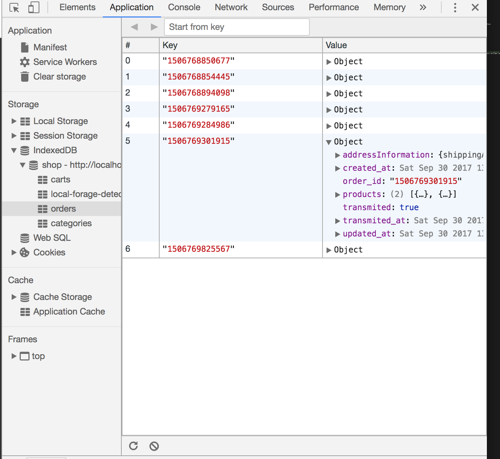
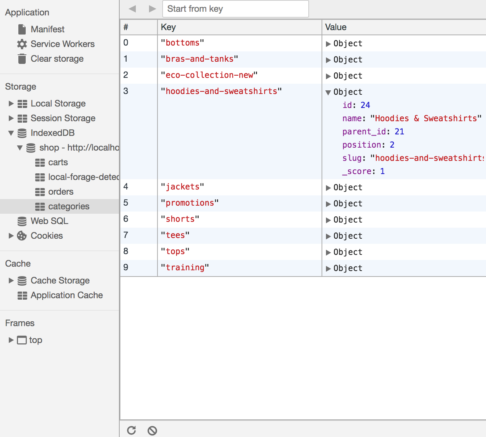
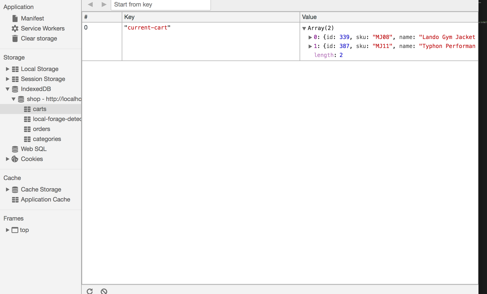

# Working with data

Vue storefront uses two primary data sources:

1. IndexedDb/WebSQL data store in the browser using [localForage](https://github.com/localForage/localForage)
2. Server data source via [vue-storefront-api](https://github.com/DivanteLtd/vue-storefront-api), which is compliant with Elasticsearch (regarding product catalog).

## Local data store

You can access localForage repositories through the `StorageManager` (`@vue-storefront/core/lib/storage-manager`) object anywhere in the code, BUT all data-related operations ___should___ be placed in Vuex stores.

Details on localForage API can be found [here](http://localforage.github.io/localForage/)

## Example Vuex store

Here you have an example of how the _Vuex_ store in a _Vue Storefront Module_ should be constructed. The _VSF Core Module_ itself is nothing more than [_Vuex module_](https://vuex.vuejs.org/guide/modules.html).

Let's take a look at `store` of `core/modules/checkout` module. [`index.ts`](https://github.com/DivanteLtd/vue-storefront/blob/master/core/modules/checkout/store/checkout/index.ts) file shows as follows : 

```js
import { Module } from 'vuex'
import actions from './actions'
import getters from './getters'
import mutations from './mutations'
import RootState from '@vue-storefront/core/types/RootState'
import CheckoutState from '../../types/CheckoutState'
import config from 'config'

export const checkoutModule: Module<CheckoutState, RootState> = {
  namespaced: true,
  state: {
    order: {},
    paymentMethods: [],
    shippingMethods: config.shipping.methods,
    personalDetails: {
      firstName: '',
      lastName: '',
      emailAddress: '',
      password: '',
      createAccount: false
    },
    shippingDetails: {
      firstName: '',
      lastName: '',
      country: '',
      streetAddress: '',
      apartmentNumber: '',
      city: '',
      state: '',
      region_id: 0,
      zipCode: '',
      phoneNumber: '',
      shippingMethod: ''
    },
    paymentDetails: {
      firstName: '',
      lastName: '',
      company: '',
      country: '',
      streetAddress: '',
      apartmentNumber: '',
      city: '',
      state: '',
      region_id: 0,
      zipCode: '',
      phoneNumber: '',
      taxId: '',
      paymentMethod: '',
      paymentMethodAdditional: {}
    },
    isThankYouPage: false,
    modifiedAt: 0
  },
  getters,
  actions,
  mutations
}

```

The actual parts of the _store_ have been separated into several files as _getters_, _mutations_, and _actions_. Parts are assembled here and exported as a _Module_.


## Data formats & validation

Data formats for vue-storefront and vue-storefront-api are the same JSON files.

The convention is that schemas are stored under `/core/modules/<module-name>/store/<model-name>.schema.json` - for example [Order schema](https://github.com/DivanteLtd/vue-storefront/blob/master/core/modules/order/store/order.schema.json).


### Orders

`Orders` repository stores all orders transmitted and to be transmitted (aka order queue) used by the Service Worker.



Here you have a [validation schema for order](https://github.com/DivanteLtd/vue-storefront/blob/master/core/store/modules/order/order.schema.json):

```json
{
  "order_id": "123456789",
  "created_at": "2017-09-28 12:00:00",
  "updated_at": "2017-09-28 12:00:00",
  "transmited_at": "2017-09-28 12:00:00",
  "transmited": false,
  "products": [
    {
      "sku": "product_dynamic_1",
      "qty": 1,
      "name": "Product one",
      "price": 19,
      "product_type": "simple"
    },
    {
      "sku": "product_dynamic_2",
      "qty": 1,
      "name": "Product two",
      "price": 54,
      "product_type": "simple"
    }
  ],
  "addressInformation": {
    "shippingAddress": {
      "region": "MH",
      "region_id": 0,
      "country_id": "PL",
      "street": ["Street name line no 1", "Street name line no 2"],
      "company": "Company name",
      "telephone": "123123123",
      "postcode": "00123",
      "city": "Cityname",
      "firstname": "John ",
      "lastname": "Doe",
      "email": "john@doe.com",
      "region_code": "MH",
      "sameAsBilling": 1
    },
    "billingAddress": {
      "region": "MH",
      "region_id": 0,
      "country_id": "PL",
      "street": ["Street name line no 1", "Street name line no 2"],
      "company": "abc",
      "telephone": "1111111",
      "postcode": "00123",
      "city": "Mumbai",
      "firstname": "Sameer",
      "lastname": "Sawant",
      "email": "john@doe.com",
      "prefix": "address_",
      "region_code": "MH"
    },
    "shipping_method_code": "flatrate",
    "shipping_carrier_code": "flatrate",
    "payment_method_code": "cashondelivery",
    "payment_method_additional": {} // Payment Method Payload (eg, stripe token)
  }
}
```

### Categories

`Categories` is a hash organized by category 'slug' (for example, for the category with name = 'Example category', the slug is 'example-category').



If the category has any child categories, you have access to them via the `children_data` property.

```json
{
  "id": 13,
  "parent_id": 11,
  "name": "Bottoms",
  "is_active": true,
  "position": 2,
  "level": 3,
  "product_count": 0,
  "children_data": [
    {
      "id": 18,
      "parent_id": 13,
      "name": "Pants",
      "is_active": true,
      "position": 1,
      "level": 4,
      "product_count": 156,
      "children_data": []
    },
    {
      "id": 19,
      "parent_id": 13,
      "name": "Shorts",
      "is_active": true,
      "position": 2,
      "level": 4,
      "product_count": 148,
      "children_data": []
    }
  ],
  "tsk": 1505573191094
}
```

### Carts

`Carts` is a store for a shopping cart with a default key `current-cart` representing a current shopping cart. Cart object is an array consisting of products with an additional field `qty` in the case when two or more items are ordered.



```json
[
  {
    "id": 26,
    "qty": 5,
    "sku": "24-WG081-blue",
    "name": "Sprite Stasis Ball 55 cm",
    "attribute_set_id": 12,
    "price": 23,
    "status": 1,
    "visibility": 1,
    "type_id": "simple",
    "created_at": "2017-09-16 13:46:48",
    "updated_at": "2017-09-16 13:46:48",
    "extension_attributes": [],
    "product_links": [],
    "tier_prices": [],
    "custom_attributes": null,
    "category": [],
    "tsk": 1505573582376,
    "description": "<p>The Sprite Stasis Ball gives you the toned abs, sides, and back you want by amping up your core workout. With bright colors and a burst-resistant design, it's a must-have for every hard-core exercise addict. Use for abdominal conditioning, balance training, yoga, or even physical therapy.</p> <ul> <li>Durable, burst-resistant design.</li> <li>Hand pump included.</li> </ul>",
    "image": "/l/u/luma-stability-ball.jpg",
    "small_image": "/l/u/luma-stability-ball.jpg",
    "thumbnail": "/l/u/luma-stability-ball.jpg",
    "color": "50",
    "options_container": "container2",
    "required_options": "0",
    "has_options": "0",
    "url_key": "sprite-stasis-ball-55-cm-blue",
    "tax_class_id": "2",
    "activity": "8,11",
    "material": "44",
    "gender": "80,81,82,83,84",
    "category_gear": "87",
    "size": "91"
  }
]
```
