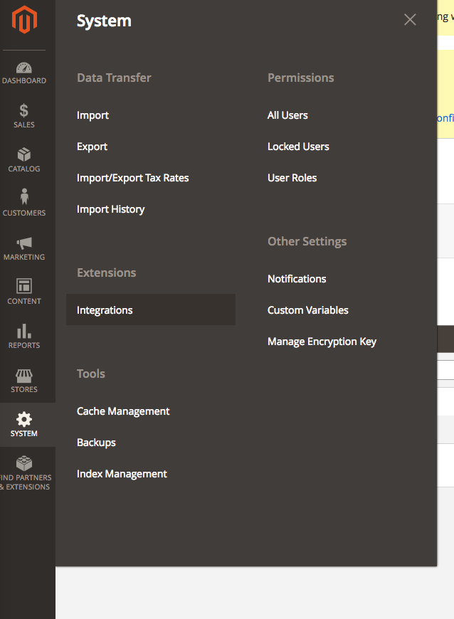
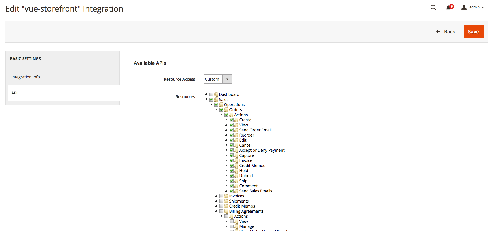
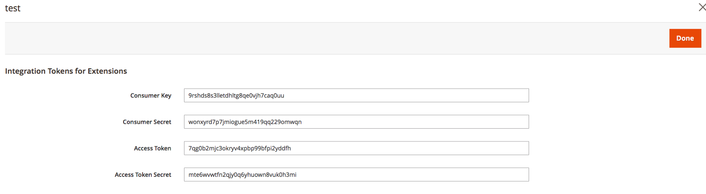

# Integration with Magento 2
## Using native Magento 2 module 
There is a native Magento 2 [module](https://github.com/vuestorefront/magento2-vsbridge-indexer) that synchronizes Magento 2 source data and **Vue Storefront** data store; *Elasticsearch*.   
[Magento 2 VSBridge Indexer](https://github.com/vuestorefront/magento2-vsbridge-indexer) has a few advantages. More than anything, it's faster and reliable.

## Using Magento 2 API via OAuth authorization
The tool is using Magento 2 API via OAuth authorization, so you need to prepare Magento Integration access at first. Go to your Magento 2 admin panel and click: System → Integrations.



Click _Add New Integration_ and fill in:
- Name (whatever)
- Your password to confirm the changes
- On the API Permissions tab, check the following resources:
  - Catalog
  - Sales
  - My Account
  - Carts
  - Stores > Settings > Configuration > Inventory Section
  - Stores > Taxes
  - Stores > Attributes > Product
- Save



In the result, you’ll click _Activate_ and get some OAuth access tokens:



## Integrating Magento 2 with your local instance

### Fast integration

The Magento2 data import is now integrated into `vue-storefront-api` for simplicity. It's still managed by the [mage2vuestorefront](https://github.com/vuestorefront/mage2vuestorefront), added as a dependency to `vue-storefront-api`.

After setting the `config.magento2.api` section using yours Magento 2 OAuth credentials:

```json
 "magento2": {
   "url": "http://magento2.demo-1.xyz.com",
   "imgUrl": "http://localhost:8080/media/catalog/product",
   "assetPath": "/../var/magento2-sample-data/pub/media",
   "magentoUserName": "",
   "magentoUserPassword": "",
   "httpUserName": "",
   "httpUserPassword": "",
   "api": {
     "url": "http://demo-magento2.vuestorefront.io/rest",
     "consumerKey": "byv3730rhoulpopcq64don8ukb8lf2gq",
     "consumerSecret": "u9q4fcobv7vfx9td80oupa6uhexc27rb",
     "accessToken": "040xx3qy7s0j28o3q0exrfop579cy20m",
     "accessTokenSecret": "7qunl3p505rubmr7u1ijt7odyialnih9"
   }
 },
```

You can run the following command to execute the full import of all the products, categories, and other important stuff to your Elasticsearch instance:

```bash
yarn mage2vs import
```

... or in multistore setup, you can run the same command with specified `store-code` parameter

```bash
 yarn mage2vs import --store-code=de
```

### Manual integration

First, you need to install [mage2vuestorefront ](https://github.com/vuestorefront/mage2vuestorefront):

```bash
git clone https://github.com/vuestorefront/mage2vuestorefront.git mage2vs
cd mage2vs/src
yarn install
```

Now edit the `src/config.js` file in your `mage2vuestorefront` directory to set the following section:

```js
magento: {
  url: process.env.MAGENTO_URL || "http://your-magento-url.com/rest/", <- change to your Magento 2 URL,
  consumerKey: process.env.MAGENTO_CONSUMER_KEY || 'alva6h6hku9qxrpfe02c2jalopx7od1q',
  consumerSecret: process.env.MAGENTO_CONSUMER_SECRET || '9tgfpgoojlx9tfy21b8kw7ssfu2aynpm',
  accessToken: process.env.MAGENTO_ACCESS_TOKEN || 'rw5w0si9imbu45h3m9hkyrfr4gjina8q',
  accessTokenSecret: process.env.MAGENTO_ACCESS_TOKEN_SECRET || '00y9dl4vpxgcef3gn5mntbxtylowjcc9',
},
```

As you can see, you can override the defaults by ENV variables as well.


The rest of the config.js entries point out to your `vue-storefront-api` based Docker and Redis instances, which are required by `mage2nosql` to work.

To make the full import, you should run the following commands (the sequence of commands is important ,  as, for example, `node cli.js categories` populates the Redis cache for further use of `node cli.js` products and so on).

```bash
node cli.js taxrule
node cli.js attributes
node cli.js categories
node cli.js productcategories
node cli.js products
```

It’s safe to run these commands over and over, as they’re doing `upsert` operation, so it inserts or updates the existing records.

`cli.js` has a lot of other modes to be run in—dynamic changes, queue support, etc. You may experiment with them, but remember ,  the basic sequence for syncing the whole Magento 2 database is like just shown.

## Synchronizing orders and Magento images

As you should have the products and categories already synchronized, you may want to send some orders back to Magento or synchronize the shopping carts in real time.

`vue-storefront-api` is responsible for this write access to Magento. You may want to edit your `conf/local.json` within the `vue-storefront-api` directory to set the OAuth Magento API access (`magento2` section):

```json
"magento2": {
    "url": "http://your-magento-url.com",
    "imgUrl": "http://your-magento-url.com/media/catalog/product",
    "assetPath": "/../var/magento2-sample-data/pub/media",
    "api": {
      "url": "http://your-magento-url.com/rest/",
      "consumerKey": "alva6h6hku9qxrpfe02c2jalopx7od1q",
      "consumerSecret": "9tgfpgoojlx9tfy21b8kw7ssfu2aynpm",
      "accessToken": "rw5w0si9imbu45h3m9hkyrfr4gjina8q",
      "accessTokenSecret": "00y9dl4vpxgcef3gn5mntbxtylowjcc9"
    }
},
```

To allow `vue-storefront-api` to resize your Magento images, please edit the `imgUrl` property under `magento2` section and add your Magento’s domain to `imageable` -> `whitelist`.

```json
"imageable": {
    "namespace": "",
    "maxListeners": 512,
    "imageSizeLimit": 1024,
    "timeouts": {
      "convert": 15000,
      "identify": 300,
      "download": 5000
    },
    "whitelist": {
      "allowedHosts": [
        ".*your-magento-url.com",
        ".*divante.pl",
        ".*vuestorefront.io",
        "localhost"
      ],
      "trustedHosts": [
        ".*your-magento-url.com",
        ".*divante.pl",
        ".*vuestorefront.io",
        "localhost"
      ]
    },
```

:::tip NOTE
After changing the config files you need to restart `yarn dev`
:::

After setting up Magento access, you just need to run the Order2Magento worker, which works on a Redis-based queue to process all the orders made by users.

```
yarn o2m
```

The code of this script is [located here](https://github.com/vuestorefront/vue-storefront-api/blob/master/src/worker/order_to_magento2.js) so you can easily check how it’s working.

Starting from Vue Storefront v1.6, now we have a special switch in `vue-storefront-api`: `config.orders.useServerQueue` which is set to `false` by default. With this option disabled, the `order_2_magento` process  is no longer needed, as the incoming orders are directly send to Magento 2. If it's set to `true`, the old behavior of the server-based Redis queues used to stack the orders first is being used.

## Synchronizing shopping carts

By default, shopping carts are not synchronized in real-time , only after the order is placed, Magento 2 cart is created, etc.

This was limiting behavior because you need to keep the user cart current all the time to get Magento 2 shopping-cart promotion rules into action .

We have an option for that! If you have the Magento 2 API configured within the `vue-storefront-api`, you just need to go to `vue-storefront/conf/local.json` and add

```js
synchronize: true;
```

to `cart` section. Please check the [default config for reference](https://github.com/vuestorefront/vue-storefront/blob/193cf44a6e936136fc19e22b45fe8dbc4b33f844/config/default.json#L8).
