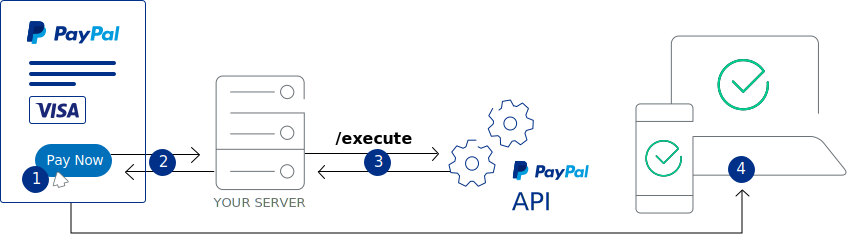

# PayPal payments support

Vue Storefront is supporting PayPal payments with PayPal Payment extension for [vue-storefront](https://github.com/vuestorefront/vue-storefront), by [Develo Design](https://www.develodesign.co.uk).

## The architecture




## Installation

By hand (preferer):

```shell
$ git clone git@github.com:develodesign/vsf-payment-paypal.git ./vue-storefront/src/modules/paypal
```

```json
"paypal": {
  "clientId": "",
  "endpoint": {
    "complete": "http://localhost:8080/api/ext/paypal/complete",
    "setExpressCheckout": "http://localhost:8080/api/ext/paypal/setExpressCheckout"
  }
}
```

## Registration the Paypal module

Open in you editor `./src/modules/index.ts`

```js
...
import { Paypal } from './paypal';

export const registerModules: VueStorefrontModule[] = [
  ...,
  Paypal
]
```

## Paypal payment Checkout Review

Under your theme `components/core/blocks/Checkout/OrderReview.vue` add the following import to your script

```js
import PaypalButton from '@develodesign/vsf-payment-paypal/components/Button'

export default {
  components: {
    ...
    PaypalButton
  },
  ...
  computed: {
    payment () {
      return this.$store.state.checkout.paymentDetails
    }
  },
```

And to your template add the paypal button before `button-full`:

```html
<paypal-button v-if="payment.paymentMethod === 'paypal_express'"/>
<button-full
  v-else
  @click.native="placeOrder"
  data-testid="orderReviewSubmit"
  class="place-order-btn"
  :disabled="$v.orderReview.$invalid"
>
  {{ $t('Place the order') }}
</button-full>
```

## PayPal payment API extension

Setup dependency to api:
`cd ../vue-storefront-api`
`yarn add -W @paypal/checkout-server-sdk`
`yarn add -W paypal-nvp-api`

Install extension to `vue-storefront-api`:

```shell
$ cp -fr src/modules/paypal/api/paypal ../vue-storefront-api/src/api/extensions/
```

Go to api config  `./vue-storefront-api/config/local.json` and register the Paypal Api extension:

```json
"registeredExtensions": [
    ...
    "paypal"
]
```

And add the `paypal` settings to `extensions` key:

Add the following also to your `config/local.json` need set `paypal.env` to `sandbox` or `live`.

```json
  "extensions": {
    "paypal": {
      "env": "sandbox",
      "clientId": "",
      "secret": "",
      "username": "",
      "password": "",
      "signature": ""
    },
    ...
  }
```

## Magento2 integration

Turn on Paypal Express and provide the API credentials using the built in Paypal module. Enable only Express Checkout.

Other Paypal methods are not supported or tested right now.

## Customization

Also we can use `paypal.style` option for more customizable PayPal button view. For more info [PayPal](https://developer.paypal.com/demo/checkout/#/pattern/checkout).

In Button.vue, the button takes prop styling

```json
"style": {
  "size": "small",
  "color": "gold",
  "shape": "pill"
}
```
