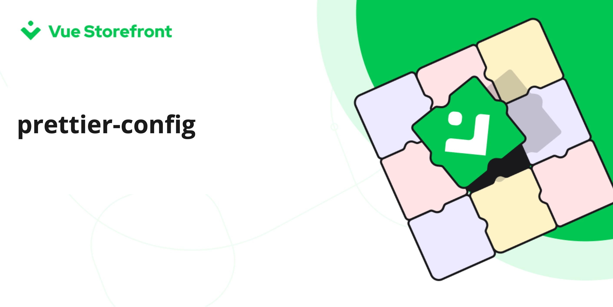

[]()

# @vue-storefront/prettier-config

> Common prettier configuration used in Vue Storefront projects

## Usage

#### Install
```bash
yarn add -D prettier @vue-storefront/prettier-config
```

#### Config `prettier.config.js`

```javascript
const config = require('@vuestorefront/prettier-config');

module.exports = config;
```