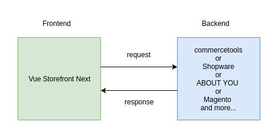
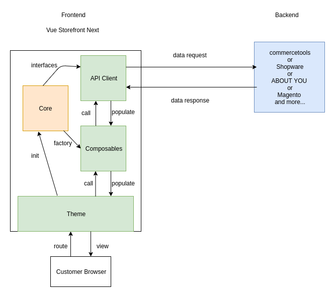

# What is Vue Storefront

_Vue Storefront_ is a ___headless e-commerce PWA frontend framework___ that may work with __any__ backend that you are already using via its API regardless of the platform, be it e-commerce, CMS, ERP, PIM, or anything else. 

We mean by 
 - __headless__ : Your e-commerce platform as a whole system can be built on top of a set of different technologies. No mandatory combination for the platform is required. Manifestation of _low coupling and high cohesion_ is here and will stay with us until the end. 
 - __e-commerce__ : Essentially _Vue Storefront_ was born as the e-commerce framework. By the nature of headless and microservice, however, you might connect it to whatever you set it to, say, a helper service for ERP, or versatile search features for PIM, and portable checkout for 3rd party payment kiosk, and so on. Limit is your imagination. 
 - __PWA__ : _PWA_ is the thing of future, it is designed to give best performance even on laggy mobile devices with native-like features from the beginning in order to satisfy your customers who are curious, rich, and impatient.
 - __framework__ : Even though _Vue Storefront_ is a set of atomic features, they should be guided as one by the conductor. We do so by gluing them through _interfaces_ and _factories_. We will dig this further later, but one thing to take away, they are quite flexible glues. 

Give me 7 minutes and you will grab : 

[[toc]]

## Technical problems

### Slow, unresponsive online shop

_Vue Storefront_ solves slow, unresponsive online shop problems as follows : 

- The page load time reduced significantly on average including categories, products, and checkout and all that. 
- Major features were cached offline so poor mobile carrier performance isn't outstanding. 
- When connected back to online, suspended processes returns to work without noticeable hassles for customers. 

Not only page load time but also __responsiveness as a whole from the page was instant and seamless__ just as you would expect from a native app, if not better. 

### Developer's dilemma for maintenance

#### Unwieldy decisions

1. How painful was it when you had to meticulously fix tremendous amount of changes without patterns while you just want to add/remove a simple feature, or upgrade the framework as they claim security risk is at stake? 

2. Another recall, how frustrated was it when you learned the other backend platform you didn't choose turned out better solution for your business, a lot better on many levels, but the cost of switching is even greater than the benefit of it you just learned? You were literally locked-in by tentative choices you made while you were naive.

Now, solution comes with _Vue Storefront_. 

 For the best experience when it comes to maintaining the framework, we divided the system into the smallest chunks until it's not meaningful to do so. ___Technically all parts are wrapped in as individual `npm` packages so switching from one version to another should be as easy as any `npm` command.___ In short, it has been built on the firm ground of _Mircroservice_ architecture. It also means you can swap a part in the system with other equivalent app or service with a simple command. (or with a few changes in configuration)

## In a nutshell, technically 
_Vue Storefront_ is made up of 4 layers as follows : 

_Data Layer_ : __API Client__ - This provides a friendly abstraction layer for your e-commerce backend over network. 

_Service Layer_ : __Composables__ - This contains business logic in _Vue.js_ framework

_Presentation Layer_ : __UI Components__ - _Vue Storefront_ has already launched its sister project [Storefront UI](https://www.storefrontui.io/) helping you build your UI and theme hands down.

_Framework Layer_ : __Nuxt__ - _Nuxt_ works as a glue for all the framework components even though it's not a must-use. 

_Vue Storefront_ is a set of independent `npm` packages taking various roles of the framework. It's really up to you _how much_ of the framework you will use in your project. You can cherry-pick any combination to your advantage. 

:::tip
_Vue Storefront_ packages are standalone which allows you to use them in __any__ Vue.js enviroment so it's not a must to use Nuxt. You can use _Vue Storefront_ packages with Vue CLI or even within your custom Vue.js codebase. All you need is know how to communicate with _Vue Storefront_, which is done via interfaces over API.
:::

## Backend Integration
_Vue Storefront_ is a frontend framework undoubtedly. It needs an e-commerce backend to fully function in its glory.
Here is the list of backend e-commerce integration already out in the field.

- about-you
- commercetools
- shopify

We will walk you with details of each integration in its dedicated guide. 

## Benefits you take
- Blazingly fast
- Works with any backend, CMS, ERP, PIM, and anything else that has API
- Server Side Rendered
- Progressive Web App
- Huge flexibility in changing third-party services

## Tech stack 
- [Vue.js](https://vuejs.org/v2/guide/)
- [Nuxt.js](https://nuxtjs.org/guide)
- SCSS
- [Storefront UI](https://www.storefrontui.io/) (optional)
- [TypeScript](https://www.typescriptlang.org/docs/home) (optional)