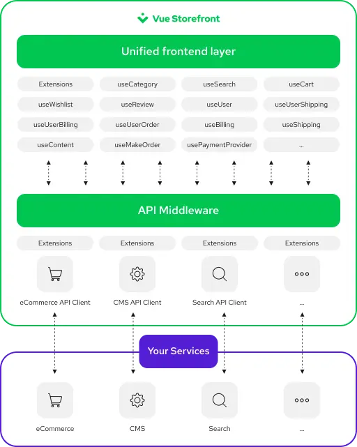

:::warning #TechForUkraine - We oppose Russia's unprovoked and unjustified attack on Ukraine

 

  

Russia launched a devastating, unprovoked, and unjustified attack on Ukraine. **Ukraine and its people need help** - if you are unable to help locally, by sheltering a fellow Ukrainian, you can also:

* Support the Ukraine Armed forces directly by sending funding to [NBU Special Account](https://bank.gov.ua/en/news/all/natsionalniy-bank-vidkriv-spetsrahunok-dlya-zboru-koshtiv-na-potrebi-armiyi)
* Help the [Ukrainian Red Cross Society](https://www.icrc.org/en/where-we-work/europe-central-asia/ukraine)
* Donate to [United Help Ukraine](https://unitedhelpukraine.org/)
* Donate to [Voices of Children](https://voices.org.ua/en/)
:::

---------

# Meet Vue Storefront

_Vue Storefront_ is a **_e-commerce frontend framework_** based on [Nuxt.js](https://nuxtjs.org/) that can work with any e-commerce backend API. Additionally, thanks to _low coupling and high cohesion_, it can connect to other services, giving you the freedom to work with the technologies you know and love, be it CMS, ERP, PIM, or anything else.

<figure style="text-align: center">
  
  <figcaption style="font-size: 0.9rem">(Click to zoom)</figcaption>
</figure>

## Features

### Short time to market

With Vue Storefront, you're getting a performant frontend connected to headless e-commerce, CMS, and other third-party platforms of your choice, along with hundreds of ready-to-use Vue Storefront and Nuxt.js modules for all standard functionalities. Thanks to them, you will save hundreds (or even thousands) of working hours, so you can focus on creating value for your product while leaving the heavy lifting to us!

### Lightning-fast online shop

By some estimates, up to 1% of users will leave your website for every 100ms of delay in page load time. With Vue Storefront, you can create a performant shop thanks to:

* using modern technologies for small bundle sizes and performance;
* using code splitting, lazy loading, and lazy hydration to only load what's needed at the moment;
* caching the resources, so the already visited pages are loaded instantly;
* preloading resources that might be needed in the future;
* hosting and executing as much as possible on the server, so the part served to the users is much lighter and faster compared to traditional SPA;

### Extensibility

Our list of supported and planned integrations on the [Integrations](./integrations) page gets longer every month. Additionally, there are hundreds of Nuxt modules you can use. You can browse them on the [Nuxt Modules](https://modules.nuxtjs.org/) website and [Awesome Nuxt](https://github.com/nuxt-community/awesome-nuxt) repository.

## Tech stack

The speed and flexibility of Vue Storefront wouldn't be possible without the great technologies that power it:

* [Vue.js 2](https://v2.vuejs.org/v2/guide)
* [Nuxt.js 2](https://nuxtjs.org/docs/get-started)
* [SCSS](https://sass-lang.com/) (optional)
* [Storefront UI](https://www.storefrontui.io/) (optional)
* [TypeScript](https://www.typescriptlang.org/docs/home) (optional)
* [Cypress](https://www.cypress.io/) (optional)

## What's next?

If you're already convinced to use Vue Storefront, check the [Installation](./general/installation.html) guide.

If you want to learn more, check out the [Introduction to Vue Storefront](./getting-started/introduction.html).
