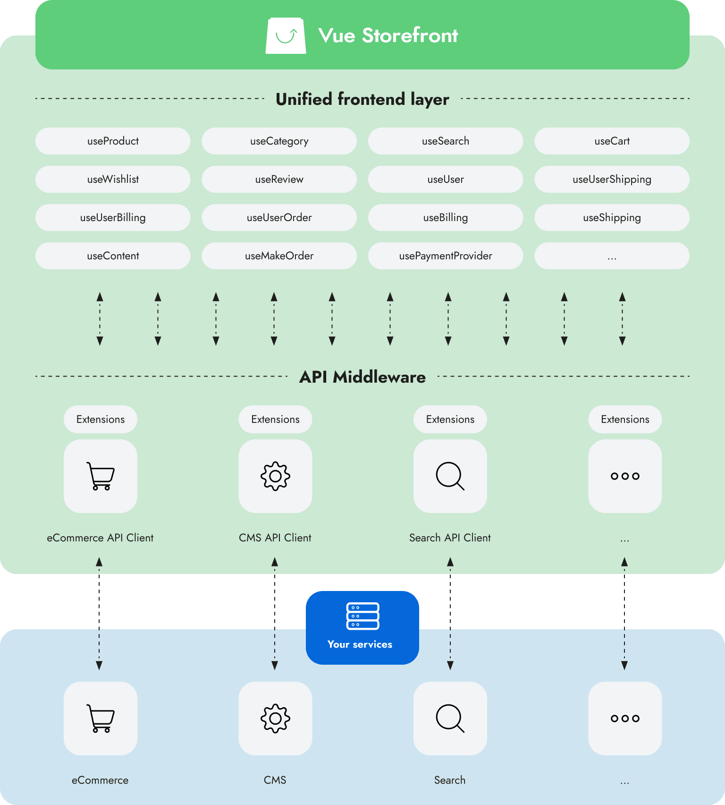

# Meet Vue Storefront

_Vue Storefront_ is a ___platform-agnostic e-commerce PWA frontend framework___ that can work with any e-commerce backend API. Additionally, thanks to _low coupling and high cohesion_, it can connect to other services, giving you the freedom to work with the technologies you know and love, be it CMS, ERP, PIM, or anything else.

<figure style="text-align: center">
  
  <figcaption style="font-size: 0.9rem">(Click to zoom)</figcaption>
</figure>

That's a mouthful, so let's break it down:
 - __platform-agnostic__ - we made it possible to work with any platform and service you already use, as long as it has an API like REST or GraphQL.
 - __e-commerce__ - today's shops are much more than just products and carts. That's why we made it easy to integrate other types of services, such as helper service for ERP, versatile search features for PIM, portable checkout for 3rd party payment kiosk, and more.
 - __PWA__ - it's the technology of the future, designed to give the best performance on any device, with native-like features to satisfy your customer's needs.
 - __frontend framework__ - _Vue Storefront_ is a set of modular features glued together using _interfaces_ and _factories_ and powered by [Nuxt.js](https://nuxtjs.org/).

## Features

### Short time to market

With Vue Storefront, you're getting a performant frontend connected to headless e-commerce, CMS, and other third-party platforms of your choice, along with hundreds of ready-to-use Vue Storefront and Nuxt.js modules for all standard functionalities. Thanks to them, you will save hundreds (or even thousands) of working hours, so you can focus on creating value for your product while leaving the heavy lifting to us!

### Lightning-fast online shop

By some estimates, up to 1% of users will leave your website for every 100ms of delay in page load time. With Vue Storefront, you can create a performant shop thanks to:
- using modern technologies for small bundle sizes and performance;
- using code splitting, lazy loading, and lazy hydration to only load what's needed at the moment;
- caching the resources, so the already visited pages are loaded instantly;
- preloading resources that might be needed in the future;
- hosting and executing as much as possible on the server, so the part served to the users is much lighter and faster compared to traditional SPA;

### Extensibility

Our list of supported and planned integrations on the [Integrations](./integrations) page gets longer every month. Additionally, there are hundreds of Nuxt modules you can use. You can browse them on the [Nuxt Modules](https://modules.nuxtjs.org/) website and [Awesome Nuxt](https://github.com/nuxt-community/awesome-nuxt) repository.

## Tech stack

The speed and flexibility of Vue Storefront wouldn't be possible without the great technologies that power it:

- [Vue.js](https://vuejs.org/v2/guide/)
- [Nuxt.js](https://nuxtjs.org/guide)
- [SCSS](https://sass-lang.com/)
- [Storefront UI](https://www.storefrontui.io/) (optional)
- [TypeScript](https://www.typescriptlang.org/docs/home) (optional)
- [Cypress](https://www.cypress.io/) (optional)

## What's next?

If you're already convinced to use Vue Storefront, check the [Installation](./general/installation.html) guide.

If you want to learn more, check out the [Key concepts](./general/key-concepts.html) behind Vue Storefront.
