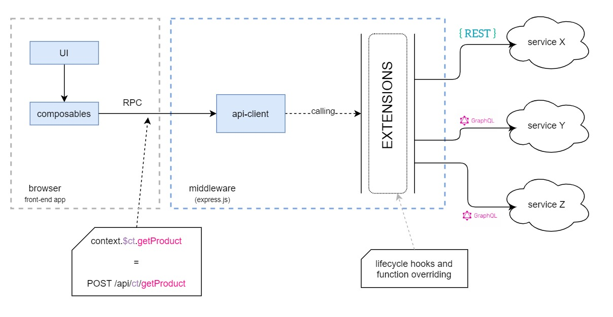

# Server middleware


## What is Vue Storefront Middleware and why we need it?

The Vue Storefront middleware is an express.js proxy that taking the requests from the front-end translates them to a certain integration and call-related API-client.

We have implemented it for a variety of reasons.

First of all, it allows us to provide a prover way of extensibility - As a developer, you have control of the requests and the responses in the given platform with extensions.

A front-end application sometimes needs an additional API endpoint - that's also possible since you have a server written in express.js.

All credentials for your platform are stored only on the backend side, there are no shared keys in the browser.

## How it works (in a nutshell)

The way of how it works represents the following diagram:

<center>
  
</center>

It was mentioned before that API-client is being called only on the middleware, but you still can access it on the front-end side - how is that possible?

When you access an API-client on the front-end side, you are accessing actually a stub, instead of a real API-client instance. This stub makes a call to the middleware (Remote Procedure Call), and ask for loading a specific integration, and executing specific function.

Middleware recognizes this by the tag name of integration and the function name that needs to be called.

When the middleware has loaded an API-client (integration) it proceeds to create a connection and make a requested API-client function call. Within this whole process, all of the extensions are being executed. Once the middleware has finished its job, the response backs to the front-end side as if it was transferred using a direct connection.


## Configuration

When it comes to configuration, you only need to tell middleware what the integrations you have along with their credentials. There is a dedicated config to do that called `middleware.config.js` that contains a section with integrations definition (`integrations`).

Each entry under this section starts with a tag name of given integration, and contains an object with the following fields:

- `location` - points to the package of the API-client, related to given integration (server entry point)
- `configuration` - contains a configuration of given integration, such as credentials and others
- `extensions` - a function that returns a extensions (jump to the next section)
- `customQueries` - section that contains custom queries (graphql only)

```js
module.exports = {
  integrations: {
    <TAG NAME>: {
      location: '@<integration-package>/server',
      configuration: {}
      extensions: (extensions) => extensions,
      customQeries: {}
    }
  }
};
```

## Extending Middleware

Middleware allows you to inject into the lifecycle of the entire network flow, starting with configuring a connection and ending with a final response. To use those things, we created an extension feature.

You can define as many extensions as you want. Remember they are always correlated with a specyfic API-client (integration). How they look like? Each extension has the followin structure:

```js
const extension = {
  name: 'extension-name',
  extendApiMethods: {
    getProduct: async () => { /* ... */ }
  },
  hooks: (req, res) => {
    return {
      beforeCreate: ({ configuration }) => configuration,
      afterCreate: ({ configuration }) => configuration,
      beforeCall: ({ configuration, callName, args }) => args,
      afterCall: ({ configuration, callName, args, response }) => response
    }
  }
}
```

- `name` - defines the unique name of an extension
- `extendApiMethods` - overides the original functions from API-client
- `hooks` - defines lifecycle hooks of API-client
- `hooks:beforeCreate` - called before API-client creates a connection, takes the given configuration as an argument, and must return the configuration. In this place, you can attach something else to the configuration or even change it.
- `hooks:afterCreate` - Similar to the previous one, but called after the connection has been created. It also returns a configuration and you can change it.
- `hooks:beforeCall` - Triggered before each API-client function. We have access to the configuration, function name, and its arguments. This function must return the arguments and based on the input parameters we can change it.
- `hooks:afterCall` - Triggered after each API-client function.We have access to the configuration, function name, and its arguments. This function must return the response and based on the input parameters we can attach something to it.


To register a created extension, we have to add it do the middleware config file:

```js
module.exports = {
  integrations: {
    <TAG NAME>: {
      location: '@<integration-package>/server',
      configuration: {}
      extensions: (extensions) => [
        ...extensions,
        {
          name: 'our-extension'
          hooks: () => { /* ... */}
        }
      ],
      customQeries: {}
    }
  }
};
```

## Separating middleware from Nuxt

By default, Vue Storefront middleware is running within the Nuxt.js process. Sometimes there is a need to disconnect it from the app, and run it as a separate instance, and independent process.

Since is the real express.js application, you can do this, by creating file:

```js
const { createServer } = require('@vue-storefront/middleware');
const { integrations } = require('./middleware.config');

const app = createServer({ integrations });

app.listen(8181, () => {
  console.log('Middleware started');
});
```

Now, when you run this using node, your middleware should work separately.

Additionally, you need to remove the middleware module entry from the nuxt.config.js and configure the domain, where your middleware is settled.

```js
export default {
  publicRuntimeConfig: {
    middlewareUrl: 'https://api.commerce.com'
  }
}
```
